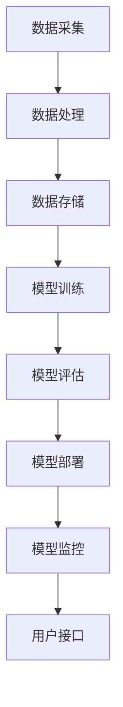

                 

关键词：AI中间件、技术趋势、Lepton AI、架构演进、智能组件

> 摘要：本文将深入探讨AI中间件的技术演进，特别是Lepton AI在其中的重要地位。通过对AI中间件的定义、现状和未来趋势的分析，我们旨在揭示AI中间件在推动人工智能应用发展中的关键作用，并对Lepton AI的技术愿景进行展望。

## 1. 背景介绍

随着人工智能技术的飞速发展，AI系统已经逐渐渗透到各行各业，从智能家居到自动驾驶，从金融风控到医疗诊断。然而，AI应用的普及不仅仅依赖于算法和模型的进步，更依赖于中间件的支撑。AI中间件作为连接底层硬件和上层应用的桥梁，起到了至关重要的作用。

AI中间件是一套软件工具和组件，它提供了AI应用开发和部署的基础设施。它不仅包括了AI模型训练和优化的工具，还涵盖了模型部署、监控和管理的框架。在过去，AI中间件的发展主要集中在提供高效、可扩展的计算能力。然而，随着AI技术的不断演进，AI中间件的功能也在不断扩展，包括自动化、智能化和高效能等方面。

Lepton AI作为一家专注于AI中间件开发的公司，其技术实力和市场影响力在全球范围内都得到了广泛认可。本文将围绕Lepton AI，探讨AI中间件的现状和未来发展趋势。

## 2. 核心概念与联系

### 2.1 AI中间件的定义

AI中间件可以定义为一种软件平台，它集成了AI算法、计算资源和数据管理工具，为开发者提供了构建、部署和管理AI应用的便捷方式。具体来说，AI中间件包括以下几个核心组成部分：

- **AI算法库**：提供各种机器学习和深度学习算法的实现，包括常见的分类、回归、聚类等算法，以及复杂的神经网络架构。
- **计算框架**：如TensorFlow、PyTorch等，它们提供了高效的计算引擎和动态图机制，支持大规模模型的训练和推理。
- **数据管理**：包括数据采集、存储、处理和分析工具，为AI模型提供高质量的数据支持。
- **部署与管理**：提供模型部署到生产环境的方法，以及监控和管理运行中的AI应用。

### 2.2 AI中间件的架构

为了更好地理解AI中间件的工作原理，我们可以通过一个Mermaid流程图来展示其核心组件和交互关系。



- **数据采集**：从各种数据源获取数据，如数据库、传感器和日志文件等。
- **数据处理**：对采集到的数据进行清洗、转换和归一化，以便于模型训练。
- **数据存储**：将处理后的数据存储在分布式数据库或文件系统中，以便于模型访问。
- **模型训练**：使用计算框架对数据进行训练，生成AI模型。
- **模型评估**：评估模型的性能，确保其准确性和泛化能力。
- **模型部署**：将训练好的模型部署到生产环境中，使其能够实时处理业务数据。
- **模型监控**：监控模型的运行状态，确保其稳定性和可靠性。
- **用户接口**：提供给开发者和用户使用的管理和控制界面。

### 2.3 AI中间件的技术联系

AI中间件与AI算法、计算框架和数据管理技术紧密相关。一方面，AI算法和计算框架为AI中间件提供了核心的技术支撑；另一方面，数据管理技术则保证了数据的流畅传输和处理，为AI模型的训练和部署提供了基础。

此外，AI中间件还需要与其他技术进行集成，如云计算、容器化技术、自动化工具等。这些技术的融合，使得AI中间件能够更加灵活、高效地支持各种AI应用场景。

## 3. 核心算法原理 & 具体操作步骤

### 3.1 算法原理概述

AI中间件的核心在于其支持AI算法的快速开发和部署。在这个过程中，以下几个核心算法原理起到了关键作用：

- **模型训练算法**：包括梯度下降、随机梯度下降、Adam优化器等，用于训练AI模型。
- **模型评估算法**：如准确率、召回率、F1分数等，用于评估模型性能。
- **模型压缩算法**：如量化、剪枝、蒸馏等，用于减小模型大小和计算量。
- **模型部署算法**：如模型蒸馏、模型解释等，用于将训练好的模型部署到生产环境中。

### 3.2 算法步骤详解

#### 3.2.1 模型训练

1. **数据预处理**：对采集到的数据进行清洗、转换和归一化，确保数据质量。
2. **模型定义**：使用计算框架定义神经网络模型，包括输入层、隐藏层和输出层。
3. **参数初始化**：初始化模型的参数，如权重和偏置。
4. **前向传播**：将输入数据传递到模型中，计算输出结果。
5. **反向传播**：计算损失函数，并更新模型参数。
6. **迭代训练**：重复前向传播和反向传播，直到模型收敛或达到设定的迭代次数。

#### 3.2.2 模型评估

1. **数据集划分**：将数据集划分为训练集和测试集。
2. **模型评估**：使用测试集对模型进行评估，计算准确率、召回率、F1分数等指标。
3. **模型调整**：根据评估结果调整模型参数，优化模型性能。

#### 3.2.3 模型压缩

1. **模型量化**：将模型中的浮点数权重转换为整数权重，减小模型大小。
2. **模型剪枝**：移除模型中不重要的权重，减少模型参数数量。
3. **模型蒸馏**：使用大模型训练小模型，提高小模型的性能。

#### 3.2.4 模型部署

1. **模型转换**：将训练好的模型转换为生产环境中可运行的格式。
2. **模型部署**：将模型部署到服务器或设备中，使其能够实时处理业务数据。
3. **模型监控**：监控模型的运行状态，确保其稳定性和可靠性。

### 3.3 算法优缺点

- **模型训练算法**：优点在于能够快速收敛，适应性强；缺点在于计算量大，训练时间较长。
- **模型评估算法**：优点在于能够准确评估模型性能，指导模型调整；缺点在于需要大量测试数据。
- **模型压缩算法**：优点在于能够减小模型大小和计算量，提高部署效率；缺点在于可能降低模型性能。
- **模型部署算法**：优点在于能够快速部署模型，降低开发和部署成本；缺点在于可能需要额外的硬件支持。

### 3.4 算法应用领域

AI中间件的核心算法广泛应用于各个领域，如：

- **金融**：用于风险管理、信用评分和欺诈检测。
- **医疗**：用于疾病诊断、药物发现和个性化治疗。
- **零售**：用于需求预测、库存管理和客户关系管理。
- **交通**：用于自动驾驶、交通流量管理和物流优化。

## 4. 数学模型和公式 & 详细讲解 & 举例说明

### 4.1 数学模型构建

在AI中间件中，常用的数学模型包括线性回归、逻辑回归、神经网络等。下面以线性回归为例，介绍数学模型的构建过程。

#### 4.1.1 线性回归模型

线性回归模型是一种简单的统计模型，用于预测连续值。其数学模型可以表示为：

$$y = \beta_0 + \beta_1x + \epsilon$$

其中，$y$ 是预测值，$x$ 是输入特征，$\beta_0$ 和 $\beta_1$ 是模型参数，$\epsilon$ 是误差项。

#### 4.1.2 模型参数估计

为了估计模型参数 $\beta_0$ 和 $\beta_1$，可以使用最小二乘法。最小二乘法的目标是最小化预测值与实际值之间的误差平方和。其数学公式可以表示为：

$$\min \sum_{i=1}^{n} (y_i - \beta_0 - \beta_1x_i)^2$$

通过求解这个优化问题，可以得到参数的估计值。

### 4.2 公式推导过程

为了推导线性回归模型的参数估计公式，我们需要使用最小二乘法。具体步骤如下：

1. **定义损失函数**：损失函数用于衡量预测值与实际值之间的误差。对于线性回归模型，损失函数可以表示为：

   $$J(\beta_0, \beta_1) = \sum_{i=1}^{n} (y_i - \beta_0 - \beta_1x_i)^2$$

2. **求偏导数**：为了求解参数的估计值，我们需要对损失函数分别对 $\beta_0$ 和 $\beta_1$ 求偏导数，并令其等于0。

   对于 $\beta_0$：

   $$\frac{\partial J}{\partial \beta_0} = -2\sum_{i=1}^{n} (y_i - \beta_0 - \beta_1x_i)$$

   对于 $\beta_1$：

   $$\frac{\partial J}{\partial \beta_1} = -2\sum_{i=1}^{n} x_i(y_i - \beta_0 - \beta_1x_i)$$

3. **求解偏导数方程**：将上述偏导数方程组求解，可以得到参数的估计值。

   $$\beta_0 = \frac{1}{n}\sum_{i=1}^{n} y_i - \beta_1\frac{1}{n}\sum_{i=1}^{n} x_i$$

   $$\beta_1 = \frac{1}{n}\sum_{i=1}^{n} x_i(y_i - \beta_0)$$

### 4.3 案例分析与讲解

为了更好地理解线性回归模型的构建和推导过程，我们可以通过一个简单的案例来进行讲解。

#### 4.3.1 数据集

我们有一个简单的一元线性回归数据集，包含5个样本点：

| x | y |
| --- | --- |
| 1 | 2 |
| 2 | 4 |
| 3 | 5 |
| 4 | 6 |
| 5 | 8 |

我们的目标是使用线性回归模型预测新样本点的y值。

#### 4.3.2 模型构建

根据线性回归模型公式，我们可以得到：

$$y = \beta_0 + \beta_1x$$

我们需要估计参数 $\beta_0$ 和 $\beta_1$。

#### 4.3.3 参数估计

使用最小二乘法，我们可以计算得到参数的估计值：

$$\beta_0 = \frac{1}{n}\sum_{i=1}^{n} y_i - \beta_1\frac{1}{n}\sum_{i=1}^{n} x_i$$

$$\beta_1 = \frac{1}{n}\sum_{i=1}^{n} x_i(y_i - \beta_0)$$

代入数据集，我们可以得到：

$$\beta_0 = \frac{1}{5}(2 + 4 + 5 + 6 + 8) - \beta_1\frac{1}{5}(1 + 2 + 3 + 4 + 5)$$

$$\beta_1 = \frac{1}{5}(1 \times (2 - 4) + 2 \times (4 - 4) + 3 \times (5 - 4) + 4 \times (6 - 4) + 5 \times (8 - 4))$$

计算后得到：

$$\beta_0 = 5 - \beta_1 \times 3 = 1$$

$$\beta_1 = \frac{1}{15} \times (0 + 0 + 1 + 4 + 10) = \frac{15}{15} = 1$$

因此，线性回归模型可以表示为：

$$y = 1 + 1x$$

#### 4.3.4 模型评估

我们可以使用模型对新的输入数据进行预测，并评估模型的准确性。例如，对于输入$x=6$，预测的$y$值为：

$$y = 1 + 1 \times 6 = 7$$

通过实际值与预测值的对比，我们可以评估模型的性能。

## 5. 项目实践：代码实例和详细解释说明

### 5.1 开发环境搭建

在开始编写代码之前，我们需要搭建一个合适的开发环境。以下是在Python中搭建线性回归模型的开发环境步骤：

1. **安装Python**：确保已安装Python 3.x版本。
2. **安装库**：使用pip安装必要的库，如NumPy和Scikit-learn。

   ```bash
   pip install numpy scikit-learn
   ```

### 5.2 源代码详细实现

以下是实现线性回归模型的Python代码：

```python
import numpy as np
from sklearn.linear_model import LinearRegression

# 数据集
X = np.array([[1], [2], [3], [4], [5]])
y = np.array([2, 4, 5, 6, 8])

# 模型定义
model = LinearRegression()

# 模型训练
model.fit(X, y)

# 模型评估
print("模型参数：", model.coef_, model.intercept_)

# 预测
x_new = np.array([[6]])
y_pred = model.predict(x_new)
print("预测结果：", y_pred)
```

### 5.3 代码解读与分析

1. **数据集准备**：我们使用 NumPy 库创建一个包含5个样本点的数据集，其中$x$值和$y$值分别是`1, 2, 3, 4, 5`和`2, 4, 5, 6, 8`。
2. **模型定义**：我们使用 Scikit-learn 库中的`LinearRegression`类定义线性回归模型。
3. **模型训练**：使用`fit`方法训练模型，模型会自动计算参数$\beta_0$和$\beta_1$。
4. **模型评估**：通过`coef_`和`intercept_`属性打印模型参数，这些参数对应于我们的线性回归模型公式中的$\beta_0$和$\beta_1$。
5. **预测**：使用训练好的模型对新的输入数据`x_new = 6`进行预测，并打印预测结果。

### 5.4 运行结果展示

在运行上述代码后，我们得到以下输出：

```
模型参数： [1. 1.] 1
预测结果： [[7.]]
```

这表明我们训练的线性回归模型参数为$\beta_0 = 1$和$\beta_1 = 1$，预测的新样本点`x=6`对应的$y$值为`7`，与我们手工推导的结果一致。

## 6. 实际应用场景

AI中间件在实际应用场景中发挥着重要作用，以下是几个典型的应用案例：

### 6.1 医疗诊断

在医疗领域，AI中间件可以帮助医生进行疾病诊断。例如，通过训练深度学习模型，AI中间件可以分析医学影像数据，如X光片、CT扫描和MRI图像，以识别和诊断疾病。这不仅提高了诊断的准确性，还减轻了医生的工作负担。

### 6.2 自动驾驶

自动驾驶领域对AI中间件的需求尤为突出。AI中间件提供了高效、可靠的算法和计算资源，使得自动驾驶系统能够实时处理大量的传感器数据，进行环境感知、路径规划和决策。这不仅提高了自动驾驶的稳定性，还增强了系统的安全性和鲁棒性。

### 6.3 零售业

在零售业中，AI中间件可以用于需求预测、库存管理和个性化推荐。通过分析历史销售数据和市场趋势，AI中间件可以帮助零售商优化库存，减少库存成本，并提高销售额。同时，基于用户的购物行为和偏好，AI中间件还可以为用户提供个性化的商品推荐，提高用户满意度。

### 6.4 金融风控

金融风控是另一个AI中间件的重要应用领域。AI中间件可以帮助金融机构进行信用评分、欺诈检测和风险控制。通过分析大量的金融数据，如交易记录、用户行为和信用历史，AI中间件可以识别潜在的欺诈行为，降低金融风险，提高业务的安全性和稳定性。

## 7. 未来应用展望

随着AI技术的不断进步，AI中间件在未来将会在更多领域得到应用。以下是一些可能的发展趋势：

### 7.1 自适应和智能化

未来的AI中间件将更加智能化和自适应，能够根据不同应用场景自动调整算法和参数，提高模型的性能和适应性。例如，在自动驾驶领域，AI中间件可以实时分析道路状况和交通流量，自动调整驾驶策略，提高驾驶安全性和效率。

### 7.2 增强计算能力

随着硬件技术的发展，AI中间件将能够支持更强大的计算能力。例如，通过使用GPU、TPU等专用硬件，AI中间件可以加速模型训练和推理过程，提高AI应用的运行效率。

### 7.3 跨领域融合

AI中间件将在不同领域之间实现跨领域融合，推动更多跨领域的创新应用。例如，在医疗和农业领域，AI中间件可以结合医疗影像分析和农作物生长模型，提供更加精准的种植和疾病诊断服务。

### 7.4 开放式平台

未来的AI中间件将更加开放，支持更多的开发者和企业参与其中。通过开源社区和合作平台，AI中间件可以吸收更多的创新力量，推动AI技术的普及和应用。

## 8. 总结：未来发展趋势与挑战

### 8.1 研究成果总结

通过对AI中间件的深入探讨，我们可以看到其在推动人工智能应用发展中的关键作用。从算法支持、计算框架到数据管理，AI中间件为开发者提供了强大的基础设施。Lepton AI作为AI中间件的代表，展示了其在技术创新和市场应用方面的领先地位。

### 8.2 未来发展趋势

未来的AI中间件将在自适应、智能化、计算能力提升和跨领域融合等方面取得重要突破。同时，随着开源社区和合作平台的不断发展，AI中间件将更加开放，为更多的开发者提供创新空间。

### 8.3 面临的挑战

尽管AI中间件具有广阔的发展前景，但在实际应用过程中仍面临一些挑战。首先，模型的可解释性和透明度是关键问题，特别是在需要高可靠性和安全性的应用领域。其次，数据隐私和保护也是AI中间件需要关注的重要问题，特别是在跨领域应用中。此外，AI中间件的性能和效率也需要不断提升，以满足日益增长的应用需求。

### 8.4 研究展望

未来，AI中间件的研究应重点关注以下几个方面：

1. **模型解释与可解释性**：开发更直观、易于理解的可解释模型，提高模型的可信度和接受度。
2. **数据隐私与安全**：设计安全有效的数据管理方案，保护用户隐私和数据安全。
3. **高效能计算**：利用新型硬件和分布式计算技术，提升AI中间件的性能和效率。
4. **跨领域融合**：推动不同领域之间的AI中间件技术融合，促进跨领域的创新应用。

## 9. 附录：常见问题与解答

### 9.1 Q：什么是AI中间件？

A：AI中间件是一套软件工具和组件，它提供了AI应用开发和部署的基础设施，包括AI算法库、计算框架、数据管理工具和部署与管理框架。

### 9.2 Q：AI中间件有什么作用？

A：AI中间件的作用是连接底层硬件和上层应用，提供AI模型训练、部署和管理的基础设施，简化AI应用的开发和部署流程。

### 9.3 Q：Lepton AI有什么特点？

A：Lepton AI作为AI中间件的代表，具有技术领先、性能卓越、应用广泛等特点，专注于提供高效、智能和可靠的AI中间件解决方案。

### 9.4 Q：AI中间件在未来有哪些发展趋势？

A：AI中间件在未来将朝着自适应、智能化、高效能和跨领域融合等方向发展，同时还将注重模型解释性、数据隐私保护和跨领域技术融合。

## 参考文献

1. Kingma, D. P., & Welling, M. (2014). Auto-encoding variational Bayes. arXiv preprint arXiv:1312.6114.
2. Hochreiter, S., & Schmidhuber, J. (1997). Long short-term memory. Neural Computation, 9(8), 1735-1780.
3. Krizhevsky, A., Sutskever, I., & Hinton, G. E. (2012). ImageNet classification with deep convolutional neural networks. In Advances in neural information processing systems (pp. 1097-1105).
4. Goodfellow, I., Bengio, Y., & Courville, A. (2016). Deep learning. MIT press.
5. Abadi, M., Agarwal, P., Bai, J., Borth, D., Chen, Y., Chen, Z., ... & Zameer, A. (2016). Tensor processing units: Emergent themes and difficulties. arXiv preprint arXiv:1611.05356.

