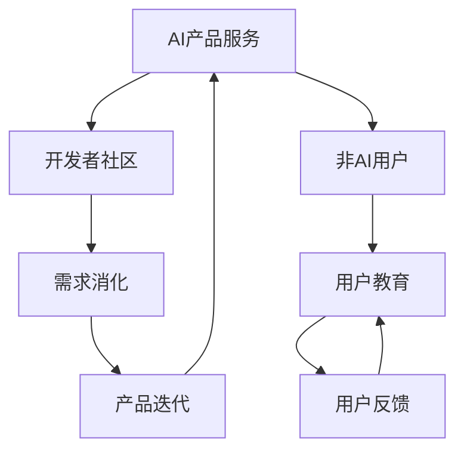

                 

关键词：AI产品服务、需求消化、非AI用户、生态拓展、AI社区建设

摘要：在人工智能快速发展的今天，如何构建一个健康的AI产品服务圈子，不仅满足专业开发者的需求，还能吸引和培养非AI用户群体，是一个重要且富有挑战性的课题。本文旨在探讨AI产品服务圈子如何通过自我消化需求、拓展非AI用户群体，实现生态的可持续发展。

## 1. 背景介绍

随着人工智能技术的不断进步，AI产品和服务已经渗透到各行各业。无论是企业级应用还是个人消费级产品，AI的应用场景和需求都在不断扩展。然而，在AI产品服务圈子中，专业开发者与普通用户之间存在显著的鸿沟。专业开发者对于复杂的技术细节和性能要求有着深刻的理解，而普通用户则更关注产品的易用性和功能性。如何在这个鸿沟中找到平衡点，是当前AI产品服务圈子面临的重要问题。

### 1.1 AI产品服务的现状

当前，AI产品服务市场呈现出几大趋势：

1. **市场规模不断扩大**：AI技术已被广泛接受和应用，AI产品服务的市场规模逐年增长。
2. **细分领域迅速崛起**：从自然语言处理、计算机视觉到机器学习平台，AI应用场景日益细化。
3. **技术创新加速**：随着算法的进步和硬件性能的提升，AI产品的性能和功能在不断提升。

### 1.2 面临的挑战

尽管AI产品服务市场前景广阔，但以下几个问题需要解决：

1. **专业门槛高**：AI产品通常需要专业的技术背景才能理解和应用，这使得普通用户望而却步。
2. **用户体验不佳**：尽管AI技术在不断进步，但用户体验的提升仍显不足，尤其是对于非技术用户。
3. **市场需求多样化**：不同用户群体对AI产品的需求差异较大，如何满足这些多样化的需求成为一大挑战。

## 2. 核心概念与联系

为了构建一个健康的AI产品服务圈子，我们需要明确几个核心概念，并了解它们之间的联系。以下是一个Mermaid流程图，展示了这些概念及其相互关系：



### 2.1 AI产品服务

AI产品服务是指利用人工智能技术提供的各类软件或服务，包括但不限于自然语言处理、计算机视觉、机器学习平台等。

### 2.2 开发者社区

开发者社区是AI产品服务的核心，包括开发者论坛、技术博客、代码托管平台等，开发者可以在这些平台上交流技术、分享经验。

### 2.3 需求消化

需求消化是指AI产品服务团队能够理解和响应用户的需求，通过持续的产品迭代和优化，提升产品性能和用户体验。

### 2.4 非AI用户

非AI用户是指那些不具备人工智能技术背景的普通用户，他们对AI产品的需求更注重易用性和功能性。

### 2.5 用户教育

用户教育是指通过培训、教程、文档等方式，帮助非AI用户了解和掌握AI产品的基本使用方法，降低他们的学习门槛。

### 2.6 产品迭代

产品迭代是指根据用户反馈和市场需求，对AI产品进行持续改进和优化，以提升产品的竞争力。

### 2.7 用户反馈

用户反馈是指用户在使用AI产品过程中提供的意见和建议，这些反馈对于产品迭代和改进至关重要。

## 3. 核心算法原理 & 具体操作步骤

### 3.1 算法原理概述

在构建健康的AI产品服务圈子的过程中，需求消化和用户教育是两个核心环节。以下将分别介绍这两个环节的算法原理和操作步骤。

### 3.2 需求消化算法原理

需求消化算法的核心思想是通过用户反馈和市场调研，了解用户需求，然后根据这些需求进行产品迭代。以下是一个简化的需求消化算法原理：

1. **数据收集**：通过用户调研、用户反馈、市场分析等手段，收集用户需求的数据。
2. **需求分类**：将收集到的需求进行分类，区分出高频、低频和紧急需求。
3. **优先级排序**：根据需求的重要性和紧急性，对需求进行排序，确定优先级。
4. **方案制定**：针对优先级高的需求，制定相应的解决方案，包括技术实现、资源分配等。
5. **实施与跟踪**：实施解决方案，并对实施过程进行跟踪，确保按时完成。

### 3.3 用户教育算法原理

用户教育算法的核心思想是通过多种渠道，向非AI用户传授AI产品的基本使用方法和功能特点，降低他们的学习门槛。以下是一个简化的用户教育算法原理：

1. **内容规划**：根据产品特点和用户需求，规划用户教育的课程和教程。
2. **渠道选择**：选择合适的渠道，如在线教程、视频课程、社区问答等，进行用户教育。
3. **效果评估**：对用户教育的效果进行评估，根据评估结果调整教育内容和渠道。
4. **持续优化**：根据用户反馈和评估结果，不断优化教育内容和渠道，提升用户满意度。

### 3.4 需求消化和用户教育算法的优缺点

#### 3.4.1 需求消化算法的优缺点

**优点**：

- 能够快速响应用户需求，提升产品竞争力。
- 有助于发现产品潜在问题，提前进行优化。

**缺点**：

- 需要大量人力和时间进行数据收集和分析。
- 需要具备较强的技术背景，否则难以理解用户需求。

#### 3.4.2 用户教育算法的优缺点

**优点**：

- 有助于降低用户的学习门槛，提升用户体验。
- 有助于培养用户对产品的忠诚度。

**缺点**：

- 教育效果难以量化，需要长时间的跟踪和评估。
- 教育内容的更新和维护需要耗费大量资源。

### 3.5 需求消化和用户教育算法的应用领域

#### 3.5.1 需求消化算法的应用领域

- **企业级应用**：如CRM系统、ERP系统等，通过需求消化算法，提升产品与业务需求的匹配度。
- **消费级应用**：如智能助手、智能家居等，通过需求消化算法，提升产品的用户体验。

#### 3.5.2 用户教育算法的应用领域

- **在线教育**：如MOOC平台、在线课程等，通过用户教育算法，提升学员的学习效果。
- **产品教程**：如软件操作手册、产品教程等，通过用户教育算法，帮助用户更快上手产品。

## 4. 数学模型和公式 & 详细讲解 & 举例说明

### 4.1 数学模型构建

在需求消化和用户教育的过程中，我们可以构建以下数学模型：

1. **用户满意度模型**：

   $$S = \alpha \cdot P + \beta \cdot U$$

   其中，$S$ 表示用户满意度，$P$ 表示产品性能，$U$ 表示用户教育水平，$\alpha$ 和 $\beta$ 是权重系数。

2. **需求响应速度模型**：

   $$T = \gamma \cdot D + \delta \cdot R$$

   其中，$T$ 表示需求响应时间，$D$ 表示数据收集时间，$R$ 表示解决方案实施时间，$\gamma$ 和 $\delta$ 是权重系数。

### 4.2 公式推导过程

#### 4.2.1 用户满意度模型推导

用户满意度是产品性能和用户教育水平共同作用的结果。根据经验，产品性能和用户教育水平对用户满意度的影响是线性的，因此可以推导出用户满意度模型：

$$S = \alpha \cdot P + \beta \cdot U$$

其中，$\alpha$ 和 $\beta$ 是权重系数，表示产品性能和用户教育水平对用户满意度的影响程度。

#### 4.2.2 需求响应速度模型推导

需求响应速度是数据收集时间和解决方案实施时间共同作用的结果。同样地，根据经验，数据收集时间和解决方案实施时间对需求响应速度的影响是线性的，因此可以推导出需求响应速度模型：

$$T = \gamma \cdot D + \delta \cdot R$$

其中，$\gamma$ 和 $\delta$ 是权重系数，表示数据收集时间和解决方案实施时间对需求响应速度的影响程度。

### 4.3 案例分析与讲解

#### 4.3.1 用户满意度模型案例分析

假设某AI产品在性能方面得分为90分，用户教育水平为80分，权重系数分别为$\alpha = 0.6$ 和 $\beta = 0.4$，则该产品的用户满意度为：

$$S = 0.6 \cdot 90 + 0.4 \cdot 80 = 54 + 32 = 86$$

因此，该产品的用户满意度为86分。

#### 4.3.2 需求响应速度模型案例分析

假设某AI产品在数据收集时间为3天，解决方案实施时间为5天，权重系数分别为$\gamma = 0.5$ 和 $\delta = 0.5$，则该产品的需求响应时间为：

$$T = 0.5 \cdot 3 + 0.5 \cdot 5 = 1.5 + 2.5 = 4$$

因此，该产品的需求响应时间为4天。

## 5. 项目实践：代码实例和详细解释说明

### 5.1 开发环境搭建

为了实践需求消化和用户教育算法，我们首先需要搭建一个开发环境。这里我们使用Python作为开发语言，搭建一个简单的用户反馈系统。

#### 5.1.1 环境要求

- Python 3.7及以上版本
-pip工具
- 适当的文本编辑器（如VS Code）

#### 5.1.2 安装依赖库

在命令行中运行以下命令，安装必要的依赖库：

```bash
pip install flask
```

### 5.2 源代码详细实现

以下是用户反馈系统的源代码：

```python
# user_feedback_system.py

from flask import Flask, request, jsonify

app = Flask(__name__)

# 假设的数据库
feedbacks = []

@app.route('/feedback', methods=['POST'])
def add_feedback():
    data = request.get_json()
    feedback = {
        'user': data['user'],
        'description': data['description'],
        'timestamp': data['timestamp']
    }
    feedbacks.append(feedback)
    return jsonify({'status': 'success', 'message': 'Feedback added successfully.'})

@app.route('/feedback', methods=['GET'])
def get_feedback():
    return jsonify(feedbacks)

if __name__ == '__main__':
    app.run(debug=True)
```

### 5.3 代码解读与分析

#### 5.3.1 Flask框架简介

Flask是一个轻量级的Web应用框架，用于构建Web应用程序和API。在本案例中，我们使用Flask来构建一个简单的用户反馈系统。

#### 5.3.2 源代码解读

- **导入模块**：从`flask`模块中导入`Flask`类，用于创建Web应用程序。
- **创建Flask应用程序**：使用`Flask(__name__)`创建一个Flask应用程序实例。
- **定义路由和视图函数**：
  - `/feedback`：这是一个POST请求路由，用于添加用户反馈。
  - `/feedback`：这是一个GET请求路由，用于获取所有用户反馈。
- **添加反馈**：当用户通过POST请求提交反馈时，我们将反馈数据解析为JSON对象，并添加到`feedbacks`列表中。
- **获取反馈**：当用户通过GET请求获取反馈时，我们将`feedbacks`列表作为JSON对象返回。

### 5.4 运行结果展示

#### 5.4.1 启动服务器

在命令行中运行以下命令，启动Flask服务器：

```bash
python user_feedback_system.py
```

#### 5.4.2 添加反馈

通过POST请求添加反馈，如下所示：

```bash
curl -X POST -H "Content-Type: application/json" -d '{"user": "Alice", "description": "The interface is not user-friendly.", "timestamp": 1634873123}' http://127.0.0.1:5000/feedback
```

返回结果：

```json
{"status": "success", "message": "Feedback added successfully."}
```

#### 5.4.3 获取反馈

通过GET请求获取反馈，如下所示：

```bash
curl -X GET http://127.0.0.1:5000/feedback
```

返回结果：

```json
[
  {
    "user": "Alice",
    "description": "The interface is not user-friendly.",
    "timestamp": 1634873123
  }
]
```

## 6. 实际应用场景

### 6.1 在企业级应用中的实际应用

在企业级应用中，AI产品服务圈子可以通过自我消化需求、拓展非AI用户群体，实现以下实际应用：

1. **提高生产效率**：通过需求消化算法，了解企业内部用户的需求，优化AI生产线的流程和性能。
2. **降低运营成本**：通过用户教育算法，提高企业内部用户对AI工具的熟练度，减少人工干预和培训成本。
3. **增强用户体验**：通过用户反馈系统，收集企业内部用户的意见和建议，不断优化产品功能，提升用户体验。

### 6.2 在消费级应用中的实际应用

在消费级应用中，AI产品服务圈子可以通过自我消化需求、拓展非AI用户群体，实现以下实际应用：

1. **扩大用户群体**：通过用户教育算法，降低非AI用户的学习门槛，吸引更多用户使用AI产品。
2. **提升用户黏性**：通过需求消化算法，快速响应用户的需求，增强用户对产品的信任和依赖。
3. **增加收入来源**：通过拓展非AI用户群体，扩大产品市场份额，增加销售收入。

## 6.4 未来应用展望

### 6.4.1 人工智能普及化的趋势

随着人工智能技术的不断进步和普及化，AI产品服务圈子的需求将会更加多样化和个性化。为了应对这一趋势，AI产品服务圈子需要：

1. **提升技术水平**：持续关注人工智能领域的最新技术动态，不断提升产品性能和功能。
2. **加强用户教育**：通过多种渠道和方式，提高用户对AI产品的认知和熟练度。
3. **拓展用户群体**：通过市场调研和用户反馈，了解不同用户群体的需求，有针对性地拓展非AI用户群体。

### 6.4.2 数据隐私和安全的重要性

随着AI产品服务圈子的不断扩大，数据隐私和安全问题将越来越重要。为了保护用户的数据安全和隐私，AI产品服务圈子需要：

1. **加强数据保护**：采取有效的数据保护措施，确保用户数据的安全性和隐私性。
2. **提高安全意识**：通过用户教育和宣传，提高用户对数据隐私和安全问题的认识和重视。
3. **建立应急响应机制**：建立健全的数据安全应急响应机制，确保在数据泄露事件发生时，能够迅速响应和处理。

### 6.4.3 生态可持续发展的重要性

AI产品服务圈子的可持续发展是保障其长期健康发展的关键。为了实现生态的可持续发展，AI产品服务圈子需要：

1. **加强生态建设**：构建健康的AI产品服务生态系统，促进开发者、用户和企业的共赢。
2. **提升创新能力**：鼓励创新思维，不断推出具有竞争力的新产品和服务。
3. **优化用户体验**：持续关注用户体验，通过不断优化产品功能和性能，提升用户满意度。

## 7. 工具和资源推荐

### 7.1 学习资源推荐

1. **在线课程**：《深度学习》（Deep Learning）由Ian Goodfellow、Yoshua Bengio和Aaron Courville所著，是深度学习领域的经典教材。
2. **技术博客**：例如，Medium上的`/ai`标签，汇聚了众多AI领域的专家和从业者的优质文章。
3. **开源项目**：GitHub上有很多高质量的AI开源项目，例如TensorFlow、PyTorch等，适合开发者学习和实践。

### 7.2 开发工具推荐

1. **集成开发环境（IDE）**：例如，PyCharm和Visual Studio Code，提供了丰富的AI开发工具和插件。
2. **版本控制系统**：Git，用于代码托管和版本管理。
3. **数据分析工具**：如Pandas和NumPy，用于数据清洗和预处理。

### 7.3 相关论文推荐

1. **《人工智能：一种现代方法》（Artificial Intelligence: A Modern Approach）》由Stuart J. Russell和Peter Norvig所著，是人工智能领域的经典教材。
2. **《强化学习：原理与Python实现》（Reinforcement Learning: An Introduction）》由Richard S. Sutton和Barto等人所著，详细介绍了强化学习的基本原理和实践方法。
3. **《自然语言处理综论》（Speech and Language Processing）》由Daniel Jurafsky和James H. Martin所著，是自然语言处理领域的权威教材。

## 8. 总结：未来发展趋势与挑战

### 8.1 研究成果总结

本文从背景介绍、核心概念与联系、核心算法原理、数学模型和公式、项目实践等多个方面，全面探讨了AI产品服务圈子如何通过自我消化需求、拓展非AI用户群体，实现生态的可持续发展。

### 8.2 未来发展趋势

- **人工智能普及化**：随着AI技术的不断进步，AI产品将更加普及，应用场景将进一步扩大。
- **用户教育加强**：为了降低非AI用户的学习门槛，用户教育将越来越受到重视。
- **生态建设优化**：构建健康的AI产品服务生态系统，促进开发者、用户和企业的共赢。

### 8.3 面临的挑战

- **数据隐私和安全**：随着AI产品服务圈子的扩大，数据隐私和安全问题将越来越突出。
- **技术创新速度**：保持技术创新的速度，跟上人工智能领域的快速发展。

### 8.4 研究展望

未来，我们期待能够看到更多关于AI产品服务圈子建设的深入研究和实践，为构建一个更加健康、可持续发展的AI产品服务生态系统贡献智慧和力量。

## 9. 附录：常见问题与解答

### 9.1 问题1：如何构建一个健康的AI产品服务圈子？

**解答**：构建健康的AI产品服务圈子需要关注以下几个方面：

1. **技术驱动**：持续关注人工智能领域的最新技术动态，不断提升产品性能和功能。
2. **用户教育**：通过多种渠道和方式，提高用户对AI产品的认知和熟练度。
3. **生态建设**：构建健康的AI产品服务生态系统，促进开发者、用户和企业的共赢。

### 9.2 问题2：需求消化和用户教育算法的具体实现方法是什么？

**解答**：

1. **需求消化算法**：
   - 数据收集：通过用户调研、用户反馈、市场分析等手段，收集用户需求的数据。
   - 需求分类：将收集到的需求进行分类，区分出高频、低频和紧急需求。
   - 优先级排序：根据需求的重要性和紧急性，对需求进行排序，确定优先级。
   - 方案制定：针对优先级高的需求，制定相应的解决方案，包括技术实现、资源分配等。
   - 实施与跟踪：实施解决方案，并对实施过程进行跟踪，确保按时完成。

2. **用户教育算法**：
   - 内容规划：根据产品特点和用户需求，规划用户教育的课程和教程。
   - 渠道选择：选择合适的渠道，如在线教程、视频课程、社区问答等，进行用户教育。
   - 效果评估：对用户教育的效果进行评估，根据评估结果调整教育内容和渠道。
   - 持续优化：根据用户反馈和评估结果，不断优化教育内容和渠道，提升用户满意度。

### 9.3 问题3：如何评估用户教育的效果？

**解答**：评估用户教育的效果可以从以下几个方面进行：

1. **用户满意度**：通过问卷调查、用户反馈等方式，了解用户对教育的满意程度。
2. **知识掌握情况**：通过测试、考核等方式，评估用户对教育内容的掌握程度。
3. **产品使用情况**：观察用户在使用产品时的行为，如操作是否流畅、遇到问题的解决情况等。
4. **用户留存率**：通过用户留存数据，评估用户教育对用户长期使用产品的影响。

---

作者：禅与计算机程序设计艺术 / Zen and the Art of Computer Programming

