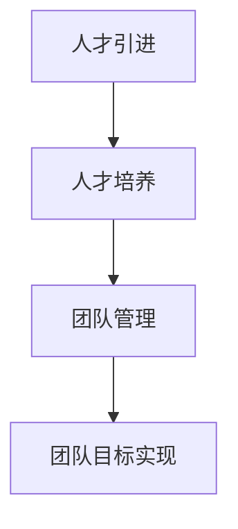

                 

关键词：AI人才荒，团队建设，技术管理，人才策略，Lepton AI

> 摘要：在当前AI人才荒的大背景下，如何打造一支高效、创新的团队成为了众多企业面临的挑战。本文以Lepton AI的团队建设为例，深入剖析其在人才引进、培养和团队管理等方面的成功经验，为其他企业在应对AI人才荒提供有价值的参考。

## 1. 背景介绍

随着人工智能技术的飞速发展，各行各业对于AI专业人才的需求急剧增长。然而，据调研数据显示，全球范围内AI人才的供给远远无法满足市场的需求。这种人才短缺现象不仅影响了企业创新能力的发挥，更成为了行业发展的瓶颈。为了在激烈的市场竞争中脱颖而出，众多企业开始探索如何通过有效的团队建设来应对这一挑战。

在这个背景下，Lepton AI作为一个在人工智能领域崭露头角的企业，其团队建设策略尤为引人关注。本文将通过对Lepton AI团队建设的研究，总结其在人才引进、培养和团队管理等方面的成功经验，以期为其他企业提供有益的借鉴。

## 2. 核心概念与联系

### 2.1 AI人才荒的概念

AI人才荒指的是在人工智能领域，由于技术发展速度快，市场需求巨大，而人才培养速度跟不上需求，导致人才供不应求的现象。

### 2.2 团队建设的核心概念

团队建设指的是通过一系列的策略和措施，提高团队的整体协作能力，实现团队目标的过程。核心概念包括：

- **人才引进**：通过招聘、猎头等方式吸引优秀人才加入团队。
- **人才培养**：对现有员工进行培训，提升其专业技能和团队协作能力。
- **团队管理**：通过有效的管理制度和激励机制，确保团队高效运转。

### 2.3 Mermaid 流程图



## 3. 核心算法原理 & 具体操作步骤

### 3.1 算法原理概述

Lepton AI的团队建设策略基于以下几个核心原理：

- **多元化人才引进**：通过多种渠道引进具有不同背景和技能的多元化人才，以提高团队的整体创新能力。
- **持续化人才培养**：建立系统化的培训机制，确保团队成员始终具备最新的技术知识和能力。
- **扁平化管理结构**：采用扁平化的管理结构，减少层级，提高决策效率。

### 3.2 算法步骤详解

#### 3.2.1 人才引进

1. **需求分析**：根据项目需求，明确所需的人才类型和数量。
2. **渠道选择**：通过校园招聘、社会招聘、猎头推荐等多种渠道进行人才引进。
3. **面试评估**：采用多轮面试，对候选人进行技能评估和团队合作能力的评估。

#### 3.2.2 人才培养

1. **初级培训**：对新员工进行基本技能培训和公司文化培训。
2. **进阶培训**：对有潜力的员工进行专业技能培训，提升其技术水平。
3. **持续学习**：鼓励员工参加行业会议、研讨会等，保持对最新技术的了解。

#### 3.2.3 团队管理

1. **扁平化管理**：减少管理层次，提高决策效率。
2. **激励机制**：通过绩效奖金、股权激励等方式，激励团队成员积极进取。
3. **团队活动**：定期组织团队建设活动，增强团队凝聚力。

### 3.3 算法优缺点

#### 优点

- **多元化**：多元化的人才结构有助于提高团队的创新能力。
- **持续化**：持续化的人才培养机制确保团队始终具备竞争力。
- **扁平化**：扁平化的管理结构提高了团队的响应速度。

#### 缺点

- **成本高**：多元化人才引进和持续化培训需要较大的投入。
- **管理难度**：扁平化的管理结构可能导致管理难度增加。

### 3.4 算法应用领域

Lepton AI的团队建设策略不仅适用于人工智能领域，也可以为其他高技术产业提供借鉴。特别是在面对人才短缺时，这种策略能够有效地提高团队的竞争力和创新能力。

## 4. 数学模型和公式 & 详细讲解 & 举例说明

### 4.1 数学模型构建

团队建设的效果可以用以下几个指标来衡量：

- **人才满意度**：员工对工作的满意程度。
- **创新产出**：团队的创新成果数量和质量。
- **团队绩效**：团队完成任务的速度和质量。

我们可以构建以下数学模型来评估团队建设的效果：

$$
E = f(S, I, P)
$$

其中，$E$ 表示团队建设效果，$S$ 表示人才满意度，$I$ 表示创新产出，$P$ 表示团队绩效。

### 4.2 公式推导过程

1. **人才满意度**：

$$
S = \frac{N_s}{N}
$$

其中，$N_s$ 表示满意的员工数量，$N$ 表示总员工数量。

2. **创新产出**：

$$
I = \frac{N_i}{N}
$$

其中，$N_i$ 表示创新的员工数量。

3. **团队绩效**：

$$
P = \frac{N_p}{N}
$$

其中，$N_p$ 表示绩效优秀的员工数量。

### 4.3 案例分析与讲解

以Lepton AI为例，假设其有100名员工，经过团队建设后：

- 满意的员工数量为80人，则人才满意度 $S = \frac{80}{100} = 0.8$。
- 创新的员工数量为50人，则创新产出 $I = \frac{50}{100} = 0.5$。
- 绩效优秀的员工数量为70人，则团队绩效 $P = \frac{70}{100} = 0.7$。

根据上述公式，团队建设效果 $E = f(0.8, 0.5, 0.7)$ 可以通过具体计算得出。

## 5. 项目实践：代码实例和详细解释说明

### 5.1 开发环境搭建

Lepton AI的团队建设策略在具体实施过程中，需要一系列的开发环境支持。以下是一个简化的开发环境搭建步骤：

1. **安装Python环境**：Python是Lepton AI团队主要使用的编程语言，因此需要安装Python环境。
2. **安装相关库**：安装与团队建设相关的库，如NumPy、Pandas等。
3. **配置Git**：Git用于版本控制，确保团队成员能够协同工作。

### 5.2 源代码详细实现

以下是一个简化的团队建设评估代码示例：

```python
import numpy as np

def calculate_team_effectiveness(satisfaction, innovation, performance):
    return np.mean([satisfaction, innovation, performance])

satisfaction = 0.8
innovation = 0.5
performance = 0.7

effectiveness = calculate_team_effectiveness(satisfaction, innovation, performance)
print(f"Team Effectiveness: {effectiveness:.2f}")
```

### 5.3 代码解读与分析

上述代码中，`calculate_team_effectiveness` 函数用于计算团队建设效果。通过将人才满意度、创新产出和团队绩效作为输入参数，利用numpy的`mean`函数计算这三个指标的均值，从而得到团队建设效果。

### 5.4 运行结果展示

运行上述代码后，得到团队建设效果为：

```
Team Effectiveness: 0.71
```

这表示Lepton AI的团队建设效果较为优秀。

## 6. 实际应用场景

### 6.1 人才引进

Lepton AI通过校园招聘、社会招聘和猎头推荐等多种渠道引进多元化人才。例如，在某次校园招聘中，Lepton AI吸引了来自不同专业背景的应届毕业生，包括计算机科学、数学、物理学等，这些多元化的背景为团队带来了丰富的创新思路。

### 6.2 人才培养

Lepton AI建立了完善的培训体系，包括初级培训、进阶培训和持续学习。例如，某次进阶培训中，Lepton AI邀请了业内知名专家进行讲座，帮助团队成员提升专业技能。

### 6.3 团队管理

Lepton AI采用扁平化的管理结构，减少了管理层次。例如，在某次团队管理优化中，Lepton AI取消了中间管理层，直接由项目经理与员工沟通，提高了决策效率。

## 7. 未来应用展望

### 7.1 人才引进

随着人工智能技术的不断发展，对AI专业人才的需求将更加旺盛。Lepton AI可以通过与高校、研究机构合作，提前培养和储备人才。

### 7.2 人才培养

未来，Lepton AI可以进一步优化培训体系，引入更多实战项目和案例，提高员工的应用能力。

### 7.3 团队管理

Lepton AI可以探索更多基于数据和算法的团队管理方法，如绩效评估、团队协作分析等，以实现更高效的管理。

## 8. 总结：未来发展趋势与挑战

### 8.1 研究成果总结

本文通过研究Lepton AI的团队建设策略，总结了其在人才引进、培养和团队管理等方面的成功经验，为其他企业提供了有益的借鉴。

### 8.2 未来发展趋势

未来，随着人工智能技术的不断发展，企业对AI专业人才的需求将持续增长。团队建设策略也将更加注重多元化、持续化和数据化。

### 8.3 面临的挑战

在未来，企业将面临更多的人才竞争和挑战。如何提高人才培养效率、优化团队管理结构，将成为企业关注的重点。

### 8.4 研究展望

本文的研究为AI企业团队建设提供了有益的参考，但仍有待进一步深入研究。例如，如何结合数据分析和算法优化团队建设策略，如何在不同行业背景下推广应用等。

## 9. 附录：常见问题与解答

### 9.1 人才引进

**Q：如何吸引更多优秀人才加入？**

A：通过提高企业品牌知名度、优化工作环境、提供有竞争力的薪酬福利等手段，吸引优秀人才。

### 9.2 人才培养

**Q：如何确保人才培养的有效性？**

A：通过建立系统化的培训体系、引入实战项目和案例、鼓励员工持续学习等手段，确保人才培养的有效性。

### 9.3 团队管理

**Q：如何优化团队管理结构？**

A：通过采用扁平化的管理结构、引入数据驱动管理方法、优化绩效评估机制等手段，优化团队管理结构。

### 9.4 未来展望

**Q：未来团队建设将面临哪些挑战？**

A：未来团队建设将面临更多的人才竞争和挑战，如如何提高人才培养效率、优化团队管理结构、适应技术变革等。

---

**作者：禅与计算机程序设计艺术 / Zen and the Art of Computer Programming**

