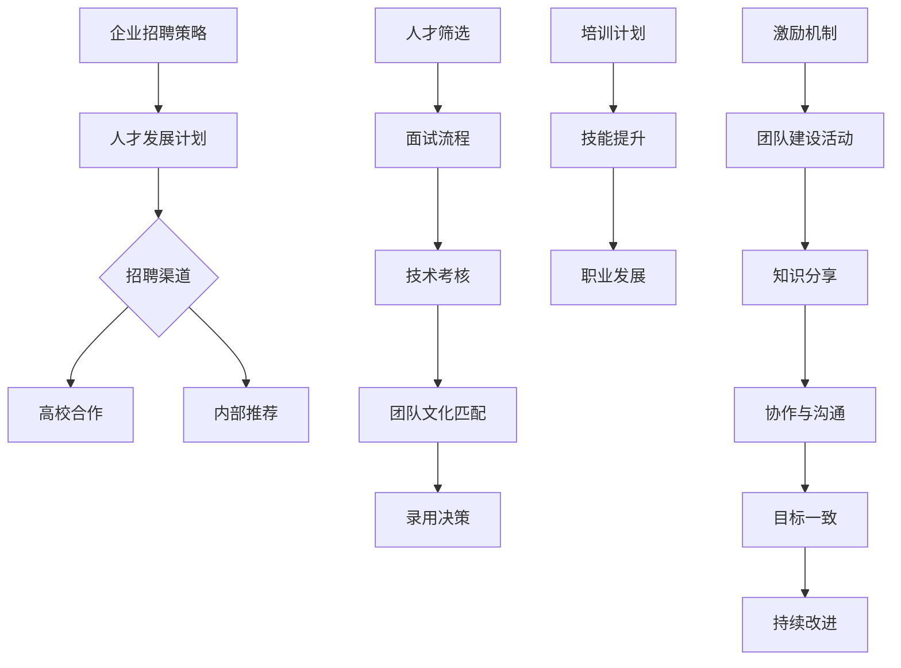

                 

关键词：AI人才荒、团队建设、Lepton AI、人工智能、人才培养、人才策略

> 摘要：本文以Lepton AI的团队建设为例，探讨在当前AI人才荒背景下，企业如何通过有效的策略和措施，打造出高绩效、创新驱动的人工智能团队，从而在激烈的市场竞争中突围而出。

## 1. 背景介绍

近年来，随着人工智能技术的迅猛发展，各行各业对于AI人才的需求日益增加。然而，现实情况是，全球范围内的AI人才储备远远无法满足这种高速增长的需求。据相关数据统计，全球AI人才缺口已超过1000万人。这种人才荒现象在中国尤为突出，严重制约了国内人工智能产业的发展。为了在竞争中占据有利地位，越来越多的企业开始关注如何通过有效的团队建设策略来应对这一挑战。

### 1.1 Lepton AI简介

Lepton AI是一家专注于人工智能解决方案的创新型企业，成立于2018年。公司致力于将先进的人工智能技术应用于各行各业，提供智能识别、自然语言处理、智能推荐等领域的解决方案。在短短几年内，Lepton AI凭借其强大的技术实力和创新能力，赢得了众多客户的信任和好评。然而，随着业务的快速发展，Lepton AI也面临着AI人才荒的困扰。

### 1.2 AI人才荒的挑战

- **招聘困难**：高水平的AI人才稀缺，导致企业招聘周期长、难度大。
- **人才流失**：高薪挖角和更好的职业发展机会导致现有人才流失。
- **项目延误**：由于缺乏合适的人才，项目进度受到影响，延误交付。
- **创新受限**：人才不足限制了企业在技术创新上的突破和发展。

## 2. 核心概念与联系

为了应对AI人才荒，Lepton AI采取了一系列策略和措施，构建了一个高效的人工智能团队。以下是核心概念与联系的Mermaid流程图：



### 2.1 企业招聘策略

Lepton AI在招聘策略上采取了多元化的方式，不仅通过传统招聘网站发布职位，还与多所高校建立了合作关系，开设实习岗位，为毕业生提供就业机会。此外，内部推荐也成为公司招聘的重要渠道。

### 2.2 人才发展计划

公司重视员工的专业成长，为员工提供系统的培训计划和职业发展路径。通过定期的技术培训、外部专家讲座以及内部的学术交流，不断提升团队的整体技术水平。

### 2.3 人才筛选与面试流程

在人才筛选方面，Lepton AI注重候选人的实际能力和团队文化匹配度。面试流程包括技术考核和团队文化评估，确保新成员能够快速融入团队。

### 2.4 团队文化建设

团队文化建设是Lepton AI团队建设的核心。公司通过多种形式的团队建设活动，促进员工之间的协作与沟通，营造开放、包容、创新的企业文化。

## 3. 核心算法原理 & 具体操作步骤

### 3.1 算法原理概述

Lepton AI的核心算法是基于深度学习和大数据分析，旨在提供高效、精准的人工智能解决方案。具体而言，算法包括以下几个关键步骤：

- **数据预处理**：对大量原始数据进行清洗、去噪、标准化等处理，确保数据质量。
- **特征提取**：利用神经网络技术提取数据中的关键特征，为后续建模提供基础。
- **模型训练**：通过训练大量样本数据，优化模型参数，提高模型的预测准确性。
- **模型评估**：使用测试数据集对模型进行评估，调整模型参数，提高模型性能。

### 3.2 算法步骤详解

#### 3.2.1 数据预处理

数据预处理是算法的基础步骤。具体操作包括：

1. **数据清洗**：去除数据中的错误记录、异常值和重复记录。
2. **去噪**：对噪声数据进行滤波处理，提高数据质量。
3. **标准化**：对数据进行归一化或标准化处理，使得不同特征之间具有可比性。

#### 3.2.2 特征提取

特征提取是利用神经网络技术对数据进行建模的关键步骤。具体操作包括：

1. **卷积神经网络（CNN）**：用于图像和视频数据特征提取。
2. **循环神经网络（RNN）**：用于处理序列数据，如文本、时间序列等。
3. **自编码器（Autoencoder）**：用于降维和特征提取。

#### 3.2.3 模型训练

模型训练是算法的核心步骤。具体操作包括：

1. **选择合适的模型**：根据业务需求和数据特点，选择合适的模型架构。
2. **数据划分**：将数据集划分为训练集、验证集和测试集。
3. **训练模型**：使用训练集对模型进行训练，优化模型参数。
4. **模型优化**：使用验证集对模型进行优化，提高模型性能。

#### 3.2.4 模型评估

模型评估是确保模型性能的关键步骤。具体操作包括：

1. **指标选择**：根据业务需求，选择合适的评价指标，如准确率、召回率、F1分数等。
2. **评估模型**：使用测试集对模型进行评估，评估模型性能。
3. **模型调整**：根据评估结果，调整模型参数，提高模型性能。

### 3.3 算法优缺点

#### 优点

- **高效性**：深度学习算法能够处理大量数据，提高模型预测准确性。
- **灵活性**：神经网络模型可以根据业务需求进行灵活调整和优化。
- **泛化能力**：通过训练大量样本数据，模型具有良好的泛化能力。

#### 缺点

- **计算复杂度**：深度学习算法需要大量计算资源，对硬件要求较高。
- **数据依赖性**：模型性能依赖于数据质量和数据量。
- **可解释性**：深度学习模型的内部机制较为复杂，难以解释和理解。

### 3.4 算法应用领域

Lepton AI的深度学习算法广泛应用于多个领域，包括：

- **智能识别**：如人脸识别、物体识别等。
- **自然语言处理**：如文本分类、机器翻译等。
- **智能推荐**：如商品推荐、内容推荐等。
- **金融风控**：如欺诈检测、信用评估等。

## 4. 数学模型和公式 & 详细讲解 & 举例说明

### 4.1 数学模型构建

Lepton AI的人工智能解决方案基于以下数学模型：

- **线性回归**：用于拟合数据中的线性关系。
- **逻辑回归**：用于分类问题，如二分类或多分类。
- **神经网络**：用于复杂的非线性问题，如图像识别和自然语言处理。

### 4.2 公式推导过程

以神经网络为例，假设我们有一个简单的单层神经网络，包含一个输入层、一个隐藏层和一个输出层。输入层有 \(n\) 个神经元，隐藏层有 \(m\) 个神经元，输出层有 \(k\) 个神经元。神经元的激活函数采用 \(f(x) = \sigma(x) = \frac{1}{1 + e^{-x}}\)。

#### 4.2.1 前向传播

前向传播的过程如下：

1. **输入层到隐藏层的传播**：

   \(z_{ij} = \sum_{p=1}^{n} w_{pj}x_p + b_j\)

   \(a_{ij} = f(z_{ij})\)

   其中，\(z_{ij}\) 表示隐藏层第 \(i\) 个神经元的输入，\(a_{ij}\) 表示隐藏层第 \(i\) 个神经元的输出，\(w_{pj}\) 表示输入层第 \(p\) 个神经元到隐藏层第 \(j\) 个神经元的权重，\(b_j\) 表示隐藏层第 \(j\) 个神经元的偏置。

2. **隐藏层到输出层的传播**：

   \(z_{ik} = \sum_{j=1}^{m} w_{jk}a_{ij} + b_k\)

   \(y_k = f(z_{ik})\)

   其中，\(z_{ik}\) 表示输出层第 \(k\) 个神经元的输入，\(y_k\) 表示输出层第 \(k\) 个神经元的输出，\(w_{jk}\) 表示隐藏层第 \(j\) 个神经元到输出层第 \(k\) 个神经元的权重，\(b_k\) 表示输出层第 \(k\) 个神经元的偏置。

#### 4.2.2 反向传播

反向传播的过程如下：

1. **计算输出层误差**：

   \(d_{k} = y_k - t_k\)

   其中，\(d_{k}\) 表示输出层第 \(k\) 个神经元的误差，\(y_k\) 表示输出层第 \(k\) 个神经元的输出，\(t_k\) 表示输出层第 \(k\) 个神经元的期望输出。

2. **计算隐藏层误差**：

   \(e_{ij} = d_k \cdot w_{jk} \cdot (1 - a_{ij}) \cdot a_{ij}\)

   其中，\(e_{ij}\) 表示隐藏层第 \(i\) 个神经元对输出层第 \(k\) 个神经元的误差，\(d_k\) 表示输出层第 \(k\) 个神经元的误差，\(w_{jk}\) 表示隐藏层第 \(j\) 个神经元到输出层第 \(k\) 个神经元的权重，\(a_{ij}\) 表示隐藏层第 \(i\) 个神经元的输出。

3. **更新权重和偏置**：

   \(w_{jk} \leftarrow w_{jk} - \alpha \cdot e_{ij} \cdot a_{ij}\)

   \(b_k \leftarrow b_k - \alpha \cdot e_{ij}\)

   \(w_{pj} \leftarrow w_{pj} - \alpha \cdot e_{ij} \cdot x_p\)

   \(b_j \leftarrow b_j - \alpha \cdot e_{ij}\)

   其中，\(\alpha\) 表示学习率。

### 4.3 案例分析与讲解

假设我们有一个二分类问题，输入层有 2 个神经元（特征），隐藏层有 3 个神经元，输出层有 1 个神经元。训练数据集包含 1000 个样本，其中 500 个为正样本，500 个为负样本。

#### 4.3.1 前向传播

1. **初始化权重和偏置**：

   \(w_{1j} \sim U(-1, 1)\), \(w_{2j} \sim U(-1, 1)\), \(b_j \sim U(-1, 1)\)

2. **输入层到隐藏层的传播**：

   \(z_{11} = w_{11}x_1 + w_{12}x_2 + b_1\)

   \(z_{21} = w_{21}x_1 + w_{22}x_2 + b_2\)

   \(z_{31} = w_{31}x_1 + w_{32}x_2 + b_3\)

   \(a_{11} = f(z_{11})\)

   \(a_{21} = f(z_{21})\)

   \(a_{31} = f(z_{31})\)

3. **隐藏层到输出层的传播**：

   \(z_{1} = w_{11}a_{11} + w_{21}a_{21} + w_{31}a_{31} + b_1\)

   \(y_1 = f(z_{1})\)

#### 4.3.2 反向传播

1. **计算输出层误差**：

   \(d_1 = y_1 - t_1\)

2. **计算隐藏层误差**：

   \(e_{11} = d_1 \cdot w_{11} \cdot (1 - a_{11}) \cdot a_{11}\)

   \(e_{21} = d_1 \cdot w_{21} \cdot (1 - a_{21}) \cdot a_{21}\)

   \(e_{31} = d_1 \cdot w_{31} \cdot (1 - a_{31}) \cdot a_{31}\)

3. **更新权重和偏置**：

   \(w_{11} \leftarrow w_{11} - \alpha \cdot e_{11} \cdot a_{11}\)

   \(w_{21} \leftarrow w_{21} - \alpha \cdot e_{11} \cdot a_{21}\)

   \(w_{31} \leftarrow w_{31} - \alpha \cdot e_{11} \cdot a_{31}\)

   \(b_1 \leftarrow b_1 - \alpha \cdot e_{11}\)

   \(w_{12} \leftarrow w_{12} - \alpha \cdot e_{21} \cdot a_{11}\)

   \(w_{22} \leftarrow w_{22} - \alpha \cdot e_{21} \cdot a_{21}\)

   \(w_{32} \leftarrow w_{32} - \alpha \cdot e_{21} \cdot a_{31}\)

   \(b_2 \leftarrow b_2 - \alpha \cdot e_{21}\)

   \(w_{13} \leftarrow w_{13} - \alpha \cdot e_{31} \cdot a_{11}\)

   \(w_{23} \leftarrow w_{23} - \alpha \cdot e_{31} \cdot a_{21}\)

   \(w_{33} \leftarrow w_{33} - \alpha \cdot e_{31} \cdot a_{31}\)

   \(b_3 \leftarrow b_3 - \alpha \cdot e_{31}\)

## 5. 项目实践：代码实例和详细解释说明

### 5.1 开发环境搭建

为了实现Lepton AI的深度学习算法，我们需要搭建一个合适的技术栈。以下是推荐的技术环境：

- **编程语言**：Python
- **深度学习框架**：TensorFlow或PyTorch
- **计算平台**：GPU加速（如NVIDIA Tesla或GPU云服务）

### 5.2 源代码详细实现

以下是一个简单的深度学习模型实现示例，使用TensorFlow框架：

```python
import tensorflow as tf
from tensorflow.keras.models import Sequential
from tensorflow.keras.layers import Dense, Dropout

# 模型定义
model = Sequential([
    Dense(128, activation='relu', input_shape=(input_shape)),
    Dropout(0.2),
    Dense(64, activation='relu'),
    Dropout(0.2),
    Dense(1, activation='sigmoid')
])

# 模型编译
model.compile(optimizer='adam',
              loss='binary_crossentropy',
              metrics=['accuracy'])

# 模型训练
model.fit(x_train, y_train, batch_size=128, epochs=10, validation_data=(x_val, y_val))

# 模型评估
model.evaluate(x_test, y_test)
```

### 5.3 代码解读与分析

#### 5.3.1 模型定义

在这个示例中，我们定义了一个简单的全连接神经网络，包含三个层：输入层、隐藏层和输出层。输入层有128个神经元，隐藏层有64个神经元，输出层有1个神经元。激活函数采用ReLU和Sigmoid函数。

#### 5.3.2 模型编译

模型编译阶段，我们指定了优化器（Adam）、损失函数（binary_crossentropy）和评价指标（accuracy）。

#### 5.3.3 模型训练

模型训练阶段，我们使用训练数据集进行训练，指定批次大小为128，训练周期为10个周期。同时，我们使用验证数据集进行模型验证。

#### 5.3.4 模型评估

模型评估阶段，我们使用测试数据集对训练好的模型进行评估，获取模型的准确率。

## 6. 实际应用场景

Lepton AI的深度学习算法已经在多个实际应用场景中取得了显著成果：

- **智能识别**：应用于安防监控、交通管理等领域，提高了识别效率和准确性。
- **自然语言处理**：应用于智能客服、智能翻译等领域，提升了用户体验。
- **智能推荐**：应用于电商、新闻推荐等领域，提高了用户满意度。
- **金融风控**：应用于欺诈检测、信用评估等领域，降低了风险。

### 6.1 未来应用展望

随着人工智能技术的不断发展，Lepton AI预计将在更多领域实现突破：

- **医疗健康**：利用人工智能进行疾病预测和诊断，提高医疗水平。
- **智能制造**：通过人工智能优化生产流程，提高生产效率。
- **智慧城市**：通过人工智能提升城市管理水平和居民生活质量。
- **教育领域**：通过人工智能实现个性化教育和智能辅导。

## 7. 工具和资源推荐

### 7.1 学习资源推荐

- **在线课程**：Coursera、Udacity、edX等平台提供丰富的深度学习课程。
- **书籍推荐**：《深度学习》、《神经网络与深度学习》等经典教材。
- **GitHub**：众多优秀的开源项目，方便学习和实践。

### 7.2 开发工具推荐

- **编程语言**：Python
- **深度学习框架**：TensorFlow、PyTorch
- **计算平台**：GPU加速（如NVIDIA Tesla或GPU云服务）

### 7.3 相关论文推荐

- **经典论文**：《A Theoretical Framework for Back-Propagating Neural Networks》、《Convolutional Neural Networks for Visual Recognition》等。
- **最新论文**：关注顶级会议和期刊，如NeurIPS、ICML、CVPR等。

## 8. 总结：未来发展趋势与挑战

### 8.1 研究成果总结

Lepton AI通过一系列团队建设和算法优化策略，成功应对了AI人才荒的挑战，实现了在人工智能领域的快速发展。公司已取得多项研究成果，并在实际应用中取得了显著成果。

### 8.2 未来发展趋势

随着人工智能技术的不断成熟，未来发展趋势包括：

- **模型压缩与优化**：提高模型运行效率和资源利用率。
- **跨领域应用**：将人工智能技术应用于更多领域，实现跨界融合。
- **可解释性**：提高模型的可解释性，满足实际应用需求。

### 8.3 面临的挑战

未来，Lepton AI将面临以下挑战：

- **人才竞争**：全球范围内的人才竞争将更加激烈。
- **技术更新**：人工智能技术发展迅速，需要不断学习和更新知识。
- **数据安全**：确保数据安全和隐私保护。

### 8.4 研究展望

未来，Lepton AI将继续致力于人工智能技术的创新和应用，为社会发展贡献更多力量。在团队建设方面，公司将持续优化人才策略，提升团队整体竞争力。

## 9. 附录：常见问题与解答

### 9.1 问题1：AI人才荒如何解决？

解答：通过多元化招聘策略、高校合作、内部推荐等方式，拓宽人才渠道。同时，提供系统的培训和职业发展路径，提升员工技能和满意度。

### 9.2 问题2：如何评估深度学习模型的性能？

解答：通过评估指标，如准确率、召回率、F1分数等。同时，可以使用交叉验证等方法，提高评估结果的可靠性。

### 9.3 问题3：如何优化深度学习模型的性能？

解答：通过调整模型结构、优化超参数、增加数据量等方法，提高模型性能。此外，可以使用模型压缩技术，降低模型复杂度。

## 作者署名

作者：禅与计算机程序设计艺术 / Zen and the Art of Computer Programming
----------------------------------------------------------------

以上是完整的文章内容。如需进一步修改或补充，请告知。祝您撰写顺利！

