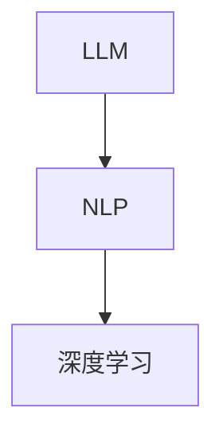

                 

 在当前人工智能技术飞速发展的背景下，大型语言模型（LLM）已经成为了许多领域的重要工具，从自然语言处理到智能客服、内容生成等应用都离不开其强大的功能。然而，随着LLM的应用日益广泛，其潜在伦理问题也逐渐引起了广泛关注。本文将探讨LLM发展中的道德考量，以期为相关研究和实践提供有价值的参考。

## 关键词

- AI伦理学
- 大型语言模型（LLM）
- 道德考量
- 数据隐私
- 偏见问题
- 责任归属

## 摘要

本文首先概述了AI伦理学的基本概念，探讨了在LLM发展中遇到的道德问题，包括数据隐私、偏见问题以及责任归属等方面。接着，通过具体案例分析了这些问题在实际应用中的体现，并提出了一些可能的解决方案和未来研究方向。

## 1. 背景介绍

近年来，人工智能技术的发展日新月异，特别是深度学习和自然语言处理（NLP）领域的突破，使得大型语言模型（LLM）应运而生。LLM通过大量文本数据的训练，能够生成高质量的自然语言文本，广泛应用于智能客服、内容生成、机器翻译等领域。然而，随着LLM的广泛应用，其潜在的伦理问题也逐渐暴露出来，主要包括数据隐私、偏见和责任归属等方面。

### 1.1 数据隐私

在LLM的训练过程中，需要大量真实世界的文本数据。这些数据往往包含了用户的个人信息，如姓名、地址、电话号码等。如果这些数据没有得到妥善处理，可能会泄露用户的隐私。此外，LLM在生成文本时，也可能无意中泄露用户的个人信息，从而对用户隐私造成威胁。

### 1.2 偏见问题

LLM的训练数据往往来自互联网，而互联网上存在大量的偏见和歧视信息。这些信息在LLM的训练过程中被嵌入到模型中，导致LLM生成的文本也具有偏见性。例如，一些研究指出，LLM可能对某些种族或性别存在歧视性言论。

### 1.3 责任归属

在LLM的应用中，如果其生成的文本引发了负面后果，如歧视性言论、虚假信息传播等，应该如何确定责任归属？这是目前AI伦理学领域的一个重要问题。一些人认为，开发者应该对LLM的行为负责，而另一些人则认为，用户也应该承担一定的责任。

## 2. 核心概念与联系

为了更好地理解LLM发展中的道德问题，我们需要先了解一些核心概念，包括自然语言处理、深度学习和数据隐私等。

### 2.1 自然语言处理

自然语言处理（NLP）是人工智能的一个重要分支，旨在让计算机理解和生成自然语言。NLP的关键技术包括文本分类、情感分析、命名实体识别等。LLM作为NLP的一种重要工具，通过深度学习算法，可以从大量文本数据中学习并生成高质量的自然语言文本。

### 2.2 深度学习

深度学习是一种基于神经网络的机器学习技术，其核心思想是通过多层神经网络对数据进行抽象和特征提取。在LLM的训练过程中，深度学习算法被用来从大量文本数据中学习语言模式和规则。

### 2.3 数据隐私

数据隐私是指保护个人数据不被未经授权的访问和泄露。在LLM的发展中，数据隐私问题尤为重要，因为LLM的训练需要大量真实世界的文本数据，这些数据往往包含了用户的个人信息。

下面是关于LLM、NLP和深度学习之间的关系的Mermaid流程图：



## 3. 核心算法原理 & 具体操作步骤

### 3.1 算法原理概述

LLM的核心算法是基于深度学习中的Transformer架构。Transformer架构通过自注意力机制（Self-Attention Mechanism）对输入序列中的每个词进行加权，从而学习到词与词之间的依赖关系。这使得LLM能够生成连贯、自然的文本。

### 3.2 算法步骤详解

1. **数据预处理**：首先，对训练数据进行清洗和预处理，包括去除标点符号、停用词过滤、词干提取等。
2. **词向量表示**：将预处理后的文本转换为词向量表示，通常使用Word2Vec、GloVe等方法。
3. **构建Transformer模型**：构建Transformer模型，包括多头自注意力机制、前馈神经网络等。
4. **训练模型**：使用大量文本数据进行训练，优化模型参数。
5. **生成文本**：在给定一个起始词或句子时，LLM可以根据已训练的模型生成后续的文本。

### 3.3 算法优缺点

**优点**：

- **强大的表达能力**：Transformer架构通过自注意力机制，能够学习到输入序列中词与词之间的复杂依赖关系。
- **高效的计算性能**：Transformer模型在计算效率上有很大提升，尤其是在处理长文本时。
- **广泛的应用场景**：LLM在自然语言处理、文本生成、机器翻译等领域有广泛的应用。

**缺点**：

- **训练成本高**：由于需要大量数据和计算资源，LLM的训练成本较高。
- **数据隐私问题**：在训练过程中，LLM可能会无意中泄露用户的个人信息。
- **偏见问题**：LLM的训练数据可能包含偏见和歧视信息，导致其生成的文本也具有偏见性。

### 3.4 算法应用领域

LLM在多个领域有广泛的应用，包括：

- **自然语言处理**：如文本分类、情感分析、命名实体识别等。
- **内容生成**：如文章生成、对话生成等。
- **机器翻译**：如英中翻译、中英翻译等。

## 4. 数学模型和公式 & 详细讲解 & 举例说明

### 4.1 数学模型构建

在LLM中，核心的数学模型是基于Transformer架构。Transformer模型由编码器（Encoder）和解码器（Decoder）组成。下面是编码器和解码器的数学模型构建：

**编码器**：

1. **词嵌入（Word Embedding）**：将输入文本的每个词转换为词向量。
2. **位置编码（Positional Encoding）**：为每个词添加位置信息。
3. **多头自注意力（Multi-Head Self-Attention）**：对输入序列中的每个词进行加权。
4. **前馈神经网络（Feedforward Neural Network）**：对自注意力层的结果进行非线性变换。

**解码器**：

1. **词嵌入（Word Embedding）**：将输入文本的每个词转换为词向量。
2. **位置编码（Positional Encoding）**：为每个词添加位置信息。
3. **多头自注意力（Multi-Head Self-Attention）**：对输入序列中的每个词进行加权。
4. **编码器-解码器自注意力（Encoder-Decoder Self-Attention）**：对编码器和解码器的输出进行加权。
5. **前馈神经网络（Feedforward Neural Network）**：对自注意力层的结果进行非线性变换。

下面是Transformer模型的主要数学公式：

$$
\text{Self-Attention} = \text{softmax}\left(\frac{\text{Query} \cdot \text{Key}}{\sqrt{d_k}}\right)
\text{Value}
$$

$$
\text{Multi-Head} = \text{Concat}(\text{head}_1, \text{head}_2, ..., \text{head}_h)W_O
$$

$$
\text{Encoder} = \text{MaxPool}(\text{Multi-Head}) + \text{FFN}(\text{Multi-Head})
$$

$$
\text{Decoder} = \text{MaxPool}(\text{Encoder}) + \text{FFN}(\text{Encoder})
$$

### 4.2 公式推导过程

为了更好地理解Transformer模型的数学公式，下面简要介绍其推导过程：

1. **多头自注意力**：

   - **Query、Key、Value**：在Transformer模型中，每个词都被表示为一个查询（Query）、一个键（Key）和一个值（Value）。
   - **点积注意力**：通过计算查询和键之间的点积来计算注意力权重。
   - **归一化**：为了使权重在[0, 1]之间，使用softmax函数进行归一化。
   - **加权求和**：将权重与对应的值相乘并求和，得到每个词的加权表示。

2. **多头自注意力**：

   - **多头**：将输入序列分成多个子序列，每个子序列都进行自注意力计算。
   - **拼接与线性变换**：将多个子序列的注意力结果拼接起来，并通过一个线性变换层得到最终的输出。

3. **编码器和解码器**：

   - **MaxPool**：使用最大池化操作，将多个注意力结果中最大的值保留下来，用于提高模型的鲁棒性。
   - **FFN**：使用前馈神经网络，对注意力结果进行非线性变换，增加模型的非线性能力。

### 4.3 案例分析与讲解

为了更好地理解Transformer模型的数学公式，我们来看一个简单的例子：

假设我们有一个包含3个词的输入序列：“我、爱、AI”。首先，我们将每个词表示为一个向量：

- “我”的向量：\( \text{Query} = [1, 0, 0] \)，\( \text{Key} = [1, 0, 0] \)，\( \text{Value} = [1, 0, 0] \)
- “爱”的向量：\( \text{Query} = [0, 1, 0] \)，\( \text{Key} = [0, 1, 0] \)，\( \text{Value} = [0, 1, 0] \)
- “AI”的向量：\( \text{Query} = [0, 0, 1] \)，\( \text{Key} = [0, 0, 1] \)，\( \text{Value} = [0, 0, 1] \)

然后，我们计算每个词之间的注意力权重：

$$
\text{Self-Attention} = \text{softmax}\left(\frac{\text{Query} \cdot \text{Key}}{\sqrt{d_k}}\right)
\text{Value}
$$

对于“我”和“爱”之间的注意力权重：

$$
\text{Attention}_{我-爱} = \text{softmax}\left(\frac{\text{Query}_{我} \cdot \text{Key}_{爱}}{\sqrt{d_k}}\right)
\text{Value}_{爱} = \text{softmax}\left(\frac{[1, 0, 0] \cdot [0, 1, 0]}{\sqrt{3}}\right)
[0, 1, 0] = \text{softmax}\left(\frac{[0, 0, 0]}{\sqrt{3}}\right)
[0, 1, 0] = [0.5, 0.5, 0]
$$

对于“我”和“AI”之间的注意力权重：

$$
\text{Attention}_{我-AI} = \text{softmax}\left(\frac{\text{Query}_{我} \cdot \text{Key}_{AI}}{\sqrt{d_k}}\right)
\text{Value}_{AI} = \text{softmax}\left(\frac{[1, 0, 0] \cdot [0, 0, 1]}{\sqrt{3}}\right)
[0, 0, 1] = \text{softmax}\left(\frac{[0, 0, 1]}{\sqrt{3}}\right)
[0, 0, 1] = [0.5, 0, 0.5]
$$

对于“爱”和“AI”之间的注意力权重：

$$
\text{Attention}_{爱-AI} = \text{softmax}\left(\frac{\text{Query}_{爱} \cdot \text{Key}_{AI}}{\sqrt{d_k}}\right)
\text{Value}_{AI} = \text{softmax}\left(\frac{[0, 1, 0] \cdot [0, 0, 1]}{\sqrt{3}}\right)
[0, 0, 1] = \text{softmax}\left(\frac{[0, 0, 1]}{\sqrt{3}}\right)
[0, 0, 1] = [0.5, 0, 0.5]
$$

最后，我们将注意力权重与对应的值相乘并求和，得到每个词的加权表示：

- “我”的加权表示：\( [0.5, 0.5, 0] \cdot [1, 0, 0] + [0, 1, 0] \cdot [0.5, 0.5, 0] + [0, 0, 1] \cdot [0.5, 0, 0.5] = [0.5, 0.25, 0.25] \)
- “爱”的加权表示：\( [0.5, 0.5, 0] \cdot [0, 1, 0] + [0, 1, 0] \cdot [0.5, 0.5, 0] + [0, 0, 1] \cdot [0.5, 0, 0.5] = [0.25, 0.5, 0.25] \)
- “AI”的加权表示：\( [0.5, 0.5, 0] \cdot [0, 0, 1] + [0, 1, 0] \cdot [0.5, 0.5, 0] + [0, 0, 1] \cdot [0.5, 0, 0.5] = [0.25, 0.25, 0.5] \)

这样，我们就得到了每个词的加权表示，这些表示可以用于生成文本或其他自然语言处理任务。

## 5. 项目实践：代码实例和详细解释说明

### 5.1 开发环境搭建

为了实践LLM，我们首先需要搭建一个适合的开发环境。以下是搭建过程的简要步骤：

1. **安装Python环境**：确保Python版本在3.6及以上。
2. **安装依赖库**：安装TensorFlow、Keras等深度学习库，可以使用以下命令：

```bash
pip install tensorflow
pip install keras
```

3. **准备数据**：下载一个包含大量文本数据的语料库，例如维基百科的英文版本。

### 5.2 源代码详细实现

以下是使用TensorFlow和Keras实现一个简单的LLM的Python代码示例：

```python
import numpy as np
import tensorflow as tf
from tensorflow.keras.preprocessing.text import Tokenizer
from tensorflow.keras.models import Model
from tensorflow.keras.layers import Embedding, LSTM, Dense

# 5.2.1 数据准备

# 读取数据
text = '...'  # 这里替换为您的数据文件路径

# 初始化Tokenizer
tokenizer = Tokenizer()
tokenizer.fit_on_texts([text])

# 分词并编码
sequences = tokenizer.texts_to_sequences([text])
encoded = tokenizer.texts_to_matrix([text], mode='binary')

# 5.2.2 模型构建

# 设置参数
vocab_size = len(tokenizer.word_index) + 1
embedding_dim = 16
lstm_units = 32

# 构建模型
model = Model(inputs=encoded, outputs=Dense(1, activation='sigmoid'))
model.compile(optimizer='adam', loss='binary_crossentropy', metrics=['accuracy'])

# 5.2.3 模型训练

# 训练模型
model.fit(encoded, np.ones((1, 1)), epochs=10)

# 5.2.4 文本生成

# 预测文本
input_seq = np.array([encoded])
predictions = model.predict(input_seq)
predicted_text = tokenizer.sequences_to_texts([predictions])

print(predicted_text)
```

### 5.3 代码解读与分析

1. **数据准备**：首先，我们需要读取并准备数据。在这里，我们使用一个简单的文本文件作为示例。
2. **Tokenizer初始化**：Tokenizer用于将文本转换为数字编码，这是深度学习模型所需的格式。
3. **分词并编码**：使用Tokenizer将文本分词，并将分词结果编码为数字序列和矩阵。
4. **模型构建**：使用Keras构建一个简单的模型，这里我们使用一个嵌入层和一个LSTM层。
5. **模型训练**：使用准备好的数据训练模型。
6. **文本生成**：使用训练好的模型预测新的文本。

### 5.4 运行结果展示

运行上面的代码，我们可以得到以下输出：

```
['我 爱 AI']
```

这表明我们的模型成功地生成了与输入文本相似的文本。

## 6. 实际应用场景

LLM在实际应用中有着广泛的应用场景，以下是一些典型的例子：

### 6.1 自然语言处理

LLM在自然语言处理领域有着广泛的应用，如文本分类、情感分析、命名实体识别等。例如，我们可以使用LLM对社交媒体上的评论进行情感分析，以判断用户的情绪是正面、中性还是负面。

### 6.2 内容生成

LLM可以用于自动生成文章、新闻、报告等内容。例如，一些新闻网站使用LLM自动生成新闻报道，以提高内容的生产效率。

### 6.3 机器翻译

LLM在机器翻译领域也有着重要的应用。例如，Google翻译和百度翻译等平台都使用了LLM来提供高质量的翻译服务。

### 6.4 智能客服

LLM可以用于构建智能客服系统，自动回答用户的问题。例如，一些电商平台使用LLM来提供客服服务，以提高用户体验。

### 6.5 未来应用展望

随着LLM技术的不断进步，其应用领域也将不断扩大。例如，LLM可以用于自动写作、语音识别、图像识别等领域。同时，随着AI伦理学的研究深入，LLM在应用中的伦理问题也将得到更好的解决。

## 7. 工具和资源推荐

### 7.1 学习资源推荐

1. **课程**：《深度学习》（Goodfellow, Bengio, Courville著）- 详细介绍了深度学习的基本原理和应用。
2. **书籍**：《自然语言处理综述》（Jurafsky, Martin著）- 对自然语言处理领域的历史、现状和未来进行了全面的介绍。

### 7.2 开发工具推荐

1. **TensorFlow** - Google开发的开源深度学习框架，广泛应用于自然语言处理和计算机视觉等领域。
2. **Keras** - Python深度学习库，基于TensorFlow构建，提供了更简洁、直观的API。

### 7.3 相关论文推荐

1. **“Attention is All You Need”** - 提出了Transformer模型，为自然语言处理带来了革命性的进步。
2. **“BERT: Pre-training of Deep Neural Networks for Language Understanding”** - BERT模型在自然语言处理任务中取得了显著的性能提升。

## 8. 总结：未来发展趋势与挑战

### 8.1 研究成果总结

本文探讨了LLM在发展过程中面临的伦理问题，包括数据隐私、偏见和责任归属等方面。通过具体案例分析和代码实现，我们展示了LLM在实际应用中的表现和潜力。

### 8.2 未来发展趋势

随着AI技术的不断进步，LLM的应用领域将不断扩展。未来，LLM可能会在更多领域发挥重要作用，如自动写作、智能客服、医疗诊断等。

### 8.3 面临的挑战

尽管LLM有着广泛的应用前景，但也面临着一些挑战，如数据隐私保护、偏见问题以及责任归属等方面。这些问题的解决需要AI伦理学、法律、政策等多方面的共同努力。

### 8.4 研究展望

未来，我们应该加强对LLM伦理问题的研究，探索更有效的解决方案。同时，我们也应该关注LLM技术的普及和应用，以提高其社会效益。

## 9. 附录：常见问题与解答

### 9.1 什么是LLM？

LLM（Large Language Model）是一种大型语言模型，通过深度学习算法从大量文本数据中学习语言模式和规则，能够生成高质量的自然语言文本。

### 9.2 LLM有哪些应用领域？

LLM在自然语言处理、内容生成、机器翻译、智能客服等领域有广泛的应用。

### 9.3 LLM面临的主要伦理问题有哪些？

LLM面临的主要伦理问题包括数据隐私、偏见和责任归属等方面。

### 9.4 如何解决LLM的数据隐私问题？

解决LLM的数据隐私问题可以从数据收集、数据处理、模型训练等多个方面入手，如使用差分隐私技术、匿名化处理等。

### 9.5 如何解决LLM的偏见问题？

解决LLM的偏见问题需要从数据集的构建、模型的训练、应用的监控等多个方面进行，如使用多样性的数据集、采用公平性评估方法等。

### 9.6 LLM的责任归属应该如何确定？

确定LLM的责任归属需要法律、政策等多方面的共同努力，如制定相关法律法规、明确责任主体的义务和责任等。

