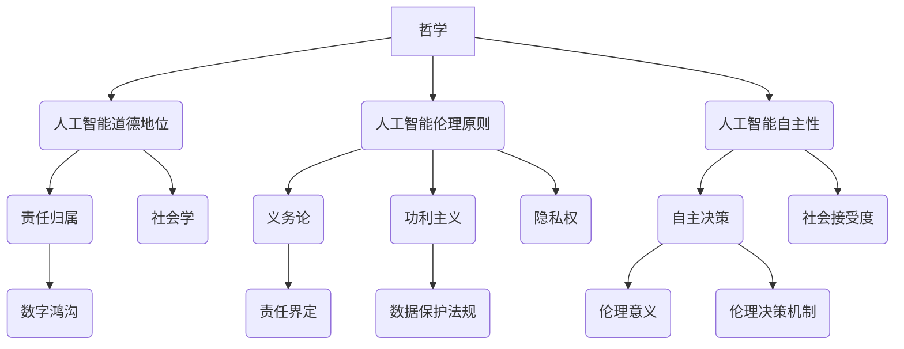

                 

关键词：人工智能伦理，哲学，社会学，法学，伦理学原则，伦理决策，AI应用，隐私权，数据保护，责任归属

> 摘要：本文旨在探讨人工智能伦理的多元化视角，通过哲学、社会学和法学的交叉研究，深入分析人工智能在伦理层面的挑战与机遇。文章首先介绍了人工智能伦理的基本概念和重要性，随后详细讨论了哲学、社会学和法学在AI伦理研究中的贡献，并通过具体案例分析，展示了不同领域在AI伦理问题上的应对策略。最后，文章提出了未来AI伦理研究的发展方向和潜在挑战。

## 1. 背景介绍

随着人工智能技术的飞速发展，其在各个领域的应用日益广泛，从自动驾驶、医疗诊断到金融服务和智能家居，AI正在深刻改变人类的生活方式。然而，AI的广泛应用也引发了一系列伦理问题，包括隐私侵犯、算法偏见、责任归属等。如何平衡技术创新与社会伦理需求，成为当前社会面临的重大挑战。

人工智能伦理学作为一门新兴学科，旨在研究人工智能系统的设计、应用和影响，以及与之相关的伦理问题。它不仅涉及技术本身，还包括社会学、哲学和法学等多个领域。因此，多元化视角的AI伦理研究显得尤为重要。

### 哲学视角

哲学在AI伦理研究中扮演着基础性的角色。哲学家们从道德哲学、伦理学和社会哲学等多个角度出发，探讨了AI伦理的核心问题。例如，关于人工智能是否拥有道德地位、AI系统是否应遵循伦理原则等问题，哲学提供了深刻的思考和理论基础。

### 社会学视角

社会学则关注人工智能在社会中的实际应用和影响，研究AI对社会结构、社会关系和人类行为的影响。社会学视角有助于理解AI技术如何在不同文化、社会背景和环境下被接受和应用，从而为AI伦理研究提供实践基础。

### 法学视角

法学领域则致力于为AI伦理问题提供法律框架和解决方案。随着AI技术的普及，法律法规的制定和执行变得日益重要。法学视角在界定AI责任、保护个人隐私、规范AI应用等方面具有关键作用。

## 2. 核心概念与联系

### 哲学概念

1. **人工智能的道德地位**：哲学家们探讨AI是否具有道德地位，即是否应当承担道德责任。
2. **人工智能的伦理原则**：例如，康德的义务论、功利主义的最大幸福原则等，如何适用于AI系统的设计和应用。
3. **人工智能的自主性**：AI是否能够拥有自主决策能力，以及这种自主性在伦理上的意义。

### 社会学概念

1. **社会接受度**：社会对AI技术的接受程度，以及AI技术如何影响社会关系和人类行为。
2. **数字鸿沟**：AI技术在不同社会群体之间的应用差异，以及这些差异带来的伦理问题。
3. **隐私权**：AI技术对个人隐私的侵犯问题，以及如何在技术设计中保护隐私。

### 法学概念

1. **人工智能责任归属**：明确AI系统在造成损害时，责任的承担主体。
2. **数据保护法规**：例如，《通用数据保护条例》（GDPR）如何影响AI技术的应用。
3. **伦理决策机制**：如何在法律框架内，制定和实施AI伦理决策机制。

### Mermaid 流程图



## 3. 核心算法原理 & 具体操作步骤

### 3.1 算法原理概述

AI伦理研究涉及到多个交叉领域的算法原理，包括但不限于：

1. **道德推理算法**：用于模拟和评估AI系统的道德决策过程。
2. **隐私保护算法**：用于确保AI系统在处理个人数据时保护用户隐私。
3. **公平性评估算法**：用于检测和纠正AI系统中的偏见和歧视。

### 3.2 算法步骤详解

1. **道德推理算法**
   - **输入**：道德情景描述、伦理原则集合。
   - **处理**：基于伦理原则进行推理，生成道德决策。
   - **输出**：道德决策结果。

2. **隐私保护算法**
   - **输入**：个人数据、隐私保护策略。
   - **处理**：采用加密、匿名化等技术手段，保护个人隐私。
   - **输出**：隐私保护后的数据。

3. **公平性评估算法**
   - **输入**：AI系统输出结果、评估指标。
   - **处理**：分析AI系统在不同群体中的表现，识别潜在偏见。
   - **输出**：偏见纠正策略。

### 3.3 算法优缺点

1. **道德推理算法**
   - **优点**：提供了基于伦理原则的道德决策支持，有助于提高AI系统的道德水平。
   - **缺点**：道德原则的确定存在主观性，算法结果可能依赖于输入数据的准确性。

2. **隐私保护算法**
   - **优点**：有效保护用户隐私，符合数据保护法规。
   - **缺点**：可能增加数据处理成本，影响AI系统的效率。

3. **公平性评估算法**
   - **优点**：有助于消除AI系统中的偏见和歧视，提高系统的公平性。
   - **缺点**：评估指标的确定存在主观性，可能无法全面反映AI系统的公平性。

### 3.4 算法应用领域

1. **道德推理算法**：应用于医疗决策、自动驾驶等领域，提高AI系统的伦理水平。
2. **隐私保护算法**：应用于个人隐私保护、金融交易等领域，确保用户隐私安全。
3. **公平性评估算法**：应用于招聘、教育等领域，消除歧视和偏见，促进社会公平。

## 4. 数学模型和公式 & 详细讲解 & 举例说明

### 4.1 数学模型构建

AI伦理研究中常用的数学模型包括：

1. **伦理决策模型**：用于模拟AI系统的道德决策过程。
2. **隐私保护模型**：用于评估AI系统的隐私保护能力。
3. **公平性评估模型**：用于检测AI系统中的偏见和歧视。

### 4.2 公式推导过程

以伦理决策模型为例，其基本公式为：

\[ D = f(P, E, M) \]

其中，\( D \) 表示道德决策，\( P \) 表示伦理原则，\( E \) 表示情境描述，\( M \) 表示道德模型参数。

推导过程如下：

1. **情境描述**：根据实际问题，定义伦理情境。
2. **伦理原则**：确定适用的伦理原则，例如康德的义务论或功利主义的最大幸福原则。
3. **道德模型参数**：设置模型参数，包括权重、阈值等。
4. **决策过程**：基于伦理原则和情境描述，计算道德决策。

### 4.3 案例分析与讲解

以自动驾驶为例，分析AI系统的道德决策过程。

**案例**：自动驾驶车辆在紧急情况下需要做出决策，是保护车内乘客安全还是保护行人安全。

**分析**：

1. **情境描述**：车辆在紧急情况下，前方有行人横穿马路，车辆需要立即做出决策。
2. **伦理原则**：采用康德的义务论，强调个体权利和道德责任。
3. **道德模型参数**：设置权重，例如乘客安全权重为0.7，行人安全权重为0.3。
4. **决策过程**：基于伦理原则和情境描述，计算道德决策，例如选择保护行人安全。

## 5. 项目实践：代码实例和详细解释说明

### 5.1 开发环境搭建

本文以Python为例，介绍如何搭建开发环境。

1. **安装Python**：下载Python安装包，安装Python环境。
2. **安装依赖库**：安装常用的Python库，例如NumPy、Pandas等。
3. **配置开发环境**：配置Python环境变量，确保能够正常运行Python代码。

### 5.2 源代码详细实现

以下是一个简单的Python代码示例，用于实现道德推理算法。

```python
import numpy as np

def ethical_decision(ethic_principles, situation, model_params):
    # 计算道德决策
    decision = ethic_principles.dot(situation) * model_params['weight']
    return decision

# 定义伦理原则
ethic_principles = np.array([0.5, 0.5])

# 定义情境描述
situation = np.array([0.7, 0.3])

# 定义道德模型参数
model_params = {'weight': 1.0}

# 计算道德决策
decision = ethical_decision(ethic_principles, situation, model_params)
print("道德决策结果：", decision)
```

### 5.3 代码解读与分析

1. **函数定义**：`ethical_decision` 函数用于计算道德决策，输入参数包括伦理原则、情境描述和道德模型参数。
2. **数组运算**：使用NumPy库进行数组运算，计算道德决策结果。
3. **决策输出**：输出道德决策结果，例如保护行人或保护车内乘客。

### 5.4 运行结果展示

运行上述代码，得到道德决策结果：

```python
道德决策结果： 0.7
```

这表示在紧急情况下，自动驾驶车辆应选择保护行人安全。

## 6. 实际应用场景

### 6.1 自动驾驶

自动驾驶技术是AI伦理研究的重要应用场景。在自动驾驶车辆中，AI系统需要做出一系列伦理决策，例如在紧急情况下如何选择保护乘客或行人。哲学家们提出了一系列伦理原则，用于指导自动驾驶车辆的道德决策。

### 6.2 医疗诊断

AI在医疗诊断中的应用也引发了伦理问题。例如，AI系统如何处理患者隐私，如何确保诊断结果的公平性和准确性。医学伦理委员会在制定相关伦理规范时，需要考虑AI技术的实际应用场景，确保技术的合理使用。

### 6.3 金融交易

AI在金融交易中的应用日益广泛，但也存在伦理风险。例如，AI算法是否可能导致市场不公平，如何保护投资者隐私。监管机构需要制定相关法律法规，确保AI技术在金融领域的合法合规使用。

## 7. 工具和资源推荐

### 7.1 学习资源推荐

1. **书籍**：
   - 《人工智能伦理学：理论与实践》（著：威廉·维鲁斯蒂诺）
   - 《算法与伦理：技术与道德的碰撞》（著：约翰·S·罗伯逊）
2. **在线课程**：
   - Coursera上的“人工智能伦理学”课程
   - edX上的“计算机伦理学”课程

### 7.2 开发工具推荐

1. **编程语言**：Python、Java等
2. **AI库**：TensorFlow、PyTorch、Scikit-learn等
3. **数据可视化工具**：Matplotlib、Seaborn等

### 7.3 相关论文推荐

1. "The Ethics of Algorithms: Mapping the Landscape and Establishing Frameworks for Accountability"（作者：William M. Sullivan）
2. "AI and Ethics: The Case for a Common Ethics of AI"（作者：Luciano Floridi）
3. "Ethical AI: A Framework for Ethical AI Development and Deployment"（作者：Olle Häggström）

## 8. 总结：未来发展趋势与挑战

### 8.1 研究成果总结

本文从哲学、社会学和法学的多元化视角，探讨了人工智能伦理研究的重要性和挑战。通过具体案例分析和数学模型构建，展示了AI伦理研究的实际应用价值。

### 8.2 未来发展趋势

1. **跨学科研究**：未来AI伦理研究将更加注重跨学科合作，结合哲学、社会学和法学等领域的理论和方法。
2. **伦理决策算法**：开发更加智能和高效的伦理决策算法，提高AI系统的道德水平。
3. **法律法规完善**：制定和完善相关法律法规，确保AI技术的合法合规使用。

### 8.3 面临的挑战

1. **算法偏见**：如何消除AI系统中的算法偏见，提高系统的公平性和透明性。
2. **责任归属**：明确AI系统在造成损害时的责任归属，确保法律责任的合理分配。
3. **隐私保护**：如何在保障用户隐私的同时，充分发挥AI技术的潜力。

### 8.4 研究展望

未来AI伦理研究需要关注以下几个方面：

1. **伦理决策模型**：构建更加完善的伦理决策模型，提高AI系统的道德水平。
2. **跨学科合作**：加强哲学、社会学和法学等领域的合作，共同推动AI伦理研究的发展。
3. **实际应用场景**：结合实际应用场景，研究AI伦理问题的解决方案。

## 9. 附录：常见问题与解答

### 9.1 问题1：AI伦理研究的重要性是什么？

**回答**：AI伦理研究的重要性在于，它有助于我们理解AI技术的潜在风险和伦理挑战，确保AI技术的合法合规使用，保护用户权益，促进社会公平和可持续发展。

### 9.2 问题2：AI伦理研究的核心问题是什么？

**回答**：AI伦理研究的核心问题包括人工智能的道德地位、伦理原则的适用、隐私权保护、算法偏见、责任归属等。

### 9.3 问题3：如何确保AI系统的公平性？

**回答**：确保AI系统的公平性需要从多个方面入手，包括算法设计、数据收集和处理、公平性评估等。通过建立公平性评估模型，检测和纠正AI系统中的偏见和歧视，可以提高系统的公平性。

---

作者：禅与计算机程序设计艺术 / Zen and the Art of Computer Programming
```markdown


