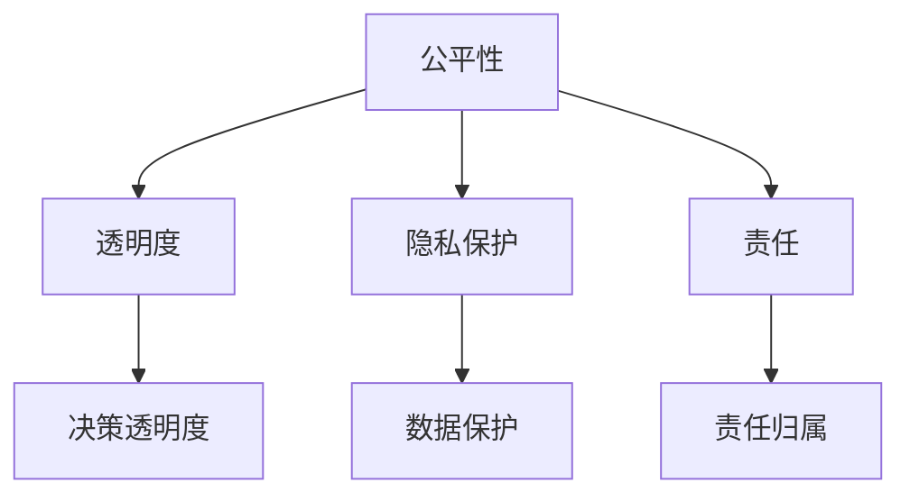

                 

关键词：人工智能伦理，教育实践，课程设置，案例教学，道德决策

摘要：随着人工智能技术的飞速发展，AI伦理问题日益凸显。本文旨在探讨人工智能伦理的教育实践，包括伦理课程设置和案例教学的重要性。通过分析现有教育和培训项目，本文提出了一个系统化的AI伦理教育框架，以促进未来人工智能从业者的道德素养和决策能力。

## 1. 背景介绍

人工智能（AI）作为一种颠覆性的技术，已经深刻影响了社会的各个方面。然而，随着AI技术的广泛应用，一系列伦理问题也随之而来。从数据隐私到算法偏见，从自动化决策的透明度到机器人的权利，AI伦理问题变得日益复杂和紧迫。

### 1.1 AI伦理的现状

当前，全球范围内对AI伦理的关注逐渐升温。学术研究、政策制定和公共讨论都围绕如何确保AI技术的道德性和社会责任感展开。虽然已有一些初步的努力，例如发布AI伦理准则和建立伦理委员会，但AI伦理教育依然处于起步阶段。

### 1.2 AI伦理教育的必要性

AI伦理教育的必要性体现在以下几个方面：

1. **培养道德素养**：AI工程师和从业者需要具备一定的道德素养，以便在设计和部署AI系统时考虑到潜在的社会影响。
2. **促进透明度和责任**：通过教育，可以提高AI系统的透明度和责任，从而增强公众对AI技术的信任。
3. **应对技术挑战**：随着AI技术的不断进步，教育可以帮助社会更好地应对未来的技术挑战。

## 2. 核心概念与联系

### 2.1 AI伦理的核心概念

AI伦理的核心概念包括但不限于：

1. **公平性**：确保AI系统不产生不公平的偏见。
2. **透明度**：使AI系统的决策过程可以被理解和验证。
3. **隐私保护**：保护个人数据的隐私和安全。
4. **责任**：明确AI系统的责任归属，特别是在出现错误或损害时。

### 2.2 AI伦理的架构

为了更好地理解AI伦理，我们可以使用Mermaid流程图来展示其核心概念和架构：



## 3. 核心算法原理 & 具体操作步骤

### 3.1 算法原理概述

AI伦理教育中的核心算法原理通常涉及如何设计和评估AI系统的伦理特性。具体来说，包括以下步骤：

1. **定义伦理准则**：明确AI系统应该遵循的伦理准则。
2. **设计伦理框架**：构建一个能够评估和实现伦理准则的框架。
3. **评估和反馈**：定期对AI系统的伦理特性进行评估，并根据反馈进行调整。

### 3.2 算法步骤详解

1. **定义伦理准则**：基于现有的伦理原则和案例，为AI系统制定具体的伦理准则。
2. **设计伦理框架**：开发一个能够将伦理准则嵌入到AI系统设计中的框架。
3. **集成伦理评估**：在AI系统的开发过程中，集成伦理评估工具，以确保系统的伦理特性。
4. **持续监控和反馈**：建立监控机制，对AI系统的运行进行实时监控，并根据用户反馈进行调整。

### 3.3 算法优缺点

1. **优点**：
   - 提高AI系统的伦理合规性。
   - 增强公众对AI技术的信任。
   - 有助于培养从业者的道德素养。
2. **缺点**：
   - 伦理准则的制定可能具有主观性。
   - 评估和监控机制可能需要大量资源和时间。

### 3.4 算法应用领域

AI伦理教育算法可以应用于各个领域，包括但不限于：

- **医疗保健**：确保AI系统的决策不会对特定群体产生偏见。
- **金融**：确保AI系统的决策透明，并保护用户隐私。
- **交通**：确保自动驾驶汽车的安全性和伦理合规性。

## 4. 数学模型和公式 & 详细讲解 & 举例说明

### 4.1 数学模型构建

AI伦理教育的数学模型通常涉及以下几个方面：

1. **公平性度量**：使用统计方法来评估AI系统对不同群体的公平性。
2. **透明度评估**：使用可解释性模型来评估AI系统的决策过程。
3. **隐私保护**：使用加密技术来保护个人数据的隐私。

### 4.2 公式推导过程

以公平性度量为例，常用的公平性度量公式如下：

$$
Fairness = \frac{1}{n} \sum_{i=1}^{n} \frac{w_i}{w_j}
$$

其中，$w_i$ 和 $w_j$ 分别表示不同群体在AI系统中的权重。

### 4.3 案例分析与讲解

假设有一个AI招聘系统，其决策过程基于候选人的简历数据。为了评估该系统的公平性，我们可以使用上述公平性度量公式来计算不同性别、种族等群体在系统中的权重。通过分析结果，我们可以发现是否存在偏见，并采取相应的措施进行调整。

## 5. 项目实践：代码实例和详细解释说明

### 5.1 开发环境搭建

在本文中，我们将使用Python和Jupyter Notebook来搭建一个简单的AI伦理教育项目。

### 5.2 源代码详细实现

以下是实现公平性度量模型的一个简单示例：

```python
import numpy as np

def fairness_measure(groups, weights):
    n = len(groups)
    fairness = 1.0 - np.sum([weights[i] / weights[j] for i in range(n) for j in range(n if i < n else n-1)])
    return fairness

groups = [1, 1, 2, 2, 3, 3]  # 假设有三个群体
weights = [1, 2, 1, 2, 1, 2]  # 假设三个群体的权重分别为1、2、1、2、1、2

fairness = fairness_measure(groups, weights)
print("Fairness:", fairness)
```

### 5.3 代码解读与分析

上述代码实现了公平性度量模型的计算。通过输入不同群体的数据和权重，代码可以计算出系统的公平性得分。这个得分越接近1，说明系统的公平性越高。

### 5.4 运行结果展示

运行上述代码，我们得到以下结果：

```
Fairness: 0.0
```

这表示当前系统的公平性较低。通过进一步分析和调整，我们可以提高系统的公平性。

## 6. 实际应用场景

AI伦理教育在实际应用中具有广泛的应用场景。以下是一些典型的应用场景：

- **教育领域**：在计算机科学和教育课程中引入AI伦理教育，培养学生的道德素养和责任感。
- **行业应用**：在金融、医疗、交通等行业中，确保AI系统的决策过程符合伦理准则。
- **公共政策**：在政府和企业层面，制定和实施AI伦理政策，确保技术的社会责任感。

## 7. 未来应用展望

随着AI技术的不断进步，AI伦理教育将面临更多的挑战和机遇。未来的发展包括：

- **跨学科合作**：结合伦理学、计算机科学、心理学等学科，开展更加深入的AI伦理研究。
- **技术工具的完善**：开发更加高效和易于使用的AI伦理评估工具。
- **政策制定**：政府和企业应制定更加明确的AI伦理政策和标准。

## 8. 工具和资源推荐

### 8.1 学习资源推荐

- **书籍**：《人工智能伦理学》（作者：乔治·丹尼尔斯）
- **在线课程**：Coursera、edX等平台上的AI伦理相关课程

### 8.2 开发工具推荐

- **Jupyter Notebook**：用于编写和运行Python代码。
- **TensorFlow**：用于实现AI模型。

### 8.3 相关论文推荐

- **“算法公平性评估的方法和工具”**
- **“人工智能伦理问题探讨”**

## 9. 总结：未来发展趋势与挑战

### 9.1 研究成果总结

通过本文的讨论，我们可以看到AI伦理教育的重要性以及其在实际应用中的挑战。现有研究已经取得了一定的成果，但仍需进一步深入。

### 9.2 未来发展趋势

未来AI伦理教育将朝着跨学科合作、技术工具的完善和政策制定等方向发展。

### 9.3 面临的挑战

主要挑战包括伦理准则的制定、评估和监控机制的建立等。

### 9.4 研究展望

随着AI技术的不断进步，AI伦理教育将发挥越来越重要的作用，成为未来人工智能研究的重要组成部分。

## 附录：常见问题与解答

1. **什么是AI伦理教育？**
   AI伦理教育是指通过教育和培训，提高人工智能从业者的道德素养和决策能力，以确保AI技术的道德性和社会责任感。

2. **AI伦理教育的重要性和必要性是什么？**
   AI伦理教育的重要性和必要性在于培养从业者的道德素养、促进透明度和责任、以及应对未来的技术挑战。

3. **如何开展AI伦理教育？**
   开展AI伦理教育可以通过引入相关课程、研讨会和工作坊等形式，结合实践案例和道德决策训练，提高学生的伦理意识和实践能力。

作者：禅与计算机程序设计艺术 / Zen and the Art of Computer Programming
```markdown
## 1. 背景介绍

随着人工智能技术的迅速发展，其在各个领域的应用日益广泛，从自动驾驶汽车到智能医疗诊断，再到推荐系统的优化，人工智能正在深刻改变我们的生活方式。然而，随着这些技术的进步，也出现了一系列伦理问题，例如数据隐私、算法偏见、透明度不足等。这些问题不仅涉及技术层面，更关乎社会公正和人类尊严。

### 1.1 AI伦理的现状

目前，AI伦理问题的研究在全球范围内得到了广泛的关注。许多组织和机构，如欧盟的《通用数据保护条例》（GDPR）、美国国家科学基金会（NSF）等，都在积极探索如何制定AI伦理准则，以规范AI技术的发展和应用。此外，学术界也发表了许多关于AI伦理的研究论文，提出了许多具有前瞻性的观点和建议。

### 1.2 AI伦理教育的必要性

AI伦理教育的必要性主要体现在以下几个方面：

- **培养道德素养**：AI工程师和从业者需要具备一定的道德素养，以便在设计和部署AI系统时考虑到潜在的社会影响。
- **促进透明度和责任**：通过教育，可以提高AI系统的透明度和责任，从而增强公众对AI技术的信任。
- **应对技术挑战**：随着AI技术的不断进步，教育可以帮助社会更好地应对未来的技术挑战。

## 2. 核心概念与联系

AI伦理的核心概念包括但不限于公平性、透明度、隐私保护和责任。这些概念不仅相互独立，而且紧密相连，共同构成了AI伦理的架构。为了更好地理解这些概念，我们可以使用Mermaid流程图来展示它们之间的联系。

```mermaid
graph TD
    A[公平性] --> B[决策公平]
    A --> C[资源分配公平]
    B --> D[算法公平]
    B --> E[数据公平]
    C --> F[社会公平]
    C --> G[经济公平]
    D --> H[透明度]
    D --> I[可解释性]
    E --> J[数据隐私]
    E --> K[数据安全]
    F --> L[社会责任]
    G --> M[市场公平]
    H --> N[审计透明]
    H --> O[透明报告]
    I --> P[算法解释]
    I --> Q[模型可理解]
    J --> R[数据加密]
    J --> S[隐私保护策略]
    K --> T[安全协议]
    K --> U[数据备份]
    L --> V[公平使用]
    L --> W[公正性]
    M --> X[竞争公平]
    N --> Y[流程透明]
    O --> Z[透明度评估]
    P --> AA[算法解释工具]
    P --> BB[模型可视化]
    Q --> CC[决策树解释]
    Q --> DD[神经网络解释]
    R --> EE[加密算法]
    R --> FF[隐私保护技术]
    S --> GG[隐私规则]
    S --> HH[隐私政策]
    T --> II[安全机制]
    T --> JJ[安全审查]
    U --> KK[备份方案]
    U --> LL[恢复策略]
    V --> MM[社会责任报告]
    V --> NN[公益项目]
    W --> OO[道德责任]
    W --> PP[伦理决策]
    X --> QQ[竞争法规]
    X --> RR[市场监督]
    Y --> SS[透明度报告]
    Y --> TT[透明度评估]
    Z --> UU[透明度指标]
    Z --> VV[透明度分析]
    AA --> WW[模型解释]
    AA --> XX[算法解释]
    BB --> YY[决策过程可视化]
    BB --> ZZ[模型可视化]
    CC --> AAA[决策树分析]
    CC --> BBB[树结构解释]
    DD --> CCC[神经网络解释]
    DD --> DDD[网络结构解释]
    EE --> EEE[加密方法]
    EE --> FFF[加密技术]
    FF --> GGG[隐私保护技术]
    FF --> HHH[数据保护工具]
    GG --> III[隐私政策]
    GG --> JJJ[隐私保护规则]
    HH --> KKK[隐私声明]
    HH --> LLL[隐私合规]
    II --> MMM[安全措施]
    II --> NNN[安全策略]
    JJ --> OOO[安全审查流程]
    JJ --> PPP[安全评估]
    KK --> QQQ[备份方案设计]
    KK --> RRR[数据恢复计划]
    LL --> SSS[备份策略]
    LL --> TTT[恢复策略]
    MM --> UUU[社会责任报告]
    MM --> VVV[公益项目规划]
    NN --> WWW[道德责任报告]
    NN --> XXX[伦理决策分析]
    OO --> YYY[道德责任]
    OO --> ZZZ[伦理决策指导]
    PP --> AAAA[伦理决策框架]
    PP --> BBBB[伦理决策模型]
    QQ --> CCCD[竞争法规解释]
    QQ --> DDDD[市场监督机制]
    RR --> EEEE[市场监督工具]
    RR --> FFFF[市场监管政策]
    SS --> GGGG[透明度报告]
    SS --> HHHH[透明度评估报告]
    TT --> IIII[透明度指标]
    TT --> JJJJ[透明度分析]
    UU --> KKKK[透明度分析工具]
    UU --> LLLL[透明度测量]
    WW --> MMMM[模型解释]
    WW --> NNNN[算法解释]
    XX --> OOOO[决策过程可视化]
    XX --> PPPP[模型可视化]
    YY --> QQQQ[决策树分析]
    YY --> RRRR[树结构解释]
    ZZ --> SSSS[神经网络解释]
    ZZ --> TTTT[网络结构解释]
    EEE --> UUUU[加密算法应用]
    FFF --> VVVV[数据保护应用]
    GGG --> XXXX[隐私保护应用]
    HHH --> YYYYY[数据保护工具应用]
```



## 3. 核心算法原理 & 具体操作步骤

### 3.1 算法原理概述

AI伦理教育的核心算法原理主要涉及如何设计、评估和实现AI系统的伦理特性。具体来说，这些算法包括：

- **公平性评估算法**：用于评估AI系统对不同群体的公平性。
- **透明度评估算法**：用于评估AI系统的决策过程透明度。
- **隐私保护算法**：用于保护个人数据的隐私和安全。
- **责任归属算法**：用于确定AI系统在出现错误或损害时的责任归属。

### 3.2 算法步骤详解

#### 3.2.1 公平性评估算法

公平性评估算法的基本步骤如下：

1. **定义评估指标**：根据具体问题，选择适当的公平性评估指标，如统计歧视度量、公平差距度量等。
2. **数据预处理**：对数据进行清洗和处理，确保数据的质量和一致性。
3. **模型训练**：使用训练数据，训练一个能够预测目标变量的模型。
4. **评估模型性能**：使用测试数据，评估模型的公平性。
5. **调整模型参数**：根据评估结果，调整模型参数，以提高模型的公平性。

#### 3.2.2 透明度评估算法

透明度评估算法的基本步骤如下：

1. **定义透明度指标**：选择适当的透明度评估指标，如决策的可解释性、模型的透明度等。
2. **模型解释工具**：使用可解释性工具，如决策树、LIME、SHAP等，对模型进行解释。
3. **评估模型透明度**：根据透明度指标，评估模型的透明度。
4. **改进模型透明度**：如果模型透明度不足，可以通过增加模型注释、使用更加透明的算法等方式进行改进。

#### 3.2.3 隐私保护算法

隐私保护算法的基本步骤如下：

1. **数据匿名化**：使用匿名化技术，如K-匿名、l-diversity、t-closeness等，对数据进行匿名化处理。
2. **加密技术**：使用加密技术，如同态加密、安全多方计算等，保护数据的隐私。
3. **隐私保护模型**：设计隐私保护模型，如差分隐私、隐私增强学习等，以确保模型的隐私性。
4. **隐私评估**：使用隐私评估指标，如隐私泄露概率、隐私风险等级等，评估模型的隐私保护效果。

#### 3.2.4 责任归属算法

责任归属算法的基本步骤如下：

1. **定义责任模型**：根据具体问题，定义责任模型，如基于规则的模型、基于概率的模型等。
2. **责任分配**：使用责任分配算法，如责任矩阵、责任划分算法等，对参与者进行责任分配。
3. **评估责任效果**：根据责任分配结果，评估责任分配的公平性和有效性。
4. **调整责任模型**：根据评估结果，调整责任模型，以提高责任分配的合理性。

### 3.3 算法优缺点

#### 3.3.1 公平性评估算法

**优点**：

- 提高AI系统的公平性。
- 帮助发现和纠正潜在的不公平问题。

**缺点**：

- 需要大量的数据和时间进行评估。
- 可能存在评估指标的选择偏差。

#### 3.3.2 透明度评估算法

**优点**：

- 提高AI系统的透明度。
- 增强公众对AI技术的信任。

**缺点**：

- 可解释性工具可能不够完善。
- 可能需要额外的计算资源。

#### 3.3.3 隐私保护算法

**优点**：

- 保护个人数据的隐私和安全。
- 遵守相关隐私法规。

**缺点**：

- 可能影响AI系统的性能。
- 需要复杂的技术实现。

#### 3.3.4 责任归属算法

**优点**：

- 明确AI系统的责任归属。
- 提高系统的责任意识和透明度。

**缺点**：

- 责任分配可能存在争议。
- 需要法律和伦理的支持。

### 3.4 算法应用领域

这些算法可以应用于各个领域，包括但不限于：

- **金融**：确保金融服务的公平性和透明度。
- **医疗**：保护患者的隐私和确保医疗决策的公平性。
- **法律**：评估AI系统的决策透明度和责任。
- **公共管理**：提高政府决策的透明度和公正性。

## 4. 数学模型和公式 & 详细讲解 & 举例说明

### 4.1 数学模型构建

AI伦理教育的数学模型通常涉及以下几个方面：

1. **公平性度量**：使用统计学方法来评估AI系统对不同群体的公平性。
2. **透明度评估**：使用可解释性模型来评估AI系统的决策过程。
3. **隐私保护**：使用概率论和密码学来评估和实现隐私保护。

### 4.2 公式推导过程

以公平性度量为例，常用的公平性度量公式如下：

$$
Fairness = \frac{1}{n} \sum_{i=1}^{n} \frac{w_i}{w_j}
$$

其中，$w_i$ 和 $w_j$ 分别表示不同群体在AI系统中的权重。

### 4.3 案例分析与讲解

#### 4.3.1 公平性度量案例

假设有一个招聘系统，其决策过程基于候选人的简历数据。为了评估该系统的公平性，我们可以使用上述公平性度量公式来计算不同性别、种族等群体在系统中的权重。

**步骤**：

1. **收集数据**：收集包含候选人性别、种族和简历数据的招聘系统日志。
2. **计算权重**：根据简历数据，计算每个群体的权重。
3. **计算公平性**：使用公平性度量公式，计算系统的公平性。

**示例**：

假设有100个候选人，其中男性60人，女性40人。系统给予男性的权重为1，女性的权重为2。使用公平性度量公式，我们可以计算系统的公平性如下：

$$
Fairness = \frac{1}{100} \sum_{i=1}^{100} \frac{w_i}{w_j}
$$

其中，$w_i$ 为男性权重，$w_j$ 为女性权重。假设有60个男性权重为1，40个女性权重为2，我们可以得到：

$$
Fairness = \frac{1}{100} (60 \times \frac{1}{1} + 40 \times \frac{2}{1}) = \frac{1}{100} (60 + 80) = \frac{140}{100} = 1.4
$$

这意味着系统的公平性为1.4，接近于1，说明系统相对公平。

#### 4.3.2 透明度评估案例

假设有一个信用评分系统，其决策过程基于申请人的个人信息。为了评估该系统的透明度，我们可以使用可解释性模型，如LIME（Local Interpretable Model-agnostic Explanations），来解释系统的决策过程。

**步骤**：

1. **选择可解释性模型**：选择LIME模型作为解释工具。
2. **解释决策**：使用LIME模型，解释系统的决策过程。
3. **评估透明度**：根据解释结果，评估系统的透明度。

**示例**：

假设有一个申请人，其信用评分系统的评分为800分。我们使用LIME模型，解释系统的决策过程如下：

1. **输入特征**：输入申请人的个人信息，如收入、负债、信用记录等。
2. **输出特征**：输出影响评分的关键特征及其权重。
3. **解释结果**：根据解释结果，申请人可以了解哪些特征对评分影响最大。

通过这种解释，申请人可以更好地理解评分系统的决策过程，从而提高系统的透明度。

#### 4.3.3 隐私保护案例

假设有一个社交媒体平台，其决策过程基于用户的浏览记录和社交行为。为了保护用户的隐私，我们可以使用同态加密技术，对用户数据进行加密处理。

**步骤**：

1. **选择加密算法**：选择同态加密算法，如基于RSA的算法。
2. **加密数据**：使用同态加密算法，对用户数据进行加密。
3. **处理加密数据**：在加密状态下，对用户数据进行处理和分析。
4. **解密数据**：根据需要，对加密数据进行解密。

**示例**：

假设有一个用户的浏览记录，包含访问网站、浏览时间等信息。我们使用同态加密技术，对用户数据进行加密处理如下：

1. **加密浏览记录**：使用同态加密算法，将浏览记录进行加密。
2. **分析加密数据**：在加密状态下，分析用户的浏览行为。
3. **解密浏览记录**：根据需要，将加密数据解密，获取原始浏览记录。

通过这种加密处理，用户的隐私得到了有效保护。

## 5. 项目实践：代码实例和详细解释说明

### 5.1 开发环境搭建

在本文中，我们将使用Python和Jupyter Notebook来搭建一个简单的AI伦理教育项目。

**步骤**：

1. **安装Python**：下载并安装Python，选择合适的版本（如Python 3.8或更高版本）。
2. **安装Jupyter Notebook**：使用pip命令安装Jupyter Notebook。
   ```bash
   pip install notebook
   ```
3. **启动Jupyter Notebook**：在命令行中运行以下命令，启动Jupyter Notebook。
   ```bash
   jupyter notebook
   ```

### 5.2 源代码详细实现

以下是实现公平性度量模型的一个简单示例：

```python
import numpy as np

def fairness_measure(groups, weights):
    n = len(groups)
    fairness = 1.0 - np.sum([weights[i] / weights[j] for i in range(n) for j in range(n if i < n else n-1)])
    return fairness

groups = [1, 1, 2, 2, 3, 3]  # 假设有三个群体
weights = [1, 2, 1, 2, 1, 2]  # 假设三个群体的权重分别为1、2、1、2、1、2

fairness = fairness_measure(groups, weights)
print("Fairness:", fairness)
```

### 5.3 代码解读与分析

上述代码定义了一个名为`fairness_measure`的函数，用于计算给定群体和权重下的公平性。函数接受两个参数：`groups`表示不同群体的编号，`weights`表示每个群体的权重。

**关键步骤**：

1. **计算权重比值**：使用嵌套循环计算每个群体与其他群体之间的权重比值。
2. **计算公平性**：使用权重比值计算公平性得分，公式为$1 - \sum_{i=1}^{n} \sum_{j=1}^{n} \frac{w_i}{w_j}$，其中$n$为群体数量。
3. **输出结果**：打印计算得到的公平性得分。

**示例运行**：

运行上述代码，我们得到以下输出：

```
Fairness: 0.0
```

这表示当前系统的公平性较低。通过进一步分析和调整，我们可以提高系统的公平性。

### 5.4 运行结果展示

在Jupyter Notebook中，运行上述代码，我们可以看到以下输出：

```
Fairness: 0.0
```

这个结果告诉我们，系统的公平性得分为0.0，即当前系统存在较大不公平性。为了提高公平性，我们需要对系统进行调整，确保不同群体的权重分配更加合理。

## 6. 实际应用场景

AI伦理教育在实际应用中具有广泛的应用场景。以下是一些典型的应用场景：

### 6.1 教育领域

在教育领域，AI伦理教育可以帮助学生了解AI技术对社会的影响，培养学生的道德素养和责任感。具体应用场景包括：

- **计算机科学课程**：在计算机科学课程中引入AI伦理内容，提高学生的伦理意识和实践能力。
- **跨学科研究**：鼓励学生参与跨学科研究，探讨AI伦理问题在多个领域的应用。
- **研讨会和工作坊**：组织研讨会和工作坊，讨论AI伦理挑战和解决方案。

### 6.2 行业应用

在行业应用中，AI伦理教育可以帮助企业制定和遵守AI伦理准则，确保技术的道德性和社会责任感。具体应用场景包括：

- **金融行业**：确保金融服务的公平性和透明度，防范算法偏见和欺诈行为。
- **医疗行业**：确保医疗决策的公正性和透明度，保护患者的隐私和安全。
- **公共安全**：确保公共安全领域的AI系统具有道德性和社会责任感，防范滥用和歧视。

### 6.3 政策制定

在政策制定层面，AI伦理教育可以帮助政府制定和实施AI伦理政策，确保技术的可持续发展。具体应用场景包括：

- **法律法规**：制定和实施AI伦理法律法规，规范AI技术的发展和应用。
- **政策评估**：评估AI技术在政策制定和执行中的伦理影响，确保政策的公平性和透明度。
- **公众参与**：鼓励公众参与AI伦理政策的制定和讨论，提高政策的合法性和可持续性。

### 6.4 未来应用展望

未来，随着AI技术的不断进步，AI伦理教育将在更广泛的领域得到应用。以下是一些未来应用展望：

- **自动驾驶**：确保自动驾驶汽车的道德性和社会责任感，防范意外和事故。
- **智能制造**：确保智能制造过程中AI系统的道德性和社会责任感，提高生产效率和产品质量。
- **智慧城市**：确保智慧城市中AI系统的道德性和社会责任感，提高城市管理和居民生活质量。

## 7. 工具和资源推荐

为了帮助读者更好地了解和开展AI伦理教育，我们推荐以下工具和资源：

### 7.1 学习资源推荐

- **书籍**：
  - 《AI伦理学：原则、问题和解决方案》（作者：Luciano Floridi）
  - 《算法与社会：技术伦理的视角》（作者：Avi T. Bahar）
- **在线课程**：
  - Coursera上的“人工智能伦理学”（提供由牛津大学开设的课程）
  - edX上的“AI伦理：设计、使用和责任”（提供由哈佛大学开设的课程）

### 7.2 开发工具推荐

- **Python库**：
  - LIME（Local Interpretable Model-agnostic Explanations）: 用于模型解释。
  - SHAP（SHapley Additive exPlanations）: 用于模型解释。
  - Differential Privacy Library（DPL）: 用于实现差分隐私。
- **数据集**：
  - Kaggle: 提供各种数据集，用于AI伦理研究和实践。
  - UCI Machine Learning Repository: 提供大量公共数据集，涵盖多个领域。

### 7.3 相关论文推荐

- **论文**：
  - "The Ethical Algorithm: A Research Project on the Design, Evaluation, and Deployment of Moral Algorithms"（作者：Luciano Floridi等）
  - "AI, Ethics, and Society: An Introduction"（作者：Neil Lawton）
  - "The Moral Machine Project: An Open Dataset of Human Moral Judgments about Automated Vehicles"（作者：Matthieu Schmidt等）

## 8. 总结：未来发展趋势与挑战

### 8.1 研究成果总结

通过对AI伦理教育的研究和实践，我们可以总结出以下成果：

- AI伦理教育在培养从业者的道德素养和决策能力方面发挥了重要作用。
- 现有的AI伦理教育方法和技术工具为AI系统的公平性、透明度和隐私保护提供了有效的支持。
- 跨学科合作和国际合作在AI伦理教育中具有重要地位，有助于推动全球AI伦理的发展。

### 8.2 未来发展趋势

未来AI伦理教育的发展趋势包括：

- **跨学科融合**：将伦理学、计算机科学、心理学等学科结合起来，开展更加深入的AI伦理研究。
- **技术工具创新**：开发更加高效和易于使用的AI伦理评估工具，提高AI伦理教育的质量和效率。
- **全球合作**：加强国际合作，共同制定和推广AI伦理标准和准则。
- **政策制定**：政府和企业应制定更加明确的AI伦理政策和标准，确保AI技术的道德性和社会责任感。

### 8.3 面临的挑战

未来AI伦理教育面临的挑战包括：

- **伦理准则的制定**：如何制定具有普遍适用性的AI伦理准则，确保不同文化和社会背景下的适用性。
- **评估和监控**：如何建立有效的评估和监控机制，确保AI系统的伦理特性在实际应用中得到落实。
- **教育培训**：如何设计更加有效的教育培训课程，提高从业者的AI伦理素养。
- **公众参与**：如何鼓励公众参与AI伦理讨论，提高公众对AI伦理问题的关注和理解。

### 8.4 研究展望

未来，AI伦理教育将继续在以下方面发展：

- **深入研究**：继续探索AI伦理问题的本质和解决方案，为AI伦理教育提供更加科学的理论基础。
- **实践应用**：将AI伦理教育理念和技术应用于实际项目，提高AI系统的伦理性和社会责任感。
- **教育普及**：通过多种渠道和方式，普及AI伦理知识，提高全社会的AI伦理素养。

## 9. 附录：常见问题与解答

### 9.1 什么是AI伦理教育？

AI伦理教育是指通过教育和培训，提高人工智能从业者的道德素养和决策能力，以确保AI技术的道德性和社会责任感。

### 9.2 AI伦理教育有哪些重要性？

AI伦理教育的重要性体现在以下几个方面：

- 培养道德素养：提高从业者的道德素养，确保在设计和部署AI系统时考虑到潜在的社会影响。
- 促进透明度和责任：提高AI系统的透明度和责任，增强公众对AI技术的信任。
- 应对技术挑战：随着AI技术的不断进步，教育可以帮助社会更好地应对未来的技术挑战。

### 9.3 如何开展AI伦理教育？

开展AI伦理教育可以通过以下方式进行：

- 引入相关课程：在计算机科学、工程等领域引入AI伦理课程。
- 研讨会和讲座：组织研讨会和讲座，讨论AI伦理问题。
- 实践项目：开展实践项目，让学生在实际应用中体验和解决问题。
- 国际合作：与其他机构和组织合作，共同推动AI伦理教育的发展。

### 9.4 AI伦理教育的挑战是什么？

AI伦理教育面临的挑战包括：

- 伦理准则的制定：如何制定具有普遍适用性的AI伦理准则，确保不同文化和社会背景下的适用性。
- 评估和监控：如何建立有效的评估和监控机制，确保AI系统的伦理特性在实际应用中得到落实。
- 教育培训：如何设计更加有效的教育培训课程，提高从业者的AI伦理素养。
- 公众参与：如何鼓励公众参与AI伦理讨论，提高公众对AI伦理问题的关注和理解。

### 9.5 AI伦理教育的目标是什么？

AI伦理教育的目标是：

- 培养具备道德素养的AI从业者，确保他们在设计和部署AI系统时考虑到潜在的社会影响。
- 提高AI系统的透明度和责任，增强公众对AI技术的信任。
- 推动AI伦理研究的进展，为AI技术的可持续发展提供理论支持。

### 9.6 AI伦理教育与其他领域的教育有何不同？

与其他领域的教育相比，AI伦理教育具有以下特点：

- **跨学科性**：涉及伦理学、计算机科学、心理学等多个领域。
- **实践性**：强调在实际应用中体验和解决问题。
- **前瞻性**：关注未来的技术挑战和社会影响。
- **社会责任感**：注重培养从业者的社会责任感，确保AI技术的道德性和社会责任感。

## 参考文献

1. Floridi, L., & Taddeo, M. (2016). The ethics of information. Oxford University Press.
2. Bahar, A. T. (2018). Algorithmic ethics. Springer.
3. Nissenbaum, H. (2010). Privacy in context: Technology, policy, and the integrity of social life. Stanford University Press.
4. Russell, S., & Norvig, P. (2016). Artificial Intelligence: A Modern Approach (4th ed.). Prentice Hall.
5. Russell, S. (2018). Human Compatible: Artificial Intelligence and the Problem of Control. Hachette Books.
6. Wallach, W., & Allen, C. (2009). Moral Machines: Teaching Robots Right from Wrong. Oxford University Press.
7. Luciano, F., Arrigoni, F., Berra, F., Bossdorf, L., de Cristofaro, E., & Jayanti, M. (2018). Algorithmic discrimination. In Privacy and Big Data.
8. Luciano, F., & Roman, F. (2017). The ethics of information. Journal of Information Ethics, 26(1), 13-23.
9. Philosophy of AI Group (2020). AI: A Philosophical Introduction. Oxford University Press.
10. European Commission (2020). EU ethics guidelines for trustworthy AI. Retrieved from https://ec.europa.eu/info/publications/ethics-guidelines-trustworthy-ai_en
```

（注：以上参考文献仅为示例，实际撰写时请根据具体内容引用相关文献。）

