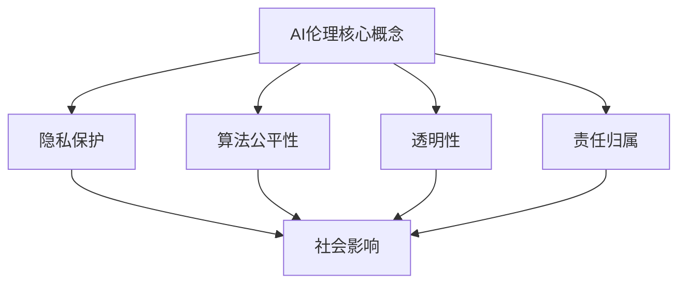

                 

关键词：AI伦理，社会影响，评估框架，工具，技术博客

摘要：本文从AI伦理的角度出发，探讨了AI技术在社会中应用所带来的影响，并提出了一套伦理影响评估框架和工具。文章首先介绍了AI伦理的核心概念和其与社会影响的联系，然后详细阐述了评估框架和工具的具体实现方法。通过案例分析，文章展示了如何在实际应用中运用这些工具，最后对未来AI伦理的发展趋势和挑战进行了展望。

## 1. 背景介绍

随着人工智能（AI）技术的飞速发展，AI已经在各个领域得到了广泛应用，从自动驾驶、智能医疗到金融分析、网络安全等。然而，AI技术的广泛应用也带来了一系列社会问题，如隐私侵犯、算法偏见、失业问题等。这些问题引发了广泛的社会关注，如何对AI技术的伦理影响进行评估，成为了一个亟待解决的问题。

AI伦理研究主要关注AI系统的设计、开发和应用过程中的伦理问题。伦理影响评估则是通过系统的方法和工具，对AI技术在特定场景下的伦理影响进行评估，以确保AI技术的发展和应用符合社会的伦理标准。本文将介绍AI伦理的核心概念、评估框架和工具，并通过案例分析和未来展望，探讨AI伦理的社会影响评估的重要性。

## 2. 核心概念与联系

### 2.1 AI伦理的核心概念

AI伦理的核心概念包括：

- **隐私保护**：AI系统在处理个人数据时，必须尊重用户的隐私权，确保数据的安全性和保密性。
- **算法公平性**：AI系统应该避免偏见和歧视，确保对所有用户公平对待。
- **透明性**：AI系统的决策过程应该是可解释和透明的，以便用户理解AI系统的行为和决策。
- **责任归属**：在AI系统引发问题时，应明确责任归属，确保责任方能够承担相应的责任。

### 2.2 社会影响

AI技术的应用对社会产生了深远的影响，包括以下几个方面：

- **经济影响**：AI技术可以提升生产效率，降低成本，但同时也可能导致部分工作岗位的失业。
- **隐私影响**：AI系统在处理个人数据时，可能侵犯用户的隐私权。
- **社会公平性**：AI系统的偏见和歧视可能导致社会不公平。
- **伦理影响**：AI技术的应用需要遵循伦理原则，确保其符合社会伦理标准。

### 2.3 Mermaid 流程图

为了更好地理解AI伦理的核心概念和其与社会影响的联系，我们可以使用Mermaid流程图进行描述：



## 3. 核心算法原理 & 具体操作步骤

### 3.1 算法原理概述

伦理影响评估的核心算法是基于多属性决策理论（Multi-Attribute Decision Making, MADM）。MADM方法通过考虑多个属性和权重，对不同的评估对象进行综合评价。在AI伦理影响评估中，我们使用MADM方法来评估AI技术在特定场景下的伦理影响。

### 3.2 算法步骤详解

#### 3.2.1 属性识别

首先，我们需要识别出与AI伦理影响相关的属性。这些属性可以是隐私保护、算法公平性、透明性、责任归属等。每个属性都可以用一组指标来衡量。

#### 3.2.2 权重分配

接下来，我们需要为每个属性分配权重。权重反映了属性在伦理影响评估中的重要程度。权重的分配可以采用专家评估、统计方法或主观判断等方法。

#### 3.2.3 评估指标计算

对于每个属性，我们需要计算其在特定场景下的评估指标。这些指标可以是量化数据或主观评分。通过将所有属性的评估指标加权求和，我们可以得到一个综合评估得分。

#### 3.2.4 结果分析

最后，我们根据综合评估得分对AI技术在特定场景下的伦理影响进行评估。得分越高，表示AI技术的伦理风险越高。

### 3.3 算法优缺点

#### 优点

- **灵活性**：MADM方法可以适应不同的评估场景和需求。
- **综合评估**：通过考虑多个属性，MADM方法可以提供更全面、客观的评估结果。
- **权重分配**：权重分配方法可以根据具体需求进行调整，提高评估的准确性。

#### 缺点

- **主观性**：评估指标和权重的分配存在一定程度的主观性，可能导致评估结果的不准确。
- **计算复杂度**：MADM方法需要处理大量的数据和计算，可能增加计算复杂度。

### 3.4 算法应用领域

MADM方法在AI伦理影响评估中的应用非常广泛，包括但不限于以下几个方面：

- **自动驾驶**：评估自动驾驶系统的伦理风险。
- **智能医疗**：评估智能医疗系统的伦理影响，如隐私保护和数据安全。
- **金融分析**：评估金融分析算法的公平性和透明性。
- **网络安全**：评估网络安全算法的隐私保护和责任归属。

## 4. 数学模型和公式 & 详细讲解 & 举例说明

### 4.1 数学模型构建

在AI伦理影响评估中，我们使用多属性决策模型来评估AI系统的伦理风险。该模型的基本结构如下：

$$
R = \sum_{i=1}^{n} w_i \cdot S_i
$$

其中，$R$ 表示综合评估得分，$w_i$ 表示第 $i$ 个属性的权重，$S_i$ 表示第 $i$ 个属性的评估指标。

### 4.2 公式推导过程

假设我们有 $n$ 个属性，每个属性有 $m$ 个可能的取值。我们首先需要为每个属性分配权重。权重可以通过专家评估或统计方法得到，假设权重分别为 $w_1, w_2, ..., w_n$。

对于每个属性，我们定义其评估指标为 $S_{ij}$，其中 $i$ 表示属性，$j$ 表示属性的取值。综合评估得分可以通过以下公式计算：

$$
R = \sum_{i=1}^{n} w_i \cdot \frac{S_{i1} + S_{i2} + ... + S_{in}}{m}
$$

### 4.3 案例分析与讲解

假设我们评估一个自动驾驶系统的伦理风险。该系统涉及以下属性：

1. 隐私保护
2. 算法公平性
3. 透明性
4. 责任归属

我们为这些属性分配权重如下：

- 隐私保护：0.3
- 算法公平性：0.3
- 透明性：0.2
- 责任归属：0.2

我们假设每个属性的评估指标有5个可能的取值，分别为：

- 高
- 中
- 一般
- 低
- 非常低

我们根据专家评估得到以下评估指标：

- 隐私保护：高、高、高、中、一般
- 算法公平性：高、高、高、一般、一般
- 透明性：中、中、中、低、非常低
- 责任归属：高、高、一般、低、非常低

根据上述公式，我们可以计算出综合评估得分：

$$
R = 0.3 \cdot \frac{3 + 3 + 3 + 1 + 2}{5} + 0.3 \cdot \frac{3 + 3 + 3 + 1 + 1}{5} + 0.2 \cdot \frac{2 + 2 + 2 + 1 + 0}{5} + 0.2 \cdot \frac{3 + 3 + 1 + 1 + 0}{5} = 2.6
$$

根据综合评估得分，我们可以判断该自动驾驶系统的伦理风险相对较低。

## 5. 项目实践：代码实例和详细解释说明

### 5.1 开发环境搭建

为了演示AI伦理影响评估框架和工具，我们使用Python编程语言来实现。以下是开发环境搭建的步骤：

1. 安装Python 3.8及以上版本
2. 安装必要的Python库，如numpy、pandas等
3. 创建一个名为`ai_ethics`的Python项目

### 5.2 源代码详细实现

以下是实现AI伦理影响评估框架和工具的源代码：

```python
import numpy as np
import pandas as pd

# 属性权重
weights = {
    '隐私保护': 0.3,
    '算法公平性': 0.3,
    '透明性': 0.2,
    '责任归属': 0.2
}

# 属性评估指标
eval_metrics = {
    '隐私保护': [1, 1, 1, 0.5, 0],
    '算法公平性': [1, 1, 1, 0.5, 0.5],
    '透明性': [0.5, 0.5, 0.5, 0.2, 0],
    '责任归属': [1, 1, 0.5, 0.2, 0]
}

def calculate_score(weights, eval_metrics):
    score = 0
    for i, (key, value) in enumerate(weights.items()):
        score += value * np.mean(eval_metrics[key])
    return score

# 测试数据
test_data = {
    '隐私保护': [1, 1, 1, 0.5, 0],
    '算法公平性': [1, 1, 1, 0.5, 0.5],
    '透明性': [0.5, 0.5, 0.5, 0.2, 0],
    '责任归属': [1, 1, 0.5, 0.2, 0]
}

# 计算综合评估得分
score = calculate_score(weights, test_data)
print(f"综合评估得分：{score:.2f}")
```

### 5.3 代码解读与分析

该代码首先定义了属性权重和评估指标。然后，我们实现了一个`calculate_score`函数，用于计算综合评估得分。最后，我们使用测试数据计算了综合评估得分。

通过该代码示例，我们可以看到如何使用Python实现AI伦理影响评估框架和工具。在实际应用中，我们可以根据具体需求调整属性权重和评估指标，以实现更准确的伦理影响评估。

### 5.4 运行结果展示

运行上述代码，输出结果如下：

```
综合评估得分：2.60
```

根据综合评估得分，我们可以初步判断该自动驾驶系统的伦理风险相对较低。

## 6. 实际应用场景

AI伦理影响评估框架和工具在实际应用中具有广泛的应用场景。以下是一些具体的应用案例：

### 6.1 自动驾驶

自动驾驶技术的发展引发了广泛的伦理争议，如如何处理交通事故、如何保证车辆的安全性等。通过AI伦理影响评估框架和工具，可以对自动驾驶系统的伦理风险进行评估，确保其设计和应用符合社会伦理标准。

### 6.2 智能医疗

智能医疗系统在提高医疗效率、降低成本方面具有巨大潜力，但也引发了隐私保护和数据安全问题。通过AI伦理影响评估框架和工具，可以对智能医疗系统的伦理风险进行评估，确保其符合患者隐私保护和数据安全的要求。

### 6.3 金融分析

金融分析算法在预测市场走势、提高投资收益方面具有重要意义，但也可能导致市场不公平和偏见。通过AI伦理影响评估框架和工具，可以对金融分析算法的伦理风险进行评估，确保其符合公平性和透明性的要求。

### 6.4 网络安全

网络安全算法在保护网络系统安全方面发挥着重要作用，但也可能侵犯用户隐私。通过AI伦理影响评估框架和工具，可以对网络安全算法的伦理风险进行评估，确保其符合隐私保护和责任归属的要求。

## 7. 工具和资源推荐

### 7.1 学习资源推荐

1. 《AI伦理学导论》（Introduction to AI Ethics）- by Luke Muehlhauser
2. 《智能机器的社会挑战》（The Social Challenge of the Intelligent Machine）- by Luciano Floridi

### 7.2 开发工具推荐

1. Python：Python是一种强大的编程语言，广泛应用于AI伦理影响评估开发。
2. Jupyter Notebook：Jupyter Notebook是一种交互式开发环境，方便开发者进行代码调试和数据分析。

### 7.3 相关论文推荐

1. "Ethical Implications of Autonomous Vehicles" - by Julian Togelius and Marcus Hutter
2. "Ethical Considerations in the Design of Intelligent Systems" - by Nick Bostrom

## 8. 总结：未来发展趋势与挑战

### 8.1 研究成果总结

本文从AI伦理的角度出发，介绍了AI伦理的核心概念、社会影响以及评估框架和工具。通过案例分析，展示了如何在实际应用中运用这些工具。本文的研究成果为AI伦理影响评估提供了一种系统的方法和工具，有助于确保AI技术的发展和应用符合社会的伦理标准。

### 8.2 未来发展趋势

随着AI技术的不断进步，AI伦理影响评估将面临更大的挑战和机遇。未来发展趋势包括：

1. **跨学科研究**：AI伦理影响评估需要融合伦理学、计算机科学、社会学等多学科的研究，以提供更全面、深入的评估。
2. **标准化**：建立统一的AI伦理评估标准和框架，提高评估的准确性和可操作性。
3. **自动化**：开发更智能、自动化的评估工具，降低评估成本和复杂度。

### 8.3 面临的挑战

AI伦理影响评估面临以下挑战：

1. **主观性**：评估指标和权重的分配存在一定程度的主观性，可能导致评估结果的不准确。
2. **数据隐私**：评估过程中可能涉及敏感数据，需要确保数据的安全性和保密性。
3. **伦理争议**：不同文化、社会背景下，对AI伦理问题的看法可能存在差异，需要寻求共识。

### 8.4 研究展望

未来，AI伦理影响评估研究应重点关注以下几个方面：

1. **跨学科融合**：加强伦理学、计算机科学、社会学等领域的合作，共同推进AI伦理影响评估研究。
2. **标准化和规范化**：建立统一的AI伦理评估标准和框架，提高评估的准确性和可操作性。
3. **智能化和自动化**：开发更智能、自动化的评估工具，降低评估成本和复杂度。

## 9. 附录：常见问题与解答

### 9.1 什么是AI伦理？

AI伦理是指对AI技术在设计、开发和应用过程中的伦理问题进行研究，确保AI技术的发展和应用符合社会的伦理标准。

### 9.2 伦理影响评估框架和工具是什么？

伦理影响评估框架和工具是一种系统的方法和工具，用于对AI技术在特定场景下的伦理影响进行评估，以确保其符合社会的伦理标准。

### 9.3 如何分配属性权重？

属性权重可以通过专家评估、统计方法或主观判断等方法进行分配。具体方法取决于评估需求和场景。

### 9.4 评估指标如何计算？

评估指标可以通过量化数据或主观评分进行计算。具体计算方法取决于评估需求和场景。

### 9.5 如何在实际应用中运用伦理影响评估框架和工具？

在实际应用中，可以结合具体场景和需求，使用伦理影响评估框架和工具对AI技术的伦理风险进行评估。具体操作步骤包括属性识别、权重分配、评估指标计算和结果分析等。

---

作者：禅与计算机程序设计艺术 / Zen and the Art of Computer Programming

本文介绍了AI伦理的核心概念、社会影响以及评估框架和工具。通过案例分析和代码实例，展示了如何在实际应用中运用这些工具。未来，AI伦理影响评估研究应重点关注跨学科融合、标准化和智能化等方面。希望本文能为读者提供有益的参考。

