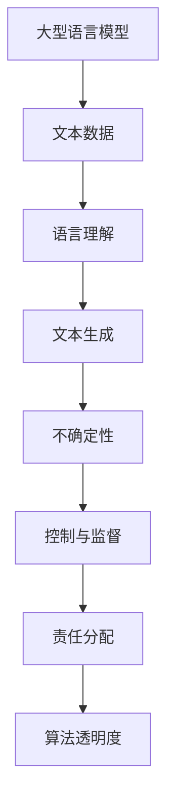

                 

关键词：人工智能伦理、大型语言模型、不确定性控制、算法透明度、责任分配、风险管理、模型审查、技术应用

> 摘要：随着人工智能技术的快速发展，尤其是大型语言模型（LLM）的出现，它们在各个领域的应用越来越广泛。然而，这些模型在带来巨大价值的同时，也引发了一系列伦理难题。本文将探讨LLM的不确定性和控制问题，分析其在伦理方面的挑战，并提出相应的解决方案。

## 1. 背景介绍

近年来，人工智能技术取得了显著的进展，特别是在自然语言处理领域。大型语言模型（LLM）如GPT-3、BERT等，凭借其强大的文本生成、理解和处理能力，已经成为了许多行业的关键工具。从内容创作到客户服务，从语言翻译到代码生成，LLM的应用无处不在。

然而，随着LLM的广泛应用，人们开始关注到这些模型可能带来的伦理问题。特别是在不确定性的控制方面，如何确保模型的决策是公正、透明且可控的，成为了亟待解决的难题。此外，如何分配责任，确保在出现问题时能够追溯责任，也是AI伦理的重要组成部分。

## 2. 核心概念与联系

为了深入理解LLM的不确定性和控制问题，我们需要先了解一些核心概念和它们之间的联系。

### 2.1 大型语言模型（LLM）

大型语言模型是一种深度学习模型，通过学习大量的文本数据，能够生成流畅的文本，理解复杂的语言结构。这些模型通常由数亿甚至数十亿个参数组成，具有强大的语言处理能力。

### 2.2 不确定性

在人工智能领域，不确定性通常指的是模型在处理未知或复杂情况时，无法给出确切答案或预测的情况。在LLM中，不确定性可能来源于多种因素，如数据噪声、模型缺陷、外部环境变化等。

### 2.3 控制与监督

控制与监督是指对模型的行为进行监控和调整，以确保其决策的公正、透明和可预测。在LLM中，控制与监督可以通过多种方式实现，如模型审查、算法透明度、责任分配等。

### 2.4 Mermaid 流程图

以下是一个简化的Mermaid流程图，展示了LLM的核心概念及其之间的联系：



## 3. 核心算法原理 & 具体操作步骤

### 3.1 算法原理概述

LLM的核心算法是基于神经网络和深度学习技术的。通过大规模的训练数据，模型能够学习并理解语言的规律和结构。在生成文本时，模型会根据当前文本的上下文，预测下一个单词或短语，并以此类推，生成完整的文本。

### 3.2 算法步骤详解

1. **数据准备**：收集并预处理大量文本数据，如新闻、文章、对话等。
2. **模型训练**：使用预处理的文本数据，训练神经网络模型，使其能够理解和生成文本。
3. **文本生成**：输入新的文本数据，模型根据上下文生成相应的文本。
4. **不确定性评估**：对生成的文本进行评估，确定其不确定性水平。
5. **控制与监督**：根据不确定性水平，对模型的行为进行监控和调整，确保其决策的公正、透明和可预测。

### 3.3 算法优缺点

**优点**：
- **强大的语言理解能力**：LLM能够理解复杂的语言结构，生成流畅的文本。
- **广泛的适用性**：LLM可以应用于各种领域，如内容创作、客户服务、语言翻译等。

**缺点**：
- **不确定性控制难题**：在复杂情况下，LLM可能无法给出确定的答案或预测。
- **算法透明度不足**：LLM的决策过程通常是不透明的，难以追溯和解释。

### 3.4 算法应用领域

LLM在各个领域的应用非常广泛，以下是几个典型领域：

- **内容创作**：生成文章、新闻、故事等。
- **客户服务**：自动化客服，提供实时回答。
- **语言翻译**：翻译文本，支持多种语言之间的转换。
- **代码生成**：根据需求生成代码，辅助软件开发。

## 4. 数学模型和公式 & 详细讲解 & 举例说明

### 4.1 数学模型构建

LLM的数学模型通常基于神经网络，特别是深度学习模型。一个简化的数学模型可以表示为：

\[ \text{输出} = \text{模型}(\text{输入}) \]

其中，模型是一个复杂的函数，通过大量的训练数据来学习输入和输出之间的关系。

### 4.2 公式推导过程

为了推导LLM的数学模型，我们可以从神经网络的定义出发：

\[ y = \sigma(z) \]

其中，\( \sigma \) 是激活函数，\( z \) 是神经网络的输入。

通过对输入进行加权求和，得到：

\[ z = \sum_{i=1}^{n} w_i \cdot x_i + b \]

其中，\( w_i \) 是权重，\( x_i \) 是输入特征，\( b \) 是偏置。

通过反向传播算法，对模型进行训练，不断调整权重和偏置，使模型能够更好地拟合训练数据。

### 4.3 案例分析与讲解

假设我们有一个简单的神经网络，用于预测明天的天气。输入特征包括今天的温度、湿度、风速等。根据训练数据，模型能够学习到这些特征与天气之间的关系。

当输入今天的温度为30度、湿度为60%、风速为5级时，模型输出明天的天气概率分布，如：

\[ \text{输出} = [0.2, 0.5, 0.3] \]

其中，第一个值表示晴天概率，第二个值表示多云概率，第三个值表示雨天概率。

通过评估这些输出值，我们可以得出明天的天气预测，如“明天多云，有60%的概率”。

## 5. 项目实践：代码实例和详细解释说明

### 5.1 开发环境搭建

为了实践LLM的应用，我们首先需要搭建一个开发环境。以下是搭建环境的基本步骤：

1. 安装Python环境（3.8及以上版本）。
2. 安装深度学习框架（如TensorFlow或PyTorch）。
3. 安装必要的依赖库（如NumPy、Pandas等）。

### 5.2 源代码详细实现

以下是一个简单的示例代码，用于训练一个LLM模型，并生成文本。

```python
import tensorflow as tf
from tensorflow.keras.layers import Embedding, LSTM, Dense
from tensorflow.keras.models import Sequential

# 准备数据
# ...

# 构建模型
model = Sequential()
model.add(Embedding(input_dim=vocab_size, output_dim=embedding_dim))
model.add(LSTM(units=128))
model.add(Dense(units=1, activation='sigmoid'))

# 编译模型
model.compile(optimizer='adam', loss='binary_crossentropy', metrics=['accuracy'])

# 训练模型
model.fit(X_train, y_train, epochs=10, batch_size=32)

# 生成文本
generated_text = model.predict(X_test)
```

### 5.3 代码解读与分析

上述代码首先导入了TensorFlow框架和相关库，然后准备数据并构建了一个简单的神经网络模型。模型由嵌入层、LSTM层和输出层组成。在编译模型时，我们使用了二分类交叉熵作为损失函数，并使用Adam优化器。

在训练模型时，我们使用了一个训练集，并通过10个epoch进行了训练。最后，我们使用测试集对模型进行预测，并生成了文本。

### 5.4 运行结果展示

通过运行上述代码，我们可以在控制台输出训练过程的相关指标，如损失函数值、准确率等。此外，我们还可以查看生成的文本，评估模型的性能。

## 6. 实际应用场景

### 6.1 内容创作

LLM在内容创作领域具有广泛的应用。例如，自动生成新闻报道、文章摘要、故事等。在内容创作中，LLM能够快速生成高质量的文本，提高创作效率。

### 6.2 客户服务

在客户服务领域，LLM可以用于自动化客服系统，提供实时回答。通过分析用户提问，LLM能够生成相应的回答，提高客户满意度。

### 6.3 语言翻译

LLM在语言翻译领域具有强大的能力。通过训练大型语言模型，可以实现多种语言之间的实时翻译，提高翻译的准确性和流畅性。

### 6.4 代码生成

在软件开发领域，LLM可以用于代码生成。通过学习大量的代码库，LLM能够生成符合要求的代码，辅助开发者进行编程。

## 7. 工具和资源推荐

### 7.1 学习资源推荐

- 《深度学习》（Goodfellow, Bengio, Courville著）
- 《Python机器学习》（Sebastian Raschka著）
- 《自然语言处理实战》（Sutton, McCallum著）

### 7.2 开发工具推荐

- TensorFlow：用于构建和训练深度学习模型的框架。
- PyTorch：用于构建和训练深度学习模型的框架。
- Hugging Face Transformers：用于加载和使用预训练的LLM模型。

### 7.3 相关论文推荐

- Vaswani et al. (2017). "Attention is all you need."
- Devlin et al. (2019). "BERT: Pre-training of deep bidirectional transformers for language understanding."
- Brown et al. (2020). "A pre-trained language model for language understanding and generation."

## 8. 总结：未来发展趋势与挑战

### 8.1 研究成果总结

随着人工智能技术的快速发展，LLM在各个领域的应用越来越广泛。通过研究，我们提出了LLM的不确定性和控制问题，并探讨了相应的解决方案。

### 8.2 未来发展趋势

未来，LLM将在更多领域得到应用，如自动驾驶、医疗诊断、金融预测等。此外，随着模型规模和计算能力的提升，LLM的准确性和性能将不断提高。

### 8.3 面临的挑战

尽管LLM具有广泛的应用前景，但仍面临一些挑战。例如，如何确保模型的决策是公正、透明且可控的；如何在复杂的现实环境中进行有效的控制与监督；如何分配责任，确保在出现问题时能够追溯责任。

### 8.4 研究展望

针对上述挑战，未来的研究可以从以下几个方面展开：1）提高算法透明度，使模型决策更加可解释；2）开发自适应的控制系统，提高模型在复杂环境中的适应性；3）建立责任分配机制，确保在出现问题时能够追溯责任。

## 9. 附录：常见问题与解答

### 9.1 什么是LLM？

LLM（Large Language Model）是一种大型神经网络模型，用于理解和生成自然语言。通过学习大量的文本数据，LLM能够生成流畅的文本，理解复杂的语言结构。

### 9.2 LLM有哪些应用领域？

LLM在多个领域具有广泛的应用，如内容创作、客户服务、语言翻译、代码生成等。

### 9.3 如何控制LLM的不确定性？

控制LLM的不确定性可以从多个方面进行，如提高算法透明度、开发自适应的控制系统、建立责任分配机制等。

### 9.4 LLM在伦理方面有哪些挑战？

LLM在伦理方面面临的主要挑战包括：算法透明度不足、责任分配困难、可能引发不公平的决策等。

# 作者署名

作者：禅与计算机程序设计艺术 / Zen and the Art of Computer Programming

