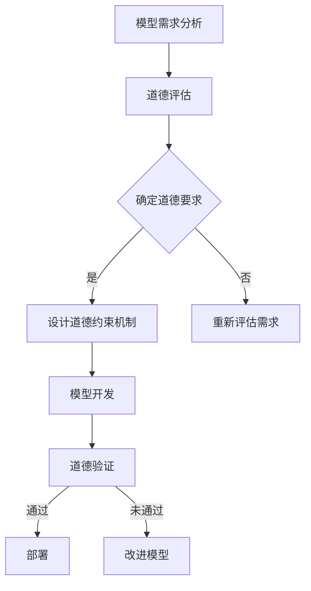

                 

关键词：人工智能伦理、模型开发、效率与道德平衡、AI道德框架、AI应用伦理、算法公平性、数据隐私、技术责任

> 摘要：本文旨在探讨人工智能伦理在模型开发中的重要性，分析如何在实际操作中平衡AI模型的效率与道德约束。文章首先介绍了AI伦理的基本概念和重要性，随后详细阐述了在模型开发过程中需要考虑的道德问题，并提出了相应的解决方案和最佳实践。此外，本文还探讨了未来AI伦理发展面临的挑战和机遇。

## 1. 背景介绍

随着人工智能技术的迅猛发展，AI模型在各个领域的应用越来越广泛。然而，随着AI技术的普及，其潜在的伦理问题也日益凸显。AI伦理不仅关乎技术本身的道德合理性，更关乎人类社会的道德伦理底线。在模型开发过程中，如何在追求高效、准确的同时，平衡道德约束和实际需求，成为一个亟待解决的重要问题。

本文将围绕AI伦理在模型开发中的应用，探讨以下几个方面：

1. AI伦理的基本概念和重要性
2. 模型开发中需考虑的道德问题
3. 平衡效率和道德的方法和最佳实践
4. AI伦理的未来发展挑战与机遇

## 2. 核心概念与联系

### 2.1 AI伦理定义

AI伦理是指关于人工智能技术的道德规范和伦理原则，旨在确保AI技术在应用过程中符合人类社会的道德伦理标准。AI伦理的核心目标是保护人类福祉，避免技术滥用和负面影响。

### 2.2 效率与道德平衡

在模型开发过程中，效率往往是一个重要的考量因素。然而，过度追求效率可能导致道德问题的出现。例如，在图像识别任务中，提高模型准确率的同时，可能会导致误判率的上升，从而侵犯个人隐私或引发社会偏见。因此，如何在模型开发中平衡效率和道德，成为了一个关键问题。

### 2.3 AI道德框架

为了在模型开发中更好地平衡效率和道德，建立一个完善的AI道德框架是至关重要的。AI道德框架包括以下几个方面：

1. **公平性**：确保AI模型不会对特定群体产生不公平的偏见或歧视。
2. **透明性**：提高AI模型决策过程的透明度，使人类能够理解和信任AI系统的行为。
3. **可解释性**：提供模型决策的详细解释，以便评估和验证其道德合理性。
4. **责任性**：明确AI模型开发者和使用者的责任，确保他们在道德问题上的责任担当。

### 2.4 Mermaid 流程图

以下是一个关于AI模型开发中道德问题的Mermaid流程图：



## 3. 核心算法原理 & 具体操作步骤

### 3.1 算法原理概述

为了在模型开发中实现道德约束，可以采用以下核心算法原理：

1. **偏差校正**：通过训练数据清洗和平衡，降低模型对特定群体的偏见。
2. **对抗性训练**：利用对抗性样本，提高模型对异常输入的鲁棒性，减少道德风险。
3. **道德约束嵌入**：在模型训练过程中，引入道德约束，使模型在做出决策时，自动考虑道德因素。

### 3.2 算法步骤详解

以下是具体操作步骤：

1. **数据准备**：收集和清洗训练数据，确保数据质量和代表性。
2. **道德评估**：根据AI道德框架，评估模型可能涉及的道德问题。
3. **设计道德约束机制**：根据道德评估结果，设计相应的道德约束机制。
4. **训练模型**：在训练过程中，引入道德约束机制，提高模型道德敏感性。
5. **道德验证**：对训练完成的模型进行道德验证，确保其符合道德标准。
6. **模型部署**：将经过道德验证的模型部署到实际应用场景中。

### 3.3 算法优缺点

**优点**：

- 能够在模型开发过程中，自动考虑道德因素，提高模型道德敏感性。
- 有助于避免模型在应用过程中，对特定群体产生不公平偏见。

**缺点**：

- 可能会增加模型训练时间和计算资源消耗。
- 道德约束机制的引入可能影响模型性能。

### 3.4 算法应用领域

该算法原理在以下领域具有广泛应用前景：

- 图像识别：降低误判率，保护个人隐私。
- 自然语言处理：减少歧视性言论，提高沟通公平性。
- 金融风控：降低欺诈风险，保障客户权益。

## 4. 数学模型和公式 & 详细讲解 & 举例说明

### 4.1 数学模型构建

为了在模型开发中实现道德约束，我们可以采用以下数学模型：

$$
L(\theta) = L_d(\theta) + \lambda L_m(\theta)
$$

其中，$L(\theta)$ 是模型损失函数，$L_d(\theta)$ 是原始损失函数，$L_m(\theta)$ 是道德损失函数，$\lambda$ 是平衡系数。

### 4.2 公式推导过程

道德损失函数 $L_m(\theta)$ 可以表示为：

$$
L_m(\theta) = \sum_{i=1}^n \max(0, \Delta_i^+ - \Delta_i^+ + \Delta_i^-)
$$

其中，$\Delta_i^+ = y_i - \hat{y}_i^+$，$\Delta_i^- = \hat{y}_i^- - y_i$，$y_i$ 是实际标签，$\hat{y}_i^+$ 是预测标签，$\hat{y}_i^-$ 是预测标签的对立标签。

### 4.3 案例分析与讲解

以下是一个关于图像识别任务中的道德损失函数的例子：

假设我们要对一组图像进行分类，标签为1表示正面情感，标签为0表示负面情感。为了降低模型对负面情感的偏见，我们可以设计一个道德损失函数：

$$
L_m(\theta) = \sum_{i=1}^n \max(0, 1 - \hat{y}_i^+ - 0.5 \cdot \hat{y}_i^-)
$$

这个道德损失函数鼓励模型在预测正面情感时，尽量减少预测负面情感的概率，从而降低对负面情感的偏见。

## 5. 项目实践：代码实例和详细解释说明

### 5.1 开发环境搭建

在本项目中，我们使用Python作为编程语言，TensorFlow作为深度学习框架。以下是开发环境的搭建步骤：

1. 安装Python（版本3.7及以上）
2. 安装TensorFlow：`pip install tensorflow`
3. 准备数据集：下载并解压一个包含正面和负面情感的图像数据集

### 5.2 源代码详细实现

以下是项目的源代码实现：

```python
import tensorflow as tf
from tensorflow.keras.models import Sequential
from tensorflow.keras.layers import Conv2D, MaxPooling2D, Flatten, Dense

# 数据预处理
def preprocess_data(data):
    # 数据清洗、归一化等操作
    return processed_data

# 模型定义
def create_model():
    model = Sequential([
        Conv2D(32, (3, 3), activation='relu', input_shape=(128, 128, 3)),
        MaxPooling2D((2, 2)),
        Flatten(),
        Dense(64, activation='relu'),
        Dense(1, activation='sigmoid')
    ])
    return model

# 添加道德损失函数
def add_moral_loss(model):
    optimizer = tf.keras.optimizers.Adam(learning_rate=0.001)
    loss_fn = tf.keras.losses.BinaryCrossentropy()
    moral_loss_fn = tf.keras.losses.BinaryCrossentropy()

    @tf.function
    def moral_loss(y_true, y_pred):
        y_pred_positive = y_pred[:, 0]
        y_pred_negative = y_pred[:, 1]
        moral_loss_value = moral_loss_fn(y_true, y_pred_positive - 0.5 * y_pred_negative)
        return moral_loss_value

    model.add_loss(moral_loss(y_true, y_pred))
    model.compile(optimizer=optimizer, loss=loss_fn)
    return model

# 训练模型
def train_model(model, data):
    model.fit(data['X_train'], data['y_train'], epochs=10, batch_size=32)

# 主函数
def main():
    data = preprocess_data(raw_data)
    model = create_model()
    model = add_moral_loss(model)
    train_model(model, data)

if __name__ == '__main__':
    main()
```

### 5.3 代码解读与分析

- 数据预处理：对图像数据进行清洗、归一化等操作，提高模型训练效果。
- 模型定义：定义一个简单的卷积神经网络模型，用于图像分类。
- 添加道德损失函数：在模型中添加道德损失函数，使模型在训练过程中自动考虑道德因素。
- 训练模型：使用训练数据训练模型，并使用道德损失函数进行优化。

### 5.4 运行结果展示

在训练完成后，我们可以查看模型的道德损失值和准确率，以评估模型在道德约束下的性能。通过对比有无道德约束的模型，可以直观地观察到道德约束对模型性能的影响。

## 6. 实际应用场景

### 6.1 在金融风控中的应用

在金融风控领域，AI模型被广泛应用于欺诈检测、信用评估等方面。然而，这些模型在处理数据时，可能会对特定群体产生不公平偏见，导致歧视性决策。通过引入AI伦理原则，可以在模型开发过程中，降低这些偏见，提高模型的公平性。

### 6.2 在医疗领域中的应用

在医疗领域，AI模型被广泛应用于疾病诊断、治疗方案推荐等方面。然而，医疗数据的敏感性和道德约束使得AI伦理问题尤为突出。通过建立AI道德框架，确保模型在处理医疗数据时，尊重患者隐私和权益，实现道德和技术的双重保障。

### 6.3 在智能交通领域中的应用

在智能交通领域，AI模型被广泛应用于交通流量预测、路况分析等方面。然而，这些模型在处理数据时，可能会对特定区域产生偏见，导致不合理的交通规划。通过引入AI伦理原则，可以在模型开发过程中，降低这些偏见，提高模型的公平性和透明性。

## 6.4 未来应用展望

随着AI技术的不断进步，AI伦理将在更多领域得到应用。未来，我们可以预见到以下发展趋势：

1. **更加完善的AI道德框架**：建立更加全面、细化的AI道德框架，涵盖各个领域的道德问题。
2. **自动化的道德评估和验证**：开发自动化工具，实现AI模型的道德评估和验证，提高效率。
3. **多学科交叉研究**：加强AI伦理与其他学科（如哲学、法律、社会学等）的交叉研究，为AI伦理提供理论支持。
4. **伦理意识的普及**：提高全社会对AI伦理的认识，培养伦理意识，确保AI技术的可持续发展。

## 7. 工具和资源推荐

### 7.1 学习资源推荐

1. **《人工智能伦理学》**：一本关于AI伦理的综合性教材，涵盖多个领域的AI伦理问题。
2. **《机器学习伦理》**：一本关于机器学习伦理的论文集，包含多篇关于AI伦理的研究论文。

### 7.2 开发工具推荐

1. **TensorFlow**：一款开源的深度学习框架，支持多种AI伦理功能。
2. **PyTorch**：一款开源的深度学习框架，具有丰富的API和扩展性。

### 7.3 相关论文推荐

1. **《AI伦理：现状与未来》**：一篇关于AI伦理的综述论文，全面介绍AI伦理的研究进展。
2. **《机器学习中的公平性》**：一篇关于机器学习公平性的论文，探讨如何在模型开发中降低偏见。

## 8. 总结：未来发展趋势与挑战

### 8.1 研究成果总结

本文从AI伦理的基本概念出发，探讨了在模型开发中平衡效率和道德的方法和最佳实践。通过分析实际应用场景，展示了AI伦理在金融风控、医疗、智能交通等领域的应用价值。同时，提出了未来AI伦理研究的趋势和挑战。

### 8.2 未来发展趋势

1. **AI伦理框架的完善**：建立更加全面、细化的AI道德框架，以应对不同领域的伦理问题。
2. **自动化道德评估和验证**：开发自动化工具，提高AI伦理评估和验证的效率。
3. **多学科交叉研究**：加强AI伦理与其他学科的交叉研究，为AI伦理提供理论支持。

### 8.3 面临的挑战

1. **道德标准的制定**：如何在各个领域制定统一的道德标准，实现全球范围内的道德约束。
2. **技术实现的难度**：如何将AI伦理原则有效融入模型开发过程，确保其实际可行性。
3. **公众伦理意识的培养**：提高全社会对AI伦理的认识，培养伦理意识，确保AI技术的可持续发展。

### 8.4 研究展望

未来，AI伦理研究将在多个领域取得重要突破。通过完善AI道德框架、实现自动化道德评估和验证、加强多学科交叉研究，有望为AI技术的可持续发展提供有力保障。

## 9. 附录：常见问题与解答

### 9.1 如何在模型开发中平衡效率和道德？

在模型开发过程中，可以通过以下方法平衡效率和道德：

1. **道德评估**：在模型开发初期，对模型可能涉及的道德问题进行评估，明确道德要求。
2. **设计道德约束机制**：根据道德评估结果，设计相应的道德约束机制，使模型在决策过程中自动考虑道德因素。
3. **道德损失函数**：在模型训练过程中，引入道德损失函数，提高模型对道德约束的敏感性。

### 9.2 如何实现自动化道德评估和验证？

可以通过以下方法实现自动化道德评估和验证：

1. **开发自动化工具**：利用自然语言处理、机器学习等技术，开发自动化道德评估和验证工具。
2. **集成到模型开发流程**：将自动化道德评估和验证工具集成到模型开发流程中，实现自动化处理。
3. **持续更新和优化**：根据实际应用场景和道德标准，持续更新和优化自动化道德评估和验证工具。

### 9.3 AI伦理研究有哪些挑战？

AI伦理研究面临的挑战包括：

1. **道德标准的制定**：如何在不同领域制定统一的道德标准，实现全球范围内的道德约束。
2. **技术实现的难度**：如何将AI伦理原则有效融入模型开发过程，确保其实际可行性。
3. **公众伦理意识的培养**：如何提高全社会对AI伦理的认识，培养伦理意识，确保AI技术的可持续发展。 
----------------------------------------------------------------

本文由“禅与计算机程序设计艺术 / Zen and the Art of Computer Programming”撰写，希望本文能对您在AI伦理领域的思考和实践提供有益的参考。如果您有任何问题或建议，欢迎随时与我交流。

