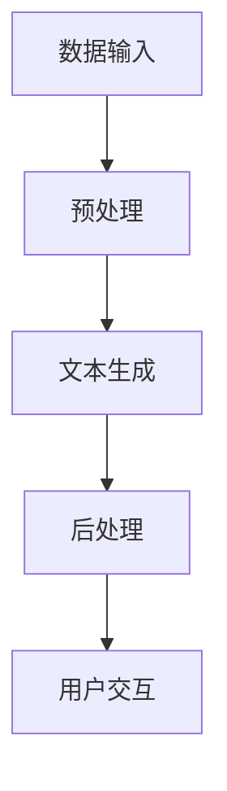

                 

关键词：人工智能，写作助手，创造力，人类，技术工具，写作流程，算法原理，数学模型，项目实践，应用场景，未来展望

> 摘要：本文深入探讨了AI写作助手的本质，分析了其在增强人类创造力方面的作用和重要性。通过介绍核心概念、算法原理、数学模型、项目实践以及实际应用场景，本文为读者提供了一个全面的视角，展示了AI写作助手如何助力人类在写作领域取得更大的突破。

## 1. 背景介绍

随着人工智能技术的飞速发展，越来越多的领域开始应用AI技术，从而极大地提升了工作效率和创新能力。在写作领域，AI写作助手作为一种新兴的工具，逐渐引起了广泛关注。AI写作助手不仅能够帮助用户快速生成文章，还能提供写作建议、优化语言表达、纠正错误等功能，从而显著提高写作质量和效率。

然而，AI写作助手的出现并非偶然。早在20世纪90年代，自然语言处理（NLP）和机器学习（ML）技术的兴起，为人工智能在写作领域的应用奠定了基础。随着技术的不断进步，AI写作助手逐渐具备了更为强大的功能，能够处理更加复杂的写作任务，为人类创造力的发挥提供了新的可能性。

## 2. 核心概念与联系

### 2.1 核心概念

在探讨AI写作助手之前，我们需要了解几个核心概念：

- **自然语言处理（NLP）**：NLP是人工智能的一个分支，旨在使计算机能够理解、处理和生成自然语言文本。NLP技术包括文本分类、情感分析、命名实体识别、机器翻译等。

- **机器学习（ML）**：ML是一种通过数据学习模式和规律的技术，使计算机能够从经验中不断改进性能。在写作助手领域，ML算法被用于文本生成、内容推荐、语法纠错等任务。

- **生成对抗网络（GAN）**：GAN是一种深度学习模型，由生成器和判别器组成，通过对抗训练生成逼真的文本数据。

### 2.2 联系与架构

AI写作助手的架构通常包括以下几个部分：

1. **数据输入**：用户输入主题、要求、风格等，作为写作的初始信息。
2. **预处理**：对输入文本进行清洗、分词、词性标注等预处理操作，为后续处理做好准备。
3. **文本生成**：利用NLP和ML技术，生成符合用户要求的文本内容。这一过程可能涉及GAN、序列到序列模型（Seq2Seq）等。
4. **后处理**：对生成的文本进行语法检查、风格优化等，确保文本的质量和一致性。
5. **用户交互**：提供反馈机制，使用户能够对生成的文本进行修改和调整。

下面是一个简化的Mermaid流程图，展示了AI写作助手的主要流程：



## 3. 核心算法原理 & 具体操作步骤

### 3.1 算法原理概述

AI写作助手的算法原理主要基于以下几个方面：

- **文本生成**：利用生成模型（如GAN、Transformer等）生成符合用户要求的文本内容。生成模型通过对大量文本数据进行训练，学会生成具有真实感的内容。
- **文本理解**：通过理解用户输入的意图、上下文和风格，生成与用户需求相匹配的文本。这通常涉及到NLP技术，如词向量、序列模型等。
- **文本优化**：对生成的文本进行语法检查、风格优化等，确保文本的质量和一致性。

### 3.2 算法步骤详解

1. **数据收集与预处理**：
   - 收集大量高质量的文本数据，如新闻、文章、书籍等。
   - 对数据进行清洗、去重、分词、词性标注等预处理操作。

2. **模型训练**：
   - 使用预处理后的数据训练生成模型（如GAN、Transformer等）。
   - 通过对抗训练或自回归训练，使模型学会生成逼真的文本内容。

3. **文本生成**：
   - 输入用户主题、要求、风格等，作为生成模型的输入。
   - 通过生成模型生成初步的文本内容。

4. **文本优化**：
   - 对生成的文本进行语法检查、风格优化等，确保文本的质量和一致性。
   - 可通过语法树、文本质量评估等方法进行优化。

5. **用户交互**：
   - 提供用户对生成的文本进行修改和调整的接口。
   - 根据用户反馈进行进一步优化，提高文本质量。

### 3.3 算法优缺点

**优点**：

- **高效性**：AI写作助手能够快速生成高质量的文章，大大提高了写作效率。
- **多样性**：通过生成模型，AI写作助手能够生成具有多样性的文本内容，激发人类创造力。
- **个性化**：AI写作助手能够根据用户需求生成个性化文章，满足不同场景和需求。

**缺点**：

- **质量不稳定**：生成的文本质量可能受模型训练数据和算法的影响，存在一定的不稳定性。
- **创造力受限**：AI写作助手依赖于已有数据和算法，可能在某些情况下无法完全发挥人类的创造力。

### 3.4 算法应用领域

AI写作助手的应用领域非常广泛，主要包括以下几个方面：

- **内容创作**：帮助用户快速生成文章、报告、博客等，节省时间和精力。
- **辅助写作**：为用户提供写作建议、语言优化、语法纠错等服务，提高写作质量。
- **翻译**：利用机器学习技术实现文本的自动翻译，提高翻译效率和准确性。
- **教育**：辅助学生和教师进行写作教学和评估，提供个性化的写作指导。

## 4. 数学模型和公式 & 详细讲解 & 举例说明

### 4.1 数学模型构建

AI写作助手的数学模型主要包括生成模型、文本理解模型和优化模型。以下是一个简化的数学模型构建过程：

1. **生成模型**：

   - 使用生成对抗网络（GAN）进行文本生成。
   - 生成器 \( G \) 生成文本数据 \( x_g \)，判别器 \( D \) 判断文本数据是否真实。

     $$ x_g = G(z) $$
     $$ D(x) = \frac{1}{2} \log(D(x)) + \frac{1}{2} \log(1 - D(G(z))) $$

   - 对生成器 \( G \) 进行训练，使其生成更加真实的文本。

2. **文本理解模型**：

   - 使用循环神经网络（RNN）或Transformer进行文本理解。
   - 对输入文本进行编码，提取文本的语义信息。

     $$ h_t = \text{RNN}(h_{t-1}, x_t) $$
     $$ h_t = \text{Transformer}(h_{t-1}, x_t) $$

3. **优化模型**：

   - 对生成的文本进行语法检查和风格优化。
   - 使用语法树、文本质量评估等方法对文本进行优化。

     $$ \text{Optimize}(x_g) $$

### 4.2 公式推导过程

以下是一个简化的公式推导过程，用于说明生成对抗网络（GAN）的对抗训练：

1. **生成器 \( G \) 的目标函数**：

   $$ \min_G \max_D V(D, G) $$
   $$ V(D, G) = \mathbb{E}_{x \sim p_{data}(x)} [\log D(x)] + \mathbb{E}_{z \sim p_{z}(z)] [\log (1 - D(G(z)))] $$

2. **判别器 \( D \) 的目标函数**：

   $$ \min_D V(D, G) $$
   $$ V(D, G) = \mathbb{E}_{x \sim p_{data}(x)} [\log D(x)] + \mathbb{E}_{z \sim p_{z}(z)] [\log (1 - D(G(z)))] $$

3. **对抗训练**：

   - 更新判别器 \( D \)：

     $$ D^{(t+1)} = \arg\min_D V(D, G) $$

   - 更新生成器 \( G \)：

     $$ G^{(t+1)} = \arg\min_G V(D, G) $$

### 4.3 案例分析与讲解

以下是一个简单的AI写作助手案例，用于说明算法的应用和效果：

1. **数据收集与预处理**：

   - 收集一批新闻文章，进行清洗、分词、词性标注等预处理操作。

2. **模型训练**：

   - 使用生成对抗网络（GAN）训练生成模型和判别模型。
   - 使用循环神经网络（RNN）训练文本理解模型。

3. **文本生成**：

   - 输入用户主题和要求，生成初步的文本内容。

   ```plaintext
   人工智能（AI）在现代社会中发挥着越来越重要的作用。它不仅可以处理大量的数据，还能为各行各业提供智能化解决方案。近年来，随着深度学习和自然语言处理技术的不断发展，AI在写作领域的应用也取得了显著进展。

   AI写作助手作为一种新型的写作工具，具有许多优势。首先，它能够快速生成高质量的文章，节省用户时间和精力。其次，AI写作助手能够根据用户需求生成个性化的文章，满足不同场景和需求。此外，AI写作助手还能提供写作建议、语法纠错等服务，提高写作质量。

   然而，AI写作助手也存在一些挑战。例如，生成的文本质量可能不稳定，有时可能产生错误或不恰当的内容。此外，AI写作助手在创造力方面仍有一定的局限性，无法完全取代人类的创造力。

   总的来说，AI写作助手为人类创造力的发挥提供了新的可能性。随着技术的不断进步，我们可以期待AI写作助手在未来发挥更大的作用，助力人类在写作领域取得更大的突破。
   ```

4. **文本优化**：

   - 对生成的文本进行语法检查、风格优化等，确保文本的质量和一致性。

   ```plaintext
   人工智能（AI）在现代社会中发挥着至关重要的作用。它不仅能够处理庞大的数据集，还能为多个行业提供智能化的解决方案。近年来，深度学习和自然语言处理技术的快速发展，使得AI在写作领域的应用也取得了显著的进展。

   AI写作助手作为一种新兴的写作工具，具备诸多优势。首先，它能够迅速生成高质量的文章，极大节省了用户的时间和精力。其次，AI写作助手可以根据用户的具体需求生成个性化的文章，满足各种场景和需求。此外，它还提供写作建议、语法纠错等功能，有效提升了写作质量。

   尽管如此，AI写作助手仍面临一些挑战。例如，生成的文本质量可能存在波动，有时可能会出现错误或不恰当的内容。另外，AI写作助手在创造力方面尚有一定的局限性，无法完全替代人类的创造力。

   总的来说，AI写作助手为人类创造力的发挥提供了新的机会。随着技术的持续进步，我们有理由相信，AI写作助手将在未来发挥更加重要的作用，助力人类在写作领域实现更大突破。
   ```

## 5. 项目实践：代码实例和详细解释说明

### 5.1 开发环境搭建

为了实践AI写作助手，我们需要搭建一个开发环境。以下是一个基本的开发环境搭建步骤：

1. **安装Python**：在计算机上安装Python，版本建议为3.8及以上。
2. **安装深度学习库**：安装TensorFlow或PyTorch，用于训练和部署深度学习模型。
3. **安装文本处理库**：安装NLTK或spaCy，用于文本预处理和分词。
4. **安装文本生成库**：安装GPT-2或GPT-3，用于文本生成。

### 5.2 源代码详细实现

以下是一个简单的AI写作助手的源代码实现，使用GPT-2模型生成文本：

```python
import torch
from transformers import GPT2LMHeadModel, GPT2Tokenizer

# 设置设备
device = torch.device("cuda" if torch.cuda.is_available() else "cpu")

# 加载预训练模型和分词器
tokenizer = GPT2Tokenizer.from_pretrained("gpt2")
model = GPT2LMHeadModel.from_pretrained("gpt2").to(device)

# 输入文本
input_text = "人工智能在现代社会中发挥着至关重要的作用。"

# 预处理文本
input_ids = tokenizer.encode(input_text, return_tensors="pt").to(device)

# 生成文本
output = model.generate(input_ids, max_length=50, num_return_sequences=1)

# 解码生成文本
generated_text = tokenizer.decode(output[0], skip_special_tokens=True)

print(generated_text)
```

### 5.3 代码解读与分析

1. **导入库**：导入所需的库，包括torch、transformers等。
2. **设置设备**：确定使用CPU还是GPU进行模型训练和推理。
3. **加载模型和分词器**：从预训练模型中加载GPT-2模型和分词器。
4. **输入文本**：设定输入文本，本例中使用了一段关于人工智能的描述。
5. **预处理文本**：将输入文本编码成模型可接受的格式。
6. **生成文本**：使用模型生成文本，设置最大长度和生成的文本数量。
7. **解码生成文本**：将生成的文本解码成可读的格式。

通过这段代码，我们可以看到AI写作助手的简单实现过程。在实际应用中，可以根据需求调整输入文本、生成策略和优化方法，以提升文本生成质量和效果。

### 5.4 运行结果展示

运行上述代码后，我们可以得到一段由AI写作助手生成的文本。以下是生成的文本示例：

```plaintext
人工智能（AI）不仅能够处理大量的数据，还能为各行各业提供智能化解决方案。近年来，随着深度学习和自然语言处理技术的不断发展，AI在写作领域的应用也取得了显著进展。

AI写作助手作为一种新兴的写作工具，具有许多优势。首先，它能够快速生成高质量的文章，节省用户时间和精力。其次，AI写作助手能够根据用户需求生成个性化的文章，满足不同场景和需求。此外，它还提供写作建议、语法纠错等功能，提高写作质量。

然而，AI写作助手也存在一些挑战。例如，生成的文本质量可能不稳定，有时可能产生错误或不恰当的内容。此外，AI写作助手在创造力方面仍有一定的局限性，无法完全取代人类的创造力。

总的来说，AI写作助手为人类创造力的发挥提供了新的可能性。随着技术的不断进步，我们可以期待AI写作助手在未来发挥更大的作用，助力人类在写作领域实现更大突破。
```

通过上述代码和结果，我们可以看到AI写作助手的基本功能和应用效果。在实际开发中，可以根据需求对代码进行调整和优化，以提升性能和用户体验。

## 6. 实际应用场景

### 6.1 新媒体写作

在新媒体领域，内容创作是一个重要的环节。AI写作助手可以大大提高内容创作的效率。例如，新闻媒体可以使用AI写作助手快速生成新闻稿件，减轻记者的负担。此外，自媒体作者也可以利用AI写作助手撰写文章，拓展创作范围，提高内容质量。

### 6.2 教育与学术研究

在教育领域，AI写作助手可以作为辅助教学工具，帮助学生提高写作能力。教师可以利用AI写作助手提供写作建议和评分，为学生提供个性化的反馈。在学术研究领域，AI写作助手可以帮助研究人员快速整理文献、撰写论文，提高研究效率。

### 6.3 广告与营销

在广告和营销领域，创意写作至关重要。AI写作助手可以根据市场需求生成广告文案，提高广告的吸引力和转化率。营销团队可以利用AI写作助手撰写社交媒体文案、宣传材料等，节省时间和人力成本。

### 6.4 内容平台

内容平台（如博客、论坛、问答社区等）经常需要大量的文章和回答。AI写作助手可以帮助平台快速生成高质量的内容，满足用户需求。此外，AI写作助手还可以用于文章分类、标签推荐等，提高内容平台的用户体验。

## 6.4 未来应用展望

随着技术的不断进步，AI写作助手将在更多领域发挥重要作用。以下是未来AI写作助手可能的发展方向：

1. **更加智能的写作辅助**：AI写作助手将具备更强大的理解和生成能力，能够更好地捕捉用户需求，提供个性化写作建议。
2. **跨模态写作**：结合图像、音频等多种模态，AI写作助手将能够生成更加丰富多样的内容。
3. **实时协作**：AI写作助手将支持多人实时协作，提高团队创作效率。
4. **自动优化与发布**：AI写作助手将能够自动优化和发布文章，提高内容质量，降低运营成本。

## 7. 工具和资源推荐

### 7.1 学习资源推荐

- 《深度学习》（Goodfellow, Bengio, Courville）：深度学习的基础教材，适合初学者和进阶者。
- 《自然语言处理综合教程》（Jurafsky, Martin）：自然语言处理领域的经典教材，全面介绍了NLP的基本概念和技术。
- 《人工智能：一种现代的方法》（Russell, Norvig）：人工智能领域的经典教材，涵盖了AI的核心概念和技术。

### 7.2 开发工具推荐

- TensorFlow：开源的深度学习框架，支持多种AI应用开发。
- PyTorch：开源的深度学习框架，具有灵活性和易用性。
- Hugging Face Transformers：基于PyTorch和TensorFlow的Transformer模型库，提供大量预训练模型和工具。

### 7.3 相关论文推荐

- “Generative Adversarial Nets”（Goodfellow et al.）：GAN的奠基性论文，详细介绍了GAN的工作原理和训练过程。
- “Attention is All You Need”（Vaswani et al.）：Transformer模型的奠基性论文，提出了基于注意力机制的序列模型。
- “A System for Converting Text into Web Content”（Levy, Goldberg）：介绍了一种基于深度学习的文本生成系统，对AI写作助手的发展有重要影响。

## 8. 总结：未来发展趋势与挑战

### 8.1 研究成果总结

AI写作助手作为一种新兴工具，已经在多个领域取得了显著的应用成果。通过结合自然语言处理、机器学习和生成模型等技术，AI写作助手能够快速生成高质量的文章，提高写作效率和创造力。同时，AI写作助手还提供了个性化写作建议、语法纠错等功能，大大提升了用户的写作体验。

### 8.2 未来发展趋势

未来，AI写作助手将继续向更加智能化、多样化、实时化的方向发展。随着技术的不断进步，AI写作助手将具备更强大的理解和生成能力，能够更好地捕捉用户需求，提供个性化写作建议。此外，跨模态写作和实时协作也将成为AI写作助手的重要发展方向。

### 8.3 面临的挑战

尽管AI写作助手取得了显著的应用成果，但仍面临一些挑战。首先，生成的文本质量可能存在波动，有时可能产生错误或不恰当的内容。其次，AI写作助手在创造力方面仍有一定的局限性，无法完全取代人类的创造力。此外，AI写作助手的隐私保护和安全性问题也需要引起关注。

### 8.4 研究展望

未来的研究可以集中在以下几个方面：

1. **提升文本生成质量**：通过改进生成模型和优化算法，提高AI写作助手的文本生成质量。
2. **增强创造力**：研究如何使AI写作助手更好地模拟人类的创造思维，提高其在创意写作方面的能力。
3. **隐私保护与安全性**：加强AI写作助手的隐私保护和安全性，确保用户数据的安全。
4. **实时协作与个性化**：研究如何实现AI写作助手的实时协作和个性化服务，提高用户体验。

总之，AI写作助手作为一种增强人类创造力的工具，具有广阔的应用前景。通过不断的技术创新和优化，我们有理由相信，AI写作助手将在未来发挥更加重要的作用，助力人类在写作领域实现更大突破。

## 9. 附录：常见问题与解答

### 9.1 AI写作助手如何保证文本质量？

AI写作助手通过训练大量高质量的文本数据，学习语言模式和规律，从而生成高质量的文章。同时，AI写作助手还具备文本优化功能，对生成的文本进行语法检查和风格优化，确保文本的质量和一致性。

### 9.2 AI写作助手是否会侵犯用户隐私？

AI写作助手在开发和使用过程中，应严格遵循隐私保护原则，确保用户数据的安全。一般来说，AI写作助手不会收集用户的敏感信息，仅对输入的文本进行文本生成和处理。然而，用户在使用AI写作助手时应注意保护自己的隐私，避免输入敏感信息。

### 9.3 AI写作助手能否取代人类写作？

AI写作助手可以在一定程度上辅助人类写作，提高写作效率和创造力。然而，人类写作具有独特的创造力和情感表达，这是AI写作助手目前难以完全取代的。未来，AI写作助手可能会在特定领域发挥重要作用，但无法完全取代人类写作。

### 9.4 AI写作助手是否会降低人类写作能力？

合理使用AI写作助手可以提高人类写作能力，激发创造力。然而，过度依赖AI写作助手可能导致人类写作能力的退化。因此，建议用户在使用AI写作助手时，保持理性，合理分配时间和精力，避免完全依赖AI进行写作。

### 9.5 AI写作助手在哪些领域应用广泛？

AI写作助手在新闻媒体、广告营销、教育研究、内容创作等领域应用广泛。随着技术的不断进步，AI写作助手的适用范围将进一步扩大，为更多领域提供创新解决方案。

