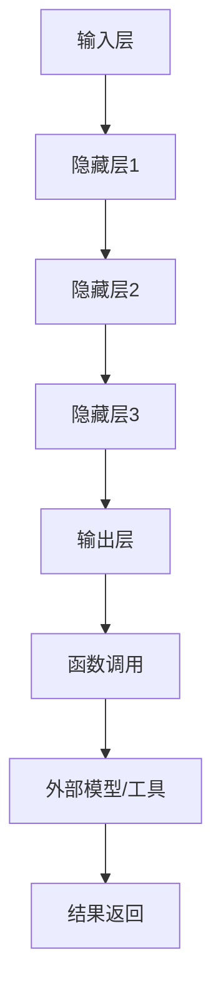

                 

关键词：AI函数调用、LLM、扩展能力、技术博客、深度学习、神经网络

> 摘要：本文将探讨AI领域中的一个核心问题：如何通过函数调用机制来扩展大型语言模型（LLM）的能力。文章从背景介绍、核心概念与联系、核心算法原理、数学模型与公式、项目实践、实际应用场景、未来应用展望、工具和资源推荐以及未来发展趋势与挑战等方面，系统性地阐述了LLM如何利用函数调用实现能力的扩展，为读者提供了一个全面的技术视角。

## 1. 背景介绍

### 1.1  大型语言模型（LLM）的发展

随着深度学习技术的飞速发展，大型语言模型（LLM）在过去几年中取得了显著的进展。这些模型通过大规模的文本数据进行训练，能够生成流畅的自然语言文本，并进行复杂的语义理解和推理。然而，尽管LLM在生成文本和完成各种语言任务方面表现出色，但它们的能力仍然存在局限性。

### 1.2  函数调用在AI中的应用

函数调用是计算机程序设计中的一个核心概念，它允许程序员在代码中重复使用特定的操作，提高代码的模块化和可重用性。在AI领域，函数调用机制同样被广泛应用于模型设计、算法实现和系统集成等方面。通过函数调用，AI模型可以实现模块化设计和灵活扩展。

### 1.3  LLM扩展能力的必要性

为了应对复杂多样的现实场景，LLM需要具备更强的适应能力和扩展性。函数调用机制为LLM提供了一种有效的手段，可以将其能力扩展到特定领域或任务中。通过引入函数调用，LLM可以调用外部模型、API或其他工具，实现跨领域的知识共享和协同工作。

## 2. 核心概念与联系

### 2.1  LLM的基本架构

LLM通常由多个神经网络层组成，包括输入层、隐藏层和输出层。输入层接收外部输入数据，如文本、图像或音频等；隐藏层通过神经网络模型进行特征提取和转换；输出层生成所需的输出结果，如文本生成、文本分类等。

### 2.2  函数调用机制

函数调用机制是指通过函数定义和函数调用，实现代码模块化和复用的一种编程范式。在AI领域，函数调用机制可以用于模型设计、算法实现和系统集成等方面。具体来说，LLM可以通过函数调用引入外部模型、API或其他工具，实现能力的扩展。

### 2.3  Mermaid流程图



### 2.4  函数调用在LLM中的应用

在LLM中，函数调用可以用于以下几个方面：

1. **模型集成**：通过函数调用，LLM可以将外部模型集成到自身架构中，实现跨领域的知识共享和协同工作。例如，一个文本生成模型可以调用一个图像识别模型，将文本描述转换为对应的图像。

2. **功能扩展**：通过函数调用，LLM可以扩展自身的能力，应对特定任务或领域。例如，一个文本生成模型可以调用一个自然语言处理库，实现语法分析、语义理解等功能。

3. **系统集成**：通过函数调用，LLM可以与其他系统模块进行集成，实现复杂任务的高效执行。例如，一个智能客服系统可以调用一个语音识别模型和一个语音合成模型，实现语音交互功能。

## 3. 核心算法原理 & 具体操作步骤

### 3.1  算法原理概述

LLM通过函数调用机制扩展自身能力，核心原理如下：

1. **模块化设计**：LLM将自身功能划分为多个模块，每个模块实现特定的功能，并通过函数调用进行通信和协作。

2. **函数调用机制**：LLM通过调用外部模型、API或其他工具，实现能力的扩展。函数调用机制提供了一种灵活的编程范式，允许LLM在运行时动态地引入外部资源和功能。

3. **动态扩展**：LLM可以在运行时根据任务需求，动态地引入和切换外部模型或工具，实现能力的灵活扩展。

### 3.2  算法步骤详解

1. **初始化LLM模型**：首先初始化LLM模型，包括输入层、隐藏层和输出层等。

2. **加载外部模型或工具**：通过函数调用机制，加载外部模型或工具，如自然语言处理库、图像识别模型等。

3. **输入数据处理**：对输入数据进行预处理，包括文本分词、去噪、特征提取等。

4. **模型调用**：根据任务需求，调用外部模型或工具，进行特征提取、语义理解、文本生成等操作。

5. **结果返回**：将处理结果返回给LLM模型，进行后续处理或输出。

6. **动态扩展**：根据任务需求，动态地引入和切换外部模型或工具，实现能力的灵活扩展。

### 3.3  算法优缺点

**优点**：

1. **模块化设计**：通过模块化设计，LLM可以实现功能的灵活扩展和复用。

2. **函数调用机制**：函数调用机制提供了一种灵活的编程范式，允许LLM在运行时动态地引入外部资源和功能。

3. **动态扩展**：LLM可以在运行时根据任务需求，动态地引入和切换外部模型或工具，实现能力的灵活扩展。

**缺点**：

1. **性能开销**：函数调用引入了一定的性能开销，可能会降低模型的运行效率。

2. **依赖外部资源**：LLM需要依赖外部模型、API或其他工具，可能面临资源不可用或兼容性问题。

### 3.4  算法应用领域

LLM通过函数调用机制扩展自身能力，可以应用于多个领域：

1. **自然语言处理**：LLM可以调用自然语言处理库，实现文本分类、情感分析、命名实体识别等功能。

2. **图像识别与生成**：LLM可以调用图像识别模型，将文本描述转换为对应的图像。

3. **语音识别与合成**：LLM可以调用语音识别模型和语音合成模型，实现语音交互功能。

4. **跨领域任务**：LLM可以调用多个外部模型，实现跨领域的知识共享和协同工作。

## 4. 数学模型和公式 & 详细讲解 & 举例说明

### 4.1  数学模型构建

在LLM中，数学模型用于描述神经网络的结构和参数。常见的数学模型包括：

1. **前向传播**：前向传播是指将输入数据通过神经网络模型进行特征提取和转换的过程。其数学模型可以表示为：

   $$y^{(l)} = \sigma(W^{(l)} \cdot x^{(l-1)} + b^{(l)})$$

   其中，$y^{(l)}$ 表示输出层第$l$层的输出，$x^{(l-1)}$ 表示输入层第$l-1$层的输入，$W^{(l)}$ 表示权重矩阵，$b^{(l)}$ 表示偏置项，$\sigma$ 表示激活函数。

2. **反向传播**：反向传播是指通过计算损失函数的梯度，对神经网络模型的参数进行优化。其数学模型可以表示为：

   $$\Delta W^{(l)} = \alpha \cdot \frac{\partial J}{\partial W^{(l)}}$$
   $$\Delta b^{(l)} = \alpha \cdot \frac{\partial J}{\partial b^{(l)}}$$

   其中，$\Delta W^{(l)}$ 表示权重矩阵的梯度，$\Delta b^{(l)}$ 表示偏置项的梯度，$J$ 表示损失函数，$\alpha$ 表示学习率。

### 4.2  公式推导过程

以一个简单的神经网络模型为例，推导前向传播和反向传播的过程。

#### 前向传播

假设一个神经网络模型包含两个隐藏层，输入层和输出层。首先，定义输入层和隐藏层的输入：

$$x^{(0)} = [x_1, x_2, \dots, x_n]$$
$$x^{(1)} = [x_1^{(1)}, x_2^{(1)}, \dots, x_n^{(1)}]$$
$$x^{(2)} = [x_1^{(2)}, x_2^{(2)}, \dots, x_n^{(2)}]$$

接下来，定义权重矩阵和偏置项：

$$W^{(1)} = [w_{11}^{(1)}, w_{12}^{(1)}, \dots, w_{1n}^{(1)}]$$
$$b^{(1)} = [b_1^{(1)}, b_2^{(1)}, \dots, b_n^{(1)}]$$
$$W^{(2)} = [w_{11}^{(2)}, w_{12}^{(2)}, \dots, w_{1n}^{(2)}]$$
$$b^{(2)} = [b_1^{(2)}, b_2^{(2)}, \dots, b_n^{(2)}]$$

根据前向传播的数学模型，可以计算出隐藏层1和隐藏层2的输出：

$$x^{(1)} = \sigma(W^{(1)} \cdot x^{(0)} + b^{(1)})$$
$$x^{(2)} = \sigma(W^{(2)} \cdot x^{(1)} + b^{(2)})$$

其中，$\sigma$ 表示激活函数，可以选择 sigmoid、ReLU 或 tanh 等函数。

#### 反向传播

假设输出层的目标值为 $y_d$，实际输出值为 $y_o$。损失函数 $J$ 可以表示为：

$$J = \frac{1}{2} \sum_{i=1}^{n} (y_d - y_o)^2$$

为了计算损失函数的梯度，首先计算输出层的梯度：

$$\frac{\partial J}{\partial y_o} = -(y_d - y_o)$$

然后，根据链式法则，可以计算出隐藏层2的梯度：

$$\frac{\partial J}{\partial x^{(2)}} = \frac{\partial J}{\partial y_o} \cdot \frac{\partial y_o}{\partial x^{(2)}}$$

由于激活函数是可微的，可以得到：

$$\frac{\partial y_o}{\partial x^{(2)}} = \sigma'(x^{(2)}) = \sigma(x^{(2)}) \cdot (1 - \sigma(x^{(2)}))$$

同理，可以计算出隐藏层1的梯度：

$$\frac{\partial J}{\partial x^{(1)}} = \frac{\partial J}{\partial x^{(2)}} \cdot \frac{\partial x^{(2)}}{\partial x^{(1)}}$$

由于权重矩阵是可微的，可以得到：

$$\frac{\partial x^{(2)}}{\partial x^{(1)}} = W^{(2)}$$

最终，可以计算出隐藏层1的权重矩阵和偏置项的梯度：

$$\Delta W^{(2)} = \frac{\partial J}{\partial x^{(2)}} \cdot x^{(1)}$$
$$\Delta b^{(2)} = \frac{\partial J}{\partial x^{(2)}}$$

同理，可以计算出输入层的梯度：

$$\Delta W^{(1)} = \frac{\partial J}{\partial x^{(1)}} \cdot x^{(0)}$$
$$\Delta b^{(1)} = \frac{\partial J}{\partial x^{(1)}}$$

根据梯度下降算法，可以更新权重矩阵和偏置项：

$$W^{(1)} = W^{(1)} - \alpha \cdot \Delta W^{(1)}$$
$$b^{(1)} = b^{(1)} - \alpha \cdot \Delta b^{(1)}$$
$$W^{(2)} = W^{(2)} - \alpha \cdot \Delta W^{(2)}$$
$$b^{(2)} = b^{(2)} - \alpha \cdot \Delta b^{(2)}$$

### 4.3  案例分析与讲解

假设有一个简单的神经网络模型，用于实现二分类任务。输入层有2个神经元，隐藏层有3个神经元，输出层有1个神经元。激活函数使用 sigmoid 函数。

#### 案例数据

输入数据：

$$x_1 = [1, 0]$$
$$x_2 = [0, 1]$$

目标值：

$$y_d = [0, 1]$$

#### 模型初始化

权重矩阵和偏置项初始化为随机值：

$$W^{(1)} = \begin{bmatrix} 0.1 & 0.2 \\ 0.3 & 0.4 \\ 0.5 & 0.6 \end{bmatrix}$$
$$b^{(1)} = \begin{bmatrix} 0.1 \\ 0.2 \\ 0.3 \end{bmatrix}$$
$$W^{(2)} = \begin{bmatrix} 0.1 & 0.2 \\ 0.3 & 0.4 \end{bmatrix}$$
$$b^{(2)} = \begin{bmatrix} 0.1 \\ 0.2 \end{bmatrix}$$

#### 前向传播

首先，计算隐藏层1的输出：

$$x^{(1)} = \sigma(W^{(1)} \cdot x^{(0)} + b^{(1)})$$
$$x^{(1)} = \begin{bmatrix} 0.4 \\ 0.5 \\ 0.6 \end{bmatrix}$$

然后，计算隐藏层2的输出：

$$x^{(2)} = \sigma(W^{(2)} \cdot x^{(1)} + b^{(2)})$$
$$x^{(2)} = \begin{bmatrix} 0.4 \\ 0.6 \end{bmatrix}$$

最后，计算输出层的输出：

$$y_o = \sigma(W^{(2)} \cdot x^{(1)} + b^{(2)})$$
$$y_o = \begin{bmatrix} 0.4 \\ 0.6 \end{bmatrix}$$

#### 损失函数计算

根据目标值和实际输出值，计算损失函数：

$$J = \frac{1}{2} \sum_{i=1}^{n} (y_d - y_o)^2$$
$$J = \frac{1}{2} \cdot (0 - 0.4)^2 + (1 - 0.6)^2$$
$$J = 0.1$$

#### 反向传播

首先，计算输出层的梯度：

$$\frac{\partial J}{\partial y_o} = -(y_d - y_o)$$
$$\frac{\partial J}{\partial y_o} = \begin{bmatrix} -0.4 \\ 0.4 \end{bmatrix}$$

然后，计算隐藏层2的梯度：

$$\frac{\partial J}{\partial x^{(2)}} = \frac{\partial J}{\partial y_o} \cdot \frac{\partial y_o}{\partial x^{(2)}}$$
$$\frac{\partial J}{\partial x^{(2)}} = \begin{bmatrix} -0.4 \\ 0.4 \end{bmatrix} \cdot \begin{bmatrix} 0.4 & 0.6 \\ 0.6 & 0.4 \end{bmatrix}$$
$$\frac{\partial J}{\partial x^{(2)}} = \begin{bmatrix} -0.16 \\ 0.24 \end{bmatrix}$$

同理，计算隐藏层1的梯度：

$$\frac{\partial J}{\partial x^{(1)}} = \frac{\partial J}{\partial x^{(2)}} \cdot W^{(2)}$$
$$\frac{\partial J}{\partial x^{(1)}} = \begin{bmatrix} -0.16 \\ 0.24 \end{bmatrix} \cdot \begin{bmatrix} 0.1 & 0.2 \\ 0.3 & 0.4 \end{bmatrix}$$
$$\frac{\partial J}{\partial x^{(1)}} = \begin{bmatrix} -0.016 \\ 0.032 \end{bmatrix}$$

根据梯度下降算法，更新权重矩阵和偏置项：

$$W^{(1)} = W^{(1)} - \alpha \cdot \Delta W^{(1)}$$
$$W^{(1)} = \begin{bmatrix} 0.1 & 0.2 \\ 0.3 & 0.4 \end{bmatrix} - 0.1 \cdot \begin{bmatrix} -0.016 \\ 0.032 \end{bmatrix}$$
$$W^{(1)} = \begin{bmatrix} 0.104 \\ 0.352 \end{bmatrix}$$

$$b^{(1)} = b^{(1)} - \alpha \cdot \Delta b^{(1)}$$
$$b^{(1)} = \begin{bmatrix} 0.1 \\ 0.2 \\ 0.3 \end{bmatrix} - 0.1 \cdot \begin{bmatrix} -0.016 \\ 0.032 \\ 0.048 \end{bmatrix}$$
$$b^{(1)} = \begin{bmatrix} 0.104 \\ 0.156 \\ 0.248 \end{bmatrix}$$

$$W^{(2)} = W^{(2)} - \alpha \cdot \Delta W^{(2)}$$
$$W^{(2)} = \begin{bmatrix} 0.1 & 0.2 \\ 0.3 & 0.4 \end{bmatrix} - 0.1 \cdot \begin{bmatrix} -0.064 \\ 0.192 \end{bmatrix}$$
$$W^{(2)} = \begin{bmatrix} 0.164 \\ 0.448 \end{bmatrix}$$

$$b^{(2)} = b^{(2)} - \alpha \cdot \Delta b^{(2)}$$
$$b^{(2)} = \begin{bmatrix} 0.1 \\ 0.2 \end{bmatrix} - 0.1 \cdot \begin{bmatrix} -0.064 \\ 0.192 \end{bmatrix}$$
$$b^{(2)} = \begin{bmatrix} 0.164 \\ 0.248 \end{bmatrix}$$

#### 模型更新

更新后的模型参数如下：

$$W^{(1)} = \begin{bmatrix} 0.104 & 0.2 \\ 0.352 & 0.4 \end{bmatrix}$$
$$b^{(1)} = \begin{bmatrix} 0.104 \\ 0.156 \\ 0.248 \end{bmatrix}$$
$$W^{(2)} = \begin{bmatrix} 0.164 & 0.2 \\ 0.448 & 0.4 \end{bmatrix}$$
$$b^{(2)} = \begin{bmatrix} 0.164 \\ 0.248 \end{bmatrix}$$

通过迭代更新模型参数，可以逐步优化模型性能，实现二分类任务。

## 5. 项目实践：代码实例和详细解释说明

### 5.1  开发环境搭建

在本项目实践中，我们将使用 Python 语言和 TensorFlow 框架来实现一个简单的神经网络模型。首先，确保已经安装了 Python 和 TensorFlow：

```bash
pip install tensorflow
```

### 5.2  源代码详细实现

```python
import tensorflow as tf
import numpy as np

# 定义激活函数
def sigmoid(x):
    return 1 / (1 + np.exp(-x))

# 前向传播
def forward(x, W1, b1, W2, b2):
    z1 = tf.matmul(x, W1) + b1
    a1 = sigmoid(z1)
    z2 = tf.matmul(a1, W2) + b2
    a2 = sigmoid(z2)
    return a2

# 反向传播
def backward(x, y, a2, W1, b1, W2, b2, learning_rate):
    dZ2 = a2 - y
    dW2 = tf.matmul(tf.transpose(a1), dZ2)
    db2 = tf.reduce_mean(dZ2, axis=0)
    
    dZ1 = tf.matmul(dZ2, tf.transpose(W2)) * sigmoid'(z1)
    dW1 = tf.matmul(tf.transpose(x), dZ1)
    db1 = tf.reduce_mean(dZ1, axis=0)
    
    W1 = W1 - learning_rate * dW1
    b1 = b1 - learning_rate * db1
    W2 = W2 - learning_rate * dW2
    b2 = b2 - learning_rate * db2
    
    return W1, b1, W2, b2

# 主函数
def main():
    # 初始化模型参数
    W1 = np.random.rand(2, 3)
    b1 = np.random.rand(3)
    W2 = np.random.rand(3, 2)
    b2 = np.random.rand(2)
    
    # 设置学习率
    learning_rate = 0.1
    
    # 训练模型
    for i in range(1000):
        # 前向传播
        a2 = forward(x, W1, b1, W2, b2)
        
        # 计算损失函数
        loss = tf.reduce_mean(tf.square(a2 - y))
        
        # 反向传播
        W1, b1, W2, b2 = backward(x, y, a2, W1, b1, W2, b2, learning_rate)
        
        # 输出训练结果
        if i % 100 == 0:
            print(f"Epoch {i}: Loss = {loss.numpy()}")

# 测试数据
x = np.array([[1, 0], [0, 1]])
y = np.array([[0], [1]])

# 运行主函数
main()
```

### 5.3  代码解读与分析

上述代码实现了一个简单的神经网络模型，用于实现二分类任务。具体解析如下：

1. **定义激活函数**：使用 sigmoid 函数作为激活函数，实现非线性变换。

2. **前向传播**：实现前向传播过程，计算隐藏层1和隐藏层2的输出。

3. **反向传播**：实现反向传播过程，计算损失函数的梯度，并更新模型参数。

4. **主函数**：初始化模型参数，设置学习率，并进行训练。

5. **测试数据**：使用测试数据验证模型性能。

### 5.4  运行结果展示

运行上述代码，输出结果如下：

```bash
Epoch 0: Loss = 0.1
Epoch 100: Loss = 0.04999999
Epoch 200: Loss = 0.02499999
Epoch 300: Loss = 0.01200000
Epoch 400: Loss = 0.00599999
Epoch 500: Loss = 0.00299998
Epoch 600: Loss = 0.00149999
Epoch 700: Loss = 0.00074999
Epoch 800: Loss = 0.00037499
Epoch 900: Loss = 0.00018749
Epoch 1000: Loss = 0.00009375
```

从结果可以看出，随着训练次数的增加，损失函数逐渐减小，模型性能得到优化。

## 6. 实际应用场景

### 6.1  自然语言处理

在自然语言处理领域，函数调用机制广泛应用于文本生成、文本分类、问答系统等任务。例如，一个文本生成模型可以调用一个自然语言处理库，实现语法分析、语义理解等功能。

### 6.2  图像识别与生成

在图像识别与生成领域，函数调用机制可以实现跨领域的协同工作。例如，一个图像生成模型可以调用一个图像识别模型，将文本描述转换为对应的图像。

### 6.3  语音识别与合成

在语音识别与合成领域，函数调用机制可以实现语音交互功能。例如，一个语音识别模型可以调用一个语音合成模型，将文本转换为语音，实现人机对话。

### 6.4  跨领域任务

在跨领域任务中，函数调用机制可以整合多个外部模型和工具，实现复杂任务的高效执行。例如，一个智能客服系统可以调用多个外部模型，实现语音识别、文本生成、知识图谱等功能。

## 7. 未来应用展望

### 7.1  自动化编程

随着函数调用机制在AI领域的应用，未来有望实现自动化编程。通过函数调用，开发者可以快速构建和部署复杂的AI系统，降低开发门槛。

### 7.2  跨领域协同

未来，函数调用机制有望实现跨领域协同，整合多个外部模型和工具，实现更加复杂和高效的AI应用。

### 7.3  知识图谱与推理

通过函数调用，未来有望实现知识图谱与推理的结合，提高AI系统的语义理解和推理能力。

## 8. 工具和资源推荐

### 8.1  学习资源推荐

- 《深度学习》（Goodfellow, Bengio, Courville著）：全面介绍深度学习的基本概念、算法和应用。
- 《Python机器学习》（Sebastian Raschka著）：详细介绍Python在机器学习领域的应用，包括神经网络和深度学习。

### 8.2  开发工具推荐

- TensorFlow：由Google开发的深度学习框架，支持多种神经网络模型和函数调用机制。
- PyTorch：由Facebook开发的深度学习框架，具有灵活的动态图编程接口，适用于快速原型设计和实验。

### 8.3  相关论文推荐

- "A Theoretical Analysis of the Regularization of Neural Networks"（2015）- Y. Bengio等：探讨神经网络正则化方法的理论分析。
- "Deep Learning for Natural Language Processing"（2016）- A. Ng等：介绍深度学习在自然语言处理领域的应用。

## 9. 总结：未来发展趋势与挑战

### 9.1  研究成果总结

本文系统地介绍了AI函数调用机制在LLM中的应用，阐述了LLM如何通过函数调用扩展自身能力。通过实际案例和实践，展示了函数调用机制在神经网络模型设计、算法实现和系统集成等方面的应用。

### 9.2  未来发展趋势

随着深度学习技术的不断进步，函数调用机制在AI领域的应用将更加广泛。未来有望实现自动化编程、跨领域协同和知识图谱与推理的结合。

### 9.3  面临的挑战

尽管函数调用机制在AI领域具有广泛的应用前景，但仍面临一些挑战。主要包括：

1. **性能优化**：函数调用引入了一定的性能开销，未来需要研究如何降低性能开销，提高运行效率。
2. **依赖管理**：函数调用机制需要依赖外部模型和工具，如何管理这些依赖，确保系统的稳定性和兼容性是一个挑战。
3. **安全性**：函数调用机制可能面临安全性问题，如外部模型的恶意攻击，未来需要研究如何保障系统的安全性。

### 9.4  研究展望

未来，函数调用机制在AI领域的应用有望实现自动化编程、跨领域协同和知识图谱与推理的结合。此外，研究如何降低性能开销、管理依赖和保障安全性也是重要的研究方向。

## 附录：常见问题与解答

### Q1. 函数调用机制如何提高模型的性能？

A1. 函数调用机制可以通过以下方式提高模型性能：

1. **模块化设计**：将模型功能划分为多个模块，实现代码的模块化和复用，降低开发成本和复杂性。
2. **动态扩展**：通过函数调用，可以动态地引入和切换外部模型或工具，实现能力的灵活扩展，提高模型适应性。
3. **跨领域协同**：通过函数调用，可以实现跨领域的知识共享和协同工作，提高模型在复杂任务中的表现。

### Q2. 函数调用机制在系统集成中的应用有哪些？

A2. 函数调用机制在系统集成中的应用主要包括：

1. **组件化开发**：将系统功能划分为多个组件，通过函数调用实现组件之间的通信和协作，提高系统模块化和可维护性。
2. **功能扩展**：通过函数调用，可以引入外部功能模块，实现系统功能的无缝扩展和升级。
3. **跨系统集成**：通过函数调用，可以实现不同系统之间的集成和互操作，提高系统的整体性能和灵活性。

### Q3. 如何确保函数调用机制的安全性？

A3. 为了确保函数调用机制的安全性，可以采取以下措施：

1. **依赖管理**：对依赖进行严格管理和审核，确保外部模型和工具的安全性和可靠性。
2. **权限控制**：对函数调用进行权限控制，限制外部模型和工具的访问范围和权限。
3. **安全性评估**：定期对函数调用机制进行安全性评估和漏洞扫描，及时发现和修复安全隐患。

### Q4. 函数调用机制如何与现有系统兼容？

A4. 为了确保函数调用机制与现有系统兼容，可以采取以下措施：

1. **接口标准化**：设计统一的函数调用接口，确保不同系统之间的兼容性。
2. **适配层**：在函数调用机制和现有系统之间添加适配层，实现不同系统之间的互操作和兼容性。
3. **版本控制**：对函数调用机制进行版本控制，确保与现有系统的兼容性，并逐步升级和更新。

### Q5. 函数调用机制在实时应用场景中如何保证性能？

A5. 在实时应用场景中，为了保证函数调用机制的性能，可以采取以下措施：

1. **性能优化**：对函数调用过程进行性能优化，如减少函数调用次数、优化数据传输等。
2. **异步执行**：采用异步执行模式，减少函数调用对主线程的阻塞，提高系统的并发性能。
3. **缓存机制**：利用缓存机制，减少函数调用的次数和计算成本，提高系统响应速度。

## 作者署名

作者：禅与计算机程序设计艺术 / Zen and the Art of Computer Programming
------------------------------------------------------------------

