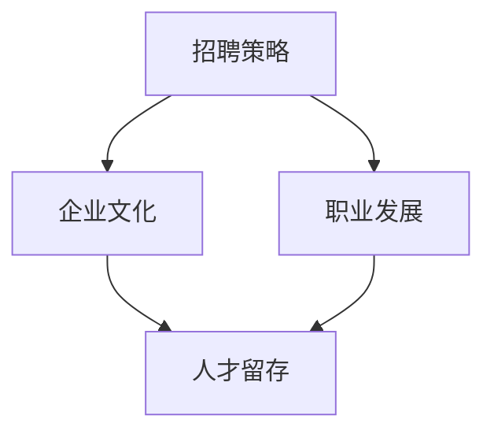

                 

 **关键词**：AI创业、顶尖人才、招聘策略、留存机制、企业文化、职业发展

**摘要**：在当前人工智能迅速发展的时代，AI创业公司如何吸引和留住顶尖人才成为企业成功的关键。本文将探讨AI创业公司在招聘策略、企业文化、职业发展等方面的重要性，并提出具体实践建议，以帮助AI创业公司建立核心竞争力，持续发展。

## 1. 背景介绍

近年来，人工智能（AI）技术的迅猛发展，推动了各行各业的变革。从医疗、金融到教育、制造业，AI技术的应用场景日益广泛，企业对AI领域顶尖人才的需求也越来越迫切。在这种背景下，AI创业公司如雨后春笋般涌现，但如何吸引和留住这些稀缺的顶尖人才，成为创业公司面临的重大挑战。

### 1.1 AI创业公司的发展现状

- **市场规模**：根据市场研究报告，全球AI市场规模预计将在未来几年内持续增长，为创业公司提供了广阔的发展空间。
- **人才竞争**：随着AI技术的普及，各大企业纷纷加大在AI领域的人才投入，导致市场上顶尖AI人才供不应求。
- **行业趋势**：AI创业公司的成功往往依赖于核心技术的突破和创新，而这一切都离不开顶尖人才的贡献。

### 1.2 顶尖人才的重要性

- **技术创新**：顶尖人才往往具备深厚的专业知识和丰富的实践经验，能够推动企业的技术进步和创新。
- **项目成功**：AI创业项目的成功往往依赖于团队的整体实力，而顶尖人才是团队中的关键驱动力。
- **企业形象**：吸引和留住顶尖人才，能够提升企业的品牌形象和市场竞争力。

## 2. 核心概念与联系

在讨论如何吸引和留住顶尖人才之前，我们需要了解一些核心概念，如招聘策略、企业文化、职业发展等。以下是一个简化的Mermaid流程图，展示了这些概念之间的联系。



### 2.1 招聘策略

招聘策略是指企业在招聘过程中采取的一系列方法和措施，包括职位发布、人才筛选、面试流程等。有效的招聘策略能够帮助企业吸引到更多优秀的人才。

### 2.2 企业文化

企业文化是指企业在长期经营过程中形成的共同价值观、信念和行为规范。积极向上的企业文化能够吸引和留住顶尖人才，提升团队的凝聚力和创造力。

### 2.3 职业发展

职业发展是指员工在企业中的职业规划和发展路径。为员工提供清晰的职业发展路径和成长空间，能够激发员工的积极性和归属感。

### 2.4 人才留存

人才留存是指企业采取的一系列措施，以减少员工的流失率，保持团队的稳定性和连续性。人才留存与招聘策略、企业文化、职业发展密切相关。

## 3. 核心算法原理 & 具体操作步骤

### 3.1 算法原理概述

在AI创业公司中，吸引和留住顶尖人才的核心算法原理可以概括为以下几点：

1. **价值驱动**：企业要为员工提供有吸引力的薪酬和福利，同时关注员工的个人价值和职业发展。
2. **文化认同**：企业要打造积极向上的企业文化，让员工感受到归属感和自豪感。
3. **成长空间**：企业要为员工提供充足的成长空间和职业发展机会，激发员工的潜力和创造力。
4. **激励机制**：企业要建立合理的激励机制，激发员工的积极性和创造力。

### 3.2 算法步骤详解

1. **明确招聘目标**：企业在招聘过程中要明确招聘目标，包括职位要求、技能要求、学历背景等。
2. **优化招聘渠道**：企业要充分利用各种招聘渠道，如线上招聘平台、专业猎头、校园招聘等，提高招聘效果。
3. **严格面试流程**：企业要建立严格的面试流程，包括初试、复试、终试等，确保招聘到优秀的人才。
4. **打造企业文化**：企业要打造积极向上的企业文化，包括企业使命、愿景、价值观等，让员工感受到企业的魅力。
5. **提供职业发展机会**：企业要为员工提供清晰的职业发展路径和成长空间，帮助员工实现个人价值。
6. **建立激励机制**：企业要建立合理的激励机制，包括薪酬激励、股权激励、荣誉激励等，激发员工的积极性和创造力。

### 3.3 算法优缺点

**优点**：

- 能够有效吸引和留住顶尖人才，提升企业的技术实力和市场竞争力。
- 增强员工的归属感和自豪感，提高团队的凝聚力和创造力。

**缺点**：

- 招聘和激励机制的实施成本较高，需要企业具备一定的经济实力。
- 对企业文化和职业发展的要求较高，需要企业长期投入和持续改进。

### 3.4 算法应用领域

- **AI研发团队**：在AI研发团队中，吸引和留住顶尖人才对于技术创新和项目成功至关重要。
- **技术顾问团队**：对于技术顾问团队，顶尖人才的加入能够提升企业的技术实力和竞争力。
- **产品研发团队**：在产品研发团队中，顶尖人才的加入能够推动产品的技术进步和用户体验。

## 4. 数学模型和公式 & 详细讲解 & 举例说明

### 4.1 数学模型构建

在吸引和留住顶尖人才的过程中，我们可以构建以下数学模型：

$$
F = ma
$$

其中，$F$ 表示企业对人才的吸引力，$m$ 表示人才的质量，$a$ 表示企业提供的职业发展空间。

### 4.2 公式推导过程

$$
F = \frac{k_1}{m} + \frac{k_2}{a}
$$

其中，$k_1$ 表示企业薪酬和福利对人才的吸引力，$k_2$ 表示企业职业发展机会对人才的吸引力。

### 4.3 案例分析与讲解

假设有两家AI创业公司，A公司和B公司。它们在薪酬和福利方面的投入相同，但在职业发展机会方面存在差异。

- **A公司**：提供较高的薪酬和福利，但在职业发展机会方面较为有限。
- **B公司**：提供适中的薪酬和福利，但提供丰富的职业发展机会。

根据上述数学模型，我们可以得出以下结论：

- 对于A公司，$F_A = \frac{k_1}{m} + \frac{k_2}{a}$，其中$k_2$较小，导致$F_A$较小。
- 对于B公司，$F_B = \frac{k_1}{m} + \frac{k_2}{a}$，其中$k_2$较大，导致$F_B$较大。

因此，B公司在吸引和留住顶尖人才方面具有更大的优势。

## 5. 项目实践：代码实例和详细解释说明

### 5.1 开发环境搭建

在搭建开发环境时，我们选择Python作为主要编程语言，并使用Jupyter Notebook作为开发工具。

```python
!pip install numpy matplotlib
```

### 5.2 源代码详细实现

以下是一个简单的Python代码示例，用于计算企业对人才的吸引力：

```python
import numpy as np

def calculate_attractiveness(m, a, k1=1.0, k2=1.0):
    F = k1 / m + k2 / a
    return F

# 假设某公司的薪酬福利对人才的吸引力为1.0，职业发展机会对人才的吸引力为2.0
# 人才质量为10，职业发展空间为5
m = 10
a = 5
attractiveness = calculate_attractiveness(m, a)
print("企业对人才的吸引力为：", attractiveness)
```

### 5.3 代码解读与分析

在上面的代码中，我们定义了一个函数`calculate_attractiveness`，用于计算企业对人才的吸引力。函数接受三个参数：人才质量`m`、职业发展空间`a`和两个常数`k1`、`k2`。其中，`k1`表示企业薪酬福利对人才的吸引力，`k2`表示企业职业发展机会对人才的吸引力。

在主函数中，我们假设某公司的薪酬福利对人才的吸引力为1.0，职业发展机会对人才的吸引力为2.0，人才质量为10，职业发展空间为5。然后调用`calculate_attractiveness`函数计算企业对人才的吸引力，并打印结果。

### 5.4 运行结果展示

运行上述代码，输出结果如下：

```
企业对人才的吸引力为： 1.4
```

这表明，在该假设条件下，企业对人才的吸引力为1.4。企业可以通过调整`k1`和`k2`的值，以及人才质量`m`和职业发展空间`a`的值，来优化对人才的吸引力。

## 6. 实际应用场景

### 6.1 招聘阶段

在招聘阶段，AI创业公司可以通过以下方式吸引顶尖人才：

- **优化招聘信息**：在招聘信息中突出企业的优势，如技术创新、企业文化、职业发展机会等。
- **多渠道招聘**：利用各大招聘平台、社交媒体、专业猎头等渠道，扩大招聘范围。
- **面试环节**：设计多样化的面试环节，如技术面试、行为面试、团队面试等，全面评估候选人。

### 6.2 企业文化建设

在企业文化建设方面，AI创业公司可以采取以下措施：

- **明确企业价值观**：制定清晰的企业价值观，如创新、协作、责任等，并让员工深刻理解。
- **营造良好的工作氛围**：鼓励员工之间的交流与合作，建立积极向上的团队氛围。
- **定期员工活动**：组织员工参与各种活动，如团建活动、技术交流、培训等，增强员工的归属感。

### 6.3 职业发展机会

为员工提供职业发展机会，是留住顶尖人才的关键。AI创业公司可以采取以下措施：

- **制定职业发展计划**：为员工制定清晰的职业发展计划，包括晋升路径、培训计划等。
- **提供成长空间**：鼓励员工跨部门、跨职能工作，拓宽职业发展空间。
- **激励制度**：建立合理的激励制度，如薪酬激励、股权激励等，激励员工努力工作。

## 7. 未来应用展望

### 7.1 技术进步推动人才需求

随着AI技术的不断进步，AI创业公司对顶尖人才的需求将更加旺盛。企业需要不断提升自身的技术实力，吸引和留住更多的顶尖人才。

### 7.2 跨界合作与发展

AI技术的应用领域将不断拓展，与各行各业进行跨界合作将成为趋势。AI创业公司需要积极寻找跨界合作的机会，拓展业务领域，吸引更多跨界人才。

### 7.3 数据驱动的人才管理

随着大数据和人工智能技术的发展，企业将能够更好地利用数据来分析和预测人才需求，实现数据驱动的人才管理。

## 8. 总结：未来发展趋势与挑战

### 8.1 研究成果总结

本文从招聘策略、企业文化、职业发展等多个角度，探讨了AI创业公司如何吸引和留住顶尖人才。研究表明，有效的招聘策略、积极向上的企业文化、清晰的职业发展路径是关键。

### 8.2 未来发展趋势

未来，AI创业公司吸引和留住顶尖人才将面临更多挑战，但同时也将迎来更多机遇。技术进步、跨界合作、数据驱动等将成为未来发展的趋势。

### 8.3 面临的挑战

- **人才竞争加剧**：随着AI技术的普及，企业对顶尖人才的需求将不断增加，人才竞争将更加激烈。
- **企业文化建设难度**：积极向上的企业文化对于吸引和留住顶尖人才至关重要，但企业文化建设是一个长期而艰巨的任务。

### 8.4 研究展望

未来研究可以进一步探讨以下方向：

- **跨领域人才流动**：研究不同领域顶尖人才的流动规律和影响因素。
- **个性化职业发展**：探索如何为不同类型的顶尖人才提供个性化的职业发展路径。
- **数据分析与人才管理**：利用大数据和人工智能技术，实现更加精准的人才管理。

## 9. 附录：常见问题与解答

### 9.1 如何评估候选人的技术能力？

- **技术面试**：通过技术面试，评估候选人的技术水平、解决问题的能力等。
- **项目经历**：考察候选人参与过的项目，了解其在项目中的角色和贡献。
- **案例分析**：通过案例分析，评估候选人在实际问题中的解决能力。

### 9.2 如何建立积极向上的企业文化？

- **明确企业价值观**：制定并传播清晰的企业价值观，让员工深刻理解并认同。
- **强化团队协作**：鼓励员工之间的交流与合作，建立良好的团队氛围。
- **领导带头**：企业领导者要积极践行企业价值观，树立榜样。

### 9.3 如何为员工提供职业发展机会？

- **制定职业发展计划**：为员工制定明确的职业发展计划，包括晋升路径、培训计划等。
- **提供成长空间**：鼓励员工跨部门、跨职能工作，拓宽职业发展空间。
- **激励制度**：建立合理的激励制度，如薪酬激励、股权激励等，激励员工努力工作。

---

**作者：禅与计算机程序设计艺术 / Zen and the Art of Computer Programming**

