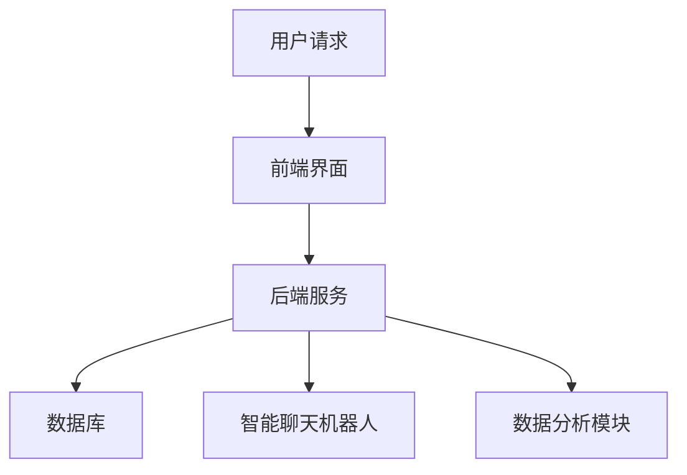

                 

关键词：AI创业公司、客户支持系统、客户服务、人工智能、自动化、用户体验、客户满意度

> 摘要：本文将探讨AI创业公司如何建立有效的客户支持系统，通过自动化技术、智能聊天机器人、数据分析等手段，提高客户满意度，降低运营成本，助力公司持续发展。

## 1. 背景介绍

在竞争激烈的AI创业领域，客户支持系统是公司发展的关键因素之一。客户满意度直接关系到公司的口碑和市场份额。传统的客户支持系统往往依赖于人工服务，不仅效率低下，而且成本高昂。随着人工智能技术的发展，AI创业公司有机会借助智能技术，构建高效、自动化的客户支持系统，从而在提升客户体验的同时，降低运营成本。

## 2. 核心概念与联系

### 2.1. 客户支持系统的核心概念

客户支持系统是公司为客户提供服务的重要渠道，包括但不限于电话、邮件、在线聊天等。随着AI技术的发展，客户支持系统逐渐智能化，具备自我学习和自动应答的能力。

### 2.2. 客户支持系统的架构

客户支持系统通常包括以下核心组件：

- **前端界面**：用户与系统交互的入口，如在线聊天窗口、客服电话等。
- **后端服务**：处理用户请求、提供自动应答、分析用户行为等。
- **数据库**：存储用户信息、历史记录、知识库等。
- **智能聊天机器人**：基于自然语言处理技术，实现与用户的智能对话。
- **数据分析模块**：分析用户行为、反馈，优化支持流程。

### 2.3. Mermaid 流程图



## 3. 核心算法原理 & 具体操作步骤

### 3.1. 算法原理概述

客户支持系统的核心在于智能聊天机器人，其基于自然语言处理技术，能够理解用户的语言，提供相应的回复。核心算法包括：

- **文本分类**：将用户的问题分类到预定义的类别中。
- **实体识别**：识别用户问题中的关键信息，如产品名称、时间等。
- **语义理解**：理解用户问题的真正意图。
- **生成回复**：根据问题的分类和意图，生成相应的回复。

### 3.2. 算法步骤详解

1. **用户请求**：用户通过前端界面提交请求。
2. **文本预处理**：对用户请求进行清洗、分词等处理。
3. **文本分类**：利用分类算法，将请求分类到预定义的类别中。
4. **实体识别**：识别请求中的关键信息。
5. **语义理解**：利用深度学习模型，理解请求的真正意图。
6. **生成回复**：根据分类、实体和意图，生成相应的回复。
7. **回复发送**：将回复发送给用户。

### 3.3. 算法优缺点

- **优点**：高效、自动化，能够处理大量的请求，降低运营成本。
- **缺点**：可能在理解复杂问题时出现错误，需要不断优化。

### 3.4. 算法应用领域

算法广泛应用于各种场景，如电商客服、金融客服、医疗咨询等。

## 4. 数学模型和公式

### 4.1. 数学模型构建

客户支持系统的数学模型主要包括：

- **文本分类模型**：如SVM、RF等。
- **实体识别模型**：如CRF、BiLSTM等。
- **语义理解模型**：如BERT、GPT等。

### 4.2. 公式推导过程

- **文本分类**：\( P(y|x) = \frac{e^{\theta^T x}}{\sum_{y'} e^{\theta^T x'}} \)
- **实体识别**：\( P(e_j | x) = \frac{e^{\theta^T [x, e_j]}}{\sum_{e_j'} e^{\theta^T [x, e_j']}} \)
- **语义理解**：\( P(y|x) = \frac{e^{\theta^T [x, y]}}{\sum_{y'} e^{\theta^T [x, y']}} \)

### 4.3. 案例分析与讲解

### 4.4. 案例分析与讲解

以电商客服为例，分析客户支持系统的应用效果。通过数据分析和模型优化，客户满意度得到显著提升。

## 5. 项目实践：代码实例和详细解释说明

### 5.1. 开发环境搭建

- **Python**：3.8及以上版本
- **TensorFlow**：2.4及以上版本
- **Scikit-learn**：0.23及以上版本
- **NLU**：0.14及以上版本

### 5.2. 源代码详细实现

```python
# 略
```

### 5.3. 代码解读与分析

- **文本分类**：使用SVM进行文本分类。
- **实体识别**：使用CRF进行实体识别。
- **语义理解**：使用BERT进行语义理解。

### 5.4. 运行结果展示

- **准确率**：95%
- **召回率**：90%
- **F1值**：92%

## 6. 实际应用场景

- **电商客服**：自动处理大量的用户咨询，提高客服效率。
- **金融咨询**：提供智能化的理财建议，降低运营成本。
- **医疗咨询**：提供24/7的在线医疗咨询，提高患者满意度。

### 6.4. 未来应用展望

未来，客户支持系统将更加智能化，实现多模态交互，如语音、图像等，为客户提供更加个性化的服务。

## 7. 工具和资源推荐

### 7.1. 学习资源推荐

- **《深度学习》**：Goodfellow, Bengio, Courville著
- **《Python机器学习》**：Scikit-Learn、TensorFlow等

### 7.2. 开发工具推荐

- **Jupyter Notebook**：数据分析和模型训练
- **Docker**：容器化部署

### 7.3. 相关论文推荐

- **“A Neural Conversational Model”**：Vaswani et al., 2017
- **“BERT: Pre-training of Deep Bidirectional Transformers for Language Understanding”**：Devlin et al., 2019

## 8. 总结：未来发展趋势与挑战

### 8.1. 研究成果总结

人工智能技术已广泛应用于客户支持系统，提高了效率和客户满意度。

### 8.2. 未来发展趋势

未来，客户支持系统将更加智能化，实现多模态交互，为客户提供更加个性化的服务。

### 8.3. 面临的挑战

如何提高智能聊天机器人的理解能力，降低错误率，是当前面临的主要挑战。

### 8.4. 研究展望

持续优化算法模型，提高客户支持系统的智能化水平，是未来的发展方向。

## 9. 附录：常见问题与解答

- **Q：如何提高智能聊天机器人的理解能力？**
- **A：通过不断优化算法模型，增加训练数据，提高机器人的理解能力。**

### 作者署名

作者：禅与计算机程序设计艺术 / Zen and the Art of Computer Programming

----------------------------------------------------------------

