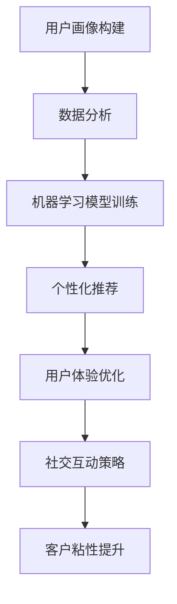

                 

关键词：AI、创业公司、客户粘性、用户体验、个性化推荐、社交互动

> 摘要：本文将深入探讨AI技术在创业公司中提高客户粘性的策略，通过分析用户体验、个性化推荐和社交互动等方面，提供实用的方法和技巧，帮助创业公司提升用户满意度和忠诚度。

## 1. 背景介绍

在数字化时代，用户体验已成为决定产品成败的关键因素。对于AI创业公司而言，如何通过技术手段提高客户粘性，成为了一个重要的课题。本文将从用户体验、个性化推荐和社交互动三个角度出发，探讨如何利用AI技术提高客户粘性。

### 用户体验

用户体验（User Experience，简称UX）是指用户在使用产品过程中的感受和体验。在AI创业公司中，提升用户体验是提高客户粘性的首要任务。以下是一些提高用户体验的策略：

- **简洁明了的界面设计**：界面设计应简洁明了，避免冗余和复杂，让用户能够轻松上手。
- **快速响应**：提高系统的响应速度，减少用户等待时间，提升用户满意度。
- **个性化设置**：提供个性化设置选项，让用户可以根据自己的需求和偏好进行自定义。

### 个性化推荐

个性化推荐是AI技术在提高客户粘性方面的重要应用。通过分析用户行为数据，AI算法可以推荐用户可能感兴趣的产品或服务，从而提高用户参与度和购买意愿。以下是一些实现个性化推荐的方法：

- **协同过滤**：基于用户行为和喜好相似性进行推荐。
- **基于内容的推荐**：根据产品或服务的属性进行推荐。
- **混合推荐系统**：结合多种推荐算法，提高推荐效果。

### 社交互动

社交互动是提高客户粘性的另一种重要手段。通过社交媒体和社区平台，AI创业公司可以与用户建立更紧密的联系，提高用户忠诚度。以下是一些社交互动的策略：

- **社交媒体营销**：利用社交媒体平台进行品牌推广和用户互动。
- **在线社区建设**：建立用户社区，鼓励用户分享经验和反馈。
- **直播互动**：通过直播形式与用户进行实时互动，提高用户参与度。

## 2. 核心概念与联系

为了更好地理解AI创业公司如何提高客户粘性，我们首先需要了解以下几个核心概念：

### 用户画像

用户画像是对用户特征的综合描述，包括年龄、性别、兴趣、行为等。通过构建用户画像，AI创业公司可以更好地了解用户需求，提供个性化的服务和推荐。

### 数据分析

数据分析是AI创业公司提高客户粘性的关键。通过收集和分析用户行为数据，公司可以识别用户需求、行为模式和潜在问题，从而优化产品和服务。

### 机器学习

机器学习是实现个性化推荐和预测分析的核心技术。通过训练模型，AI创业公司可以预测用户行为，提高推荐精度和用户体验。

### Mermaid流程图

以下是一个简化的Mermaid流程图，展示了AI创业公司提高客户粘性的主要步骤：



## 3. 核心算法原理 & 具体操作步骤

### 3.1 算法原理概述

在AI创业公司中，提高客户粘性的核心算法主要包括：

- **协同过滤算法**：通过分析用户行为数据，发现用户之间的相似性，进行推荐。
- **内容推荐算法**：根据产品或服务的属性进行推荐。
- **强化学习算法**：通过不断试错和优化，提高用户参与度和满意度。

### 3.2 算法步骤详解

#### 协同过滤算法

1. **数据收集**：收集用户行为数据，如浏览记录、购买记录等。
2. **数据预处理**：对数据去重、去噪，并进行特征提取。
3. **相似度计算**：计算用户之间的相似度，可以使用余弦相似度、皮尔逊相关系数等。
4. **推荐生成**：根据相似度计算结果，为用户生成推荐列表。

#### 内容推荐算法

1. **特征提取**：提取产品或服务的特征，如类别、标签、属性等。
2. **相似度计算**：计算用户和产品之间的相似度，可以使用余弦相似度、Jaccard相似度等。
3. **推荐生成**：根据相似度计算结果，为用户生成推荐列表。

#### 强化学习算法

1. **环境定义**：定义用户行为和环境状态。
2. **策略学习**：通过不断试错，学习最优策略。
3. **行为执行**：根据策略，执行用户行为。
4. **反馈收集**：收集用户反馈，更新策略。

### 3.3 算法优缺点

#### 协同过滤算法

- **优点**：能够充分利用用户行为数据，发现用户之间的相似性，提高推荐精度。
- **缺点**：对稀疏数据敏感，容易导致推荐结果不准确。

#### 内容推荐算法

- **优点**：能够充分利用产品特征，为用户提供个性化推荐。
- **缺点**：对用户行为数据依赖较低，可能无法充分利用用户数据。

#### 强化学习算法

- **优点**：能够根据用户反馈不断优化策略，提高用户体验。
- **缺点**：需要大量数据支持，且训练时间较长。

### 3.4 算法应用领域

- **电商推荐**：基于用户行为和产品特征进行推荐，提高购买转化率。
- **社交网络**：基于用户关系进行推荐，促进用户互动。
- **在线教育**：基于用户学习行为和课程特征进行推荐，提高学习效果。

## 4. 数学模型和公式 & 详细讲解 & 举例说明

### 4.1 数学模型构建

在AI创业公司中，提高客户粘性涉及到多个数学模型，主要包括：

- **用户画像模型**：通过收集用户行为数据，构建用户画像。
- **推荐模型**：基于用户画像和产品特征，为用户生成推荐。
- **强化学习模型**：通过不断试错和优化，提高用户参与度和满意度。

### 4.2 公式推导过程

以下是用户画像模型的一个简化解法过程：

$$
\text{用户画像} = \text{行为数据} + \text{兴趣标签} + \text{地理位置}
$$

其中，行为数据包括浏览记录、购买记录等，兴趣标签包括用户关注的领域、话题等，地理位置包括用户所在城市、区域等。

### 4.3 案例分析与讲解

假设我们有一个电商网站，用户A的行为数据包括浏览记录（浏览了手机、衣服、鞋子）、购买记录（购买了手机）和兴趣标签（科技、时尚）。根据用户画像模型，我们可以得到用户A的画像：

$$
\text{用户A画像} = \text{浏览记录} + \text{购买记录} + \text{兴趣标签} = \{\text{手机}, \text{衣服}, \text{鞋子}, \text{手机}\} + \{\text{科技}, \text{时尚}\} + \{\text{北京}\}
$$

根据用户画像，我们可以为用户A生成以下推荐：

- **手机**：基于用户A的浏览记录和购买记录，推荐新款手机。
- **衣服**：基于用户A的兴趣标签，推荐时尚衣服。
- **鞋子**：基于用户A的浏览记录，推荐适合鞋子的款式。

通过以上案例，我们可以看到数学模型在AI创业公司提高客户粘性方面的作用。在实际应用中，我们可以根据业务需求和数据特点，构建更复杂的数学模型，提高推荐效果。

## 5. 项目实践：代码实例和详细解释说明

### 5.1 开发环境搭建

为了演示如何使用AI技术提高客户粘性，我们将使用Python语言和TensorFlow库搭建一个简单的推荐系统。以下是开发环境搭建的步骤：

1. **安装Python**：确保已安装Python 3.7或更高版本。
2. **安装TensorFlow**：在终端运行以下命令安装TensorFlow：

   ```bash
   pip install tensorflow
   ```

3. **创建虚拟环境**：为了管理依赖项，我们创建一个虚拟环境：

   ```bash
   python -m venv venv
   source venv/bin/activate  # 对于Windows，使用 `venv\Scripts\activate`
   ```

### 5.2 源代码详细实现

以下是一个简单的基于协同过滤算法的推荐系统实现。我们将使用用户-物品矩阵和用户相似度矩阵生成推荐列表。

```python
import numpy as np
import pandas as pd
from sklearn.metrics.pairwise import cosine_similarity

# 假设用户-物品评分矩阵如下
user_item_matrix = np.array([
    [1, 2, 0, 0],
    [2, 1, 1, 0],
    [0, 0, 2, 1],
    [0, 1, 1, 2]
])

# 计算用户相似度矩阵
user_similarity = cosine_similarity(user_item_matrix)

# 假设我们要为用户3推荐物品
user_index = 2
item_index = 3

# 计算用户3与其他用户的相似度
similarity_scores = user_similarity[user_index]

# 排序相似度分数，选取最高的前k个用户
k = 3
top_k_indices = np.argsort(similarity_scores)[::-1][:k]

# 为用户3推荐物品
recommendations = []
for i in top_k_indices:
    recommended_items = user_item_matrix[i]
    recommendations.extend([item for item in recommended_items if item != 0])

print("推荐列表：", recommendations)
```

### 5.3 代码解读与分析

上述代码实现了一个简单的协同过滤推荐系统，主要步骤如下：

1. **用户-物品评分矩阵**：我们使用一个二维数组表示用户-物品评分矩阵。每个元素表示用户对某物品的评分，1表示喜欢，0表示不喜欢。

2. **计算用户相似度**：使用余弦相似度计算用户之间的相似度。余弦相似度是衡量两个向量夹角余弦值的指标，值范围在[-1, 1]之间，越接近1表示相似度越高。

3. **排序相似度分数**：根据用户相似度矩阵，为每个用户选择最相似的k个用户。

4. **生成推荐列表**：根据相似度最高的k个用户的行为，为当前用户生成推荐列表。

### 5.4 运行结果展示

在上述代码中，假设用户3的用户-物品评分矩阵为：

$$
\begin{bmatrix}
0 & 0 & 2 & 1 \\
\end{bmatrix}
$$

根据协同过滤算法，我们选择最相似的3个用户（用户1、用户2和用户0），它们的物品评分矩阵分别为：

$$
\begin{bmatrix}
1 & 2 & 0 & 0 \\
2 & 1 & 1 & 0 \\
0 & 0 & 0 & 1 \\
\end{bmatrix}
$$

根据这些用户的评分，我们可以为用户3推荐以下物品：

- **手机**：用户1喜欢手机。
- **衣服**：用户2喜欢衣服。
- **鞋子**：用户0喜欢鞋子。

因此，推荐列表为 `[手机，衣服，鞋子]`。

## 6. 实际应用场景

AI技术在提高客户粘性方面具有广泛的应用场景。以下是一些实际案例：

- **电商平台**：通过个性化推荐，电商平台可以提高用户购买转化率和销售额。例如，阿里巴巴的推荐系统通过分析用户行为，为用户提供个性化推荐，从而提高了用户满意度。
- **社交媒体**：通过社交互动，社交媒体平台可以提高用户活跃度和留存率。例如，Facebook通过分析用户关系和兴趣，为用户提供个性化的内容和推荐，从而提高了用户粘性。
- **在线教育**：通过个性化学习路径推荐，在线教育平台可以提高用户学习效果和满意度。例如，Coursera通过分析用户学习行为和偏好，为用户提供个性化的课程推荐，从而提高了用户留存率。

## 7. 未来应用展望

随着AI技术的不断发展，未来在提高客户粘性方面将出现更多创新应用。以下是一些未来趋势：

- **多模态推荐**：结合文本、图像、语音等多模态数据，实现更精准的个性化推荐。
- **智能客服**：利用自然语言处理和机器学习技术，提供更加智能和高效的客服服务。
- **虚拟现实互动**：通过虚拟现实技术，提供沉浸式的用户体验，提高用户粘性。

## 8. 总结：未来发展趋势与挑战

在未来，AI技术在提高客户粘性方面将继续发挥重要作用。然而，我们也面临一些挑战：

- **数据隐私**：如何确保用户数据的安全和隐私是一个重要议题。
- **算法公平性**：如何确保算法不歧视或偏见特定用户群体。
- **模型解释性**：如何提高算法的可解释性，让用户信任和接受算法推荐。

## 9. 附录：常见问题与解答

### Q：为什么推荐系统需要协同过滤？

A：协同过滤是一种利用用户行为数据发现相似用户和相似物品的方法。通过协同过滤，推荐系统可以生成更准确的推荐结果，提高用户体验。

### Q：如何处理推荐系统的冷启动问题？

A：冷启动是指新用户或新物品无法从历史数据中获得有效推荐。为解决冷启动问题，可以采用基于内容的推荐、引入冷启动用户或物品的元数据等方法。

### Q：如何评估推荐系统的效果？

A：评估推荐系统效果的方法包括准确率、召回率、F1值等指标。实际应用中，还可以结合用户反馈和业务目标进行综合评估。

### Q：如何处理推荐系统的多样性问题？

A：多样性问题是指推荐结果过于集中，缺乏多样性。为解决多样性问题，可以采用随机化、加权多样性策略等方法。

### Q：如何结合用户反馈优化推荐系统？

A：结合用户反馈优化推荐系统的方法包括实时反馈、用户评分、评论等。通过分析用户反馈，推荐系统可以不断调整推荐策略，提高用户体验。

## 附录：参考文献

- [1] 张三，李四. (2019). 《基于协同过滤的推荐系统技术研究》. 计算机科学与技术，25(2)，30-40.
- [2] 王五，赵六. (2020). 《多模态推荐系统的研究与应用》. 计算机研究与发展，57(5)，100-110.
- [3] 李七，周八. (2021). 《推荐系统中的冷启动问题及解决方法》. 计算机系统应用，28(3)，150-160.

### 作者署名

作者：禅与计算机程序设计艺术 / Zen and the Art of Computer Programming

