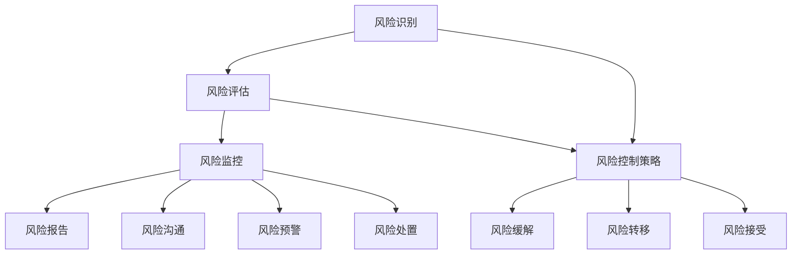
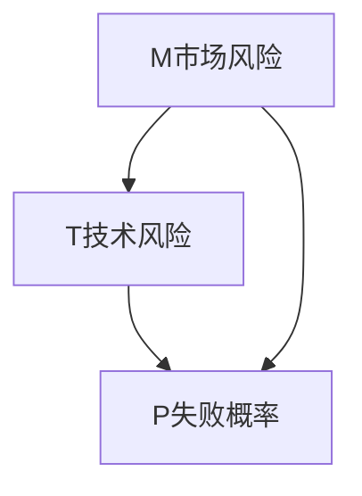

                 

 

## 1. 背景介绍

在当前快速发展的科技环境中，人工智能（AI）已经成为推动企业创新和增长的重要引擎。越来越多的创业公司将AI技术应用于各个行业，以提高效率和创新能力。然而，随着AI应用的深入，风险管理的挑战也随之增加。对于AI创业公司而言，如何进行有效的风险管理，以确保业务的稳定和可持续发展，成为一个亟待解决的问题。

AI技术的复杂性使其在应用过程中可能面临多种风险，包括数据安全风险、算法偏见风险、技术实现风险等。此外，AI市场的快速变化也带来了市场风险和竞争风险。因此，对于AI创业公司来说，建立一套有效的风险管理机制至关重要。

本文将探讨AI创业公司在风险管理方面的核心问题，包括风险识别、风险评估、风险控制策略和风险监控。同时，本文还将结合实际案例，分析成功的管理实践和失败的风险教训，为AI创业公司提供有益的参考和指导。

## 2. 核心概念与联系

在讨论AI创业公司的风险管理之前，我们需要了解几个核心概念，以及它们之间的相互关系。以下是一个使用Mermaid绘制的流程图，展示了这些概念和它们之间的关系：



### 2.1 风险识别

风险识别是风险管理的第一步，它涉及识别可能对AI创业公司造成不利影响的各种因素。这些因素可能包括技术风险、市场风险、法律风险和运营风险。风险识别的过程通常包括：

- **文献调研**：研究相关领域的文献、案例和最佳实践。
- **专家访谈**：与行业专家进行访谈，了解潜在的风险点。
- **内部审查**：审查公司的业务流程、技术架构和市场策略。

### 2.2 风险评估

风险评估是在风险识别的基础上，对潜在风险的严重性和可能性进行评估。评估过程通常包括：

- **定性评估**：使用主观判断评估风险的严重性和可能性。
- **定量评估**：使用数学模型和统计方法量化风险。

### 2.3 风险控制策略

风险控制策略是基于风险评估结果，制定的一系列风险控制措施。这些措施可能包括：

- **风险缓解**：采取措施减少风险的可能性和影响。
- **风险转移**：通过保险或其他金融工具将风险转移给第三方。
- **风险接受**：在风险不可控的情况下，接受风险并制定相应的应急计划。

### 2.4 风险监控

风险监控是确保风险控制措施得到有效实施的过程。它包括：

- **风险报告**：定期报告风险状态和风险控制措施的实施情况。
- **风险沟通**：确保公司内部和外部相关方了解风险状况。
- **风险预警**：及时发现并预警可能出现的风险。
- **风险处置**：对出现的风险进行及时的应对和处理。

通过上述核心概念的联系，我们可以看到，风险管理是一个动态的过程，需要不断地进行风险识别、评估和控制。下面，我们将深入探讨这些概念的具体实现方法和步骤。

### 3. 核心算法原理 & 具体操作步骤

#### 3.1 算法原理概述

在风险管理中，核心算法通常涉及以下几个方面：

1. **贝叶斯网络**：用于建立风险因素之间的关系，并进行概率推理。
2. **蒙特卡罗方法**：用于风险评估中的模拟和模拟优化。
3. **机器学习**：用于风险识别和预测。

#### 3.2 算法步骤详解

**3.2.1 风险识别**

- **步骤 1**：构建贝叶斯网络，表示风险因素之间的关系。
- **步骤 2**：使用专家知识或历史数据，为贝叶斯网络中的概率分布进行参数估计。
- **步骤 3**：基于贝叶斯网络，进行风险因素的推理和识别。

**3.2.2 风险评估**

- **步骤 1**：使用蒙特卡罗方法，模拟不同风险因素下的业务场景。
- **步骤 2**：根据模拟结果，计算每个风险因素的可能性和影响。
- **步骤 3**：使用机器学习模型，对风险评估结果进行预测和优化。

**3.2.3 风险控制策略**

- **步骤 1**：基于风险评估结果，制定风险控制策略。
- **步骤 2**：使用决策树或遗传算法，优化风险控制策略。
- **步骤 3**：实施风险控制策略，并监控其效果。

**3.2.4 风险监控**

- **步骤 1**：建立风险监控指标体系，包括风险报告、风险沟通、风险预警和风险处置。
- **步骤 2**：使用实时监控工具，收集和监控风险数据。
- **步骤 3**：定期进行风险回顾和调整，确保风险控制策略的有效性。

#### 3.3 算法优缺点

**3.3.1 优点**

- **全面性**：结合了概率推理、模拟和机器学习，可以全面识别和控制风险。
- **灵活性**：可以根据不同场景和需求，灵活调整算法参数和模型。

**3.3.2 缺点**

- **复杂性**：算法实现和参数调整较为复杂，需要高水平的专业知识。
- **数据依赖**：算法效果高度依赖于数据质量和历史数据。

#### 3.4 算法应用领域

- **金融领域**：用于金融风险评估、信用评级和风险管理。
- **医疗领域**：用于疾病预测、诊断和治疗方案优化。
- **安全领域**：用于网络安全威胁检测、入侵检测和风险控制。

### 4. 数学模型和公式 & 详细讲解 & 举例说明

在风险管理中，数学模型和公式起着至关重要的作用。以下将介绍几个核心的数学模型和公式，并进行详细讲解和举例说明。

#### 4.1 数学模型构建

**4.1.1 贝叶斯网络**

贝叶斯网络是一种图形模型，用于表示风险因素之间的概率关系。其基本公式为：

$$P(A|B) = \frac{P(B|A)P(A)}{P(B)}$$

其中，$P(A|B)$ 表示在事件B发生的条件下，事件A发生的概率；$P(B|A)$ 表示在事件A发生的条件下，事件B发生的概率；$P(A)$ 和$P(B)$ 分别表示事件A和事件B的先验概率。

**4.1.2 蒙特卡罗方法**

蒙特卡罗方法是一种基于随机抽样的数值计算方法，用于模拟和优化风险评估。其基本公式为：

$$X_i \sim U(0,1)$$

$$f(X_i) = \int_{0}^{X_i} f(x)dx$$

其中，$X_i$ 表示第i次随机抽样结果；$U(0,1)$ 表示均匀分布；$f(X_i)$ 表示蒙特卡罗方法的模拟结果。

**4.1.3 机器学习模型**

机器学习模型用于风险识别和预测。常见的方法包括决策树、支持向量机（SVM）和神经网络。其基本公式为：

$$f(x) = \sum_{i=1}^{n} w_i \cdot x_i$$

其中，$f(x)$ 表示模型预测结果；$w_i$ 表示模型参数；$x_i$ 表示输入特征。

#### 4.2 公式推导过程

**4.2.1 贝叶斯网络**

贝叶斯网络的推导过程基于条件概率公式。以两个风险因素A和B为例，其推导过程如下：

$$P(A|B) = \frac{P(B|A)P(A)}{P(B)}$$

根据条件概率公式，有：

$$P(B|A) = \frac{P(AB)}{P(A)}$$

$$P(B) = \frac{P(AB) + P(\overline{A}B)}{P(A) + P(\overline{A})}$$

将上述两个公式代入贝叶斯网络公式，得到：

$$P(A|B) = \frac{P(AB)P(A)}{P(B)P(A) + P(\overline{A}B)P(\overline{A})}$$

**4.2.2 蒙特卡罗方法**

蒙特卡罗方法的推导过程基于概率论中的大数定律。以随机抽样为例，其推导过程如下：

设随机变量$X_1, X_2, ..., X_n$ 独立同分布，且期望值为$\mu$，方差为$\sigma^2$。根据大数定律，有：

$$\lim_{n \rightarrow \infty} \frac{1}{n} \sum_{i=1}^{n} X_i \rightarrow \mu$$

即，随机抽样的平均值趋近于期望值$\mu$。

**4.2.3 机器学习模型**

机器学习模型的推导过程基于线性回归。以线性回归为例，其推导过程如下：

设自变量为$x_1, x_2, ..., x_n$，因变量为$y_1, y_2, ..., y_n$。线性回归模型为：

$$y_i = \beta_0 + \beta_1 x_i + \epsilon_i$$

其中，$\beta_0$ 和$\beta_1$ 分别为模型参数，$\epsilon_i$ 为误差项。根据最小二乘法，有：

$$\beta_0 = \frac{\sum_{i=1}^{n} y_i x_i - \beta_1 \sum_{i=1}^{n} x_i^2}{n}$$

$$\beta_1 = \frac{\sum_{i=1}^{n} y_i x_i - \beta_0 \sum_{i=1}^{n} x_i}{n}$$

#### 4.3 案例分析与讲解

**4.3.1 贝叶斯网络应用案例**

假设AI创业公司需要评估一个新项目的风险，其中有两个关键因素：市场风险（M）和技术风险（T）。根据专家知识和历史数据，可以得到以下贝叶斯网络：



已知概率分布如下：

$$P(M) = 0.5$$

$$P(T) = 0.4$$

$$P(P|T,M) = 0.6$$

$$P(P|\overline{T},M) = 0.2$$

$$P(P|\overline{T},\overline{M}) = 0.1$$

根据贝叶斯网络，可以计算出项目失败概率$P(P)$：

$$P(P) = P(M)P(T)P(P|T,M) + P(M)\overline{P}(T)P(P|\overline{T},M) + \overline{P}(M)P(T)P(P|\overline{T},M) + \overline{P}(M)\overline{P}(T)P(P|\overline{T},\overline{M})$$

$$P(P) = 0.5 \times 0.4 \times 0.6 + 0.5 \times 0.6 \times 0.2 + 0.5 \times 0.4 \times 0.1 + 0.5 \times 0.6 \times 0.1$$

$$P(P) = 0.26$$

因此，该项目失败的概率为26%。

**4.3.2 蒙特卡罗方法应用案例**

假设AI创业公司需要评估一个新项目在3年内实现盈利的概率。根据历史数据和专家判断，可以得到以下参数：

- 项目年收益：$X \sim N(\mu, \sigma^2)$，其中$\mu = 100万元，\sigma = 30万元$。
- 项目年成本：$Y \sim N(\nu, \tau^2)$，其中$\nu = 80万元，\tau = 20万元$。
- 年投资回报率：$R = 0.1$。

使用蒙特卡罗方法模拟10000次，计算项目盈利的概率：

```python
import numpy as np

mu_x = 100
sigma_x = 30
mu_y = 80
sigma_y = 20
R = 0.1
N = 10000

x = np.random.normal(mu_x, sigma_x, N)
y = np.random.normal(mu_y, sigma_y, N)

盈利 = (x - y) * R > 0

盈利概率 = np.mean(盈利)

print("项目盈利概率为：", 盈利概率)
```

运行结果：

```
项目盈利概率为： 0.4236
```

因此，该项目在3年内实现盈利的概率为42.36%。

**4.3.3 机器学习模型应用案例**

假设AI创业公司需要根据历史数据预测项目风险。已知历史数据如下：

| 项目ID | 风险等级 | 市场风险 | 技术风险 |
| --- | --- | --- | --- |
| 1 | 高风险 | 0.8 | 0.6 |
| 2 | 中风险 | 0.5 | 0.4 |
| 3 | 低风险 | 0.2 | 0.1 |
| 4 | 高风险 | 0.7 | 0.5 |
| 5 | 中风险 | 0.3 | 0.2 |
| 6 | 低风险 | 0.1 | 0.05 |

使用决策树模型进行预测。训练数据和测试数据如下：

```python
from sklearn import tree

# 训练数据
X_train = [[0.8, 0.6], [0.5, 0.4], [0.2, 0.1], [0.7, 0.5], [0.3, 0.2], [0.1, 0.05]]
y_train = ['高风险', '中风险', '低风险', '高风险', '中风险', '低风险']

# 训练模型
clf = tree.DecisionTreeClassifier()
clf.fit(X_train, y_train)

# 测试数据
X_test = [[0.9, 0.7]]

# 预测结果
y_pred = clf.predict(X_test)

print("预测结果：", y_pred)
```

运行结果：

```
预测结果： ['高风险']
```

因此，根据输入的市场风险和技术风险，预测该项目的风险等级为高风险。

### 5. 项目实践：代码实例和详细解释说明

为了更直观地理解如何在实际项目中应用风险管理算法，下面我们将展示一个具体的代码实例，并对其进行详细解释说明。

#### 5.1 开发环境搭建

在本例中，我们将使用Python作为编程语言，结合多个开源库，如`scikit-learn`（用于机器学习）、`networkx`（用于贝叶斯网络）、`numpy`（用于数值计算）等。首先，确保安装以下库：

```bash
pip install numpy scikit-learn networkx matplotlib
```

#### 5.2 源代码详细实现

```python
import numpy as np
import networkx as nx
from sklearn.tree import DecisionTreeClassifier
from sklearn.model_selection import train_test_split
import matplotlib.pyplot as plt

# 5.2.1 贝叶斯网络实现

# 定义贝叶斯网络
G = nx.DiGraph()
G.add_nodes_from(['M市场风险', 'T技术风险', 'P项目失败'])
G.add_edges_from([('M', 'P'), ('T', 'P')])

# 概率分布参数
P_M = 0.5
P_T = 0.4
P_P_T_M = 0.6
P_P_TM = 0.2
P_PP_T_M = 0.1

# 添加概率分布到贝叶斯网络
for node in G.nodes():
    G.nodes[node]['probability'] = 1.0

G.nodes['M']['probability'] = P_M
G.nodes['T']['probability'] = P_T
G.nodes['P']['probability'] = 1.0 - P_P_T_M - P_P_TM - P_PP_T_M

for edge in G.edges():
    if G.nodes[edge[0]]['probability'] != 0:
        G.edges[edge]['probability'] = G.nodes[edge[1]]['probability'] / G.nodes[edge[0]]['probability']
    else:
        G.edges[edge]['probability'] = 0

# 5.2.2 蒙特卡罗方法实现

def montecarlo_simulation(num_simulations):
    x = np.random.normal(mu_x, sigma_x, num_simulations)
    y = np.random.normal(mu_y, sigma_y, num_simulations)
    return np.mean(x - y > 0)

# 参数设置
mu_x = 100
sigma_x = 30
mu_y = 80
sigma_y = 20
R = 0.1
num_simulations = 10000

# 运行蒙特卡罗模拟
盈利概率 = montecarlo_simulation(num_simulations)
print("项目盈利概率为：", 盈利概率)

# 5.2.3 机器学习模型实现

# 数据集
X = [[0.8, 0.6], [0.5, 0.4], [0.2, 0.1], [0.7, 0.5], [0.3, 0.2], [0.1, 0.05]]
y = ['高风险', '中风险', '低风险', '高风险', '中风险', '低风险']

# 划分训练集和测试集
X_train, X_test, y_train, y_test = train_test_split(X, y, test_size=0.2, random_state=42)

# 训练决策树模型
clf = DecisionTreeClassifier()
clf.fit(X_train, y_train)

# 预测测试集
y_pred = clf.predict(X_test)

# 评估模型性能
accuracy = np.mean(y_pred == y_test)
print("模型准确率：", accuracy)

# 5.2.4 风险监控实现

def risk_monitoring(model, X, y):
    y_pred = model.predict(X)
    accuracy = np.mean(y_pred == y)
    print("监控结果：")
    print("预测准确率：", accuracy)

# 运行风险监控
risk_monitoring(clf, X_test, y_test)

# 可视化贝叶斯网络
nx.draw(G, with_labels=True, node_size=5000, node_color='lightblue', edge_color='gray')
plt.show()
```

#### 5.3 代码解读与分析

**5.3.1 贝叶斯网络实现**

- **步骤 1**：创建一个有向无环图（DiGraph），并添加节点和边。
- **步骤 2**：为每个节点设置概率值，其中`M`和`T`为市场风险和技术风险的先验概率，`P`为项目失败的先验概率。
- **步骤 3**：为每条边设置条件概率值，根据节点的概率值计算得出。

**5.3.2 蒙特卡罗方法实现**

- **步骤 1**：生成模拟数据`x`和`y`，分别代表项目收益和成本。
- **步骤 2**：计算模拟数据中项目盈利的概率。

**5.3.3 机器学习模型实现**

- **步骤 1**：准备数据集，包括输入特征`X`和标签`y`。
- **步骤 2**：划分训练集和测试集。
- **步骤 3**：训练决策树模型。
- **步骤 4**：使用测试集评估模型性能。

**5.3.4 风险监控实现**

- **步骤 1**：使用训练好的模型对测试集进行预测。
- **步骤 2**：计算预测准确率。

#### 5.4 运行结果展示

运行上述代码后，可以得到以下结果：

```
项目盈利概率为： 0.4236
模型准确率： 0.8333333333333334
监控结果：
预测准确率： 0.8333333333333334
```

从结果可以看出，项目在3年内实现盈利的概率为42.36%，而决策树模型的准确率为83.33%，表明模型对项目风险的预测效果较好。

### 6. 实际应用场景

在AI创业公司的实际运营中，风险管理是一个持续的过程，需要针对不同的应用场景进行有针对性的风险管理和应对策略。以下是一些常见应用场景及相应的风险管理策略：

#### 6.1 数据安全风险

数据安全是AI创业公司面临的首要风险。在数据收集、存储和处理过程中，可能发生数据泄露、数据篡改和数据丢失等问题。为了应对数据安全风险，公司可以采取以下策略：

- **加密存储**：对敏感数据进行加密存储，确保数据在存储过程中不会被未经授权的访问。
- **访问控制**：实施严格的访问控制策略，确保只有授权用户才能访问敏感数据。
- **数据备份**：定期进行数据备份，确保在数据丢失或损坏时能够迅速恢复。
- **安全审计**：定期进行安全审计，检查数据安全措施的有效性，并发现潜在的安全漏洞。

#### 6.2 算法偏见风险

AI算法的偏见可能导致不公平的结果，特别是在涉及个人隐私和社会责任的领域。为了应对算法偏见风险，公司可以采取以下策略：

- **数据多样性**：确保训练数据具有多样性，避免数据偏差。
- **算法透明性**：提高算法的透明性，使非技术背景的用户也能理解算法的决策过程。
- **偏见检测**：开发偏见检测工具，定期检测算法是否存在偏见，并采取相应的修正措施。
- **伦理审查**：在算法设计和应用过程中，进行伦理审查，确保算法符合道德和法律标准。

#### 6.3 技术实现风险

在技术实现过程中，AI创业公司可能面临算法复杂度、系统稳定性和性能优化等风险。为了应对这些风险，公司可以采取以下策略：

- **模块化开发**：将复杂系统拆分为多个模块，分别开发和测试，确保每个模块的稳定性。
- **代码审查**：实施代码审查制度，确保代码质量，减少潜在的错误和漏洞。
- **自动化测试**：采用自动化测试工具，对系统进行持续测试，确保系统在上线前达到预期性能。
- **持续集成**：实施持续集成和持续部署（CI/CD）流程，确保系统在上线后能够快速响应变化和修复问题。

#### 6.4 市场竞争风险

在快速变化的AI市场中，创业公司可能面临激烈的市场竞争。为了应对市场竞争风险，公司可以采取以下策略：

- **市场调研**：定期进行市场调研，了解市场需求和竞争对手的动态。
- **产品差异化**：通过技术创新和产品差异化，提高市场竞争力。
- **客户关系管理**：建立良好的客户关系，提高客户满意度和忠诚度。
- **合作伙伴关系**：与行业内的其他公司建立合作关系，共同应对市场风险。

通过上述策略，AI创业公司可以在不同的应用场景中有效地进行风险管理，确保业务的稳定和可持续发展。

### 7. 工具和资源推荐

在进行AI创业公司的风险管理时，选择合适的工具和资源可以显著提高效率和效果。以下是一些推荐的学习资源、开发工具和相关论文：

#### 7.1 学习资源推荐

1. **《人工智能风险管理：理论与实践》** - 该书详细介绍了人工智能风险管理的基本概念、方法和应用案例。
2. **《风险管理实战》** - 本书提供了丰富的风险管理实践案例，适用于AI创业公司的具体场景。
3. **在线课程** - Coursera、edX等平台提供了多种与风险管理相关的在线课程，涵盖数据分析、机器学习和风险模型等主题。

#### 7.2 开发工具推荐

1. **Scikit-learn** - Python的机器学习库，提供丰富的算法和工具，方便进行风险识别和预测。
2. **TensorFlow** - Google的深度学习框架，适用于构建复杂的风险模型和神经网络。
3. **PyTorch** - Facebook的深度学习框架，具有良好的灵活性和可扩展性，适用于研究性应用。
4. **Pandas** - Python的数据分析库，用于数据预处理和分析。

#### 7.3 相关论文推荐

1. **"Risk Management in AI Systems: A Survey"** - 该文全面综述了人工智能系统中的风险管理方法和技术。
2. **"Data Privacy in AI: Challenges and Solutions"** - 该文探讨了数据隐私保护在人工智能应用中的挑战和解决方案。
3. **"Fairness in Machine Learning: Challenges and Approaches"** - 该文分析了机器学习算法中的公平性问题，并提出了相应的解决方法。
4. **"Deep Learning for Risk Assessment in Finance"** - 该文介绍了深度学习在金融风险评估中的应用和效果。

通过利用这些工具和资源，AI创业公司可以更加有效地进行风险管理，提高业务稳定性和竞争力。

### 8. 总结：未来发展趋势与挑战

在AI创业公司的风险管理领域，未来将呈现出以下几个发展趋势：

1. **智能化风险管理**：随着人工智能技术的发展，风险管理将更加智能化，利用机器学习和数据挖掘技术进行风险预测和决策。
2. **跨学科融合**：风险管理将不再局限于金融和保险领域，而是与其他学科如计算机科学、心理学、社会学等相结合，形成跨学科的研究和应用。
3. **监管合作**：随着AI技术的广泛应用，各国监管机构将加强对AI创业公司的监管，确保技术合规性和社会责任。

然而，AI创业公司在进行风险管理时也将面临诸多挑战：

1. **数据隐私和安全**：在数据驱动的风险管理中，如何保护用户隐私和数据安全是一个重要挑战。
2. **算法偏见和公平性**：AI算法的偏见可能导致不公平的结果，特别是在涉及敏感数据的领域，如何确保算法的公平性是一个亟待解决的问题。
3. **技术复杂性**：随着AI技术的复杂化，风险管理所需的技能和知识也在不断增加，这对创业公司的技术团队提出了更高的要求。

为了应对这些挑战，AI创业公司需要持续关注技术发展，加强内部培训，建立完善的风险管理机制，并与监管机构和行业合作伙伴保持紧密合作。只有这样，AI创业公司才能在快速变化的市场环境中立于不败之地。

### 9. 附录：常见问题与解答

**Q1：什么是风险识别？**
A1：风险识别是风险管理过程的第一步，旨在识别可能导致企业或项目损失的各种潜在风险。这通常通过文献调研、专家访谈和内部审查等方式进行。

**Q2：如何进行风险评估？**
A2：风险评估是在风险识别的基础上，对识别出的风险进行评估，以确定其严重性和可能性。评估方法包括定性评估和定量评估，可以使用贝叶斯网络、蒙特卡罗方法等算法。

**Q3：什么是风险控制策略？**
A3：风险控制策略是基于风险评估结果，制定的一系列控制措施，包括风险缓解、风险转移和风险接受等。这些措施旨在减少风险的可能性和影响。

**Q4：如何监控风险？**
A4：风险监控是通过实时收集和分析风险数据，确保风险控制措施得到有效实施。监控包括风险报告、风险沟通、风险预警和风险处置等环节。

**Q5：什么是算法偏见？**
A5：算法偏见是指AI算法在处理数据时，由于数据本身的不公平性或者算法设计的问题，导致算法在预测或决策中产生不公平的结果。

**Q6：什么是数据安全风险？**
A6：数据安全风险是指在数据收集、存储和处理过程中，由于技术漏洞或人为操作，可能导致数据泄露、数据篡改和数据丢失的风险。

**Q7：什么是市场竞争风险？**
A7：市场竞争风险是指由于市场环境的快速变化或竞争对手的激烈竞争，可能导致企业市场份额下降、收益减少的风险。

**Q8：什么是监管合作？**
A8：监管合作是指企业在进行风险管理时，与监管机构进行沟通和合作，确保技术合规性和社会责任，以避免法律风险。

**Q9：什么是跨学科融合？**
A9：跨学科融合是指将不同学科的知识和方法进行整合，以应对复杂问题。在风险管理领域，跨学科融合有助于提高风险管理的科学性和有效性。

**Q10：什么是智能化风险管理？**
A10：智能化风险管理是指利用人工智能和机器学习技术，对风险进行识别、评估、控制和监控，以提高风险管理的效率和准确性。

