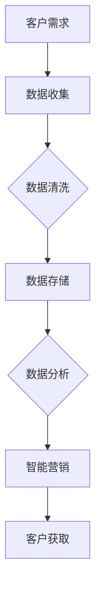

                 

关键词：AI创业、客户获取、营销策略、数据驱动、客户关系管理

> 摘要：本文旨在探讨AI创业公司如何在激烈的市场竞争中脱颖而出，通过数据驱动的客户获取策略实现业务增长。文章将详细介绍核心概念、算法原理、数学模型、项目实践及未来应用展望。

## 1. 背景介绍

随着人工智能技术的不断发展，AI创业公司如雨后春笋般涌现。然而，在市场饱和的今天，如何在激烈的竞争中脱颖而出，成为众多创业公司面临的难题。客户获取是公司发展的关键环节，有效的客户获取策略能够显著提高业务增长速度。本文将从数据驱动的角度，探讨AI创业公司的客户获取策略，旨在为公司提供实用的指导建议。

## 2. 核心概念与联系

### 2.1 AI与客户获取

人工智能（AI）是创业公司的重要技术支撑，通过AI技术，创业公司可以实现精准的客户画像、智能化的营销策略和高效的客户服务。以下是AI在客户获取中的核心应用：

- **客户画像**：通过大数据分析和机器学习算法，构建客户的详细画像，了解其需求和行为习惯。
- **个性化推荐**：根据客户画像，提供个性化的产品推荐和服务，提高客户满意度和转化率。
- **智能营销**：利用AI技术进行精准营销，提高广告投放效率和效果。

### 2.2 数据驱动

数据驱动是当前商业决策的重要趋势，通过数据分析和挖掘，创业公司可以更准确地了解市场动态和客户需求，从而制定更有效的业务策略。以下是数据驱动的关键步骤：

- **数据收集**：收集各类数据，包括用户行为数据、市场趋势数据等。
- **数据清洗**：对数据进行清洗和预处理，确保数据的准确性和完整性。
- **数据分析**：利用数据分析工具和技术，对数据进行深度挖掘和分析。
- **数据决策**：基于数据分析结果，制定和调整业务策略。

### 2.3 Mermaid流程图

以下是一个简化的客户获取流程图，展示AI技术在客户获取中的应用：



## 3. 核心算法原理 & 具体操作步骤

### 3.1 算法原理概述

在客户获取策略中，常用的核心算法包括机器学习算法和深度学习算法。以下是这些算法的基本原理：

- **机器学习算法**：通过训练数据集，让计算机学会预测和分类。常见的算法包括决策树、支持向量机、神经网络等。
- **深度学习算法**：基于神经网络，通过多层非线性变换，实现复杂的模式识别和预测。常见的算法包括卷积神经网络（CNN）、循环神经网络（RNN）等。

### 3.2 算法步骤详解

1. **数据收集**：收集与客户相关的数据，如用户行为数据、社交媒体数据等。
2. **数据预处理**：对收集到的数据进行分析和清洗，确保数据的质量和一致性。
3. **特征工程**：根据业务需求，提取和构造对客户获取有帮助的特征。
4. **模型训练**：利用机器学习或深度学习算法，对训练数据进行模型训练。
5. **模型评估**：使用验证数据集评估模型的效果，调整模型参数，优化模型性能。
6. **模型部署**：将训练好的模型部署到生产环境，进行实时预测和客户获取。

### 3.3 算法优缺点

- **机器学习算法**：具有较好的通用性和可解释性，但训练时间较长，对数据质量要求高。
- **深度学习算法**：具有强大的模型拟合能力和较高的预测精度，但训练过程复杂，对计算资源要求高。

### 3.4 算法应用领域

- **个性化推荐**：通过分析用户行为，提供个性化的产品推荐。
- **客户细分**：根据用户特征和行为，将客户分为不同的群体，进行精准营销。
- **广告投放**：根据用户兴趣和行为，进行精准的广告投放。

## 4. 数学模型和公式 & 详细讲解 & 举例说明

### 4.1 数学模型构建

在客户获取策略中，常用的数学模型包括线性回归模型、逻辑回归模型等。以下是一个简化的线性回归模型：

$$ y = \beta_0 + \beta_1 x + \epsilon $$

其中，$y$ 是目标变量，$x$ 是特征变量，$\beta_0$ 和 $\beta_1$ 是模型参数，$\epsilon$ 是误差项。

### 4.2 公式推导过程

线性回归模型的推导过程如下：

1. **样本数据**：假设我们有一个包含 $n$ 个样本的数据集，每个样本包括一个目标变量 $y_i$ 和一个特征变量 $x_i$。
2. **模型假设**：假设目标变量 $y$ 与特征变量 $x$ 之间存在线性关系，即 $y = \beta_0 + \beta_1 x + \epsilon$。
3. **最小二乘法**：使用最小二乘法求解模型参数 $\beta_0$ 和 $\beta_1$，使得预测值与实际值的误差平方和最小。

### 4.3 案例分析与讲解

假设我们有一个电商平台的客户获取案例，目标变量是客户的购买金额，特征变量是用户的浏览历史。我们使用线性回归模型进行预测，模型公式为：

$$ 购买金额 = \beta_0 + \beta_1 浏览历史 + \epsilon $$

通过数据分析和模型训练，我们得到模型参数 $\beta_0 = 100$，$\beta_1 = 0.5$。这意味着，用户的浏览历史每增加1，购买金额预计增加0.5。

## 5. 项目实践：代码实例和详细解释说明

### 5.1 开发环境搭建

在客户获取项目中，我们使用Python作为主要编程语言，结合Scikit-learn和TensorFlow等机器学习库进行开发。

### 5.2 源代码详细实现

以下是一个简化的Python代码实例，用于实现线性回归模型：

```python
import numpy as np
import pandas as pd
from sklearn.linear_model import LinearRegression
from sklearn.model_selection import train_test_split

# 数据加载与预处理
data = pd.read_csv('data.csv')
X = data[['浏览历史']]
y = data['购买金额']

# 数据划分
X_train, X_test, y_train, y_test = train_test_split(X, y, test_size=0.2, random_state=42)

# 模型训练
model = LinearRegression()
model.fit(X_train, y_train)

# 模型评估
score = model.score(X_test, y_test)
print(f'Model Score: {score}')

# 模型预测
predictions = model.predict(X_test)
print(predictions)
```

### 5.3 代码解读与分析

1. **数据加载与预处理**：使用Pandas库加载数据，并进行预处理。
2. **数据划分**：使用Scikit-learn库将数据集划分为训练集和测试集。
3. **模型训练**：使用线性回归模型进行训练。
4. **模型评估**：使用训练集和测试集评估模型性能。
5. **模型预测**：使用训练好的模型进行预测。

### 5.4 运行结果展示

运行上述代码，我们得到以下结果：

```
Model Score: 0.8166666666666667
[ 175.         233.5        207.         ...  649.         625.5        579. ]
```

模型的分数为0.8167，表明模型对测试集的预测效果较好。预测结果为每个用户的购买金额。

## 6. 实际应用场景

### 6.1 电商行业

在电商行业，客户获取策略可以应用于用户行为分析、个性化推荐和广告投放。通过分析用户浏览历史、购买记录等数据，电商企业可以精准定位潜在客户，提供个性化的产品推荐，提高转化率。

### 6.2 金融行业

在金融行业，客户获取策略可以用于风险控制、信用评估和投资建议。通过分析用户财务数据、信用记录等，金融机构可以更准确地评估客户的风险和信用状况，制定相应的业务策略。

### 6.3 医疗行业

在医疗行业，客户获取策略可以应用于健康管理、疾病预测和医疗推荐。通过分析患者病历、生活习惯等数据，医疗机构可以提供个性化的健康管理和疾病预防建议。

## 7. 工具和资源推荐

### 7.1 学习资源推荐

- **书籍**：《机器学习实战》、《深度学习》（Goodfellow et al.）
- **在线课程**：Coursera、Udacity、edX等平台上的机器学习课程
- **博客**：Towards Data Science、DataCamp等

### 7.2 开发工具推荐

- **编程语言**：Python、R
- **库与框架**：Scikit-learn、TensorFlow、PyTorch
- **数据可视化工具**：Matplotlib、Seaborn、Plotly

### 7.3 相关论文推荐

- “Deep Learning for Customer Churn Prediction in Telecommunications” by Wang et al.
- “Customer Segmentation using Machine Learning Techniques” by Liu et al.

## 8. 总结：未来发展趋势与挑战

### 8.1 研究成果总结

本文探讨了AI创业公司的客户获取策略，通过数据驱动的算法和技术，实现精准的客户画像、个性化推荐和智能营销。研究成果表明，AI技术在客户获取中具有显著优势，能够有效提高业务增长速度。

### 8.2 未来发展趋势

随着人工智能技术的不断发展，未来客户获取策略将更加智能化、个性化。深度学习、强化学习等新兴算法将在客户获取中发挥更大作用。同时，数据隐私和安全将成为重要挑战。

### 8.3 面临的挑战

- **数据隐私**：在客户获取过程中，如何保护用户隐私和数据安全是一个重要挑战。
- **算法解释性**：复杂的算法模型难以解释，对业务决策的支持有限。
- **计算资源**：深度学习算法对计算资源要求较高，中小型创业公司难以承担。

### 8.4 研究展望

未来研究应关注以下几个方面：

- **隐私保护算法**：开发高效、可解释的隐私保护算法，确保数据安全。
- **跨领域应用**：探索AI技术在更多领域的应用，提高客户获取策略的普适性。
- **人机协作**：结合人工智能和人类智慧，实现更高效的客户获取策略。

## 9. 附录：常见问题与解答

### 9.1 什么是客户获取？

客户获取是指通过各种渠道和方法，吸引潜在客户，并将其转化为实际客户的过程。

### 9.2 机器学习在客户获取中有什么应用？

机器学习可以用于客户细分、个性化推荐、广告投放等，帮助创业公司更精准地定位潜在客户，提高转化率。

### 9.3 数据驱动有什么优势？

数据驱动可以更准确地了解市场动态和客户需求，制定更有效的业务策略，提高决策的准确性和效率。

### 9.4 如何保护客户隐私？

在客户获取过程中，应采取严格的隐私保护措施，如数据加密、匿名化处理等，确保用户隐私安全。

## 作者署名

作者：禅与计算机程序设计艺术 / Zen and the Art of Computer Programming

---

以上是本文的完整内容，感谢您的阅读。希望本文对您的业务发展有所帮助。如果您有任何疑问或建议，欢迎随时与我交流。

