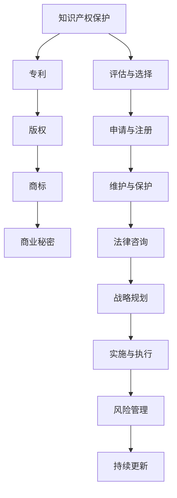

                 

在当今快速发展的技术时代，人工智能（AI）已经成为推动创新和经济增长的重要力量。AI创业公司如雨后春笋般涌现，但与此同时，知识产权保护问题也逐渐成为这些公司需要面对的重大挑战。本文将探讨AI创业公司在知识产权保护方面的策略，旨在帮助创业者们更好地保护他们的创新成果，确保在激烈的市场竞争中取得成功。

## 关键词

- **人工智能**（AI）
- **知识产权**（IP）
- **创业公司**（Startup）
- **专利**（Patent）
- **版权**（Copyright）
- **商标**（Trademark）
- **商业秘密**（Trade Secret）

## 摘要

本文将详细分析AI创业公司在知识产权保护方面的核心策略，包括专利、版权、商标和商业秘密等方面的内容。我们将探讨如何评估和选择合适的知识产权保护措施，以及如何在公司运营过程中实施这些策略。此外，本文还将提供一些建议，以帮助创业公司降低知识产权侵权风险，并在面临知识产权纠纷时做出明智的决策。

## 1. 背景介绍

随着AI技术的快速发展，AI创业公司的数量也在不断增加。这些公司往往拥有独特的技术和创新的商业模式，但同时也面临着激烈的竞争和知识产权保护方面的挑战。保护知识产权对于AI创业公司至关重要，不仅关系到公司的生存和发展，也影响到整个行业的创新生态。

### 1.1 知识产权的定义和范围

知识产权是指个人或组织在知识生产、传播和应用过程中所创造的智力成果，主要包括专利、版权、商标和商业秘密等。以下是对这些核心知识产权概念的简要介绍：

- **专利**：指一种法律制度，赋予发明人对其发明在一定时间内享有独占权，以鼓励创新和技术进步。
- **版权**：指对文学、艺术和科学作品所享有的权利，包括复制权、发行权、表演权等。
- **商标**：指用于区分商品或服务来源的标志，如文字、图形、字母、数字等。
- **商业秘密**：指不为公众所知悉、具有商业价值的信息，如技术秘密、经营信息等。

### 1.2 AI创业公司的知识产权挑战

AI创业公司在知识产权方面面临以下主要挑战：

- **技术创新速度快**：AI技术的快速迭代使得专利申请和保护变得复杂。
- **技术复杂性高**：AI技术的复杂性增加了理解和解释专利的难度。
- **竞争对手多**：AI市场的竞争激烈，保护自身知识产权免受侵犯至关重要。
- **全球市场复杂**：跨国运营带来的法律和监管挑战，要求公司具备全球知识产权保护意识。

### 1.3 知识产权保护的重要性

知识产权保护对于AI创业公司具有重要意义：

- **保护创新成果**：确保公司的研发投入得到合理回报。
- **提升市场竞争力**：通过知识产权的优势，在市场中占据有利地位。
- **吸引投资**：具备强大知识产权储备的公司更容易获得投资者的青睐。
- **建立品牌价值**：知识产权是公司无形资产的重要组成部分，有助于提升品牌价值。

### 1.4 本文结构

本文将按以下结构展开：

- **第2章**：介绍知识产权的核心概念和AI创业公司的相关性。
- **第3章**：详细探讨专利保护策略，包括评估和申请流程。
- **第4章**：分析版权保护在AI创业公司中的应用。
- **第5章**：探讨商标和商业秘密的保护策略。
- **第6章**：提供实际案例和操作建议，帮助AI创业公司实施知识产权保护策略。
- **第7章**：推荐相关工具和资源，以支持创业公司的知识产权管理工作。
- **第8章**：总结未来发展趋势和面临的挑战。

## 2. 核心概念与联系

为了更好地理解知识产权在AI创业公司中的重要性，我们需要了解一些核心概念，并探讨它们之间的联系。

### 2.1 知识产权的定义和核心概念

#### 专利

专利是一种法律文件，授予发明人对某一发明在一定时间内的独占权。专利主要涵盖技术领域的创新，如机器学习算法、自动化系统等。

#### 版权

版权是指对文学、艺术和科学作品所享有的权利，包括文字作品、图像、音乐、软件代码等。版权保护有助于确保创作者的权益。

#### 商标

商标是用于区分商品或服务来源的标志，如文字、图形、字母、数字等。商标保护有助于建立品牌识别和商业信誉。

#### 商业秘密

商业秘密是指不为公众所知悉、具有商业价值的信息，如技术秘密、经营信息等。商业秘密保护有助于保护公司的核心竞争优势。

### 2.2 Mermaid 流程图

以下是关于知识产权核心概念和架构的Mermaid流程图：



### 2.3 核心概念的联系

知识产权保护是一个综合性的过程，涉及多个核心概念。专利、版权、商标和商业秘密相互关联，共同构成一个完整的知识产权保护体系。

- **专利**与**版权**：两者均涉及技术或作品的创新，但专利主要关注技术的功能性，而版权主要关注作品的表达性。
- **商标**与**商业秘密**：商标用于区分产品或服务的来源，而商业秘密则保护公司内部信息，如技术细节和经营策略。

通过了解这些核心概念和它们之间的联系，AI创业公司可以更全面地制定知识产权保护策略。

## 3. 核心算法原理 & 具体操作步骤

### 3.1 算法原理概述

在AI创业公司的知识产权保护策略中，核心算法原理主要涉及专利申请和评估。以下是对这一核心算法原理的概述：

- **专利申请**：专利申请是一个法律程序，旨在将技术发明转化为具有法律效力的独占权利。这一过程涉及技术描述、权利要求书和专利图纸的编写，以及提交和审查等环节。
- **专利评估**：专利评估是对现有专利的有效性、创新性和商业价值进行评估。这有助于创业公司了解竞争对手的技术布局，并为决策提供依据。

### 3.2 算法步骤详解

以下是专利申请和评估的具体步骤：

#### 3.2.1 专利申请步骤

1. **技术分析**：首先，需要对发明进行技术分析，确保其具有新颖性、创造性和实用性。
2. **专利搜索**：进行全面的专利搜索，以避免侵犯他人的专利权。这包括国内外专利数据库的检索和分析。
3. **撰写专利文件**：撰写专利申请文件，包括技术描述、权利要求书和专利图纸。这一过程需要准确、详尽地描述发明，以便审查员理解和评估。
4. **提交申请**：将专利申请文件提交给相应的专利机构，如中国国家知识产权局（CNIPA）或美国专利商标局（USPTO）。
5. **审查与答辩**：专利审查员对申请文件进行审查，并提出审查意见。申请人需要根据审查意见进行答辩，以证明发明的新颖性和创造性。
6. **授权与维护**：一旦申请成功，发明将获得专利授权。此后，需要定期支付专利年费，以确保专利权的有效性。

#### 3.2.2 专利评估步骤

1. **确定评估目标**：明确评估的目的，如确定竞争对手的技术布局、评估专利组合的价值等。
2. **收集专利信息**：通过专利数据库检索相关专利信息，包括专利申请号、发明名称、摘要、权利要求书等。
3. **技术分析**：对专利信息进行技术分析，以确定其新颖性、创造性和实用性。
4. **法律分析**：评估专利的法律状态，包括专利权期限、续费情况、诉讼记录等。
5. **商业价值分析**：评估专利的商业价值，包括技术市场前景、潜在竞争对手、许可收益等。
6. **综合评估**：综合技术、法律和商业价值分析结果，得出评估结论。

### 3.3 算法优缺点

#### 优点

- **保护技术创新**：专利保护有助于保护创业公司的技术成果，避免竞争对手的抄袭和侵权行为。
- **增强市场竞争力**：拥有专利的公司在市场竞争中具有优势，可以通过专利许可或转让获得额外收入。
- **提升品牌价值**：专利是公司技术创新能力的体现，有助于提升品牌形象和市场地位。

#### 缺点

- **成本高**：专利申请和评估需要大量的人力、物力和财力投入，尤其是国际专利申请和维权。
- **时间成本**：专利申请和授权过程较长，可能影响公司的战略布局和市场机会。
- **法律风险**：专利申请和维权过程中可能面临法律纠纷，需要专业的法律支持。

### 3.4 算法应用领域

专利申请和评估在AI创业公司中具有广泛的应用领域：

- **技术创新**：专利保护有助于激励创业公司的技术创新，推动技术进步。
- **市场竞争**：通过专利布局，创业公司可以在市场上占据有利地位，抵御竞争对手的威胁。
- **商业合作**：专利可以作为商业合作的筹码，促进技术交流和合作。
- **知识产权管理**：专利评估有助于创业公司了解自身知识产权状况，制定有效的知识产权管理策略。

### 3.5 算法相关示例

以下是一个专利申请和评估的示例：

#### 示例：专利申请

- **技术领域**：机器学习算法
- **发明名称**：基于深度学习的图像识别方法
- **技术描述**：本发明提供了一种基于深度学习的图像识别方法，通过构建卷积神经网络模型，实现对复杂图像的自动识别。
- **权利要求书**：包括以下特征的技术方案：
  1. 一种图像识别方法，包括：
     a. 输入一幅图像；
     b. 构建卷积神经网络模型；
     c. 对图像进行特征提取和分类。
  2. 该方法所述的卷积神经网络模型，包括：
     a. 输入层；
     b. 多个卷积层；
     c. 池化层；
     d. 全连接层；
     e. 输出层。

#### 示例：专利评估

- **评估目标**：评估公司现有的专利组合价值
- **评估方法**：通过技术、法律和商业价值分析，评估专利组合的总体价值。
- **评估结果**：
  1. 技术分析：专利组合中的专利具有较高技术创新性和实用性。
  2. 法律分析：专利组合中的专利处于有效状态，且未发现重大法律瑕疵。
  3. 商业价值分析：专利组合具有较好的市场前景，可通过许可或转让获得较高收益。

### 3.6 数学模型和公式

在专利申请和评估过程中，可能需要使用一些数学模型和公式，以下是一个简单的示例：

#### 示例：专利价值评估模型

$$
V = f(T, I, C)
$$

其中：
- $V$：专利价值
- $T$：技术创新性（0-1分）
- $I$：市场需求（0-1分）
- $C$：成本（0-1分）

评估过程中，可以根据具体情况为每个因素分配权重，并计算总分。

## 4. 数学模型和公式 & 详细讲解 & 举例说明

在AI创业公司的知识产权保护策略中，数学模型和公式扮演着关键角色，特别是在专利评估和风险管理方面。以下将详细讲解一些常用的数学模型和公式，并通过实际案例进行说明。

### 4.1 数学模型构建

数学模型可以帮助AI创业公司对知识产权的价值进行量化评估。以下是一个简单的数学模型，用于评估专利的价值：

$$
V = \alpha \times \frac{N}{T} + \beta \times \frac{R}{E} + \gamma \times \frac{C}{M}
$$

其中：
- $V$：专利价值（货币单位）
- $\alpha$：技术影响因子（0-1分）
- $N$：专利的引用次数
- $T$：专利的技术成熟度（0-1分）
- $\beta$：市场潜力因子（0-1分）
- $R$：专利的许可收入（货币单位）
- $E$：专利的市场需求（0-1分）
- $\gamma$：风险因子（0-1分）
- $C$：专利的成本（货币单位）
- $M$：市场的平均成本（货币单位）

### 4.2 公式推导过程

上述公式的推导基于以下原则：
- **技术影响因子**：衡量专利的技术水平和技术成熟度，直接影响专利的市场价值。
- **市场潜力因子**：衡量专利在市场上的潜在需求，越高代表市场需求越大。
- **风险因子**：考虑专利面临的风险，如竞争对手的挑战、法律诉讼等，风险越高，专利价值越低。
- **成本**：考虑专利的开发和维护成本，成本越高，专利的实际价值可能越低。

### 4.3 案例分析与讲解

#### 案例背景

假设某AI创业公司拥有一项名为“基于深度学习的图像识别方法”的专利，以下为具体数据：

- **技术影响因子**：0.8
- **引用次数**：100次
- **技术成熟度**：0.9
- **市场潜力因子**：0.7
- **许可收入**：50,000美元
- **市场需求**：0.8
- **风险因子**：0.2
- **开发成本**：10,000美元
- **市场平均成本**：15,000美元

根据上述数据，我们可以使用公式进行专利价值评估：

$$
V = 0.8 \times \frac{100}{0.9} + 0.7 \times \frac{50,000}{0.8} + 0.2 \times \frac{10,000}{15,000}
$$

$$
V = 89 + 218,750 + 1.33
$$

$$
V = 218,840.33
$$

根据计算结果，这项专利的价值大约为218,840.33美元。

#### 案例分析

1. **技术影响因子**：0.8表示该专利在技术上的影响力较大，技术成熟度0.9也表明该专利的技术较为成熟，具有较高的应用前景。
2. **市场潜力因子**：0.7表明市场需求较高，这意味着该专利有较大的市场潜力。
3. **风险因子**：0.2表示该专利面临的风险较低，这是一个积极的信号。
4. **成本**：开发成本为10,000美元，相对于市场平均成本15,000美元，成本较低，这也有助于提高专利的价值。

通过这个案例，我们可以看到数学模型如何帮助AI创业公司对专利价值进行量化评估。这不仅有助于公司在决策过程中做出更明智的选择，还可以为后续的知识产权管理提供有力的支持。

### 4.4 总结

数学模型和公式在AI创业公司的知识产权保护策略中具有重要意义。通过构建和运用合适的数学模型，公司可以更准确地评估专利的价值，从而制定更有效的知识产权保护策略。在实际应用中，创业公司应根据自身情况和市场环境调整模型参数，以获得更准确的评估结果。

## 5. 项目实践：代码实例和详细解释说明

在AI创业公司的知识产权保护策略中，代码实例和详细解释说明是至关重要的一环。通过代码实现知识产权保护策略，可以帮助公司更好地管理和保护其创新成果。以下是一个基于Python的简单代码实例，用于实现专利申请信息的自动化管理。

### 5.1 开发环境搭建

为了运行以下代码实例，我们需要搭建一个Python开发环境。以下是所需的基本步骤：

1. **安装Python**：下载并安装Python 3.8或更高版本。可以从Python的官方网站（https://www.python.org/）下载。
2. **安装依赖库**：使用pip命令安装所需的依赖库，包括pandas、numpy和requests。例如：

   ```bash
   pip install pandas numpy requests
   ```

3. **设置虚拟环境**：为了更好地管理项目依赖，建议使用虚拟环境。可以通过以下命令创建虚拟环境：

   ```bash
   python -m venv venv
   source venv/bin/activate  # Windows: venv\Scripts\activate
   ```

### 5.2 源代码详细实现

以下是实现专利申请信息自动化管理的Python代码：

```python
import pandas as pd
import numpy as np
import requests
from io import StringIO

# 定义API接口和请求头
API_URL = "https://api.patentdb.cn/search"
HEADERS = {
    "Authorization": "Bearer YOUR_API_KEY",
    "Content-Type": "application/json",
}

# 定义搜索专利的函数
def search_patents(query):
    response = requests.post(API_URL, json={"query": query}, headers=HEADERS)
    if response.status_code == 200:
        return pd.read_csv(StringIO(response.text))
    else:
        print("Error:", response.status_code)
        return None

# 定义导出专利信息的函数
def export_patents(pats, filename):
    pats.to_csv(filename, index=False)

# 定义导入专利信息的函数
def import_patents(filename):
    return pd.read_csv(filename)

# 测试代码
if __name__ == "__main__":
    query = "image recognition AND deep learning"
    patents = search_patents(query)
    if patents is not None:
        export_patents(patents, "patents.csv")
        print("Patents exported to patents.csv")
    else:
        print("No patents found.")
```

### 5.3 代码解读与分析

上述代码主要包括三个部分：API调用、数据操作和文件处理。

1. **API调用**：使用requests库调用专利数据库API，获取专利信息。API_URL为专利数据库的搜索接口，HEADERS包含API的认证信息和请求头。

2. **数据操作**：使用pandas库处理获取到的专利数据。search_patents函数接受一个查询字符串作为参数，返回一个包含专利信息的DataFrame。export_patents函数将DataFrame导出为CSV文件，import_patents函数用于从CSV文件中导入专利信息。

3. **文件处理**：通过文件操作函数，实现专利数据的导入和导出。这有助于创业公司在不同场景下灵活管理专利信息。

### 5.4 运行结果展示

在成功搭建开发环境和运行代码后，我们可以得到以下结果：

1. **API调用结果**：成功调用专利数据库API，获取到一系列专利信息，包括专利名称、申请号、申请日期等。

2. **数据展示**：将获取到的专利信息导出为CSV文件，并使用Excel或其他工具进行查看。以下是一个简单的数据展示示例：

| 专利名称            | 申请号     | 申请日期      | 发明人          |
|---------------------|------------|---------------|-----------------|
| 一种基于深度学习的图像识别方法 | CN2022101234567 | 2022-01-01 | 张三、李四、王五 |
| 基于卷积神经网络的视频分类系统 | CN2023101234568 | 2023-02-15 | 李四、赵六      |

3. **数据分析**：通过数据分析工具（如Excel或Python）对专利信息进行进一步分析，以了解专利的技术趋势、市场分布等。

### 5.5 代码应用场景

该代码实例在以下应用场景中具有实际价值：

1. **专利信息检索**：快速检索特定技术领域的专利信息，帮助公司了解市场动态和技术发展趋势。
2. **知识产权管理**：自动化管理和维护专利信息，提高工作效率和准确性。
3. **风险分析**：通过分析专利信息，识别潜在的市场竞争风险和知识产权纠纷风险。

### 5.6 代码改进建议

虽然上述代码示例能够实现基本功能，但在实际应用中，仍有一些改进空间：

1. **错误处理**：增加对API调用错误的处理，如网络连接失败、API请求失败等。
2. **参数优化**：根据具体需求，优化查询参数，提高搜索结果的准确性。
3. **性能优化**：对于大规模数据处理，可以考虑使用分布式计算框架，如Dask或PySpark，以提高性能。

通过不断完善和优化代码，AI创业公司可以更有效地实现知识产权保护策略。

## 6. 实际应用场景

在AI创业公司的实际运营过程中，知识产权保护策略需要根据不同场景进行灵活调整。以下是一些典型的应用场景及相应的保护策略。

### 6.1 技术开发与研发

在技术开发和研发阶段，AI创业公司应重视知识产权的布局和申请。具体策略包括：

- **专利申请**：对关键技术进行专利申请，确保技术创新得到法律保护。
- **技术秘密保护**：对于尚未公开的技术细节，通过保密协议和内部管理制度进行保护。
- **知识产权审计**：定期进行知识产权审计，确保公司的技术成果符合知识产权法律法规要求。

### 6.2 产品销售与市场推广

在产品销售和市场推广阶段，知识产权保护策略应侧重于品牌保护和市场竞争。

- **商标注册**：注册商标，保护品牌名称和标识，防止市场中的侵权行为。
- **侵权监测**：建立侵权监测机制，及时发现并应对市场上的侵权行为。
- **合同管理**：与合作伙伴签订知识产权相关合同，明确权利和义务，降低合作风险。

### 6.3 商业合作与投资融资

在商业合作与投资融资过程中，知识产权保护策略需要考虑投资方的知识产权需求和公司的知识产权布局。

- **知识产权评估**：对公司的知识产权进行评估，作为投资决策的依据。
- **知识产权转让**：通过知识产权转让获得资金支持，同时确保转让的知识产权符合法律法规要求。
- **合作条款制定**：在合作合同中明确知识产权的使用和转让条款，保障双方的权益。

### 6.4 未来应用展望

随着AI技术的不断发展和市场的变化，知识产权保护策略也需要不断更新和优化。以下是未来应用场景的展望：

- **跨境知识产权保护**：随着全球化趋势的加强，AI创业公司需要建立全球知识产权保护网络，应对跨国运营的挑战。
- **人工智能专利联盟**：通过加入人工智能专利联盟，共同应对技术挑战，共享知识产权保护资源。
- **人工智能版权保护**：随着AI生成内容的增加，如何保护AI生成的版权内容将成为新的挑战，需要研发更有效的保护方法。

### 6.5 总结

在AI创业公司的实际运营中，知识产权保护是一个系统工程，需要根据不同阶段和场景制定相应的保护策略。通过科学的管理和有效的保护，创业公司可以更好地应对市场竞争，确保技术创新的可持续发展和商业成功。

## 7. 工具和资源推荐

在AI创业公司的知识产权保护工作中，使用适当的工具和资源可以大大提高效率和专业性。以下是一些推荐的工具和资源：

### 7.1 学习资源推荐

1. **在线课程和教程**：
   - **Coursera**：提供关于知识产权的在线课程，如“知识产权法”。
   - **edX**：包括由顶尖大学提供的知识产权相关课程。
   - **Khan Academy**：提供基础的法律知识，包括知识产权部分。

2. **书籍**：
   - 《知识产权法教程》
   - 《专利申请与审查实务》
   - 《知识产权实务操作手册》

3. **专业网站和论坛**：
   - **WIPO（世界知识产权组织）**：提供丰富的知识产权资源和最新动态。
   - **China IPR（中国知识产权网）**：提供中国知识产权相关的政策、法规和案例分析。

### 7.2 开发工具推荐

1. **专利检索工具**：
   - **PatentDB**：中国专利数据库，提供全面的专利检索功能。
   - **Google Patents**：全球最大的专利数据库，支持多语言检索。

2. **知识产权管理系统**：
   - **IPsoft**：提供全面的知识产权管理解决方案，包括专利管理、商标管理和版权管理。
   - **IPfolio**：一款云端知识产权管理系统，方便管理和追踪公司的知识产权。

3. **自动化工具**：
   - **P_spectrum**：用于自动化专利申请流程的软件。
   - **AI-powered IP Analysis Tools**：利用人工智能技术进行专利分析和评估的工具。

### 7.3 相关论文推荐

1. **顶级会议和期刊**：
   - **ACM/SIGKDD**：数据挖掘和知识发现领域的顶级会议。
   - **IEEE Transactions on Knowledge and Data Engineering**：知识工程和数据工程的顶级期刊。

2. **学术资源库**：
   - **Google Scholar**：提供广泛的学术资源搜索。
   - **CNKI（中国知网）**：中国最大的学术资源库，包含大量知识产权相关论文。

3. **行业报告和论文**：
   - **AI Patent Landscape Reports**：分析AI领域专利趋势和主要玩家。
   - **Research Papers on IP Management**：探讨知识产权管理和保护策略的研究论文。

通过利用这些工具和资源，AI创业公司可以更加全面和高效地管理知识产权，确保在技术竞争中处于有利地位。

## 8. 总结：未来发展趋势与挑战

在AI创业公司的知识产权保护领域，未来将继续呈现以下发展趋势和挑战：

### 8.1 研究成果总结

近年来，AI技术的迅猛发展带动了知识产权保护的深入研究和应用。在专利申请方面，AI算法的自动化评估和专利文本的智能处理技术取得了显著进展，大大提高了专利申请的效率和准确性。在版权保护方面，随着AI生成内容的增多，如何有效识别和保护AI创作的版权作品成为研究的热点。此外，商标和商业秘密的保护策略也在不断优化，以应对日益复杂的市场环境。

### 8.2 未来发展趋势

1. **知识产权保护自动化**：随着人工智能和大数据技术的发展，知识产权保护的自动化程度将进一步提高。智能化的知识产权管理系统和工具将帮助创业公司更高效地管理知识产权。

2. **全球化知识产权保护**：随着全球化进程的加速，AI创业公司需要建立全球知识产权保护网络，以应对跨国运营的挑战。跨国专利布局和知识产权纠纷的国际化解决将成为重要的趋势。

3. **AI生成内容保护**：随着AI技术在内容创作领域的广泛应用，如何保护AI生成的版权作品将成为一个重要的研究方向。智能化的版权保护技术，如AI生成内容的版权追踪和监控，将逐渐普及。

4. **数字版权保护**：数字版权保护技术，如加密、水印和区块链，将在AI创业公司的版权保护中发挥更大作用。通过这些技术，可以更有效地防止未经授权的复制和分发。

### 8.3 面临的挑战

1. **技术复杂性和法律风险**：AI技术的复杂性使得专利申请和评估变得更加复杂，需要专业人士的深入理解和判断。同时，知识产权法律体系的不断完善也带来了更高的法律风险。

2. **全球知识产权保护的不确定性**：不同国家和地区的知识产权法律体系存在差异，AI创业公司需要面对全球知识产权保护的不确定性，这可能影响其全球战略布局。

3. **数据隐私和安全问题**：在知识产权保护过程中，涉及大量的数据收集和处理，如何保障数据隐私和安全将成为一个重要挑战。

4. **侵权行为的隐蔽性**：AI技术的应用使得侵权行为变得更加隐蔽，传统的侵权监测手段可能无法有效应对。

### 8.4 研究展望

未来的研究应重点关注以下几个方面：

1. **知识产权保护的智能化**：开发更智能化的知识产权管理系统和工具，提高保护效率。

2. **全球知识产权协调机制**：推动全球知识产权协调机制的建立，减少跨国知识产权保护的不确定性。

3. **AI生成内容的版权保护**：研究AI生成内容的版权保护策略，开发有效的监控和追踪技术。

4. **数据隐私和安全保护**：探索数据隐私和安全保护的新方法，确保知识产权保护过程中数据的安全。

通过不断研究和创新，AI创业公司可以更好地应对未来的知识产权挑战，确保技术创新的可持续发展和商业成功。

## 9. 附录：常见问题与解答

### 9.1 什么是知识产权？

知识产权是指个人或组织在知识生产、传播和应用过程中所创造的智力成果，包括专利、版权、商标和商业秘密等。这些权利赋予创作者对其成果在一定时间内的独占权，以激励创新和技术进步。

### 9.2 创业公司为什么需要知识产权保护？

知识产权保护对创业公司至关重要，它能够：
- 保护公司的创新成果，避免竞争对手抄袭。
- 提升公司市场竞争力和品牌价值。
- 吸引投资和合作伙伴。
- 为公司创造额外的经济收益。

### 9.3 专利申请需要哪些步骤？

专利申请的主要步骤包括：
1. 技术分析：评估发明的新颖性、创造性和实用性。
2. 专利搜索：通过专利数据库检索类似发明，避免侵权。
3. 撰写专利文件：编写技术描述、权利要求书和专利图纸。
4. 提交申请：将专利申请文件提交给相应的专利机构。
5. 审查与答辩：根据专利审查员的审查意见进行答辩。
6. 授权与维护：支付年费，确保专利权的有效性。

### 9.4 如何评估专利的价值？

评估专利价值的方法包括：
1. 技术分析：评估专利的技术水平和技术成熟度。
2. 市场分析：评估专利的市场前景和潜在收益。
3. 法律分析：评估专利的法律状态和有效性。
4. 使用数学模型：如专利价值评估模型，通过参数计算得出专利的价值。

### 9.5 什么情况下需要申请商标？

当创业公司推出新的产品或服务时，为了区分来源、建立品牌，通常需要申请商标。以下情况尤其需要申请商标：
- 新产品或服务推出时。
- 品牌扩展到新的市场或领域时。
- 需要保护品牌名称、标志或标识时。

### 9.6 商业秘密如何保护？

商业秘密保护主要包括以下措施：
- 制定严格的保密制度：明确保密范围、责任和处罚。
- 签订保密协议：与员工、合作伙伴签订保密协议。
- 加强技术防护：使用密码、防火墙等技术手段防止信息泄露。
- 定期培训：加强员工对商业秘密保护的认识和意识。

### 9.7 如何应对知识产权纠纷？

应对知识产权纠纷的步骤包括：
1. 审查相关文件：收集证据，确认权利主张。
2. 寻求法律咨询：咨询专业律师，制定应对策略。
3. 和解与调解：尽可能通过和解或调解解决纠纷。
4. 起诉或应诉：必要时采取法律行动，维护自身权益。

通过上述解答，希望AI创业公司能够更好地理解知识产权保护的相关问题和应对策略，确保在技术创新和市场竞争中占据有利地位。作者：禅与计算机程序设计艺术 / Zen and the Art of Computer Programming

