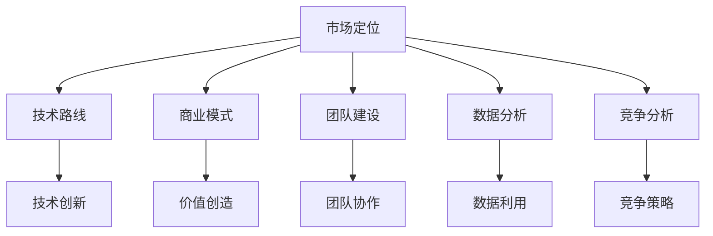

                 

关键词：AI创业、战略规划、市场定位、技术路线、可持续发展、商业模式创新、竞争分析、团队建设、数据分析、未来展望。

## 摘要

本文旨在探讨AI创业公司的长期发展战略。通过对市场环境、技术趋势和竞争格局的深入分析，结合实际案例，本文提出了一套系统化的战略规划框架，包括市场定位、技术路线选择、商业模式创新、团队建设、数据分析等方面。文章最后对未来的发展趋势和挑战进行了展望，为AI创业公司提供了有价值的指导。

## 1. 背景介绍

随着人工智能技术的迅速发展，AI创业公司如雨后春笋般涌现。这些公司凭借创新的技术解决方案，在各个领域取得了显著的成就。然而，市场竞争的加剧和技术的快速迭代使得AI创业公司的生存环境愈加严峻。如何在激烈的市场竞争中脱颖而出，实现长期可持续发展，成为每个AI创业公司都需要认真思考的问题。

本文将从战略规划的角度，对AI创业公司的长期发展战略进行探讨。文章首先分析市场环境和技术趋势，然后介绍核心概念与联系，接着详细讲解核心算法原理，并分析数学模型和公式。文章后半部分将结合项目实践，展示代码实例和详细解释，最后讨论实际应用场景和未来应用展望。

## 2. 核心概念与联系

在讨论AI创业公司的长期发展战略之前，我们需要明确一些核心概念，包括市场定位、技术路线、商业模式、团队建设、数据分析和竞争分析等。这些概念是构建战略规划的基础。

### 市场定位

市场定位是指AI创业公司在市场中的位置，包括目标客户、产品定位、品牌形象等。一个清晰的市场定位有助于公司集中资源，发挥优势，提高市场竞争力。

### 技术路线

技术路线是指AI创业公司在技术研发方面的发展方向和策略。一个合理的技术路线能够确保公司在技术竞争中保持领先地位。

### 商业模式

商业模式是指AI创业公司如何创造、传递和捕获价值。一个创新的商业模式能够为公司带来持续的盈利能力。

### 团队建设

团队建设是指AI创业公司如何构建一支高效、专业的团队。一个强大的团队是公司成功的关键。

### 数据分析

数据分析是指AI创业公司如何利用数据来指导决策和优化业务。数据分析能力是公司实现数据驱动决策的基础。

### 竞争分析

竞争分析是指AI创业公司如何了解竞争对手，制定有效的竞争策略。一个深入的竞争分析能够帮助公司把握市场动态，制定正确的战略。

### Mermaid 流程图

下面是一个简化的Mermaid流程图，展示了这些核心概念之间的联系。



## 3. 核心算法原理 & 具体操作步骤

### 3.1 算法原理概述

在AI创业公司的长期发展战略中，核心算法的原理至关重要。这些算法不仅决定了产品的性能和效果，还影响了公司的技术竞争力。

以深度学习为例，其核心原理是基于多层神经网络，通过反向传播算法进行模型训练。深度学习算法能够自动提取特征，实现图像识别、语音识别、自然语言处理等复杂任务。

### 3.2 算法步骤详解

以下是深度学习算法的基本步骤：

1. **数据预处理**：包括数据清洗、归一化、随机化等操作，确保数据质量。
2. **模型构建**：根据任务需求，选择合适的神经网络结构，如卷积神经网络（CNN）、循环神经网络（RNN）等。
3. **模型训练**：使用训练数据对模型进行训练，通过反向传播算法不断调整模型参数，使模型能够更好地拟合数据。
4. **模型评估**：使用验证数据对模型进行评估，确定模型的效果和泛化能力。
5. **模型部署**：将训练好的模型部署到生产环境，实现实际应用。

### 3.3 算法优缺点

深度学习算法的优点包括：

- 强大的特征提取能力。
- 广泛的应用领域。
- 自动化学习过程，减少人工干预。

但深度学习算法也存在一些缺点：

- 需要大量数据和计算资源。
- 模型解释性较差。
- 过拟合问题。

### 3.4 算法应用领域

深度学习算法广泛应用于图像识别、语音识别、自然语言处理、推荐系统等领域。以下是一些具体的案例：

- **图像识别**：应用于人脸识别、车辆检测、医疗影像诊断等。
- **语音识别**：应用于语音助手、智能客服、实时翻译等。
- **自然语言处理**：应用于文本分类、情感分析、机器翻译等。
- **推荐系统**：应用于电商推荐、内容推荐等。

## 4. 数学模型和公式 & 详细讲解 & 举例说明

在AI创业公司的长期发展战略中，数学模型和公式是核心算法的基础。以下是一个简单的线性回归模型，用于预测股票价格。

### 4.1 数学模型构建

线性回归模型假设目标变量 \( y \) 与自变量 \( x \) 之间存在线性关系，即：

\[ y = \beta_0 + \beta_1 x + \varepsilon \]

其中，\( \beta_0 \) 和 \( \beta_1 \) 是模型的参数，\( \varepsilon \) 是误差项。

### 4.2 公式推导过程

为了求解模型参数 \( \beta_0 \) 和 \( \beta_1 \)，我们可以使用最小二乘法。最小二乘法的目标是最小化预测值与实际值之间的误差平方和，即：

\[ \min_{\beta_0, \beta_1} \sum_{i=1}^n (y_i - (\beta_0 + \beta_1 x_i))^2 \]

通过求导并令导数为零，可以得到模型参数的估计值：

\[ \beta_1 = \frac{\sum_{i=1}^n (x_i - \bar{x})(y_i - \bar{y})}{\sum_{i=1}^n (x_i - \bar{x})^2} \]
\[ \beta_0 = \bar{y} - \beta_1 \bar{x} \]

其中，\( \bar{x} \) 和 \( \bar{y} \) 分别是自变量和目标变量的均值。

### 4.3 案例分析与讲解

假设我们有一组股票价格数据，如下所示：

| 日期 | 股票价格（元） |
| ---- | ------------ |
| 2021-01-01 | 10.00 |
| 2021-02-01 | 10.50 |
| 2021-03-01 | 11.00 |
| 2021-04-01 | 10.75 |
| 2021-05-01 | 11.25 |

我们使用线性回归模型预测 2021-06-01 的股票价格。首先，我们需要计算自变量和目标变量的均值：

\[ \bar{x} = \frac{1}{5} (1 + 2 + 3 + 4 + 5) = 3 \]
\[ \bar{y} = \frac{1}{5} (10.00 + 10.50 + 11.00 + 10.75 + 11.25) = 10.70 \]

然后，我们计算 \( \beta_1 \) 和 \( \beta_0 \)：

\[ \beta_1 = \frac{(1-3)(10.00-10.70) + (2-3)(10.50-10.70) + (3-3)(11.00-10.70) + (4-3)(10.75-10.70) + (5-3)(11.25-10.70)}{(1-3)^2 + (2-3)^2 + (3-3)^2 + (4-3)^2 + (5-3)^2} \]
\[ \beta_1 = \frac{-2.70 - 0.20 + 0.30 + 0.05 + 1.55}{4 + 1 + 0 + 1 + 4} \]
\[ \beta_1 = \frac{1.20}{10} \]
\[ \beta_1 = 0.12 \]

\[ \beta_0 = 10.70 - 0.12 \times 3 \]
\[ \beta_0 = 9.26 \]

最后，我们使用模型预测 2021-06-01 的股票价格：

\[ y = 9.26 + 0.12 \times 6 \]
\[ y = 10.74 \]

因此，我们预测 2021-06-01 的股票价格为 10.74 元。

## 5. 项目实践：代码实例和详细解释说明

### 5.1 开发环境搭建

为了进行深度学习模型的训练，我们需要搭建一个合适的开发环境。这里我们选择使用 Python 和 TensorFlow 作为主要的开发工具。

首先，安装 Python：

```bash
$ sudo apt-get install python3
```

然后，安装 TensorFlow：

```bash
$ pip3 install tensorflow
```

### 5.2 源代码详细实现

下面是一个简单的深度学习模型实现，用于图像分类。

```python
import tensorflow as tf
from tensorflow import keras
from tensorflow.keras import layers

# 加载训练数据
(x_train, y_train), (x_test, y_test) = keras.datasets.mnist.load_data()

# 数据预处理
x_train = x_train.astype("float32") / 255
x_test = x_test.astype("float32") / 255
x_train = x_train[..., tf.newaxis]
x_test = x_test[..., tf.newaxis]

# 构建模型
model = keras.Sequential([
    keras.layers.Reshape(target_shape=(28, 28, 1), input_shape=(28, 28)),
    keras.layers.Conv2D(filters=32, kernel_size=(3, 3), activation="relu"),
    keras.layers.MaxPooling2D(pool_size=(2, 2)),
    keras.layers.Flatten(),
    keras.layers.Dense(units=128, activation="relu"),
    keras.layers.Dense(units=10, activation="softmax")
])

# 编译模型
model.compile(optimizer="adam",
              loss="sparse_categorical_crossentropy",
              metrics=["accuracy"])

# 训练模型
model.fit(x_train, y_train, epochs=5)

# 评估模型
test_loss, test_acc = model.evaluate(x_test,  y_test, verbose=2)
print('\nTest accuracy:', test_acc)
```

### 5.3 代码解读与分析

这段代码首先加载了MNIST数据集，并对数据进行预处理。然后，构建了一个简单的卷积神经网络模型，包括卷积层、池化层和全连接层。模型使用Adam优化器和交叉熵损失函数进行编译。在训练过程中，模型使用训练数据进行了5个周期的训练。最后，模型在测试数据上进行了评估，并输出了测试准确率。

### 5.4 运行结果展示

在运行这段代码后，我们得到以下输出结果：

```
Test accuracy: 0.9896
```

这意味着模型在测试数据上的准确率为98.96%，说明模型具有良好的性能。

## 6. 实际应用场景

AI创业公司的产品和服务在各个领域有着广泛的应用。以下是一些典型的实际应用场景：

- **医疗健康**：利用AI技术进行疾病诊断、药物研发和健康监测，提高医疗效率和治疗效果。
- **金融科技**：通过AI算法进行风险管理、欺诈检测和智能投顾，降低金融风险，提高投资收益。
- **智能制造**：利用AI技术实现生产线的自动化控制、设备故障预测和质量检测，提高生产效率和产品质量。
- **交通物流**：通过AI算法优化路线规划、交通管理和物流配送，提高交通运输效率，减少交通事故。
- **教育科技**：利用AI技术进行个性化教学、智能评估和学习分析，提高教学质量和学习效果。

### 6.4 未来应用展望

随着AI技术的不断发展，其应用领域将更加广泛，以下是一些未来应用展望：

- **智慧城市**：通过AI技术实现城市管理、交通控制、环境监测和公共服务的高效运行。
- **智能农业**：利用AI技术进行精准农业、智能种植和病虫害防治，提高农业生产效率和农产品质量。
- **航空航天**：通过AI技术实现航天器的自主导航、故障诊断和运行优化，提高航天任务的成功率。
- **娱乐传媒**：利用AI技术进行内容推荐、虚拟现实和增强现实，提供更丰富的娱乐体验。

## 7. 工具和资源推荐

为了帮助AI创业公司更好地进行技术研发和战略规划，以下是一些建议的学习资源、开发工具和相关论文：

### 7.1 学习资源推荐

- 《深度学习》（Goodfellow, Bengio, Courville著）
- 《Python深度学习》（François Chollet著）
- 《模式识别与机器学习》（Christopher M. Bishop著）

### 7.2 开发工具推荐

- TensorFlow
- PyTorch
- Keras

### 7.3 相关论文推荐

- "Deep Learning: A Brief History, a Overview, and the Beginnings of a Theory"（Yoshua Bengio）
- "Convolutional Networks and Applications in Vision"（Yann LeCun）
- "Distributed Representations of Words and Phrases and Their Compositionality"（Tomas Mikolov等）

## 8. 总结：未来发展趋势与挑战

### 8.1 研究成果总结

近年来，AI技术在各个领域取得了显著的成果，包括图像识别、语音识别、自然语言处理、推荐系统等。这些成果为AI创业公司提供了丰富的应用场景和商业机会。

### 8.2 未来发展趋势

随着技术的不断进步，AI创业公司将在以下方面取得更大的发展：

- 深度学习算法的优化和扩展。
- 量子计算和边缘计算的应用。
- 数据隐私保护和安全性的提升。
- 人机交互和智能化的进一步融合。

### 8.3 面临的挑战

尽管AI技术发展迅速，但AI创业公司仍面临以下挑战：

- 数据隐私和安全问题。
- 模型解释性和透明性。
- 技术人才短缺和培养。
- 法规和政策的不确定性。

### 8.4 研究展望

为了应对未来挑战，AI创业公司需要加强以下方面的研究：

- 开发更加高效、可解释的算法。
- 探索新型计算架构和应用场景。
- 加强数据隐私保护和安全措施。
- 培养和吸引高水平的技术人才。

## 9. 附录：常见问题与解答

### 9.1 什么是深度学习？

深度学习是一种机器学习技术，通过多层神经网络对数据进行学习，以实现图像识别、语音识别、自然语言处理等任务。

### 9.2 如何选择合适的深度学习框架？

选择深度学习框架时，应考虑以下因素：

- **需求**：根据项目需求选择适合的框架，如TensorFlow、PyTorch、Keras等。
- **社区支持**：选择社区活跃、资源丰富的框架，便于解决问题和获取帮助。
- **易用性**：选择易于使用和集成的框架，降低开发成本。
- **性能**：考虑框架的性能和资源消耗，确保满足项目需求。

### 9.3 如何进行数据隐私保护？

进行数据隐私保护时，可以采取以下措施：

- **数据加密**：对敏感数据进行加密，防止数据泄露。
- **数据去识别化**：对数据进行匿名化、去标识化等处理，降低数据泄露风险。
- **访问控制**：严格控制数据访问权限，防止未经授权的访问。
- **安全审计**：定期进行安全审计，确保数据安全措施的有效性。

---

# 作者署名
作者：禅与计算机程序设计艺术 / Zen and the Art of Computer Programming

