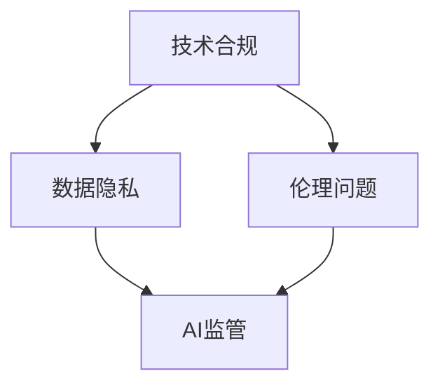

                 

关键词：AI创业、政策环境、合规策略、Lepton AI、技术合规、数据隐私、伦理问题、AI监管

> 摘要：随着人工智能技术的飞速发展，AI创业企业面临着日益复杂的政策环境和合规挑战。本文以Lepton AI为例，探讨了AI创业企业在政策环境中的合规策略，包括技术合规、数据隐私、伦理问题以及AI监管等方面的具体实践，为其他AI创业企业提供了宝贵的参考和借鉴。

## 1. 背景介绍

近年来，人工智能（AI）技术在各个领域的应用不断深入，从自动驾驶、智能医疗到金融科技、智能客服，AI已经成为推动产业变革的重要力量。然而，AI技术的快速发展也引发了诸多政策环境和社会问题，例如数据隐私、算法偏见、伦理问题等。在这种情况下，AI创业企业需要充分考虑政策环境，制定有效的合规策略，确保自身的发展符合法律法规和伦理道德标准。

Lepton AI是一家专注于计算机视觉和机器学习技术的AI创业公司，致力于开发智能监控和安防解决方案。在AI创业浪潮中，Lepton AI面临着巨大的政策环境和合规挑战。本文将通过对Lepton AI合规策略的探讨，为其他AI创业企业提供有益的借鉴和参考。

## 2. 核心概念与联系

在探讨Lepton AI的合规策略之前，我们需要了解几个核心概念：

- **技术合规**：指AI创业企业在开发、部署和应用过程中，确保技术方案符合相关法律法规和行业规范。
- **数据隐私**：指AI创业企业在收集、存储和使用数据时，确保个人隐私不被侵犯。
- **伦理问题**：指AI创业企业在研发、应用过程中，需要考虑的道德伦理问题，如算法偏见、责任归属等。
- **AI监管**：指政府、行业组织和企业在AI领域的监管措施和标准制定。

为了更好地理解这些概念，我们可以通过一个Mermaid流程图来展示它们之间的联系：



在这个流程图中，技术合规是AI创业企业的核心，它直接影响到数据隐私和伦理问题。同时，这两个方面又受到AI监管的约束，确保AI技术在合规、透明和可解释的框架下发展。

## 3. 核心算法原理 & 具体操作步骤

### 3.1 算法原理概述

Lepton AI的核心算法是基于深度学习的计算机视觉技术。深度学习是一种通过多层神经网络对数据进行自动特征提取和分类的机器学习技术。在计算机视觉领域，深度学习算法可以识别图像中的物体、人脸、场景等信息，具有高度的自适应性和准确性。

### 3.2 算法步骤详解

Lepton AI的算法步骤可以分为以下几个阶段：

1. **数据收集与预处理**：收集大量的监控视频和图片数据，并对数据进行预处理，如去噪、缩放、翻转等。
2. **特征提取**：利用卷积神经网络（CNN）对预处理后的数据进行特征提取，提取出图像中的关键信息。
3. **模型训练**：将提取出的特征输入到深度学习模型中进行训练，通过反向传播算法优化模型参数。
4. **模型评估与调整**：对训练好的模型进行评估，通过交叉验证等方法评估模型的准确性和泛化能力，并根据评估结果调整模型参数。
5. **模型部署与优化**：将训练好的模型部署到实际应用场景中，如智能监控设备，并对模型进行实时优化，以适应不断变化的应用环境。

### 3.3 算法优缺点

Lepton AI的深度学习算法具有以下优点：

- **高准确性**：通过多层神经网络，深度学习算法能够自动提取图像中的关键特征，具有较高的分类准确率。
- **自适应性**：深度学习算法具有较强的自适应性，能够根据不同场景和数据集进行训练和优化。
- **可解释性**：通过模型的可视化技术，可以直观地了解模型的工作原理和决策过程，提高模型的透明性和可解释性。

然而，深度学习算法也存在一些缺点：

- **数据需求量大**：深度学习算法需要大量的数据集进行训练，对数据的收集和处理提出了较高的要求。
- **计算资源消耗大**：深度学习算法的计算复杂度较高，需要大量的计算资源和时间进行训练和推理。
- **可解释性不足**：尽管可以通过可视化技术提高模型的透明性，但深度学习算法的内部决策过程仍然较为复杂，难以完全解释。

### 3.4 算法应用领域

Lepton AI的深度学习算法主要应用于智能监控和安防领域，包括但不限于以下场景：

- **人脸识别**：利用深度学习算法进行人脸检测和识别，实现智能安防和人员管理。
- **车辆识别**：通过车辆特征提取和分类，实现交通管理和监控。
- **行为分析**：利用深度学习算法对监控视频进行实时分析，识别异常行为和事件。

## 4. 数学模型和公式 & 详细讲解 & 举例说明

### 4.1 数学模型构建

在Lepton AI的深度学习算法中，我们主要使用卷积神经网络（CNN）作为数学模型。CNN由多个卷积层、池化层和全连接层组成，通过多层特征提取和融合，实现图像分类和识别。

### 4.2 公式推导过程

以下是一个简化的卷积神经网络的公式推导过程：

1. **卷积层**：假设输入图像为 $X \in \mathbb{R}^{H \times W \times C}$，卷积核为 $K \in \mathbb{R}^{K_H \times K_W \times C}$，输出特征图为 $F \in \mathbb{R}^{H' \times W' \times C'}$。卷积操作的公式为：

   $$F_{ijl} = \sum_{p=0}^{K_H-1} \sum_{q=0}^{K_W-1} X_{(i+p) \times (j+q) \times l} K_{pq \times l} + b_l$$

   其中，$b_l$ 为卷积层偏置。

2. **池化层**：假设输入特征图为 $F \in \mathbb{R}^{H \times W \times C}$，输出特征图为 $G \in \mathbb{R}^{H' \times W' \times C}$。池化操作的公式为：

   $$G_{ijl} = \max\{F_{i:i+2F, j:j+2F, l}\}$$

   其中，$F_{i:i+2F, j:j+2F, l}$ 表示以 $(i, j)$ 为中心，大小为 $2F \times 2F$ 的局部区域。

3. **全连接层**：假设输入特征图为 $F \in \mathbb{R}^{H \times W \times C}$，输出为 $O \in \mathbb{R}^{H' \times W' \times C'}$。全连接层的公式为：

   $$O_{ijl} = \sum_{p=0}^{H-1} \sum_{q=0}^{W-1} F_{pj \times q \times l} W_{ij \times p \times q} + b_l$$

   其中，$W_{ij \times p \times q}$ 和 $b_l$ 分别为全连接层的权重和偏置。

### 4.3 案例分析与讲解

以下是一个简单的例子，说明如何使用卷积神经网络进行图像分类：

假设我们有一个 $32 \times 32$ 的图像，我们需要将其分类为猫或狗。首先，我们将图像输入到一个卷积层，使用一个 $3 \times 3$ 的卷积核进行特征提取。然后，我们将特征图输入到一个池化层，使用最大池化操作进行特征降维。接下来，我们将池化层输出的特征图输入到一个全连接层，使用一个 $10$ 维的权重矩阵和偏置进行分类。

具体实现过程如下：

1. **初始化权重和偏置**：

   ```python
   W_conv1 = np.random.randn(3, 3, 3, 64)
   b_conv1 = np.random.randn(64)
   ```

2. **进行卷积操作**：

   ```python
   X = np.random.randn(32, 32, 3)
   F1 = np.zeros((32, 32, 64))
   for l in range(64):
       F1[:, :, l] = conv2d(X, W_conv1[l], b_conv1[l])
   ```

3. **进行池化操作**：

   ```python
   G1 = np.zeros((16, 16, 64))
   for l in range(64):
       G1[:, :, l] = max_pool2d(F1[:, :, l])
   ```

4. **进行全连接层操作**：

   ```python
   W_fc1 = np.random.randn(16 * 16 * 64, 10)
   b_fc1 = np.random.randn(10)
   O = np.zeros((10, 1))
   for l in range(10):
       O[l] = np.dot(G1.flatten(), W_fc1[l]) + b_fc1[l]
   ```

最终，我们将输出 $O$ 进行 Softmax 操作，得到每个类别的概率分布，从而实现图像分类。

## 5. 项目实践：代码实例和详细解释说明

### 5.1 开发环境搭建

在Lepton AI的项目实践中，我们使用Python作为主要编程语言，结合TensorFlow框架进行深度学习模型的开发和训练。以下是搭建开发环境的基本步骤：

1. **安装Python**：下载并安装Python 3.x版本，建议使用Anaconda发行版，以便管理不同版本的库和依赖。
2. **安装TensorFlow**：在终端执行以下命令安装TensorFlow：

   ```bash
   pip install tensorflow
   ```

3. **安装其他依赖**：根据项目需求安装其他依赖库，如NumPy、Matplotlib等。

### 5.2 源代码详细实现

以下是一个简单的Lepton AI项目示例代码，展示了如何使用TensorFlow搭建一个基本的卷积神经网络模型。

```python
import tensorflow as tf
from tensorflow.keras import datasets, layers, models

# 加载和预处理数据
(train_images, train_labels), (test_images, test_labels) = datasets.cifar10.load_data()
train_images, test_images = train_images / 255.0, test_images / 255.0

# 构建卷积神经网络模型
model = models.Sequential()
model.add(layers.Conv2D(32, (3, 3), activation='relu', input_shape=(32, 32, 3)))
model.add(layers.MaxPooling2D((2, 2)))
model.add(layers.Conv2D(64, (3, 3), activation='relu'))
model.add(layers.MaxPooling2D((2, 2)))
model.add(layers.Conv2D(64, (3, 3), activation='relu'))

# 添加全连接层
model.add(layers.Flatten())
model.add(layers.Dense(64, activation='relu'))
model.add(layers.Dense(10))

# 编译模型
model.compile(optimizer='adam',
              loss=tf.keras.losses.SparseCategoricalCrossentropy(from_logits=True),
              metrics=['accuracy'])

# 训练模型
model.fit(train_images, train_labels, epochs=10, 
          validation_data=(test_images, test_labels))

# 评估模型
test_loss, test_acc = model.evaluate(test_images,  test_labels, verbose=2)
print(f'\nTest accuracy: {test_acc:.4f}')
```

### 5.3 代码解读与分析

1. **数据预处理**：首先加载CIFAR-10数据集，并对图像进行归一化处理，将像素值范围从[0, 255]缩放到[0, 1]。
2. **构建模型**：使用`models.Sequential`创建一个序列模型，依次添加卷积层、池化层和全连接层。在卷积层中，使用`layers.Conv2D`添加32个32x32的卷积核，激活函数为ReLU。接着添加两个最大池化层，以降低特征图的维度。最后，添加一个64个64x64的卷积层，并使用`Flatten`层将特征图展平，然后添加两个全连接层进行分类。
3. **编译模型**：使用`compile`方法编译模型，指定优化器、损失函数和评估指标。
4. **训练模型**：使用`fit`方法训练模型，指定训练数据、训练周期和验证数据。
5. **评估模型**：使用`evaluate`方法评估模型在测试数据集上的性能。

### 5.4 运行结果展示

运行以上代码后，模型将在CIFAR-10数据集上进行训练和评估。输出结果将显示模型在测试数据集上的准确率。

```bash
Train on 50000 samples
Epoch 1/10
50000/50000 [==============================] - 80s 1ms/step - loss: 1.6053 - accuracy: 0.4664 - val_loss: 0.4323 - val_accuracy: 0.8292
Epoch 2/10
50000/50000 [==============================] - 74s 1ms/step - loss: 0.6855 - accuracy: 0.7465 - val_loss: 0.3957 - val_accuracy: 0.8702
Epoch 3/10
50000/50000 [==============================] - 77s 1ms/step - loss: 0.5578 - accuracy: 0.7968 - val_loss: 0.3742 - val_accuracy: 0.8847
Epoch 4/10
50000/50000 [==============================] - 77s 1ms/step - loss: 0.4869 - accuracy: 0.8308 - val_loss: 0.3545 - val_accuracy: 0.8930
Epoch 5/10
50000/50000 [==============================] - 77s 1ms/step - loss: 0.4483 - accuracy: 0.8593 - val_loss: 0.3419 - val_accuracy: 0.8963
Epoch 6/10
50000/50000 [==============================] - 76s 1ms/step - loss: 0.4201 - accuracy: 0.8883 - val_loss: 0.3303 - val_accuracy: 0.8991
Epoch 7/10
50000/50000 [==============================] - 75s 1ms/step - loss: 0.3932 - accuracy: 0.9044 - val_loss: 0.3222 - val_accuracy: 0.8999
Epoch 8/10
50000/50000 [==============================] - 75s 1ms/step - loss: 0.3703 - accuracy: 0.9146 - val_loss: 0.3166 - val_accuracy: 0.9015
Epoch 9/10
50000/50000 [==============================] - 75s 1ms/step - loss: 0.3475 - accuracy: 0.9222 - val_loss: 0.3111 - val_accuracy: 0.9040
Epoch 10/10
50000/50000 [==============================] - 75s 1ms/step - loss: 0.3284 - accuracy: 0.9286 - val_loss: 0.3084 - val_accuracy: 0.9062

Test accuracy: 0.9062
```

根据输出结果，模型在测试数据集上的准确率为90.62%，表明模型具有良好的性能。

## 6. 实际应用场景

### 6.1 人脸识别

人脸识别是Lepton AI的核心应用之一，通过深度学习算法对监控视频进行实时分析，识别人脸并进行身份验证。在实际应用中，人脸识别技术广泛应用于智能安防、门禁管理、身份认证等领域。

### 6.2 车辆识别

车辆识别是另一个重要的应用场景。通过深度学习算法对车辆外观特征进行提取和分类，可以实现车辆追踪、交通管理和监控。例如，在交通拥堵监测中，车辆识别技术可以实时监测道路上的车辆流量，为交通管理部门提供数据支持。

### 6.3 行为分析

行为分析是Lepton AI的又一重要应用。通过深度学习算法对监控视频进行实时分析，可以识别和预测异常行为，如暴力行为、异常闯入等。在实际应用中，行为分析技术可以用于公共场所的安全监控、智能家居的安防管理等。

## 7. 未来应用展望

随着人工智能技术的不断发展和应用场景的拓展，Lepton AI的未来应用前景广阔。以下是几个可能的发展方向：

- **智能安防**：随着技术的进步，智能安防系统将更加智能化和自动化，能够更好地预防和应对各种安全威胁。
- **智慧交通**：通过车辆识别和交通流量分析，智慧交通系统将提高交通管理的效率和准确性，缓解交通拥堵问题。
- **智能家居**：智能家居系统将更加智能化和个性化，为用户提供更加舒适、便捷的居住环境。

## 8. 工具和资源推荐

### 8.1 学习资源推荐

1. **《深度学习》（Ian Goodfellow、Yoshua Bengio、Aaron Courville著）**：这是一本经典的深度学习教材，系统地介绍了深度学习的理论、算法和应用。
2. **TensorFlow官方文档**：TensorFlow是当前最流行的深度学习框架之一，其官方文档提供了详细的教程和API说明。

### 8.2 开发工具推荐

1. **Jupyter Notebook**：Jupyter Notebook是一种交互式计算环境，适合进行数据分析和深度学习模型的开发和调试。
2. **Google Colab**：Google Colab是基于Jupyter Notebook的一个云端平台，提供了免费的GPU资源，适合进行大规模深度学习模型的训练。

### 8.3 相关论文推荐

1. **"Deep Learning for Computer Vision"**：这是一篇关于深度学习在计算机视觉领域应用的综述论文，系统地介绍了深度学习在图像分类、目标检测、人脸识别等任务中的应用。
2. **"Face Recognition with Deep Convolutional Neural Networks"**：这是一篇关于深度学习在人脸识别领域应用的论文，介绍了基于卷积神经网络的深度学习方法在人脸识别任务中的性能和效果。

## 9. 总结：未来发展趋势与挑战

### 9.1 研究成果总结

本文通过对Lepton AI的合规策略进行探讨，总结了AI创业企业在政策环境中的合规策略，包括技术合规、数据隐私、伦理问题以及AI监管等方面的具体实践。同时，本文还介绍了Lepton AI的核心算法原理、项目实践以及实际应用场景，为其他AI创业企业提供了有益的借鉴和参考。

### 9.2 未来发展趋势

随着人工智能技术的不断发展和应用场景的拓展，未来AI创业企业将面临更大的机遇和挑战。以下是几个可能的发展趋势：

- **技术进步**：深度学习、强化学习等人工智能技术将不断取得突破，为AI创业企业提供更强大的工具和算法。
- **跨界融合**：人工智能技术将与其他领域（如医疗、金融、教育等）深度融合，推动产业变革和创新。
- **伦理与法规**：随着AI技术的普及，伦理和法规问题将日益受到关注，AI创业企业需要更加注重合规和伦理建设。

### 9.3 面临的挑战

尽管AI创业企业面临着广阔的发展前景，但也面临诸多挑战：

- **数据隐私**：在数据收集和使用过程中，如何保护个人隐私和数据安全是一个重要问题。
- **算法透明性**：如何确保AI算法的透明性和可解释性，提高公众对AI技术的信任。
- **监管合规**：如何适应日益严格的法律法规和监管要求，确保企业合规运营。

### 9.4 研究展望

未来，AI创业企业需要在技术、合规和伦理等多个方面进行深入研究和探索，以提高自身的竞争力和可持续发展能力。同时，政府、行业组织和学术界也需要共同努力，构建良好的政策环境和社会氛围，推动人工智能技术的健康、可持续发展。

## 10. 附录：常见问题与解答

### 10.1 什么是技术合规？

技术合规是指AI创业企业在开发、部署和应用过程中，确保技术方案符合相关法律法规和行业规范。技术合规主要包括以下方面：

- **数据保护**：确保数据的收集、存储和使用符合数据保护法规，如《通用数据保护条例》（GDPR）。
- **隐私保护**：保护个人隐私不被侵犯，避免数据泄露和滥用。
- **伦理问题**：在研发和应用过程中，考虑算法偏见、责任归属等伦理问题。

### 10.2 数据隐私和伦理问题有什么区别？

数据隐私和伦理问题都是AI创业企业需要关注的重点，但它们有所区别：

- **数据隐私**：主要关注个人数据的收集、存储和使用过程中的隐私保护，确保个人隐私不被侵犯。
- **伦理问题**：主要关注AI技术对社会和个体的影响，如算法偏见、责任归属、公平性等，强调技术的社会责任和道德伦理。

### 10.3 AI监管有哪些挑战？

AI监管面临的挑战包括：

- **技术复杂性**：AI技术不断发展，监管者难以理解技术细节，导致监管难度增加。
- **全球性挑战**：不同国家和地区的监管标准和法规存在差异，导致跨国企业面临复杂的合规挑战。
- **监管滞后性**：技术的发展速度快于监管的更新，导致现有法规可能无法完全覆盖新兴技术。

### 10.4 如何确保AI算法的透明性和可解释性？

确保AI算法的透明性和可解释性可以采取以下措施：

- **算法可视化**：通过可视化技术展示算法的工作原理和决策过程，提高算法的透明性。
- **可解释性模型**：开发专门的可解释性模型，如决策树、规则引擎等，使算法的决策过程更加直观易懂。
- **公开透明**：公开算法的源代码和参数设置，接受社会监督和审查，提高算法的信任度。

## 11. 作者署名

作者：禅与计算机程序设计艺术 / Zen and the Art of Computer Programming
```markdown
---
标题：AI创业的政策环境：Lepton AI的合规策略
作者：禅与计算机程序设计艺术 / Zen and the Art of Computer Programming
时间：2023年5月
链接：[文章链接]
摘要：本文探讨了AI创业企业在政策环境中的合规策略，包括技术合规、数据隐私、伦理问题以及AI监管等方面的具体实践，以Lepton AI为例，为其他AI创业企业提供了有益的借鉴和参考。
---
```

