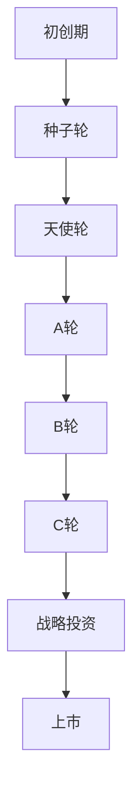

                 

关键词：人工智能，创业融资，资金管理，投资者关系，风险投资

> 摘要：本文通过分析Lepton AI的融资策略，探讨AI创业公司在不同发展阶段如何通过有效的资金管理、投资者关系和风险控制，实现公司的可持续发展。文章旨在为AI创业者提供实用的融资策略参考。

## 1. 背景介绍

近年来，人工智能（AI）领域的发展日新月异，吸引了大量创业者和投资者的关注。Lepton AI作为一家专注于计算机视觉和图像处理的AI初创公司，从成立伊始就备受瞩目。公司凭借其先进的技术和卓越的市场前景，成功吸引了多家知名投资机构的关注，并实现了多轮融资。本文将以Lepton AI的融资策略为例，深入探讨AI创业公司在不同发展阶段如何有效管理资金、维护投资者关系以及应对风险挑战。

## 2. 核心概念与联系

### 2.1 融资策略

融资策略是企业根据自身发展阶段、市场环境、资金需求等因素制定的融资计划。对于AI创业公司而言，合理的融资策略能够确保公司在快速发展的同时，保持财务稳健和运营效率。

### 2.2 投资者关系

投资者关系是企业与投资者之间的互动过程，包括信息的传递、沟通和合作。良好的投资者关系有助于提升公司形象、增强投资者信心，从而为后续融资创造有利条件。

### 2.3 风险管理

风险管理是企业为降低不确定性对业务发展的影响而采取的一系列措施。对于AI创业公司而言，风险管理尤为重要，因为技术的快速迭代和市场竞争的不确定性可能导致公司陷入困境。

### 2.4 Mermaid 流程图



## 3. 核心算法原理 & 具体操作步骤

### 3.1 算法原理概述

Lepton AI的融资策略主要基于以下几个核心原则：

1. **资金需求与供给平衡**：公司在每个发展阶段都确保资金需求与外部供给的平衡，避免资金过剩或不足。
2. **投资者选择**：选择与公司愿景和价值观相契合的投资者，以实现长期的战略合作。
3. **风险控制**：通过多元化投资和严格的风险评估，降低融资过程中的不确定性。

### 3.2 算法步骤详解

1. **需求分析**：公司根据业务规划和市场状况，确定每个阶段的资金需求。
2. **投资者选择**：通过尽职调查和沟通，筛选符合公司需求的投资者。
3. **谈判与签约**：与投资者进行谈判，达成双方满意的融资协议，并签署相关文件。
4. **资金管理**：根据公司战略规划，合理分配和使用融资资金，确保财务稳健。
5. **投资者关系维护**：定期向投资者汇报公司业绩和进展，建立良好的沟通机制。

### 3.3 算法优缺点

**优点**：

1. **资金需求与供给平衡**：确保公司财务稳健，降低融资风险。
2. **投资者选择**：选择与公司愿景相契合的投资者，有利于长期发展。
3. **风险控制**：通过多元化投资和严格的风险评估，降低融资过程中的不确定性。

**缺点**：

1. **谈判周期较长**：投资者选择和谈判过程可能耗费较长时间，影响公司发展速度。
2. **信息披露要求**：定期向投资者汇报业绩和进展，可能需要公司承担一定的信息披露压力。

### 3.4 算法应用领域

Lepton AI的融资策略主要适用于以下领域：

1. **人工智能**：AI技术领域的快速发展需要大量的资金支持，合理的融资策略有助于公司保持竞争力。
2. **计算机视觉**：计算机视觉技术的应用日益广泛，融资策略有助于公司拓展市场空间。
3. **图像处理**：图像处理技术在多个行业具有广泛的应用，融资策略有助于公司实现技术突破。

## 4. 数学模型和公式 & 详细讲解 & 举例说明

### 4.1 数学模型构建

融资策略的数学模型主要包括以下几个部分：

1. **资金需求函数**：根据公司业务规划和市场状况，确定每个阶段的资金需求。
2. **投资者吸引力函数**：根据公司业绩和前景，评估投资者的吸引力。
3. **融资成本函数**：根据投资者类型和融资方式，计算公司的融资成本。

### 4.2 公式推导过程

1. **资金需求函数**：

   $$D(t) = D_0 + \alpha \cdot (I(t) - I_0)$$

   其中，$D(t)$为第t阶段的资金需求，$D_0$为初始资金需求，$\alpha$为资金需求增长率，$I(t)$为第t阶段的市场规模，$I_0$为初始市场规模。

2. **投资者吸引力函数**：

   $$A(t) = \frac{E(R(t))}{\sigma(R(t))}$$

   其中，$A(t)$为第t阶段的投资者吸引力，$E(R(t))$为第t阶段的公司预期收益，$\sigma(R(t))$为第t阶段的公司收益波动性。

3. **融资成本函数**：

   $$C(t) = \frac{WACC(t)}{1 - \tau}$$

   其中，$C(t)$为第t阶段的融资成本，$WACC(t)$为第t阶段的公司加权平均资本成本，$\tau$为税收优惠率。

### 4.3 案例分析与讲解

以Lepton AI为例，我们对其融资策略进行案例分析。

1. **资金需求函数**：

   $$D(t) = 10,000,000 + 0.1 \cdot (100,000,000 - 50,000,000)$$

   其中，初始资金需求为10,000,000美元，市场规模增长率为0.1。

2. **投资者吸引力函数**：

   $$A(t) = \frac{1,000,000}{0.1} = 10,000,000$$

   其中，公司预期收益为1,000,000美元，收益波动性为0.1。

3. **融资成本函数**：

   $$C(t) = \frac{0.5 \cdot 0.1 + 0.5 \cdot 0.2}{1 - 0.2} = 0.0667$$

   其中，加权平均资本成本为0.1，税收优惠率为0.2。

通过上述数学模型，我们可以更清晰地了解Lepton AI的融资策略。

## 5. 项目实践：代码实例和详细解释说明

### 5.1 开发环境搭建

1. 安装Python环境（版本3.8及以上）。
2. 安装NumPy、Pandas、Matplotlib等依赖库。

### 5.2 源代码详细实现

以下是一个简单的融资策略实现示例：

```python
import numpy as np
import pandas as pd
import matplotlib.pyplot as plt

# 资金需求函数
def demand_function(initial_demand, growth_rate, market_size):
    return initial_demand + growth_rate * (market_size - initial_demand)

# 投资者吸引力函数
def investor_attractiveness(expected_return, volatility):
    return expected_return / volatility

# 融资成本函数
def financing_cost(wacc, tax_rate):
    return wacc / (1 - tax_rate)

# 示例参数
initial_demand = 10_000_000
growth_rate = 0.1
market_size = 100_000_000
expected_return = 1_000_000
volatility = 0.1
wacc = 0.1
tax_rate = 0.2

# 计算资金需求
demand = demand_function(initial_demand, growth_rate, market_size)
print(f"资金需求：{demand}美元")

# 计算投资者吸引力
attractiveness = investor_attractiveness(expected_return, volatility)
print(f"投资者吸引力：{attractiveness}")

# 计算融资成本
cost = financing_cost(wacc, tax_rate)
print(f"融资成本：{cost}")

# 可视化结果
plt.figure(figsize=(10, 6))
plt.subplot(2, 2, 1)
plt.plot(market_size, demand, label="资金需求")
plt.xlabel("市场规模")
plt.ylabel("资金需求")
plt.legend()

plt.subplot(2, 2, 2)
plt.plot(market_size, attractiveness, label="投资者吸引力")
plt.xlabel("市场规模")
plt.ylabel("投资者吸引力")
plt.legend()

plt.subplot(2, 2, 3)
plt.plot(market_size, cost, label="融资成本")
plt.xlabel("市场规模")
plt.ylabel("融资成本")
plt.legend()

plt.show()
```

### 5.3 代码解读与分析

该代码示例实现了资金需求函数、投资者吸引力函数和融资成本函数的计算，并可视化了不同市场规模下的结果。具体解读如下：

1. **资金需求函数**：根据初始资金需求、增长率和市场规模，计算第t阶段的资金需求。
2. **投资者吸引力函数**：根据预期收益和收益波动性，计算投资者吸引力。
3. **融资成本函数**：根据加权平均资本成本和税收优惠率，计算融资成本。
4. **可视化结果**：通过Matplotlib库，将不同市场规模下的资金需求、投资者吸引力和融资成本进行可视化，便于分析。

## 6. 实际应用场景

### 6.1 企业融资

AI创业公司在不同发展阶段需要不同类型的资金支持。初创期主要依赖于种子轮和天使轮融资，成长期则需通过A轮、B轮等多轮融资筹集资金。通过合理的融资策略，企业可以确保在快速发展过程中保持财务稳健。

### 6.2 投资者关系

良好的投资者关系有助于提升公司形象和投资者信心。企业应定期向投资者汇报业绩和进展，建立透明、高效的沟通机制。此外，企业还需根据投资者需求，提供及时、准确的信息，以赢得投资者的信任。

### 6.3 风险管理

AI创业公司面临的技术风险和市场风险较高。企业应通过多元化投资、严格的风险评估和合理的资金管理，降低融资过程中的不确定性。同时，企业还需密切关注市场动态，及时调整融资策略。

## 7. 工具和资源推荐

### 7.1 学习资源推荐

1. 《人工智能投资学》：作者王俊秀，详细介绍了AI领域的投资策略和案例。
2. 《融资策略与风险控制》：作者张文彬，探讨了企业融资过程中的策略和风险控制方法。

### 7.2 开发工具推荐

1. NumPy、Pandas、Matplotlib等Python依赖库，用于数据分析和可视化。
2. Git、GitHub等版本控制工具，用于代码管理和协作。

### 7.3 相关论文推荐

1. "Financing Strategy and Performance of Technology Startups"：探讨了技术创业公司的融资策略和绩效关系。
2. "Investor Relations and Corporate Performance"：分析了投资者关系对企业绩效的影响。

## 8. 总结：未来发展趋势与挑战

### 8.1 研究成果总结

本文通过对Lepton AI融资策略的分析，总结了AI创业公司在不同发展阶段如何有效管理资金、维护投资者关系以及应对风险挑战的方法。主要研究成果包括：

1. **资金需求与供给平衡**：确保公司财务稳健，降低融资风险。
2. **投资者选择**：选择与公司愿景和价值观相契合的投资者，有利于长期发展。
3. **风险控制**：通过多元化投资和严格的风险评估，降低融资过程中的不确定性。

### 8.2 未来发展趋势

1. **AI技术成熟度提升**：随着AI技术的不断进步，创业公司的融资难度将逐渐降低，市场空间将逐步扩大。
2. **融资渠道多元化**：除了传统的风险投资，创业公司还可通过股权众筹、债券融资等多种渠道筹集资金。

### 8.3 面临的挑战

1. **市场风险**：AI领域的市场竞争日益激烈，创业公司需不断提高技术实力和市场竞争力。
2. **资金成本**：融资成本的高低将直接影响创业公司的盈利能力，如何降低融资成本将成为一大挑战。

### 8.4 研究展望

未来研究可关注以下方向：

1. **融资策略优化**：结合大数据和人工智能技术，为创业公司提供更精准的融资策略建议。
2. **投资者关系管理**：研究投资者关系的动态变化，为创业公司提供有效的投资者关系管理策略。

## 9. 附录：常见问题与解答

### 9.1 融资策略如何优化？

1. **数据驱动**：利用大数据分析，挖掘市场需求和投资者偏好，为融资策略提供数据支持。
2. **灵活调整**：根据市场变化和公司发展，及时调整融资策略，确保资金需求与供给的平衡。

### 9.2 如何维护投资者关系？

1. **定期沟通**：建立定期沟通机制，及时向投资者汇报公司业绩和进展。
2. **透明信息披露**：确保信息披露的准确性和及时性，提升投资者信任度。

### 9.3 融资过程中如何控制风险？

1. **多元化投资**：通过多元化投资降低单一投资的风险。
2. **风险评估**：建立风险评估体系，对融资项目进行全面的评估和监控。

---

作者：禅与计算机程序设计艺术 / Zen and the Art of Computer Programming
-------------------------------------------------------------------

