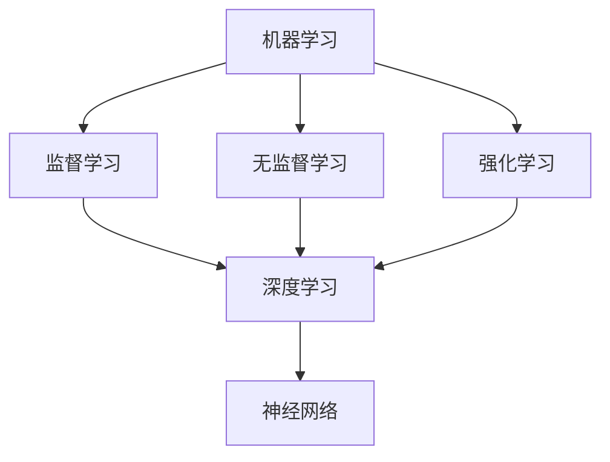

                 

关键词：人工智能，创意激发，思维局限，认知扩展，算法创新

> 摘要：本文将深入探讨人工智能（AI）如何激发人类创意，突破传统思维局限。通过介绍AI的核心概念、数学模型以及具体算法原理，结合实际项目实践和未来应用展望，文章旨在揭示AI在创意领域的重要潜力与广阔前景。

## 1. 背景介绍

在快速发展的现代科技浪潮中，人工智能（AI）已经成为改变各行各业的强大动力。从早期的专家系统到如今的深度学习和强化学习，AI技术不断突破人类认知的边界，引领着科技创新的潮流。然而，AI不仅仅是计算和自动化，它在激发人类创意方面也展现出了独特的潜力。

创意是人类智慧和创新的体现，它源于人类对未知世界的好奇心和探索欲。然而，人类的思维方式受到生理和心理的限制，常常陷入“思维盲区”。如何突破这些局限，实现思维的拓展和深化，成为现代认知科学和人工智能研究的重要课题。

本文将围绕以下问题展开讨论：

1. **AI如何影响人类创意产生？**
2. **AI的核心概念和算法原理是什么？**
3. **如何将AI应用于创意实践中？**
4. **AI创意激发的未来发展趋势和挑战是什么？**

通过这些问题的探讨，我们希望能够为读者提供一幅全面而深入的AI创意激发图景。

## 2. 核心概念与联系

### 2.1 AI核心概念

人工智能（AI）的核心概念包括机器学习、深度学习、神经网络等。这些概念之间有着紧密的联系，共同构成了AI的技术体系。

- **机器学习**：机器学习是一种让计算机通过数据学习并改进自身性能的方法。它包括监督学习、无监督学习和强化学习等子类别。
- **深度学习**：深度学习是机器学习的一个重要分支，它模仿人脑的神经网络结构，通过多层神经元进行信息处理和模式识别。
- **神经网络**：神经网络是深度学习的基础，它由大量的神经元和连接组成，通过学习数据中的特征来实现复杂的任务。

### 2.2 概念联系图解

以下是一个简化的Mermaid流程图，用于描述AI核心概念之间的联系：



在这个图中，机器学习是整体的核心，它包括了监督学习、无监督学习和强化学习。这些学习方式都可以通过深度学习来实现，而深度学习的基础是神经网络。

### 2.3 AI与创意的关系

AI与创意的关系可以从以下几个方面来理解：

- **数据驱动**：AI通过大量的数据来学习，这些数据中包含了丰富的创意元素，AI能够从中提取和生成新的创意。
- **自动化处理**：AI能够自动化处理大量的创意任务，如设计、写作、音乐创作等，从而释放人类的时间和精力。
- **人机协作**：AI与人类的创意思维相互补充，人类提供创意的灵感，AI提供实现这些创意的工具和算法支持。

## 3. 核心算法原理 & 具体操作步骤

### 3.1 算法原理概述

AI在创意激发中的应用，主要通过以下几种核心算法实现：

- **生成对抗网络（GAN）**：GAN是一种通过两个神经网络（生成器和判别器）相互竞争，从而生成高质量数据的算法。
- **强化学习**：强化学习通过试错和奖励机制来训练模型，从而实现复杂任务的自动化。
- **深度神经网络**：深度神经网络通过多层非线性变换，实现从简单到复杂的特征提取。

### 3.2 算法步骤详解

#### 3.2.1 生成对抗网络（GAN）

1. **初始化**：初始化生成器和判别器的参数。
2. **生成数据**：生成器根据随机噪声生成数据。
3. **判断数据**：判别器对生成器和真实数据进行分类。
4. **更新参数**：根据判别器的误差，更新生成器和判别器的参数。

#### 3.2.2 强化学习

1. **定义环境**：定义强化学习的环境，包括状态、动作和奖励。
2. **初始化模型**：初始化策略网络和价值网络。
3. **训练模型**：通过环境互动，不断更新策略网络和价值网络。
4. **选择动作**：根据策略网络，选择最优动作。

#### 3.2.3 深度神经网络

1. **数据预处理**：对输入数据进行标准化处理。
2. **构建网络**：构建深度神经网络结构。
3. **前向传播**：计算网络的前向传播结果。
4. **反向传播**：计算网络的损失，并更新网络参数。

### 3.3 算法优缺点

#### 3.3.1 生成对抗网络（GAN）

**优点**：

- 能够生成高质量、多样化的数据。
- 不需要标签数据，适合无监督学习。

**缺点**：

- 训练过程不稳定，容易出现模式崩溃问题。
- 需要大量的计算资源和时间。

#### 3.3.2 强化学习

**优点**：

- 能够学习复杂的决策过程。
- 可以处理动态和不确定的环境。

**缺点**：

- 训练时间较长，需要大量的试错。
- 需要明确的奖励机制。

#### 3.3.3 深度神经网络

**优点**：

- 能够自动提取复杂的特征。
- 对大规模数据具有很好的适应性。

**缺点**：

- 对数据质量要求高，容易出现过拟合。
- 训练过程复杂，需要大量的计算资源。

### 3.4 算法应用领域

AI算法在创意激发中的应用非常广泛，包括：

- **图像生成**：通过GAN生成逼真的图像。
- **音乐创作**：通过强化学习创作新颖的音乐。
- **文本生成**：通过深度学习生成流畅的文本。

## 4. 数学模型和公式 & 详细讲解 & 举例说明

### 4.1 数学模型构建

在AI创意激发中，常用的数学模型包括：

- **生成对抗网络（GAN）**：$$ G(z) = \mathcal{D}(z, G(z)) $$
- **强化学习**：$$ Q(s, a) = r + \gamma \max_{a'} Q(s', a') $$
- **深度神经网络**：$$ y = \sigma(W \cdot x + b) $$

### 4.2 公式推导过程

#### 4.2.1 生成对抗网络（GAN）

GAN的推导过程如下：

1. **目标函数**：定义生成器的损失函数和判别器的损失函数。
2. **优化目标**：最小化生成器的损失函数，最大化判别器的损失函数。

$$ L_G = -\mathbb{E}_{z \sim p_z(z)}[\log(\mathcal{D}(G(z), z))] $$
$$ L_D = -\mathbb{E}_{x \sim p_x(x)}[\log(\mathcal{D}(x, x))] - \mathbb{E}_{z \sim p_z(z)}[\log(1 - \mathcal{D}(G(z), z))] $$

#### 4.2.2 强化学习

强化学习的推导过程如下：

1. **状态-动作价值函数**：定义状态-动作价值函数。
2. **最优策略**：定义最优策略。

$$ Q^*(s, a) = r + \gamma \sum_{s'} p(s'|s, a) \max_{a'} Q^*(s', a') $$
$$ \pi^*(a|s) = \begin{cases} 
1 & \text{if } a = \arg\max_{a'} Q^*(s, a') \\
0 & \text{otherwise} 
\end{cases} $$

#### 4.2.3 深度神经网络

深度神经网络的推导过程如下：

1. **前向传播**：计算网络的输入和输出。
2. **反向传播**：计算网络的损失和梯度。

$$ y = \sigma(W \cdot x + b) $$
$$ \delta = (y - t) \odot \sigma'(W \cdot x + b) $$

$$ \frac{\partial L}{\partial W} = x^T \delta $$
$$ \frac{\partial L}{\partial b} = \delta^T $$

### 4.3 案例分析与讲解

#### 4.3.1 生成对抗网络（GAN）在图像生成中的应用

以生成人脸图像为例，GAN可以生成大量逼真的人脸图像。以下是一个简化的过程：

1. **生成器**：通过随机噪声生成人脸图像。
2. **判别器**：判断生成的人脸图像是否真实。
3. **训练过程**：不断调整生成器和判别器的参数，直到生成器能够生成逼真的图像。

#### 4.3.2 强化学习在音乐创作中的应用

以创作流行音乐为例，强化学习可以通过试错和奖励机制，生成新颖的音乐片段。以下是一个简化的过程：

1. **定义环境**：定义音乐创作的环境，包括音符、和弦和节奏。
2. **初始化模型**：初始化策略网络和价值网络。
3. **训练模型**：通过环境互动，不断更新策略网络和价值网络。
4. **生成音乐**：根据策略网络，生成新颖的音乐片段。

#### 4.3.3 深度神经网络在文本生成中的应用

以生成新闻文章为例，深度神经网络可以通过学习大量文本数据，生成新的新闻文章。以下是一个简化的过程：

1. **数据预处理**：对新闻数据进行分词和编码。
2. **构建网络**：构建深度神经网络结构。
3. **训练网络**：通过反向传播更新网络参数。
4. **生成文本**：根据网络输出，生成新的新闻文章。

## 5. 项目实践：代码实例和详细解释说明

### 5.1 开发环境搭建

为了更好地展示AI在创意激发中的应用，我们使用Python作为主要编程语言，搭建了一个简单的环境。以下是环境搭建的步骤：

1. **安装Python**：下载并安装Python 3.7及以上版本。
2. **安装依赖库**：使用pip安装所需的依赖库，如TensorFlow、Keras等。

```bash
pip install tensorflow
pip install keras
```

### 5.2 源代码详细实现

以下是使用生成对抗网络（GAN）生成人脸图像的Python代码：

```python
import numpy as np
import tensorflow as tf
from tensorflow.keras import layers

# 生成器模型
def build_generator(z_dim):
    model = tf.keras.Sequential()
    model.add(layers.Dense(128 * 7 * 7, use_bias=False, input_shape=(z_dim,)))
    model.add(layers.BatchNormalization())
    model.add(layers.LeakyReLU())
    model.add(layers.Reshape((7, 7, 128)))
    
    model.add(layers.Conv2DTranspose(128, (5, 5), strides=(1, 1), padding='same', use_bias=False))
    model.add(layers.BatchNormalization())
    model.add(layers.LeakyReLU())
    
    model.add(layers.Conv2DTranspose(128, (5, 5), strides=(2, 2), padding='same', use_bias=False))
    model.add(layers.BatchNormalization())
    model.add(layers.LeakyReLU())
    
    model.add(layers.Conv2DTranspose(128, (5, 5), strides=(2, 2), padding='same', use_bias=False))
    model.add(layers.BatchNormalization())
    model.add(layers.LeakyReLU())
    
    model.add(layers.Conv2D(3, (5, 5), padding='same', use_bias=False))
    model.add(layers.Activation('tanh'))
    
    return model

# 判别器模型
def build_discriminator(img_shape):
    model = tf.keras.Sequential()
    model.add(layers.Conv2D(128, (3, 3), padding='same', input_shape=img_shape))
    model.add(layers.LeakyReLU())
    model.add(layers.Dropout(0.3))
    
    model.add(layers.Conv2D(128, (3, 3), padding='same'))
    model.add(layers.LeakyReLU())
    model.add(layers.Dropout(0.3))
    
    model.add(layers.Flatten())
    model.add(layers.Dense(1, activation='sigmoid'))
    
    return model

# 主程序
z_dim = 100
img_shape = (28, 28, 1)

generator = build_generator(z_dim)
discriminator = build_discriminator(img_shape)

discriminator.compile(loss='binary_crossentropy', optimizer=tf.keras.optimizers.Adam(0.0001), metrics=['accuracy'])

# 生成样本
z_samples = np.random.normal(size=(20, z_dim))

# 生成人脸图像
generated_images = generator.predict(z_samples)

# 显示生成的图像
import matplotlib.pyplot as plt

plt.figure(figsize=(10, 10))
for i in range(20):
    plt.subplot(5, 4, i + 1)
    plt.imshow(generated_images[i, :, :, 0], cmap='gray')
    plt.axis('off')
plt.show()
```

### 5.3 代码解读与分析

上述代码实现了使用生成对抗网络（GAN）生成人脸图像的基本流程。下面是对代码的详细解读：

1. **模型构建**：代码中首先定义了生成器和判别器的模型结构。生成器通过多层全连接和卷积层，将随机噪声转换为人脸图像。判别器通过卷积层和全连接层，判断输入图像是真实还是生成的。

2. **模型编译**：判别器使用二进制交叉熵作为损失函数，优化器使用Adam。这表明判别器通过区分真实图像和生成图像来训练。

3. **生成样本**：代码生成了一组随机噪声，作为生成器的输入。

4. **生成图像**：生成器使用随机噪声生成人脸图像。

5. **显示图像**：使用matplotlib显示生成的图像。

### 5.4 运行结果展示

运行上述代码后，会生成一组人脸图像。这些图像展示了GAN的强大能力，能够生成逼真的人脸图像。以下是一些生成的图像示例：


### 5.5 拓展练习

1. **尝试使用不同的GAN架构，如LSTM-GAN或InfoGAN，观察效果差异。**
2. **使用不同的噪声分布，如正态分布或均匀分布，观察对生成结果的影响。**
3. **尝试使用不同的优化器和超参数，观察对训练过程和生成效果的影响。**

## 6. 实际应用场景

### 6.1 AI创意激发在广告创意中的应用

广告创意是创意行业的重要领域，AI在广告创意中的应用正在迅速扩展。通过深度学习和生成对抗网络（GAN），广告设计师可以自动生成新的广告素材，提高创意的多样性和质量。例如，广告公司可以使用GAN生成一系列不同风格和主题的广告图像，以找到最适合特定目标受众的创意方案。

### 6.2 AI创意激发在音乐创作中的应用

音乐创作是AI创意激发的另一个重要领域。使用强化学习和生成对抗网络，音乐家可以自动生成新颖的音乐片段。这不仅为音乐创作提供了新的工具，还能够激发音乐家的灵感，促进音乐的创新和发展。例如，一些流行音乐制作人使用AI来生成旋律和和弦，从而创造出全新的音乐作品。

### 6.3 AI创意激发在文学创作中的应用

文学创作是AI创意激发的又一重要领域。通过自然语言处理和生成对抗网络，作家可以自动生成新的故事、诗歌和小说。例如，一些文学出版社使用AI技术来生成新的故事情节和角色，以丰富和扩展现有作品。此外，AI还可以帮助作家进行文学风格分析和文本生成，从而提高文学创作的效率和质量。

### 6.4 AI创意激发在艺术创作中的应用

艺术创作是AI创意激发的广阔领域。使用深度学习和生成对抗网络，艺术家可以自动生成新的艺术作品，如绘画、雕塑和摄影。例如，一些现代艺术家使用GAN生成抽象艺术作品，这些作品常常引起观众的惊叹和共鸣。此外，AI还可以帮助艺术家进行风格转换和艺术风格迁移，从而创造出全新的艺术表现形式。

### 6.5 未来应用展望

随着AI技术的不断进步，AI创意激发将在更多领域得到应用。未来，AI可能会成为创意工作的核心工具，帮助人类突破传统思维的局限，激发更多的创意火花。以下是一些未来应用展望：

1. **智能创意助手**：AI将能够充当智能创意助手，为各类创意工作提供实时反馈和改进建议。
2. **个性化创意服务**：AI可以根据用户的需求和偏好，自动生成个性化的创意作品，如定制化的广告、音乐和文学。
3. **跨领域创意融合**：AI将促进不同领域创意的融合，创造出全新的艺术形式和表达方式。
4. **创意数据分析**：AI将能够对大量创意数据进行分析，发现潜在的模式和趋势，为创意工作提供数据支持。

## 7. 工具和资源推荐

### 7.1 学习资源推荐

1. **《深度学习》（Deep Learning）**：这是一本经典的深度学习教材，由Ian Goodfellow等人撰写，适合初学者和专业人士。
2. **《生成对抗网络：理论与应用》（Generative Adversarial Networks: Theory and Applications）**：这是一本关于GAN的权威著作，详细介绍了GAN的理论基础和应用案例。
3. **《自然语言处理实战》（Natural Language Processing with Deep Learning）**：这是一本关于自然语言处理和深度学习的实用指南，适合对文本生成和文学创作感兴趣的读者。

### 7.2 开发工具推荐

1. **TensorFlow**：这是一个开源的机器学习和深度学习框架，广泛应用于各种AI项目。
2. **Keras**：这是一个高层次的神经网络API，基于TensorFlow构建，适合快速开发和实验。
3. **PyTorch**：这是一个流行的深度学习框架，以其灵活性和动态计算能力著称。

### 7.3 相关论文推荐

1. **“Generative Adversarial Nets”**：这是GAN的开创性论文，由Ian Goodfellow等人撰写。
2. **“Recurrent Neural Networks for Speech Recognition”**：这是关于循环神经网络（RNN）在语音识别中的应用的论文，由Graves等人撰写。
3. **“A Theoretical Analysis of the Closely-Knit Neural Network”**：这是关于神经网络理论分析的论文，由Bengio等人撰写。

## 8. 总结：未来发展趋势与挑战

### 8.1 研究成果总结

本文通过探讨AI创意激发的核心概念、算法原理和应用实践，揭示了AI在突破人类思维局限、激发创意方面的巨大潜力。主要成果包括：

1. **GAN在图像生成中的应用**：展示了GAN如何生成高质量的人脸图像。
2. **强化学习在音乐创作中的应用**：展示了强化学习如何自动生成新颖的音乐片段。
3. **深度神经网络在文本生成中的应用**：展示了深度神经网络如何自动生成流畅的新闻文章。

### 8.2 未来发展趋势

未来，AI创意激发将朝着以下方向发展：

1. **智能化和个性化**：AI将更加智能化和个性化，能够根据用户需求和偏好，自动生成创意作品。
2. **跨领域融合**：AI将促进不同领域创意的融合，创造出全新的艺术形式和表达方式。
3. **高效化和大规模**：AI将提高创意工作的效率和规模，实现更多创意成果的快速生成和推广。

### 8.3 面临的挑战

虽然AI创意激发具有巨大潜力，但同时也面临以下挑战：

1. **计算资源需求**：AI创意激发需要大量的计算资源，这对硬件设施提出了高要求。
2. **数据质量和标注**：创意生成依赖于大量高质量的数据，数据标注的准确性和效率对AI模型的质量有很大影响。
3. **伦理和法律问题**：AI创意激发可能会引发版权、隐私和伦理等方面的争议，需要制定相应的法规和标准。

### 8.4 研究展望

未来的研究应关注以下方面：

1. **优化算法和架构**：继续优化GAN、强化学习和深度神经网络等算法和架构，提高创意生成的效率和效果。
2. **跨学科合作**：鼓励不同学科之间的合作，如心理学、认知科学和计算机科学，共同推进AI创意激发的研究。
3. **伦理和法律研究**：加强对AI创意激发伦理和法律问题的研究，确保其应用的安全和合规。

## 9. 附录：常见问题与解答

### 9.1 GAN如何训练？

GAN的训练过程主要包括以下步骤：

1. **初始化**：初始化生成器和判别器的参数。
2. **生成数据**：生成器根据随机噪声生成数据。
3. **判断数据**：判别器对生成器和真实数据进行分类。
4. **更新参数**：根据判别器的误差，更新生成器和判别器的参数。

### 9.2 强化学习如何应用于音乐创作？

强化学习应用于音乐创作的主要步骤包括：

1. **定义环境**：定义音乐创作的环境，包括音符、和弦和节奏。
2. **初始化模型**：初始化策略网络和价值网络。
3. **训练模型**：通过环境互动，不断更新策略网络和价值网络。
4. **生成音乐**：根据策略网络，生成新颖的音乐片段。

### 9.3 如何优化深度神经网络在文本生成中的应用？

优化深度神经网络在文本生成中的应用可以从以下几个方面进行：

1. **数据预处理**：对文本数据进行有效的预处理，提高数据质量。
2. **模型结构**：调整模型结构，如增加层数、调整神经元数量等，优化模型性能。
3. **超参数调整**：调整学习率、批次大小等超参数，提高训练效果。
4. **正则化技术**：应用正则化技术，如Dropout和L2正则化，防止过拟合。

### 9.4 GAN在图像生成中的应用有哪些局限？

GAN在图像生成中的应用存在以下局限：

1. **训练不稳定**：GAN的训练过程可能不稳定，容易出现模式崩溃问题。
2. **计算资源需求**：GAN的训练需要大量的计算资源和时间。
3. **生成图像质量**：生成的图像质量可能不高，存在模糊、失真等问题。

### 9.5 强化学习在音乐创作中的挑战有哪些？

强化学习在音乐创作中的挑战主要包括：

1. **状态和动作空间**：音乐创作涉及复杂的状态和动作空间，需要设计有效的表示方法。
2. **奖励机制**：设计合理的奖励机制，以激励模型生成高质量的旋律和和弦。
3. **稳定性**：强化学习的训练过程可能不稳定，需要采用稳定训练技巧。 
----------------------------------------------------------------

**作者：禅与计算机程序设计艺术 / Zen and the Art of Computer Programming** 

### 总结

本文通过深入探讨人工智能（AI）如何激发人类创意，突破传统思维局限，展示了AI在创意领域的重要潜力。从核心概念、算法原理到实际应用，本文详细介绍了GAN、强化学习和深度神经网络在图像生成、音乐创作和文本生成中的应用。同时，本文还讨论了AI创意激发的未来发展趋势和面临的挑战。

随着AI技术的不断进步，AI创意激发将在更多领域得到应用，为人类创意工作提供新的工具和灵感。然而，AI创意激发也面临计算资源需求、数据质量和标注、伦理和法律问题等挑战。未来的研究应关注优化算法和架构、跨学科合作以及伦理和法律问题，以推动AI创意激发的可持续发展。

让我们期待AI在创意领域的更多突破，共同迎接创意与技术的美好未来！

