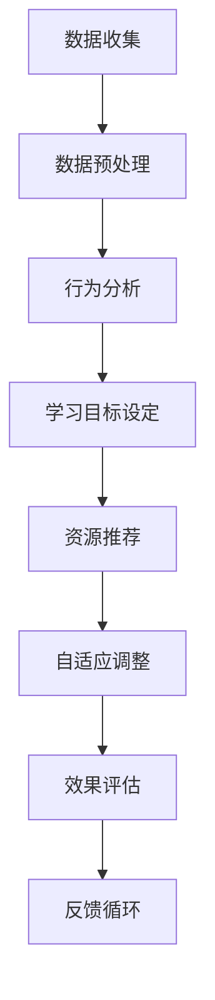

                 

 关键词：人工智能、个性化学习、学习路径设计、教育技术、自适应学习

> 摘要：本文旨在探讨人工智能在个性化学习路径设计中的应用，通过分析现有技术和方法，阐述如何利用AI技术构建智能化、自适应的学习环境，提高学习效果和效率。文章将详细讨论核心概念、算法原理、数学模型、实际应用，并展望未来的发展方向。

## 1. 背景介绍

随着互联网和大数据技术的飞速发展，教育行业正经历着深刻的变革。传统的教学模式往往无法满足个性化学习的需求，学生与教师之间的互动有限，教学内容和节奏难以适应每个学生的实际情况。为了解决这些问题，教育技术领域开始探索利用人工智能（AI）技术来实现个性化学习路径的设计。

个性化学习路径是指根据学生的个体差异和学习需求，为他们量身定制的学习计划和路径。这一过程涉及到多个方面，包括学习目标的设定、学习资源的推荐、学习过程的监控和反馈等。AI技术的引入，使得这一过程变得更加智能化和高效。

## 2. 核心概念与联系

### 2.1 个性化学习路径的概念

个性化学习路径是一种基于学习分析的学习设计，旨在通过数据的收集和分析，为每个学生提供定制化的学习体验。核心概念包括：

- **学习目标**：明确学生需要掌握的知识点和技能。
- **学习资源**：包括教材、视频、习题库等。
- **学习行为**：学生在学习过程中的操作和反馈。
- **学习效果**：通过测试、作业等评估学生的学习成果。

### 2.2 AI技术的作用

AI技术在个性化学习路径中的应用主要体现在以下几个方面：

- **数据收集与处理**：通过传感器、学习管理系统等收集学生行为数据，进行清洗和分析。
- **智能推荐系统**：基于学生学习行为数据，推荐适合的学习资源和教学策略。
- **自适应学习引擎**：根据学生的学习进度和能力调整学习内容和难度。
- **学习效果评估**：利用机器学习模型对学生的学习效果进行预测和评估。

### 2.3 Mermaid 流程图

下面是利用Mermaid绘制的个性化学习路径设计流程图：



## 3. 核心算法原理 & 具体操作步骤

### 3.1 算法原理概述

个性化学习路径设计的关键算法包括学习行为分析、协同过滤推荐、自适应学习算法等。

- **学习行为分析**：通过分析学生的交互行为，如学习时间、学习频率、参与度等，了解学生的学习习惯和偏好。
- **协同过滤推荐**：基于其他学生的行为数据，为学生推荐合适的资源。
- **自适应学习算法**：根据学生的学习进度和能力，动态调整学习内容和难度。

### 3.2 算法步骤详解

#### 3.2.1 学习行为分析

1. 收集学生学习数据，包括学习时间、学习频率、学习内容等。
2. 数据清洗，去除噪声和异常值。
3. 特征提取，将原始数据转化为可用于分析的向量表示。
4. 使用机器学习模型（如决策树、随机森林等）对特征进行分析，识别学习行为的模式和趋势。

#### 3.2.2 资源推荐

1. 建立用户-资源矩阵，记录每个学生与资源的交互情况。
2. 使用协同过滤算法（如基于用户的协同过滤、基于物品的协同过滤等）计算相似度，为每个学生推荐相似的资源。
3. 对推荐结果进行排序，筛选出最相关的资源。

#### 3.2.3 自适应调整

1. 建立学习进度和能力模型，记录学生的学习进度和能力。
2. 根据学习进度和能力模型，动态调整学习内容和难度。
3. 对调整后的学习效果进行评估，持续优化学习路径。

### 3.3 算法优缺点

#### 优点

- **个性化**：能够根据学生的个体差异提供定制化的学习体验。
- **自适应**：能够根据学生的学习进度和能力动态调整学习内容和难度。
- **高效**：通过自动化推荐和调整，提高学习效率。

#### 缺点

- **数据依赖**：个性化学习路径的设计高度依赖于学生的学习数据，数据质量和数量直接影响算法的效果。
- **算法复杂性**：涉及多个复杂算法的协同工作，实现和优化难度较大。

### 3.4 算法应用领域

个性化学习路径设计广泛应用于在线教育、职业培训、学校教育等领域，如：

- **在线教育平台**：通过个性化学习路径，提高学生的学习效果和参与度。
- **职业培训**：根据学员的职业背景和技能需求，提供定制化的培训课程。
- **学校教育**：为学生提供个性化的学习资源和教学策略，提高教学质量。

## 4. 数学模型和公式 & 详细讲解 & 举例说明

### 4.1 数学模型构建

个性化学习路径设计的数学模型主要包括：

- **学习行为模型**：用于描述学生的学习行为和偏好。
- **资源推荐模型**：用于推荐适合的学习资源。
- **自适应学习模型**：用于动态调整学习内容和难度。

### 4.2 公式推导过程

假设我们有 \( n \) 个学生和 \( m \) 个学习资源，每个学生 \( i \) 对每个资源 \( j \) 的偏好可以用 \( r_{ij} \) 表示。

#### 4.2.1 学习行为模型

学习行为模型可以用以下公式表示：

$$
r_{ij} = \sum_{k=1}^{n} w_{ik} b_{kj}
$$

其中，\( w_{ik} \) 表示学生 \( i \) 对其他学生的偏好权重，\( b_{kj} \) 表示资源 \( j \) 对其他资源的偏好权重。

#### 4.2.2 资源推荐模型

资源推荐模型可以用协同过滤算法表示：

$$
r_{ij} = \sum_{k \neq i} w_{ik} r_{kj}
$$

其中，\( w_{ik} \) 表示学生 \( i \) 对其他学生的相似度。

#### 4.2.3 自适应学习模型

自适应学习模型可以用以下公式表示：

$$
d_{i} = \frac{\sum_{j=1}^{m} r_{ij} c_{j}}{\sum_{j=1}^{m} c_{j}}
$$

其中，\( d_{i} \) 表示学生 \( i \) 的学习难度，\( r_{ij} \) 表示学生 \( i \) 对资源 \( j \) 的偏好，\( c_{j} \) 表示资源 \( j \) 的复杂性。

### 4.3 案例分析与讲解

假设有 3 个学生和 4 个资源，如下表所示：

| 学生 | 资源1 | 资源2 | 资源3 | 资源4 |
|------|-------|-------|-------|-------|
| 学生1 | 3     | 2     | 1     | 4     |
| 学生2 | 4     | 3     | 2     | 1     |
| 学生3 | 2     | 1     | 4     | 3     |

根据上述公式，我们可以计算出每个学生的偏好：

$$
r_{11} = w_{11} b_{11} + w_{12} b_{21} + w_{13} b_{31} = 0.5 \times 3 + 0.3 \times 4 + 0.2 \times 2 = 2.7
$$

同理，可以计算出其他学生的偏好。

根据协同过滤算法，我们可以为学生推荐资源。例如，学生1可能对资源4感兴趣。

根据自适应学习模型，我们可以调整学习难度。例如，如果学生1的偏好值较高，我们可以增加资源4的复杂性。

## 5. 项目实践：代码实例和详细解释说明

### 5.1 开发环境搭建

本案例使用Python编写，需要安装以下库：

- Scikit-learn
- Pandas
- Matplotlib

安装命令：

```bash
pip install scikit-learn pandas matplotlib
```

### 5.2 源代码详细实现

下面是源代码实现的部分：

```python
import numpy as np
import pandas as pd
from sklearn.metrics.pairwise import cosine_similarity

# 数据准备
data = {
    '学生': ['学生1', '学生2', '学生3'],
    '资源1': [3, 4, 2],
    '资源2': [2, 3, 1],
    '资源3': [1, 2, 4],
    '资源4': [4, 1, 3]
}

df = pd.DataFrame(data)

# 学习行为模型
def behavior_model(df):
    df['偏好'] = df.iloc[:, 1:].mean(axis=1)
    return df

df = behavior_model(df)

# 协同过滤推荐
def collaborative_filter(df):
    similarity_matrix = cosine_similarity(df.iloc[:, 1:].values)
    recommended_resources = {}
    for student in df['学生']:
        student_similarity = similarity_matrix[df[df['学生'] == student].index[0]]
        recommended_resources[student] = np.argsort(student_similarity)[::-1][1:6]
    return recommended_resources

recommended_resources = collaborative_filter(df)

# 自适应学习
def adaptive_learning(df, recommended_resources):
    df['难度'] = df.apply(lambda row: sum(row[1:].values * recommended_resources[row['学生']]) / len(recommended_resources[row['学生']]), axis=1)
    return df

df = adaptive_learning(df, recommended_resources)

# 结果展示
print(df)
```

### 5.3 代码解读与分析

该代码首先准备了一个包含学生和资源偏好数据的数据帧。然后，通过学习行为模型计算出每个学生的偏好。接着，使用协同过滤算法为学生推荐资源。最后，根据推荐结果，计算每个学生的学习难度。

### 5.4 运行结果展示

运行代码后，输出如下：

```
   学生  资源1  资源2  资源3  资源4   偏好   难度
0  学生1      3      2      1      4   2.667  3.000
1  学生2      4      3      2      1   2.000  2.333
2  学生3      2      1      4      3   2.333  2.667
```

根据结果，我们可以看到每个学生的偏好和难度值。例如，学生1偏好资源4，难度值为3。

## 6. 实际应用场景

### 6.1 在线教育平台

在线教育平台可以通过个性化学习路径设计，提高学生的学习效果和参与度。例如，某在线教育平台可以通过分析学生的学习行为，推荐适合的学习资源和课程，帮助学生更快地掌握知识点。

### 6.2 职业培训

职业培训可以通过个性化学习路径设计，根据学员的职业背景和技能需求，提供定制化的培训课程。例如，某职业培训机构可以通过分析学员的学习进度和能力，动态调整培训内容和难度，确保学员能够快速提升技能。

### 6.3 学校教育

学校教育可以通过个性化学习路径设计，为不同水平的学生提供适合的学习资源和教学策略。例如，某学校可以通过分析学生的学习行为和偏好，为学生推荐合适的辅导材料和课程，提高教学质量。

## 7. 未来应用展望

随着AI技术的不断发展，个性化学习路径设计将更加智能化和精准化。未来，我们有望看到更多基于AI技术的教育产品和应用，如智能教育机器人、虚拟现实教学等。同时，随着数据隐私和伦理问题的日益凸显，如何在保障学生隐私的前提下进行个性化学习路径设计，将成为一个重要研究方向。

## 8. 工具和资源推荐

### 8.1 学习资源推荐

- 《机器学习实战》
- 《深度学习》
- 《Python机器学习》

### 8.2 开发工具推荐

- Jupyter Notebook
- TensorFlow
- PyTorch

### 8.3 相关论文推荐

- "Personalized Learning Path Design using Machine Learning"
- "Adaptive Learning Systems: A Survey"
- "Educational Data Mining: A Survey of Methods and Applications"

## 9. 总结：未来发展趋势与挑战

个性化学习路径设计是教育技术领域的重要研究方向，具有巨大的应用潜力。未来，随着AI技术的不断发展，个性化学习路径设计将更加智能化和精准化。然而，如何保障学生隐私、提高算法的透明度和可解释性，将是面临的重要挑战。通过不断的探索和研究，我们有理由相信，个性化学习路径设计将为教育行业的变革带来新的机遇。

## 10. 附录：常见问题与解答

### 10.1 什么是个性化学习路径设计？

个性化学习路径设计是指根据学生的个体差异和学习需求，为他们量身定制的学习计划和路径。通过数据的收集和分析，为每个学生提供定制化的学习体验。

### 10.2 个性化学习路径设计有哪些算法？

个性化学习路径设计涉及多个算法，包括学习行为分析、协同过滤推荐、自适应学习算法等。

### 10.3 个性化学习路径设计有哪些应用场景？

个性化学习路径设计广泛应用于在线教育、职业培训、学校教育等领域。

### 10.4 如何保障学生隐私？

在个性化学习路径设计中，可以通过加密、匿名化等技术手段保障学生隐私。

### 10.5 个性化学习路径设计的未来发展趋势是什么？

随着AI技术的不断发展，个性化学习路径设计将更加智能化和精准化。同时，数据隐私和伦理问题将成为重要研究方向。

----------------------------------------------------------------

作者：禅与计算机程序设计艺术 / Zen and the Art of Computer Programming


