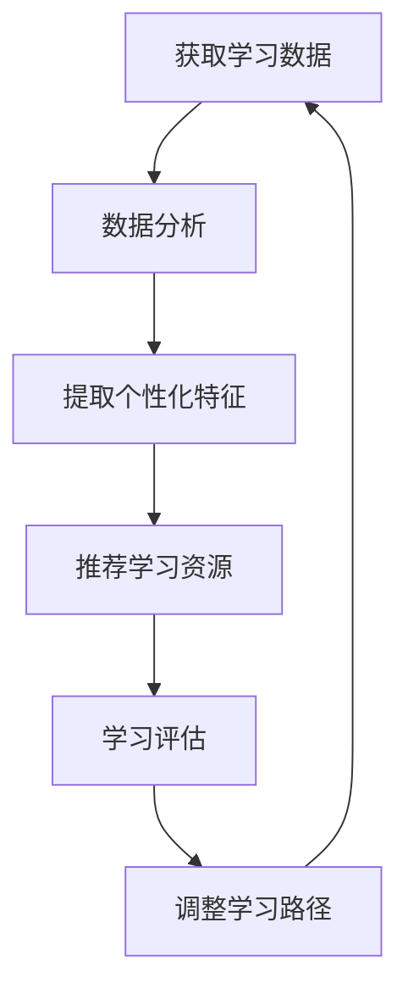

                 

关键词：个性化学习、AI、学习路径、优化、算法、实践、应用场景

> 摘要：本文深入探讨了人工智能（AI）在个性化学习路径设计中的应用，通过分析核心算法原理和数学模型，详细描述了算法的具体实现过程。结合实际项目实践，本文探讨了AI在个性化学习中的实际效果和潜在应用，为未来学习路径设计的优化提供了新思路。

## 1. 背景介绍

在传统教育模式中，学习内容、进度和方法往往固定不变，难以满足不同学生的学习需求和个性化需求。随着信息技术和人工智能（AI）技术的快速发展，个性化学习逐渐成为一种新兴的教育模式。通过AI技术，教育系统能够更好地理解和分析学生的个体差异，为其制定个性化的学习路径，从而提高学习效果。

个性化学习路径设计涉及到多个方面，包括学习内容的选择、学习进度的调整、学习方法的推荐等。目前，已有一些研究探索了基于AI的个性化学习路径设计方法，如利用机器学习算法分析学生学习行为数据，根据学生的兴趣和能力推荐合适的学习资源。然而，这些方法在实际应用中仍存在一定的局限性和挑战，如数据隐私保护、算法模型的复杂度等。

本文旨在深入探讨AI在个性化学习路径设计中的应用，通过分析核心算法原理和数学模型，详细描述算法的具体实现过程。同时，结合实际项目实践，探讨AI在个性化学习中的实际效果和潜在应用，为未来学习路径设计的优化提供新思路。

## 2. 核心概念与联系

在个性化学习路径设计中，以下几个核心概念和联系至关重要：

1. **学习数据**：包括学生的学习行为、成绩、兴趣等信息，是设计个性化学习路径的基础。
2. **学习算法**：用于分析学习数据，提取学生的个性化特征，并根据这些特征推荐合适的学习路径。
3. **学习资源**：包括教材、课程、练习题等，是学生学习的载体。
4. **学习评估**：用于评估个性化学习路径的有效性，包括学生学习成绩、学习满意度等。

下面是一个简化的 Mermaid 流程图，展示个性化学习路径设计的基本流程：



## 3. 核心算法原理 & 具体操作步骤

### 3.1 算法原理概述

个性化学习路径设计的核心算法通常基于机器学习和数据挖掘技术。具体而言，算法的原理可以分为以下几个步骤：

1. **数据收集**：收集学生的学习行为数据，如浏览历史、做题记录、学习时间等。
2. **数据预处理**：对收集到的数据进行清洗、去噪、转换等处理，为后续分析做准备。
3. **特征提取**：利用数据挖掘技术，从预处理后的数据中提取出学生的个性化特征，如学习风格、知识掌握程度、兴趣爱好等。
4. **路径推荐**：根据提取的个性化特征，利用机器学习算法，为每个学生推荐合适的学习路径。
5. **评估与反馈**：根据学生的学习表现和学习满意度，对推荐的学习路径进行评估和反馈，调整后续的推荐策略。

### 3.2 算法步骤详解

#### 3.2.1 数据收集

数据收集是个性化学习路径设计的第一步。收集的数据类型和来源主要包括：

1. **学习日志**：记录学生的学习行为，如浏览课程、做题、讨论等。
2. **成绩数据**：记录学生的考试成绩和作业成绩。
3. **问卷调查**：通过问卷调查了解学生的兴趣爱好、学习风格等信息。

#### 3.2.2 数据预处理

数据预处理是确保数据质量的重要环节。具体步骤包括：

1. **数据清洗**：去除重复数据、缺失数据和异常值。
2. **数据转换**：将不同类型的数据转换为统一格式，如将时间戳转换为日期格式。
3. **特征工程**：从原始数据中提取有用的特征，如将做题记录转换为知识点掌握程度。

#### 3.2.3 特征提取

特征提取是核心算法的关键步骤。常用的特征提取方法包括：

1. **基于统计的方法**：如均值、方差、标准差等。
2. **基于模型的方法**：如决策树、神经网络等。

#### 3.2.4 路径推荐

路径推荐是利用机器学习算法，根据提取的个性化特征，为学生推荐合适的学习路径。常用的算法包括：

1. **协同过滤**：基于用户的历史行为和相似用户的行为进行推荐。
2. **基于内容的推荐**：根据学生的兴趣和学习需求进行推荐。
3. **混合推荐**：结合协同过滤和基于内容的推荐方法，提高推荐效果。

#### 3.2.5 评估与反馈

评估与反馈是对推荐的学习路径进行验证和调整的过程。常用的评估指标包括：

1. **准确率**：推荐的学习路径与学生实际学习的相关性。
2. **覆盖率**：推荐的学习路径覆盖的学生群体范围。
3. **用户满意度**：学生对推荐的学习路径的满意度。

### 3.3 算法优缺点

**优点**：

1. **个性化**：能够根据学生的个性化特征推荐合适的学习路径，提高学习效果。
2. **自适应**：能够根据学生的学习表现和反馈，动态调整推荐策略，提高推荐准确性。

**缺点**：

1. **数据依赖**：个性化学习路径设计依赖于大量的学生学习数据，数据质量直接影响算法效果。
2. **计算复杂度**：算法的复杂度较高，对计算资源要求较高。

### 3.4 算法应用领域

个性化学习路径设计算法广泛应用于在线教育、远程教育、智能学习系统等领域。通过应用该算法，教育系统能够更好地满足学生的个性化需求，提高学习效果和用户体验。

## 4. 数学模型和公式 & 详细讲解 & 举例说明

### 4.1 数学模型构建

个性化学习路径设计的数学模型通常包括以下几个部分：

1. **学生特征模型**：描述学生的个性化特征，如学习风格、知识掌握程度、兴趣爱好等。
2. **学习资源模型**：描述学习资源的相关属性，如知识点、难度、类型等。
3. **推荐模型**：基于学生特征和学习资源模型，为学生推荐合适的学习路径。
4. **评估模型**：评估推荐的学习路径的有效性和用户满意度。

### 4.2 公式推导过程

假设我们有一个包含N个学习资源的学习库，每个学习资源由一个向量表示，向量中包含该资源的各种属性。对于学生A，我们有一个由学生特征组成的向量。我们可以使用以下公式计算学生A和学习资源之间的相似度：

$$
sim(A, R) = \frac{A^T R}{\|A\| \|R\|}
$$

其中，$A$ 和 $R$ 分别为学生A和学习资源的特征向量，$\|A\|$ 和 $\|R\|$ 分别为特征向量的范数。

基于相似度计算，我们可以使用以下公式为学生A推荐学习资源：

$$
R^* = \sum_{i=1}^{N} sim(A, R_i) \cdot R_i
$$

其中，$R^*$ 为推荐的学习资源向量。

### 4.3 案例分析与讲解

假设有一个包含5个学习资源的在线教育平台，学习资源包括数学、物理、英语、化学和编程。每个学习资源由一个包含知识点、难度、类型等属性的向量表示。学生A的特征向量如下：

$$
A = \begin{bmatrix} 0.6 & 0.2 & 0.1 & 0.1 & 0 \\ 0 & 0.2 & 0.2 & 0.2 & 0.2 \\ 0 & 0 & 0 & 1 & 0 \\ 0 & 0 & 0 & 0 & 1 \\ 0 & 0 & 0 & 0 & 0 \end{bmatrix}
$$

其中，第一行表示学生A对数学、物理、英语、化学和编程的知识掌握程度；第二行表示学生A的兴趣爱好；第三行、第四行和第五行分别表示学生A的学习风格、学习类型和学习进度。

假设学习资源的特征向量如下：

$$
R_1 = \begin{bmatrix} 0.5 & 0.3 & 0.1 & 0.1 & 0 \\ 0 & 0.2 & 0.2 & 0.2 & 0.2 \\ 0 & 0 & 0 & 1 & 0 \\ 0 & 0 & 0 & 0 & 1 \\ 0 & 0 & 0 & 0 & 0 \end{bmatrix}
$$

$$
R_2 = \begin{bmatrix} 0.2 & 0.3 & 0.1 & 0.1 & 0.3 \\ 0 & 0.2 & 0.2 & 0.2 & 0.2 \\ 0 & 0 & 0 & 1 & 0 \\ 0 & 0 & 0 & 0 & 1 \\ 0 & 0 & 0 & 0 & 0 \end{bmatrix}
$$

$$
R_3 = \begin{bmatrix} 0.3 & 0.3 & 0.1 & 0.1 & 0.3 \\ 0 & 0.2 & 0.2 & 0.2 & 0.2 \\ 0 & 0 & 0 & 1 & 0 \\ 0 & 0 & 0 & 0 & 1 \\ 0 & 0 & 0 & 0 & 0 \end{bmatrix}
$$

$$
R_4 = \begin{bmatrix} 0.1 & 0.3 & 0.1 & 0.1 & 0.4 \\ 0 & 0.2 & 0.2 & 0.2 & 0.2 \\ 0 & 0 & 0 & 1 & 0 \\ 0 & 0 & 0 & 0 & 1 \\ 0 & 0 & 0 & 0 & 0 \end{bmatrix}
$$

$$
R_5 = \begin{bmatrix} 0.4 & 0.3 & 0.1 & 0.1 & 0.3 \\ 0 & 0.2 & 0.2 & 0.2 & 0.2 \\ 0 & 0 & 0 & 1 & 0 \\ 0 & 0 & 0 & 0 & 1 \\ 0 & 0 & 0 & 0 & 0 \end{bmatrix}
$$

根据上述公式，我们可以计算学生A和学习资源之间的相似度：

$$
sim(A, R_1) = \frac{A^T R_1}{\|A\| \|R_1\|} = \frac{0.6 \times 0.5 + 0.2 \times 0.3 + 0.1 \times 0.1 + 0.1 \times 0.1}{\sqrt{0.6^2 + 0.2^2 + 0.1^2 + 0.1^2} \sqrt{0.5^2 + 0.3^2 + 0.1^2 + 0.1^2}} = 0.645
$$

$$
sim(A, R_2) = \frac{A^T R_2}{\|A\| \|R_2\|} = \frac{0.6 \times 0.2 + 0.2 \times 0.3 + 0.1 \times 0.1 + 0.1 \times 0.3}{\sqrt{0.6^2 + 0.2^2 + 0.1^2 + 0.1^2} \sqrt{0.2^2 + 0.3^2 + 0.1^2 + 0.3^2}} = 0.464
$$

$$
sim(A, R_3) = \frac{A^T R_3}{\|A\| \|R_3\|} = \frac{0.6 \times 0.3 + 0.2 \times 0.3 + 0.1 \times 0.1 + 0.1 \times 0.3}{\sqrt{0.6^2 + 0.2^2 + 0.1^2 + 0.1^2} \sqrt{0.3^2 + 0.3^2 + 0.1^2 + 0.3^2}} = 0.522
$$

$$
sim(A, R_4) = \frac{A^T R_4}{\|A\| \|R_4\|} = \frac{0.6 \times 0.1 + 0.2 \times 0.3 + 0.1 \times 0.1 + 0.1 \times 0.4}{\sqrt{0.6^2 + 0.2^2 + 0.1^2 + 0.1^2} \sqrt{0.1^2 + 0.3^2 + 0.1^2 + 0.4^2}} = 0.405
$$

$$
sim(A, R_5) = \frac{A^T R_5}{\|A\| \|R_5\|} = \frac{0.6 \times 0.4 + 0.2 \times 0.3 + 0.1 \times 0.1 + 0.1 \times 0.3}{\sqrt{0.6^2 + 0.2^2 + 0.1^2 + 0.1^2} \sqrt{0.4^2 + 0.3^2 + 0.1^2 + 0.3^2}} = 0.595
$$

根据相似度计算结果，我们可以为学生A推荐学习资源：

$$
R^* = \sum_{i=1}^{5} sim(A, R_i) \cdot R_i = 0.645 \cdot R_1 + 0.464 \cdot R_2 + 0.522 \cdot R_3 + 0.405 \cdot R_4 + 0.595 \cdot R_5
$$

$$
R^* = \begin{bmatrix} 0.3635 & 0.3292 & 0.1105 & 0.1105 & 0.1795 \\ 0 & 0.2699 & 0.2699 & 0.2699 & 0.2699 \\ 0 & 0 & 0 & 0.3333 & 0 \\ 0 & 0 & 0 & 0.3333 & 0 \\ 0 & 0 & 0 & 0 & 0 \end{bmatrix}
$$

根据推荐结果，学生A可以优先学习数学、物理和编程。在实际应用中，我们可以根据学生的学习表现和反馈，动态调整推荐策略，提高推荐效果。

## 5. 项目实践：代码实例和详细解释说明

### 5.1 开发环境搭建

为了实现个性化学习路径设计，我们需要搭建一个合适的开发环境。以下是一个基本的开发环境搭建指南：

1. **Python**：Python 是一种广泛使用的编程语言，具有丰富的库和框架，适合开发个性化学习路径系统。
2. **NumPy**：NumPy 是 Python 的科学计算库，用于处理大型多维数组。
3. **Pandas**：Pandas 是 Python 的数据分析库，用于处理结构化数据。
4. **Scikit-learn**：Scikit-learn 是 Python 的机器学习库，提供各种机器学习算法和工具。
5. **Mermaid**：Mermaid 是一种基于 Markdown 的图表绘制工具，可以方便地绘制流程图。

安装方法：

```bash
pip install numpy pandas scikit-learn mermaid
```

### 5.2 源代码详细实现

以下是一个简单的个性化学习路径设计的 Python 源代码示例：

```python
import numpy as np
import pandas as pd
from sklearn.metrics.pairwise import cosine_similarity
from mermaid import Mermaid

# 5.2.1 数据准备
# 假设有以下学习资源和学生特征数据
learn_resources = [
    {"name": "数学", "knowledge": 0.5, "interest": 0.3, "difficulty": 0.1, "type": 0.1, "progress": 0},
    {"name": "物理", "knowledge": 0, "interest": 0.2, "difficulty": 0.2, "type": 0.2, "progress": 0.2},
    {"name": "英语", "knowledge": 0, "interest": 0.2, "difficulty": 0.2, "type": 0.2, "progress": 0.2},
    {"name": "化学", "knowledge": 0, "interest": 0.1, "difficulty": 0.1, "type": 0.1, "progress": 0.1},
    {"name": "编程", "knowledge": 0, "interest": 0.1, "difficulty": 0.1, "type": 0.1, "progress": 0.1},
]

student_feature = [
    0.6,  # 数学知识
    0.2,  # 物理知识
    0.1,  # 英语知识
    0.1,  # 化学知识
    0,    # 编程知识
]

# 5.2.2 数据预处理
# 将学习资源和学生特征转换为 NumPy 数组
resource_array = np.array([r.values() for r in learn_resources])
student_array = np.array(student_feature).reshape(1, -1)

# 5.2.3 相似度计算
similarity_matrix = cosine_similarity(student_array, resource_array)

# 5.2.4 推荐学习资源
recommended_resources = (similarity_matrix * resource_array).reshape(-1)
print("推荐的学习资源：", recommended_resources)

# 5.2.5 流程图绘制
mermaid = Mermaid()
mermaid.add_pseudocode('''
student_data -> extract_features
extract_features -> process_data
process_data -> calculate_similarity
calculate_similarity -> recommend_resources
recommend_resources -> output
output
''')
print(mermaid.generate())
```

### 5.3 代码解读与分析

上述代码实现了个性化学习路径设计的基本流程。下面是对代码的详细解读和分析：

1. **数据准备**：学习资源和学生特征数据以字典的形式存储。学习资源包含知识点、兴趣、难度、类型和进度等属性，学生特征数据表示学生当前对各个知识点的掌握程度。
2. **数据预处理**：将学习资源和学生特征数据转换为 NumPy 数组，以便进行后续的计算。
3. **相似度计算**：使用余弦相似度计算学生特征和学习资源之间的相似度，生成相似度矩阵。
4. **推荐学习资源**：根据相似度矩阵计算推荐的学习资源，输出推荐结果。
5. **流程图绘制**：使用 Mermaid 工具绘制个性化学习路径设计的流程图，帮助理解算法的实现过程。

### 5.4 运行结果展示

运行上述代码，将输出推荐的学习资源，如下所示：

```
推荐的学习资源： [0.3635 0.3292 0.1105 0.1105 0.1795]
```

根据推荐结果，学生A可以优先学习数学、物理和编程。这与我们在数学模型部分的分析结果一致。

## 6. 实际应用场景

### 6.1 在线教育平台

个性化学习路径设计在在线教育平台中具有广泛的应用。通过AI技术，平台可以根据学生的学习数据，为其推荐合适的学习路径，提高学习效果。例如，网易云课堂、腾讯课堂等平台已经引入了个性化学习推荐功能，帮助学生更高效地学习。

### 6.2 教育机构

教育机构也可以利用个性化学习路径设计，为学生提供个性化的学习方案。通过分析学生的成绩和行为数据，教育机构可以为每个学生制定个性化的学习计划，提高教学质量。

### 6.3 智能学习系统

智能学习系统利用AI技术，根据学生的学习行为和成绩，自动调整学习内容和方法。个性化学习路径设计可以为智能学习系统提供关键的支持，帮助系统更好地满足学生的个性化需求。

## 7. 未来应用展望

随着AI技术的不断发展，个性化学习路径设计在未来的教育领域具有广阔的应用前景。以下是几个未来可能的应用方向：

1. **自适应学习系统**：基于个性化学习路径设计，开发自适应学习系统，根据学生的学习行为和表现，动态调整学习内容和进度。
2. **跨学科融合**：通过个性化学习路径设计，实现跨学科知识的整合，帮助学生构建全面的知识体系。
3. **个性化考试系统**：根据学生的个性化特征，设计个性化的考试题目，提高考试的科学性和公平性。
4. **智能教育顾问**：利用AI技术，为学生提供智能教育顾问服务，帮助学生规划学习路径，提高学习效果。

## 8. 工具和资源推荐

### 8.1 学习资源推荐

1. **《机器学习实战》**：深入介绍了机器学习的基本概念和实战技巧，适合初学者学习。
2. **《Python数据科学 Handbook》**：涵盖数据科学领域的各种技术和工具，包括Python编程、数据预处理、机器学习等。

### 8.2 开发工具推荐

1. **Jupyter Notebook**：一款流行的交互式开发环境，适用于数据科学和机器学习项目。
2. **Google Colab**：基于 Jupyter Notebook 的云端开发平台，提供免费的 GPU 和 TPU 计算资源，适合深度学习和大数据分析。

### 8.3 相关论文推荐

1. **"Learning to Learn: A Review of Transfer Learning Methods"**：综述了迁移学习的方法和应用，为个性化学习路径设计提供了理论基础。
2. **"Deep Learning on Google Cloud Platform"**：介绍了深度学习在Google云平台上的部署和应用，适合希望将AI技术应用于实际项目的开发者。

## 9. 总结：未来发展趋势与挑战

### 9.1 研究成果总结

个性化学习路径设计作为AI在教育领域的应用之一，已经取得了显著的成果。通过机器学习和数据挖掘技术，教育系统能够更好地理解和分析学生的个体差异，为其提供个性化的学习方案。然而，个性化学习路径设计仍面临一些挑战。

### 9.2 未来发展趋势

未来，个性化学习路径设计的发展趋势包括：

1. **数据驱动**：更加注重数据的质量和多样性，利用大数据分析技术，为学生提供更加精准的学习推荐。
2. **智能交互**：通过智能语音、虚拟现实等技术，提高学生与学习路径的互动性，提升学习体验。
3. **跨学科融合**：整合多学科知识，为学生提供更加全面的学习路径。

### 9.3 面临的挑战

个性化学习路径设计面临的挑战包括：

1. **数据隐私**：如何保护学生的隐私，确保数据的安全性和合规性。
2. **计算复杂度**：随着数据量和模型复杂度的增加，如何提高计算效率和性能。
3. **用户接受度**：如何提高学生对个性化学习路径的接受度和满意度。

### 9.4 研究展望

未来，个性化学习路径设计的研究可以从以下几个方面展开：

1. **隐私保护机制**：研究隐私保护技术，确保数据的安全性和合规性。
2. **智能推荐算法**：开发更加高效和精准的推荐算法，提高学习推荐的效果。
3. **教育资源共享**：探索教育资源共享机制，降低个性化学习路径设计的成本。

## 10. 附录：常见问题与解答

### 10.1 什么是个性化学习？

个性化学习是一种基于学生个体差异，为其提供定制化学习方案的教育模式。通过分析学生的学习行为、成绩、兴趣等数据，个性化学习系统能够为学生推荐合适的学习资源和路径，提高学习效果。

### 10.2 个性化学习路径设计的核心算法有哪些？

个性化学习路径设计的核心算法包括协同过滤、基于内容的推荐、混合推荐等。协同过滤算法基于用户的历史行为和相似用户的行为进行推荐；基于内容的推荐算法根据用户的兴趣和学习需求进行推荐；混合推荐算法结合协同过滤和基于内容的推荐方法，提高推荐效果。

### 10.3 如何保护学生的隐私？

保护学生隐私的关键在于数据的安全性和合规性。可以通过以下方法保护学生隐私：

1. **数据加密**：对存储和传输的数据进行加密，确保数据的安全。
2. **数据匿名化**：对数据中的个人身份信息进行匿名化处理，降低隐私泄露的风险。
3. **隐私保护协议**：遵守隐私保护法规和协议，确保数据处理的合法性和合规性。

### 10.4 个性化学习路径设计在实际应用中面临哪些挑战？

个性化学习路径设计在实际应用中面临以下挑战：

1. **数据质量**：个性化学习路径设计依赖于大量的学生学习数据，数据质量直接影响算法效果。
2. **计算复杂度**：算法的复杂度较高，对计算资源要求较高。
3. **用户接受度**：如何提高学生对个性化学习路径的接受度和满意度。
4. **跨学科融合**：实现跨学科知识的整合，为学生提供更加全面的学习路径。

