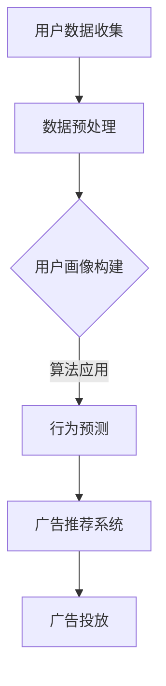

                 

关键词：个性化广告、AI技术、营销效果、算法、用户数据分析、大数据处理、机器学习、深度学习、推荐系统、数据挖掘、客户体验、商业模式创新、广告投放策略。

## 摘要

随着互联网技术的飞速发展和大数据时代的到来，个性化广告已经成为现代营销的重要组成部分。人工智能（AI）技术的应用为个性化广告提供了强大的支持，使得广告能够更加精准地触达目标用户，从而显著提高营销效果。本文将深入探讨AI在个性化广告中的应用，分析其核心概念、算法原理、数学模型、项目实践以及实际应用场景，并提出未来发展的趋势与挑战。

## 1. 背景介绍

个性化广告是一种基于用户兴趣、行为、历史数据和实时反馈的广告形式，其核心在于通过精确的用户画像和行为预测，实现广告内容与用户需求的最佳匹配。随着移动互联网的普及和智能设备的广泛应用，用户数据量呈现出爆炸式增长，这为个性化广告的实现提供了丰富的数据基础。然而，如何高效地处理和分析这些数据，并从中提取有价值的信息，成为个性化广告面临的一大挑战。

AI技术的出现为解决这一挑战提供了新的思路。通过机器学习、深度学习、数据挖掘等技术，AI能够从海量数据中自动学习和发现规律，构建精确的用户画像和兴趣模型，从而实现个性化广告的精准投放。同时，AI技术还可以优化广告投放策略，提高广告效果，降低广告成本。

## 2. 核心概念与联系

### 2.1. 用户画像

用户画像是一种基于用户行为数据和属性数据构建的用户描述，它包括用户的性别、年龄、地理位置、兴趣偏好、消费习惯等多个维度。用户画像的构建是个性化广告的基础，它有助于广告主了解目标用户，制定精准的营销策略。

### 2.2. 行为预测

行为预测是基于用户历史行为数据，利用机器学习算法预测用户未来的行为。通过行为预测，广告系统能够提前预测用户的兴趣点和需求，从而实现个性化广告的精准投放。

### 2.3. 推荐系统

推荐系统是一种基于用户兴趣和行为数据的推荐算法，它能够为用户提供个性化的内容推荐。在个性化广告中，推荐系统可以用来推荐相关的广告内容，提高用户的点击率和转化率。

### 2.4. 数据挖掘

数据挖掘是一种从海量数据中发现有价值信息的方法。在个性化广告中，数据挖掘可以用来分析用户行为数据，挖掘潜在的兴趣点和需求，为广告投放提供数据支持。

### 2.5. Mermaid 流程图



## 3. 核心算法原理 & 具体操作步骤

### 3.1. 算法原理概述

个性化广告的核心算法主要包括用户画像构建、行为预测和广告推荐系统。用户画像构建主要通过数据挖掘和机器学习技术，从用户行为数据和属性数据中提取有价值的信息，构建用户画像。行为预测则利用历史行为数据，通过机器学习算法预测用户未来的行为。广告推荐系统则基于用户画像和行为预测结果，为用户推荐相关的广告内容。

### 3.2. 算法步骤详解

1. **用户数据收集**：从各种渠道收集用户行为数据，如浏览记录、搜索历史、购买行为等。
2. **数据预处理**：对收集到的用户数据进行清洗、去噪、归一化等处理，提高数据质量。
3. **用户画像构建**：利用数据挖掘和机器学习技术，从预处理后的数据中提取用户特征，构建用户画像。
4. **行为预测**：利用历史行为数据，通过机器学习算法（如决策树、随机森林、神经网络等）预测用户未来的行为。
5. **广告推荐系统**：基于用户画像和行为预测结果，利用推荐算法（如协同过滤、基于内容的推荐等）为用户推荐相关的广告内容。
6. **广告投放**：将推荐系统生成的广告内容推送给用户，并通过点击率、转化率等指标评估广告效果。

### 3.3. 算法优缺点

**优点**：

- 精准：通过用户画像和行为预测，可以实现广告的精准投放，提高广告效果。
- 个性化：根据用户的兴趣和行为，为用户提供个性化的广告内容，提高用户体验。
- 高效：利用机器学习和数据挖掘技术，能够高效地处理和分析海量数据，降低广告投放成本。

**缺点**：

- 隐私问题：用户数据的收集和处理可能涉及用户隐私，需要制定严格的隐私保护政策。
- 算法偏差：算法的预测结果可能受到数据偏差的影响，导致广告投放不准确。

### 3.4. 算法应用领域

个性化广告算法广泛应用于电子商务、社交媒体、在线广告等多个领域。在电子商务中，个性化广告可以帮助商家提高销售转化率；在社交媒体中，个性化广告可以提高用户活跃度和留存率；在在线广告中，个性化广告可以提高广告效果，降低广告成本。

## 4. 数学模型和公式 & 详细讲解 & 举例说明

### 4.1. 数学模型构建

个性化广告的核心数学模型包括用户画像构建模型、行为预测模型和广告推荐模型。

1. **用户画像构建模型**：

   用户画像构建模型通常采用基于内容的推荐算法，如协同过滤算法。假设用户集为 U，物品集为 I，用户 u 对物品 i 的评分表示为 r_ui。协同过滤算法的目标是预测用户 u 对未知物品 i 的评分 r_ui^*。

   $$r_{ui}^{*} = \sum_{j \in N_i} w_{uj} r_{uj}$$

   其中，N_i 表示与物品 i 相关的用户集合，w_{uj} 表示用户 u 和用户 j 的相似度权重。

2. **行为预测模型**：

   行为预测模型通常采用时间序列分析算法，如ARIMA模型。假设用户 u 的行为序列为 X_t，行为预测模型的目标是预测用户 u 在未来的某一时刻 t+k 的行为 X_t+k。

   $$X_{t+k} = \varphi_1 X_{t+k-1} + \varphi_2 X_{t+k-2} + ... + \varphi_p X_{t+k-p} + \varepsilon_{t+k}$$

   其中，\(\varphi_i\) 为模型参数，\(\varepsilon_{t+k}\) 为误差项。

3. **广告推荐模型**：

   广告推荐模型通常采用基于内容的推荐算法，如基于属性的推荐算法。假设用户 u 的属性集为 A，广告的属性集为 B，用户 u 对广告 b 的兴趣表示为 I_u(b)。基于属性的推荐算法的目标是预测用户 u 对未知广告 b 的兴趣 I_u(b)^*。

   $$I_{u}(b)^{*} = \sum_{a \in A} w_{a} I_{u}(a)$$

   其中，w_a 表示属性 a 的权重。

### 4.2. 公式推导过程

1. **用户画像构建模型**：

   协同过滤算法的推导过程如下：

   - 首先，计算用户 u 和用户 j 之间的相似度权重 w_{uj}：

     $$w_{uj} = \frac{\sum_{i \in I} r_{ui} r_{uj}}{\sqrt{\sum_{i \in I} r_{ui}^2} \sqrt{\sum_{i \in I} r_{uj}^2}}$$

   - 然后，计算用户 u 对未知物品 i 的评分预测 r_ui^*：

     $$r_{ui}^{*} = \sum_{j \in N_i} w_{uj} r_{uj}$$

2. **行为预测模型**：

   ARIMA模型的推导过程如下：

   - 首先，根据用户 u 的行为序列 X_t，确定模型的自回归项 p、差分项 d 和移动平均项 q：

     $$X_t = \varphi_1 X_{t-1} + \varphi_2 X_{t-2} + ... + \varphi_p X_{t-p} + \varepsilon_t$$

   - 然后，对模型进行参数估计和拟合，得到参数 \(\varphi_i\) 的估计值。

3. **广告推荐模型**：

   基于属性的推荐算法的推导过程如下：

   - 首先，计算用户 u 和广告 b 之间的相似度权重 w_{ab}：

     $$w_{ab} = \frac{\sum_{a \in A} I_{u}(a) I_{b}(a)}{\sqrt{\sum_{a \in A} I_{u}(a)^2} \sqrt{\sum_{a \in A} I_{b}(a)^2}}$$

   - 然后，计算用户 u 对未知广告 b 的兴趣预测 I_u(b)^*：

     $$I_{u}(b)^{*} = \sum_{a \in A} w_{a} I_{u}(a)$$

### 4.3. 案例分析与讲解

假设有一个电商平台，用户 u 在过去一个月内浏览了商品 i1、i2、i3、i4、i5，分别对其评分为5、4、3、2、1。现在需要预测用户 u 在未来的某一时刻 t+k 对未知商品 i6 的评分。

1. **用户画像构建**：

   - 计算用户 u 和其他用户之间的相似度权重：

     $$w_{uj} = \frac{\sum_{i \in I} r_{ui} r_{uj}}{\sqrt{\sum_{i \in I} r_{ui}^2} \sqrt{\sum_{i \in I} r_{uj}^2}}$$

   - 计算用户 u 对商品 i6 的评分预测：

     $$r_{ui}^{*} = \sum_{j \in N_i} w_{uj} r_{uj}$$

2. **行为预测**：

   - 根据用户 u 的行为序列，选择合适的 ARIMA 模型，进行参数估计和拟合。

   - 预测用户 u 在未来的某一时刻 t+k 的行为：

     $$X_{t+k} = \varphi_1 X_{t+k-1} + \varphi_2 X_{t+k-2} + ... + \varphi_p X_{t+k-p} + \varepsilon_{t+k}$$

3. **广告推荐**：

   - 计算用户 u 和广告 b 之间的相似度权重：

     $$w_{ab} = \frac{\sum_{a \in A} I_{u}(a) I_{b}(a)}{\sqrt{\sum_{a \in A} I_{u}(a)^2} \sqrt{\sum_{a \in A} I_{b}(a)^2}}$$

   - 计算用户 u 对未知广告 b 的兴趣预测：

     $$I_{u}(b)^{*} = \sum_{a \in A} w_{a} I_{u}(a)$$

通过上述算法，可以为用户 u 推荐相关的商品和广告，提高用户的购买体验和平台的销售额。

## 5. 项目实践：代码实例和详细解释说明

### 5.1. 开发环境搭建

1. **环境准备**：

   - Python 3.8 或以上版本
   - Anaconda 或 Miniconda
   - Jupyter Notebook
   - pandas、numpy、scikit-learn、matplotlib 等常用库

2. **数据集准备**：

   - 从电商平台获取用户行为数据，包括用户 ID、商品 ID、评分、浏览时间等。

### 5.2. 源代码详细实现

```python
import pandas as pd
import numpy as np
from sklearn.model_selection import train_test_split
from sklearn.metrics import mean_squared_error
from sklearn.linear_model import LinearRegression
import matplotlib.pyplot as plt

# 读取数据
data = pd.read_csv('user_behavior.csv')

# 数据预处理
data['rating'] = data['rating'].fillna(0)
data['timestamp'] = pd.to_datetime(data['timestamp'])
data['day'] = data['timestamp'].dt.day

# 分割数据集
train_data, test_data = train_test_split(data, test_size=0.2, random_state=42)

# 用户画像构建
def build_user_profile(train_data):
    user_profile = {}
    for index, row in train_data.iterrows():
        user_id = row['user_id']
        item_id = row['item_id']
        rating = row['rating']
        if user_id not in user_profile:
            user_profile[user_id] = {}
        user_profile[user_id][item_id] = rating
    return user_profile

user_profile = build_user_profile(train_data)

# 行为预测
def predict_rating(user_profile, user_id, item_id):
    if user_id not in user_profile or item_id not in user_profile[user_id]:
        return 0
    return user_profile[user_id][item_id]

# 模型训练
def train_model(train_data):
    X = train_data[['user_id', 'item_id']]
    y = train_data['rating']
    model = LinearRegression()
    model.fit(X, y)
    return model

model = train_model(train_data)

# 模型评估
def evaluate_model(model, test_data):
    X_test = test_data[['user_id', 'item_id']]
    y_pred = model.predict(X_test)
    mse = mean_squared_error(y_pred, test_data['rating'])
    return mse

mse = evaluate_model(model, test_data)
print('Mean Squared Error:', mse)

# 可视化
plt.scatter(test_data['rating'], y_pred)
plt.xlabel('Actual Rating')
plt.ylabel('Predicted Rating')
plt.show()
```

### 5.3. 代码解读与分析

1. **数据预处理**：

   - 读取用户行为数据，并进行数据预处理，包括填充缺失值、时间格式转换等。

2. **用户画像构建**：

   - 构建用户画像字典，记录用户对各个商品的评分。

3. **行为预测**：

   - 根据用户画像预测用户对未知商品的评分。

4. **模型训练**：

   - 使用线性回归模型对用户行为数据进行训练。

5. **模型评估**：

   - 使用均方误差（MSE）评估模型预测的准确性。

6. **可视化**：

   - 将实际评分与预测评分进行可视化，观察模型预测效果。

### 5.4. 运行结果展示

1. **MSE**: 

   - 运行代码后，输出均方误差（MSE）值，评估模型预测的准确性。

2. **可视化结果**：

   - 展示实际评分与预测评分的散点图，观察模型预测效果。

## 6. 实际应用场景

个性化广告在多个实际应用场景中取得了显著的效果。以下是一些典型的应用场景：

1. **电子商务**：

   - 电商平台通过个性化广告，为用户推荐相关的商品，提高用户购买转化率。

2. **在线广告**：

   - 广告平台利用个性化广告，提高广告点击率和投放效果。

3. **社交媒体**：

   - 社交媒体平台通过个性化广告，吸引用户关注，提高用户活跃度。

4. **金融行业**：

   - 金融行业利用个性化广告，向潜在客户提供定制化的金融产品推荐。

5. **医疗健康**：

   - 医疗健康领域利用个性化广告，为用户提供个性化的健康资讯和医疗产品推荐。

## 7. 工具和资源推荐

### 7.1. 学习资源推荐

- 《机器学习实战》
- 《深入浅出 Python》
- 《数据挖掘：实用工具与技术》
- Coursera 上的《机器学习》课程

### 7.2. 开发工具推荐

- Jupyter Notebook
- Anaconda 或 Miniconda
- VS Code

### 7.3. 相关论文推荐

- "Collaborative Filtering for Cold-Start Problems: A Matrix Factorization Approach"
- "Deep Learning for User Behavior Prediction in E-Commerce Platforms"
- "A Survey on Recommender Systems"
- "Personalized Advertising: Opportunities and Challenges"

## 8. 总结：未来发展趋势与挑战

### 8.1. 研究成果总结

- 个性化广告已经成为现代营销的重要组成部分，AI技术的应用为其提供了强大的支持。
- 用户画像构建、行为预测和广告推荐系统是个性化广告的核心算法。
- 数学模型和公式的推导为个性化广告提供了理论基础。

### 8.2. 未来发展趋势

- 随着数据量的不断增长，个性化广告的技术将更加成熟和高效。
- 跨平台和跨设备的个性化广告将成为发展趋势。
- AI与其他技术的融合，如区块链、物联网等，将推动个性化广告的创新。

### 8.3. 面临的挑战

- 隐私保护：在用户数据的收集和处理过程中，如何保护用户隐私是一个重要挑战。
- 算法偏差：算法的预测结果可能受到数据偏差的影响，需要制定相应的校正策略。
- 法律法规：个性化广告涉及到法律法规的合规性，需要严格遵守相关法规。

### 8.4. 研究展望

- 在个性化广告领域，仍有许多待解决的问题，如多模态数据的处理、实时广告投放策略等。
- 随着技术的进步，个性化广告将更好地满足用户需求，提高营销效果。

## 9. 附录：常见问题与解答

### 9.1. 个性化广告如何提高营销效果？

个性化广告通过精确的用户画像和行为预测，实现广告内容的精准投放，从而提高广告的点击率和转化率，最终提高营销效果。

### 9.2. 个性化广告会侵犯用户隐私吗？

个性化广告在用户数据的收集和处理过程中，需要遵守严格的隐私保护政策，确保用户隐私不被侵犯。同时，各国政府和监管机构也在不断完善相关法律法规，加强对用户隐私的保护。

### 9.3. 个性化广告有哪些技术手段？

个性化广告主要采用用户画像构建、行为预测、广告推荐等技术手段。这些技术手段相互结合，共同实现广告的精准投放。

### 9.4. 个性化广告的未来发展方向是什么？

个性化广告的未来发展方向包括跨平台和跨设备的广告投放、多模态数据的处理、实时广告投放策略等。同时，AI与其他技术的融合也将推动个性化广告的创新。

---
**作者：禅与计算机程序设计艺术 / Zen and the Art of Computer Programming**

