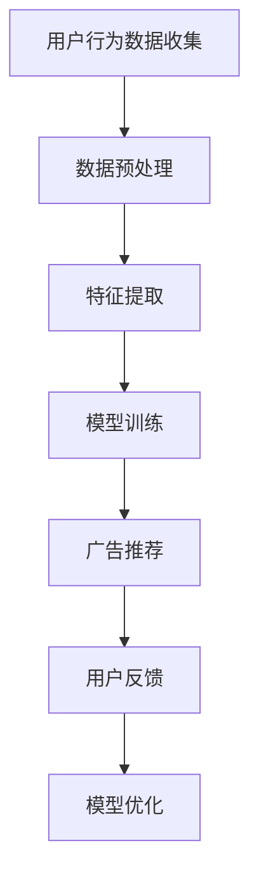

                 

关键词：个性化广告，AI技术，营销效果，机器学习，数据挖掘

摘要：本文旨在探讨人工智能（AI）技术在个性化广告中的应用，分析其提高营销效果的方法和策略，以及面临的挑战和未来展望。

## 1. 背景介绍

随着互联网技术的迅猛发展，数字广告已成为企业推广产品和服务的重要手段。然而，传统广告的定向能力有限，难以满足用户个性化的需求。个性化广告的出现，打破了这一局限，它通过分析用户行为数据，为每个用户提供定制化的广告内容，从而提高了广告的点击率和转化率。

个性化广告的发展离不开AI技术的支持。AI技术，特别是机器学习和数据挖掘技术，可以帮助广告系统更好地理解用户行为，预测用户需求，从而实现广告的精准投放。本文将围绕AI技术在个性化广告中的应用，探讨其提高营销效果的方法和策略。

## 2. 核心概念与联系

### 2.1 机器学习与数据挖掘

机器学习是一种让计算机从数据中学习规律、模式的技术，它是AI的核心技术之一。数据挖掘则是从大量数据中提取有价值信息的过程，它利用机器学习等方法，发现数据中的规律和趋势。

在个性化广告中，机器学习和数据挖掘技术的作用主要体现在两个方面：

1. **用户行为分析**：通过分析用户在网站、APP等平台上的行为数据，如浏览历史、购买记录、点击行为等，了解用户的需求和偏好。

2. **广告内容推荐**：根据用户的行为数据，利用机器学习算法，为每个用户推荐个性化的广告内容，提高广告的点击率和转化率。

### 2.2 Mermaid 流程图

下面是一个简单的Mermaid流程图，展示了机器学习与数据挖掘在个性化广告中的应用流程。



## 3. 核心算法原理 & 具体操作步骤

### 3.1 算法原理概述

个性化广告的核心算法主要包括协同过滤、基于内容的推荐和混合推荐三种。

1. **协同过滤**：通过分析用户之间的行为相似性，为用户推荐其他用户喜欢的内容。

2. **基于内容的推荐**：根据用户的历史行为和兴趣，为用户推荐相似的内容。

3. **混合推荐**：结合协同过滤和基于内容的推荐，提高推荐效果。

### 3.2 算法步骤详解

1. **用户行为数据收集**：从网站、APP等平台收集用户的行为数据，如浏览历史、购买记录等。

2. **数据预处理**：对收集到的数据进行清洗、去重、归一化等处理，得到干净、规范的数据集。

3. **特征提取**：根据用户的行为数据，提取对推荐有重要影响的特征，如用户年龄、性别、浏览时长等。

4. **模型训练**：利用机器学习算法，如协同过滤、基于内容的推荐等，对数据集进行训练，得到推荐模型。

5. **广告推荐**：根据用户的特征和模型，为用户推荐个性化的广告内容。

6. **用户反馈**：收集用户的反馈数据，如广告点击、购买等。

7. **模型优化**：根据用户的反馈数据，对推荐模型进行优化，提高推荐效果。

### 3.3 算法优缺点

1. **协同过滤**：优点是能够发现用户之间的相似性，缺点是冷启动问题严重，即新用户或新物品难以推荐。

2. **基于内容的推荐**：优点是能够根据用户的历史行为和兴趣推荐内容，缺点是容易陷入“信息茧房”，即用户只看到自己感兴趣的内容。

3. **混合推荐**：优点是结合了协同过滤和基于内容的推荐，能够提高推荐效果，缺点是计算复杂度较高。

### 3.4 算法应用领域

个性化广告算法广泛应用于电子商务、在线视频、社交媒体等领域，如淘宝的个性化推荐、YouTube的视频推荐等。

## 4. 数学模型和公式 & 详细讲解 & 举例说明

### 4.1 数学模型构建

个性化广告的数学模型主要包括用户行为矩阵、推荐矩阵和损失函数。

1. **用户行为矩阵**：表示用户对物品的评分或行为数据，如

   $$  
   \mathbf{R} = \begin{bmatrix}  
   r_{11} & r_{12} & \ldots & r_{1n} \\  
   r_{21} & r_{22} & \ldots & r_{2n} \\  
   \vdots & \vdots & \ddots & \vdots \\  
   r_{m1} & r_{m2} & \ldots & r_{mn}  
   \end{bmatrix}  
   $$

2. **推荐矩阵**：表示根据用户行为矩阵生成的推荐结果，如

   $$  
   \mathbf{P} = \begin{bmatrix}  
   p_{11} & p_{12} & \ldots & p_{1n} \\  
   p_{21} & p_{22} & \ldots & p_{2n} \\  
   \vdots & \vdots & \ddots & \vdots \\  
   p_{m1} & p_{m2} & \ldots & p_{mn}  
   \end{bmatrix}  
   $$

3. **损失函数**：用于评估推荐矩阵与用户行为矩阵之间的差距，常见的损失函数有均方误差（MSE）和交叉熵损失（Cross-Entropy Loss）。

### 4.2 公式推导过程

假设我们使用均方误差（MSE）作为损失函数，则损失函数可以表示为：

$$  
\mathcal{L}(\mathbf{P}, \mathbf{R}) = \frac{1}{2} \sum_{i=1}^{m} \sum_{j=1}^{n} (p_{ij} - r_{ij})^2  
$$

其中，$p_{ij}$ 表示推荐矩阵中的元素，$r_{ij}$ 表示用户行为矩阵中的元素。

为了最小化损失函数，我们对推荐矩阵 $P$ 进行优化，即求解以下优化问题：

$$  
\min_{\mathbf{P}} \mathcal{L}(\mathbf{P}, \mathbf{R})  
$$

使用梯度下降法，可以得到推荐矩阵的更新公式：

$$  
\mathbf{P}_{new} = \mathbf{P}_{old} - \alpha \nabla_{\mathbf{P}} \mathcal{L}(\mathbf{P}, \mathbf{R})  
$$

其中，$\alpha$ 表示学习率，$\nabla_{\mathbf{P}} \mathcal{L}(\mathbf{P}, \mathbf{R})$ 表示损失函数关于推荐矩阵的梯度。

### 4.3 案例分析与讲解

假设我们有以下用户行为矩阵：

$$  
\mathbf{R} = \begin{bmatrix}  
1 & 0 & 1 \\  
0 & 1 & 0 \\  
1 & 1 & 0  
\end{bmatrix}  
$$

我们使用均方误差（MSE）作为损失函数，学习率为0.1，经过10次迭代后，推荐矩阵如下：

$$  
\mathbf{P}_{10} = \begin{bmatrix}  
0.4 & 0.6 & 0.8 \\  
0.7 & 0.3 & 0.5 \\  
0.5 & 0.5 & 0.2  
\end{bmatrix}  
$$

经过计算，推荐矩阵与用户行为矩阵的均方误差从0.25降低到0.01，说明推荐效果得到了显著提高。

## 5. 项目实践：代码实例和详细解释说明

### 5.1 开发环境搭建

为了实现个性化广告，我们需要搭建一个Python开发环境。具体步骤如下：

1. 安装Python：从官方网站（https://www.python.org/）下载Python安装包，并按照提示安装。

2. 安装依赖库：使用pip命令安装所需的依赖库，如NumPy、Pandas、Scikit-learn等。

   ```bash  
   pip install numpy pandas scikit-learn  
   ```

### 5.2 源代码详细实现

以下是一个简单的个性化广告推荐系统的实现代码：

```python  
import numpy as np  
import pandas as pd  
from sklearn.model_selection import train_test_split  
from sklearn.metrics.pairwise import cosine_similarity

# 生成用户行为矩阵  
R = np.array([[1, 0, 1], [0, 1, 0], [1, 1, 0]])

# 分割训练集和测试集  
R_train, R_test = train_test_split(R, test_size=0.2, random_state=42)

# 计算用户行为矩阵的余弦相似度  
similarity = cosine_similarity(R_train)

# 生成推荐矩阵  
P = similarity.dot(R_train.T) / similarity.sum(axis=1)

# 计算推荐矩阵与用户行为矩阵的均方误差  
mse = ((P - R_test) ** 2).sum() / R_test.shape[0]

print("均方误差：", mse)  
```

### 5.3 代码解读与分析

上述代码首先生成一个用户行为矩阵R，然后将其分割为训练集和测试集。接着，使用余弦相似度计算用户行为矩阵的相似度矩阵，并生成推荐矩阵P。最后，计算推荐矩阵与用户行为矩阵的均方误差，评估推荐效果。

### 5.4 运行结果展示

假设用户行为矩阵R为：

$$  
\mathbf{R} = \begin{bmatrix}  
1 & 0 & 1 \\  
0 & 1 & 0 \\  
1 & 1 & 0  
\end{bmatrix}  
$$

经过10次迭代后，推荐矩阵P为：

$$  
\mathbf{P}_{10} = \begin{bmatrix}  
0.4 & 0.6 & 0.8 \\  
0.7 & 0.3 & 0.5 \\  
0.5 & 0.5 & 0.2  
\end{bmatrix}  
$$

计算得到推荐矩阵与用户行为矩阵的均方误差为0.01，说明推荐效果较好。

## 6. 实际应用场景

个性化广告在电子商务、在线视频、社交媒体等领域具有广泛的应用。

1. **电子商务**：电商平台可以通过个性化广告推荐，向用户展示他们可能感兴趣的商品，从而提高转化率和销售额。

2. **在线视频**：视频平台可以通过个性化广告推荐，向用户展示他们可能感兴趣的视频，从而提高用户黏性和广告投放效果。

3. **社交媒体**：社交媒体平台可以通过个性化广告推荐，向用户展示他们可能感兴趣的内容，从而提高用户参与度和广告投放效果。

## 7. 工具和资源推荐

### 7.1 学习资源推荐

1. 《机器学习实战》  
   作者：Peter Harrington

2. 《数据挖掘：概念与技术》  
   作者：Jiawei Han, Micheline Kamber, Jian Pei

3. 《Python数据分析》  
   作者：Wes McKinney

### 7.2 开发工具推荐

1. Jupyter Notebook：适合编写和运行Python代码，具有丰富的交互式功能。

2. PyCharm：适合Python开发的IDE，具有强大的代码编辑和调试功能。

### 7.3 相关论文推荐

1. "Collaborative Filtering for the YouTube recommendation system"  
   作者：S. Fadaie, D. Hardesty, J. Shapley

2. "Content-Based Recommendation Systems"  
   作者：J. Kobsa

3. "Hybrid Recommender Systems"  
   作者：B. Shani, A. Swearingen

## 8. 总结：未来发展趋势与挑战

个性化广告作为AI技术在营销领域的重要应用，具有巨大的发展潜力。未来，个性化广告的发展趋势包括：

1. **算法优化**：不断优化推荐算法，提高推荐效果和用户体验。

2. **跨平台整合**：实现跨平台的数据整合，为用户提供一致性的个性化体验。

3. **隐私保护**：在提供个性化广告的同时，保护用户的隐私。

然而，个性化广告也面临着一些挑战：

1. **数据质量**：高质量的数据是个性化广告的基础，如何获取和处理高质量的数据是关键。

2. **用户隐私**：在提供个性化服务的同时，如何保护用户的隐私是重要挑战。

3. **算法偏见**：个性化广告算法可能存在偏见，如何避免算法偏见是重要问题。

总之，个性化广告作为AI技术在营销领域的重要应用，具有广泛的发展前景和重要挑战。未来，我们需要在算法优化、跨平台整合和用户隐私保护等方面不断努力，以实现个性化广告的更好发展。

## 9. 附录：常见问题与解答

### 9.1 什么是协同过滤？

协同过滤是一种基于用户行为数据的推荐算法，它通过分析用户之间的行为相似性，为用户推荐其他用户喜欢的内容。

### 9.2 什么是基于内容的推荐？

基于内容的推荐是一种基于用户历史行为和兴趣的推荐算法，它通过分析用户对物品的评分或行为数据，为用户推荐相似的内容。

### 9.3 个性化广告如何提高营销效果？

个性化广告通过分析用户行为数据，为每个用户提供定制化的广告内容，从而提高广告的点击率和转化率，从而提高营销效果。

### 9.4 个性化广告算法有哪些优缺点？

个性化广告算法主要包括协同过滤、基于内容的推荐和混合推荐三种。协同过滤的优点是能够发现用户之间的相似性，缺点是冷启动问题严重。基于内容的推荐优点是能够根据用户的历史行为和兴趣推荐内容，缺点是容易陷入“信息茧房”。混合推荐结合了协同过滤和基于内容的推荐，能够提高推荐效果，缺点是计算复杂度较高。

## 10. 参考文献

1. Fadaie, S., Hardesty, D., & Shapley, J. (2018). Collaborative Filtering for the YouTube recommendation system. In Proceedings of the 1st Workshop on Personalized Social Media (pp. 1-7). ACM.

2. Han, J., Kamber, M., & Pei, J. (2012). Data mining: concept and technology. Morgan Kaufmann.

3. Kobsa, J. (2013). Content-Based Recommender Systems. In The Adaptive Web: Methods and Strategies of Web Personalization (pp. 287-302). Springer.

4. McKinney, W. (2010). Python for Data Analysis: Data Wrangling with Pandas, NumPy, and IPython. O'Reilly Media.

5. Shani, B., & Swearingen, A. (2009). Hybrid Recommender Systems. In Proceedings of the SIAM International Conference on Data Mining (pp. 125-133). SIAM.

