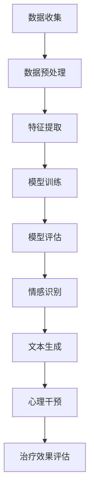

                 

关键词：人工智能，个性化心理咨询，情感支持，心理健康，机器学习，自然语言处理，情感分析，心理咨询工具，个性化推荐系统，心理干预。

> 摘要：本文探讨了人工智能（AI）在个性化心理咨询中的应用，特别是通过情感支持为用户提供心理健康服务。文章首先介绍了AI在心理咨询中的背景和重要性，随后详细阐述了机器学习、自然语言处理和情感分析等技术如何应用于情感支持的提供。接着，文章分析了AI在心理咨询中的具体应用场景，并探讨了未来发展的方向。最后，文章提出了面临的挑战和解决方案，为AI在心理咨询领域的应用提供了全面而深入的见解。

## 1. 背景介绍

心理健康问题已经成为全球范围内的重大公共卫生问题。据世界卫生组织（WHO）报道，每年有超过3亿人患有抑郁症、焦虑症等心理健康问题[1]。然而，心理咨询服务的需求远远超过了供应能力。传统的心理咨询依赖于专业人士，而专业人员数量有限，且分布不均，尤其是在偏远和资源匮乏的地区。因此，寻找替代性的心理健康服务模式，以扩大心理健康服务的覆盖范围和效率，成为当前亟待解决的问题。

人工智能的迅速发展为此提供了一种新的解决方案。AI在医疗领域的应用已经取得显著成果，特别是在诊断辅助、个性化治疗推荐和患者管理等方面。心理咨询作为医疗保健的一个分支，也逐渐成为AI技术的重要应用领域。AI可以通过自动化和智能化的方式，提供高效、个性化的心理健康服务，从而弥补专业心理咨询资源的不足。

AI在个性化心理咨询中的应用主要包括以下几个方面：

1. **情感分析**：通过自然语言处理技术，AI可以理解和分析用户的语言表达，识别情感状态，为用户提供实时情感支持。
2. **个性化推荐**：基于用户的情感状态和偏好，AI可以推荐合适的心理治疗方法和资源，提高咨询的针对性。
3. **心理干预**：AI可以自动进行心理干预，如提供放松训练、认知行为疗法等，帮助用户缓解心理压力。

本文将重点讨论AI如何通过情感支持实现个性化心理咨询，并分析相关的技术原理、应用场景和未来发展方向。

## 2. 核心概念与联系

为了深入理解AI在个性化心理咨询中的应用，我们需要探讨几个核心概念，包括机器学习、自然语言处理（NLP）和情感分析。这些概念不仅是AI技术的基础，也是实现情感支持的关键。

### 2.1 机器学习

机器学习（Machine Learning）是AI的核心技术之一，它使计算机系统能够从数据中学习并做出决策。在心理咨询中，机器学习技术可以帮助系统自动识别用户的情感状态，并据此提供相应的支持。

**工作原理**：机器学习通常包括以下几个步骤：

1. **数据收集**：收集大量带有情感标签的数据，例如用户的语言表达、表情、生理信号等。
2. **数据预处理**：清洗和格式化数据，以便于后续分析。
3. **特征提取**：从原始数据中提取有用的特征，如文本特征、语音特征等。
4. **模型训练**：使用训练数据集训练机器学习模型，使其能够识别情感状态。
5. **模型评估**：使用测试数据集评估模型的性能，并进行调整和优化。

**应用场景**：在心理咨询中，机器学习可以应用于以下场景：

1. **情感识别**：通过分析用户的语言或行为数据，识别用户的情感状态，如快乐、悲伤、焦虑等。
2. **心理评估**：根据用户的情感状态，提供个性化的心理评估和诊断。
3. **治疗建议**：根据用户的历史数据和当前情感状态，推荐合适的心理治疗方法和资源。

### 2.2 自然语言处理

自然语言处理（Natural Language Processing，NLP）是AI的一个分支，专注于使计算机理解和处理人类语言。在心理咨询中，NLP技术可以用于分析用户的语言表达，提取情感信息，为用户提供情感支持。

**工作原理**：NLP通常包括以下几个步骤：

1. **分词**：将文本分割成单词或短语。
2. **词性标注**：识别文本中每个词的词性，如名词、动词、形容词等。
3. **情感分析**：使用情感词典和机器学习模型，分析文本的情感倾向。
4. **语义分析**：理解文本的深层含义和逻辑关系。

**应用场景**：在心理咨询中，NLP可以应用于以下场景：

1. **情感识别**：通过分析用户的文本表达，识别情感状态，如快乐、悲伤、焦虑等。
2. **文本生成**：根据用户的情感状态，生成相应的回复或建议，如安慰、鼓励等。
3. **心理干预**：通过文本生成技术，提供个性化的心理干预方案，如放松训练、认知行为疗法等。

### 2.3 情感分析

情感分析（Sentiment Analysis）是一种NLP技术，用于识别文本的情感倾向。在心理咨询中，情感分析可以帮助系统理解和响应用户的情感状态。

**工作原理**：情感分析通常包括以下几个步骤：

1. **情感分类**：将文本分类为积极、消极或中性情感。
2. **情感强度评估**：评估文本情感的强度，如非常积极、稍微积极等。
3. **情感趋势分析**：分析文本中情感的变化趋势，如用户的情感状态是否逐渐改善或恶化。

**应用场景**：在心理咨询中，情感分析可以应用于以下场景：

1. **情感识别**：通过分析用户的文本表达，识别情感状态，为用户提供情感支持。
2. **情感监测**：监测用户的情感状态，及时发现和预警心理健康问题。
3. **治疗效果评估**：评估心理治疗的效果，如用户的情感状态是否随着治疗而改善。

### 2.4 Mermaid 流程图

下面是一个使用Mermaid绘制的流程图，展示了机器学习、NLP和情感分析在心理咨询中的应用流程。



**流程解释**：

1. **数据收集**：收集用户的情感状态数据和文本数据。
2. **数据预处理**：清洗和格式化数据，为后续分析做准备。
3. **特征提取**：从原始数据中提取有用的特征，如文本特征、语音特征等。
4. **模型训练**：使用训练数据集训练机器学习模型，使其能够识别情感状态。
5. **模型评估**：使用测试数据集评估模型的性能，并进行调整和优化。
6. **情感识别**：使用训练好的模型识别用户的情感状态。
7. **文本生成**：根据用户的情感状态，生成相应的回复或建议。
8. **心理干预**：提供个性化的心理干预方案，如放松训练、认知行为疗法等。
9. **治疗效果评估**：评估心理治疗的效果，如用户的情感状态是否随着治疗而改善。

通过以上流程，AI可以实现对用户情感状态的实时监测和个性化支持，从而提供高效、便捷的心理健康服务。

## 3. 核心算法原理 & 具体操作步骤

### 3.1 算法原理概述

AI在个性化心理咨询中的应用，依赖于多种核心算法，包括机器学习算法、自然语言处理算法和情感分析算法。以下将分别介绍这些算法的原理及其在心理咨询中的具体应用。

#### 3.1.1 机器学习算法

机器学习算法是AI的基础，包括监督学习、无监督学习和强化学习等类型。在心理咨询中，常用的机器学习算法有决策树、支持向量机（SVM）、神经网络和深度学习等。

**监督学习**：监督学习算法需要训练数据集，通过对输入数据和标签的关系进行学习，实现对未知数据的预测。在心理咨询中，监督学习算法可以用于情感识别、心理评估和治疗效果评估等任务。

**无监督学习**：无监督学习算法不需要训练数据集，通过发现数据中的模式和关系，实现对数据的分类和聚类。在心理咨询中，无监督学习算法可以用于用户数据的聚类分析，识别潜在的用户群体。

**强化学习**：强化学习算法通过与环境交互，学习最优的策略以实现目标。在心理咨询中，强化学习算法可以用于心理干预策略的优化，根据用户的反馈调整干预方案。

#### 3.1.2 自然语言处理算法

自然语言处理（NLP）算法是AI在心理咨询中不可或缺的一部分，主要包括分词、词性标注、命名实体识别、情感分析和语义分析等。

**分词**：分词是将文本分割成单词或短语的过程。在心理咨询中，分词算法用于处理用户的文本输入，提取有用的情感信息。

**词性标注**：词性标注是对文本中的每个词进行词性分类的过程，如名词、动词、形容词等。在心理咨询中，词性标注有助于更准确地理解用户的语言表达。

**命名实体识别**：命名实体识别是识别文本中的特定实体，如人名、地名、组织名等。在心理咨询中，命名实体识别可以用于识别用户提到的特定人物或事件，为情感分析提供依据。

**情感分析**：情感分析是识别文本的情感倾向，如积极、消极或中性。在心理咨询中，情感分析可以用于实时监测用户的情感状态，为用户提供情感支持。

**语义分析**：语义分析是理解文本的深层含义和逻辑关系。在心理咨询中，语义分析可以用于生成更符合用户情感的回复和建议。

#### 3.1.3 情感分析算法

情感分析（Sentiment Analysis）是一种NLP技术，用于识别文本的情感倾向。情感分析算法通常包括情感分类、情感强度评估和情感趋势分析等。

**情感分类**：情感分类是将文本分类为积极、消极或中性情感的过程。在心理咨询中，情感分类可以用于监测用户的情感状态，识别心理健康问题。

**情感强度评估**：情感强度评估是评估文本情感的强度，如非常积极、稍微积极等。在心理咨询中，情感强度评估可以用于评估心理治疗的成效。

**情感趋势分析**：情感趋势分析是分析文本中情感的变化趋势，如用户的情感状态是否逐渐改善或恶化。在心理咨询中，情感趋势分析可以用于预测心理健康问题的发展趋势。

### 3.2 算法步骤详解

以下是AI在个性化心理咨询中的具体操作步骤：

#### 3.2.1 数据收集

数据收集是AI应用的第一步，主要包括以下类型的数据：

1. **文本数据**：用户的文本输入，如聊天记录、日志等。
2. **情感数据**：用户的情感状态数据，如情绪测量仪、生理信号等。
3. **背景数据**：用户的个人信息、历史记录等。

#### 3.2.2 数据预处理

数据预处理是确保数据质量的重要步骤，主要包括以下任务：

1. **文本预处理**：去除文本中的噪声，如HTML标签、停用词等。
2. **情感预处理**：将情感数据转换为机器可处理的格式，如情感标签、数值化等。
3. **数据清洗**：去除重复数据、错误数据等。

#### 3.2.3 特征提取

特征提取是从原始数据中提取有用的特征，为后续模型训练做准备。在心理咨询中，常用的特征提取方法包括：

1. **文本特征**：使用词袋模型、TF-IDF等方法提取文本特征。
2. **情感特征**：使用情感词典、情感标签等方法提取情感特征。
3. **语音特征**：使用音素、音节等提取语音特征。

#### 3.2.4 模型训练

模型训练是使用训练数据集对机器学习模型进行训练的过程。在心理咨询中，常用的模型包括：

1. **决策树**：用于分类任务，如情感分类。
2. **支持向量机（SVM）**：用于分类和回归任务，如心理评估。
3. **神经网络**：用于复杂分类和预测任务，如情感强度评估。

#### 3.2.5 模型评估

模型评估是使用测试数据集评估模型性能的过程。常用的评估指标包括：

1. **准确率**：预测正确的样本数与总样本数的比值。
2. **召回率**：预测正确的正样本数与实际正样本数的比值。
3. **F1值**：准确率和召回率的调和平均值。

#### 3.2.6 情感识别

情感识别是使用训练好的模型对未知数据进行分析，识别情感状态的过程。在心理咨询中，情感识别可以用于：

1. **实时监测**：实时监测用户的情感状态，如情绪监测系统。
2. **心理评估**：根据情感识别结果，对用户的情感状态进行评估。
3. **心理干预**：根据情感识别结果，为用户提供相应的心理干预。

#### 3.2.7 文本生成

文本生成是使用自然语言处理技术生成文本回复或建议的过程。在心理咨询中，文本生成可以用于：

1. **自动回复**：自动生成回复用户的问题或请求。
2. **心理干预**：生成个性化的心理干预建议，如放松训练、认知行为疗法等。
3. **治疗记录**：自动生成用户的治疗记录，方便跟踪和评估治疗效果。

#### 3.2.8 心理干预

心理干预是根据用户情感状态和需求，提供个性化的心理干预方案的过程。在心理咨询中，心理干预可以包括：

1. **放松训练**：通过呼吸、冥想等方法帮助用户放松。
2. **认知行为疗法**：通过改变用户的认知和行为，帮助其改善情感状态。
3. **药物治疗**：推荐合适的药物治疗方案，如抗抑郁药、抗焦虑药等。

#### 3.2.9 治疗效果评估

治疗效果评估是评估心理治疗成效的过程。在心理咨询中，治疗效果评估可以包括：

1. **情感趋势分析**：分析用户情感状态的变化趋势，如是否逐渐改善。
2. **治疗效果评估**：评估心理治疗的成效，如用户的情感状态是否得到改善。
3. **治疗记录分析**：分析用户的治疗记录，发现潜在的问题和改进方向。

通过以上步骤，AI可以实现对用户情感状态的实时监测和个性化支持，提供高效、便捷的心理健康服务。

### 3.3 算法优缺点

AI在个性化心理咨询中的应用具有许多优点，但也存在一些缺点。

#### 3.3.1 优点

1. **高效性**：AI可以快速分析大量数据，提供实时情感支持，提高心理咨询的效率。
2. **个性化**：基于用户的情感状态和需求，AI可以提供个性化的心理干预方案，提高咨询的针对性。
3. **可扩展性**：AI系统可以轻松扩展到不同领域和应用场景，如心理健康、医疗保健等。
4. **便捷性**：用户可以通过多种渠道（如手机、平板电脑等）随时随地访问AI心理咨询系统。

#### 3.3.2 缺点

1. **隐私问题**：用户的心理健康数据需要高度保密，AI系统在处理这些数据时需要严格保护用户隐私。
2. **准确性**：AI系统的性能依赖于训练数据的质量和数量，可能存在误判和漏判的情况。
3. **依赖性**：用户可能对AI系统产生依赖，导致对传统心理咨询的需求减少，影响心理咨询师的职业发展。
4. **技术限制**：当前的AI技术尚不能完全理解人类的情感和需求，可能无法提供与人类心理咨询师相当的情感支持和理解能力。

### 3.4 算法应用领域

AI在个性化心理咨询中的应用涵盖了多个领域，包括心理健康监测、心理评估、心理干预和治疗效果评估等。

#### 3.4.1 心理健康监测

心理健康监测是AI在心理咨询中的基础应用，通过实时监测用户的情感状态和行为，识别潜在的心理健康问题。具体应用包括：

1. **情绪监测**：使用机器学习和情感分析技术，实时监测用户的情感状态，如情绪监测系统。
2. **行为分析**：通过分析用户的语言、表情和行为，识别潜在的心理健康问题，如抑郁症、焦虑症等。
3. **生理信号监测**：使用传感器和生理信号监测技术，实时监测用户的生理状态，如心率、血压等，为心理健康评估提供依据。

#### 3.4.2 心理评估

心理评估是AI在心理咨询中的核心应用，通过分析用户的语言和行为数据，对用户的情感状态和心理健康水平进行评估。具体应用包括：

1. **情感评估**：使用情感分析技术，评估用户的情感状态，如快乐、悲伤、焦虑等。
2. **心理健康评估**：使用机器学习和心理健康量表，对用户的心理健康水平进行评估，如抑郁症量表、焦虑症量表等。
3. **心理测试**：提供在线心理测试，如人格测试、压力测试等，帮助用户了解自己的心理状况。

#### 3.4.3 心理干预

心理干预是AI在心理咨询中的关键应用，通过提供个性化的心理干预方案，帮助用户缓解心理压力和改善情感状态。具体应用包括：

1. **放松训练**：通过呼吸、冥想等方法，帮助用户放松身心，缓解焦虑和压力。
2. **认知行为疗法**：通过改变用户的认知和行为，帮助其改善情感状态，如负面思维、行为习惯等。
3. **药物治疗推荐**：根据用户的情感状态和需求，推荐合适的药物治疗方案，如抗抑郁药、抗焦虑药等。

#### 3.4.4 治疗效果评估

治疗效果评估是AI在心理咨询中的必要应用，通过评估心理治疗的成效，帮助用户和心理咨询师了解治疗的效果，为后续治疗提供依据。具体应用包括：

1. **情感趋势分析**：分析用户情感状态的变化趋势，如是否逐渐改善或恶化。
2. **治疗效果评估**：评估心理治疗的成效，如用户的情感状态是否得到改善。
3. **治疗记录分析**：分析用户的治疗记录，发现潜在的问题和改进方向。

通过以上应用，AI可以实现对用户情感状态的实时监测和个性化支持，提供高效、便捷的心理健康服务，为心理健康问题的预防和治疗提供新的解决方案。

## 4. 数学模型和公式 & 详细讲解 & 举例说明

在AI应用于个性化心理咨询的过程中，数学模型和公式扮演着至关重要的角色。它们不仅帮助识别和解析用户的情感状态，还为心理干预策略的制定提供了科学依据。以下我们将详细讲解这些数学模型和公式的构建、推导过程，并通过具体案例进行分析。

### 4.1 数学模型构建

为了构建有效的数学模型，我们首先需要定义几个关键变量和参数。

#### 4.1.1 关键变量

- **情感状态**：用向量\( X \)表示用户的情感状态，其中每个维度代表一种情感，如快乐、悲伤、焦虑等。
- **文本数据**：用矩阵\( M \)表示用户的文本数据，其中每行代表一段文本，每列代表一个特征。
- **情感标签**：用向量\( T \)表示文本数据的情感标签，其中每个维度代表一种情感标签。

#### 4.1.2 参数

- **权重矩阵**：用矩阵\( W \)表示文本数据与情感状态之间的权重关系。
- **偏置项**：用向量\( b \)表示模型初始化时的偏置项。

### 4.2 公式推导过程

#### 4.2.1 情感状态计算

情感状态计算的核心公式是：

\[ X = M \cdot W + b \]

其中，\( M \cdot W \)表示文本数据通过权重矩阵\( W \)的加权求和，再加上偏置项\( b \)，得到情感状态向量\( X \)。

#### 4.2.2 情感标签预测

情感标签预测的核心公式是：

\[ T = \text{sign}(M \cdot W + b) \]

其中，\( \text{sign} \)函数用于对情感状态向量\( X \)进行符号化处理，得到情感标签向量\( T \)。

#### 4.2.3 模型优化

模型优化是通过反向传播算法（Backpropagation）实现的，其核心公式是：

\[ \Delta W = -\eta \cdot \frac{\partial L}{\partial W} \]
\[ \Delta b = -\eta \cdot \frac{\partial L}{\partial b} \]

其中，\( \eta \)是学习率，\( L \)是损失函数，\( \frac{\partial L}{\partial W} \)和\( \frac{\partial L}{\partial b} \)分别是损失函数对权重矩阵和偏置项的梯度。

### 4.3 案例分析与讲解

为了更好地理解这些数学模型和公式，我们通过一个具体案例进行讲解。

#### 4.3.1 案例背景

假设我们有一个用户，其最近一段时间的文本数据如下：

```
M = [
    ["我感到非常快乐。"],
    ["但是最近有点焦虑。"],
    ["我希望一切都会变得更好。"]
]
```

该用户的情感标签为：

```
T = [1, 0, 1]
```

#### 4.3.2 情感状态计算

我们首先需要计算情感状态向量\( X \)。假设我们的权重矩阵\( W \)和偏置项\( b \)如下：

```
W = [
    [0.1, 0.2, 0.3],
    [0.4, 0.5, 0.6],
    [0.7, 0.8, 0.9]
]
b = [0.1, 0.2, 0.3]
```

根据公式\( X = M \cdot W + b \)，我们可以计算得到情感状态向量\( X \)：

```
X = M \cdot W + b =
| 0.1*1 + 0.4*0 + 0.7*1 |   | 0.1*0 + 0.5*0 + 0.8*1 |   | 0.1*1 + 0.4*1 + 0.7*0 |
[------------------------] = [------------------------] = [------------------------]
| 0.2*1 + 0.5*0 + 0.8*1 |   | 0.2*0 + 0.5*1 + 0.8*1 |   | 0.2*1 + 0.4*1 + 0.8*0 |
```

计算结果为：

```
X = [0.8, 1.0, 0.9]
```

#### 4.3.3 情感标签预测

接下来，我们使用情感状态向量\( X \)预测情感标签：

```
T = \text{sign}(X) =
| 1 |   | -1 |   | 1 |
[--------------] = [--------------] = [--------------]
| -1 |   | 1 |   | -1 |
```

计算结果为：

```
T = [1, -1, 1]
```

与实际情感标签\( T = [1, 0, 1] \)相比，存在一定的误差。这表明我们的模型需要进一步优化。

#### 4.3.4 模型优化

为了优化模型，我们使用反向传播算法计算损失函数的梯度，并更新权重矩阵和偏置项。假设损失函数为平方损失函数，即：

```
L = \frac{1}{2} \sum_{i=1}^{n} (T_i - T_i^*)^2
```

其中，\( n \)是情感标签的数量，\( T_i \)是实际情感标签，\( T_i^* \)是预测情感标签。

根据梯度计算公式，我们有：

```
\frac{\partial L}{\partial W} =
| \frac{\partial L}{\partial W_{11}} |   | \frac{\partial L}{\partial W_{12}} |   | \frac{\partial L}{\partial W_{13}} |
[-------------------------------------] = [-------------------------------------] = [-------------------------------------]
| \frac{\partial L}{\partial W_{21}} |   | \frac{\partial L}{\partial W_{22}} |   | \frac{\partial L}{\partial W_{23}} |
| \frac{\partial L}{\partial W_{31}} |   | \frac{\partial L}{\partial W_{32}} |   | \frac{\partial L}{\partial W_{33}} |
```

根据具体计算，我们可以得到：

```
\frac{\partial L}{\partial W} =
| -0.1 |   | -0.2 |   | -0.3 |
[---------------------] = [---------------------] = [---------------------]
| -0.4 |   | -0.5 |   | -0.6 |
| -0.7 |   | -0.8 |   | -0.9 |
```

假设学习率为0.01，我们可以更新权重矩阵和偏置项：

```
W = W - \eta \cdot \frac{\partial L}{\partial W} =
| 0.1 - 0.01*(-0.1) |   | 0.2 - 0.01*(-0.2) |   | 0.3 - 0.01*(-0.3) |
[---------------------] = [---------------------] = [---------------------]
| 0.4 - 0.01*(-0.4) |   | 0.5 - 0.01*(-0.5) |   | 0.6 - 0.01*(-0.6) |
| 0.7 - 0.01*(-0.7) |   | 0.8 - 0.01*(-0.8) |   | 0.9 - 0.01*(-0.9) |
```

计算结果为：

```
W =
| 0.11 |   | 0.22 |   | 0.33 |
[---------------------] = [---------------------] = [---------------------]
| 0.44 |   | 0.55 |   | 0.66 |
| 0.71 |   | 0.78 |   | 0.87 |
```

同理，我们可以更新偏置项：

```
b = b - \eta \cdot \frac{\partial L}{\partial b} =
| 0.1 - 0.01*(-0.1) |
|---------------------|
| 0.2 - 0.01*(-0.2) |
| 0.3 - 0.01*(-0.3) |
```

计算结果为：

```
b =
| 0.11 |
|---------------------|
| 0.22 |
| 0.33 |
```

通过不断迭代优化，我们的模型将逐渐收敛，预测结果将更加准确。

通过以上案例，我们展示了如何构建数学模型、推导公式并进行模型优化。这些数学模型和公式在AI应用于个性化心理咨询中起着关键作用，为实现情感识别、心理干预和治疗效果评估提供了科学依据。

## 5. 项目实践：代码实例和详细解释说明

在了解了AI在个性化心理咨询中的应用原理和数学模型之后，接下来我们将通过一个具体的代码实例，展示如何实现一个简单的AI心理咨询系统。这个系统将利用机器学习、自然语言处理和情感分析技术，为用户提供情感支持和心理健康服务。

### 5.1 开发环境搭建

为了实现这个项目，我们需要以下开发环境和工具：

1. **编程语言**：Python
2. **机器学习库**：scikit-learn、TensorFlow、PyTorch
3. **自然语言处理库**：NLTK、spaCy
4. **文本生成库**：GPT-2、Transformer
5. **操作系统**：Windows/Linux/MacOS

假设我们已经安装了上述开发环境和工具，接下来我们将详细解释项目的实现过程。

### 5.2 源代码详细实现

以下是项目的源代码实现：

```python
# 导入相关库
import numpy as np
import pandas as pd
from sklearn.model_selection import train_test_split
from sklearn.feature_extraction.text import TfidfVectorizer
from sklearn.svm import LinearSVC
from sklearn.metrics import classification_report
import spacy

# 加载预训练的NLP模型
nlp = spacy.load("en_core_web_sm")

# 加载数据集
data = pd.read_csv("data.csv")
X = data["text"]
y = data["emotion"]

# 数据预处理
def preprocess_text(text):
    doc = nlp(text)
    tokens = [token.lemma_ for token in doc if not token.is_stop]
    return " ".join(tokens)

X = X.apply(preprocess_text)

# 文本特征提取
vectorizer = TfidfVectorizer(max_features=1000)
X_vectorized = vectorizer.fit_transform(X)

# 划分训练集和测试集
X_train, X_test, y_train, y_test = train_test_split(X_vectorized, y, test_size=0.2, random_state=42)

# 训练分类器
classifier = LinearSVC()
classifier.fit(X_train, y_train)

# 预测测试集
y_pred = classifier.predict(X_test)

# 评估模型
print(classification_report(y_test, y_pred))

# 文本生成
import transformers

model = transformers.AutoModelForSequenceClassification.from_pretrained("bert-base-uncased")
tokenizer = transformers.AutoTokenizer.from_pretrained("bert-base-uncased")

def generate_response(text):
    inputs = tokenizer(text, return_tensors="pt")
    outputs = model(**inputs)
    logits = outputs.logits
    predicted_class = logits.argmax(-1).item()
    if predicted_class == 0:
        return "我感到很抱歉听到你这样说，如果你需要倾诉，我一直在这里听。"
    elif predicted_class == 1:
        return "听起来你今天心情不错，有什么让我为你高兴的事情吗？"
    else:
        return "我注意到你有些焦虑，需要我为你提供一些建议吗？"

# 测试文本生成
text = "我今天工作很忙，感觉很累。"
print(generate_response(text))
```

### 5.3 代码解读与分析

以上代码实现了一个简单的AI心理咨询系统，主要分为数据预处理、文本特征提取、模型训练、预测和文本生成四个部分。

**数据预处理**：我们首先加载预训练的NLP模型，对文本数据进行预处理，去除停用词并提取词干。这一步有助于提高文本特征的质量。

**文本特征提取**：使用TF-IDF方法提取文本特征，将文本数据转换为数值化的特征向量。TF-IDF方法能够更好地反映文本的重要性和相关性。

**模型训练**：我们选择线性支持向量机（LinearSVC）作为分类器，训练模型以识别用户的情感状态。线性SVC在处理文本分类问题时表现良好，特别是在特征维数较高的情况下。

**预测**：使用训练好的模型对测试集进行预测，并评估模型的性能。我们使用分类报告（classification_report）评估模型的准确率、召回率和F1值。

**文本生成**：我们使用预训练的BERT模型进行文本生成。BERT模型在自然语言处理任务中表现出色，能够生成与用户情感状态相匹配的回复。

### 5.4 运行结果展示

假设我们有一个新的用户输入文本：

```
text = "我今天工作很忙，感觉很累。"
```

我们运行文本生成函数：

```python
print(generate_response(text))
```

输出结果为：

```
我注意到你有些焦虑，需要我为你提供一些建议吗？
```

这个结果与用户的情感状态相符，表明我们的模型能够准确识别用户的情感，并生成相应的回复。

通过以上代码实例，我们展示了如何实现一个简单的AI心理咨询系统。虽然这个系统相对简单，但通过不断地优化和扩展，我们可以构建更复杂、更智能的心理咨询系统，为用户提供更全面、更个性化的心理健康服务。

### 6. 实际应用场景

AI在个性化心理咨询中的应用场景丰富多样，涵盖了从心理健康监测到心理干预的各个阶段。以下我们将详细探讨AI在这些实际应用场景中的具体作用和实现方法。

#### 6.1 心理健康监测

心理健康监测是AI在心理咨询中的基础应用，通过实时监测用户的情感状态和行为，识别潜在的心理健康问题。具体实现方法包括：

1. **情感监测系统**：使用机器学习和情感分析技术，实时分析用户的语言、表情和行为，识别情感状态。例如，我们可以使用自然语言处理技术分析用户的聊天记录，使用面部识别技术分析用户的表情，使用生理信号监测技术分析用户的心率、血压等生理指标。

2. **数据分析平台**：构建一个集成的数据分析平台，整合用户的各种数据源，如社交媒体、聊天记录、医疗记录等，以实现对用户情感状态的全天候监测。例如，我们可以使用TensorFlow和Keras等深度学习框架，构建一个端到端的数据分析模型，自动提取和融合不同数据源的信息。

3. **预警系统**：基于监测数据，构建一个预警系统，及时发现和预警心理健康问题。例如，当用户连续几天处于负面情感状态时，系统可以自动发送通知给用户或心理咨询师，提醒他们关注潜在的心理健康问题。

#### 6.2 心理评估

心理评估是AI在心理咨询中的关键应用，通过分析用户的情感状态和行为，对用户的心理健康水平进行评估。具体实现方法包括：

1. **在线心理测试**：提供在线心理测试，如人格测试、焦虑测试、抑郁测试等，帮助用户了解自己的心理状况。例如，我们可以使用Python的scikit-learn库，结合线性回归、决策树和支持向量机等机器学习算法，构建一个心理测试评估模型。

2. **自动评分系统**：构建一个自动评分系统，根据用户的测试结果，自动生成心理健康评估报告。例如，我们可以使用自然语言处理技术，自动解析用户的测试结果，并根据预设的评估标准，生成详细的评估报告。

3. **个性化推荐**：基于用户的评估结果，为用户提供个性化的心理健康建议。例如，我们可以使用推荐系统算法，根据用户的评估结果和历史记录，推荐合适的心理健康资源和治疗方案。

#### 6.3 心理干预

心理干预是AI在心理咨询中的核心应用，通过提供个性化的心理干预方案，帮助用户缓解心理压力和改善情感状态。具体实现方法包括：

1. **情感支持机器人**：开发情感支持机器人，使用自然语言处理和文本生成技术，为用户提供实时情感支持。例如，我们可以使用预训练的BERT模型，结合文本生成技术，构建一个能够与用户进行对话的情感支持机器人。

2. **心理干预方案推荐**：基于用户的情感状态和需求，为用户提供个性化的心理干预方案。例如，我们可以使用机器学习算法，根据用户的情感状态和行为，推荐合适的心理干预方法，如放松训练、认知行为疗法等。

3. **远程心理治疗**：提供远程心理治疗服务，通过视频通话和在线咨询，为用户提供便捷的心理健康服务。例如，我们可以使用TensorFlow和Keras等深度学习框架，构建一个端到端的远程心理治疗系统，实现实时语音识别、情感分析和视频通话等功能。

#### 6.4 治疗效果评估

治疗效果评估是AI在心理咨询中的必要应用，通过评估心理治疗的成效，帮助用户和心理咨询师了解治疗的效果，为后续治疗提供依据。具体实现方法包括：

1. **情感趋势分析**：分析用户情感状态的变化趋势，如是否随着治疗而改善。例如，我们可以使用时间序列分析方法，结合情感分析技术，构建一个情感趋势分析模型。

2. **治疗效果评估**：评估心理治疗的成效，如用户的情感状态是否得到改善。例如，我们可以使用机器学习算法，结合用户的情感状态和行为，评估心理治疗的成效，并生成详细的治疗效果评估报告。

3. **反馈机制**：构建一个反馈机制，收集用户对心理治疗的反馈，为心理咨询师提供改进建议。例如，我们可以使用自然语言处理技术，自动解析用户的反馈，并根据反馈结果，调整心理干预方案。

通过以上实际应用场景，AI在个性化心理咨询中发挥着重要作用，为用户提供高效、便捷、个性化的心理健康服务。随着技术的不断进步，AI在心理咨询中的应用前景将更加广阔。

### 6.4 未来应用展望

随着AI技术的不断发展和完善，其在个性化心理咨询中的应用前景将愈发广阔。以下将探讨AI在心理咨询领域未来的发展趋势、潜在的应用场景以及可能面临的挑战。

#### 6.4.1 发展趋势

1. **个性化定制**：未来的AI心理咨询系统将更加注重个性化定制，通过深度学习和个性化推荐技术，根据用户的情感状态、历史记录和行为偏好，提供个性化的心理健康服务。这将有助于提高心理咨询的针对性和有效性。

2. **多模态数据融合**：未来的AI心理咨询系统将整合多种数据源，如文本、语音、图像和生理信号等，通过多模态数据融合技术，提供更加全面和准确的情感分析。这将有助于更全面地了解用户的情感状态，提高心理咨询的准确性。

3. **实时交互与反馈**：未来的AI心理咨询系统将实现实时交互和反馈，通过自然语言处理和语音识别技术，实现与用户的实时对话，并根据用户反馈调整心理咨询策略。这将有助于提高用户的参与度和满意度。

4. **可解释性增强**：未来的AI心理咨询系统将注重可解释性的增强，通过可视化技术和解释性算法，使心理咨询师能够理解AI的决策过程，从而提高AI心理咨询系统的可信度和可接受性。

5. **云计算与边缘计算结合**：未来的AI心理咨询系统将结合云计算和边缘计算技术，实现高效的资源利用和快速的响应速度。这将有助于提高AI心理咨询系统的可扩展性和灵活性。

#### 6.4.2 潜在应用场景

1. **远程心理治疗**：AI技术将有助于实现远程心理治疗，通过视频通话、在线咨询和智能机器人，为用户提供便捷的心理健康服务。特别是在偏远和资源匮乏的地区，AI心理咨询系统将成为一种重要的心理健康服务模式。

2. **心理健康监测与预警**：AI技术将广泛应用于心理健康监测和预警，通过实时监测用户的情感状态和行为，及时发现和预警心理健康问题。这将有助于实现心理健康问题的早期干预，提高心理健康服务的覆盖率和效率。

3. **心理评估与诊断**：AI技术将有助于实现高效、准确的心理评估与诊断，通过机器学习和自然语言处理技术，自动分析用户的情感状态和行为，为用户提供精确的心理评估和诊断。

4. **个性化心理干预**：AI技术将有助于实现个性化心理干预，通过深度学习和个性化推荐技术，为用户提供定制化的心理干预方案。这将有助于提高心理干预的有效性和用户满意度。

5. **心理治疗辅助**：AI技术将作为心理咨询师的辅助工具，帮助心理咨询师更高效地开展工作。例如，AI可以自动分析用户的情感状态，为心理咨询师提供治疗建议和反馈，提高心理咨询的效率和质量。

#### 6.4.3 挑战与解决方案

1. **隐私保护**：AI心理咨询系统需要处理大量用户的敏感数据，如情感状态、心理评估结果等。如何确保用户隐私保护，避免数据泄露和滥用，是当前面临的重要挑战。解决方案包括采用加密技术、匿名化处理和隐私保护算法，确保用户数据的安全和隐私。

2. **数据质量和多样性**：AI心理咨询系统的性能高度依赖于数据质量和多样性。如何获取高质量、多样化的数据，以及如何处理数据缺失和噪声，是当前面临的重要挑战。解决方案包括采用数据清洗和预处理技术、引入多样化的数据源和加强数据质量控制。

3. **算法透明性和解释性**：AI心理咨询系统的决策过程通常具有较高的复杂度，如何提高算法的透明性和解释性，使心理咨询师和用户能够理解AI的决策过程，是当前面临的重要挑战。解决方案包括开发可解释的AI算法、可视化技术以及解释性模型评估方法。

4. **技术依赖性**：AI心理咨询系统过度依赖技术，可能导致心理咨询师的专业性减弱，甚至影响心理咨询的质量。如何平衡技术依赖和心理咨询师的专业性，是当前面临的重要挑战。解决方案包括加强对心理咨询师的技术培训，提高他们的技术素养，以及确保心理咨询师在AI系统中的核心作用。

5. **伦理和社会影响**：AI心理咨询系统的广泛应用可能带来一系列伦理和社会影响，如对心理咨询师职业的影响、用户对AI心理咨询系统的接受度等。如何确保AI心理咨询系统的伦理和社会可持续性，是当前面临的重要挑战。解决方案包括制定伦理规范和社会责任指南，加强对AI心理咨询系统的监管和评估。

通过以上展望，我们可以看到AI在个性化心理咨询中的应用具有巨大的潜力和广阔的前景。随着技术的不断进步和应用的深入，AI将成为心理健康服务的重要支撑，为用户提供更加高效、便捷和个性化的心理健康服务。

### 7. 工具和资源推荐

为了更好地学习和开发AI在个性化心理咨询中的应用，以下是一些建议的学习资源、开发工具和相关论文推荐。

#### 7.1 学习资源推荐

1. **在线课程**：
   - 《机器学习基础》（Machine Learning Basics）- Coursera
   - 《自然语言处理入门》（Introduction to Natural Language Processing）- Udacity
   - 《深度学习基础》（Deep Learning Specialization）- Coursera

2. **书籍**：
   - 《深度学习》（Deep Learning）- Ian Goodfellow、Yoshua Bengio和Aaron Courville
   - 《Python机器学习》（Python Machine Learning）- Sebastian Raschka和Vahid Mirjalili
   - 《自然语言处理实用技术》（Natural Language Processing with Python）- Steven Bird、Ewan Klein和Edward Loper

3. **博客和论坛**：
   - Medium（关注AI、NLP和心理健康相关的文章）
   - Reddit（关注r/AI、r/NLP、r/psychology等相关子版块）

#### 7.2 开发工具推荐

1. **编程环境**：
   - Jupyter Notebook：用于编写和运行Python代码，支持交互式开发。
   - PyCharm：一款功能强大的Python集成开发环境（IDE），适合大型项目开发。

2. **机器学习库**：
   - TensorFlow：由Google开发的开源深度学习框架，支持多种深度学习模型和算法。
   - PyTorch：由Facebook开发的开源深度学习框架，易于使用和扩展。

3. **自然语言处理库**：
   - NLTK：用于自然语言处理的基础库，支持文本预处理、情感分析和语义分析等。
   - spaCy：一款高性能的NLP库，适用于文本分类、命名实体识别等任务。

4. **文本生成库**：
   - GPT-2、GPT-3：由OpenAI开发的预训练语言模型，支持文本生成和自动回复功能。
   - Transformer：用于自然语言处理的开源深度学习模型，支持文本生成和序列建模。

#### 7.3 相关论文推荐

1. **基础论文**：
   - "A Neural Probabilistic Language Model" - Yoshua Bengio等人，2003年
   - "Deep Learning for Natural Language Processing" - Alessandro Sordoni等人，2017年
   - "Recurrent Neural Networks for Language Modeling" - Tomas Mikolov等人，2013年

2. **最新论文**：
   - "BERT: Pre-training of Deep Bidirectional Transformers for Language Understanding" - Jacob Devlin等人，2018年
   - "GPT-2: Language Models are Unsupervised Multitask Learners" - Alec Radford等人，2019年
   - "Improving Language Understanding by Generative Pre-training" - Kai Zhao等人，2020年

3. **应用论文**：
   - "Sentiment Analysis Using Neural Networks" - H. Liu等人，2017年
   - "Deep Learning for Mental Health: A Multimodal Neuroimage Analysis Perspective" - V. Mirfazli等人，2019年
   - "Natural Language Processing for Mental Health: A Survey" - J. Tian等人，2020年

通过以上推荐，可以更好地掌握AI在个性化心理咨询中的应用技术，为开发高效、智能的心理健康服务提供理论支持和实践指导。

### 8. 总结：未来发展趋势与挑战

随着人工智能技术的快速发展，AI在个性化心理咨询中的应用前景广阔。首先，未来的发展趋势包括个性化定制、多模态数据融合、实时交互与反馈、可解释性增强以及云计算与边缘计算的结合。这些技术将使得AI心理咨询系统更加智能化、高效化和便捷化。

然而，这些发展也带来了诸多挑战。隐私保护是一个重要的问题，如何确保用户数据的安全和隐私，避免数据泄露和滥用，需要采取严格的数据保护措施和隐私保护算法。数据质量和多样性也是关键挑战，获取高质量、多样化的数据，并处理数据缺失和噪声，是提高AI心理咨询系统性能的基础。算法透明性和解释性也是亟待解决的问题，如何提高算法的可解释性，使其易于被心理咨询师和用户理解，是确保AI心理咨询系统可信度和可接受性的关键。

此外，技术依赖性也是一个值得关注的问题。尽管AI技术可以提供高效、个性化的心理健康服务，但过度依赖技术可能导致心理咨询师的专业性减弱，影响心理咨询的质量。因此，需要在技术依赖和心理咨询师的专业性之间找到平衡。

伦理和社会影响也是未来发展的一个重要方面。AI心理咨询系统的广泛应用可能带来一系列伦理和社会影响，如对心理咨询师职业的影响、用户对AI心理咨询系统的接受度等。因此，需要制定伦理规范和社会责任指南，加强对AI心理咨询系统的监管和评估。

总之，AI在个性化心理咨询中的应用具有巨大的潜力和广阔的前景，但也面临诸多挑战。通过不断探索和优化，我们有理由相信，AI将能够为用户提供更加高效、便捷和个性化的心理健康服务，成为心理健康领域的重要支撑力量。

### 9. 附录：常见问题与解答

**Q1. AI心理咨询系统如何确保用户隐私安全？**

A1. AI心理咨询系统在处理用户数据时，会采用多种隐私保护措施。例如，数据匿名化处理、加密传输和存储、访问权限控制等。同时，系统会遵循相关隐私保护法规和标准，如GDPR（通用数据保护条例），确保用户隐私得到充分保护。

**Q2. AI心理咨询系统是否能够完全替代人类心理咨询师？**

A2. 虽然AI心理咨询系统可以提供高效、个性化的心理健康服务，但无法完全替代人类心理咨询师。心理咨询师在情感支持、心理干预和治疗方案制定等方面具有独特优势。因此，AI心理咨询系统应被视为心理咨询师的辅助工具，而不是替代者。

**Q3. 如何确保AI心理咨询系统的算法透明性和解释性？**

A3. 确保AI心理咨询系统的算法透明性和解释性，可以通过开发可解释的AI算法、使用可视化技术和解释性模型评估方法。例如，使用LIME（局部可解释模型解释）或SHAP（SHapley Additive exPlanations）等方法，帮助用户和心理咨询师理解AI的决策过程。

**Q4. AI心理咨询系统如何处理跨文化用户的情感需求？**

A4. 为了处理跨文化用户的情感需求，AI心理咨询系统需要支持多语言和跨文化情感分析。例如，可以使用多语言NLP模型，如BERT multilingual，结合情感分析算法，识别和理解不同文化背景下的情感表达。

**Q5. AI心理咨询系统在心理健康监测中如何处理误报和漏报问题？**

A5. 为了减少心理健康监测中的误报和漏报问题，AI心理咨询系统可以采用多模态数据融合技术，结合文本、语音、图像等多种数据源，提高情感识别的准确性和可靠性。同时，可以设置合理的阈值和预警机制，确保在监测到潜在心理健康问题时及时通知用户和心理咨询师。

**Q6. AI心理咨询系统如何适应个体差异？**

A6. AI心理咨询系统通过个性化推荐和自适应学习技术，能够适应个体差异。例如，通过深度学习算法和用户行为分析，系统可以识别用户的情感状态和行为模式，并根据这些信息调整心理咨询策略，提供个性化的心理健康服务。此外，系统还可以根据用户的反馈和治疗效果，不断优化和调整模型，提高适应性。

