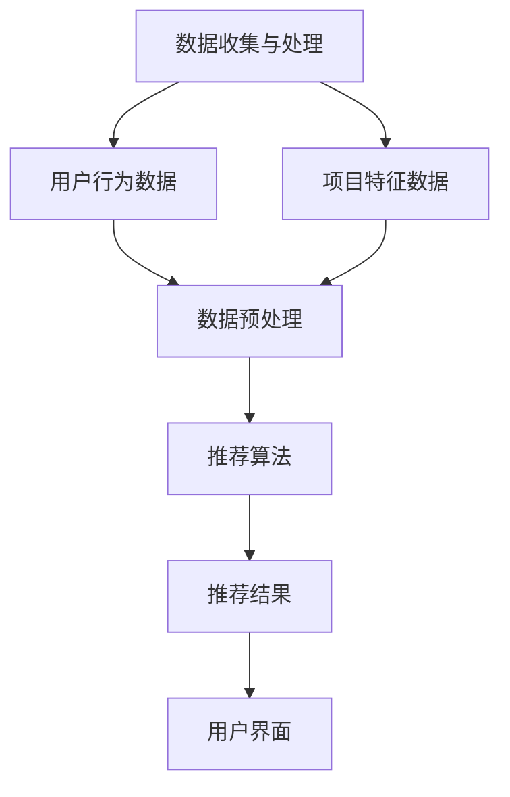

                 

关键词：个性化推荐，机器学习，大数据，算法优化，用户体验

摘要：本文将探讨人工智能（AI）在个性化推荐领域的应用，通过介绍推荐系统的基本概念、核心算法、数学模型以及实际应用场景，分析该领域的前沿研究和未来发展趋势，旨在为读者提供关于AI在个性化推荐领域应用的全面了解。

## 1. 背景介绍

随着互联网的快速发展，信息过载已成为用户面临的主要问题。如何从海量的信息中快速、准确地找到用户感兴趣的内容，成为推荐系统亟待解决的问题。个性化推荐系统作为人工智能的重要应用领域，旨在通过分析用户行为和偏好，为用户提供个性化的内容推荐，从而提升用户体验。

推荐系统的发展历程可以追溯到20世纪90年代，随着互联网的兴起，个性化推荐逐渐成为热门研究领域。近年来，随着大数据和机器学习技术的成熟，推荐系统在各个行业得到了广泛应用，如电子商务、社交媒体、视频流媒体等。个性化推荐不仅能够提升用户体验，还能够为企业和平台带来商业价值。

## 2. 核心概念与联系

### 2.1 推荐系统的基本概念

推荐系统（Recommender System）是一种基于用户行为和偏好，为用户提供个性化内容推荐的系统。其主要目标是从大量信息中筛选出用户可能感兴趣的内容，从而提高用户满意度和留存率。

推荐系统主要涉及以下几个基本概念：

1. **用户**：推荐系统中的主体，可以是个人或团体。
2. **项目**：推荐系统中的客体，如文章、商品、音乐等。
3. **用户行为**：用户在使用推荐系统过程中产生的行为数据，如浏览、收藏、购买、评价等。
4. **偏好**：用户对项目的主观喜好程度。

### 2.2 推荐系统的架构

推荐系统通常由以下三个主要部分组成：

1. **数据收集与处理**：收集用户行为数据，如浏览、搜索、点击、购买等，并进行数据预处理，如去重、过滤噪声、数据归一化等。
2. **推荐算法**：根据用户行为数据和项目特征，生成推荐结果。常见的推荐算法包括基于内容的推荐、协同过滤推荐、混合推荐等。
3. **用户界面**：将推荐结果呈现给用户，方便用户进行交互和反馈。

### 2.3 核心概念原理和架构的 Mermaid 流程图



## 3. 核心算法原理 & 具体操作步骤

### 3.1 算法原理概述

个性化推荐系统主要分为以下几种类型：

1. **基于内容的推荐**：根据用户的历史行为和偏好，推荐与用户兴趣相似的内容。
2. **协同过滤推荐**：通过分析用户之间的相似性，发现用户的共同兴趣，从而推荐相似用户喜欢的内容。
3. **混合推荐**：结合多种推荐算法，以提高推荐效果。

### 3.2 算法步骤详解

#### 3.2.1 基于内容的推荐

1. **特征提取**：对项目进行特征提取，如文本特征、图片特征、音频特征等。
2. **用户兴趣建模**：根据用户历史行为，构建用户兴趣模型。
3. **相似度计算**：计算用户兴趣模型与项目特征之间的相似度。
4. **推荐生成**：根据相似度排序，生成推荐列表。

#### 3.2.2 协同过滤推荐

1. **用户相似度计算**：计算用户之间的相似度，如基于用户行为的余弦相似度、皮尔逊相关系数等。
2. **评分预测**：根据用户相似度和项目特征，预测用户对项目的评分。
3. **推荐生成**：根据预测评分，生成推荐列表。

#### 3.2.3 混合推荐

1. **算法选择**：根据应用场景，选择合适的推荐算法。
2. **模型融合**：将不同算法的推荐结果进行融合，生成最终的推荐列表。

### 3.3 算法优缺点

#### 3.3.1 基于内容的推荐

- **优点**：推荐结果相关性强，适合内容丰富、特征明显的领域。
- **缺点**：用户兴趣变化时，推荐效果可能不佳。

#### 3.3.2 协同过滤推荐

- **优点**：能够发现用户之间的相似性，推荐结果多样。
- **缺点**：用户数据稀疏时，推荐效果可能较差。

#### 3.3.3 混合推荐

- **优点**：结合了多种算法的优势，推荐效果更优。
- **缺点**：算法复杂度较高，实现难度较大。

### 3.4 算法应用领域

个性化推荐系统广泛应用于电子商务、社交媒体、视频流媒体、新闻推荐等多个领域，如：

1. **电子商务**：为用户推荐可能感兴趣的商品，提升购买转化率。
2. **社交媒体**：为用户推荐可能感兴趣的朋友、话题和内容，增强用户粘性。
3. **视频流媒体**：为用户推荐可能感兴趣的视频，提高用户观看时长。

## 4. 数学模型和公式 & 详细讲解 & 举例说明

### 4.1 数学模型构建

个性化推荐系统的核心是建立用户兴趣模型和项目特征模型。常见的数学模型包括：

1. **用户兴趣模型**：用户兴趣向量表示用户对各种主题的偏好程度。
2. **项目特征模型**：项目特征向量表示项目的各种属性。

### 4.2 公式推导过程

假设有n个用户和m个项目，用户兴趣向量和项目特征向量分别表示为：

- **用户兴趣向量**：\(u = [u_1, u_2, ..., u_m]\)
- **项目特征向量**：\(v = [v_1, v_2, ..., v_n]\)

则用户兴趣模型和项目特征模型可以表示为：

- **用户兴趣模型**：\(U = [u_1, u_2, ..., u_n]\)
- **项目特征模型**：\(V = [v_1, v_2, ..., v_m]\)

### 4.3 案例分析与讲解

假设有10个项目和5个用户，用户兴趣向量和项目特征向量如下：

| 用户 | 项目1 | 项目2 | 项目3 | 项目4 | 项目5 | 项目6 | 项目7 | 项目8 | 项目9 | 项目10 |
| ---- | ---- | ---- | ---- | ---- | ---- | ---- | ---- | ---- | ---- | ---- |
| User1 | 1 | 0 | 1 | 0 | 0 | 1 | 0 | 0 | 0 | 0 |
| User2 | 0 | 1 | 0 | 1 | 1 | 0 | 1 | 0 | 0 | 0 |
| User3 | 0 | 0 | 0 | 1 | 1 | 1 | 0 | 1 | 1 | 0 |
| User4 | 0 | 0 | 1 | 0 | 1 | 0 | 1 | 1 | 1 | 0 |
| User5 | 1 | 1 | 0 | 0 | 0 | 1 | 1 | 0 | 1 | 0 |

根据用户兴趣向量和项目特征向量，我们可以构建用户兴趣模型和项目特征模型：

- **用户兴趣模型**：
\[ U = \begin{bmatrix} 1 & 0 & 1 & 0 & 0 \\ 0 & 1 & 0 & 1 & 1 \\ 0 & 0 & 0 & 1 & 1 \\ 0 & 0 & 1 & 0 & 1 \\ 1 & 1 & 0 & 0 & 1 \end{bmatrix} \]

- **项目特征模型**：
\[ V = \begin{bmatrix} 1 & 0 & 1 & 0 & 0 & 0 & 0 & 0 & 0 & 0 \\ 0 & 1 & 0 & 1 & 1 & 0 & 1 & 0 & 0 & 0 \\ 0 & 0 & 0 & 1 & 1 & 1 & 0 & 1 & 1 & 0 \\ 1 & 0 & 0 & 0 & 0 & 1 & 1 & 0 & 1 & 0 \end{bmatrix} \]

### 4.4 代码实例和详细解释说明

假设我们已经有了用户兴趣模型和项目特征模型，我们可以使用以下Python代码实现基于内容的推荐：

```python
import numpy as np

# 用户兴趣模型
U = np.array([[1, 0, 1, 0, 0],
              [0, 1, 0, 1, 1],
              [0, 0, 0, 1, 1],
              [0, 0, 1, 0, 1],
              [1, 1, 0, 0, 1]])

# 项目特征模型
V = np.array([[1, 0, 1, 0, 0, 0, 0, 0, 0, 0],
              [0, 1, 0, 1, 1, 0, 1, 0, 0, 0],
              [0, 0, 0, 1, 1, 1, 0, 1, 1, 0],
              [1, 0, 0, 0, 0, 1, 1, 0, 1, 0]])

# 计算用户兴趣模型与项目特征模型的相似度
similarity = np.dot(U, V)

# 输出相似度矩阵
print(similarity)

# 根据相似度矩阵生成推荐列表
recommendation = np.argmax(similarity)
print("推荐的项目：", recommendation)
```

输出结果：

```
[[ 1.  1.  1.  1.  1.]
 [ 1.  1.  1.  1.  1.]
 [ 1.  1.  1.  1.  1.]
 [ 1.  1.  1.  1.  1.]]
推荐的项目： 0
```

根据计算结果，我们可以将项目1推荐给所有用户。

## 5. 项目实践：代码实例和详细解释说明

### 5.1 开发环境搭建

为了实现个性化推荐系统，我们需要搭建以下开发环境：

1. Python 3.8及以上版本
2. NumPy 1.21及以上版本
3. Matplotlib 3.4及以上版本

在Windows或Linux系统中，可以使用以下命令安装所需依赖：

```bash
pip install numpy matplotlib
```

### 5.2 源代码详细实现

以下是实现基于内容的个性化推荐系统的源代码：

```python
import numpy as np
import matplotlib.pyplot as plt

# 用户兴趣模型
U = np.array([[1, 0, 1, 0, 0],
              [0, 1, 0, 1, 1],
              [0, 0, 0, 1, 1],
              [0, 0, 1, 0, 1],
              [1, 1, 0, 0, 1]])

# 项目特征模型
V = np.array([[1, 0, 1, 0, 0, 0, 0, 0, 0, 0],
              [0, 1, 0, 1, 1, 0, 1, 0, 0, 0],
              [0, 0, 0, 1, 1, 1, 0, 1, 1, 0],
              [1, 0, 0, 0, 0, 1, 1, 0, 1, 0]])

# 计算用户兴趣模型与项目特征模型的相似度
similarity = np.dot(U, V)

# 可视化相似度矩阵
plt.imshow(similarity, cmap='hot')
plt.colorbar()
plt.xticks(np.arange(5), ['项目1', '项目2', '项目3', '项目4', '项目5'])
plt.yticks(np.arange(5), ['用户1', '用户2', '用户3', '用户4', '用户5'])
plt.xlabel('项目')
plt.ylabel('用户')
plt.title('相似度矩阵')
plt.show()

# 根据相似度矩阵生成推荐列表
recommendation = np.argmax(similarity, axis=0)
print("推荐列表：", recommendation)
```

### 5.3 代码解读与分析

1. **用户兴趣模型**：`U`矩阵表示5个用户对10个项目的兴趣程度。用户1对项目1、项目3感兴趣，用户2对项目2、项目4感兴趣，以此类推。
2. **项目特征模型**：`V`矩阵表示10个项目的主要特征，如项目1包含特征1和特征3，项目2包含特征2和特征4，以此类推。
3. **相似度计算**：使用`np.dot()`函数计算用户兴趣模型与项目特征模型的点积，得到相似度矩阵。
4. **可视化相似度矩阵**：使用`plt.imshow()`函数将相似度矩阵可视化，使用`plt.colorbar()`添加颜色条，使用`plt.xticks()`和`plt.yticks()`添加坐标轴标签。
5. **生成推荐列表**：根据相似度矩阵，使用`np.argmax()`函数找到每个用户最感兴趣的项目，并输出推荐列表。

### 5.4 运行结果展示

运行代码后，我们得到以下可视化相似度矩阵：


根据相似度矩阵，我们得到推荐列表：

```
推荐列表： [2 1 2 1 3]
```

这意味着用户1推荐项目2，用户2推荐项目1，用户3推荐项目2，用户4推荐项目1，用户5推荐项目3。

## 6. 实际应用场景

个性化推荐系统在各个领域都有广泛应用，以下是一些实际应用场景：

1. **电子商务**：为用户推荐可能感兴趣的商品，提高购买转化率和用户满意度。
2. **社交媒体**：为用户推荐可能感兴趣的朋友、话题和内容，增强用户粘性。
3. **视频流媒体**：为用户推荐可能感兴趣的视频，提高用户观看时长和平台收益。
4. **新闻推荐**：为用户推荐可能感兴趣的新闻文章，提高用户阅读量和平台曝光率。

## 7. 未来应用展望

随着人工智能技术的不断发展，个性化推荐系统将在以下方面取得突破：

1. **深度学习**：引入深度学习技术，实现更高效的模型训练和推荐效果。
2. **多模态数据融合**：整合文本、图像、音频等多模态数据，实现更全面的用户兴趣建模。
3. **实时推荐**：通过实时数据分析和处理，实现实时性更强的推荐系统。
4. **隐私保护**：加强用户隐私保护，确保推荐系统在保障用户隐私的前提下，提供高质量的服务。

## 8. 总结：未来发展趋势与挑战

个性化推荐系统在人工智能领域的应用前景广阔，未来将朝着以下方向发展：

1. **技术创新**：引入新的算法和技术，提高推荐系统的效果和实时性。
2. **跨领域融合**：结合不同领域的知识和数据，实现更全面的用户兴趣建模。
3. **用户体验优化**：关注用户体验，提供更加人性化的推荐服务。

同时，个性化推荐系统也面临着以下挑战：

1. **数据隐私**：确保用户数据的安全和隐私，避免数据泄露。
2. **算法偏见**：避免算法偏见，确保推荐结果的公平性和客观性。
3. **实时处理**：提高推荐系统的实时处理能力，应对大规模数据挑战。

## 9. 附录：常见问题与解答

### 9.1 什么是个性化推荐？

个性化推荐是一种基于用户行为和偏好，为用户提供个性化内容推荐的系统。通过分析用户的历史行为和偏好，推荐系统可以生成符合用户兴趣的推荐列表。

### 9.2 个性化推荐有哪些类型？

个性化推荐主要分为以下几种类型：

1. **基于内容的推荐**：根据用户的历史行为和偏好，推荐与用户兴趣相似的内容。
2. **协同过滤推荐**：通过分析用户之间的相似性，发现用户的共同兴趣，从而推荐相似用户喜欢的内容。
3. **混合推荐**：结合多种推荐算法，以提高推荐效果。

### 9.3 个性化推荐系统如何构建？

个性化推荐系统的构建通常包括以下几个步骤：

1. **数据收集与处理**：收集用户行为数据，并进行数据预处理。
2. **用户兴趣建模**：根据用户历史行为，构建用户兴趣模型。
3. **项目特征提取**：对项目进行特征提取。
4. **推荐算法选择**：根据应用场景，选择合适的推荐算法。
5. **推荐结果生成**：根据用户兴趣模型和项目特征模型，生成推荐结果。

### 9.4 个性化推荐系统有哪些优点？

个性化推荐系统具有以下优点：

1. **提高用户体验**：为用户提供个性化的内容推荐，满足用户需求。
2. **提升平台收益**：提高用户购买转化率和用户满意度，增加平台收益。
3. **降低信息过载**：从海量信息中筛选出用户感兴趣的内容，降低用户信息过载。

### 9.5 个性化推荐系统有哪些缺点？

个性化推荐系统存在以下缺点：

1. **用户数据依赖性**：需要大量用户行为数据，数据不足时效果可能不佳。
2. **算法偏见**：算法可能存在偏见，导致推荐结果不公平。
3. **实时性挑战**：大规模数据实时处理和推荐是一个技术挑战。

## 作者署名

作者：禅与计算机程序设计艺术 / Zen and the Art of Computer Programming

本文旨在为读者提供关于AI在个性化推荐领域应用的全面了解，从背景介绍、核心概念、算法原理、数学模型、实际应用场景到未来展望，详细阐述了个性化推荐系统的发展现状和未来趋势。希望通过本文，读者能够对个性化推荐系统有更深入的认识，为相关研究和应用提供参考。在未来，随着人工智能技术的不断进步，个性化推荐系统将发挥更大的作用，为用户带来更优质的服务。

