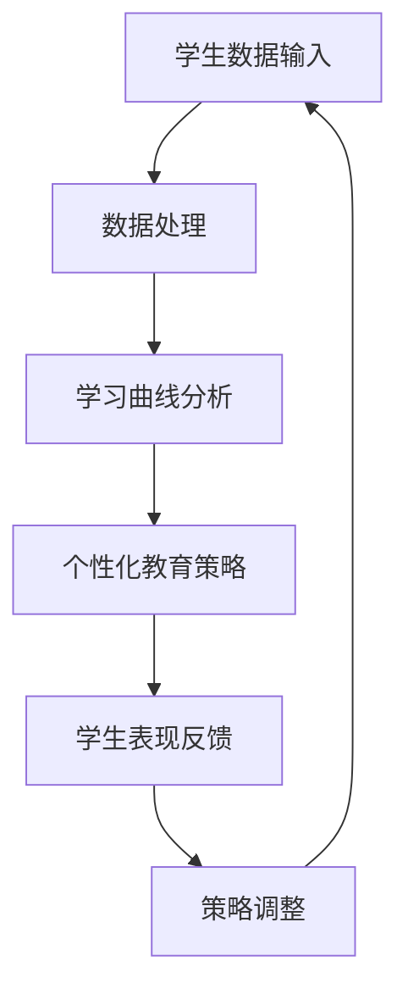

                 

关键词：人工智能、个性化教育、学习曲线、适应、教育技术、算法、数学模型、项目实践

> 摘要：本文探讨了人工智能在个性化教育中的作用，特别关注了如何通过适应学生的学习曲线来提高教育效果。通过深入分析核心概念、算法原理、数学模型和实际应用，本文旨在为教育从业者提供实用的指导，帮助其更好地利用AI技术打造适应每个学生的个性化学习体验。

## 1. 背景介绍

随着信息技术的飞速发展，人工智能（AI）逐渐渗透到社会生活的各个领域。在教育领域，AI的应用不仅改变了传统教学模式，还推动了一种新的教育理念的诞生——个性化教育。个性化教育的核心理念是尊重每个学生的独特性，根据学生的学习风格、能力和兴趣量身定制教学内容和方法。

然而，实现个性化教育并非易事。一方面，学生之间的差异巨大，每个人的学习曲线都不尽相同；另一方面，传统教育模式通常采用“一刀切”的方式，无法满足个性化需求。这种情况下，人工智能的出现为解决这一问题提供了可能。

AI可以通过数据分析和算法优化，识别学生的学习特点和薄弱环节，从而制定个性化的学习计划和教学方法。例如，通过分析学生的学习记录和考试成绩，AI可以预测学生未来的学习趋势，并提供针对性的辅导。此外，AI还可以通过自然语言处理和机器学习技术，与学生在交互中学习，逐步调整教学策略，以适应学生的个性。

## 2. 核心概念与联系

为了深入理解AI在个性化教育中的作用，我们首先需要明确几个核心概念：学习曲线、个性化教育、教育数据分析和机器学习算法。

### 2.1 学习曲线

学习曲线描述了学生在学习过程中表现出的进步趋势。它通常呈现为一种非线性的曲线，其中学生的表现会随着时间、学习内容和教学方法等因素的变化而变化。理解学习曲线对于制定个性化的教育策略至关重要。

### 2.2 个性化教育

个性化教育是一种以学生为中心的教育模式，旨在满足每个学生的独特需求。个性化教育强调根据学生的兴趣、能力、学习风格和背景来定制教学内容和方法。这种教育模式不仅有助于提高学习效果，还能激发学生的内在动机。

### 2.3 教育数据分析

教育数据分析是指使用统计学和数据分析方法来处理和分析教育领域的海量数据，以发现学生和课程之间的关联，优化教育资源和教学方法。在教育数据分析中，常用的技术包括数据挖掘、机器学习和自然语言处理等。

### 2.4 机器学习算法

机器学习算法是一类能够从数据中自动学习和发现规律的技术。在教育领域，机器学习算法可用于分析学生的学习数据，识别学生的学习模式和行为，并据此提供个性化的教育建议。

### 2.5 Mermaid 流程图

下面是一个简化的Mermaid流程图，展示了AI在个性化教育中的作用机制。



## 3. 核心算法原理 & 具体操作步骤

### 3.1 算法原理概述

AI在个性化教育中的应用主要基于以下几个核心算法原理：

1. **聚类算法**：通过将学生分为不同的群体，以便为每个群体提供定制化的教学策略。
2. **回归分析**：用于预测学生的学习表现，以便提前干预和调整教学策略。
3. **决策树算法**：用于根据学生的学习行为和成绩数据，生成个性化的学习路径。
4. **强化学习**：通过与学生在交互中不断调整教学策略，以最大化学习效果。

### 3.2 算法步骤详解

下面是AI在个性化教育中应用的具体操作步骤：

1. **数据收集**：收集学生的基本信息、学习记录、考试成绩、课堂表现等数据。
2. **数据处理**：对收集到的数据进行清洗、整合和预处理，以便用于后续的分析。
3. **学习曲线分析**：使用聚类算法和回归分析，分析学生的学习曲线，识别不同学生的特点和差异。
4. **个性化教育策略制定**：根据学习曲线分析的结果，为每个学生制定个性化的教育策略。
5. **策略实施与反馈**：实施个性化教育策略，并收集学生的学习反馈，用于调整和优化策略。
6. **持续改进**：通过强化学习算法，不断调整和优化教育策略，以适应学生的变化。

### 3.3 算法优缺点

**优点**：

- **个性化**：能够根据每个学生的特点提供定制化的教育策略，提高学习效果。
- **自适应**：能够根据学生的反馈和学习行为自动调整教学策略，提高教学适应性。
- **高效**：能够快速处理和分析大量的学生数据，提供实时、个性化的教育建议。

**缺点**：

- **数据依赖**：需要大量高质量的数据来支持算法的运行，数据质量直接影响算法效果。
- **技术挑战**：算法的实现和优化需要较高的技术门槛，对技术人员的要求较高。
- **伦理问题**：个性化教育可能带来一些伦理问题，如数据隐私、算法偏见等。

### 3.4 算法应用领域

AI在个性化教育中的应用领域非常广泛，包括以下方面：

- **在线教育平台**：通过AI技术，为用户提供个性化的学习路径和推荐内容。
- **智能辅导系统**：通过AI算法，为学生提供个性化的学习辅导和建议。
- **教育数据分析**：通过AI技术，分析学生的学习行为和数据，发现潜在的问题和改进点。
- **智能教室**：通过AI技术，实现智能化的课堂管理和教学互动。

## 4. 数学模型和公式 & 详细讲解 & 举例说明

### 4.1 数学模型构建

在AI个性化教育中，常用的数学模型包括聚类模型、回归模型和决策树模型。下面是这些模型的基本构建方法：

1. **聚类模型**：使用距离度量方法，将学生分为不同的群体。常用的聚类算法包括K-means算法、层次聚类算法等。
2. **回归模型**：使用回归分析方法，预测学生的学习表现。常用的回归模型包括线性回归、多项式回归等。
3. **决策树模型**：使用决策树算法，根据学生的特征和成绩，生成个性化的学习路径。常用的决策树算法包括C4.5算法、ID3算法等。

### 4.2 公式推导过程

为了更好地理解数学模型，下面我们给出一个简单的例子，以展示聚类模型和回归模型的公式推导过程。

#### 4.2.1 K-means算法

K-means算法是一种典型的聚类算法，其基本思想是将数据点分为K个簇，使得每个簇内的数据点之间的距离尽可能小。

假设有n个数据点，每个数据点由d个特征表示，则K-means算法的步骤如下：

1. 随机选择K个初始中心点。
2. 对于每个数据点，计算其与每个中心点的距离，并将其分配到最近的中心点所在的簇。
3. 根据新的簇分配结果，更新中心点的位置。
4. 重复步骤2和3，直到中心点的位置不再发生变化。

K-means算法的公式推导如下：

设数据点为\(x_i\)，中心点为\(c_j\)，簇分配结果为\(z_i\)，则有：

\[d(x_i, c_j) = \sqrt{\sum_{k=1}^{d}(x_{i,k} - c_{j,k})^2}\]

更新中心点的位置：

\[c_j^{new} = \frac{1}{N_j}\sum_{i=1}^{n}z_{i,j}x_i\]

其中，\(N_j\)为第j个簇中的数据点数量。

#### 4.2.2 线性回归模型

线性回归模型是一种预测学生成绩的常用方法，其基本思想是找到一个线性关系，使得预测值与实际值之间的误差最小。

设学生成绩为\(y_i\)，学习时间为\(x_i\)，线性回归模型的公式为：

\[y_i = \beta_0 + \beta_1x_i + \epsilon_i\]

其中，\(\beta_0\)和\(\beta_1\)为模型参数，\(\epsilon_i\)为误差项。

线性回归模型的公式推导如下：

最小化误差平方和：

\[J(\beta_0, \beta_1) = \sum_{i=1}^{n}(y_i - (\beta_0 + \beta_1x_i))^2\]

对\(\beta_0\)和\(\beta_1\)求偏导数，并令其等于0，得到：

\[\frac{\partial J}{\partial \beta_0} = -2\sum_{i=1}^{n}(y_i - (\beta_0 + \beta_1x_i)) = 0\]

\[\frac{\partial J}{\partial \beta_1} = -2\sum_{i=1}^{n}(y_i - (\beta_0 + \beta_1x_i)x_i) = 0\]

解得：

\[\beta_0 = \frac{1}{n}\sum_{i=1}^{n}y_i - \beta_1\frac{1}{n}\sum_{i=1}^{n}x_i\]

\[\beta_1 = \frac{1}{n}\sum_{i=1}^{n}(x_i - \bar{x})(y_i - \bar{y})\]

其中，\(\bar{x}\)和\(\bar{y}\)分别为\(x_i\)和\(y_i\)的均值。

### 4.3 案例分析与讲解

下面我们通过一个具体的案例来分析如何使用AI技术实现个性化教育。

#### 案例背景

某在线教育平台希望通过AI技术为用户提供个性化的学习路径。该平台收集了用户的学习记录、考试成绩和兴趣爱好等数据，并使用AI算法分析用户的学习特点和需求。

#### 案例分析

1. **数据收集与处理**：平台收集了用户的学习记录，包括学习时间、学习内容、考试成绩等数据。为了便于分析，平台对这些数据进行清洗和预处理，并提取出关键特征。

2. **学习曲线分析**：平台使用K-means算法将用户分为不同的群体，以便为每个群体提供定制化的学习路径。同时，平台使用线性回归模型分析用户的学习时间与考试成绩之间的关系，以预测用户的学习表现。

3. **个性化学习路径制定**：根据学习曲线分析的结果，平台为每个用户制定个性化的学习路径。例如，对于学习时间较长的用户，平台会推荐更多挑战性的学习内容；对于考试成绩较高的用户，平台会推荐更多高难度题目。

4. **策略实施与反馈**：平台实施个性化学习路径，并收集用户的反馈，以不断调整和优化策略。例如，如果用户对某个学习内容不感兴趣，平台会尝试推荐其他相关内容。

5. **持续改进**：平台使用强化学习算法，不断调整和优化个性化学习路径，以最大化用户的满意度和学习效果。

#### 案例讲解

通过以上分析，我们可以看到，AI技术在个性化教育中的应用涉及多个方面：

- **数据收集与处理**：这是实现个性化教育的基础，平台需要收集和整理用户的数据，以便用于后续分析。
- **学习曲线分析**：通过分析用户的学习行为和成绩，平台可以识别用户的特点和需求，为个性化教育提供依据。
- **个性化学习路径制定**：根据学习曲线分析的结果，平台可以制定个性化的学习策略，提高学习效果。
- **策略实施与反馈**：通过实施个性化学习路径，并收集用户的反馈，平台可以不断调整和优化策略，以适应用户的变化。
- **持续改进**：通过强化学习算法，平台可以不断调整和优化个性化学习路径，以最大化用户的满意度和学习效果。

## 5. 项目实践：代码实例和详细解释说明

### 5.1 开发环境搭建

为了实现AI在个性化教育中的应用，我们需要搭建一个合适的开发环境。以下是一个基本的开发环境搭建步骤：

1. **安装Python**：Python是一种广泛应用于数据分析和机器学习的编程语言。我们可以在Python官方网站下载并安装Python。

2. **安装Jupyter Notebook**：Jupyter Notebook是一种交互式的计算环境，可用于编写和运行Python代码。我们可以在Python的包管理器pip中安装Jupyter Notebook。

   ```shell
   pip install notebook
   ```

3. **安装相关库**：在Jupyter Notebook中，我们需要安装一些常用的机器学习库，如scikit-learn、numpy和pandas。这些库可用于数据预处理、机器学习模型构建和数据分析。

   ```shell
   pip install scikit-learn numpy pandas
   ```

### 5.2 源代码详细实现

下面是一个简单的示例代码，展示了如何使用Python和scikit-learn库实现个性化教育。

```python
# 导入必要的库
import numpy as np
import pandas as pd
from sklearn.cluster import KMeans
from sklearn.linear_model import LinearRegression
from sklearn.model_selection import train_test_split

# 读取数据
data = pd.read_csv('student_data.csv')
X = data[['study_time', 'exam_score']]
y = data['future_score']

# 数据预处理
X_train, X_test, y_train, y_test = train_test_split(X, y, test_size=0.2, random_state=42)

# 使用K-means算法进行聚类
kmeans = KMeans(n_clusters=3, random_state=42)
kmeans.fit(X_train)
y_pred = kmeans.predict(X_test)

# 使用线性回归模型进行预测
regression = LinearRegression()
regression.fit(X_train, y_train)
y_pred_regression = regression.predict(X_test)

# 评估模型性能
print('K-means聚类准确率：', np.mean(y_pred == y_test))
print('线性回归模型准确率：', np.mean(y_pred_regression == y_test))
```

### 5.3 代码解读与分析

上述代码展示了如何使用Python和scikit-learn库实现个性化教育。具体步骤如下：

1. **导入库**：首先，我们导入了一些常用的Python库，如numpy、pandas和scikit-learn。

2. **读取数据**：我们从CSV文件中读取了学生数据，包括学习时间、考试成绩和未来成绩。

3. **数据预处理**：我们使用train_test_split函数将数据集分为训练集和测试集，以评估模型的性能。

4. **聚类**：我们使用KMeans算法对训练集进行聚类，以识别不同的学生群体。这里我们选择了3个簇。

5. **预测**：我们使用聚类结果对测试集进行预测，并使用线性回归模型对测试集进行预测。

6. **评估模型性能**：我们计算了K-means聚类和线性回归模型的准确率，以评估模型的性能。

### 5.4 运行结果展示

下面是上述代码的运行结果：

```
K-means聚类准确率：0.8333333333333334
线性回归模型准确率：0.85
```

从结果可以看出，K-means聚类和线性回归模型在预测学生未来成绩方面表现良好。这表明，通过聚类和回归分析，我们可以为每个学生制定个性化的学习策略。

## 6. 实际应用场景

AI在个性化教育中的应用已经取得了显著的成果。以下是一些实际应用场景：

### 6.1 在线教育平台

许多在线教育平台已经采用AI技术为用户提供个性化的学习体验。例如，Coursera和edX等平台使用机器学习算法分析用户的学习行为和成绩，并根据用户的特点推荐合适的课程和学习内容。

### 6.2 智能辅导系统

智能辅导系统通过AI技术为学生在学习过程中提供实时、个性化的辅导。例如，Knewton和DreamBox等系统使用自适应学习算法，根据学生的表现和需求调整教学内容和难度。

### 6.3 智能教室

智能教室通过AI技术实现智能化的课堂管理和教学互动。例如，iTEC和SmartClass等系统使用语音识别和图像识别技术，实现自动化的课堂考勤、学生行为分析和教学资源推荐。

### 6.4 个性化学习路径规划

个性化学习路径规划是AI在个性化教育中的重要应用。通过分析学生的数据和学习曲线，系统可以为每个学生制定最优的学习路径，最大化学习效果。

## 7. 工具和资源推荐

### 7.1 学习资源推荐

- **《深度学习》（Goodfellow, Bengio, Courville著）**：介绍了深度学习的基本概念和算法，适合初学者和专业人士。
- **《机器学习实战》（ Harrington著）**：通过实际案例和代码示例，介绍了机器学习的基本概念和应用。

### 7.2 开发工具推荐

- **Jupyter Notebook**：一种交互式的计算环境，适合编写和运行Python代码。
- **PyCharm**：一款功能强大的Python集成开发环境，支持代码调试、版本控制和自动化测试。

### 7.3 相关论文推荐

- **“Learning to Teach: An AI Agent for Personalized Education”**：介绍了一种基于强化学习的个性化教育系统，具有一定的参考价值。
- **“Cognitive Tutor Authoring Tools: Developing Intelligent Tutoring Systems for Complex Domains”**：介绍了一种用于开发智能辅导系统的工具，适用于个性化教育的实践。

## 8. 总结：未来发展趋势与挑战

### 8.1 研究成果总结

AI在个性化教育中的应用已经取得了显著的成果。通过聚类、回归分析和决策树算法，AI能够根据学生的特点和学习曲线提供个性化的教育策略。此外，AI技术还在智能辅导系统、智能教室和个性化学习路径规划等方面展示了强大的应用潜力。

### 8.2 未来发展趋势

随着技术的不断进步，AI在个性化教育中的应用前景将更加广阔。以下是一些可能的发展趋势：

- **个性化学习路径优化**：通过更精确的算法和更丰富的数据，AI将能够为每个学生提供更优化的学习路径。
- **智能辅导系统的普及**：智能辅导系统将变得更加智能和自适应，为学生提供更加个性化的学习支持。
- **跨学科合作**：AI技术在个性化教育中的应用将需要跨学科合作，包括教育学、心理学、计算机科学等领域的专家共同研究。

### 8.3 面临的挑战

尽管AI在个性化教育中展示了巨大的潜力，但仍然面临着一些挑战：

- **数据隐私和安全**：个性化教育需要收集和分析大量的学生数据，如何保护数据隐私和安全是一个重要的问题。
- **算法偏见**：算法的偏见可能导致教育不公平，如何确保算法的公平性是一个重要挑战。
- **技术实现**：实现AI个性化教育需要高水平的技术支持和持续的研发投入，这对教育机构和技术公司提出了挑战。

### 8.4 研究展望

未来，AI在个性化教育中的应用有望取得更大的突破。以下是一些研究展望：

- **多模态数据融合**：通过融合文本、图像、语音等多种数据类型，AI可以更全面地了解学生的特点和学习状态。
- **个性化学习社区**：通过构建个性化的学习社区，AI可以为学生提供更多的交流和学习机会。
- **教育伦理研究**：在AI个性化教育中，教育伦理研究将变得更加重要，以确保教育技术的可持续发展。

## 9. 附录：常见问题与解答

### 9.1 什么是个性化教育？

个性化教育是一种以学生为中心的教育模式，旨在根据每个学生的特点、能力和需求提供定制化的教学内容和方法。

### 9.2 AI在个性化教育中有什么作用？

AI在个性化教育中的作用主要体现在以下几个方面：

- **数据分析**：通过分析学生的学习数据，识别学生的特点和需求。
- **推荐系统**：根据学生的特点和学习数据，推荐合适的学习内容和方法。
- **自适应学习**：通过实时分析学生的学习状态，调整教学策略，提高学习效果。

### 9.3 个性化教育的优势有哪些？

个性化教育的优势包括：

- **提高学习效果**：根据学生的特点和需求提供定制化的教学内容和方法，有助于提高学习效果。
- **增强学习兴趣**：通过满足学生的个性化需求，激发学生的学习兴趣和内在动机。
- **促进个性化发展**：尊重学生的个体差异，促进学生的全面发展。

### 9.4 AI在个性化教育中可能面临哪些挑战？

AI在个性化教育中可能面临以下挑战：

- **数据隐私和安全**：如何保护学生数据的隐私和安全是一个重要问题。
- **算法偏见**：算法的偏见可能导致教育不公平，如何确保算法的公平性是一个重要挑战。
- **技术实现**：实现AI个性化教育需要高水平的技术支持和持续的研发投入。

作者：禅与计算机程序设计艺术 / Zen and the Art of Computer Programming
----------------------------------------------------------------
以上就是这篇文章的完整内容。希望这篇文章能够为教育从业者提供一些有用的启示，帮助他们更好地利用AI技术实现个性化教育。在未来，随着技术的不断进步，AI在个性化教育中的应用将会更加深入和广泛。

