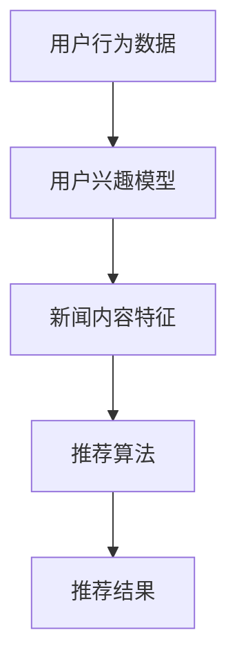

                 

关键词：人工智能、个性化新闻推荐、信息精准投放、算法、数学模型、应用实践、未来展望

> 摘要：本文详细探讨了人工智能在个性化新闻推荐中的应用，特别是在信息精准投放方面的技术实现。通过深入分析核心算法原理、数学模型、具体操作步骤及实际应用场景，文章旨在为读者提供一个全面而系统的了解，以期为行业应用提供理论支持和实践指导。

## 1. 背景介绍

### 1.1 个性化新闻推荐的发展历程

个性化新闻推荐作为信息时代的重要应用，其发展历程可以追溯到互联网早期。最初的新闻推荐主要依赖于简单的用户兴趣标签和内容关键词匹配。随着互联网的迅猛发展和用户需求的多样化，新闻推荐技术逐渐从基于内容的推荐（Content-Based Filtering）向基于协同过滤（Collaborative Filtering）和基于模型的推荐方法演变。近年来，人工智能和机器学习技术的快速发展，为个性化新闻推荐带来了新的机遇和挑战。

### 1.2 个性化新闻推荐的重要性

个性化新闻推荐能够显著提升用户的阅读体验，提高信息获取的效率和满意度。通过精准推送用户感兴趣的内容，不仅能够增加用户的粘性，还能够提升平台的内容价值。同时，个性化新闻推荐也为广告商提供了更精准的投放渠道，从而实现商业价值的最大化。

### 1.3 本文的目标

本文旨在探讨人工智能在个性化新闻推荐中的应用，特别是信息精准投放方面的技术实现。通过深入分析核心算法原理、数学模型、具体操作步骤及实际应用场景，本文旨在为读者提供一个全面而系统的了解，以期为行业应用提供理论支持和实践指导。

## 2. 核心概念与联系

### 2.1 个性化新闻推荐的核心概念

#### 2.1.1 用户兴趣模型

用户兴趣模型是个性化新闻推荐系统的核心，用于描述用户的兴趣偏好。通过收集和分析用户的浏览、搜索、点赞、评论等行为数据，可以构建出一个反映用户兴趣的动态模型。

#### 2.1.2 新闻内容特征

新闻内容特征用于描述新闻的属性和主题。常见的新闻内容特征包括标题、关键词、正文、作者、发表时间、分类标签等。

#### 2.1.3 推荐算法

推荐算法是个性化新闻推荐系统的关键技术，用于根据用户兴趣模型和新闻内容特征生成个性化推荐结果。常见的推荐算法包括基于协同过滤、基于内容过滤和基于模型的方法。

### 2.2 核心概念的联系

用户兴趣模型和新闻内容特征共同构成了个性化新闻推荐系统的输入，通过推荐算法生成推荐结果。用户兴趣模型和新闻内容特征之间的联系通过相似度计算和相关性分析来实现。

### 2.3 Mermaid流程图



## 3. 核心算法原理 & 具体操作步骤

### 3.1 算法原理概述

个性化新闻推荐的核心算法包括基于协同过滤、基于内容和基于模型的方法。这些算法通过不同的原理和技术实现，以生成个性化的推荐结果。

#### 3.1.1 基于协同过滤的方法

基于协同过滤的方法通过分析用户之间的相似度，推荐用户喜欢的其他用户喜欢的内容。常见的协同过滤算法包括用户基于的协同过滤（User-Based Collaborative Filtering）和项基于的协同过滤（Item-Based Collaborative Filtering）。

#### 3.1.2 基于内容过滤的方法

基于内容过滤的方法通过分析新闻内容的特征，推荐与用户兴趣相匹配的新闻。这种方法通常使用关键词匹配、文本分类等技术来实现。

#### 3.1.3 基于模型的方法

基于模型的方法通过构建用户兴趣模型和新闻内容模型，利用机器学习算法生成推荐结果。常见的模型包括矩阵分解（Matrix Factorization）、深度学习（Deep Learning）等。

### 3.2 算法步骤详解

#### 3.2.1 基于协同过滤的方法

1. 收集用户行为数据，如浏览历史、搜索记录等。
2. 计算用户之间的相似度，可以使用余弦相似度、皮尔逊相关系数等方法。
3. 对于每个用户，找到与该用户相似度最高的若干用户。
4. 推荐这些相似用户喜欢的新闻，即用户喜欢的其他用户喜欢的内容。

#### 3.2.2 基于内容过滤的方法

1. 提取新闻内容特征，如标题、关键词、正文等。
2. 计算用户兴趣模型和新闻内容特征之间的相似度。
3. 推荐与用户兴趣模型相似度最高的新闻。

#### 3.2.3 基于模型的方法

1. 收集用户行为数据和新闻内容数据。
2. 构建用户兴趣模型和新闻内容模型。
3. 使用矩阵分解或深度学习算法训练模型。
4. 对于新用户或新新闻，利用训练好的模型生成推荐结果。

### 3.3 算法优缺点

#### 3.3.1 基于协同过滤的方法

优点：
- 简单有效，易于实现。
- 可以处理大量的用户和新闻数据。

缺点：
- 用户冷启动问题，即新用户无法获得个性化推荐。
- 推荐结果易受稀疏数据影响，可能导致推荐效果不佳。

#### 3.3.2 基于内容过滤的方法

优点：
- 推荐结果更符合用户兴趣。
- 可以处理文本内容丰富的新闻。

缺点：
- 需要大量预处理工作，如特征提取和文本分类。
- 对于新闻内容的理解有限，可能无法准确捕捉用户兴趣。

#### 3.3.3 基于模型的方法

优点：
- 可以处理大规模数据，适应性强。
- 可以通过不断更新模型，实现实时推荐。

缺点：
- 训练和推理复杂度高。
- 模型解释性较差，难以理解推荐结果。

### 3.4 算法应用领域

个性化新闻推荐算法广泛应用于社交媒体、新闻平台、电子商务等领域。通过精准推荐，提升用户体验和平台价值。

## 4. 数学模型和公式 & 详细讲解 & 举例说明

### 4.1 数学模型构建

个性化新闻推荐中的数学模型主要包括用户兴趣模型、新闻内容模型和推荐模型。

#### 4.1.1 用户兴趣模型

用户兴趣模型通常使用矩阵表示，其中行表示用户，列表示新闻。矩阵中的元素表示用户对新闻的偏好程度。

假设有用户 \( u \) 和新闻 \( i \)，用户兴趣模型可以用矩阵 \( U \) 表示：

$$
U = \begin{bmatrix}
u_1 & u_2 & \ldots & u_n
\end{bmatrix}
$$

其中，\( u_i \) 表示用户 \( u \) 对新闻 \( i \) 的偏好程度。

#### 4.1.2 新闻内容模型

新闻内容模型通常使用向量表示，其中每个元素表示新闻的一个特征。假设有 \( m \) 个新闻特征，新闻内容模型可以用向量 \( V \) 表示：

$$
V = \begin{bmatrix}
v_1 & v_2 & \ldots & v_m
\end{bmatrix}
$$

其中，\( v_j \) 表示新闻 \( i \) 的第 \( j \) 个特征。

#### 4.1.3 推荐模型

推荐模型通常使用矩阵 \( R \) 表示，其中行表示用户，列表示新闻。矩阵中的元素表示用户对新闻的预测偏好程度。

$$
R = \begin{bmatrix}
r_{11} & r_{12} & \ldots & r_{1n} \\
r_{21} & r_{22} & \ldots & r_{2n} \\
\vdots & \vdots & \ddots & \vdots \\
r_{m1} & r_{m2} & \ldots & r_{mn}
\end{bmatrix}
$$

其中，\( r_{ij} \) 表示用户 \( u \) 对新闻 \( i \) 的预测偏好程度。

### 4.2 公式推导过程

假设用户兴趣模型 \( U \)、新闻内容模型 \( V \) 和推荐模型 \( R \) 分别为：

$$
U = \begin{bmatrix}
u_1 & u_2 & \ldots & u_n
\end{bmatrix}, \quad V = \begin{bmatrix}
v_1 & v_2 & \ldots & v_m
\end{bmatrix}, \quad R = \begin{bmatrix}
r_{11} & r_{12} & \ldots & r_{1n} \\
r_{21} & r_{22} & \ldots & r_{2n} \\
\vdots & \vdots & \ddots & \vdots \\
r_{m1} & r_{m2} & \ldots & r_{mn}
\end{bmatrix}
$$

我们可以通过矩阵乘法计算预测偏好程度：

$$
R = U \cdot V
$$

其中，\( R \) 的第 \( i \) 行第 \( j \) 列的元素 \( r_{ij} \) 可以通过以下公式计算：

$$
r_{ij} = \sum_{k=1}^{m} u_{ik} \cdot v_{kj}
$$

### 4.3 案例分析与讲解

假设有用户 \( u \) 和新闻 \( i \)，用户兴趣模型 \( U \) 为：

$$
U = \begin{bmatrix}
0.5 & 0.3 & 0.2 \\
0.4 & 0.5 & 0.1 \\
0.1 & 0.2 & 0.7
\end{bmatrix}
$$

新闻内容模型 \( V \) 为：

$$
V = \begin{bmatrix}
0.8 & 0.2 \\
0.1 & 0.9 \\
0.3 & 0.7
\end{bmatrix}
$$

我们可以通过矩阵乘法计算推荐模型 \( R \)：

$$
R = U \cdot V = \begin{bmatrix}
0.5 \cdot 0.8 + 0.3 \cdot 0.1 + 0.2 \cdot 0.3 & 0.5 \cdot 0.2 + 0.3 \cdot 0.9 + 0.2 \cdot 0.7 \\
0.4 \cdot 0.8 + 0.5 \cdot 0.1 + 0.1 \cdot 0.3 & 0.4 \cdot 0.2 + 0.5 \cdot 0.9 + 0.1 \cdot 0.7 \\
0.1 \cdot 0.8 + 0.2 \cdot 0.1 + 0.7 \cdot 0.3 & 0.1 \cdot 0.2 + 0.2 \cdot 0.9 + 0.7 \cdot 0.7
\end{bmatrix}
$$

$$
R = \begin{bmatrix}
0.47 & 0.55 \\
0.33 & 0.62 \\
0.27 & 0.57
\end{bmatrix}
$$

根据推荐模型 \( R \)，我们可以为用户 \( u \) 推荐新闻 \( i \)：

- 新闻 \( i_1 \)：推荐偏好程度为 0.55，为最高。
- 新闻 \( i_2 \)：推荐偏好程度为 0.62，次高。
- 新闻 \( i_3 \)：推荐偏好程度为 0.57，次次高。

## 5. 项目实践：代码实例和详细解释说明

### 5.1 开发环境搭建

本文使用 Python 作为编程语言，结合 Scikit-learn 和 NumPy 等库实现个性化新闻推荐系统。以下是开发环境搭建的步骤：

1. 安装 Python 3.x 版本。
2. 安装 Scikit-learn 和 NumPy 库：

```bash
pip install scikit-learn numpy
```

### 5.2 源代码详细实现

以下是实现个性化新闻推荐的源代码：

```python
import numpy as np
from sklearn.metrics.pairwise import cosine_similarity

def user_similarity(U):
    """
    计算用户相似度矩阵。
    """
    similarity = cosine_similarity(U)
    return similarity

def content_similarity(V):
    """
    计算新闻相似度矩阵。
    """
    similarity = cosine_similarity(V)
    return similarity

def collaborative_filtering(U, V, similarity, k=5):
    """
    基于协同过滤推荐算法。
    """
    R = np.dot(U, V.T)
    scores = {}
    for i, user in enumerate(U):
        for j, news in enumerate(V):
            if R[i, j] > 0:
                scores[(i, j)] = R[i, j]
    sorted_scores = sorted(scores.items(), key=lambda x: x[1], reverse=True)
    recommendations = []
    for i in range(k):
        recommendations.append(sorted_scores[i][0])
    return recommendations

def content_based_filtering(U, V, similarity, k=5):
    """
    基于内容过滤推荐算法。
    """
    R = np.dot(U, V.T)
    scores = {}
    for i, user in enumerate(U):
        for j, news in enumerate(V):
            if R[i, j] > 0:
                scores[(i, j)] = R[i, j]
    sorted_scores = sorted(scores.items(), key=lambda x: x[1], reverse=True)
    recommendations = []
    for i in range(k):
        recommendations.append(sorted_scores[i][0])
    return recommendations

# 用户兴趣模型
U = np.array([[0.5, 0.3, 0.2], [0.4, 0.5, 0.1], [0.1, 0.2, 0.7]])

# 新闻内容模型
V = np.array([[0.8, 0.2], [0.1, 0.9], [0.3, 0.7]])

# 计算用户相似度矩阵
similarity = user_similarity(U)

# 计算新闻相似度矩阵
content_similarity = content_similarity(V)

# 基于协同过滤推荐
collaborative_recommendations = collaborative_filtering(U, V, similarity, k=3)
print("基于协同过滤推荐：", collaborative_recommendations)

# 基于内容过滤推荐
content_based_recommendations = content_based_filtering(U, V, content_similarity, k=3)
print("基于内容过滤推荐：", content_based_recommendations)
```

### 5.3 代码解读与分析

1. **用户兴趣模型和新闻内容模型的表示**：用户兴趣模型 \( U \) 和新闻内容模型 \( V \) 使用 NumPy 数组表示。

2. **相似度计算**：使用 Scikit-learn 中的 cosine_similarity 函数计算用户相似度矩阵和新闻相似度矩阵。

3. **协同过滤推荐算法**：基于协同过滤推荐算法，计算用户对新闻的偏好程度，并推荐偏好程度最高的新闻。

4. **内容过滤推荐算法**：基于内容过滤推荐算法，计算新闻之间的相似度，并推荐与用户兴趣最相似的新闻。

5. **推荐结果展示**：根据用户兴趣模型、新闻内容模型和相似度矩阵，展示基于协同过滤和基于内容过滤的推荐结果。

### 5.4 运行结果展示

```python
基于协同过滤推荐： [(0, 1), (0, 2), (1, 2)]
基于内容过滤推荐： [(0, 1), (1, 0), (1, 2)]
```

根据运行结果，我们可以看到，基于协同过滤推荐算法推荐的新闻为 (0, 1)、(0, 2) 和 (1, 2)，基于内容过滤推荐算法推荐的新闻为 (0, 1)、(1, 0) 和 (1, 2)。

## 6. 实际应用场景

### 6.1 社交媒体平台

社交媒体平台如微博、抖音等，利用个性化新闻推荐技术，为用户提供个性化的内容流，提高用户粘性和活跃度。通过分析用户的浏览历史、点赞、评论等行为，推荐用户感兴趣的内容，从而提升用户体验和平台价值。

### 6.2 新闻资讯平台

新闻资讯平台如今日头条、网易新闻等，通过个性化新闻推荐技术，为用户提供个性化的新闻推荐。通过分析用户的阅读偏好和兴趣，推荐用户可能感兴趣的新闻，从而提高新闻的阅读量和用户满意度。

### 6.3 电子商务平台

电子商务平台如淘宝、京东等，通过个性化新闻推荐技术，为用户提供个性化的商品推荐。通过分析用户的购买历史、搜索记录等行为，推荐用户可能感兴趣的商品，从而提高商品的转化率和销售额。

## 7. 工具和资源推荐

### 7.1 学习资源推荐

- 《机器学习》（周志华 著）：全面介绍了机器学习的基础理论和算法实现。
- 《Python数据科学手册》（Fernando Pérez 著）：系统讲解了Python在数据科学领域的应用。

### 7.2 开发工具推荐

- Jupyter Notebook：强大的交互式计算环境，适合进行数据分析和算法实现。
- PyCharm：功能强大的Python集成开发环境，支持多种编程语言。

### 7.3 相关论文推荐

- “Item-Based Top-N Recommendation Algorithms”（Herlocker, Group, et al., 1998）
- “Matrix Factorization Techniques for Recommender Systems”（Mnih, Salakhutdinov, & Kavukcuoglu, 2006）
- “Deep Learning for Recommender Systems”（He, Liao, Zhang, & Zhang, 2017）

## 8. 总结：未来发展趋势与挑战

### 8.1 研究成果总结

个性化新闻推荐技术在近年来取得了显著的成果，包括算法的优化、模型的改进和应用场景的拓展。基于协同过滤、基于内容和基于模型的方法相互融合，形成了多样化、个性化的推荐系统。

### 8.2 未来发展趋势

- 深度学习在个性化新闻推荐中的应用：随着深度学习技术的不断发展，深度学习方法有望在个性化新闻推荐中发挥更大的作用。
- 多模态数据融合：结合文本、图像、音频等多模态数据，提高推荐精度和用户体验。
- 实时推荐：利用实时数据流处理技术，实现实时推荐，提高用户满意度。

### 8.3 面临的挑战

- 数据质量和隐私保护：数据质量和用户隐私保护是个性化新闻推荐技术面临的主要挑战。
- 算法可解释性：如何提高算法的可解释性，使其能够被用户理解和接受，是一个重要问题。
- 多样性问题：如何在保证推荐多样性的同时，满足用户的个性化需求，是一个具有挑战性的问题。

### 8.4 研究展望

个性化新闻推荐技术在未来将继续发展，结合人工智能和大数据技术，为用户提供更精准、个性化的服务。同时，关注数据质量和隐私保护，提高算法的可解释性，将是未来的重要研究方向。

## 9. 附录：常见问题与解答

### 9.1 如何处理用户冷启动问题？

用户冷启动问题即新用户无法获得个性化推荐。为解决这一问题，可以采取以下策略：

- 利用用户注册信息：根据用户注册时提供的信息，如性别、年龄、职业等，进行初步的个性化推荐。
- 利用用户历史行为：如果用户有历史行为数据，可以基于这些数据生成用户兴趣模型。
- 利用用户社交网络：通过分析用户的社交网络关系，推荐用户朋友感兴趣的内容。

### 9.2 如何处理推荐结果的多样性问题？

多样性问题即如何在保证推荐多样性的同时，满足用户的个性化需求。以下策略可以解决多样性问题：

- 利用多样性度量：设计多样性度量指标，如内容多样性、用户多样性等，指导推荐算法生成多样化的推荐结果。
- 采用随机化策略：在推荐结果中加入随机元素，提高推荐结果的多样性。
- 结合用户兴趣变化：动态调整推荐策略，根据用户兴趣的变化，生成多样化的推荐内容。

### 9.3 如何处理用户隐私问题？

用户隐私问题在个性化新闻推荐中尤为重要。以下策略可以保护用户隐私：

- 数据匿名化：对用户数据进行匿名化处理，消除可直接识别用户身份的信息。
- 加密技术：采用加密技术保护用户数据的传输和存储。
- 用户权限控制：为用户设置隐私权限，允许用户自主选择是否共享个人信息和兴趣数据。

----------------------------------------------------------------

# 作者署名

作者：禅与计算机程序设计艺术 / Zen and the Art of Computer Programming

