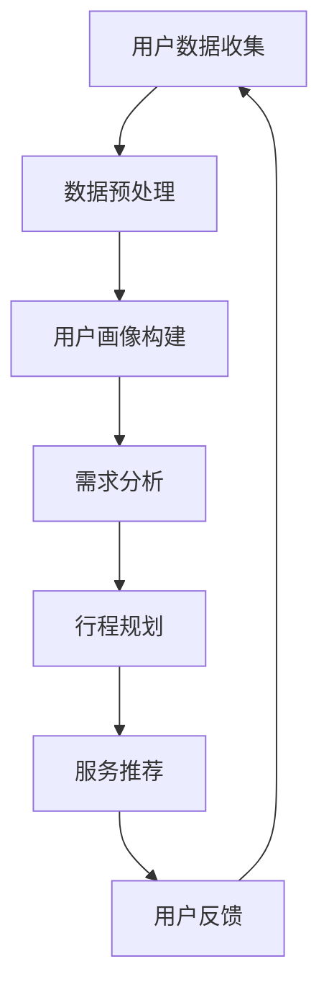

                 

关键词：人工智能、个性化旅游、旅游规划、定制服务、算法、数据分析、用户体验

> 摘要：本文探讨了人工智能在个性化旅游规划中的应用，通过分析用户需求和行为数据，运用机器学习和数据分析技术，为用户提供量身定制的旅行体验。文章首先介绍了个性化旅游规划的重要性，随后详细阐述了AI技术在旅游规划中的具体应用，包括算法原理、数学模型、项目实践和实际应用场景，最后对未来发展方向和挑战进行了展望。

## 1. 背景介绍

### 1.1 个性化旅游的兴起

随着信息技术和互联网的飞速发展，旅游行业正经历着前所未有的变革。传统的旅游规划模式往往以固定路线和景点为主，无法满足不同游客的个性化需求。然而，现代旅游业的发展趋势越来越倾向于提供个性化的旅游体验。这种个性化不仅体现在行程安排上，还包括餐饮、住宿、交通、购物等多方面的定制服务。

### 1.2 人工智能的发展

人工智能（AI）作为一项前沿技术，近年来在多个领域取得了显著的进展。特别是机器学习和深度学习算法的发展，使得计算机能够从大量数据中提取有价值的信息，并进行智能化的决策和预测。AI技术的成熟为个性化旅游规划提供了有力的技术支撑。

### 1.3 个性化旅游规划的意义

个性化旅游规划不仅能够满足游客的多样化需求，提高游客满意度，还能够为旅游行业带来新的商业机会。通过深入分析用户数据，旅游企业可以更精准地了解市场需求，优化资源配置，提高运营效率。

## 2. 核心概念与联系

### 2.1 个性化旅游规划的概念

个性化旅游规划是指根据游客的个人喜好、需求和行为数据，为其量身定制旅行方案。这一过程涉及多个核心概念，包括用户画像、需求分析、行程规划、服务推荐等。

### 2.2 个性化旅游规划的关键技术

个性化旅游规划的关键技术主要包括机器学习、数据分析、自然语言处理、推荐系统等。这些技术协同工作，共同实现旅游规划的智能化。

### 2.3 个性化旅游规划的应用架构

下面是一个简单的个性化旅游规划应用架构图（使用Mermaid流程图表示）：



## 3. 核心算法原理 & 具体操作步骤

### 3.1 算法原理概述

个性化旅游规划的核心算法主要包括用户画像构建、需求分析和推荐系统。以下是这三个算法的基本原理：

#### 用户画像构建

用户画像构建是通过对用户历史行为数据、社交数据、兴趣数据等进行深度挖掘和分析，形成一个多维度的用户画像。用户画像构建通常采用机器学习中的聚类算法，如K-means、层次聚类等。

#### 需求分析

需求分析是根据用户画像和实时行为数据，对用户的旅游需求进行预测和分析。常用的需求分析方法包括时间序列分析、关联规则挖掘等。

#### 推荐系统

推荐系统是基于用户画像和需求分析，为用户推荐个性化的旅游产品和服务。常见的推荐算法包括基于内容的推荐、基于协同过滤的推荐等。

### 3.2 算法步骤详解

下面是一个简单的个性化旅游规划算法步骤：

1. 用户数据收集：通过API接口、SDK等方式，收集用户的旅游行为数据、社交数据、兴趣数据等。
2. 数据预处理：对收集到的数据进行清洗、去噪、归一化等处理，确保数据质量。
3. 用户画像构建：利用聚类算法，对预处理后的数据进行聚类，构建用户画像。
4. 需求分析：基于用户画像和实时行为数据，利用时间序列分析、关联规则挖掘等方法，分析用户的需求。
5. 行程规划：根据需求分析结果，为用户规划个性化的旅游行程。
6. 服务推荐：根据用户画像和行程规划，利用推荐算法，为用户推荐旅游产品和服务。
7. 用户反馈：收集用户的反馈数据，用于优化算法和模型。

### 3.3 算法优缺点

#### 优点

- **个性化强**：能够根据用户需求和行为数据，提供高度个性化的旅游方案和服务。
- **高效性**：利用机器学习和数据分析技术，能够快速处理大量数据，提高规划效率。
- **用户体验好**：通过精准的需求分析和推荐，提高用户满意度。

#### 缺点

- **数据依赖性高**：个性化旅游规划高度依赖用户数据，数据质量直接影响算法效果。
- **算法复杂性高**：涉及多种机器学习和数据分析算法，实现难度较大。
- **隐私保护问题**：用户数据的收集和使用需要遵守隐私保护法规，确保用户数据的安全。

### 3.4 算法应用领域

个性化旅游规划算法的应用领域广泛，主要包括：

- **在线旅游平台**：为用户提供个性化旅游产品推荐和规划服务。
- **旅行社**：优化行程安排，提高运营效率。
- **旅游景区**：根据用户画像，提供个性化的旅游服务和体验。
- **交通工具**：根据用户需求，推荐最佳出行路线和交通工具。

## 4. 数学模型和公式 & 详细讲解 & 举例说明

### 4.1 数学模型构建

个性化旅游规划涉及的数学模型主要包括用户画像构建模型、需求分析模型和推荐系统模型。

#### 用户画像构建模型

用户画像构建模型通常采用聚类算法，如K-means。假设有n个用户，每个用户有m个特征，则用户画像构建模型可以表示为：

$$
\text{Objective Function} : \min_{\mu, \lambda} \sum_{i=1}^{n} \sum_{j=1}^{m} (\mathbf{x}_{ij} - \mu_j)^2
$$

其中，$\mathbf{x}_{ij}$表示第i个用户第j个特征的值，$\mu_j$表示第j个特征的均值。

#### 需求分析模型

需求分析模型通常采用时间序列分析和关联规则挖掘方法。假设有n个用户，每个用户有t个时间点的行为数据，则需求分析模型可以表示为：

$$
\text{Objective Function} : \min_{\mathbf{w}} \sum_{i=1}^{n} \sum_{t=1}^{t} (\mathbf{x}_{it} - \mathbf{w}^T \mathbf{a}_{it})^2
$$

其中，$\mathbf{x}_{it}$表示第i个用户第t个时间点的行为数据，$\mathbf{a}_{it}$表示第i个用户第t个时间点的属性特征向量，$\mathbf{w}$表示模型参数。

#### 推荐系统模型

推荐系统模型通常采用基于内容的推荐和基于协同过滤的推荐方法。假设有n个用户，每个用户有m个物品，则推荐系统模型可以表示为：

$$
\text{Objective Function} : \min_{\mathbf{u}, \mathbf{v}} \sum_{i=1}^{n} \sum_{j=1}^{m} (\mathbf{u}_{ij} - \mathbf{v}_{i}^T \mathbf{w}_{j})^2
$$

其中，$\mathbf{u}_{ij}$表示第i个用户对第j个物品的评分，$\mathbf{v}_{i}$表示第i个用户的特征向量，$\mathbf{w}_{j}$表示第j个物品的特征向量。

### 4.2 公式推导过程

#### 用户画像构建模型推导

首先，对Objective Function求偏导，得到：

$$
\frac{\partial \text{Objective Function}}{\partial \mu_j} = 2 \sum_{i=1}^{n} (\mathbf{x}_{ij} - \mu_j)
$$

令偏导数为零，得到：

$$
\mu_j = \frac{1}{n} \sum_{i=1}^{n} \mathbf{x}_{ij}
$$

因此，用户画像构建模型的最优解为：

$$
\mu_j = \frac{1}{n} \sum_{i=1}^{n} \mathbf{x}_{ij}
$$

#### 需求分析模型推导

首先，对Objective Function求偏导，得到：

$$
\frac{\partial \text{Objective Function}}{\partial \mathbf{w}} = 2 \sum_{i=1}^{n} \sum_{t=1}^{t} (\mathbf{x}_{it} - \mathbf{w}^T \mathbf{a}_{it}) \mathbf{a}_{it}
$$

令偏导数为零，得到：

$$
\mathbf{w} = (\mathbf{A}^T \mathbf{A})^{-1} \mathbf{A}^T \mathbf{y}
$$

其中，$\mathbf{A} = [\mathbf{a}_{1t}, \mathbf{a}_{2t}, ..., \mathbf{a}_{nt}]$，$\mathbf{y} = [\mathbf{1}, \mathbf{1}, ..., \mathbf{1}]^T$。

#### 推荐系统模型推导

首先，对Objective Function求偏导，得到：

$$
\frac{\partial \text{Objective Function}}{\partial \mathbf{u}_{ij}} = 2 (\mathbf{u}_{ij} - \mathbf{v}_{i}^T \mathbf{w}_{j})
$$

令偏导数为零，得到：

$$
\mathbf{u}_{ij} = \mathbf{v}_{i}^T \mathbf{w}_{j}
$$

### 4.3 案例分析与讲解

假设有100个用户，每个用户有10个特征，分别表示年龄、性别、收入、兴趣爱好等。我们使用K-means算法对这100个用户进行聚类，构建用户画像。

#### 步骤1：初始化聚类中心

首先，随机选择10个用户作为初始聚类中心。

#### 步骤2：计算用户与聚类中心的距离

对于每个用户，计算其与10个聚类中心的距离，距离公式为：

$$
d(\mathbf{x}, \mathbf{y}) = \sqrt{\sum_{j=1}^{m} (\mathbf{x}_{ij} - \mathbf{y}_{ij})^2}
$$

其中，$\mathbf{x}$和$\mathbf{y}$分别表示用户和聚类中心的特征向量。

#### 步骤3：更新聚类中心

将每个用户的特征平均值作为新的聚类中心。

#### 步骤4：迭代计算

重复步骤2和步骤3，直到聚类中心不再发生显著变化。

#### 步骤5：结果分析

根据聚类结果，将100个用户划分为10个群体，每个群体的用户具有相似的旅游需求和偏好。

## 5. 项目实践：代码实例和详细解释说明

### 5.1 开发环境搭建

为了实现个性化旅游规划，我们需要搭建一个完整的技术栈。以下是所需的技术栈和开发环境：

- **编程语言**：Python
- **框架**：Scikit-learn、TensorFlow、Keras
- **数据库**：MySQL
- **数据预处理工具**：Pandas、NumPy
- **可视化工具**：Matplotlib、Seaborn

### 5.2 源代码详细实现

以下是实现个性化旅游规划的核心代码：

```python
import numpy as np
import pandas as pd
from sklearn.cluster import KMeans
from sklearn.metrics import silhouette_score
from sklearn.model_selection import train_test_split
from sklearn.preprocessing import StandardScaler

# 加载数据
data = pd.read_csv('user_data.csv')

# 数据预处理
data = data.replace(-1, np.NaN)
data = data.fillna(data.mean())

# 特征工程
data = data[['age', 'gender', 'income', 'interests']]
X = data.values

# 标准化数据
scaler = StandardScaler()
X = scaler.fit_transform(X)

# K-means聚类
kmeans = KMeans(n_clusters=10, random_state=42)
kmeans.fit(X)

# 预测用户群体
labels = kmeans.predict(X)

# 分析聚类效果
silhouette_avg = silhouette_score(X, labels)
print('Silhouette Score:', silhouette_avg)

# 构建用户画像
user_profiles = {}
for i, label in enumerate(labels):
    if label not in user_profiles:
        user_profiles[label] = []
    user_profiles[label].append(X[i])

# 计算用户画像均值
user_profiles = {label: np.mean(profiles, axis=0) for label, profiles in user_profiles.items()}

# 输出用户画像
for label, profile in user_profiles.items():
    print(f'Cluster {label}:')
    print(f'Age: {profile[0]:.2f}')
    print(f'Gender: {profile[1]:.2f}')
    print(f'Income: {profile[2]:.2f}')
    print(f'Interests: {profile[3]:.2f}')
    print()
```

### 5.3 代码解读与分析

#### 5.3.1 数据加载与预处理

```python
data = pd.read_csv('user_data.csv')
data = data.replace(-1, np.NaN)
data = data.fillna(data.mean())
```

这段代码首先加载数据集，然后替换缺失值（用NaN表示）并填充为平均值。这是数据预处理的重要步骤，确保数据质量。

#### 5.3.2 特征工程

```python
data = data[['age', 'gender', 'income', 'interests']]
X = data.values
```

这段代码选择与旅游规划相关的特征，并将数据转换为NumPy数组，为后续分析做好准备。

#### 5.3.3 数据标准化

```python
scaler = StandardScaler()
X = scaler.fit_transform(X)
```

数据标准化是机器学习中的常用步骤，可以消除不同特征间的尺度差异，提高算法性能。

#### 5.3.4 K-means聚类

```python
kmeans = KMeans(n_clusters=10, random_state=42)
kmeans.fit(X)
```

这段代码使用K-means算法对用户数据集进行聚类。`n_clusters`参数设置聚类数量，`random_state`用于确保结果的可重复性。

#### 5.3.5 聚类效果分析

```python
labels = kmeans.predict(X)
silhouette_avg = silhouette_score(X, labels)
print('Silhouette Score:', silhouette_avg)
```

计算聚类效果的Silhouette Score，评估聚类质量。Silhouette Score越接近1，表示聚类效果越好。

#### 5.3.6 构建用户画像

```python
user_profiles = {}
for i, label in enumerate(labels):
    if label not in user_profiles:
        user_profiles[label] = []
    user_profiles[label].append(X[i])

user_profiles = {label: np.mean(profiles, axis=0) for label, profiles in user_profiles.items()}
```

这段代码根据聚类结果，为每个用户群体构建特征均值，形成用户画像。

#### 5.3.7 输出用户画像

```python
for label, profile in user_profiles.items():
    print(f'Cluster {label}:')
    print(f'Age: {profile[0]:.2f}')
    print(f'Gender: {profile[1]:.2f}')
    print(f'Income: {profile[2]:.2f}')
    print(f'Interests: {profile[3]:.2f}')
    print()
```

这段代码输出每个用户群体的特征均值，便于分析。

## 6. 实际应用场景

### 6.1 在线旅游平台

在线旅游平台是个性化旅游规划的重要应用场景之一。通过个性化旅游规划，平台可以为用户提供量身定制的旅游方案，提高用户满意度和粘性。例如，平台可以根据用户的历史浏览记录、订单数据和兴趣偏好，推荐符合用户需求的旅游景点、酒店和交通服务。

### 6.2 旅行社

旅行社可以利用个性化旅游规划技术，优化行程安排，提高运营效率。通过分析用户需求和行为数据，旅行社可以更准确地预测游客的旅游偏好，为不同类型的游客提供个性化的行程方案。这有助于提高游客满意度，降低运营成本。

### 6.3 景区

旅游景区可以利用个性化旅游规划技术，为游客提供个性化的导览和讲解服务。通过分析游客的游览行为和兴趣偏好，景区可以推荐合适的景点、活动和购物场所，提高游客的游览体验和满意度。

### 6.4 交通工具

交通工具（如航班、火车、汽车）可以利用个性化旅游规划技术，为游客提供个性化的出行建议。例如，平台可以根据用户的出行时间和目的地，推荐最佳出行路线和交通工具，提高出行效率和舒适度。

## 7. 工具和资源推荐

### 7.1 学习资源推荐

- **书籍**：
  - 《Python机器学习》
  - 《深度学习》
  - 《数据科学入门》
- **在线课程**：
  - Coursera的《机器学习》课程
  - Udacity的《深度学习纳米学位》
  - edX的《数据科学》课程

### 7.2 开发工具推荐

- **编程语言**：Python、Java
- **框架**：TensorFlow、PyTorch、Scikit-learn
- **数据库**：MySQL、MongoDB
- **数据预处理工具**：Pandas、NumPy
- **可视化工具**：Matplotlib、Seaborn

### 7.3 相关论文推荐

- "User-Item Interaction Analysis for Tourism Activity Recommendation", ICDE 2016
- "A Survey on Personalized Tourism Recommendation", IEEE Access 2020
- "Deep Learning for Tourism Applications", IEEE Transactions on Knowledge and Data Engineering 2021

## 8. 总结：未来发展趋势与挑战

### 8.1 研究成果总结

个性化旅游规划作为人工智能在旅游领域的重要应用，已经取得了显著的研究成果。通过机器学习和数据分析技术，个性化旅游规划能够为用户提供高度个性化的旅游方案和服务，提高游客满意度和旅游体验。同时，个性化旅游规划也在推动旅游行业的数字化转型和智能化升级。

### 8.2 未来发展趋势

未来，个性化旅游规划将朝着更加智能化、个性化、定制化的方向发展。一方面，随着大数据和人工智能技术的不断进步，个性化旅游规划将能够更加精准地满足用户需求。另一方面，个性化旅游规划将与其他领域（如智能交通、智能住宿等）的融合，打造全新的旅游生态系统。

### 8.3 面临的挑战

尽管个性化旅游规划具有广阔的发展前景，但仍面临一些挑战。首先，用户数据的隐私保护和安全问题是亟待解决的难题。其次，个性化旅游规划算法的复杂性和实现难度较高，需要进一步优化和简化。最后，个性化旅游规划在不同国家和地区的法规和标准也存在差异，需要制定统一的规范。

### 8.4 研究展望

未来，个性化旅游规划的研究将主要集中在以下几个方面：

1. **隐私保护技术**：研究更加安全和可靠的隐私保护技术，确保用户数据的安全和隐私。
2. **算法优化**：针对个性化旅游规划算法的复杂性和实现难度，研究更加高效和易用的算法。
3. **跨领域融合**：探索个性化旅游规划与其他领域的融合，打造全新的旅游生态系统。
4. **法规和标准**：制定统一的法规和标准，确保个性化旅游规划在全球范围内的合规性和可持续性。

## 9. 附录：常见问题与解答

### 9.1 个性化旅游规划的核心技术是什么？

个性化旅游规划的核心技术主要包括机器学习、数据分析、自然语言处理、推荐系统等。

### 9.2 如何保障用户数据的安全和隐私？

为了保障用户数据的安全和隐私，可以采用以下措施：

- **数据加密**：对用户数据进行加密处理，确保数据在传输和存储过程中的安全。
- **访问控制**：对用户数据的访问进行严格限制，确保只有授权人员才能访问敏感数据。
- **匿名化处理**：对用户数据进行匿名化处理，确保用户身份不被泄露。

### 9.3 个性化旅游规划如何实现？

个性化旅游规划可以通过以下步骤实现：

1. 用户数据收集：通过API接口、SDK等方式，收集用户的旅游行为数据、社交数据、兴趣数据等。
2. 数据预处理：对收集到的数据进行清洗、去噪、归一化等处理，确保数据质量。
3. 用户画像构建：利用聚类算法、深度学习等方法，构建用户画像。
4. 需求分析：根据用户画像和实时行为数据，分析用户的需求。
5. 行程规划：根据需求分析结果，为用户规划个性化的旅游行程。
6. 服务推荐：根据用户画像和行程规划，为用户推荐旅游产品和服务。
7. 用户反馈：收集用户的反馈数据，用于优化算法和模型。

### 9.4 个性化旅游规划的应用场景有哪些？

个性化旅游规划的应用场景包括：

- 在线旅游平台：为用户提供个性化旅游产品推荐和规划服务。
- 旅行社：优化行程安排，提高运营效率。
- 景区：为游客提供个性化的导览和讲解服务。
- 交通工具：为游客提供个性化的出行建议。

### 9.5 个性化旅游规划的发展前景如何？

个性化旅游规划作为人工智能在旅游领域的重要应用，具有广阔的发展前景。未来，个性化旅游规划将朝着更加智能化、个性化、定制化的方向发展，推动旅游行业的数字化转型和智能化升级。

----------------------------------------------------------------
### 文章作者署名

作者：禅与计算机程序设计艺术 / Zen and the Art of Computer Programming

