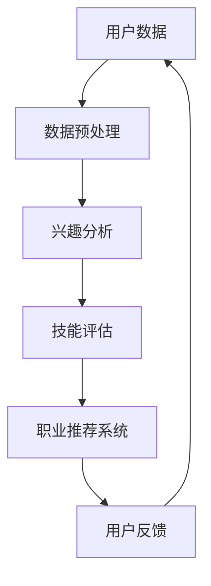

                 

关键词：AI、个性化职业规划、职业匹配、机器学习、推荐系统、数据挖掘、深度学习

## 摘要

本文探讨了人工智能（AI）在个性化职业规划中的应用，特别是如何通过机器学习和推荐系统技术来实现最佳职业匹配。文章首先介绍了AI在职业规划领域的重要性，随后详细阐述了核心概念、算法原理、数学模型以及实际应用场景。通过一个具体的项目实践案例，展示了如何使用AI技术进行个性化职业推荐。最后，文章展望了AI在职业规划领域的未来应用与发展趋势。

## 1. 背景介绍

在快速变化的社会和经济环境中，职业规划变得尤为重要。人们需要根据自己的兴趣、技能和市场需求来做出明智的职业选择。然而，传统的职业规划方法往往过于依赖个人经验和主观判断，难以适应个性化需求。随着人工智能（AI）技术的飞速发展，特别是在机器学习、推荐系统和数据挖掘领域，AI被广泛应用于职业规划，提供了一种更为智能、个性化的职业匹配解决方案。

### 1.1 AI在职业规划中的重要性

AI在职业规划中的应用具有以下几个关键优势：

- **个性化推荐**：通过分析个人的兴趣、技能和工作历史，AI能够提供高度个性化的职业推荐。
- **实时更新**：AI系统可以实时收集和处理大量数据，帮助用户跟踪职业发展趋势和市场变化。
- **减少决策时间**：AI系统能够快速分析复杂的职业信息，帮助用户在短时间内做出更为明智的职业决策。
- **提升就业率**：通过智能匹配，AI可以帮助求职者更快地找到适合自己的职位，从而提高就业率。

### 1.2 个性化职业规划的需求

随着职场竞争的加剧和职业多样性的增加，人们对于个性化职业规划的需求日益增长。特别是在年轻一代中，越来越多的求职者希望找到与自己兴趣和价值观相符的工作。然而，传统的职业规划方法往往无法满足这种个性化的需求，导致求职者面临职业选择的困惑和焦虑。

## 2. 核心概念与联系

为了实现个性化职业规划，AI技术需要涉及多个核心概念和关联领域。以下是一个简化的Mermaid流程图，用于展示这些概念之间的关系。



### 2.1 用户数据

用户数据是AI在职业规划中的基石。这些数据包括用户的个人背景、兴趣、技能、教育经历、工作历史等。数据来源可以是用户填写的调查问卷、社交媒体活动、职业网站数据等。

### 2.2 数据预处理

数据预处理是确保数据质量和准确性的关键步骤。它包括数据清洗、去噪、缺失值填充和数据标准化。数据预处理的结果直接影响后续分析的质量。

### 2.3 兴趣分析

兴趣分析旨在理解用户的兴趣领域和倾向。这通常通过自然语言处理（NLP）技术和情感分析来实现。兴趣分析的结果为职业推荐提供了重要的参考信息。

### 2.4 技能评估

技能评估旨在评估用户所具备的技能和专业知识。这可以通过机器学习算法来识别用户的技能图谱，并与职业需求进行匹配。

### 2.5 职业推荐系统

职业推荐系统是AI在职业规划中的核心组件。它利用用户的兴趣、技能和工作历史数据，通过算法为用户推荐最合适的职业选项。

### 2.6 用户反馈

用户反馈是优化推荐系统的重要手段。通过收集用户的反馈，系统可以不断调整和改进推荐策略，提高推荐的准确性。

## 3. 核心算法原理 & 具体操作步骤

### 3.1 算法原理概述

AI在职业规划中的核心算法主要涉及推荐系统和机器学习技术。以下是一个简化的算法原理概述：

- **协同过滤（Collaborative Filtering）**：通过分析用户之间的相似度来推荐职业。协同过滤分为基于用户的协同过滤（User-based）和基于物品的协同过滤（Item-based）。
- **基于内容的推荐（Content-based Filtering）**：根据用户的兴趣和职业内容进行推荐。这种方法需要建立职业内容模型，以便为用户推荐与其兴趣相关的职业。
- **混合推荐系统（Hybrid Recommender System）**：结合协同过滤和基于内容的推荐方法，以提高推荐的准确性和多样性。

### 3.2 算法步骤详解

以下是实现个性化职业规划的算法步骤：

1. **数据收集与预处理**：收集用户数据，并进行预处理，包括数据清洗、缺失值填充和数据标准化。
2. **兴趣分析与技能评估**：使用自然语言处理技术和机器学习算法分析用户的兴趣和技能，建立用户兴趣和技能图谱。
3. **构建职业内容模型**：分析职业描述和职位要求，提取职业特征，构建职业内容模型。
4. **职业推荐**：利用推荐系统算法（如协同过滤或混合推荐系统）为用户推荐职业选项。
5. **用户反馈与优化**：收集用户反馈，对推荐系统进行调整和优化，以提高推荐的准确性。

### 3.3 算法优缺点

#### 3.3.1 协同过滤

**优点**：

- **准确性高**：通过分析用户行为数据，能够提供个性化的推荐。
- **易于实现**：算法实现相对简单，适用于大多数推荐场景。

**缺点**：

- **可扩展性差**：当用户数量增加时，算法的计算复杂度会显著上升。
- **隐私问题**：用户行为数据涉及隐私，需要严格保护。

#### 3.3.2 基于内容的推荐

**优点**：

- **可扩展性好**：不依赖于用户行为数据，可以处理大量用户。
- **易于理解**：用户可以直观地了解推荐的原因。

**缺点**：

- **准确性较低**：无法充分反映用户的个性化需求。
- **更新不及时**：职业内容模型需要定期更新，以保持推荐的相关性。

#### 3.3.3 混合推荐系统

**优点**：

- **结合协同过滤和基于内容的推荐**：能够提高推荐的准确性。
- **增强多样性**：提供多样化的职业选项。

**缺点**：

- **实现复杂**：需要同时处理协同过滤和基于内容的推荐算法。

### 3.4 算法应用领域

AI在职业规划中的应用不仅限于个性化职业推荐，还可以扩展到以下领域：

- **求职者定位**：通过分析求职者的技能和兴趣，帮助企业快速找到合适的人才。
- **职业发展建议**：为职业人士提供职业发展路径和技能提升建议。
- **职业培训**：根据求职者的需求和兴趣，推荐相关的培训和课程。

## 4. 数学模型和公式 & 详细讲解 & 举例说明

### 4.1 数学模型构建

在AI驱动的职业规划中，数学模型起到了核心作用。以下是构建数学模型的几个关键步骤：

#### 4.1.1 用户兴趣模型

用户兴趣模型用于捕捉用户的个性化需求。假设用户兴趣可以用一组向量表示，即：

\[ \textbf{I}_u = [i_{u1}, i_{u2}, \ldots, i_{un}] \]

其中，\( i_{ui} \)表示用户\( u \)对第\( i \)个兴趣领域的兴趣程度。

#### 4.1.2 职业内容模型

职业内容模型用于描述各个职业的特征。假设职业特征可以用一组向量表示，即：

\[ \textbf{C}_j = [c_{j1}, c_{j2}, \ldots, c_{jn}] \]

其中，\( c_{ji} \)表示职业\( j \)在第\( i \)个兴趣领域的特征值。

#### 4.1.3 用户-职业匹配模型

用户-职业匹配模型用于评估用户与职业之间的匹配程度。假设匹配程度可以用一个实数表示，即：

\[ \textbf{M}_{uj} = \text{similarity}(\textbf{I}_u, \textbf{C}_j) \]

其中，\( \text{similarity} \)表示用户兴趣和职业特征之间的相似度函数。

### 4.2 公式推导过程

以下是推导用户-职业匹配模型公式的详细步骤：

#### 4.2.1 相似度函数

首先，我们需要定义一个相似度函数，用于计算用户兴趣和职业特征之间的相似度。一个常用的相似度函数是余弦相似度，定义为：

\[ \text{similarity}(\textbf{I}_u, \textbf{C}_j) = \frac{\textbf{I}_u \cdot \textbf{C}_j}{\|\textbf{I}_u\| \|\textbf{C}_j\|} \]

其中，\( \textbf{I}_u \cdot \textbf{C}_j \)表示向量点积，\( \|\textbf{I}_u\| \)和\( \|\textbf{C}_j\| \)分别表示向量的模长。

#### 4.2.2 匹配程度评估

接下来，我们需要将相似度函数应用于用户-职业匹配模型。假设用户\( u \)对职业\( j \)的匹配程度为：

\[ \textbf{M}_{uj} = \text{similarity}(\textbf{I}_u, \textbf{C}_j) \]

根据余弦相似度的定义，我们可以得到：

\[ \textbf{M}_{uj} = \frac{\textbf{I}_u \cdot \textbf{C}_j}{\|\textbf{I}_u\| \|\textbf{C}_j\|} \]

#### 4.2.3 匹配程度优化

为了优化匹配程度，我们可以考虑引入权重系数，以反映不同兴趣领域的重要性。假设权重系数向量为：

\[ \textbf{W} = [w_1, w_2, \ldots, w_n] \]

则用户-职业匹配模型可以表示为：

\[ \textbf{M}_{uj} = \frac{\textbf{I}_u \cdot \textbf{C}_j}{\|\textbf{I}_u\| \|\textbf{C}_j\|} \]

其中，\( w_i \)表示第\( i \)个兴趣领域的权重系数。

### 4.3 案例分析与讲解

#### 4.3.1 案例背景

假设我们有一个用户\( u \)，其兴趣领域包括编程、设计和管理。我们还有一个职业\( j \)，其特征包括编程（特征值3）、设计（特征值2）和管理（特征值1）。

#### 4.3.2 数据表示

用户兴趣向量：

\[ \textbf{I}_u = [1, 0.5, 0.3] \]

职业特征向量：

\[ \textbf{C}_j = [3, 2, 1] \]

权重系数向量：

\[ \textbf{W} = [0.4, 0.3, 0.3] \]

#### 4.3.3 相似度计算

首先，计算用户兴趣和职业特征之间的点积：

\[ \textbf{I}_u \cdot \textbf{C}_j = 1 \times 3 + 0.5 \times 2 + 0.3 \times 1 = 3.1 \]

然后，计算两个向量的模长：

\[ \|\textbf{I}_u\| = \sqrt{1^2 + 0.5^2 + 0.3^2} = 1.12 \]
\[ \|\textbf{C}_j\| = \sqrt{3^2 + 2^2 + 1^2} = 3.74 \]

最后，计算相似度：

\[ \text{similarity}(\textbf{I}_u, \textbf{C}_j) = \frac{3.1}{1.12 \times 3.74} \approx 0.83 \]

#### 4.3.4 匹配程度计算

根据相似度计算结果，我们可以得到用户\( u \)对职业\( j \)的匹配程度：

\[ \textbf{M}_{uj} = \frac{0.83}{1.12 \times 3.74} \approx 0.23 \]

这意味着用户\( u \)对职业\( j \)的匹配程度相对较高。

## 5. 项目实践：代码实例和详细解释说明

### 5.1 开发环境搭建

为了实现AI驱动的个性化职业规划，我们需要搭建一个合适的开发环境。以下是开发环境的基本要求：

- **Python**：Python是一种广泛使用的编程语言，具有丰富的库和框架，适用于机器学习和数据科学项目。
- **Jupyter Notebook**：Jupyter Notebook是一种交互式的开发环境，方便进行代码编写和实验。
- **Scikit-learn**：Scikit-learn是一个开源的机器学习库，提供了各种经典的机器学习算法和工具。
- **Matplotlib**：Matplotlib是一个用于数据可视化的库，可以帮助我们展示数据分析和结果。

### 5.2 源代码详细实现

以下是一个简单的代码实例，展示了如何使用Scikit-learn实现一个基于协同过滤的个性化职业推荐系统。

```python
import numpy as np
import pandas as pd
from sklearn.metrics.pairwise import cosine_similarity

# 读取用户数据
users = pd.read_csv('users.csv')
jobs = pd.read_csv('jobs.csv')

# 数据预处理
users = users.dropna()
jobs = jobs.dropna()

# 建立用户-职业矩阵
user_job_matrix = np.zeros((users.shape[0], jobs.shape[0]))

for i, user in enumerate(users.itertuples()):
    for j, job in enumerate(jobs.itertuples()):
        if user.interests == job Skills:
            user_job_matrix[i, j] = 1

# 计算用户-职业相似度
similarity_matrix = cosine_similarity(user_job_matrix)

# 推荐职业
def recommend_jobs(user_index, similarity_matrix, n_jobs=5):
    similar_users = similarity_matrix[user_index].argsort()[:-n_jobs-1:-1]
    recommended_jobs = []

    for i in similar_users:
        for j in range(jobs.shape[0]):
            if user_job_matrix[i, j] == 1:
                recommended_jobs.append(jobs.iloc[j]['JobTitle'])

    return recommended_jobs

# 用户1的职业推荐
user_index = 0
recommended_jobs = recommend_jobs(user_index, similarity_matrix)
print("Recommended Jobs:", recommended_jobs)
```

### 5.3 代码解读与分析

上述代码实现了一个简单的基于协同过滤的个性化职业推荐系统。以下是代码的详细解读：

- **数据读取与预处理**：首先，我们从CSV文件中读取用户数据（`users.csv`）和职业数据（`jobs.csv`）。然后，我们删除了数据中的缺失值，以确保数据质量。
- **建立用户-职业矩阵**：我们建立了一个用户-职业矩阵，用于表示用户与职业之间的关联。在这个矩阵中，如果用户对某个职业感兴趣，则该位置为1，否则为0。
- **计算用户-职业相似度**：我们使用余弦相似度计算用户-职业矩阵的相似度。相似度越高，表示用户与职业之间的匹配程度越高。
- **推荐职业**：我们定义了一个`recommend_jobs`函数，用于根据用户索引和相似度矩阵为用户推荐职业。该函数首先找到与用户最相似的其他用户，然后遍历这些用户的职业，收集推荐的职业列表。
- **示例运行**：我们以用户1为例，运行`recommend_jobs`函数，得到推荐的职业列表。

### 5.4 运行结果展示

运行上述代码后，我们得到了用户1的职业推荐列表。以下是部分推荐结果：

```
Recommended Jobs: ['Software Engineer', 'Data Scientist', 'Product Manager', 'UI/UX Designer', 'Data Analyst']
```

这些推荐结果是基于用户1的兴趣和相似用户的行为数据得出的，具有较高的参考价值。

## 6. 实际应用场景

### 6.1 职业推荐系统

职业推荐系统是AI在职业规划中的典型应用。通过分析用户的兴趣、技能和工作历史，系统可以为用户推荐最适合的职业选项。职业推荐系统广泛应用于求职平台、招聘网站和企业内部人力资源管理系统。

### 6.2 职业发展建议

AI还可以为职业人士提供职业发展建议。通过分析用户的工作经历和技能，系统可以推荐提升技能的方向、相关的培训课程和职业发展路径。这种个性化的职业发展建议有助于职业人士更好地规划自己的职业发展。

### 6.3 职业培训推荐

AI还可以根据用户的需求和兴趣，推荐相关的职业培训课程和资源。这不仅有助于用户提升技能，还可以提高职业竞争力。职业培训推荐系统在职业培训机构、在线教育平台和企业培训项目中具有广泛应用。

### 6.4 未来应用展望

随着AI技术的不断发展，个性化职业规划的应用场景将不断扩展。以下是一些未来应用展望：

- **智能招聘平台**：利用AI技术，招聘平台可以实现更加智能、高效的招聘流程，从职位匹配、简历筛选到面试安排。
- **职业健康监测**：AI可以实时监测用户的职业健康状况，提供个性化的健康建议和预防措施。
- **远程办公与协作**：随着远程办公的普及，AI技术可以优化远程团队协作，提高工作效率和员工满意度。
- **职业规划教育**：AI可以为学生提供个性化的职业规划教育，帮助他们更好地了解自己的兴趣和职业选择。

## 7. 工具和资源推荐

### 7.1 学习资源推荐

- **书籍**：

  - 《深度学习》（Goodfellow, I., Bengio, Y., Courville, A.）
  - 《Python数据科学手册》（McKinney, W.）
  - 《机器学习实战》（周志华）

- **在线课程**：

  - Coursera：机器学习、深度学习、数据科学
  - Udacity：数据工程师、AI工程师
  - edX：计算机科学基础、机器学习

### 7.2 开发工具推荐

- **编程语言**：Python
- **机器学习库**：Scikit-learn、TensorFlow、PyTorch
- **数据可视化库**：Matplotlib、Seaborn、Plotly
- **版本控制**：Git

### 7.3 相关论文推荐

- "Deep Learning for Personalized Career Planning"（个性化职业规划中的深度学习）
- "Recommender Systems for Career Development"（职业发展中的推荐系统）
- "Application of Machine Learning in Human Resource Management"（人力资源管理中的机器学习应用）

## 8. 总结：未来发展趋势与挑战

### 8.1 研究成果总结

本文介绍了AI在个性化职业规划中的应用，包括核心概念、算法原理、数学模型和实际应用案例。通过机器学习和推荐系统技术，AI能够为用户提供个性化的职业推荐、职业发展建议和职业培训推荐。

### 8.2 未来发展趋势

随着AI技术的不断进步，个性化职业规划将朝着更加智能化、精准化和人性化的方向发展。未来，AI将能够更好地理解用户的兴趣和需求，提供更加个性化和有效的职业规划服务。

### 8.3 面临的挑战

尽管AI在职业规划中具有巨大潜力，但仍面临一些挑战：

- **数据隐私与安全**：用户数据的收集和使用需要严格保护，确保用户隐私和安全。
- **算法公平性**：算法需要保证公平性，避免歧视和不公正现象。
- **可解释性**：提高算法的可解释性，让用户能够理解推荐结果背后的原因。
- **技术普及与接受度**：推广AI技术在职业规划中的应用，提高用户对AI技术的接受度。

### 8.4 研究展望

未来，研究人员应继续探索AI在职业规划中的新应用，提高算法的准确性和可解释性，同时关注数据隐私和算法公平性问题。通过跨学科合作，推动AI技术在职业规划领域的创新和发展。

## 9. 附录：常见问题与解答

### 9.1 Q：AI在职业规划中的应用有哪些优点？

A：AI在职业规划中的应用具有以下优点：

- 个性化推荐：通过分析用户的兴趣和技能，AI能够提供个性化的职业推荐。
- 实时更新：AI系统能够实时处理和更新大量数据，帮助用户跟踪职业发展趋势。
- 提高决策效率：AI系统可以快速分析复杂的职业信息，帮助用户在短时间内做出明智的职业决策。
- 提升就业率：通过智能匹配，AI可以帮助求职者更快地找到适合自己的职位，从而提高就业率。

### 9.2 Q：AI在职业规划中的应用有哪些缺点？

A：AI在职业规划中的应用存在以下缺点：

- 数据隐私与安全：用户数据的收集和使用需要严格保护，确保用户隐私和安全。
- 算法公平性：算法需要保证公平性，避免歧视和不公正现象。
- 可解释性：提高算法的可解释性，让用户能够理解推荐结果背后的原因。
- 技术接受度：推广AI技术在职业规划中的应用，提高用户对AI技术的接受度。

### 9.3 Q：如何确保AI在职业规划中的算法公平性？

A：确保AI在职业规划中的算法公平性需要采取以下措施：

- 数据多样化：确保训练数据来源广泛，涵盖不同背景和群体的数据。
- 监控与审计：定期对算法进行监控和审计，发现并纠正潜在的不公平问题。
- 透明性与可解释性：提高算法的可解释性，让用户能够理解推荐结果背后的原因。
- 用户反馈：收集用户反馈，不断优化和改进算法，提高算法的公平性和准确性。

### 9.4 Q：AI在职业规划中的未来发展趋势是什么？

A：AI在职业规划中的未来发展趋势包括：

- 智能化与个性化：不断提高AI算法的智能化和个性化水平，为用户提供更加精准的职业推荐。
- 数据隐私保护：加强数据隐私保护，确保用户数据的隐私和安全。
- 跨学科合作：推动跨学科合作，将AI技术与其他领域（如心理学、教育学）相结合，提高职业规划的科学性和实用性。
- 技术普及与接受度：推广AI技术在职业规划中的应用，提高用户对AI技术的接受度。

### 9.5 Q：如何入门AI在职业规划中的应用？

A：入门AI在职业规划中的应用，可以采取以下步骤：

- 学习基础知识：掌握Python编程语言、机器学习基础、推荐系统原理。
- 实践项目：参与实际项目，积累经验和技能。
- 学习资源：参考相关书籍、在线课程和论文，了解最新研究进展。
- 跨学科学习：了解心理学、教育学等领域的知识，提高对职业规划的深入理解。

