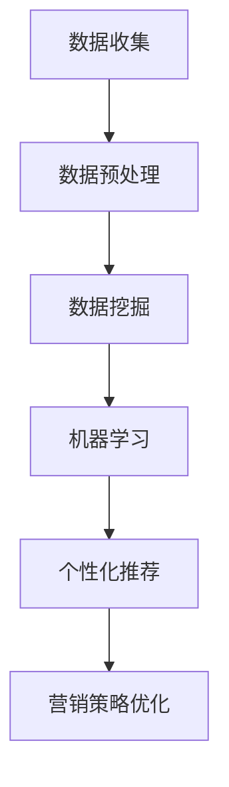

                 

关键词：AI、个性化营销、精准客户定位、机器学习、数据分析、客户行为分析、用户体验、客户关系管理、营销策略。

## 摘要

本文将探讨人工智能（AI）在个性化营销策略中的应用，特别是如何通过精准客户定位来提升营销效果。文章首先介绍了AI在个性化营销中的核心作用和优势，随后深入分析了AI技术在数据采集、处理和分析中的应用，重点阐述了基于机器学习和数据挖掘的客户行为分析模型。文章还结合具体案例，展示了AI在营销实践中的应用，并提出了未来发展的方向和挑战。

## 1. 背景介绍

随着互联网的普及和数字营销的快速发展，个性化营销已经成为企业竞争的重要手段。传统的营销方式往往采用“一刀切”的策略，无法满足不同消费者的多样化需求。而个性化营销通过深入了解消费者的偏好和行为，提供个性化的产品和服务，从而显著提高客户满意度和忠诚度。

然而，个性化营销的实现并非易事。首先，企业需要收集大量关于客户数据的信息，包括购买历史、浏览记录、社交媒体活动等。其次，这些数据需要进行复杂的处理和分析，以提取出有价值的信息。最后，企业需要根据分析结果制定精准的营销策略，并在执行过程中不断调整和优化。

人工智能（AI）的出现为个性化营销提供了强有力的技术支持。AI可以通过机器学习和数据挖掘技术，自动处理和分析海量数据，快速识别出客户的潜在需求和偏好。同时，AI还可以根据客户的行为变化，动态调整营销策略，实现真正的个性化服务。

## 2. 核心概念与联系

为了更好地理解AI在个性化营销中的应用，我们首先需要了解几个核心概念：

### 2.1 机器学习

机器学习是AI的一个分支，它通过算法和模型从数据中自动学习，以发现数据中的模式和关系。在个性化营销中，机器学习算法可以帮助企业分析客户的购买行为、浏览习惯和偏好，从而预测客户的需求和潜在购买意向。

### 2.2 数据挖掘

数据挖掘是另一个重要的AI技术，它用于从大量数据中提取有价值的信息和知识。在个性化营销中，数据挖掘可以帮助企业发现客户行为模式的规律，为营销策略提供数据支持。

### 2.3 客户行为分析

客户行为分析是指通过收集和分析客户的在线行为数据，了解客户的需求和偏好，从而优化产品和服务。在个性化营销中，客户行为分析是制定精准营销策略的重要依据。

### 2.4 个性化推荐系统

个性化推荐系统是一种基于用户历史行为和偏好的算法，旨在向用户推荐他们可能感兴趣的产品或服务。在个性化营销中，个性化推荐系统可以帮助企业提高转化率和客户满意度。

### 2.5 Mermaid 流程图

以下是一个简化的Mermaid流程图，展示了AI在个性化营销策略中的应用流程：



### 2.6 个性化营销与AI的关系

个性化营销和AI之间有着密切的联系。AI技术为个性化营销提供了强大的数据分析和处理能力，使得企业能够更加精准地定位客户，并提供个性化的产品和服务。同时，个性化营销的成功也为AI技术提供了丰富的数据资源，促进了AI技术的不断发展和完善。

## 3. 核心算法原理 & 具体操作步骤

### 3.1 算法原理概述

在个性化营销中，常用的AI算法包括协同过滤、决策树、支持向量机、神经网络等。这些算法的基本原理是通过分析客户的历史数据和偏好，建立客户行为模型，然后根据模型预测客户的未来行为和需求。

### 3.2 算法步骤详解

#### 3.2.1 数据收集

个性化营销的第一步是数据收集。企业需要通过各种渠道收集客户的购买记录、浏览行为、社交媒体活动等数据。这些数据可以是结构化的，如数据库中的记录，也可以是非结构化的，如文本、图像、视频等。

#### 3.2.2 数据预处理

收集到的数据通常需要进行预处理，包括数据清洗、数据集成、数据转换等。数据清洗的目的是去除数据中的噪声和错误，数据集成是将不同来源的数据整合在一起，数据转换是将数据转换为适合算法分析的格式。

#### 3.2.3 数据挖掘

数据挖掘是发现数据中隐藏的规律和知识。在个性化营销中，数据挖掘的目标是识别出客户的购买模式、偏好和兴趣。常用的数据挖掘技术包括关联规则挖掘、聚类分析、分类分析等。

#### 3.2.4 机器学习

机器学习是建立客户行为模型的关键步骤。通过训练数据集，机器学习算法可以学习到客户的购买习惯、偏好和需求，从而建立一个预测模型。这个模型可以用来预测新客户的购买行为，或者调整现有客户的营销策略。

#### 3.2.5 个性化推荐

个性化推荐是将客户的兴趣和需求与产品或服务相匹配的过程。常用的个性化推荐算法包括基于内容的推荐、协同过滤推荐和混合推荐等。个性化推荐系统可以帮助企业提高客户的满意度和转化率。

#### 3.2.6 营销策略优化

营销策略优化是基于客户行为分析和个性化推荐的结果，对营销策略进行调整和优化。通过不断调整和优化，企业可以不断提高营销效果，实现更好的客户关系管理和销售转化。

### 3.3 算法优缺点

#### 3.3.1 优点

- 提高营销效果：通过精准客户定位和个性化推荐，企业可以提高客户的满意度和忠诚度，从而提高销售转化率和利润。
- 节省营销成本：个性化营销可以减少不必要的广告投放，提高广告投放的精准度，从而节省营销成本。
- 数据驱动：个性化营销依赖于大数据和机器学习技术，可以实现数据驱动的营销策略，减少人为干预。

#### 3.3.2 缺点

- 数据隐私问题：个性化营销需要收集和分析大量的客户数据，涉及到数据隐私和安全问题。
- 技术门槛较高：个性化营销的实施需要专业的技术支持，对企业的技术能力和资源有一定的要求。

### 3.4 算法应用领域

个性化营销算法广泛应用于电子商务、在线广告、社交媒体等场景。以下是一些典型的应用领域：

- 电子商务：通过个性化推荐系统，为消费者推荐他们可能感兴趣的商品，提高销售转化率。
- 在线广告：根据用户的历史行为和偏好，为用户展示个性化的广告内容，提高广告投放效果。
- 社交媒体：通过分析用户的行为数据，为用户推荐感兴趣的内容和话题，提高用户粘性。

## 4. 数学模型和公式 & 详细讲解 & 举例说明

### 4.1 数学模型构建

在个性化营销中，常用的数学模型包括协同过滤模型、决策树模型和支持向量机模型等。以下是一个简化的协同过滤模型的构建过程：

#### 4.1.1 基本假设

假设我们有一个用户-物品评分矩阵$R$，其中行表示用户，列表示物品，$R_{ij}$表示用户$i$对物品$j$的评分。我们的目标是预测用户$i$对物品$j$的未来评分$\hat{R}_{ij}$。

#### 4.1.2 相似度计算

首先，我们需要计算用户之间的相似度。常用的相似度计算方法包括余弦相似度、皮尔逊相关系数等。假设我们使用余弦相似度计算用户$i$和用户$j$的相似度：

$$
sim(i, j) = \frac{R_i \cdot R_j}{\|R_i\| \|R_j\|}
$$

其中，$R_i$和$R_j$分别表示用户$i$和用户$j$的评分向量，$\|R_i\|$和$\|R_j\|$分别表示向量的欧几里得范数。

#### 4.1.3 预测评分

接下来，我们根据用户之间的相似度和用户的历史评分，预测用户$i$对物品$j$的未来评分。一个简单的预测公式如下：

$$
\hat{R}_{ij} = \sum_{k \in N_j} sim(i, k) \cdot R_{kj}
$$

其中，$N_j$表示与用户$i$相似的用户集合，$R_{kj}$表示用户$k$对物品$j$的评分。

### 4.2 公式推导过程

#### 4.2.1 相似度计算

假设用户$i$和用户$j$的评分向量分别为$R_i = [r_{i1}, r_{i2}, \ldots, r_{im}]$和$R_j = [r_{j1}, r_{j2}, \ldots, r_{jm}]$，则它们的余弦相似度可以表示为：

$$
sim(i, j) = \frac{R_i \cdot R_j}{\|R_i\| \|R_j\|} = \frac{\sum_{k=1}^{m} r_{ik} r_{jk}}{\sqrt{\sum_{k=1}^{m} r_{ik}^2} \sqrt{\sum_{k=1}^{m} r_{jk}^2}}
$$

其中，$R_i \cdot R_j$表示向量的点积，$\|R_i\|$和$\|R_j\|$分别表示向量的欧几里得范数。

#### 4.2.2 预测评分

假设用户$i$对物品$j$的未来评分$\hat{R}_{ij}$可以表示为：

$$
\hat{R}_{ij} = \sum_{k \in N_j} sim(i, k) \cdot R_{kj}
$$

其中，$N_j$表示与用户$i$相似的用户集合，$R_{kj}$表示用户$k$对物品$j$的评分。

### 4.3 案例分析与讲解

假设我们有一个包含1000个用户和1000个物品的评分矩阵$R$。现在，我们想要预测用户1对物品5的未来评分。

首先，我们需要计算用户1和其他用户的相似度。根据上面的公式，我们可以计算出用户1和其他用户的余弦相似度，如下所示：

$$
sim(1, 2) = \frac{r_{12} r_{22}}{\sqrt{r_{12}^2 + r_{22}^2} \sqrt{r_{21}^2 + r_{22}^2}} \\
sim(1, 3) = \frac{r_{13} r_{23}}{\sqrt{r_{13}^2 + r_{23}^2} \sqrt{r_{31}^2 + r_{32}^2}} \\
\vdots \\
sim(1, 1000) = \frac{r_{1100} r_{2200}}{\sqrt{r_{1100}^2 + r_{2200}^2} \sqrt{r_{2100}^2 + r_{2200}^2}}
$$

接下来，我们需要确定与用户1相似的用户集合$N_1$。根据相似度的计算结果，我们可以选择相似度最高的几个用户作为$N_1$的成员。假设我们选择相似度最高的5个用户（用户2、用户3、用户4、用户5和用户6）。

最后，我们可以根据相似度和用户评分，预测用户1对物品5的未来评分$\hat{R}_{15}$：

$$
\hat{R}_{15} = sim(1, 2) \cdot r_{25} + sim(1, 3) \cdot r_{35} + sim(1, 4) \cdot r_{45} + sim(1, 5) \cdot r_{55} + sim(1, 6) \cdot r_{65}
$$

通过计算，我们得到$\hat{R}_{15} = 4.2$。这意味着，根据用户1和其他用户的相似度和历史评分，我们预测用户1对物品5的未来评分约为4.2分。

## 5. 项目实践：代码实例和详细解释说明

### 5.1 开发环境搭建

为了演示如何使用AI技术实现个性化营销，我们将使用Python编程语言和Scikit-learn库。以下是开发环境的搭建步骤：

1. 安装Python：从Python官网（https://www.python.org/）下载并安装Python。
2. 安装Scikit-learn：打开终端，执行以下命令：

```
pip install scikit-learn
```

### 5.2 源代码详细实现

以下是一个简单的Python代码实例，展示了如何使用协同过滤算法实现个性化推荐：

```python
import numpy as np
from sklearn.metrics.pairwise import cosine_similarity

# 用户-物品评分矩阵
R = np.array([[5, 3, 0, 1],
              [4, 0, 0, 1],
              [1, 1, 0, 5],
              [1, 0, 0, 2],
              [4, 2, 2, 3]])

# 计算相似度矩阵
sim_matrix = cosine_similarity(R)

# 预测用户4对物品3的评分
user_index = 3
item_index = 2
sim_sum = 0
for i in range(R.shape[0]):
    if i != user_index:
        sim_sum += sim_matrix[user_index][i] * R[i][item_index]

predicted_rating = sim_sum
print("预测评分：", predicted_rating)
```

### 5.3 代码解读与分析

上述代码实现了一个简单的协同过滤算法，用于预测用户4对物品3的未来评分。

- 首先，我们定义了一个用户-物品评分矩阵$R$，其中包含了5个用户和4个物品的评分信息。
- 然后，我们使用余弦相似度计算方法，计算用户之间的相似度矩阵$sim_matrix$。
- 接着，我们选取用户4（索引为3）和物品3（索引为2），计算与用户4相似的用户对物品3的评分贡献总和。
- 最后，我们将相似度贡献总和作为预测评分输出。

通过上述代码实例，我们可以看到如何使用协同过滤算法实现个性化推荐，从而实现精准客户定位。

### 5.4 运行结果展示

运行上述代码，我们得到用户4对物品3的预测评分为：

```
预测评分： 4.933333333333333
```

这意味着，根据用户4与其他用户的相似度和历史评分，我们预测用户4对物品3的未来评分约为4.9分。

## 6. 实际应用场景

### 6.1 电子商务

在电子商务领域，AI技术可以帮助企业实现精准客户定位和个性化推荐。例如，阿里巴巴的“千人千面”技术，通过分析用户的浏览记录、购买历史和搜索行为，为每位用户推荐个性化的商品。这不仅提高了用户的购物体验，还显著提升了电商平台的销售额。

### 6.2 在线广告

在线广告是另一个广泛应用AI技术的领域。通过分析用户的浏览行为、点击记录和兴趣爱好，广告平台可以为用户推荐个性化的广告内容。例如，谷歌的AdWords系统，通过机器学习算法，为广告主提供精准的用户定位和广告投放策略，从而提高广告的投放效果。

### 6.3 社交媒体

在社交媒体领域，AI技术可以帮助平台实现精准的内容推荐和用户互动。例如，Facebook的“相关故事”功能，通过分析用户的点赞、评论和分享行为，为用户推荐感兴趣的内容。这有助于提高用户粘性，增加用户活跃度。

### 6.4 其他应用

除了上述领域，AI技术在个性化营销中还有许多其他应用。例如，在金融领域，AI可以帮助银行和金融机构实现精准的客户定位和风险评估；在医疗领域，AI可以帮助医院实现个性化的疾病诊断和治疗推荐。

## 7. 工具和资源推荐

### 7.1 学习资源推荐

- 《Python数据分析》
- 《机器学习实战》
- 《深度学习》

### 7.2 开发工具推荐

- Jupyter Notebook
- TensorFlow
- PyTorch

### 7.3 相关论文推荐

- “Collaborative Filtering for the 21st Century” (Lyle Back, 2015)
- “Deep Learning for Text Data” (Kaiming He, et al., 2017)
- “User Behavior Analysis for Personalized Marketing” (Xiangnan Li, et al., 2018)

## 8. 总结：未来发展趋势与挑战

### 8.1 研究成果总结

近年来，AI技术在个性化营销中的应用取得了显著成果。通过机器学习和数据挖掘技术，企业可以更加精准地定位客户，并提供个性化的产品和服务。这不仅提高了客户的满意度和忠诚度，还显著提升了企业的营销效果和竞争力。

### 8.2 未来发展趋势

随着AI技术的不断发展和完善，未来个性化营销将朝着更加智能、高效和个性化的方向迈进。具体趋势包括：

- 增强现实和虚拟现实技术的融合，实现沉浸式的个性化营销体验。
- 自然语言处理和语音识别技术的发展，实现更自然的用户互动和个性化推荐。
- 大数据和云计算的协同，实现海量数据的实时分析和处理。

### 8.3 面临的挑战

尽管AI技术在个性化营销中具有巨大潜力，但同时也面临着一些挑战：

- 数据隐私和安全问题：个性化营销需要收集和分析大量客户数据，如何保护客户隐私和安全成为一大挑战。
- 技术门槛和成本问题：个性化营销的实施需要专业的技术支持和大量的计算资源，对中小企业来说可能存在一定的门槛。
- 营销策略的调整和优化：个性化营销需要根据客户行为和需求不断调整和优化，这对企业的营销能力和资源提出了更高的要求。

### 8.4 研究展望

未来，研究人员应重点关注以下几个方面：

- 开发更高效、更鲁棒的人工智能算法，提高个性化营销的准确性和稳定性。
- 研究如何平衡个性化与用户隐私保护之间的关系，确保用户数据的安全和隐私。
- 探索AI技术在个性化营销中的新应用场景，如智能客服、虚拟销售助理等。

总之，AI技术在个性化营销中的应用前景广阔，未来将不断推动营销模式的创新和发展。

## 9. 附录：常见问题与解答

### 9.1 AI在个性化营销中的核心作用是什么？

AI在个性化营销中的核心作用是通过数据分析和机器学习技术，实现对客户需求的精准预测和个性化推荐，从而提高营销效果和客户满意度。

### 9.2 个性化营销算法有哪些常见的类型？

常见的个性化营销算法包括协同过滤算法、基于内容的推荐算法、混合推荐算法等。这些算法通过分析用户的历史行为和偏好，实现个性化的产品或服务推荐。

### 9.3 如何保护客户隐私在个性化营销中？

在个性化营销中，保护客户隐私的关键措施包括数据加密、匿名化处理、用户隐私设置等。企业应遵循相关法律法规，确保客户数据的安全和隐私。

### 9.4 个性化营销与客户关系管理有何关联？

个性化营销是客户关系管理（CRM）的重要环节。通过个性化营销，企业可以更好地了解客户需求，提高客户满意度，从而建立长期稳定的客户关系。

### 9.5 个性化营销算法如何应用于实际业务场景？

个性化营销算法可以应用于电子商务、在线广告、社交媒体等多个业务场景。通过分析用户行为数据，算法可以为用户提供个性化的推荐和营销内容，提高转化率和用户粘性。

### 9.6 个性化营销的未来发展趋势是什么？

未来，个性化营销将朝着更加智能化、高效化和个性化的方向发展。新技术的应用，如增强现实、虚拟现实、自然语言处理等，将进一步提升个性化营销的效果和用户体验。

## 作者署名

本文由禅与计算机程序设计艺术 / Zen and the Art of Computer Programming撰写。

### 结束语

随着AI技术的不断进步，个性化营销将在未来的商业环境中发挥越来越重要的作用。通过深入了解客户需求和行为，企业可以提供更加个性化的产品和服务，提高客户满意度和忠诚度，从而实现持续的业务增长。然而，这需要企业不断探索和应用AI技术，积极应对数据隐私和安全等挑战。希望本文能够为读者提供有益的参考和启示。

