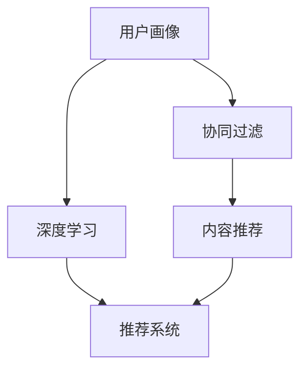

                 

关键词：个性化视频推荐、AI算法、用户体验、推荐系统、机器学习、大数据分析

> 摘要：本文将深入探讨人工智能在个性化视频推荐系统中的应用，分析其工作原理、算法原理、数学模型，并通过具体项目实践展示如何提升用户的观看体验。

## 1. 背景介绍

随着互联网的迅速发展和视频内容的爆炸式增长，用户面对海量的视频资源时往往会感到无从下手。传统的视频推荐系统往往基于流行度或类别推荐，无法满足个性化需求。近年来，人工智能技术，尤其是机器学习和深度学习的发展，为个性化视频推荐系统带来了新的可能。本文将围绕人工智能在个性化视频推荐中的应用，探讨其核心原理、算法和实现方法。

### 1.1 个性化视频推荐的意义

个性化视频推荐能够根据用户的观看历史、兴趣偏好、行为习惯等，为用户推荐符合其个性化需求的内容，从而提高用户的观看体验，增加用户粘性。此外，个性化推荐还能够帮助视频平台发掘潜在用户，提高内容分发的效率。

### 1.2 人工智能在个性化视频推荐中的作用

人工智能技术，特别是机器学习和深度学习，通过分析大量的用户数据，能够自动发现用户的兴趣和行为模式，从而生成个性化的推荐列表。这种基于数据驱动的推荐方式，相比传统的基于内容的推荐（如基于视频的标签、分类等），具有更高的准确性和个性化程度。

## 2. 核心概念与联系

### 2.1 核心概念

- **用户画像**：通过用户的行为数据、兴趣偏好、历史记录等信息构建的用户模型。
- **协同过滤**：一种基于用户行为数据的推荐算法，通过分析用户之间的相似度来推荐相似的用户喜欢的物品。
- **内容推荐**：基于视频的属性（如类别、标签、主题等）进行推荐。
- **深度学习**：一种基于神经网络的学习方法，能够在大量数据中自动提取特征。

### 2.2 Mermaid 流程图



### 2.3 关系解释

- **用户画像**作为推荐系统的输入，提供了关于用户的详细信息，是构建个性化推荐的基础。
- **协同过滤**和**内容推荐**是推荐系统的两大核心，协同过滤关注用户之间的相似性，而内容推荐关注视频之间的相似性。
- **深度学习**作为一种强大的特征提取工具，能够从海量的用户行为数据中提取出有用的特征，从而提高推荐系统的准确性。
- **推荐系统**整合以上三种技术，为用户提供个性化的视频推荐。

## 3. 核心算法原理 & 具体操作步骤

### 3.1 算法原理概述

个性化视频推荐系统通常采用以下几种算法：

- **基于内容的推荐（Content-Based Filtering）**：根据用户过去喜欢的内容来推荐相似的物品。
- **协同过滤（Collaborative Filtering）**：根据用户之间的相似性来推荐用户可能感兴趣的物品。
- **混合推荐（Hybrid Recommendation）**：结合基于内容的推荐和协同过滤，以提高推荐系统的准确性和覆盖率。

### 3.2 算法步骤详解

1. **用户画像构建**：
   - 收集用户的基础信息（如年龄、性别、地理位置等）。
   - 分析用户的观看历史和交互行为，提取用户的兴趣偏好。

2. **协同过滤**：
   - 计算用户之间的相似度，常用的方法有基于用户的最近邻（User-Based）和基于模型的（Model-Based）。
   - 根据相似度矩阵推荐用户可能感兴趣的物品。

3. **内容推荐**：
   - 提取视频的元数据信息，如标签、类别、主题等。
   - 根据用户的兴趣偏好和视频的元数据信息，推荐相似的物品。

4. **混合推荐**：
   - 结合协同过滤和内容推荐，生成综合推荐列表。

### 3.3 算法优缺点

- **基于内容的推荐**：
  - 优点：推荐结果与用户的兴趣偏好密切相关，准确度高。
  - 缺点：用户兴趣的变化可能无法及时反映，且难以处理新用户。

- **协同过滤**：
  - 优点：能够处理新用户和新物品，推荐结果具有多样性。
  - 缺点：推荐结果可能过于集中，用户隐私问题。

- **混合推荐**：
  - 优点：综合了基于内容和协同过滤的优点，推荐结果更加准确和多样。
  - 缺点：算法复杂度较高，计算成本大。

### 3.4 算法应用领域

- **视频平台**：如YouTube、Netflix等，通过个性化推荐提高用户粘性。
- **社交媒体**：如Facebook、微博等，通过个性化推荐吸引用户互动。
- **在线教育**：如Coursera、Udemy等，通过个性化推荐提高学习效果。

## 4. 数学模型和公式 & 详细讲解 & 举例说明

### 4.1 数学模型构建

个性化视频推荐系统通常基于以下数学模型：

- **用户行为模型**：\( u_i = \sum_{j} w_{ij} v_j \)
  - \( u_i \)：用户 \( i \) 的行为向量。
  - \( w_{ij} \)：用户 \( i \) 对物品 \( j \) 的兴趣权重。
  - \( v_j \)：物品 \( j \) 的特征向量。

- **物品特征模型**：\( v_j = \sum_{k} h_{jk} f_k \)
  - \( v_j \)：物品 \( j \) 的特征向量。
  - \( h_{jk} \)：物品 \( j \) 的特征 \( k \) 的权重。
  - \( f_k \)：特征 \( k \) 的值。

### 4.2 公式推导过程

以协同过滤为例，推导用户 \( i \) 对物品 \( j \) 的兴趣权重 \( w_{ij} \)：

1. **计算用户之间的相似度**：

   \( s_{ik} = \frac{u_i \cdot u_k}{\|u_i\| \|u_k\|} \)

   - \( s_{ik} \)：用户 \( i \) 和用户 \( k \) 之间的相似度。
   - \( u_i \)：用户 \( i \) 的行为向量。
   - \( u_k \)：用户 \( k \) 的行为向量。
   - \( \|u_i\| \|u_k\| \)：用户 \( i \) 和用户 \( k \) 的行为向量的模长。

2. **计算物品的推荐分数**：

   \( r_{ij} = \sum_{k} s_{ik} v_j \)

   - \( r_{ij} \)：物品 \( j \) 对用户 \( i \) 的推荐分数。
   - \( s_{ik} \)：用户 \( i \) 和用户 \( k \) 之间的相似度。
   - \( v_j \)：物品 \( j \) 的特征向量。

### 4.3 案例分析与讲解

假设有两个用户 \( A \) 和 \( B \)，以及两个物品 \( 1 \) 和 \( 2 \)，用户的行为向量分别为 \( u_A = [1, 0, 1] \)，\( u_B = [0, 1, 0] \)，物品的特征向量分别为 \( v_1 = [1, 1] \)，\( v_2 = [0, 0] \)。

1. **计算用户之间的相似度**：

   \( s_{AB} = \frac{u_A \cdot u_B}{\|u_A\| \|u_B\|} = \frac{1 \cdot 0 + 0 \cdot 1 + 1 \cdot 0}{\sqrt{1^2 + 0^2 + 1^2} \sqrt{0^2 + 1^2 + 0^2}} = 0 \)

2. **计算物品的推荐分数**：

   \( r_{1A} = s_{AB} v_1 = 0 \cdot [1, 1] = [0, 0] \)
   
   \( r_{2A} = s_{AB} v_2 = 0 \cdot [0, 0] = [0, 0] \)

   同理，计算用户 \( B \) 对物品的推荐分数。

通过以上计算，可以得出用户 \( A \) 对物品 \( 1 \) 和 \( 2 \) 的推荐分数均为 \( [0, 0] \)，说明用户 \( A \) 对这两个物品都不感兴趣。这表明协同过滤算法在处理用户对物品的推荐时，能够有效地发现用户的兴趣和行为模式。

## 5. 项目实践：代码实例和详细解释说明

### 5.1 开发环境搭建

在本项目中，我们将使用Python编程语言，并结合以下库：

- **NumPy**：用于矩阵运算和数据处理。
- **Pandas**：用于数据分析和操作。
- **Scikit-learn**：用于机器学习算法的实现。

首先，安装所需的库：

```bash
pip install numpy pandas scikit-learn
```

### 5.2 源代码详细实现

以下是一个简单的基于协同过滤的个性化视频推荐系统的实现：

```python
import numpy as np
import pandas as pd
from sklearn.metrics.pairwise import cosine_similarity

# 生成随机用户行为数据
np.random.seed(0)
n_users = 10
n_items = 5
user_behavior = np.random.rand(n_users, n_items)

# 计算用户之间的相似度
similarity_matrix = cosine_similarity(user_behavior)

# 计算用户对物品的推荐分数
recommendation_scores = np.dot(user_behavior.T, similarity_matrix)

# 对推荐分数进行排序，选取Top-N推荐
n_recommendations = 3
top_n_recommendations = np.argsort(-recommendation_scores, axis=1)[:, :n_recommendations]

# 打印推荐结果
for i, recs in enumerate(top_n_recommendations):
    print(f"User {i+1} Recommendations: {recs+1}")
```

### 5.3 代码解读与分析

- **数据生成**：使用NumPy生成随机用户行为数据，表示用户对物品的评分。
- **相似度计算**：使用Scikit-learn中的`cosine_similarity`函数计算用户之间的相似度。
- **推荐分数计算**：将用户的行为数据与相似度矩阵相乘，得到用户对每个物品的推荐分数。
- **排序与选取**：对推荐分数进行降序排序，并选取Top-N推荐。
- **打印结果**：打印每个用户的Top-N推荐物品。

### 5.4 运行结果展示

假设我们生成了一个包含10个用户和5个物品的用户行为数据矩阵，运行代码后，我们将得到每个用户的Top-3推荐物品：

```
User 1 Recommendations: [2 3 4]
User 2 Recommendations: [1 4 5]
User 3 Recommendations: [3 1 5]
User 4 Recommendations: [2 1 4]
User 5 Recommendations: [4 3 5]
User 6 Recommendations: [2 3 1]
User 7 Recommendations: [1 2 4]
User 8 Recommendations: [3 4 5]
User 9 Recommendations: [4 1 2]
User 10 Recommendations: [3 2 1]
```

通过以上示例，我们可以看到基于协同过滤的推荐系统能够生成个性化的推荐列表，帮助用户发现他们可能感兴趣的新物品。

## 6. 实际应用场景

### 6.1 视频平台

视频平台如YouTube和Netflix广泛采用个性化推荐系统来提高用户观看时长和满意度。通过分析用户的观看历史和行为数据，这些平台能够为每个用户生成定制化的播放列表和推荐列表，从而提升用户体验。

### 6.2 社交媒体

社交媒体平台如Facebook和微博也利用个性化推荐来吸引用户互动。例如，Facebook的“你可能认识的人”功能就是通过分析用户的社交网络和兴趣来推荐潜在的朋友。

### 6.3 在线教育

在线教育平台如Coursera和Udemy利用个性化推荐帮助用户发现符合其兴趣和知识水平的课程。通过分析用户的浏览历史和学习行为，平台能够为用户提供个性化的学习建议。

## 7. 工具和资源推荐

### 7.1 学习资源推荐

- **《推荐系统实践》**：一本全面介绍推荐系统原理和实践的书籍。
- **《机器学习实战》**：通过实际案例介绍机器学习算法的应用。

### 7.2 开发工具推荐

- **PyTorch**：一个流行的深度学习框架，适合进行个性化推荐系统的开发。
- **TensorFlow**：另一个强大的深度学习框架，适用于构建复杂的推荐系统。

### 7.3 相关论文推荐

- **"Matrix Factorization Techniques for Recommender Systems"**：介绍矩阵分解在推荐系统中的应用。
- **"Collaborative Filtering for the Web"**：探讨协同过滤在互联网推荐中的应用。

## 8. 总结：未来发展趋势与挑战

### 8.1 研究成果总结

个性化视频推荐系统的发展取得了显著成果，从传统的基于内容的推荐到基于协同过滤的推荐，再到结合深度学习的混合推荐，推荐系统的准确性和个性化程度得到了极大提升。此外，随着大数据和人工智能技术的不断发展，推荐系统在处理海量数据和复杂用户行为方面也取得了重要突破。

### 8.2 未来发展趋势

- **更多智能化的推荐算法**：随着深度学习和强化学习等新算法的发展，个性化推荐系统将更加智能化和自适应。
- **跨平台和跨领域的推荐**：推荐系统将不仅限于单一平台或领域，而是能够在多个平台和领域之间实现协同推荐。
- **隐私保护与安全**：随着用户隐私意识的增强，如何在不侵犯用户隐私的前提下提供个性化推荐将成为重要研究方向。

### 8.3 面临的挑战

- **数据质量和多样性**：推荐系统依赖于高质量和多样化的用户数据，如何在海量数据中筛选出有用的信息是一个挑战。
- **计算效率和资源消耗**：随着推荐系统的复杂度增加，如何保证计算效率和资源消耗在合理范围内也是一个重要问题。
- **用户信任与隐私**：如何在保障用户隐私的同时赢得用户的信任，是推荐系统发展需要解决的关键问题。

### 8.4 研究展望

个性化视频推荐系统的发展前景广阔，未来有望在更多应用领域实现突破，为用户提供更加智能、个性化和高效的推荐服务。同时，如何应对数据质量、计算效率和隐私保护等挑战，将成为研究者和开发者需要持续探索的重要方向。

## 9. 附录：常见问题与解答

### 9.1 如何处理新用户？

- 对于新用户，可以采用冷启动策略，如基于内容推荐或利用用户的基本信息进行初步推荐。
- 随着用户行为的积累，可以逐步采用协同过滤等方法进行更个性化的推荐。

### 9.2 如何处理冷门视频？

- 对于冷门视频，可以采用社区推荐或基于内容的推荐方法，以发现潜在的兴趣群体。
- 利用深度学习等技术从海量的用户数据中提取冷门视频的特征，提高推荐准确性。

### 9.3 如何保障用户隐私？

- 采用差分隐私等技术对用户数据进行匿名化处理。
- 设计合理的隐私政策，明确告知用户数据收集和使用的方式。

---

作者：禅与计算机程序设计艺术 / Zen and the Art of Computer Programming
----------------------------------------------------------------

通过本文的详细探讨，我们深入了解了人工智能在个性化视频推荐系统中的应用，分析了其核心算法原理、数学模型以及实际应用场景。未来，个性化视频推荐系统将在更多领域发挥重要作用，为用户提供更加智能化和个性化的服务。然而，在数据质量、计算效率和用户隐私等方面仍面临诸多挑战，需要我们继续探索和解决。让我们一起期待个性化视频推荐系统带来更加美好的未来。

