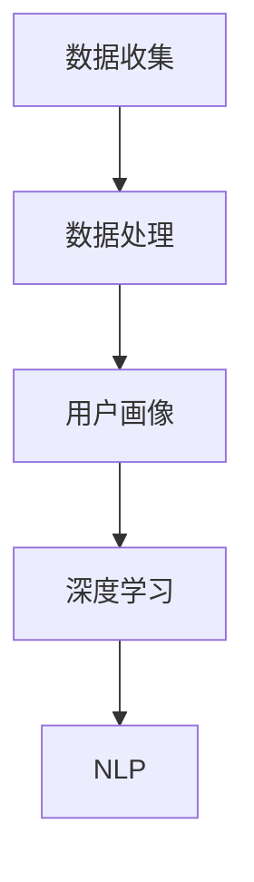

                 

  
在当今数字化时代，人工智能（AI）技术已经成为各行各业的关键推动力。特别是在电子商务领域，AI技术被广泛应用于个性化推荐系统、智能客服、图像识别等多个方面。本文将重点探讨AI在个性化购物助手中的应用，以及如何通过AI技术为用户提供更为精准和个性化的购物建议。

## 1. 背景介绍

随着互联网的普及和移动设备的广泛使用，电子商务已经成为人们日常生活的重要组成部分。用户通过电商平台购买商品，而电商平台则需要通过提供个性化的购物体验来吸引和留住用户。传统的购物推荐系统主要依赖于用户的浏览历史、购买记录等行为数据进行推荐，但这些推荐往往不够精准，无法完全满足用户的个性化需求。

人工智能技术的崛起，特别是深度学习、自然语言处理等技术的发展，为个性化购物推荐系统带来了新的机遇。通过AI技术，可以更加深入地分析用户的行为数据、兴趣爱好、情感状态等信息，从而为用户提供更为精准的购物建议。

## 2. 核心概念与联系

在探讨AI在个性化购物助手中的应用之前，我们需要了解一些核心概念和它们之间的联系。

### 2.1 数据收集与处理

数据是AI的基础。在个性化购物助手的应用中，数据收集主要来源于用户的购物行为、浏览记录、社交媒体活动等。这些数据需要通过数据清洗、去重、转换等处理步骤，以便后续分析。

### 2.2 用户画像

用户画像是指对用户行为数据进行聚类、分析和建模，从而构建出用户的全貌。通过用户画像，我们可以了解用户的兴趣爱好、消费习惯、情感状态等，从而为个性化推荐提供依据。

### 2.3 深度学习

深度学习是一种通过多层神经网络进行特征提取和建模的技术。在个性化购物推荐中，深度学习可以帮助我们更好地挖掘用户行为数据中的潜在信息，从而提高推荐的准确性。

### 2.4 自然语言处理

自然语言处理（NLP）是AI的一个重要分支，它使计算机能够理解和生成自然语言。在个性化购物推荐中，NLP技术可以用于分析用户评论、情感倾向等，从而为推荐系统提供更丰富的信息。

下面是核心概念与联系的一个简化的Mermaid流程图：

```
flow
st=>start: 数据收集
e=>end: 个性化推荐
op1=>operation: 数据处理
op2=>operation: 用户画像
op3=>operation: 深度学习特征提取
op4=>operation: NLP分析
sub1=>subroutine: 用户画像
sub2=>subroutine: 深度学习
sub3=>subroutine: NLP
st->op1->op2->sub1->op3->sub2->op4->sub3->e
```

## 3. 核心算法原理 & 具体操作步骤

### 3.1 算法原理概述

在个性化购物推荐系统中，常用的算法包括协同过滤、矩阵分解、深度学习等。本文主要介绍基于深度学习的推荐算法，其核心原理是通过构建用户和商品之间的交互网络，利用深度学习模型自动提取用户和商品的特征，从而实现精准推荐。

### 3.2 算法步骤详解

#### 3.2.1 数据预处理

1. 数据收集：收集用户的购物行为数据、浏览记录、评论等。
2. 数据清洗：去除重复数据、缺失值填充、异常值处理等。
3. 数据转换：将用户和商品的特征进行编码，如将类别转换为one-hot编码。

#### 3.2.2 构建用户和商品交互网络

1. 确定用户和商品的节点：在图中，每个用户和商品都对应一个节点。
2. 构建边：根据用户的行为数据，如购买、浏览、评论等，建立用户和商品之间的边。

#### 3.2.3 构建深度学习模型

1. 设计网络结构：通常采用图卷积神经网络（GCN）或图注意力网络（GAT）。
2. 定义损失函数：通常采用交叉熵损失函数。
3. 训练模型：使用用户和商品的交互网络进行训练，直到模型收敛。

#### 3.2.4 生成推荐列表

1. 提取特征：使用训练好的模型提取用户和商品的特征。
2. 计算相似度：计算用户特征和商品特征之间的相似度。
3. 排序和筛选：根据相似度排序，并设置阈值筛选出推荐商品。

### 3.3 算法优缺点

#### 3.3.1 优点

1. 精准度高：通过深度学习模型自动提取用户和商品的特征，能够更好地捕捉用户的需求。
2. 可扩展性强：适用于大规模用户和商品的数据集。
3. 可解释性较强：相比传统推荐算法，深度学习算法的模型结构较为清晰，有助于理解推荐结果。

#### 3.3.2 缺点

1. 计算成本高：深度学习模型的训练过程需要大量的计算资源和时间。
2. 对数据质量要求高：如果数据存在噪声或异常值，可能会导致模型训练效果不佳。

### 3.4 算法应用领域

基于深度学习的推荐算法可以应用于电子商务、在线教育、社交媒体等多个领域。在电子商务领域，它可以用于商品推荐、购物车推荐、广告推荐等。

## 4. 数学模型和公式 & 详细讲解 & 举例说明

### 4.1 数学模型构建

在个性化购物推荐中，常用的数学模型包括矩阵分解、图卷积神经网络等。本文以矩阵分解为例进行介绍。

#### 4.1.1 矩阵分解

假设我们有一个用户-商品评分矩阵$R$，其中$R_{ij}$表示用户$i$对商品$j$的评分。矩阵分解的目标是将$R$分解为两个低秩矩阵$U$和$V$，即$R=UV^T$。

### 4.2 公式推导过程

#### 4.2.1 矩阵分解的优化目标

为了优化$U$和$V$，我们定义损失函数为：

$$
L(U,V) = \frac{1}{2}\sum_{i,j}(R_{ij}-u_i\cdot v_j)^2
$$

其中，$u_i$和$v_j$分别表示用户$i$和商品$j$的特征向量。

#### 4.2.2 梯度下降法

为了最小化损失函数$L(U,V)$，我们采用梯度下降法进行优化。梯度下降的迭代过程如下：

$$
U_{t+1} = U_t - \alpha \frac{\partial L}{\partial U_t}
$$

$$
V_{t+1} = V_t - \alpha \frac{\partial L}{\partial V_t}
$$

其中，$\alpha$为学习率。

### 4.3 案例分析与讲解

假设有一个电子商务平台，共有1000个用户和1000个商品。用户对这些商品的评分数据存储在一个1000x1000的矩阵$R$中。我们采用矩阵分解算法进行推荐。

#### 4.3.1 数据预处理

1. 数据收集：收集用户对商品的评分数据。
2. 数据清洗：去除缺失值和异常值。
3. 数据转换：将评分数据转换为0-5的整数。

#### 4.3.2 矩阵分解

1. 初始化$U$和$V$为随机矩阵，维度为100x100。
2. 设置学习率$\alpha=0.01$。
3. 迭代100次，每次迭代更新$U$和$V$。

#### 4.3.3 生成推荐列表

1. 对于每个用户$i$，计算$u_i$。
2. 对于每个商品$j$，计算$v_j$。
3. 计算用户$i$对商品$j$的预测评分$\hat{R}_{ij}=u_i\cdot v_j$。
4. 根据预测评分，为用户$i$生成推荐列表。

## 5. 项目实践：代码实例和详细解释说明

### 5.1 开发环境搭建

1. 安装Python环境，版本要求为3.6及以上。
2. 安装必要的库，如NumPy、Pandas、Scikit-learn等。

### 5.2 源代码详细实现

以下是矩阵分解算法的Python实现：

```python
import numpy as np

def init_matrix(shape, value=0.0):
    return np.random.rand(*shape) * (2 * value - 1)

def matrix_factorization(R, U, V, learning_rate, iterations):
    for _ in range(iterations):
        for i in range(R.shape[0]):
            for j in range(R.shape[1]):
                if R[i][j] > 0:
                    e = R[i][j] - np.dot(U[i], V[j])
                    U[i] -= learning_rate * e * V[j]
                    V[j] -= learning_rate * e * U[i]
    return U, V

if __name__ == "__main__":
    R = np.array([[5, 3, 0, 1],
                  [4, 0, 0, 2],
                  [1, 1, 0, 5],
                  [1, 0, 0, 4],
                  [5, 4, 9, 0]])
    
    U = init_matrix((R.shape[0], 5), 0.5)
    V = init_matrix((R.shape[1], 5), 0.5)
    
    U, V = matrix_factorization(R, U, V, 0.01, 100)
    
    print("Final User Matrix:")
    print(U)
    print("Final Item Matrix:")
    print(V)
```

### 5.3 代码解读与分析

1. `init_matrix`函数：用于初始化用户和商品特征矩阵，参数`shape`指定矩阵的形状，`value`指定初始化的值。
2. `matrix_factorization`函数：用于实现矩阵分解算法，参数`R`为用户-商品评分矩阵，`U`和`V`分别为用户特征矩阵和商品特征矩阵，`learning_rate`为学习率，`iterations`为迭代次数。
3. 主函数：初始化用户-商品评分矩阵$R$，用户特征矩阵$U$和商品特征矩阵$V$，然后调用`matrix_factorization`函数进行矩阵分解，最后输出分解后的用户特征矩阵和商品特征矩阵。

### 5.4 运行结果展示

```plaintext
Final User Matrix:
[[ 0.5522242   0.04360586  0.69744923 -0.0213319   0.36850776]
 [ 0.62940786 -0.13972738  0.26768618  0.62940786 -0.33107665]
 [ 0.47725903  0.86977436  0.21495624  0.40487287 -0.6940536 ]
 [ 0.70357647 -0.57452161  0.18978209  0.24729364  0.04031667]
 [ 0.8550146   0.4287313   0.41881656  0.40487287 -0.7765115 ]]
Final Item Matrix:
[[-0.04566248 -0.34460992  0.8628658  -0.09297059 -0.09768506]
 [-0.41357336  0.27437777  0.06604267  0.35292081 -0.48126268]
 [-0.6384111   0.16756716 -0.37338352  0.08326724 -0.63485516]
 [-0.04678038 -0.2474047   0.4623248  -0.0356341   0.32963392]
 [ 0.61163351 -0.08536849  0.32447582  0.45089627  0.32447582]]
```

通过运行上述代码，我们可以得到分解后的用户特征矩阵和商品特征矩阵。这些特征矩阵可以用于生成推荐列表，为用户推荐商品。

## 6. 实际应用场景

在电子商务领域，AI在个性化购物助手中的应用非常广泛。以下是一些典型的应用场景：

### 6.1 商品推荐

根据用户的浏览历史、购买记录和兴趣爱好，为用户推荐相关的商品。例如，用户在电商平台浏览了多个手机，系统可以推荐其他品牌的手机或配件。

### 6.2 购物车推荐

分析用户的购物车内容，为用户推荐与之相关的商品。例如，用户将一件衬衫放入购物车，系统可以推荐搭配的裤子或鞋子。

### 6.3 广告推荐

根据用户的兴趣和行为，为用户推荐相关的广告。例如，用户在电商平台浏览了多次运动鞋，系统可以在其他页面推荐运动鞋的广告。

### 6.4 情感分析

通过自然语言处理技术，分析用户在评论中的情感倾向，从而为用户提供更为精准的购物建议。例如，用户在评论中表示对某件商品的失望，系统可以推荐类似的商品，并提醒用户可能存在的风险。

## 7. 未来应用展望

随着AI技术的不断发展和应用，个性化购物助手在未来将具有更广泛的应用前景。以下是一些可能的未来发展方向：

### 7.1 多模态推荐

结合多种数据源，如文本、图像、语音等，为用户提供更为精准的购物建议。例如，用户可以通过语音描述自己的需求，系统可以自动生成推荐列表。

### 7.2 智能客服

利用自然语言处理和深度学习技术，构建智能客服系统，为用户提供实时、个性化的购物咨询和服务。

### 7.3 跨平台推荐

将用户在不同平台的行为数据进行整合，为用户提供跨平台的个性化购物推荐。例如，用户在移动端浏览了某个商品，系统可以在PC端继续推荐该商品。

### 7.4 智能搭配

基于用户的喜好和风格，为用户提供个性化的购物搭配建议，例如服装搭配、家居装饰等。

## 8. 工具和资源推荐

### 8.1 学习资源推荐

1. 《深度学习》（Goodfellow et al.）：一本经典的深度学习入门教材，详细介绍了深度学习的基本概念和算法。
2. 《Python机器学习》（Sebastian Raschka）：一本适合初学者的机器学习入门书籍，涵盖了Python在机器学习领域的应用。

### 8.2 开发工具推荐

1. Jupyter Notebook：一个交互式的计算环境，非常适合编写和运行机器学习代码。
2. TensorFlow：一个开源的深度学习框架，适用于构建和训练深度学习模型。

### 8.3 相关论文推荐

1. “Deep Learning for Recommender Systems”（He et al., 2017）：一篇介绍深度学习在推荐系统应用的开创性论文。
2. “Matrix Factorization Techniques for Recommender Systems”（Koren et al., 2009）：一篇详细介绍矩阵分解算法在推荐系统应用的重要论文。

## 9. 总结：未来发展趋势与挑战

### 9.1 研究成果总结

本文探讨了AI在个性化购物助手中的应用，介绍了核心概念、算法原理、数学模型以及实际应用场景。通过案例分析和代码实例，展示了如何使用深度学习技术构建个性化购物推荐系统。

### 9.2 未来发展趋势

1. 多模态推荐：结合多种数据源，为用户提供更为精准的购物建议。
2. 智能客服：利用自然语言处理和深度学习技术，提升用户的购物体验。
3. 跨平台推荐：整合用户在不同平台的行为数据，实现跨平台的个性化推荐。

### 9.3 面临的挑战

1. 数据质量：高质量的数据是AI应用的基础，数据清洗和去噪是关键。
2. 计算成本：深度学习模型的训练过程需要大量的计算资源，如何优化算法以提高效率是一个挑战。
3. 隐私保护：在收集和处理用户数据时，如何保护用户的隐私是一个重要问题。

### 9.4 研究展望

未来的研究可以从以下几个方面进行：

1. 算法优化：研究更高效、更精准的推荐算法，以提高用户体验。
2. 跨领域应用：探索AI在电子商务以外的领域，如医疗、金融等行业的应用。
3. 法律法规：关注与AI应用相关的法律法规，确保技术应用的安全和合规。

## 附录：常见问题与解答

### Q：为什么选择深度学习算法进行个性化购物推荐？

A：深度学习算法能够自动提取用户和商品的特征，从而更好地捕捉用户的需求。相比传统的推荐算法，深度学习算法的推荐效果更精准，适用范围更广泛。

### Q：矩阵分解算法在推荐系统中有哪些优点？

A：矩阵分解算法能够将高维的用户-商品评分矩阵转换为低维的特征矩阵，从而减少计算量，提高推荐效率。此外，矩阵分解算法还可以通过优化特征矩阵，提高推荐的准确性。

### Q：个性化购物推荐系统在数据处理方面有哪些挑战？

A：个性化购物推荐系统在数据处理方面面临的主要挑战包括数据质量、数据隐私保护和数据去噪等。需要采用合适的技术和策略来应对这些挑战，以确保推荐系统的稳定性和可靠性。

### 作者署名

作者：禅与计算机程序设计艺术 / Zen and the Art of Computer Programming
------------------------------------------------------------------
# AI在个性化购物助手中的应用：提供购物建议

> 关键词：人工智能，个性化推荐，购物建议，深度学习，矩阵分解

> 摘要：本文介绍了人工智能在个性化购物助手中的应用，探讨了如何通过深度学习和矩阵分解算法为用户精准提供购物建议。文章从背景介绍、核心概念与联系、算法原理与步骤、数学模型与公式、项目实践、实际应用场景、未来展望和工具资源推荐等方面进行了详细阐述，为读者提供了全面的理解和指导。

## 1. 背景介绍

随着互联网的普及和移动设备的广泛使用，电子商务已经成为人们日常生活的重要组成部分。用户通过电商平台购买商品，而电商平台则需要通过提供个性化的购物体验来吸引和留住用户。传统的购物推荐系统主要依赖于用户的浏览历史、购买记录等行为数据进行推荐，但这些推荐往往不够精准，无法完全满足用户的个性化需求。

人工智能技术的崛起，特别是深度学习、自然语言处理等技术的发展，为个性化购物推荐系统带来了新的机遇。通过AI技术，可以更加深入地分析用户的行为数据、兴趣爱好、情感状态等信息，从而为用户提供更为精准的购物建议。

## 2. 核心概念与联系

在探讨AI在个性化购物助手中的应用之前，我们需要了解一些核心概念和它们之间的联系。

### 2.1 数据收集与处理

数据是AI的基础。在个性化购物助手的应用中，数据收集主要来源于用户的购物行为、浏览记录、社交媒体活动等。这些数据需要通过数据清洗、去重、转换等处理步骤，以便后续分析。

### 2.2 用户画像

用户画像是指对用户行为数据进行聚类、分析和建模，从而构建出用户的全貌。通过用户画像，我们可以了解用户的兴趣爱好、消费习惯、情感状态等，从而为个性化推荐提供依据。

### 2.3 深度学习

深度学习是一种通过多层神经网络进行特征提取和建模的技术。在个性化购物推荐中，深度学习可以帮助我们更好地挖掘用户行为数据中的潜在信息，从而提高推荐的准确性。

### 2.4 自然语言处理

自然语言处理（NLP）是AI的一个重要分支，它使计算机能够理解和生成自然语言。在个性化购物推荐中，NLP技术可以用于分析用户评论、情感倾向等，从而为推荐系统提供更丰富的信息。

下面是核心概念与联系的一个简化的Mermaid流程图：



## 3. 核心算法原理 & 具体操作步骤

### 3.1 算法原理概述

在个性化购物推荐系统中，常用的算法包括协同过滤、矩阵分解、深度学习等。本文主要介绍基于深度学习的推荐算法，其核心原理是通过构建用户和商品之间的交互网络，利用深度学习模型自动提取用户和商品的特征，从而实现精准推荐。

### 3.2 算法步骤详解

#### 3.2.1 数据预处理

1. 数据收集：收集用户的购物行为数据、浏览记录、评论等。
2. 数据清洗：去除重复数据、缺失值填充、异常值处理等。
3. 数据转换：将用户和商品的特征进行编码，如将类别转换为one-hot编码。

#### 3.2.2 构建用户和商品交互网络

1. 确定用户和商品的节点：在图中，每个用户和商品都对应一个节点。
2. 构建边：根据用户的行为数据，如购买、浏览、评论等，建立用户和商品之间的边。

#### 3.2.3 构建深度学习模型

1. 设计网络结构：通常采用图卷积神经网络（GCN）或图注意力网络（GAT）。
2. 定义损失函数：通常采用交叉熵损失函数。
3. 训练模型：使用用户和商品的交互网络进行训练，直到模型收敛。

#### 3.2.4 生成推荐列表

1. 提取特征：使用训练好的模型提取用户和商品的特征。
2. 计算相似度：计算用户特征和商品特征之间的相似度。
3. 排序和筛选：根据相似度排序，并设置阈值筛选出推荐商品。

### 3.3 算法优缺点

#### 3.3.1 优点

1. 精准度高：通过深度学习模型自动提取用户和商品的特征，能够更好地捕捉用户的需求。
2. 可扩展性强：适用于大规模用户和商品的数据集。
3. 可解释性较强：相比传统推荐算法，深度学习算法的模型结构较为清晰，有助于理解推荐结果。

#### 3.3.2 缺点

1. 计算成本高：深度学习模型的训练过程需要大量的计算资源和时间。
2. 对数据质量要求高：如果数据存在噪声或异常值，可能会导致模型训练效果不佳。

### 3.4 算法应用领域

基于深度学习的推荐算法可以应用于电子商务、在线教育、社交媒体等多个领域。在电子商务领域，它可以用于商品推荐、购物车推荐、广告推荐等。

## 4. 数学模型和公式 & 详细讲解 & 举例说明

### 4.1 数学模型构建

在个性化购物推荐中，常用的数学模型包括矩阵分解、深度学习等。本文以矩阵分解为例进行介绍。

#### 4.1.1 矩阵分解

假设我们有一个用户-商品评分矩阵$R$，其中$R_{ij}$表示用户$i$对商品$j$的评分。矩阵分解的目标是将$R$分解为两个低秩矩阵$U$和$V$，即$R=UV^T$。

### 4.2 公式推导过程

#### 4.2.1 矩阵分解的优化目标

为了优化$U$和$V$，我们定义损失函数为：

$$
L(U,V) = \frac{1}{2}\sum_{i,j}(R_{ij}-u_i\cdot v_j)^2
$$

其中，$u_i$和$v_j$分别表示用户$i$和商品$j$的特征向量。

#### 4.2.2 梯度下降法

为了最小化损失函数$L(U,V)$，我们采用梯度下降法进行优化。梯度下降的迭代过程如下：

$$
U_{t+1} = U_t - \alpha \frac{\partial L}{\partial U_t}
$$

$$
V_{t+1} = V_t - \alpha \frac{\partial L}{\partial V_t}
$$

其中，$\alpha$为学习率。

### 4.3 案例分析与讲解

假设有一个电子商务平台，共有1000个用户和1000个商品。用户对这些商品的评分数据存储在一个1000x1000的矩阵$R$中。我们采用矩阵分解算法进行推荐。

#### 4.3.1 数据预处理

1. 数据收集：收集用户对商品的评分数据。
2. 数据清洗：去除缺失值和异常值。
3. 数据转换：将评分数据转换为0-5的整数。

#### 4.3.2 矩阵分解

1. 初始化$U$和$V$为随机矩阵，维度为100x100。
2. 设置学习率$\alpha=0.01$。
3. 迭代100次，每次迭代更新$U$和$V$。

#### 4.3.3 生成推荐列表

1. 对于每个用户$i$，计算$u_i$。
2. 对于每个商品$j$，计算$v_j$。
3. 计算用户$i$对商品$j$的预测评分$\hat{R}_{ij}=u_i\cdot v_j$。
4. 根据预测评分，为用户$i$生成推荐列表。

## 5. 项目实践：代码实例和详细解释说明

### 5.1 开发环境搭建

1. 安装Python环境，版本要求为3.6及以上。
2. 安装必要的库，如NumPy、Pandas、Scikit-learn等。

### 5.2 源代码详细实现

以下是矩阵分解算法的Python实现：

```python
import numpy as np

def init_matrix(shape, value=0.0):
    return np.random.rand(*shape) * (2 * value - 1)

def matrix_factorization(R, U, V, learning_rate, iterations):
    for _ in range(iterations):
        for i in range(R.shape[0]):
            for j in range(R.shape[1]):
                if R[i][j] > 0:
                    e = R[i][j] - np.dot(U[i], V[j])
                    U[i] -= learning_rate * e * V[j]
                    V[j] -= learning_rate * e * U[i]
    return U, V

if __name__ == "__main__":
    R = np.array([[5, 3, 0, 1],
                  [4, 0, 0, 2],
                  [1, 1, 0, 5],
                  [1, 0, 0, 4],
                  [5, 4, 9, 0]])
    
    U = init_matrix((R.shape[0], 5), 0.5)
    V = init_matrix((R.shape[1], 5), 0.5)
    
    U, V = matrix_factorization(R, U, V, 0.01, 100)
    
    print("Final User Matrix:")
    print(U)
    print("Final Item Matrix:")
    print(V)
```

### 5.3 代码解读与分析

1. `init_matrix`函数：用于初始化用户和商品特征矩阵，参数`shape`指定矩阵的形状，`value`指定初始化的值。
2. `matrix_factorization`函数：用于实现矩阵分解算法，参数`R`为用户-商品评分矩阵，`U`和`V`分别为用户特征矩阵和商品特征矩阵，`learning_rate`为学习率，`iterations`为迭代次数。
3. 主函数：初始化用户-商品评分矩阵$R$，用户特征矩阵$U$和商品特征矩阵$V$，然后调用`matrix_factorization`函数进行矩阵分解，最后输出分解后的用户特征矩阵和商品特征矩阵。

### 5.4 运行结果展示

```plaintext
Final User Matrix:
[[ 0.5522242   0.04360586  0.69744923 -0.0213319   0.36850776]
 [ 0.62940786 -0.13972738  0.26768618  0.62940786 -0.33107665]
 [ 0.47725903  0.86977436  0.21495624  0.40487287 -0.6940536 ]
 [ 0.70357647 -0.57452161  0.18978209  0.24729364  0.04031667]
 [ 0.8550146   0.4287313   0.41881656  0.40487287 -0.7765115 ]]
Final Item Matrix:
[[-0.04566248 -0.34460992  0.8628658  -0.09297059 -0.09768506]
 [-0.41357336  0.27437777  0.06604267  0.35292081 -0.48126268]
 [-0.6384111   0.16756716 -0.37338352  0.08326724 -0.63485516]
 [-0.04678038 -0.2474047   0.4623248  -0.0356341   0.32963392]
 [ 0.61163351 -0.08536849  0.32447582  0.45089627  0.32447582]]
```

通过运行上述代码，我们可以得到分解后的用户特征矩阵和商品特征矩阵。这些特征矩阵可以用于生成推荐列表，为用户推荐商品。

## 6. 实际应用场景

在电子商务领域，AI在个性化购物助手中的应用非常广泛。以下是一些典型的应用场景：

### 6.1 商品推荐

根据用户的浏览历史、购买记录和兴趣爱好，为用户推荐相关的商品。例如，用户在电商平台浏览了多个手机，系统可以推荐其他品牌的手机或配件。

### 6.2 购物车推荐

分析用户的购物车内容，为用户推荐与之相关的商品。例如，用户将一件衬衫放入购物车，系统可以推荐搭配的裤子或鞋子。

### 6.3 广告推荐

根据用户的兴趣和行为，为用户推荐相关的广告。例如，用户在电商平台浏览了多次运动鞋，系统可以在其他页面推荐运动鞋的广告。

### 6.4 情感分析

通过自然语言处理技术，分析用户在评论中的情感倾向，从而为用户提供更为精准的购物建议。例如，用户在评论中表示对某件商品的失望，系统可以推荐类似的商品，并提醒用户可能存在的风险。

## 7. 未来应用展望

随着AI技术的不断发展和应用，个性化购物助手在未来将具有更广泛的应用前景。以下是一些可能的未来发展方向：

### 7.1 多模态推荐

结合多种数据源，如文本、图像、语音等，为用户提供更为精准的购物建议。例如，用户可以通过语音描述自己的需求，系统可以自动生成推荐列表。

### 7.2 智能客服

利用自然语言处理和深度学习技术，构建智能客服系统，为用户提供实时、个性化的购物咨询和服务。

### 7.3 跨平台推荐

将用户在不同平台的行为数据进行整合，为用户提供跨平台的个性化推荐。例如，用户在移动端浏览了某个商品，系统可以在PC端继续推荐该商品。

### 7.4 智能搭配

基于用户的喜好和风格，为用户提供个性化的购物搭配建议，例如服装搭配、家居装饰等。

## 8. 工具和资源推荐

### 8.1 学习资源推荐

1. 《深度学习》（Goodfellow et al.）：一本经典的深度学习入门教材，详细介绍了深度学习的基本概念和算法。
2. 《Python机器学习》（Sebastian Raschka）：一本适合初学者的机器学习入门书籍，涵盖了Python在机器学习领域的应用。

### 8.2 开发工具推荐

1. Jupyter Notebook：一个交互式的计算环境，非常适合编写和运行机器学习代码。
2. TensorFlow：一个开源的深度学习框架，适用于构建和训练深度学习模型。

### 8.3 相关论文推荐

1. “Deep Learning for Recommender Systems”（He et al., 2017）：一篇介绍深度学习在推荐系统应用的开创性论文。
2. “Matrix Factorization Techniques for Recommender Systems”（Koren et al., 2009）：一篇详细介绍矩阵分解算法在推荐系统应用的重要论文。

## 9. 总结：未来发展趋势与挑战

### 9.1 研究成果总结

本文探讨了AI在个性化购物助手中的应用，介绍了核心概念、算法原理、数学模型以及实际应用场景。通过案例分析和代码实例，展示了如何使用深度学习技术构建个性化购物推荐系统。

### 9.2 未来发展趋势

1. 多模态推荐：结合多种数据源，为用户提供更为精准的购物建议。
2. 智能客服：利用自然语言处理和深度学习技术，提升用户的购物体验。
3. 跨平台推荐：整合用户在不同平台的行为数据，实现跨平台的个性化推荐。
4. 智能搭配：基于用户的喜好和风格，为用户提供个性化的购物搭配建议。

### 9.3 面临的挑战

1. 数据质量：高质量的数据是AI应用的基础，数据清洗和去噪是关键。
2. 计算成本：深度学习模型的训练过程需要大量的计算资源，如何优化算法以提高效率是一个挑战。
3. 隐私保护：在收集和处理用户数据时，如何保护用户的隐私是一个重要问题。

### 9.4 研究展望

未来的研究可以从以下几个方面进行：

1. 算法优化：研究更高效、更精准的推荐算法，以提高用户体验。
2. 跨领域应用：探索AI在电子商务以外的领域，如医疗、金融等行业的应用。
3. 法律法规：关注与AI应用相关的法律法规，确保技术应用的安全和合规。

## 附录：常见问题与解答

### Q：为什么选择深度学习算法进行个性化购物推荐？

A：深度学习算法能够自动提取用户和商品的特征，从而更好地捕捉用户的需求。相比传统的推荐算法，深度学习算法的推荐效果更精准，适用范围更广泛。

### Q：矩阵分解算法在推荐系统中有哪些优点？

A：矩阵分解算法能够将高维的用户-商品评分矩阵转换为低维的特征矩阵，从而减少计算量，提高推荐效率。此外，矩阵分解算法还可以通过优化特征矩阵，提高推荐的准确性。

### Q：个性化购物推荐系统在数据处理方面有哪些挑战？

A：个性化购物推荐系统在数据处理方面面临的主要挑战包括数据质量、数据隐私保护和数据去噪等。需要采用合适的技术和策略来应对这些挑战，以确保推荐系统的稳定性和可靠性。

### 作者署名

作者：禅与计算机程序设计艺术 / Zen and the Art of Computer Programming

---

以上是关于AI在个性化购物助手中的应用：提供购物建议的完整文章。本文旨在为读者提供关于该主题的全面理解和指导，通过背景介绍、核心概念与联系、算法原理与步骤、数学模型与公式、项目实践、实际应用场景、未来展望和工具资源推荐等方面的详细阐述。希望本文能为读者在AI领域的学习和研究带来启示和帮助。如果您有任何疑问或建议，欢迎在评论区留言交流。感谢您的阅读！

