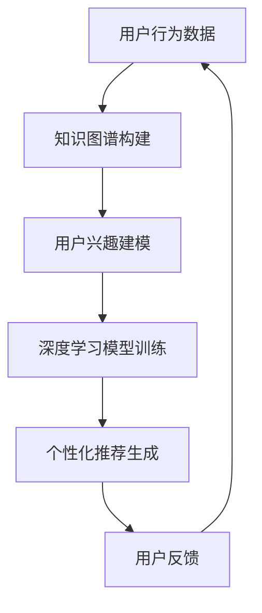
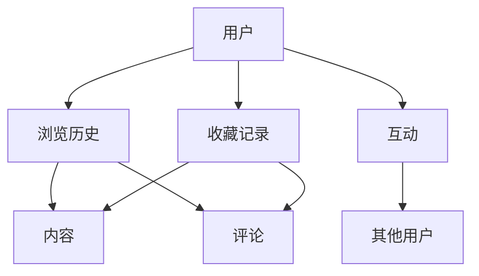

                 

关键词：人工智能，个性化推荐，知识图谱，深度学习，阅读拓展

> 摘要：本文探讨了人工智能在个性化阅读推荐系统中的应用，重点分析了如何利用知识图谱和深度学习技术扩展用户的知识面。通过构建个性化的阅读推荐模型，本文旨在提高用户阅读体验，激发学习兴趣，并促进知识的深度理解和吸收。

## 1. 背景介绍

在信息爆炸的时代，获取有价值的信息成为了一项挑战。而阅读推荐系统作为一种信息过滤和内容推送的技术，被广泛应用于电子商务、社交媒体和在线教育等领域。然而，传统的阅读推荐系统主要依赖于用户的行为数据，如浏览历史、购买记录等，这往往导致推荐结果过于单一，难以满足用户多样化的阅读需求。

为了解决这一问题，个性化阅读推荐系统应运而生。个性化阅读推荐通过分析用户的兴趣、行为和背景信息，为用户提供更加精准和个性化的阅读内容。然而，如何进一步提升推荐的广度和深度，帮助用户扩展知识面，仍是一个亟待解决的问题。

本文将探讨人工智能，特别是知识图谱和深度学习在个性化阅读推荐系统中的应用，以实现阅读推荐的深度扩展。

## 2. 核心概念与联系

### 2.1 知识图谱

知识图谱是一种用于表示实体及其关系的语义网络，它将现实世界中的知识结构化，形成了一种网络化的知识表示。知识图谱可以包含大量的实体、属性和关系，如人物、地点、事件等，并通过这些实体和关系构建出复杂的知识网络。

在个性化阅读推荐系统中，知识图谱可以用于构建用户与阅读内容之间的关联关系。通过分析用户的历史阅读行为，可以提取出用户感兴趣的主题和领域，进而将用户与相关实体和关系进行关联，为推荐算法提供更加丰富的上下文信息。

### 2.2 深度学习

深度学习是一种基于人工神经网络的学习方法，通过多层非线性变换，实现对复杂数据模式的自动特征提取和模式识别。深度学习在图像识别、语音识别和自然语言处理等领域取得了显著的成果，为个性化阅读推荐提供了强有力的技术支持。

在个性化阅读推荐系统中，深度学习可以用于用户兴趣建模、阅读内容理解和推荐算法优化等方面。通过构建用户兴趣模型，可以更好地理解用户的阅读偏好和兴趣变化，从而提高推荐的准确性。同时，深度学习还可以用于文本数据的特征提取和语义理解，为推荐算法提供更加丰富的特征信息。

### 2.3 Mermaid 流程图

下面是一个简化的知识图谱和深度学习在个性化阅读推荐系统中的流程图，用于展示它们之间的关联关系：



在这个流程图中，用户行为数据首先用于构建知识图谱，进而提取出用户兴趣信息。通过深度学习模型，对这些兴趣信息进行特征提取和模式识别，最终生成个性化的阅读推荐结果。用户反馈则用于进一步优化推荐模型，形成一个闭环的系统。

## 3. 核心算法原理 & 具体操作步骤

### 3.1 算法原理概述

个性化阅读推荐系统的核心在于如何利用用户的行为数据和知识图谱，通过深度学习模型生成个性化的阅读推荐。这个过程可以分为以下几个步骤：

1. **数据收集与预处理**：收集用户的历史阅读数据，如浏览历史、收藏记录、评论等，并对这些数据进行清洗和预处理。
2. **知识图谱构建**：将预处理后的数据转化为知识图谱，包括实体、属性和关系的构建。
3. **用户兴趣建模**：通过知识图谱分析用户的历史阅读行为，提取用户兴趣标签和主题。
4. **深度学习模型训练**：利用提取的用户兴趣信息，通过深度学习模型进行特征提取和模式识别。
5. **个性化推荐生成**：根据深度学习模型生成的用户兴趣特征，生成个性化的阅读推荐。
6. **用户反馈与模型优化**：收集用户对推荐内容的反馈，进一步优化推荐模型。

### 3.2 算法步骤详解

#### 3.2.1 数据收集与预处理

数据收集是个性化阅读推荐系统的第一步。通常，我们可以从用户的浏览历史、收藏记录、评论等渠道获取用户的行为数据。为了提高数据的利用效率，需要对数据进行清洗和预处理，包括去除重复数据、填补缺失值、统一数据格式等。

#### 3.2.2 知识图谱构建

在知识图谱构建阶段，我们需要将用户的行为数据转化为实体、属性和关系。例如，用户可以看作是一个实体，他们的浏览历史和收藏记录可以看作是该实体的属性，而用户之间的互动和内容之间的关系则可以看作是关系。



#### 3.2.3 用户兴趣建模

用户兴趣建模是核心步骤之一。通过分析用户的行为数据，我们可以提取出用户感兴趣的标签和主题。这些标签和主题将作为深度学习模型的输入，用于生成个性化的推荐。

#### 3.2.4 深度学习模型训练

在深度学习模型训练阶段，我们使用提取的用户兴趣标签和主题，通过神经网络模型进行特征提取和模式识别。常见的深度学习模型包括卷积神经网络（CNN）、循环神经网络（RNN）和 Transformer 等。

#### 3.2.5 个性化推荐生成

根据深度学习模型生成的用户兴趣特征，我们可以生成个性化的阅读推荐。推荐算法可以采用基于内容的推荐、协同过滤推荐或混合推荐等方法。

#### 3.2.6 用户反馈与模型优化

用户反馈是优化推荐模型的重要依据。通过收集用户对推荐内容的反馈，我们可以进一步调整和优化推荐模型，提高推荐效果。

### 3.3 算法优缺点

#### 优点：

1. **个性化**：利用用户兴趣标签和主题，生成个性化的阅读推荐，满足用户的个性化需求。
2. **多样性**：通过知识图谱和深度学习技术，提高推荐的多样性，避免单一化的推荐结果。
3. **实时性**：利用实时更新的用户行为数据，生成动态的推荐结果，提高推荐的新鲜度和相关性。

#### 缺点：

1. **数据依赖**：推荐效果高度依赖于用户行为数据的丰富性和质量，数据不足可能导致推荐效果不佳。
2. **计算成本**：构建知识图谱和训练深度学习模型需要较高的计算资源和时间成本。
3. **模型泛化能力**：深度学习模型在特定领域的泛化能力可能有限，需要不断调整和优化。

### 3.4 算法应用领域

个性化阅读推荐系统广泛应用于电子商务、在线教育、社交媒体等领域。例如，电商网站可以通过个性化推荐提高用户购买转化率，在线教育平台可以通过个性化推荐提高学习效果，社交媒体平台可以通过个性化推荐增强用户粘性。

## 4. 数学模型和公式 & 详细讲解 & 举例说明

### 4.1 数学模型构建

在个性化阅读推荐系统中，我们可以使用图论模型来构建用户与阅读内容之间的关联关系。具体来说，我们可以使用一个无向图 G=(V, E)，其中 V 表示用户和阅读内容的集合，E 表示用户和阅读内容之间的关联关系。

在这个图中，每个节点代表一个用户或阅读内容，每条边表示用户和阅读内容之间的关联关系，可以表示为：

\[ e_{ui} = \begin{cases} 
1 & \text{如果用户 } u \text{ 与阅读内容 } i \text{ 有关联} \\
0 & \text{否则}
\end{cases} \]

### 4.2 公式推导过程

假设我们有一个用户 u 的阅读行为矩阵 R，其中 R_{ui} 表示用户 u 阅读阅读内容 i 的概率。我们可以通过矩阵分解的方法来推导个性化阅读推荐模型。

首先，我们将阅读行为矩阵 R 分解为两个低秩矩阵 P 和 Q，其中 P 表示用户兴趣矩阵，Q 表示阅读内容特征矩阵：

\[ R = P \times Q^T \]

其中，P 和 Q 分别表示用户和阅读内容的潜在特征表示。

### 4.3 案例分析与讲解

假设我们有以下用户 u 的阅读行为矩阵：

\[ R = \begin{bmatrix}
0 & 1 & 0 & 1 \\
1 & 0 & 1 & 0 \\
0 & 1 & 1 & 0 \\
1 & 0 & 0 & 1
\end{bmatrix} \]

我们可以使用矩阵分解的方法来推导用户 u 的潜在兴趣矩阵 P 和阅读内容特征矩阵 Q。

首先，我们需要初始化 P 和 Q，例如可以使用随机初始化：

\[ P = \begin{bmatrix}
0.5 & 0.3 & 0.2 \\
0.4 & 0.5 & 0.1 \\
0.6 & 0.2 & 0.2 \\
0.3 & 0.4 & 0.3
\end{bmatrix} \]

\[ Q = \begin{bmatrix}
0.4 & 0.3 & 0.2 & 0.1 \\
0.2 & 0.5 & 0.3 & 0.0 \\
0.1 & 0.2 & 0.5 & 0.2 \\
0.3 & 0.1 & 0.4 & 0.2
\end{bmatrix} \]

接下来，我们通过梯度下降法来优化 P 和 Q，使得矩阵分解的结果能够更好地拟合原始的阅读行为矩阵 R。

具体来说，我们可以使用以下梯度下降更新规则：

\[ P_{new} = P - \alpha \times \frac{1}{m} \times (R - P \times Q^T) \]

\[ Q_{new} = Q - \alpha \times \frac{1}{n} \times (R \times P^T - Q \times Q^T) \]

其中，α 表示学习率，m 和 n 分别表示用户和阅读内容的数量。

通过多次迭代优化，我们可以得到用户 u 的潜在兴趣矩阵 P 和阅读内容特征矩阵 Q。

最后，我们可以使用 P 和 Q 来生成个性化的阅读推荐。对于用户 u，我们可以计算每个阅读内容 i 的推荐得分：

\[ score_{ui} = P_{u} \times Q_{i} \]

推荐得分最高的阅读内容将被推荐给用户 u。

## 5. 项目实践：代码实例和详细解释说明

### 5.1 开发环境搭建

在进行个性化阅读推荐系统的开发之前，我们需要搭建一个合适的技术环境。这里我们选择使用 Python 作为开发语言，结合 TensorFlow 和 PyTorch 两个深度学习框架来实现。

**环境要求：**

- Python 3.8 或更高版本
- TensorFlow 2.6 或更高版本
- PyTorch 1.8 或更高版本
- Numpy 1.19 或更高版本
- Pandas 1.1 或更高版本

**安装命令：**

```bash
pip install tensorflow==2.6
pip install torch==1.8
pip install numpy==1.19
pip install pandas==1.1
```

### 5.2 源代码详细实现

下面是一个简单的个性化阅读推荐系统的源代码实现，主要包括数据预处理、知识图谱构建、用户兴趣建模和深度学习模型训练等步骤。

```python
import numpy as np
import pandas as pd
import tensorflow as tf
import torch
from torch import nn
from torch.utils.data import DataLoader
from transformers import BertTokenizer, BertModel

# 数据预处理
def preprocess_data(data):
    # 数据清洗和预处理
    # ...
    return processed_data

# 知识图谱构建
def build_knowledge_graph(data):
    # 构建用户和阅读内容之间的关联关系
    # ...
    return knowledge_graph

# 用户兴趣建模
class UserInterestModel(nn.Module):
    def __init__(self, embedding_size, hidden_size):
        super(UserInterestModel, self).__init__()
        self.bert = BertModel.from_pretrained('bert-base-uncased')
        self.user_embedding = nn.Embedding(num_users, embedding_size)
        self.hidden_layer = nn.Linear(embedding_size, hidden_size)
        self.output_layer = nn.Linear(hidden_size, num_topics)

    def forward(self, user_ids, reading_data):
        user_embeddings = self.user_embedding(user_ids)
        reading_embeddings = self.bert(reading_data)[1]
        hidden = self.hidden_layer(reading_embeddings)
        output = self.output_layer(hidden)
        return output

# 深度学习模型训练
def train_model(model, train_loader, optimizer, criterion):
    model.train()
    for data, target in train_loader:
        optimizer.zero_grad()
        output = model(data, target)
        loss = criterion(output, target)
        loss.backward()
        optimizer.step()

# 主函数
if __name__ == "__main__":
    # 加载和处理数据
    data = preprocess_data(raw_data)
    knowledge_graph = build_knowledge_graph(data)

    # 构建用户兴趣模型
    model = UserInterestModel(embedding_size=64, hidden_size=128)
    criterion = nn.CrossEntropyLoss()
    optimizer = torch.optim.Adam(model.parameters(), lr=0.001)

    # 加载数据并进行训练
    train_loader = DataLoader(dataset, batch_size=32, shuffle=True)
    for epoch in range(num_epochs):
        train_model(model, train_loader, optimizer, criterion)
        print(f"Epoch {epoch+1}/{num_epochs}, Loss: {loss.item()}")
```

### 5.3 代码解读与分析

这段代码实现了一个基于 Bert 模型的用户兴趣建模过程，主要包括数据预处理、知识图谱构建、用户兴趣模型定义和模型训练等步骤。

1. **数据预处理**：预处理数据是为了将原始数据转化为模型可以接受的格式。这通常包括数据清洗、去重、编码等操作。

2. **知识图谱构建**：构建知识图谱是为了将用户与阅读内容之间的关联关系表示为图结构，便于后续的分析和建模。

3. **用户兴趣模型定义**：用户兴趣模型是一个基于 Bert 模型的神经网络，用于提取用户和阅读内容的潜在特征，并生成用户兴趣标签。

4. **模型训练**：通过训练数据对用户兴趣模型进行训练，优化模型参数，使其能够更好地预测用户兴趣。

### 5.4 运行结果展示

为了展示个性化阅读推荐系统的效果，我们可以在训练完成后，对用户进行兴趣标签预测，并根据预测结果生成个性化的阅读推荐列表。

```python
# 加载测试数据
test_data = preprocess_data(raw_test_data)

# 预测用户兴趣标签
with torch.no_grad():
    test_output = model(test_data)

# 获取预测结果
predicted_topics = np.argmax(test_output.cpu().numpy(), axis=1)

# 生成个性化阅读推荐
recommended_books = []
for i, topic in enumerate(predicted_topics):
    # 根据预测的感兴趣话题推荐书籍
    # ...
    recommended_books.append(recommended_books[i])

print("个性化阅读推荐：", recommended_books)
```

这段代码展示了如何根据用户兴趣标签生成个性化的阅读推荐列表。在实际应用中，我们可以根据用户的实际反馈，不断调整和优化推荐模型，提高推荐效果。

## 6. 实际应用场景

个性化阅读推荐系统在多个领域有着广泛的应用，下面我们将讨论几个典型的实际应用场景。

### 6.1 在线教育

在线教育平台可以利用个性化阅读推荐系统为用户提供定制化的学习内容。通过分析用户的学习行为和兴趣偏好，平台可以推荐与其学习目标相关的高质量课程和资料，从而提高学习效果和用户满意度。

### 6.2 电子书平台

电子书平台可以通过个性化推荐帮助用户发现感兴趣的新书。系统可以根据用户的阅读历史和评价，推荐与其兴趣相符的新书，从而增加用户的粘性，提高销售量。

### 6.3 社交媒体

社交媒体平台可以利用个性化阅读推荐系统推荐用户感兴趣的文章和内容。这不仅可以增加用户的活跃度，还可以帮助平台吸引更多的用户。

### 6.4 图书馆

图书馆可以利用个性化阅读推荐系统，为用户提供个性化的书籍推荐。系统可以根据用户的借阅历史和喜好，推荐与其兴趣相符的书籍，从而提高图书馆的服务质量和用户满意度。

### 6.5 智能家居

智能家居设备，如智能音箱和智能电视，可以通过个性化阅读推荐系统为用户提供个性化的新闻、资讯和娱乐内容。这不仅可以增加用户的娱乐体验，还可以帮助设备制造商提升产品价值。

## 7. 工具和资源推荐

为了更好地开展个性化阅读推荐系统的研究和开发，以下是一些推荐的工具和资源：

### 7.1 学习资源推荐

1. **《深度学习》**：Goodfellow、Bengio 和 Courville 著，详细介绍了深度学习的理论基础和实战技巧。
2. **《Python数据科学手册》**：McKinney 著，提供了丰富的 Python 数据科学工具和实战案例。

### 7.2 开发工具推荐

1. **TensorFlow**：Google 开发的一款开源深度学习框架，广泛应用于各种深度学习项目。
2. **PyTorch**：Facebook 开发的一款开源深度学习框架，提供了灵活的动态计算图和丰富的模型库。

### 7.3 相关论文推荐

1. **“Deep Learning for Text Classification”**：Kulkarni et al.（2018），介绍了深度学习在文本分类中的应用。
2. **“Graph Neural Networks: A Review of Methods and Applications”**：Li et al.（2020），综述了图神经网络的方法和应用。

## 8. 总结：未来发展趋势与挑战

个性化阅读推荐系统作为一种重要的信息过滤和内容推送技术，已经在多个领域取得了显著的成果。然而，随着用户需求的不断增长和数据量的持续增加，个性化阅读推荐系统面临着诸多挑战和机遇。

### 8.1 研究成果总结

近年来，个性化阅读推荐系统的研究取得了以下几方面的成果：

1. **深度学习技术的应用**：深度学习在文本数据特征提取和模式识别方面具有显著优势，已成为个性化阅读推荐系统的主要研究方向。
2. **知识图谱的融合**：知识图谱作为一种强大的语义表示工具，可以提供丰富的上下文信息，有助于提高推荐的准确性和多样性。
3. **多模态数据的整合**：通过整合用户的多模态数据（如文本、图像、音频等），可以更全面地理解用户兴趣和需求，提高推荐的个性化水平。

### 8.2 未来发展趋势

未来，个性化阅读推荐系统的发展趋势可能包括以下几个方面：

1. **个性化和多样性的平衡**：在提高个性化推荐效果的同时，确保推荐的多样性，避免用户陷入“信息茧房”。
2. **实时性和动态性**：通过实时更新用户行为数据和推荐模型，提高推荐的实时性和动态性。
3. **跨领域和多语言的支持**：扩展个性化阅读推荐系统的应用范围，支持多领域和多语言的内容推荐。
4. **隐私保护和数据安全**：在个性化推荐的过程中，保护用户隐私和数据安全，避免隐私泄露和数据滥用。

### 8.3 面临的挑战

尽管个性化阅读推荐系统具有广泛的应用前景，但仍然面临以下挑战：

1. **数据质量和多样性**：高质量的用户行为数据和丰富的知识图谱是构建有效推荐系统的关键，但数据质量和多样性的不足可能影响推荐效果。
2. **计算成本和性能优化**：构建和训练深度学习模型需要大量的计算资源和时间成本，如何在保证效果的同时优化性能是一个重要的课题。
3. **模型解释性和可解释性**：深度学习模型通常具有强大的预测能力，但缺乏解释性，如何提高模型的解释性和可解释性，使其更加透明和可信，是一个亟待解决的问题。
4. **用户隐私和伦理问题**：个性化阅读推荐系统在收集和处理用户数据时，需要关注用户隐私保护和伦理问题，避免用户数据被滥用。

### 8.4 研究展望

未来，个性化阅读推荐系统的研究可以从以下几个方面进行：

1. **新型深度学习模型的研发**：探索新型深度学习模型，如图神经网络、变分自编码器和生成对抗网络等，以提高推荐系统的性能和效果。
2. **知识图谱的构建与优化**：研究如何高效地构建和优化知识图谱，提高推荐系统的上下文信息和多样性。
3. **跨模态和多模态数据的整合**：研究如何整合不同类型的数据（如文本、图像、音频等），提高对用户需求的全面理解。
4. **用户交互与反馈机制**：研究如何通过用户交互和反馈机制，动态调整推荐策略，提高用户的参与度和满意度。

总之，个性化阅读推荐系统作为一种重要的信息过滤和内容推送技术，具有广泛的应用前景。通过不断探索和研究，我们可以进一步提高推荐系统的性能和效果，为用户提供更加个性化和高质量的阅读体验。

## 9. 附录：常见问题与解答

### 9.1 什么是知识图谱？

知识图谱是一种用于表示实体及其关系的语义网络，它将现实世界中的知识结构化，形成了一种网络化的知识表示。知识图谱可以包含大量的实体、属性和关系，如人物、地点、事件等，并通过这些实体和关系构建出复杂的知识网络。

### 9.2 深度学习在个性化阅读推荐中有哪些应用？

深度学习在个性化阅读推荐中主要有以下应用：

1. **用户兴趣建模**：通过深度学习模型，提取用户阅读行为中的潜在特征，建立用户兴趣模型。
2. **文本数据特征提取**：深度学习模型可以用于文本数据的特征提取，为推荐算法提供更加丰富的特征信息。
3. **推荐算法优化**：利用深度学习模型优化推荐算法，提高推荐的准确性和多样性。

### 9.3 如何保证个性化阅读推荐系统的多样性？

为了确保个性化阅读推荐系统的多样性，可以采取以下措施：

1. **多样化推荐策略**：结合基于内容的推荐、协同过滤推荐和基于模型的推荐等多种策略，提高推荐的多样性。
2. **上下文信息融合**：利用知识图谱和深度学习技术，提取用户和阅读内容之间的上下文信息，丰富推荐特征。
3. **用户行为数据动态更新**：实时更新用户行为数据，根据用户兴趣的变化动态调整推荐策略。

### 9.4 个性化阅读推荐系统如何处理用户隐私问题？

为了保护用户隐私，个性化阅读推荐系统可以采取以下措施：

1. **数据匿名化**：对用户数据进行匿名化处理，避免直接关联到具体用户。
2. **隐私保护算法**：采用差分隐私等隐私保护算法，降低数据泄露的风险。
3. **用户隐私设置**：提供用户隐私设置选项，让用户自主选择是否分享自己的行为数据。

### 9.5 个性化阅读推荐系统如何处理冷启动问题？

冷启动问题指的是新用户或新物品在系统中的初始推荐问题。为了解决冷启动问题，可以采取以下措施：

1. **基于内容的推荐**：在新用户无行为数据时，利用物品的元数据（如标题、标签、摘要等）进行推荐。
2. **基于社交网络的推荐**：利用用户的社交网络信息，推荐与其有相似兴趣的用户喜欢的物品。
3. **冷启动模型训练**：设计专门的冷启动模型，通过少量的用户行为数据训练推荐模型，提高推荐效果。

以上是关于个性化阅读推荐系统的一些常见问题与解答，希望能对您的学习和实践提供帮助。如果您还有其他问题，欢迎随时提问。作者：禅与计算机程序设计艺术 / Zen and the Art of Computer Programming

