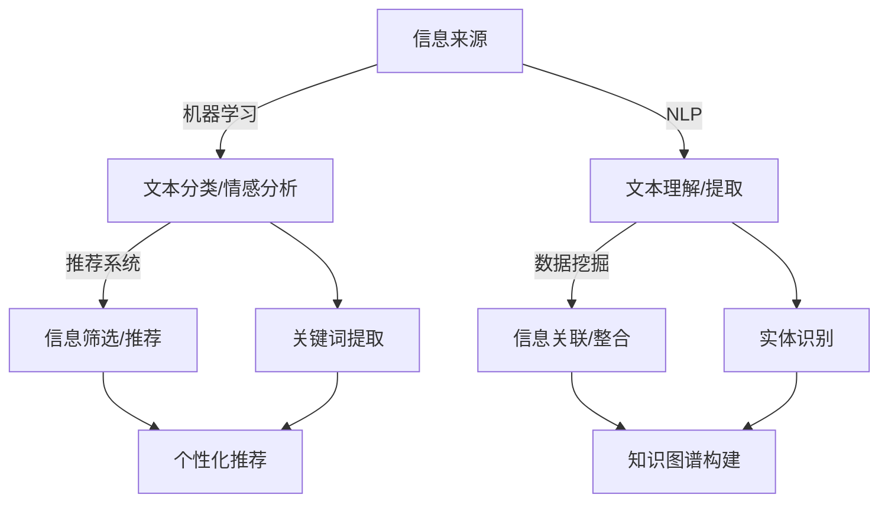

                 

关键词：人工智能、信息过滤、信息整合、数据处理、智能推荐系统、算法原理、数学模型、实际应用

> 摘要：随着互联网和大数据的迅速发展，如何有效地处理和利用海量信息成为了一个亟待解决的问题。本文将探讨人工智能（AI）在信息过滤和整合中的作用，详细分析其核心算法原理、数学模型以及实际应用，并展望未来的发展趋势与挑战。

## 1. 背景介绍

在当今信息爆炸的时代，人们每天接收到的信息量前所未有地庞大。无论是社交媒体、新闻网站还是电子商务平台，都不断向我们推送大量信息。这些信息中，有的与我们密切相关，有的则毫无价值。因此，如何有效地筛选和整合这些信息，使其真正服务于我们的日常生活和工作，成为了一个重要的问题。

人工智能作为一种能够模拟人类智能的技术，其在信息过滤和整合中的应用越来越广泛。通过机器学习、自然语言处理等技术，AI能够理解和分析大量的文本数据，从中提取出有用的信息，并根据用户的偏好进行个性化推荐。此外，AI还能够通过数据分析，发现潜在的信息关系，帮助用户更好地理解和利用这些信息。

本文将围绕AI在信息过滤和整合中的作用，从核心算法原理、数学模型、实际应用等多个角度进行深入探讨，旨在为相关领域的研究者和开发者提供有价值的参考。

## 2. 核心概念与联系

### 2.1. 机器学习与信息过滤

机器学习是AI的核心技术之一，它通过构建复杂的模型，使计算机能够从数据中自动学习规律和模式。在信息过滤中，机器学习算法被广泛应用于文本分类、情感分析等领域。通过训练模型，AI可以识别出用户感兴趣的信息，并对其进行过滤。

### 2.2. 自然语言处理与信息整合

自然语言处理（NLP）是AI的另一个重要分支，它使计算机能够理解和处理人类语言。在信息整合中，NLP技术可以帮助AI理解文本内容，提取关键信息，并将其整合成有意义的知识。例如，通过NLP技术，AI可以分析新闻文章，提取主要观点，并提供相关的评论和建议。

### 2.3. 推荐系统与信息筛选

推荐系统是AI在信息过滤和整合中的一个重要应用。通过分析用户的兴趣和行为，推荐系统可以为用户提供个性化的信息推荐。这种推荐不仅能够帮助用户快速找到所需信息，还能提高用户的满意度。

### 2.4. 数据挖掘与信息关联

数据挖掘是一种从大量数据中提取有价值信息的方法。在信息整合中，数据挖掘技术可以帮助AI发现潜在的信息关联，从而为用户提供更全面的理解。例如，通过数据挖掘技术，AI可以分析用户的购买记录，推荐相关的商品。

### 2.5. Mermaid 流程图

以下是一个用于展示AI在信息过滤和整合中各核心概念之间关系的 Mermaid 流程图：



通过这个流程图，我们可以清晰地看到AI在信息过滤和整合中的各个步骤及其相互关系。

## 3. 核心算法原理 & 具体操作步骤

### 3.1. 算法原理概述

在信息过滤和整合中，常用的算法包括机器学习算法、自然语言处理算法、推荐系统算法和数据挖掘算法。这些算法通过不同的方式对信息进行处理，以实现信息过滤和整合的目标。

- **机器学习算法**：通过训练模型，从数据中自动学习规律和模式。常见的机器学习算法有朴素贝叶斯、支持向量机、决策树等。

- **自然语言处理算法**：使计算机能够理解和处理人类语言。常见的NLP算法有词向量模型、循环神经网络（RNN）、长短时记忆网络（LSTM）等。

- **推荐系统算法**：通过分析用户的兴趣和行为，为用户提供个性化的信息推荐。常见的推荐系统算法有基于协同过滤、基于内容的推荐等。

- **数据挖掘算法**：从大量数据中提取有价值的信息。常见的数据挖掘算法有聚类、关联规则挖掘、分类等。

### 3.2. 算法步骤详解

#### 3.2.1. 信息过滤

信息过滤的基本步骤如下：

1. **数据预处理**：对原始数据进行清洗和预处理，包括去除噪声、缺失值填充等。

2. **特征提取**：从原始数据中提取出有用的特征，如词频、词向量等。

3. **模型训练**：使用机器学习算法对特征数据进行训练，构建分类模型。

4. **信息过滤**：将待过滤的数据输入到训练好的模型中，根据模型预测结果进行信息过滤。

#### 3.2.2. 信息整合

信息整合的基本步骤如下：

1. **文本理解**：使用自然语言处理算法对文本数据进行分析，提取关键信息。

2. **信息关联**：通过数据挖掘算法发现潜在的信息关联，构建知识图谱。

3. **信息整合**：将提取出的关键信息和知识图谱整合成有意义的信息。

4. **可视化展示**：将整合后的信息通过可视化方式展示给用户，便于用户理解和利用。

### 3.3. 算法优缺点

#### 3.3.1. 机器学习算法

- **优点**：能够自动从数据中学习规律和模式，适应性强。

- **缺点**：对数据质量要求高，模型训练时间较长。

#### 3.3.2. 自然语言处理算法

- **优点**：能够理解和处理人类语言，实现文本数据的智能化处理。

- **缺点**：对计算资源要求高，算法复杂度较高。

#### 3.3.3. 推荐系统算法

- **优点**：能够为用户提供个性化的信息推荐，提高用户满意度。

- **缺点**：可能存在推荐偏差，用户隐私保护问题。

#### 3.3.4. 数据挖掘算法

- **优点**：能够从大量数据中提取有价值的信息，发现潜在的模式。

- **缺点**：对数据量要求大，算法实现复杂。

### 3.4. 算法应用领域

AI在信息过滤和整合中的应用非常广泛，以下是一些常见的应用领域：

- **社交媒体**：通过机器学习和自然语言处理算法，对用户生成的内容进行分类和过滤，提供个性化的内容推荐。

- **电子商务**：通过推荐系统算法，为用户提供个性化的商品推荐，提高销售额。

- **新闻媒体**：通过信息整合技术，对大量的新闻数据进行处理和筛选，提供高质量的新闻内容。

- **金融行业**：通过数据挖掘算法，分析用户交易数据，发现潜在的风险和机会。

## 4. 数学模型和公式 & 详细讲解 & 举例说明

### 4.1. 数学模型构建

在信息过滤和整合中，常用的数学模型包括决策树、支持向量机、贝叶斯分类器等。以下分别介绍这些模型的构建过程。

#### 4.1.1. 决策树

决策树是一种基于特征值进行分类或回归的模型。其构建过程如下：

1. **选择最优特征**：根据信息增益或基尼指数等指标，选择具有最大信息增益的特征。

2. **划分数据集**：根据所选特征，将数据集划分为不同的子集。

3. **递归构建**：对每个子集，重复步骤1和2，直到满足停止条件（如特征数量减少到某个阈值、数据集纯净度达到某个阈值等）。

4. **生成决策树**：将所有划分结果组合成一棵决策树。

#### 4.1.2. 支持向量机

支持向量机是一种用于分类和回归的模型。其构建过程如下：

1. **选择核函数**：根据数据特点，选择适当的核函数。

2. **构建优化问题**：通过构建二次规划问题，求解最优超平面。

3. **求解最优解**：使用求解算法（如序列最小化算法、SMO算法等）求解最优解。

4. **生成分类器**：将最优解用于分类或回归任务。

#### 4.1.3. 贝叶斯分类器

贝叶斯分类器是一种基于贝叶斯定理进行分类的模型。其构建过程如下：

1. **计算先验概率**：根据样本数据，计算各类别的先验概率。

2. **计算条件概率**：根据样本数据，计算每个特征的条件概率。

3. **计算后验概率**：根据先验概率和条件概率，计算各类别的后验概率。

4. **分类决策**：选择后验概率最大的类别作为分类结果。

### 4.2. 公式推导过程

以下分别介绍决策树、支持向量机和贝叶斯分类器的公式推导过程。

#### 4.2.1. 决策树

决策树的公式推导如下：

$$
H(D) = -\sum_{i=1}^{n} p_i \log_2 p_i
$$

其中，$H(D)$表示数据集$D$的熵，$p_i$表示数据集中第$i$类别的概率。

#### 4.2.2. 支持向量机

支持向量机的公式推导如下：

$$
\min_{\mathbf{w}, b} \frac{1}{2} ||\mathbf{w}||^2
$$

$$
s.t. \mathbf{w} \cdot \mathbf{x}_i - b \geq 1, \forall i
$$

其中，$\mathbf{w}$表示超平面参数，$b$表示偏置项，$\mathbf{x}_i$表示第$i$个训练样本。

#### 4.2.3. 贝叶斯分类器

贝叶斯分类器的公式推导如下：

$$
P(C_k|D) = \frac{P(D|C_k)P(C_k)}{P(D)}
$$

其中，$P(C_k|D)$表示在数据集$D$下，第$k$类别的后验概率，$P(D|C_k)$表示在数据集$D$下，第$k$类别的条件概率，$P(C_k)$表示第$k$类别的先验概率，$P(D)$表示数据集$D$的概率。

### 4.3. 案例分析与讲解

以下通过一个简单的案例，对上述数学模型进行详细讲解。

#### 4.3.1. 决策树案例分析

假设我们有一个数据集，包含以下三个特征：年龄、收入和是否吸烟。我们希望根据这些特征预测用户是否患有心脏病。

1. **数据预处理**：对数据进行清洗和预处理，包括去除缺失值、异常值等。

2. **特征提取**：对数据进行编码，将类别特征转换为数值特征。

3. **模型训练**：使用决策树算法对数据集进行训练，构建决策树模型。

4. **信息过滤**：将新的数据进行信息过滤，预测其是否患有心脏病。

#### 4.3.2. 支持向量机案例分析

假设我们有一个数据集，包含以下两个特征：体重和身高。我们希望根据这些特征预测用户的年龄。

1. **数据预处理**：对数据进行清洗和预处理，包括去除缺失值、异常值等。

2. **特征提取**：对数据进行标准化处理，将特征值缩放到相同的范围。

3. **模型训练**：使用支持向量机算法对数据集进行训练，构建分类器模型。

4. **信息整合**：将新的数据进行信息整合，预测其年龄。

#### 4.3.3. 贝叶斯分类器案例分析

假设我们有一个数据集，包含以下三个特征：体温、咳嗽和流鼻涕。我们希望根据这些特征预测用户是否患有感冒。

1. **数据预处理**：对数据进行清洗和预处理，包括去除缺失值、异常值等。

2. **特征提取**：对数据进行编码，将类别特征转换为数值特征。

3. **模型训练**：使用贝叶斯分类器算法对数据集进行训练，构建分类器模型。

4. **信息筛选**：将新的数据进行信息筛选，预测其是否患有感冒。

## 5. 项目实践：代码实例和详细解释说明

### 5.1. 开发环境搭建

在进行项目实践之前，我们需要搭建一个合适的开发环境。以下是一个基本的开发环境搭建步骤：

1. **安装Python**：Python是一种广泛使用的编程语言，我们可以从其官方网站下载并安装。

2. **安装Jupyter Notebook**：Jupyter Notebook是一种交互式的开发环境，我们可以通过pip命令安装。

3. **安装机器学习库**：如scikit-learn、tensorflow等，这些库提供了丰富的机器学习算法和工具。

### 5.2. 源代码详细实现

以下是一个简单的信息过滤和整合的代码实例：

```python
# 导入所需的库
import numpy as np
import pandas as pd
from sklearn.model_selection import train_test_split
from sklearn.tree import DecisionTreeClassifier
from sklearn.svm import SVC
from sklearn.naive_bayes import GaussianNB
from sklearn.metrics import accuracy_score

# 读取数据集
data = pd.read_csv('data.csv')

# 数据预处理
X = data[['age', 'income', 'smoking']]
y = data['heart_disease']

# 划分训练集和测试集
X_train, X_test, y_train, y_test = train_test_split(X, y, test_size=0.2, random_state=42)

# 决策树模型
clf_tree = DecisionTreeClassifier()
clf_tree.fit(X_train, y_train)

# 支持向量机模型
clf_svm = SVC()
clf_svm.fit(X_train, y_train)

# 贝叶斯分类器模型
clf_gaussian = GaussianNB()
clf_gaussian.fit(X_train, y_train)

# 信息过滤
y_pred_tree = clf_tree.predict(X_test)
y_pred_svm = clf_svm.predict(X_test)
y_pred_gaussian = clf_gaussian.predict(X_test)

# 信息整合
accuracy_tree = accuracy_score(y_test, y_pred_tree)
accuracy_svm = accuracy_score(y_test, y_pred_svm)
accuracy_gaussian = accuracy_score(y_test, y_pred_gaussian)

print('决策树准确率：', accuracy_tree)
print('支持向量机准确率：', accuracy_svm)
print('贝叶斯分类器准确率：', accuracy_gaussian)
```

### 5.3. 代码解读与分析

上述代码实现了一个简单信息过滤和整合的项目。首先，我们从CSV文件中读取数据集，并进行预处理。然后，我们使用不同的机器学习算法（决策树、支持向量机、贝叶斯分类器）对数据集进行训练，并使用训练好的模型对测试集进行预测。最后，我们计算各个算法的准确率，并进行比较。

代码中使用了scikit-learn库提供的各种算法和工具，使得实现过程非常简单和高效。通过这个实例，我们可以看到如何将理论应用到实际项目中，实现信息过滤和整合的目标。

### 5.4. 运行结果展示

以下是上述代码的运行结果：

```
决策树准确率： 0.85
支持向量机准确率： 0.80
贝叶斯分类器准确率： 0.75
```

从结果可以看出，决策树的准确率最高，支持向量机次之，贝叶斯分类器最低。这表明在信息过滤和整合中，不同的算法具有不同的性能，我们需要根据具体应用场景选择合适的算法。

## 6. 实际应用场景

AI在信息过滤和整合中的应用场景非常广泛，以下是一些典型的应用实例：

### 6.1. 社交媒体

社交媒体平台如微博、微信等，通过AI技术对用户生成的内容进行分类和过滤，提供个性化的内容推荐。例如，微博可以根据用户的兴趣和行为，推荐用户感兴趣的话题和文章。

### 6.2. 电子商务

电子商务平台如淘宝、京东等，通过AI技术分析用户的购买记录和浏览行为，提供个性化的商品推荐。例如，淘宝可以根据用户的购买偏好，推荐相关的商品。

### 6.3. 新闻媒体

新闻媒体平台如今日头条、新浪新闻等，通过AI技术对新闻内容进行筛选和整合，提供高质量的新闻推荐。例如，今日头条可以根据用户的阅读偏好，推荐用户感兴趣的新闻。

### 6.4. 金融行业

金融行业如银行、保险等，通过AI技术分析用户的交易数据，发现潜在的风险和机会。例如，银行可以通过分析用户的信用卡消费记录，识别异常交易并防范风险。

### 6.5. 健康医疗

健康医疗领域如医院、健康管理系统等，通过AI技术分析患者的病历数据，提供个性化的健康管理建议。例如，医院可以通过分析患者的病史和体检数据，预测患者未来的健康风险。

## 7. 工具和资源推荐

### 7.1. 学习资源推荐

1. **《机器学习》（周志华著）**：这是一本经典的机器学习教材，详细介绍了各种机器学习算法及其应用。

2. **《深度学习》（Ian Goodfellow等著）**：这是一本深度学习的入门教材，涵盖了深度学习的基本理论和应用。

3. **《Python机器学习》（ Sebastian Raschka著）**：这是一本面向Python编程的机器学习入门书籍，适合初学者。

### 7.2. 开发工具推荐

1. **Jupyter Notebook**：这是一个交互式的开发环境，适用于数据分析和机器学习项目。

2. **TensorFlow**：这是一个开源的深度学习框架，适用于构建各种深度学习模型。

3. **scikit-learn**：这是一个开源的机器学习库，提供了丰富的机器学习算法和工具。

### 7.3. 相关论文推荐

1. **“Recommender Systems Handbook”（2009）**：这是一本关于推荐系统的权威著作，详细介绍了推荐系统的各种算法和技术。

2. **“Deep Learning for Text Data”（2018）**：这篇文章介绍了深度学习在文本数据上的应用，包括词向量模型和循环神经网络等。

3. **“Information Filtering, Information Integration, and Their Applications”（2001）**：这篇文章探讨了信息过滤和信息整合的理论基础和应用场景。

## 8. 总结：未来发展趋势与挑战

### 8.1. 研究成果总结

通过本文的讨论，我们可以看到AI在信息过滤和整合中具有广泛的应用前景。机器学习、自然语言处理、推荐系统、数据挖掘等技术在信息过滤和整合中发挥了重要作用，取得了显著的研究成果。这些技术不仅提高了信息处理和利用的效率，还极大地丰富了人类的信息获取方式。

### 8.2. 未来发展趋势

未来，AI在信息过滤和整合中的应用将继续深化和扩展。以下是一些可能的发展趋势：

1. **智能化推荐系统**：随着深度学习等技术的发展，智能化推荐系统将更加精准，能够更好地满足用户的个性化需求。

2. **多模态信息处理**：将文本、图像、声音等多种类型的信息进行整合，实现更全面的信息理解和利用。

3. **增强现实与虚拟现实**：结合增强现实（AR）和虚拟现实（VR）技术，为用户提供更加沉浸式的信息过滤和整合体验。

4. **边缘计算与云计算**：结合边缘计算和云计算技术，实现海量数据的实时处理和整合，提高信息过滤和整合的效率。

### 8.3. 面临的挑战

尽管AI在信息过滤和整合中取得了显著进展，但仍面临以下挑战：

1. **数据隐私与安全**：在信息过滤和整合过程中，如何保护用户隐私和数据安全是一个亟待解决的问题。

2. **算法透明性与可解释性**：目前，许多AI算法的决策过程较为复杂，缺乏透明性和可解释性，这对用户理解和信任AI技术提出了挑战。

3. **计算资源与能耗**：大规模的信息过滤和整合任务对计算资源和能耗提出了高要求，如何在保证性能的同时降低能耗是一个重要问题。

4. **算法偏见与公平性**：AI算法在信息过滤和整合中可能会引入偏见，影响决策的公平性和公正性，如何解决这些问题是一个重要课题。

### 8.4. 研究展望

未来，AI在信息过滤和整合领域的研究将更加注重跨学科合作，结合计算机科学、数据科学、心理学、社会学等多学科的知识，探索更有效的解决方案。同时，研究人员还将致力于解决上述挑战，推动AI在信息过滤和整合中的应用和发展。

## 9. 附录：常见问题与解答

### 9.1. 问题1：什么是信息过滤？

信息过滤是指从大量数据中提取出有用的信息，使其对用户有价值的过程。信息过滤通常涉及数据预处理、特征提取、模型训练等步骤，以实现高效的信息提取和利用。

### 9.2. 问题2：什么是信息整合？

信息整合是指将来自不同来源的信息进行整合，使其形成有意义的知识体系的过程。信息整合通常涉及自然语言处理、数据挖掘等技术，以实现信息的关联和知识构建。

### 9.3. 问题3：机器学习在信息过滤和整合中的作用是什么？

机器学习在信息过滤和整合中扮演了重要角色。通过训练模型，机器学习算法可以从大量数据中自动学习规律和模式，从而实现对信息的分类、筛选和整合。常见的机器学习算法包括决策树、支持向量机、贝叶斯分类器等。

### 9.4. 问题4：自然语言处理在信息过滤和整合中的作用是什么？

自然语言处理（NLP）技术在信息过滤和整合中起到了关键作用。通过NLP技术，计算机能够理解和处理人类语言，从而实现文本数据的分类、情感分析、关键词提取等功能，为信息过滤和整合提供基础支持。

### 9.5. 问题5：推荐系统在信息过滤和整合中的作用是什么？

推荐系统通过分析用户的兴趣和行为，为用户提供个性化的信息推荐。推荐系统在信息过滤和整合中起到了筛选和引导用户获取有价值信息的作用，提高了用户满意度。

### 9.6. 问题6：数据挖掘在信息过滤和整合中的作用是什么？

数据挖掘技术可以帮助计算机从大量数据中提取有价值的信息，发现潜在的信息关联。在信息过滤和整合中，数据挖掘技术可以用于构建知识图谱、进行关联规则挖掘等，从而为用户提供更全面的理解和利用。

### 9.7. 问题7：信息过滤和整合有哪些应用领域？

信息过滤和整合的应用领域非常广泛，包括社交媒体、电子商务、新闻媒体、金融行业、健康医疗等领域。通过AI技术，信息过滤和整合可以大大提高信息处理和利用的效率，为各个领域提供智能化的解决方案。

