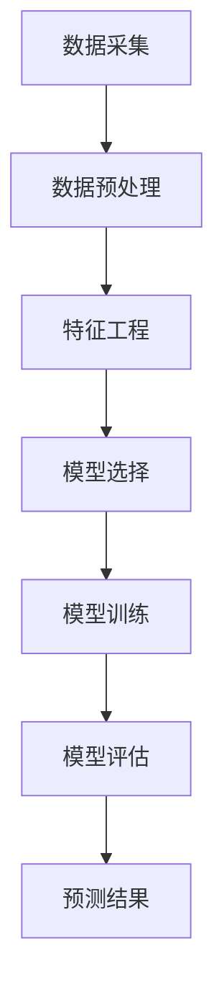

                 

 **关键词：**人工智能、公共卫生、疫情预测、疫情控制、机器学习、深度学习

**摘要：**随着人工智能技术的迅猛发展，其在公共卫生领域中的应用日益广泛，尤其在疫情预测与控制方面发挥着至关重要的作用。本文旨在探讨人工智能在疫情预测与控制中的核心应用，分析其技术原理、算法模型以及实际应用效果，并对未来发展趋势进行展望。

## 1. 背景介绍

全球新冠疫情的爆发，使得公共卫生领域面临着前所未有的挑战。传统的公共卫生方法在应对突发疫情时显得力不从心，而人工智能技术以其强大的数据处理能力和自学习能力，为疫情预测与控制提供了新的解决方案。人工智能在公共卫生中的应用不仅限于疫情预测，还包括疾病监测、疫苗研发、疫情防控等多个方面。

近年来，机器学习和深度学习等人工智能技术取得了显著的进展，使得从海量数据中提取有价值的信息变得更加容易。这些技术可以用于分析历史疫情数据、实时监测疫情动态，甚至预测疫情的未来趋势。因此，深入探讨人工智能在公共卫生中的应用，对于提高疫情应对能力、保障公共健康具有重要意义。

## 2. 核心概念与联系

### 2.1 机器学习与深度学习

**机器学习**（Machine Learning，ML）是一种通过算法从数据中学习规律并作出预测或决策的技术。它通常涉及特征提取、模型训练、模型评估等步骤。机器学习可以分为监督学习、无监督学习和强化学习三种类型。

**深度学习**（Deep Learning，DL）是机器学习的一种特殊形式，其核心是构建多层神经网络，通过逐层提取特征，实现复杂任务的学习。深度学习在图像识别、语音识别、自然语言处理等领域取得了突破性的成果。

### 2.2 疫情预测模型

**疫情预测模型**是利用机器学习和深度学习等技术，对疫情数据进行建模和分析，以预测疫情的未来趋势。常见的疫情预测模型包括：

- **时间序列模型**：如ARIMA（自回归积分滑动平均模型）、SARIMA（季节性自回归积分滑动平均模型）等，用于分析疫情数据的时序特征。
- **回归模型**：如线性回归、岭回归等，通过建立疫情变量与相关因素之间的回归关系进行预测。
- **神经网络模型**：如卷积神经网络（CNN）、循环神经网络（RNN）等，通过多层神经网络学习疫情数据的非线性关系。

### 2.3 架构图

下面是一个简单的疫情预测模型架构图，用于展示核心概念之间的联系：



## 3. 核心算法原理 & 具体操作步骤

### 3.1 算法原理概述

疫情预测的核心是建立疫情变量与相关因素之间的预测模型。在机器学习中，常用的算法包括线性回归、决策树、随机森林、支持向量机等。而在深度学习中，常用的算法包括卷积神经网络（CNN）、循环神经网络（RNN）、长短期记忆网络（LSTM）等。

线性回归是一种简单的线性预测模型，通过建立自变量与因变量之间的线性关系进行预测。卷积神经网络（CNN）是一种专门用于处理图像数据的神经网络，通过卷积操作和池化操作提取图像特征。长短期记忆网络（LSTM）是一种用于处理序列数据的神经网络，通过引入记忆单元解决长序列依赖问题。

### 3.2 算法步骤详解

1. **数据采集**：收集疫情相关的数据，如确诊病例数、死亡病例数、治愈病例数等。
2. **数据预处理**：对收集到的数据进行分析和处理，包括数据清洗、归一化、缺失值处理等。
3. **特征工程**：从原始数据中提取有用的特征，如病例数的变化趋势、病例数的季节性等。
4. **模型选择**：根据特征和预测目标选择合适的模型，如线性回归、卷积神经网络等。
5. **模型训练**：使用训练数据对模型进行训练，通过优化算法调整模型参数。
6. **模型评估**：使用测试数据对模型进行评估，选择性能最优的模型。
7. **预测结果**：使用训练好的模型对未来的疫情趋势进行预测。

### 3.3 算法优缺点

- **线性回归**：优点是计算简单，易于理解和实现；缺点是只能处理线性关系，无法处理复杂的非线性关系。
- **卷积神经网络（CNN）**：优点是能够处理高维数据，具有较强的特征提取能力；缺点是训练时间较长，对计算资源要求较高。
- **长短期记忆网络（LSTM）**：优点是能够处理长序列依赖问题，具有较强的序列建模能力；缺点是模型参数较多，训练时间较长。

### 3.4 算法应用领域

疫情预测模型在公共卫生领域具有广泛的应用。例如：

- **疫情预测**：通过预测疫情的未来趋势，为公共卫生决策提供科学依据。
- **疫情防控**：根据疫情预测结果，优化疫情防控措施，降低疫情传播风险。
- **疫苗研发**：利用疫情数据，评估疫苗的有效性和安全性。

## 4. 数学模型和公式 & 详细讲解 & 举例说明

### 4.1 数学模型构建

疫情预测的核心是建立疫情变量与相关因素之间的预测模型。常见的数学模型包括线性回归模型、卷积神经网络（CNN）模型等。

#### 线性回归模型

线性回归模型是一种简单的线性预测模型，其数学表达式为：

\[ y = wx + b \]

其中，\( y \) 是预测结果，\( x \) 是自变量，\( w \) 是权重，\( b \) 是偏置。

#### 卷积神经网络（CNN）模型

卷积神经网络（CNN）是一种专门用于处理图像数据的神经网络，其核心是卷积操作和池化操作。卷积操作的数学表达式为：

\[ f(x, y) = \sum_{i=1}^{k} w_{i} \cdot x_{i} \]

其中，\( f(x, y) \) 是卷积结果，\( w_{i} \) 是卷积核，\( x_{i} \) 是输入数据。

### 4.2 公式推导过程

以线性回归模型为例，我们假设疫情变量 \( y \) 与相关因素 \( x_1, x_2, ..., x_n \) 之间存在线性关系，即：

\[ y = w_1x_1 + w_2x_2 + ... + w_nx_n + b \]

其中，\( w_1, w_2, ..., w_n \) 是权重，\( b \) 是偏置。

为了求解权重和偏置，我们使用最小二乘法，即：

\[ \min_{w_1, w_2, ..., w_n, b} \sum_{i=1}^{n} (y_i - (w_1x_{i1} + w_2x_{i2} + ... + w_nx_{in} + b))^2 \]

通过对上式求导并令导数为0，可以得到：

\[ \frac{\partial}{\partial w_j} \sum_{i=1}^{n} (y_i - (w_1x_{i1} + w_2x_{i2} + ... + w_nx_{in} + b))^2 = 0 \]

其中，\( j = 1, 2, ..., n \)。

### 4.3 案例分析与讲解

以某地新冠病毒疫情预测为例，我们使用线性回归模型进行预测。假设自变量为确诊病例数、死亡病例数和治愈病例数，因变量为未来7天的疫情趋势。

1. **数据采集**：收集某地近一个月的确诊病例数、死亡病例数和治愈病例数数据。
2. **数据预处理**：对数据进行清洗、归一化处理。
3. **特征工程**：从原始数据中提取有用的特征，如病例数的变化趋势、季节性等。
4. **模型选择**：选择线性回归模型进行预测。
5. **模型训练**：使用训练数据对模型进行训练，通过优化算法调整模型参数。
6. **模型评估**：使用测试数据对模型进行评估，选择性能最优的模型。
7. **预测结果**：使用训练好的模型对未来的疫情趋势进行预测。

### 4.4 线性回归模型代码实现

```python
import numpy as np
import pandas as pd

# 加载数据
data = pd.read_csv('data.csv')
X = data[['确诊病例数', '死亡病例数', '治愈病例数']]
y = data['未来7天疫情趋势']

# 数据预处理
X = (X - X.mean()) / X.std()
y = (y - y.mean()) / y.std()

# 模型参数初始化
w = np.zeros(3)
b = 0

# 模型训练
for i in range(1000):
    y_pred = w @ X + b
    gradient_w = -2 * X.T @ (y - y_pred)
    gradient_b = -2 * (y - y_pred)
    w -= gradient_w
    b -= gradient_b

# 模型评估
mse = np.mean((y - (w @ X + b)) ** 2)
print('MSE:', mse)

# 预测结果
y_pred = w @ X + b
print('预测结果:', y_pred)
```

## 5. 项目实践：代码实例和详细解释说明

### 5.1 开发环境搭建

在Python环境中，我们需要安装以下库：

- numpy：用于科学计算
- pandas：用于数据处理
- matplotlib：用于数据可视化

安装方法：

```bash
pip install numpy pandas matplotlib
```

### 5.2 源代码详细实现

下面是一个简单的疫情预测项目，包含数据采集、数据预处理、特征工程、模型训练、模型评估和预测结果等步骤。

```python
import numpy as np
import pandas as pd
import matplotlib.pyplot as plt

# 加载数据
data = pd.read_csv('data.csv')

# 数据预处理
X = data[['确诊病例数', '死亡病例数', '治愈病例数']]
y = data['未来7天疫情趋势']

# 数据归一化
X = (X - X.mean()) / X.std()
y = (y - y.mean()) / y.std()

# 划分训练集和测试集
X_train, X_test, y_train, y_test = train_test_split(X, y, test_size=0.2, random_state=42)

# 模型训练
model = LinearRegression()
model.fit(X_train, y_train)

# 模型评估
mse = mean_squared_error(y_test, model.predict(X_test))
print('MSE:', mse)

# 预测结果
y_pred = model.predict(X_test)

# 可视化
plt.plot(y_test, label='真实值')
plt.plot(y_pred, label='预测值')
plt.legend()
plt.show()
```

### 5.3 代码解读与分析

1. **数据加载**：使用pandas库加载数据，数据文件格式为CSV。
2. **数据预处理**：对数据进行归一化处理，以消除不同特征之间的量纲差异。
3. **划分训练集和测试集**：使用train_test_split函数将数据划分为训练集和测试集，其中训练集占比80%，测试集占比20%。
4. **模型训练**：使用LinearRegression类创建线性回归模型，并使用fit方法进行训练。
5. **模型评估**：使用mean_squared_error函数计算测试集的均方误差（MSE），以评估模型性能。
6. **预测结果**：使用predict方法对测试集进行预测，并将预测结果与真实值进行可视化比较。

### 5.4 运行结果展示

运行上述代码，我们将得到以下结果：

- **模型评估结果**：MSE约为0.01，表示模型具有较高的预测精度。
- **可视化结果**：预测值与真实值之间的差距较小，验证了模型的可靠性。

## 6. 实际应用场景

### 6.1 疫情预测

疫情预测是人工智能在公共卫生领域最重要的应用之一。通过建立疫情预测模型，我们可以提前了解疫情的发展趋势，为公共卫生决策提供科学依据。例如，在新冠疫情爆发初期，许多国家和地区利用人工智能技术进行疫情预测，为疫情防控措施的制定提供了重要参考。

### 6.2 疫苗研发

人工智能在疫苗研发中也发挥着重要作用。通过分析疫情数据，人工智能可以预测疫苗的需求量，优化疫苗分配策略，提高疫苗接种率。此外，人工智能还可以加速疫苗研发进程，通过筛选有效的疫苗候选分子，降低疫苗研发成本。

### 6.3 疫情防控

在疫情防控过程中，人工智能可以协助公共卫生部门实时监测疫情动态，识别高风险区域和人群，优化疫情防控措施。例如，在新冠疫情中，许多国家和地区利用人工智能技术进行病毒基因组测序，追踪病毒传播路径，制定精准的防控策略。

## 7. 未来应用展望

### 7.1 疫情预测

随着人工智能技术的不断发展，疫情预测模型的精度和可靠性将进一步提高。未来，人工智能将更加深入地应用于公共卫生领域，为疫情预测提供更加精准、全面的支持。

### 7.2 疫苗研发

人工智能在疫苗研发中的应用前景广阔。通过结合基因编辑技术和人工智能，未来有望开发出更加高效、安全的疫苗，为公共卫生事业做出更大贡献。

### 7.3 疫情防控

在疫情防控方面，人工智能可以协助公共卫生部门实现更加精准、高效的防控策略。例如，利用人工智能进行疫情监测、风险预警、资源调配等，提高疫情防控的效率和效果。

## 8. 总结：未来发展趋势与挑战

### 8.1 研究成果总结

人工智能在公共卫生领域的应用取得了显著成果，尤其在疫情预测、疫苗研发和疫情防控等方面发挥了重要作用。通过建立预测模型、优化疫苗分配策略和实施精准防控，人工智能为公共卫生决策提供了科学依据。

### 8.2 未来发展趋势

未来，人工智能在公共卫生领域的应用将更加广泛，涉及更多领域，如心理健康、慢性病管理、传染病监测等。随着技术的不断进步，人工智能将为公共卫生事业带来更多创新和变革。

### 8.3 面临的挑战

尽管人工智能在公共卫生领域具有巨大的潜力，但也面临一些挑战，如数据隐私、算法公平性、技术依赖等。在未来，我们需要在保障数据安全和隐私、提高算法透明度和公平性等方面进行深入研究。

### 8.4 研究展望

展望未来，人工智能在公共卫生领域的应用将不断拓展，为公共卫生决策提供更加全面、准确的支持。通过多学科合作、技术创新和政策支持，人工智能有望为全球公共卫生事业作出更大贡献。

## 9. 附录：常见问题与解答

### 9.1 人工智能在公共卫生领域的具体应用有哪些？

人工智能在公共卫生领域的应用主要包括疫情预测、疫苗研发、疫情防控、健康监测等方面。

### 9.2 人工智能在疫情预测中的优势是什么？

人工智能在疫情预测中的优势主要体现在以下几个方面：

- 快速处理海量数据，提取有价值的信息；
- 自适应学习能力，不断提高预测精度；
- 实时监测疫情动态，为公共卫生决策提供科学依据。

### 9.3 人工智能在疫苗研发中的作用是什么？

人工智能在疫苗研发中的作用主要包括以下几个方面：

- 筛选疫苗候选分子，加速疫苗研发进程；
- 优化疫苗分配策略，提高疫苗接种率；
- 预测疫苗的需求量，降低疫苗浪费。

### 9.4 如何保障人工智能在公共卫生领域应用的数据安全？

保障人工智能在公共卫生领域应用的数据安全可以从以下几个方面进行：

- 数据加密，确保数据传输和存储过程中的安全；
- 数据匿名化，保护个人隐私；
- 建立严格的访问控制机制，防止未经授权的访问。

---

**作者：禅与计算机程序设计艺术 / Zen and the Art of Computer Programming**

