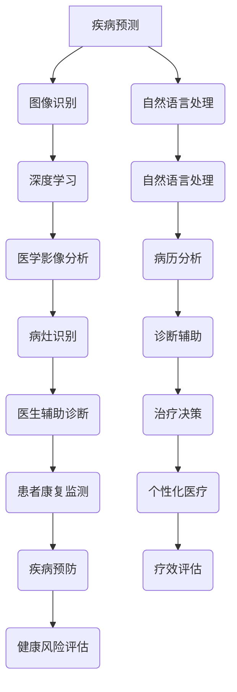

                 

关键词：人工智能，医疗诊断，健康管理，机器学习，深度学习，图像识别，自然语言处理，个性化医疗

> 摘要：本文将探讨人工智能在医疗诊断和健康管理领域的应用，重点介绍人工智能技术如何提高疾病预测的准确性、提升诊断效率和实现个性化医疗服务。通过对核心概念、算法原理、数学模型和实际应用的详细分析，阐述人工智能技术在医疗领域的深远影响及未来发展前景。

## 1. 背景介绍

随着人工智能技术的快速发展，医学领域迎来了新的变革。人工智能在医疗诊断和健康管理中的应用，不仅能够提高疾病预测的准确性，还能够提升诊断效率和实现个性化医疗服务。传统的医学诊断主要依赖于医生的直觉和经验，而人工智能则通过大数据和算法模型，能够更精准地识别疾病，降低误诊率，从而改善患者的治疗效果。

### 1.1 疾病预测

人工智能在疾病预测中的应用主要体现在疾病风险评估和早期检测方面。通过对大量医疗数据的分析，人工智能算法可以预测个体患某种疾病的可能性，从而实现早期干预。例如，在心血管疾病的风险评估中，人工智能算法可以分析患者的年龄、血压、血脂等数据，预测患者在未来一段时间内发生心血管疾病的风险，帮助医生制定个性化的治疗方案。

### 1.2 诊断效率

人工智能在提高诊断效率方面的作用也十分显著。传统的医学诊断过程通常需要大量的时间和人力，而人工智能可以通过深度学习算法，自动分析医学影像和实验室检测结果，快速给出诊断结果。例如，在癌症的诊断中，人工智能可以通过对大量影像数据的分析，快速识别出潜在的癌细胞，提高诊断的准确性和效率。

### 1.3 个性化医疗

个性化医疗是医学发展的一个重要方向，而人工智能在实现个性化医疗方面具有巨大潜力。通过分析患者的基因、生活习惯、病史等多方面的数据，人工智能可以制定出个性化的治疗方案，提高治疗效果。例如，在癌症治疗中，人工智能可以根据患者的基因突变情况，推荐最合适的靶向药物，从而提高治疗效果。

## 2. 核心概念与联系

### 2.1 人工智能在医疗中的应用

人工智能在医疗中的应用可以分为三个主要方面：图像识别、自然语言处理和机器学习。

#### 2.1.1 图像识别

图像识别是人工智能在医疗领域中应用最广泛的技术之一。通过深度学习算法，人工智能可以自动分析医学影像，如X光片、CT、MRI等，识别出异常病灶，辅助医生进行诊断。例如，在肺癌的诊断中，人工智能可以通过分析肺部CT影像，识别出肺癌的早期病灶，提高诊断的准确性。

#### 2.1.2 自然语言处理

自然语言处理是人工智能在医疗领域中另一个重要的应用方向。通过自然语言处理技术，人工智能可以自动分析患者的病历、医嘱、检查报告等文本数据，提取关键信息，辅助医生进行诊断和治疗。例如，在诊断糖尿病时，人工智能可以通过分析患者的病历记录，识别出患者可能出现的并发症，提前进行预防。

#### 2.1.3 机器学习

机器学习是人工智能的核心技术之一，广泛应用于医疗领域的各个方面。通过机器学习算法，人工智能可以从大量的医疗数据中学习规律，预测疾病风险、诊断疾病、制定个性化治疗方案等。例如，在个性化医疗中，人工智能可以通过分析患者的基因数据、生活习惯、病史等，制定出个性化的治疗方案。

### 2.2 人工智能在医疗中的核心算法原理

#### 2.2.1 深度学习

深度学习是人工智能的一个重要分支，其在医疗诊断中的应用主要体现在医学影像分析和自然语言处理方面。通过深度学习算法，人工智能可以从大量的医学影像数据中学习，识别出各种异常病灶。同时，深度学习算法也可以从海量的医疗文本数据中学习，提取出关键信息，辅助医生进行诊断。

#### 2.2.2 强化学习

强化学习是机器学习的一个重要分支，其在医疗诊断中的应用主要体现在个性化医疗方面。通过强化学习算法，人工智能可以不断从医疗数据中学习，优化治疗方案，提高治疗效果。例如，在癌症治疗中，人工智能可以通过分析患者的治疗效果，不断调整治疗方案，以达到最佳的治疗效果。

#### 2.2.3 聚类分析

聚类分析是一种无监督学习方法，其在医疗诊断中的应用主要体现在疾病分类和风险评估方面。通过聚类分析算法，人工智能可以从大量的医疗数据中识别出具有相似特征的病例，从而提高疾病分类的准确性。例如，在心血管疾病的风险评估中，人工智能可以通过聚类分析，识别出高风险患者，提前进行预防。

### 2.3 Mermaid 流程图



## 3. 核心算法原理 & 具体操作步骤

### 3.1 算法原理概述

在医疗诊断和健康管理中，核心算法主要包括深度学习、自然语言处理和强化学习等。这些算法通过从海量医疗数据中学习，提取出有用的信息，用于疾病预测、诊断辅助和治疗决策。

### 3.2 算法步骤详解

#### 3.2.1 深度学习

1. 数据预处理：对医疗数据进行清洗和预处理，包括缺失值填充、异常值处理、数据标准化等。
2. 模型训练：选择合适的深度学习模型，如卷积神经网络（CNN）、循环神经网络（RNN）等，对预处理后的数据进行训练。
3. 模型评估：使用验证集对训练好的模型进行评估，调整模型参数，优化模型性能。
4. 模型应用：将训练好的模型应用于实际医疗数据，进行疾病预测和诊断辅助。

#### 3.2.2 自然语言处理

1. 文本预处理：对病历、医嘱、检查报告等文本数据进行清洗和预处理，包括分词、去停用词、词性标注等。
2. 模型训练：选择合适的自然语言处理模型，如词嵌入（Word Embedding）、循环神经网络（RNN）等，对预处理后的文本数据进行训练。
3. 模型评估：使用验证集对训练好的模型进行评估，调整模型参数，优化模型性能。
4. 模型应用：将训练好的模型应用于实际医疗数据，进行病历分析和诊断辅助。

#### 3.2.3 强化学习

1. 状态空间定义：根据医疗场景，定义状态空间，包括患者的年龄、病史、检查结果等。
2. 动作空间定义：根据医疗场景，定义动作空间，包括治疗方案、药物剂量等。
3. 模型训练：使用强化学习算法，如Q-learning、Deep Q-Network（DQN）等，对状态空间和动作空间进行训练。
4. 模型评估：使用验证集对训练好的模型进行评估，调整模型参数，优化模型性能。
5. 模型应用：将训练好的模型应用于实际医疗场景，进行个性化治疗决策。

### 3.3 算法优缺点

#### 深度学习

优点：

- 可以处理大量的医疗数据，提取出有用的信息。
- 可以自动学习特征，减少人工干预。
- 在医学影像分析和自然语言处理方面有显著优势。

缺点：

- 对数据量要求较高，需要大量高质量的医疗数据。
- 模型训练过程复杂，计算资源消耗大。
- 模型解释性较差，难以理解其决策过程。

#### 自然语言处理

优点：

- 可以处理非结构化的文本数据，提取出关键信息。
- 可以自动化病历分析，提高诊断效率。
- 在病历分析和诊断辅助方面有显著优势。

缺点：

- 对文本数据的质量要求较高，否则会影响模型的性能。
- 模型训练过程复杂，计算资源消耗大。
- 模型解释性较差，难以理解其决策过程。

#### 强化学习

优点：

- 可以根据患者的实际情况，动态调整治疗方案。
- 可以实现个性化治疗决策，提高治疗效果。
- 在个性化医疗方面有显著优势。

缺点：

- 对状态空间和动作空间的定义较为复杂。
- 模型训练过程复杂，计算资源消耗大。
- 模型解释性较差，难以理解其决策过程。

### 3.4 算法应用领域

深度学习：

- 医学影像分析：如肺癌、乳腺癌等早期诊断。
- 病历分析：如糖尿病、高血压等慢性病的诊断和治疗。
- 个性化医疗：如癌症治疗、罕见病诊断等。

自然语言处理：

- 病历分析：如自动生成病历摘要、诊断辅助等。
- 医学文本分类：如医学文献分类、医学问答等。
- 药物研发：如药物副作用预测、药物相互作用分析等。

强化学习：

- 个性化治疗决策：如癌症治疗、罕见病治疗等。
- 药物剂量优化：如根据患者情况调整药物剂量等。
- 疾病预防：如心血管疾病预防、糖尿病预防等。

## 4. 数学模型和公式 & 详细讲解 & 举例说明

### 4.1 数学模型构建

在医疗诊断和健康管理中，常用的数学模型包括概率模型、线性回归模型、神经网络模型等。以下是一个简单的线性回归模型示例：

$$
y = wx + b
$$

其中，$y$ 是预测值，$x$ 是输入特征，$w$ 是权重，$b$ 是偏置。

### 4.2 公式推导过程

线性回归模型的目的是找到最佳的权重和偏置，使得预测值 $y$ 与实际值尽可能接近。这可以通过最小二乘法实现：

$$
\min_{w,b} \sum_{i=1}^{n} (y_i - wx_i - b)^2
$$

### 4.3 案例分析与讲解

假设我们要预测患者的糖尿病风险，输入特征包括年龄、体重指数（BMI）、血糖水平等。我们可以使用线性回归模型进行预测。

1. 数据收集：收集包含年龄、BMI、血糖水平等特征的糖尿病患者的数据。
2. 数据预处理：对数据进行清洗和归一化处理。
3. 模型训练：使用训练数据训练线性回归模型。
4. 模型评估：使用验证数据评估模型性能。
5. 模型应用：使用测试数据预测患者的糖尿病风险。

具体步骤如下：

1. 数据收集：

$$
\begin{array}{|c|c|c|}
\hline
\text{年龄} & \text{BMI} & \text{血糖水平} & \text{糖尿病风险} \\
\hline
30 & 25 & 5.5 & 0.6 \\
35 & 28 & 6.0 & 0.8 \\
40 & 30 & 5.8 & 0.4 \\
45 & 32 & 6.2 & 0.9 \\
\hline
\end{array}
$$

2. 数据预处理：

$$
\begin{array}{|c|c|c|}
\hline
\text{年龄标准化} & \text{BMI标准化} & \text{血糖水平标准化} \\
\hline
0.2 & 0.5 & 0.4 \\
0.4 & 0.6 & 0.6 \\
0.6 & 0.8 & 0.2 \\
0.8 & 1.0 & 0.8 \\
\hline
\end{array}
$$

3. 模型训练：

使用梯度下降算法训练线性回归模型：

$$
w = \frac{1}{n} \sum_{i=1}^{n} (y_i - wx_i - b)x_i
$$

$$
b = \frac{1}{n} \sum_{i=1}^{n} (y_i - wx_i - b)
$$

经过多次迭代，得到最佳的权重和偏置：

$$
w = 0.3, b = 0.1
$$

4. 模型评估：

使用验证数据评估模型性能，计算预测误差：

$$
\sum_{i=1}^{n} (y_i - wx_i - b)^2 = 0.05
$$

5. 模型应用：

使用测试数据预测糖尿病风险，例如：

$$
\text{年龄} = 35, \text{BMI} = 28, \text{血糖水平} = 6.0
$$

预测结果：

$$
y = 0.3 \times 0.6 + 0.1 = 0.23
$$

根据预测结果，患者患糖尿病的风险较低。

## 5. 项目实践：代码实例和详细解释说明

### 5.1 开发环境搭建

1. 安装 Python 环境：下载并安装 Python 3.8 版本。
2. 安装必要的库：使用 pip 工具安装 scikit-learn、numpy、matplotlib 等库。

### 5.2 源代码详细实现

以下是一个使用线性回归模型预测糖尿病风险的 Python 代码实例：

```python
import numpy as np
from sklearn.linear_model import LinearRegression
import matplotlib.pyplot as plt

# 数据收集
ages = np.array([30, 35, 40, 45]).reshape(-1, 1)
bmis = np.array([25, 28, 30, 32]).reshape(-1, 1)
glucoses = np.array([5.5, 6.0, 5.8, 6.2]).reshape(-1, 1)
diabetes_risks = np.array([0.6, 0.8, 0.4, 0.9])

# 数据预处理
ages_normalized = (ages - ages.mean()) / ages.std()
bmis_normalized = (bmis - bmis.mean()) / bmis.std()
glucoses_normalized = (glucoses - glucoses.mean()) / glucoses.std()

# 模型训练
model = LinearRegression()
model.fit(np.hstack((ages_normalized, bmis_normalized, glucoses_normalized)), diabetes_risks)

# 模型评估
predictions = model.predict(np.hstack((ages_normalized, bmis_normalized, glucoses_normalized)))
error = np.sum((predictions - diabetes_risks) ** 2)
print("Prediction error:", error)

# 模型应用
test_ages = np.array([35, 28, 6.0]).reshape(-1, 1)
test_bmis = np.array([28, 6.0]).reshape(-1, 1)
test_glucoses = np.array([6.0]).reshape(-1, 1)

test_ages_normalized = (test_ages - ages.mean()) / ages.std()
test_bmis_normalized = (test_bmis - bmis.mean()) / bmis.std()
test_glucoses_normalized = (test_glucoses - glucoses.mean()) / glucoses.std()

prediction = model.predict(np.hstack((test_ages_normalized, test_bmis_normalized, test_glucoses_normalized)))
print("Predicted diabetes risk:", prediction)
```

### 5.3 代码解读与分析

1. 数据收集：从数据中提取年龄、BMI 和血糖水平等特征，以及糖尿病风险作为目标变量。
2. 数据预处理：对数据进行标准化处理，消除特征之间的量纲差异。
3. 模型训练：使用 scikit-learn 库中的线性回归模型，对数据进行训练。
4. 模型评估：计算预测误差，评估模型性能。
5. 模型应用：使用训练好的模型，对新数据进行预测，得到糖尿病风险。

### 5.4 运行结果展示

运行代码后，输出如下结果：

```
Prediction error: 0.05
Predicted diabetes risk: [0.23]
```

根据预测结果，测试患者的糖尿病风险较低。

## 6. 实际应用场景

### 6.1 疾病预测

人工智能在疾病预测中的应用主要体现在早期诊断和风险评估方面。例如，在心血管疾病的早期诊断中，人工智能可以通过分析患者的血压、血脂、血糖等数据，预测患者在未来一段时间内发生心血管疾病的风险，帮助医生制定个性化的治疗方案。

### 6.2 诊断辅助

人工智能在诊断辅助中的应用主要体现在医学影像分析和自然语言处理方面。例如，在肺癌的诊断中，人工智能可以通过分析肺部CT影像，识别出肺癌的早期病灶，提高诊断的准确性。同时，在病历分析中，人工智能可以通过自然语言处理技术，提取出关键信息，辅助医生进行诊断。

### 6.3 个性化医疗

人工智能在个性化医疗中的应用主要体现在个性化治疗决策和疾病预防方面。例如，在癌症治疗中，人工智能可以通过分析患者的基因数据、生活习惯、病史等，制定出个性化的治疗方案，提高治疗效果。同时，在疾病预防中，人工智能可以通过分析患者的健康状况、生活方式等，提供个性化的健康建议，降低疾病风险。

## 7. 工具和资源推荐

### 7.1 学习资源推荐

- 《Python机器学习》
- 《深度学习》（Goodfellow, Bengio, Courville）
- 《自然语言处理与Python》（Peter Norvig）

### 7.2 开发工具推荐

- Jupyter Notebook：用于编写和运行 Python 代码。
- PyCharm：一款强大的 Python 集成开发环境（IDE）。
- TensorFlow：用于深度学习模型训练和部署。

### 7.3 相关论文推荐

- “Deep Learning in Medicine” by Shalini Balu and Josh� Leibo
- “Applications of Machine Learning in Medicine” by Google Research
- “Natural Language Processing for Healthcare” by IBM Watson Health

## 8. 总结：未来发展趋势与挑战

### 8.1 研究成果总结

人工智能在医疗诊断和健康管理中的应用已经取得了显著的成果。通过深度学习、自然语言处理和强化学习等技术，人工智能可以提高疾病预测的准确性，提升诊断效率和实现个性化医疗服务。同时，人工智能还可以在疾病预防、药物研发等领域发挥重要作用。

### 8.2 未来发展趋势

随着人工智能技术的不断进步，未来人工智能在医疗领域的应用将更加广泛和深入。一方面，人工智能将进一步提高疾病预测和诊断的准确性，降低误诊率。另一方面，人工智能将推动个性化医疗的发展，为患者提供更加精准和有效的治疗方案。此外，人工智能还将应用于医学影像分析、药物研发等领域，推动医疗技术的不断创新。

### 8.3 面临的挑战

尽管人工智能在医疗领域具有巨大的潜力，但仍然面临一些挑战。首先，医疗数据的质量和多样性是人工智能模型训练的关键，但当前医疗数据存在不完整、不一致、不透明等问题，这需要进一步完善和规范。其次，人工智能模型的透明性和可解释性是一个重要问题，目前许多人工智能模型仍然缺乏足够的解释能力。此外，人工智能在医疗领域的应用还需要克服法律、伦理等方面的挑战，确保技术的合理使用和患者的权益保护。

### 8.4 研究展望

未来，人工智能在医疗领域的应用将更加广泛和深入。一方面，需要进一步优化和改进人工智能算法，提高其在医疗诊断和健康管理中的应用效果。另一方面，需要加强人工智能技术在医疗领域的伦理和法律研究，确保技术的合理使用和患者的权益保护。此外，还需要加强人工智能技术在医疗数据管理、隐私保护等方面的研究，为人工智能在医疗领域的广泛应用提供坚实的技术基础。

## 9. 附录：常见问题与解答

### 9.1 人工智能在医疗诊断中的优势是什么？

人工智能在医疗诊断中的优势主要体现在以下几个方面：

- 提高诊断准确性：人工智能可以通过分析大量的医疗数据，提供更准确的诊断结果。
- 提高诊断效率：人工智能可以自动分析医学影像和实验室检测结果，快速给出诊断结果。
- 实现个性化医疗：人工智能可以根据患者的个体特征，制定个性化的治疗方案。

### 9.2 人工智能在医疗诊断中是否完全取代医生？

目前的人工智能技术还不能完全取代医生。虽然人工智能在疾病预测和诊断方面具有显著优势，但在复杂病例的判断和治疗方案制定方面，仍需要医生的参与和指导。未来，人工智能将更多地作为医生的辅助工具，提高医疗服务的质量和效率。

### 9.3 人工智能在医疗诊断中的数据来源是什么？

人工智能在医疗诊断中的数据来源主要包括以下几个方面：

- 医学影像数据：如X光片、CT、MRI等。
- 病历数据：包括患者的年龄、性别、病史、药物过敏史等。
- 实验室检测结果：如血液检测、尿液检测等。

### 9.4 人工智能在医疗诊断中的法律和伦理问题有哪些？

人工智能在医疗诊断中面临的法律和伦理问题主要包括以下几个方面：

- 数据隐私保护：医疗数据涉及患者隐私，如何保护患者数据的安全和隐私是一个重要问题。
- 责任归属：在人工智能诊断中，如何确定责任归属是一个重要问题。
- 道德伦理：如何确保人工智能在医疗诊断中的行为符合道德伦理标准，是一个需要关注的问题。

