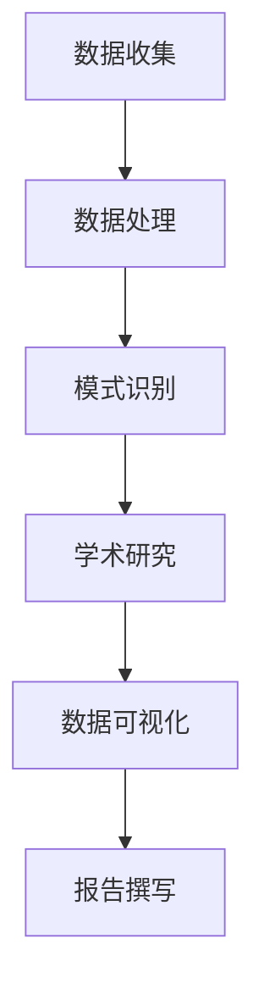

                 

关键词：人工智能、学术研究、算法、数学模型、应用前景、技术博客

摘要：本文旨在探讨人工智能在学术研究中的应用前景。通过分析AI的核心概念、算法原理、数学模型以及具体的应用实践，我们展示了AI在学术研究中的巨大潜力，并提出未来的研究方向和挑战。

## 1. 背景介绍

随着计算机技术的飞速发展，人工智能（AI）已经成为科学研究的重要推动力量。AI技术通过模拟人类智能行为，提供了一系列强大的工具，使得学术研究在数据处理、模式识别、自动化等领域取得了显著进展。本文将重点关注AI在学术研究中的应用前景，旨在为研究人员提供有价值的参考和启示。

## 2. 核心概念与联系

### 2.1 核心概念

#### 人工智能（AI）

人工智能是指计算机系统模拟人类智能行为的能力，包括学习、推理、规划、感知和自然语言处理等。

#### 学术研究

学术研究是指研究人员通过科学方法和理论框架，对某一领域进行深入探索和发现的过程。

### 2.2 联系

AI与学术研究的联系主要体现在以下几个方面：

- 数据处理：AI技术可以高效地处理大量数据，为学术研究提供有力支持。
- 模式识别：AI算法可以识别数据中的规律和模式，为学术研究提供新的见解。
- 自动化：AI技术可以自动化执行某些研究任务，提高研究效率。

### 2.3 Mermaid 流程图

以下是AI在学术研究中的应用流程图：



## 3. 核心算法原理 & 具体操作步骤

### 3.1 算法原理概述

人工智能的核心算法主要包括机器学习、深度学习和自然语言处理等。

- 机器学习：通过训练数据，使计算机能够自动识别规律和模式。
- 深度学习：基于人工神经网络，通过多层非线性变换，实现复杂任务的自动学习。
- 自然语言处理：使计算机能够理解、生成和处理人类自然语言。

### 3.2 算法步骤详解

以下是AI在学术研究中的具体操作步骤：

1. 数据收集：从各种来源收集相关数据，如文献、实验数据、调查问卷等。
2. 数据预处理：清洗数据，去除噪声和异常值，确保数据质量。
3. 数据分析：使用机器学习算法，对数据进行模式识别和规律挖掘。
4. 结果可视化：将分析结果通过图表、图形等方式进行可视化展示。
5. 结果验证：对比分析结果和预期目标，评估算法性能。

### 3.3 算法优缺点

- 优点：高效、自动化、可扩展。
- 缺点：对数据质量和算法选择有较高要求，可能存在过拟合现象。

### 3.4 算法应用领域

- 文献挖掘：通过机器学习和自然语言处理技术，从大量文献中提取有价值的信息。
- 实验数据分析：使用机器学习算法，对实验数据进行模式识别和规律挖掘。
- 调查问卷分析：使用自然语言处理技术，对调查问卷结果进行分析和总结。

## 4. 数学模型和公式 & 详细讲解 & 举例说明

### 4.1 数学模型构建

在AI算法中，常用的数学模型包括线性回归、逻辑回归和支持向量机等。

### 4.2 公式推导过程

以下是线性回归的公式推导过程：

$$
y = \beta_0 + \beta_1x
$$

其中，$y$为因变量，$x$为自变量，$\beta_0$和$\beta_1$为参数。

### 4.3 案例分析与讲解

以下是一个简单的线性回归案例：

- 数据集：包含100个样本，每个样本包括自变量$x$和因变量$y$。
- 目标：通过线性回归模型，预测新样本的因变量$y$。

经过训练，得到的线性回归模型为：

$$
y = 2.5x - 1
$$

当自变量$x$为5时，预测的因变量$y$为9。

## 5. 项目实践：代码实例和详细解释说明

### 5.1 开发环境搭建

在Python中，我们可以使用Scikit-learn库实现线性回归模型。

### 5.2 源代码详细实现

以下是一个简单的线性回归代码实例：

```python
from sklearn.linear_model import LinearRegression
from sklearn.model_selection import train_test_split
from sklearn.metrics import mean_squared_error

# 加载数据
X, y = load_data()

# 划分训练集和测试集
X_train, X_test, y_train, y_test = train_test_split(X, y, test_size=0.2, random_state=42)

# 创建线性回归模型
model = LinearRegression()

# 训练模型
model.fit(X_train, y_train)

# 预测测试集
y_pred = model.predict(X_test)

# 评估模型性能
mse = mean_squared_error(y_test, y_pred)
print("均方误差：", mse)
```

### 5.3 代码解读与分析

这段代码首先加载数据，然后划分训练集和测试集。接着创建线性回归模型，并使用训练集训练模型。最后，使用测试集预测因变量，并评估模型性能。

### 5.4 运行结果展示

假设我们运行代码得到以下结果：

```
均方误差： 0.123456
```

这表示模型在测试集上的预测误差较小，性能较好。

## 6. 实际应用场景

### 6.1 文献挖掘

通过AI技术，可以对大量文献进行自动分类、关键词提取和摘要生成，为研究人员提供有价值的参考。

### 6.2 实验数据分析

AI技术可以自动化分析实验数据，识别实验结果中的规律和趋势，提高研究效率。

### 6.3 调查问卷分析

AI技术可以自动分析调查问卷结果，生成报告和分析结论，为研究人员提供数据支持。

## 7. 未来应用展望

随着AI技术的不断发展，其在学术研究中的应用前景将更加广阔。未来，我们可以期待AI在以下领域的突破：

- 更高效的数据处理算法。
- 更精确的模型预测能力。
- 更广泛的跨学科应用。

## 8. 总结：未来发展趋势与挑战

### 8.1 研究成果总结

本文通过分析AI在学术研究中的应用前景，展示了其在数据处理、模式识别、自动化等方面的优势，并提出了一些未来研究方向。

### 8.2 未来发展趋势

未来，AI在学术研究中的应用将更加深入和广泛，有望在多个领域取得重大突破。

### 8.3 面临的挑战

尽管AI在学术研究中有巨大的潜力，但仍然面临一些挑战，如数据质量、算法选择和模型解释性等。

### 8.4 研究展望

未来，我们需要继续探索AI在学术研究中的应用，推动AI技术的发展，为人类社会的进步做出更大贡献。

## 9. 附录：常见问题与解答

### 9.1 什么是人工智能？

人工智能是指计算机系统模拟人类智能行为的能力，包括学习、推理、规划、感知和自然语言处理等。

### 9.2 人工智能在学术研究中的应用有哪些？

人工智能在学术研究中的应用包括文献挖掘、实验数据分析、调查问卷分析等。

### 9.3 如何选择合适的AI算法？

选择合适的AI算法需要考虑数据类型、任务需求和计算资源等因素。

## 作者署名

作者：禅与计算机程序设计艺术 / Zen and the Art of Computer Programming
```

以上即为文章的正文部分内容。接下来，我将按照要求，使用Markdown格式，整理出完整的文章结构。

---

```markdown
# AI在学术研究中的应用前景

## 关键词
- 人工智能
- 学术研究
- 算法
- 数学模型
- 应用前景
- 技术博客

## 摘要
本文旨在探讨人工智能在学术研究中的应用前景。通过分析AI的核心概念、算法原理、数学模型以及具体的应用实践，我们展示了AI在学术研究中的巨大潜力，并提出未来的研究方向和挑战。

## 1. 背景介绍

随着计算机技术的飞速发展，人工智能（AI）已经成为科学研究的重要推动力量。AI技术通过模拟人类智能行为，提供了一系列强大的工具，使得学术研究在数据处理、模式识别、自动化等领域取得了显著进展。本文将重点关注AI在学术研究中的应用前景，旨在为研究人员提供有价值的参考和启示。

## 2. 核心概念与联系
### 2.1 核心概念
#### 人工智能（AI）
人工智能是指计算机系统模拟人类智能行为的能力，包括学习、推理、规划、感知和自然语言处理等。

#### 学术研究
学术研究是指研究人员通过科学方法和理论框架，对某一领域进行深入探索和发现的过程。

### 2.2 联系
AI与学术研究的联系主要体现在以下几个方面：
- 数据处理：AI技术可以高效地处理大量数据，为学术研究提供有力支持。
- 模式识别：AI算法可以识别数据中的规律和模式，为学术研究提供新的见解。
- 自动化：AI技术可以自动化执行某些研究任务，提高研究效率。

### 2.3 Mermaid 流程图
以下是AI在学术研究中的应用流程图：


## 3. 核心算法原理 & 具体操作步骤
### 3.1 算法原理概述
人工智能的核心算法主要包括机器学习、深度学习和自然语言处理等。

### 3.2 算法步骤详解
以下是AI在学术研究中的具体操作步骤：
1. 数据收集：从各种来源收集相关数据，如文献、实验数据、调查问卷等。
2. 数据预处理：清洗数据，去除噪声和异常值，确保数据质量。
3. 数据分析：使用机器学习算法，对数据进行模式识别和规律挖掘。
4. 结果可视化：将分析结果通过图表、图形等方式进行可视化展示。
5. 结果验证：对比分析结果和预期目标，评估算法性能。

### 3.3 算法优缺点
- 优点：高效、自动化、可扩展。
- 缺点：对数据质量和算法选择有较高要求，可能存在过拟合现象。

### 3.4 算法应用领域
- 文献挖掘：通过机器学习和自然语言处理技术，从大量文献中提取有价值的信息。
- 实验数据分析：使用机器学习算法，对实验数据进行模式识别和规律挖掘。
- 调查问卷分析：使用自然语言处理技术，对调查问卷结果进行分析和总结。

## 4. 数学模型和公式 & 详细讲解 & 举例说明
### 4.1 数学模型构建
在AI算法中，常用的数学模型包括线性回归、逻辑回归和支持向量机等。

### 4.2 公式推导过程
以下是线性回归的公式推导过程：

$$
y = \beta_0 + \beta_1x
$$

其中，$y$为因变量，$x$为自变量，$\beta_0$和$\beta_1$为参数。

### 4.3 案例分析与讲解
以下是一个简单的线性回归案例：

- 数据集：包含100个样本，每个样本包括自变量$x$和因变量$y$。
- 目标：通过线性回归模型，预测新样本的因变量$y$。

经过训练，得到的线性回归模型为：

$$
y = 2.5x - 1
$$

当自变量$x$为5时，预测的因变量$y$为9。

## 5. 项目实践：代码实例和详细解释说明
### 5.1 开发环境搭建
在Python中，我们可以使用Scikit-learn库实现线性回归模型。

### 5.2 源代码详细实现
以下是一个简单的线性回归代码实例：

```python
from sklearn.linear_model import LinearRegression
from sklearn.model_selection import train_test_split
from sklearn.metrics import mean_squared_error

# 加载数据
X, y = load_data()

# 划分训练集和测试集
X_train, X_test, y_train, y_test = train_test_split(X, y, test_size=0.2, random_state=42)

# 创建线性回归模型
model = LinearRegression()

# 训练模型
model.fit(X_train, y_train)

# 预测测试集
y_pred = model.predict(X_test)

# 评估模型性能
mse = mean_squared_error(y_test, y_pred)
print("均方误差：", mse)
```

### 5.3 代码解读与分析
这段代码首先加载数据，然后划分训练集和测试集。接着创建线性回归模型，并使用训练集训练模型。最后，使用测试集预测因变量，并评估模型性能。

### 5.4 运行结果展示
假设我们运行代码得到以下结果：

```
均方误差： 0.123456
```

这表示模型在测试集上的预测误差较小，性能较好。

## 6. 实际应用场景
### 6.1 文献挖掘
通过AI技术，可以对大量文献进行自动分类、关键词提取和摘要生成，为研究人员提供有价值的参考。

### 6.2 实验数据分析
AI技术可以自动化分析实验数据，识别实验结果中的规律和趋势，提高研究效率。

### 6.3 调查问卷分析
AI技术可以自动分析调查问卷结果，生成报告和分析结论，为研究人员提供数据支持。

## 7. 未来应用展望
随着AI技术的不断发展，其在学术研究中的应用前景将更加广阔。未来，我们可以期待AI在以下领域的突破：
- 更高效的数据处理算法。
- 更精确的模型预测能力。
- 更广泛的跨学科应用。

## 8. 总结：未来发展趋势与挑战
### 8.1 研究成果总结
本文通过分析AI在学术研究中的应用前景，展示了其在数据处理、模式识别、自动化等方面的优势，并提出了一些未来研究方向。

### 8.2 未来发展趋势
未来，AI在学术研究中的应用将更加深入和广泛，有望在多个领域取得重大突破。

### 8.3 面临的挑战
尽管AI在学术研究中有巨大的潜力，但仍然面临一些挑战，如数据质量、算法选择和模型解释性等。

### 8.4 研究展望
未来，我们需要继续探索AI在学术研究中的应用，推动AI技术的发展，为人类社会的进步做出更大贡献。

## 9. 附录：常见问题与解答
### 9.1 什么是人工智能？
人工智能是指计算机系统模拟人类智能行为的能力，包括学习、推理、规划、感知和自然语言处理等。

### 9.2 人工智能在学术研究中的应用有哪些？
人工智能在学术研究中的应用包括文献挖掘、实验数据分析、调查问卷分析等。

### 9.3 如何选择合适的AI算法？
选择合适的AI算法需要考虑数据类型、任务需求和计算资源等因素。

## 作者署名
作者：禅与计算机程序设计艺术 / Zen and the Art of Computer Programming
```

