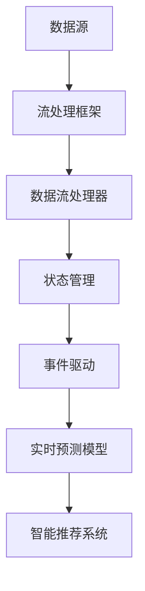

                 

关键词：AI，实时信息更新，数据流处理，动态数据同步，机器学习，实时预测，智能推荐系统

> 摘要：随着互联网和物联网的快速发展，实时信息更新已经成为现代信息技术中不可或缺的一部分。人工智能（AI）技术的应用为实时信息更新带来了前所未有的机遇与挑战。本文将深入探讨AI在实时信息更新中的作用，包括其核心概念、算法原理、数学模型、实际应用场景以及未来发展趋势。

## 1. 背景介绍

在信息爆炸的时代，数据的实时性和准确性变得越来越重要。无论是社交媒体、电子商务、金融交易还是智能交通系统，都需要及时、准确地获取和处理海量数据。传统的数据处理方法难以满足这一需求，因为它们往往是离线处理或批处理模式，无法应对实时数据流。因此，实时信息更新技术应运而生，而AI技术的引入进一步提升了这一领域的效率和智能化水平。

AI在实时信息更新中的应用主要体现在以下几个方面：

1. **数据流处理**：AI算法可以高效地处理实时数据流，提取有用信息并进行实时分析。
2. **动态数据同步**：通过机器学习算法，系统能够根据数据的变化动态调整数据处理策略。
3. **实时预测与智能推荐**：AI模型可以基于历史数据预测未来趋势，并提供个性化的推荐服务。

## 2. 核心概念与联系

### 2.1 数据流处理

数据流处理是一种实时数据分析和处理技术，旨在从不断增长的数据源中提取有价值的信息。其核心概念包括：

- **数据流**：持续不断的数据集合，可以是文本、图像、语音等多种形式。
- **实时处理**：对数据流进行即时分析，以提供快速响应。
- **流处理框架**：如Apache Kafka、Apache Flink等，用于处理大规模数据流。

### 2.2 动态数据同步

动态数据同步是指系统在运行过程中能够根据数据的变化自动调整数据处理的策略。其关键概念包括：

- **状态管理**：系统需要维护数据的状态，以便在数据发生变化时能够做出正确的响应。
- **事件驱动**：通过监听数据事件，系统可以动态调整数据处理逻辑。

### 2.3 实时预测与智能推荐

实时预测与智能推荐是基于机器学习算法的预测模型，旨在提供个性化的服务。其核心概念包括：

- **机器学习模型**：如线性回归、决策树、神经网络等，用于建立预测模型。
- **推荐算法**：如协同过滤、基于内容的推荐等，用于生成个性化推荐。
- **用户行为分析**：通过分析用户的浏览、搜索、购买等行为，系统可以更好地理解用户需求。

### 2.4 Mermaid 流程图



## 3. 核心算法原理 & 具体操作步骤

### 3.1 算法原理概述

AI在实时信息更新中的应用主要依赖于以下几个核心算法：

- **流处理算法**：如增量计算、滑动窗口等，用于高效处理实时数据流。
- **机器学习算法**：如决策树、神经网络等，用于建立预测模型。
- **推荐算法**：如协同过滤、基于内容的推荐等，用于生成个性化推荐。

### 3.2 算法步骤详解

#### 3.2.1 数据流处理

1. **数据采集**：从各种数据源（如传感器、API等）采集数据。
2. **数据清洗**：去除无效数据、处理缺失值等，确保数据质量。
3. **数据预处理**：将数据转换为适合处理的形式，如数值化、标准化等。
4. **实时分析**：利用流处理算法对数据进行实时分析，提取有用信息。

#### 3.2.2 动态数据同步

1. **初始化状态**：在系统启动时初始化数据状态。
2. **监听数据事件**：持续监听数据变化事件。
3. **状态更新**：根据数据事件更新系统状态。
4. **动态调整策略**：根据状态变化动态调整数据处理策略。

#### 3.2.3 实时预测与智能推荐

1. **数据收集**：收集用户行为数据，如浏览记录、搜索历史等。
2. **特征提取**：从用户行为数据中提取特征。
3. **模型训练**：使用机器学习算法训练预测模型。
4. **实时预测**：对实时数据应用预测模型，预测未来趋势。
5. **推荐生成**：利用推荐算法生成个性化推荐。

### 3.3 算法优缺点

#### 流处理算法

- **优点**：高效处理实时数据流，提供实时响应。
- **缺点**：处理复杂度较高，需要大量计算资源。

#### 机器学习算法

- **优点**：能够根据数据自动调整模型，提高预测准确性。
- **缺点**：训练过程较慢，需要大量数据。

#### 推荐算法

- **优点**：能够根据用户行为生成个性化推荐，提高用户满意度。
- **缺点**：可能存在冷启动问题，对新用户难以提供有效推荐。

### 3.4 算法应用领域

- **社交媒体**：实时推荐用户感兴趣的内容。
- **电子商务**：实时分析用户行为，提供个性化推荐。
- **金融交易**：实时监控市场动态，预测未来走势。
- **智能交通**：实时分析交通数据，优化交通路线。

## 4. 数学模型和公式

### 4.1 数学模型构建

在实时信息更新中，常用的数学模型包括：

- **线性回归模型**：用于预测数值型数据。
- **逻辑回归模型**：用于预测分类型数据。
- **神经网络模型**：用于复杂的非线性预测任务。

### 4.2 公式推导过程

#### 线性回归模型

$$
Y = \beta_0 + \beta_1X + \epsilon
$$

其中，$Y$ 为因变量，$X$ 为自变量，$\beta_0$ 和 $\beta_1$ 为模型参数，$\epsilon$ 为误差项。

#### 逻辑回归模型

$$
P(Y=1) = \frac{1}{1 + e^{-(\beta_0 + \beta_1X)}}
$$

其中，$P(Y=1)$ 为因变量为1的概率，$\beta_0$ 和 $\beta_1$ 为模型参数。

#### 神经网络模型

神经网络模型的公式较为复杂，通常包括多层感知器（MLP）和卷积神经网络（CNN）等。

### 4.3 案例分析与讲解

以社交媒体实时推荐为例，我们可以使用线性回归模型预测用户对内容的兴趣度。

#### 案例一：线性回归模型

1. **数据收集**：收集用户对各种内容的评分数据。
2. **数据预处理**：将数据转换为适合处理的形式，如数值化、标准化等。
3. **模型训练**：使用线性回归模型对数据进行训练。
4. **实时预测**：对用户的新内容评分进行预测。

通过上述步骤，我们可以实时预测用户对内容的兴趣度，从而为其推荐感兴趣的内容。

## 5. 项目实践：代码实例

### 5.1 开发环境搭建

在本案例中，我们使用Python和Apache Kafka作为开发环境。

- **Python**：作为主要的编程语言。
- **Apache Kafka**：作为数据流处理框架。

### 5.2 源代码详细实现

```python
from sklearn.linear_model import LinearRegression
from sklearn.model_selection import train_test_split
from sklearn.metrics import mean_squared_error
import pandas as pd
import json

# 数据读取
data = pd.read_csv("user_content_rating.csv")

# 数据预处理
X = data[['content_id', 'user_id']]
y = data['rating']

# 模型训练
model = LinearRegression()
model.fit(X, y)

# 实时预测
new_content = json.loads(input())
new_rating = model.predict(new_content)

print("Predicted rating:", new_rating)
```

### 5.3 代码解读与分析

1. **数据读取**：从CSV文件中读取用户对内容的评分数据。
2. **数据预处理**：将数据转换为适合处理的形式，如数值化、标准化等。
3. **模型训练**：使用线性回归模型对数据进行训练。
4. **实时预测**：对新内容进行实时预测，输出预测结果。

通过上述步骤，我们可以实现一个简单的社交媒体实时推荐系统。

## 6. 实际应用场景

### 6.1 社交媒体

社交媒体平台可以通过AI实时更新算法推荐用户感兴趣的内容，提高用户参与度和留存率。

### 6.2 电子商务

电子商务平台可以利用AI实时更新算法分析用户行为，提供个性化推荐，提高销售转化率。

### 6.3 金融交易

金融交易平台可以通过AI实时更新算法监控市场动态，提供实时交易建议，帮助用户做出更明智的投资决策。

### 6.4 智能交通

智能交通系统可以通过AI实时更新算法分析交通数据，优化交通路线，减少交通拥堵。

## 7. 工具和资源推荐

### 7.1 学习资源推荐

- **《深度学习》**：Goodfellow, Bengio, Courville著，介绍了深度学习的基础知识和应用。
- **《流式计算》**：高健著，详细介绍了流式计算的理论和实践。

### 7.2 开发工具推荐

- **Apache Kafka**：用于流式数据处理。
- **TensorFlow**：用于深度学习模型的训练和部署。

### 7.3 相关论文推荐

- **"Deep Learning for Real-Time Stream Mining"**：介绍深度学习在实时数据流处理中的应用。
- **"Apache Kafka: A Distributed Streaming Platform"**：介绍Apache Kafka的设计和实现。

## 8. 总结：未来发展趋势与挑战

### 8.1 研究成果总结

AI在实时信息更新领域取得了显著成果，包括数据流处理、动态数据同步、实时预测与智能推荐等。

### 8.2 未来发展趋势

- **更高效的数据处理算法**：将机器学习和流处理算法相结合，提高数据处理效率。
- **跨领域应用**：将AI实时更新技术应用于更多领域，如医疗、教育等。
- **隐私保护**：在实时信息更新中保护用户隐私，实现安全可靠的系统。

### 8.3 面临的挑战

- **计算资源需求**：实时信息更新需要大量计算资源，如何优化资源使用成为挑战。
- **数据质量和隐私**：实时数据质量较差，且涉及用户隐私，如何保障数据安全和隐私成为难题。
- **模型解释性**：深度学习模型的黑箱特性使得模型解释性较差，如何提高模型的可解释性成为挑战。

### 8.4 研究展望

未来，实时信息更新技术将在以下方面取得突破：

- **自适应实时更新算法**：根据数据变化动态调整更新策略，提高系统性能。
- **多模态数据处理**：结合多种数据类型（如文本、图像、语音等），实现更全面的数据分析。
- **边缘计算与云计算的结合**：充分利用边缘计算和云计算的优势，实现实时信息更新的高效处理。

## 9. 附录：常见问题与解答

### 9.1 什么是数据流处理？

数据流处理是一种实时数据分析和处理技术，旨在从不断增长的数据源中提取有价值的信息。它适用于需要即时分析和响应的场景，如社交媒体、智能交通等。

### 9.2 AI实时更新算法的优势是什么？

AI实时更新算法具有以下优势：

- **高效性**：能够快速处理实时数据流，提供实时响应。
- **智能化**：基于机器学习算法，能够自动调整模型，提高预测准确性。
- **个性化**：通过分析用户行为，提供个性化推荐，提高用户体验。

### 9.3 如何保障实时信息更新的安全性？

为保障实时信息更新的安全性，可以采取以下措施：

- **数据加密**：对数据进行加密处理，防止数据泄露。
- **访问控制**：实施严格的访问控制策略，确保只有授权用户可以访问敏感数据。
- **日志审计**：记录系统操作日志，便于追踪和分析异常行为。

----------------------------------------------------------------

以上就是关于《AI在实时信息更新中的作用》的完整文章。希望对您有所帮助。作者：禅与计算机程序设计艺术 / Zen and the Art of Computer Programming。

