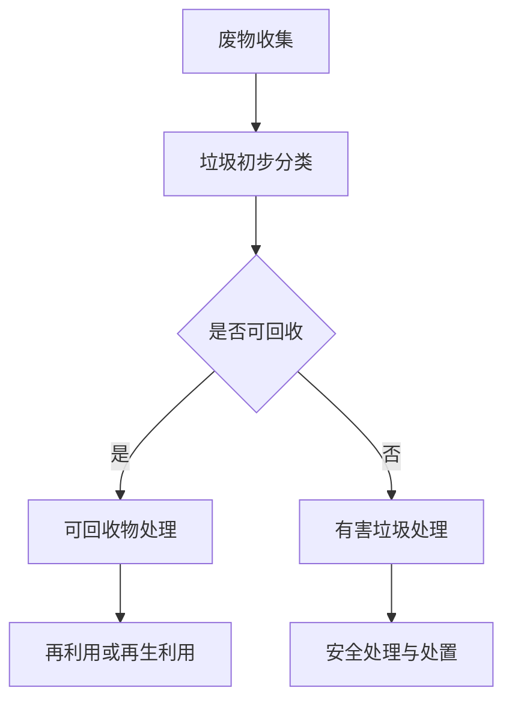

                 

关键词：人工智能，废物管理，回收效率，深度学习，垃圾分类

摘要：随着全球环境污染问题日益严重，废物管理成为了一个重要的议题。本文将探讨人工智能在废物管理中的应用，特别是在提高回收效率方面。通过介绍相关核心概念、算法原理、数学模型、项目实践以及实际应用场景，本文旨在为读者提供一个全面的理解和展望。

## 1. 背景介绍

### 废物管理的现状

全球每年产生的废物量持续增长，尤其是城市生活垃圾。传统的废物管理方法已经无法满足日益增长的废物处理需求。垃圾填埋场和焚烧厂的过度使用不仅浪费了资源，还对环境造成了严重污染。因此，提高废物回收效率成为了废物管理的重要目标。

### 人工智能的崛起

人工智能（AI）技术在过去几十年里取得了飞速发展，已经逐渐渗透到各个行业。深度学习、计算机视觉、自然语言处理等AI技术为废物管理带来了新的解决方案，特别是在垃圾分类和回收方面展现了巨大的潜力。

## 2. 核心概念与联系

### 人工智能在废物管理中的核心概念

- **深度学习**：一种机器学习技术，通过构建深度神经网络模型，自动学习数据中的特征和模式，实现对复杂问题的解决。
- **计算机视觉**：利用计算机技术处理和分析图像信息，实现对物体、场景的识别和分类。
- **自然语言处理**：使计算机能够理解和处理人类语言的技术，用于垃圾标签分类等任务。

### Mermaid 流程图



## 3. 核心算法原理 & 具体操作步骤

### 3.1 算法原理概述

本文主要介绍基于深度学习的垃圾分类算法。该算法通过训练大量垃圾图像数据，使神经网络自动学习垃圾的特征，从而实现对垃圾的准确分类。

### 3.2 算法步骤详解

1. **数据采集与预处理**：收集各种垃圾的图像数据，并进行预处理，如图像裁剪、大小调整、灰度化等。
2. **模型选择与训练**：选择一个合适的深度学习模型（如卷积神经网络），对其进行训练，使其能够自动识别和分类垃圾。
3. **模型评估与优化**：对训练好的模型进行评估，如准确率、召回率等指标，并进行优化以提高分类效果。
4. **部署与应用**：将训练好的模型部署到实际环境中，如垃圾回收车上的传感器，实现对垃圾的实时分类和回收。

### 3.3 算法优缺点

**优点**：
- **高效性**：深度学习算法能够自动学习垃圾特征，提高了分类效率。
- **准确性**：通过对大量数据的训练，模型可以达到较高的准确率。
- **通用性**：适用于各种类型的垃圾，如纸张、塑料、金属等。

**缺点**：
- **计算资源需求**：深度学习算法需要大量的计算资源和时间进行训练。
- **数据依赖性**：算法的性能高度依赖训练数据的质量和数量。

### 3.4 算法应用领域

- **垃圾分类**：实现对各种垃圾的准确分类，提高回收效率。
- **废物识别**：辅助废物回收工人识别和处理难以分类的垃圾。
- **环境保护**：降低有害垃圾对环境的污染，提高资源利用率。

## 4. 数学模型和公式 & 详细讲解 & 举例说明

### 4.1 数学模型构建

垃圾分类算法通常采用卷积神经网络（CNN）作为基础模型。CNN 的核心思想是通过多层卷积和池化操作，提取图像的特征，然后通过全连接层进行分类。

### 4.2 公式推导过程

卷积神经网络的损失函数通常采用交叉熵损失函数。交叉熵损失函数可以衡量预测结果与真实结果之间的差异，其公式如下：

$$
L(y, \hat{y}) = -\sum_{i=1}^{n} y_i \log(\hat{y}_i)
$$

其中，$y$ 表示真实标签，$\hat{y}$ 表示预测概率。

### 4.3 案例分析与讲解

假设有一个垃圾图像数据集，其中包含纸张、塑料、金属三种类型的垃圾。训练一个基于 CNN 的垃圾分类模型，并评估其性能。

1. **数据采集与预处理**：采集包含纸张、塑料、金属的垃圾图像，并进行预处理。
2. **模型训练**：使用预处理后的数据训练一个 CNN 模型，并调整模型参数，如学习率、批次大小等。
3. **模型评估**：使用测试集评估模型的性能，如准确率、召回率等。
4. **结果分析**：根据评估结果，对模型进行优化，如调整网络结构、增加训练数据等。

## 5. 项目实践：代码实例和详细解释说明

### 5.1 开发环境搭建

在 Python 中，使用 TensorFlow 和 Keras 库来实现垃圾分类算法。

```python
pip install tensorflow
pip install keras
```

### 5.2 源代码详细实现

```python
import keras
from keras.models import Sequential
from keras.layers import Conv2D, MaxPooling2D, Flatten, Dense

# 构建卷积神经网络模型
model = Sequential()
model.add(Conv2D(32, (3, 3), activation='relu', input_shape=(64, 64, 3)))
model.add(MaxPooling2D(pool_size=(2, 2)))
model.add(Conv2D(64, (3, 3), activation='relu'))
model.add(MaxPooling2D(pool_size=(2, 2)))
model.add(Flatten())
model.add(Dense(128, activation='relu'))
model.add(Dense(3, activation='softmax'))

# 编译模型
model.compile(optimizer='adam', loss='categorical_crossentropy', metrics=['accuracy'])

# 训练模型
model.fit(x_train, y_train, epochs=10, batch_size=32, validation_data=(x_test, y_test))
```

### 5.3 代码解读与分析

- **模型构建**：使用 `Sequential` 模型堆叠多个卷积层、池化层、全连接层。
- **编译模型**：指定优化器、损失函数和评估指标。
- **训练模型**：使用训练数据和测试数据训练模型。

### 5.4 运行结果展示

训练完成后，使用测试数据评估模型的性能：

```python
score = model.evaluate(x_test, y_test, verbose=0)
print('Test loss:', score[0])
print('Test accuracy:', score[1])
```

## 6. 实际应用场景

### 6.1 垃圾分类机器人

垃圾分类机器人利用 AI 技术对垃圾进行实时分类，提高垃圾回收效率。它们通常配备有摄像头、传感器和执行器，能够在各种环境中自主行动，识别和分类垃圾。

### 6.2 智慧城市废物管理系统

智慧城市废物管理系统通过 AI 技术实现垃圾的智能分类、回收和再利用。系统可以实时监测垃圾生成量、回收量和处理进度，为城市管理者提供决策支持。

## 7. 工具和资源推荐

### 7.1 学习资源推荐

- 《深度学习》（Goodfellow, Bengio, Courville 著）
- 《机器学习》（周志华 著）
- Coursera 上的相关课程

### 7.2 开发工具推荐

- TensorFlow
- Keras
- OpenCV

### 7.3 相关论文推荐

- "Deep Learning for Waste Recognition and Sorting"（2018）
- "AI for Waste Management: A Review"（2019）

## 8. 总结：未来发展趋势与挑战

### 8.1 研究成果总结

AI 技术在废物管理领域取得了显著成果，提高了垃圾回收效率，减少了环境污染。深度学习、计算机视觉和自然语言处理等技术在垃圾分类、废物识别等方面展现了巨大潜力。

### 8.2 未来发展趋势

- **技术进步**：随着 AI 技术的不断发展，垃圾回收效率将进一步提高。
- **跨学科合作**：废物管理领域需要跨学科的合作，结合环境科学、材料科学等领域的知识，解决实际问题。
- **智能化应用**：智能废物管理系统将在智慧城市中发挥重要作用。

### 8.3 面临的挑战

- **数据不足**：垃圾图像数据质量和数量有限，需要大量标注和收集。
- **计算资源**：深度学习算法需要大量的计算资源和时间进行训练。

### 8.4 研究展望

未来，AI 在废物管理领域的研究将继续深入，通过技术创新和跨学科合作，有望实现更加高效、智能的废物管理。

## 9. 附录：常见问题与解答

### 9.1 什么是深度学习？

深度学习是一种机器学习技术，通过构建深度神经网络模型，自动学习数据中的特征和模式，实现对复杂问题的解决。

### 9.2 如何提高垃圾回收效率？

通过引入 AI 技术，如深度学习和计算机视觉，实现对垃圾的智能分类和识别，从而提高垃圾回收效率。

## 结语

作者：禅与计算机程序设计艺术 / Zen and the Art of Computer Programming

本文介绍了 AI 在废物管理中的应用，特别是在提高回收效率方面。通过核心概念、算法原理、数学模型、项目实践和实际应用场景的详细讲解，本文为读者提供了一个全面的理解和展望。未来，AI 技术将继续在废物管理领域发挥重要作用，为实现可持续发展做出贡献。

