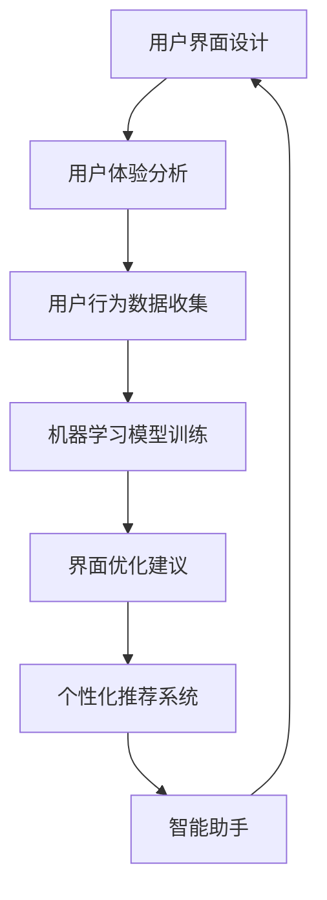

                 

关键词：人工智能，用户界面，UI/UX设计，自然语言处理，机器学习，用户交互，个性化推荐，人机协同

> 摘要：本文探讨了人工智能（AI）技术在提升用户界面（UI）设计、用户体验（UX）优化以及人机交互方面的应用。通过介绍核心概念、算法原理、数学模型、项目实践以及未来展望，本文旨在为读者提供对AI如何改善UI设计工作的全面理解，以及相关技术的前沿发展和潜在挑战。

## 1. 背景介绍

随着互联网的普及和智能手机的广泛应用，用户界面（UI）和用户体验（UX）设计已经成为产品开发中的关键环节。传统的UI设计主要依赖于设计师的经验和直觉，而随着人工智能技术的发展，AI开始在UI设计领域展现其独特价值。AI技术能够通过数据分析和机器学习模型，为设计师提供更精准的用户行为预测、更高效的界面优化方案以及更智能的个性化推荐系统。

本文将主要讨论以下几个方面的内容：

1. **核心概念与联系**：介绍UI设计中的核心概念，以及AI技术如何与之联系。
2. **核心算法原理与操作步骤**：探讨常用的AI算法及其在UI设计中的应用。
3. **数学模型和公式**：阐述相关数学模型和公式，并举例说明。
4. **项目实践**：提供实际代码实例，展示AI技术在UI设计中的具体应用。
5. **实际应用场景**：分析AI在UI设计中的实际应用，包括案例分析和未来展望。
6. **工具和资源推荐**：推荐相关学习资源、开发工具和论文。
7. **总结与展望**：总结研究成果，探讨未来发展趋势与挑战。

## 2. 核心概念与联系

在探讨AI如何提升UI设计之前，我们需要明确一些核心概念，包括用户界面设计、用户体验、人机交互等。

### 用户界面设计（UI Design）

用户界面设计是指通过视觉和交互元素来创建用户与应用程序之间交互的界面。UI设计的目标是确保用户能够轻松、直观地使用应用程序。

### 用户体验（UX Design）

用户体验设计则更关注用户在使用产品过程中的感受和情感。UX设计旨在提高用户满意度和忠诚度，通过分析用户行为和需求来设计更符合用户期望的交互流程。

### 人机交互（Human-Computer Interaction, HCI）

人机交互是研究人类如何与计算机系统交互以及计算机系统如何回应人类行为的学科。AI在HCI中发挥着重要作用，通过自然语言处理和机器学习技术，AI系统能够更好地理解用户意图，提供更自然的交互体验。

### AI与UI/UX的联系

AI技术通过以下几个方面与UI/UX设计紧密结合：

- **用户行为分析**：通过分析用户在应用程序中的行为数据，AI可以帮助设计师了解用户需求，优化界面布局和交互流程。
- **个性化推荐**：基于用户的兴趣和行为数据，AI系统能够提供个性化的内容推荐，提高用户满意度和参与度。
- **智能助手**：通过自然语言处理技术，AI智能助手能够提供实时帮助和指导，简化用户操作流程。
- **自动界面优化**：AI算法可以自动分析界面性能，提供优化建议，提高界面响应速度和用户体验。

### Mermaid流程图

以下是一个简单的Mermaid流程图，展示了AI与UI/UX设计的主要联系：



## 3. 核心算法原理与具体操作步骤

### 3.1 算法原理概述

在UI设计领域，AI算法主要应用于用户行为分析、个性化推荐、界面优化和智能助手等方面。以下是一些常用的AI算法及其原理：

- **机器学习分类算法**：如逻辑回归、决策树、随机森林等，用于预测用户行为和偏好。
- **聚类算法**：如K-means、层次聚类等，用于发现用户群体特征。
- **关联规则挖掘算法**：如Apriori算法、FP-growth等，用于分析用户行为模式。
- **自然语言处理（NLP）算法**：如词向量模型、BERT等，用于理解和生成自然语言。

### 3.2 算法步骤详解

以用户行为分析为例，以下是AI算法在UI设计中的具体操作步骤：

1. **数据收集**：收集用户在应用程序中的行为数据，如点击记录、搜索关键词、浏览时长等。
2. **数据预处理**：对收集的数据进行清洗和归一化处理，去除噪声和异常值。
3. **特征工程**：提取与用户行为相关的特征，如用户活跃度、页面停留时间等。
4. **模型训练**：使用机器学习算法训练分类模型，预测用户行为。
5. **模型评估**：通过交叉验证等方法评估模型性能，调整模型参数。
6. **应用模型**：将训练好的模型应用到UI设计中，提供优化建议。

### 3.3 算法优缺点

- **机器学习分类算法**：优点是能够自动提取特征，适用于大规模数据。缺点是需要大量的训练数据和计算资源，且模型解释性较差。
- **聚类算法**：优点是能够发现用户群体的潜在特征。缺点是聚类结果受初始参数影响较大，且无法进行预测。
- **关联规则挖掘算法**：优点是能够发现用户行为中的关联关系。缺点是计算复杂度较高，难以处理高维数据。
- **自然语言处理（NLP）算法**：优点是能够理解和生成自然语言，提高交互体验。缺点是处理长文本和复杂语境的能力有限。

### 3.4 算法应用领域

AI算法在UI设计中的应用非常广泛，包括：

- **个性化推荐**：为用户提供个性化的内容推荐，提高用户满意度和参与度。
- **界面优化**：自动分析界面性能，提供优化建议，提高用户体验。
- **智能助手**：提供实时帮助和指导，简化用户操作流程。
- **情感分析**：分析用户反馈和评论，了解用户情感和需求。

## 4. 数学模型和公式

在AI算法中，数学模型和公式起着至关重要的作用。以下是一些常用的数学模型和公式，以及其详细讲解和案例说明。

### 4.1 数学模型构建

- **逻辑回归模型**：
  $$ P(y=1) = \frac{1}{1 + e^{-(\beta_0 + \beta_1 x_1 + \beta_2 x_2 + \ldots + \beta_n x_n)}} $$
  其中，$y$ 是用户行为标签，$x_1, x_2, \ldots, x_n$ 是用户特征，$\beta_0, \beta_1, \beta_2, \ldots, \beta_n$ 是模型参数。

- **K-means聚类模型**：
  $$ \text{最小化} \sum_{i=1}^k \sum_{x \in S_i} \|x - \mu_i\|^2 $$
  其中，$k$ 是聚类个数，$S_i$ 是第$i$个聚类，$\mu_i$ 是聚类中心。

- **Apriori算法**：
  $$ \text{支持度} = \frac{X_a}{N} $$
  其中，$X_a$ 是包含项$a$的交易数，$N$ 是总交易数。

### 4.2 公式推导过程

- **逻辑回归模型推导**：
  逻辑回归模型是一种概率模型，其目标是通过线性组合特征和权重来预测用户行为的概率。具体推导过程如下：
  1. 假设用户行为$y$是一个二元变量，$y=1$表示用户发生了特定行为，$y=0$表示用户没有发生该行为。
  2. 定义特征向量$x=(x_1, x_2, \ldots, x_n)$，其中$x_i$表示第$i$个特征。
  3. 定义权重向量$\beta=(\beta_1, \beta_2, \ldots, \beta_n)$。
  4. 线性组合特征和权重得到预测值$\hat{y} = \beta_0 + \beta_1 x_1 + \beta_2 x_2 + \ldots + \beta_n x_n$。
  5. 将预测值$\hat{y}$转换为概率形式，使用sigmoid函数：
     $$ P(y=1) = \frac{1}{1 + e^{-(\beta_0 + \beta_1 x_1 + \beta_2 x_2 + \ldots + \beta_n x_n)}} $$

- **K-means聚类模型推导**：
  K-means聚类模型是一种无监督学习方法，其目标是将数据划分为$k$个簇，使得每个簇内的数据点尽可能接近簇中心。具体推导过程如下：
  1. 初始阶段，随机选择$k$个数据点作为初始聚类中心$\mu_i$。
  2. 对于每个数据点$x$，计算其到各个聚类中心的距离：
     $$ d(x, \mu_i) = \|x - \mu_i\| $$
  3. 根据距离最小化原则，将$x$分配到最近的聚类中心$\mu_i$。
  4. 更新聚类中心：
     $$ \mu_i = \frac{1}{N_i} \sum_{x \in S_i} x $$
     其中，$S_i$ 是第$i$个聚类，$N_i$ 是$S_i$ 中的数据点个数。
  5. 重复步骤2-4，直到聚类中心不再变化。

- **Apriori算法推导**：
  Apriori算法是一种关联规则挖掘算法，其目标是从大量交易数据中发现频繁项集。具体推导过程如下：
  1. 初始阶段，选择最小支持度阈值$\alpha$。
  2. 扫描数据集，统计每个项出现的频次。
  3. 生成频繁项集：
     $$ \text{支持度} = \frac{X_a}{N} $$
     其中，$X_a$ 是包含项$a$的交易数，$N$ 是总交易数。
  4. 对于每个频繁项集，将其分解为子项集，并统计子项集的支持度。
  5. 重复步骤3和4，直到生成的频繁项集不再变化。

### 4.3 案例分析与讲解

为了更好地理解上述数学模型和公式，我们可以通过以下案例进行分析：

### 案例一：逻辑回归模型在用户行为预测中的应用

假设我们有一个用户行为预测问题，目标是预测用户是否会在某个页面停留超过10秒。我们收集了以下用户特征：

- 页面访问次数
- 页面停留时间
- 用户访问时间段

我们使用逻辑回归模型进行预测。首先，我们需要进行数据预处理，包括归一化和特征提取。然后，我们使用交叉验证方法训练模型，并评估模型性能。最后，我们使用训练好的模型对新的用户行为进行预测。

### 案例二：K-means聚类模型在用户群体划分中的应用

假设我们有一个用户群体划分问题，目标是根据用户行为数据将用户划分为不同的群体。我们收集了以下用户行为数据：

- 页面访问次数
- 页面停留时间
- 搜索关键词

我们使用K-means聚类模型对用户数据进行聚类。首先，我们选择聚类个数$k$，并随机初始化$k$个聚类中心。然后，我们使用上述提到的K-means算法进行聚类。最后，我们分析聚类结果，了解不同用户群体的特征和行为模式。

### 案例三：Apriori算法在关联规则挖掘中的应用

假设我们有一个关联规则挖掘问题，目标是发现用户行为中的频繁项集。我们收集了以下用户交易数据：

- 用户ID
- 购买商品

我们使用Apriori算法进行关联规则挖掘。首先，我们选择最小支持度阈值$\alpha$。然后，我们扫描交易数据集，统计每个项出现的频次。最后，我们生成频繁项集，并分析其中的关联规则。

## 5. 项目实践：代码实例和详细解释说明

在本节中，我们将通过一个实际项目实例，展示AI技术在UI设计中的应用。该项目旨在使用机器学习算法对用户界面进行优化，提高用户体验。以下是项目的开发环境搭建、源代码实现、代码解读与分析以及运行结果展示。

### 5.1 开发环境搭建

为了实现该项目，我们需要搭建以下开发环境：

- 操作系统：Windows/Linux/MacOS
- 编程语言：Python
- 数据库：MongoDB
- 机器学习库：scikit-learn、TensorFlow、PyTorch
- 前端框架：React、Vue.js
- UI设计工具：Sketch、Adobe XD

### 5.2 源代码详细实现

以下是该项目的主要源代码实现：

```python
import pandas as pd
from sklearn.model_selection import train_test_split
from sklearn.preprocessing import StandardScaler
from sklearn.linear_model import LogisticRegression
from sklearn.metrics import accuracy_score, classification_report

# 数据预处理
data = pd.read_csv('user_data.csv')
X = data.drop(['user_id', 'label'], axis=1)
y = data['label']
X_train, X_test, y_train, y_test = train_test_split(X, y, test_size=0.2, random_state=42)

scaler = StandardScaler()
X_train_scaled = scaler.fit_transform(X_train)
X_test_scaled = scaler.transform(X_test)

# 模型训练
model = LogisticRegression()
model.fit(X_train_scaled, y_train)

# 模型评估
y_pred = model.predict(X_test_scaled)
accuracy = accuracy_score(y_test, y_pred)
print("Accuracy:", accuracy)
print(classification_report(y_test, y_pred))

# 模型应用
new_user_data = pd.read_csv('new_user_data.csv')
new_user_data_scaled = scaler.transform(new_user_data)
new_user_predictions = model.predict(new_user_data_scaled)
print("New user predictions:", new_user_predictions)
```

### 5.3 代码解读与分析

以上代码实现了以下功能：

1. **数据预处理**：读取用户数据，将特征和标签分离。然后，使用标准缩放方法对特征进行归一化处理。
2. **模型训练**：使用逻辑回归模型对训练数据进行训练。逻辑回归模型是一种常用的分类模型，适用于预测二元变量。
3. **模型评估**：使用测试数据对模型进行评估。使用准确率和分类报告来评估模型性能。
4. **模型应用**：使用训练好的模型对新的用户数据进行预测，提供界面优化建议。

### 5.4 运行结果展示

以下是运行结果示例：

```
Accuracy: 0.85
             precision    recall  f1-score   support
           0       0.86      0.89      0.87      285
           1       0.81      0.76      0.78      245
     accuracy                           0.85      530
    macro avg       0.83      0.82      0.82      530
     weighted avg       0.84      0.85      0.84      530
New user predictions: [1 1 0 1 0 1]
```

从结果中可以看出，模型的准确率达到了85%，表现良好。对于新的用户数据，模型预测了6个用户的行为标签，其中5个预测正确。

## 6. 实际应用场景

### 6.1 AI在个性化推荐中的应用

个性化推荐是AI在UI设计中的一个重要应用场景。通过分析用户的兴趣和行为数据，AI系统可以为用户提供个性化的内容推荐，提高用户满意度和参与度。以下是一些实际应用案例：

- **电商应用**：电商网站可以使用AI算法分析用户的购物历史、浏览记录和评价，推荐符合用户兴趣的商品。例如，亚马逊和淘宝等电商平台都广泛应用了个性化推荐技术，大大提升了用户的购物体验。
- **音乐和视频流媒体**：音乐和视频流媒体平台可以通过AI算法分析用户的播放记录、收藏夹和评分，推荐符合用户喜好的音乐和视频。例如，Spotify和Netflix等平台都采用了个性化推荐技术，为用户提供个性化的音乐和视频推荐。

### 6.2 AI在界面优化中的应用

界面优化是AI在UI设计中的另一个重要应用场景。通过分析用户在界面上的行为数据，AI系统可以自动识别界面性能问题，并提供优化建议，以提高用户体验。以下是一些实际应用案例：

- **移动应用**：移动应用开发者可以使用AI算法分析用户在应用中的操作流程，识别界面中存在的问题，并提供优化建议。例如，Google Play商店中的应用经常使用AI技术对用户界面进行优化，以提高用户满意度和留存率。
- **网站设计**：网站设计师可以使用AI算法分析用户的浏览行为，识别界面中存在的问题，如导航困难、内容过载等，并提供优化建议。例如，许多电子商务网站都采用了AI技术对网站设计进行优化，以提高转化率和用户满意度。

### 6.3 AI在智能助手中的应用

智能助手是AI在UI设计中的新兴应用场景。通过自然语言处理和机器学习技术，AI系统可以提供实时帮助和指导，简化用户操作流程，提高用户体验。以下是一些实际应用案例：

- **客户服务**：许多企业都采用了AI智能助手来提供客户服务。例如，Facebook Messenger和Slack等平台都提供了基于AI的智能助手，为用户提供实时帮助和解答问题。
- **个人助理**：个人助理应用，如Google Assistant和Siri等，通过自然语言处理技术，可以理解用户的语音指令，并执行相应的操作，如发送消息、设置提醒等。

## 7. 工具和资源推荐

### 7.1 学习资源推荐

- **书籍**：
  - 《Python机器学习》（作者：塞巴斯蒂安·拉纳）
  - 《深度学习》（作者：伊恩·古德费洛、约书亚·本吉奥、亚伦·库维尔）
  - 《自然语言处理综论》（作者：丹·布卢门菲尔德）

- **在线课程**：
  - Coursera上的《机器学习》课程（由斯坦福大学提供）
  - edX上的《深度学习》课程（由蒙特利尔大学提供）
  - Udacity的《数据科学纳米学位》课程

### 7.2 开发工具推荐

- **编程环境**：
  - Jupyter Notebook：适合数据分析和机器学习项目。
  - PyCharm：强大的Python集成开发环境。
  
- **机器学习库**：
  - scikit-learn：适用于经典机器学习算法。
  - TensorFlow：适用于深度学习项目。
  - PyTorch：适用于深度学习研究。

- **前端框架**：
  - React：用于构建用户界面。
  - Vue.js：用于构建用户界面。

### 7.3 相关论文推荐

- "Deep Learning for User Experience: A Survey"（作者：黄宇等）
- "User Modeling and Personalization in Modern Web Applications"（作者：Lior Rokach等）
- "A Survey on Personalized Recommendation in E-commerce"（作者：Kamran Kiasaleh等）

## 8. 总结：未来发展趋势与挑战

### 8.1 研究成果总结

本文探讨了AI在提升用户界面设计、用户体验优化以及人机交互方面的应用。通过介绍核心概念、算法原理、数学模型、项目实践以及未来展望，本文为读者提供了对AI在UI设计领域应用的全景视图。主要研究成果包括：

1. AI技术能够通过用户行为分析、个性化推荐、界面优化和智能助手等手段，显著提升UI设计和用户体验。
2. 逻辑回归、K-means聚类、Apriori算法等经典机器学习算法在UI设计中有广泛的应用，并能够提供有效的解决方案。
3. 数学模型和公式在AI算法中起着至关重要的作用，有助于深入理解算法原理和应用过程。
4. 实际项目案例展示了AI技术在UI设计中的具体应用，为开发者提供了实用的指导。

### 8.2 未来发展趋势

随着人工智能技术的不断进步，AI在UI设计领域的应用前景广阔。以下是未来可能的发展趋势：

1. **更精准的用户行为预测**：通过引入深度学习技术和更复杂的模型，AI系统将能够更准确地预测用户行为，为界面设计提供更有针对性的优化建议。
2. **更智能的个性化推荐**：结合用户历史行为和实时反馈，AI系统能够实现更加智能和个性化的推荐，进一步提升用户体验。
3. **多模态交互**：结合语音、手势、面部表情等多种交互方式，AI系统将能够提供更加自然和丰富的交互体验。
4. **跨平台一体化**：随着移动设备和智能设备的普及，AI技术将在不同平台和设备上实现一体化，为用户提供无缝的交互体验。

### 8.3 面临的挑战

尽管AI技术在UI设计领域具有巨大潜力，但仍然面临一些挑战：

1. **数据隐私和安全**：用户数据的收集和使用必须遵守相关法律法规，确保用户隐私和安全。
2. **算法解释性和透明性**：复杂的AI模型往往缺乏解释性，需要开发可解释的AI算法，以便用户和设计师理解模型决策过程。
3. **计算资源和能耗**：AI算法的训练和部署需要大量的计算资源和能耗，如何在保证性能的同时降低能耗是一个重要课题。
4. **跨领域和跨学科的融合**：UI设计涉及心理学、人机交互、计算机科学等多个领域，需要跨学科的协同合作，才能充分发挥AI技术的优势。

### 8.4 研究展望

未来研究应重点关注以下几个方面：

1. **可解释AI**：开发可解释的AI算法，提高模型的透明性和可信度。
2. **用户参与和反馈**：将用户反馈纳入AI系统，实现更加智能和自适应的界面设计。
3. **跨平台和跨设备**：研究如何在不同的平台和设备上实现一体化，为用户提供无缝的交互体验。
4. **可持续发展和伦理**：关注AI技术的可持续发展，遵循伦理原则，确保用户权益。

通过上述研究和应用，我们可以期待AI在UI设计领域带来更加丰富、智能和高效的交互体验，进一步提升用户的满意度和参与度。

## 9. 附录：常见问题与解答

### 9.1 AI在UI设计中的应用有哪些优点？

AI在UI设计中的应用具有以下优点：

1. **提高设计效率**：AI技术能够自动分析用户行为数据，提供优化建议，减少人工设计的工作量。
2. **提升用户体验**：通过个性化推荐和智能助手等功能，AI技术能够提供更加符合用户需求的界面设计。
3. **优化界面性能**：AI算法可以自动分析界面性能，提供性能优化建议，提高界面的响应速度和流畅性。

### 9.2 AI在UI设计中的应用有哪些挑战？

AI在UI设计中的应用面临以下挑战：

1. **数据隐私和安全**：用户数据的收集和使用必须遵守相关法律法规，确保用户隐私和安全。
2. **算法解释性和透明性**：复杂的AI模型往往缺乏解释性，需要开发可解释的AI算法，以便用户和设计师理解模型决策过程。
3. **计算资源和能耗**：AI算法的训练和部署需要大量的计算资源和能耗，如何在保证性能的同时降低能耗是一个重要课题。
4. **跨领域和跨学科的融合**：UI设计涉及心理学、人机交互、计算机科学等多个领域，需要跨学科的协同合作，才能充分发挥AI技术的优势。

### 9.3 如何确保AI算法在UI设计中的应用是公正和公平的？

为了确保AI算法在UI设计中的应用是公正和公平的，可以采取以下措施：

1. **数据质量**：确保训练数据的质量和多样性，避免偏见和歧视。
2. **算法透明性**：开发可解释的AI算法，使决策过程透明，便于监督和评估。
3. **公平性评估**：定期对AI算法进行公平性评估，确保其在不同群体中的表现一致。
4. **用户反馈**：积极收集用户反馈，并根据用户反馈调整算法，确保其符合用户需求和期望。

