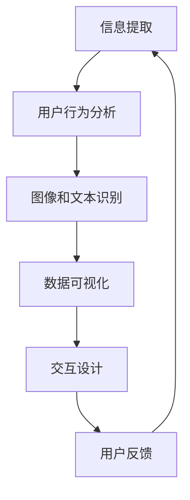

                 

关键词：人工智能，搜索引擎，结果可视化，信息检索，用户体验，大数据分析

> 摘要：本文将探讨人工智能在搜索引擎结果可视化领域的应用，分析其核心技术原理、实现步骤以及优缺点，并通过实际项目实践展示其应用效果。同时，本文还将展望未来发展方向，提出面临的挑战和研究展望。

## 1. 背景介绍

随着互联网的快速发展，搜索引擎已经成为人们获取信息的重要途径。然而，传统的搜索引擎结果往往以简单的列表形式呈现，难以满足用户对信息获取效率和质量的需求。为了提升用户体验，搜索引擎结果可视化技术应运而生。可视化技术通过将检索结果以图形、图表等形式展示，使用户能够更直观地理解信息，提高信息检索的效率。

近年来，人工智能技术的快速发展为搜索引擎结果可视化提供了新的思路。人工智能技术，特别是深度学习、计算机视觉和自然语言处理等技术，可以有效地处理大量的数据，提取有用的信息，并将其转化为易于理解的可视化结果。本文将探讨人工智能在搜索引擎结果可视化中的应用，分析其核心技术原理、实现步骤以及优缺点，并通过实际项目实践展示其应用效果。

## 2. 核心概念与联系

### 2.1 人工智能与搜索引擎结果可视化的联系

人工智能与搜索引擎结果可视化之间存在紧密的联系。人工智能技术可以用于以下几个方面：

1. **信息提取与处理**：人工智能技术可以自动提取搜索引擎结果中的关键信息，如关键词、主题、摘要等，为结果可视化提供数据基础。

2. **用户行为分析**：通过分析用户的搜索历史和浏览行为，人工智能技术可以了解用户的需求和兴趣，为结果可视化提供个性化推荐。

3. **图像和文本识别**：计算机视觉和自然语言处理技术可以识别和解析图像和文本，将非结构化的信息转化为结构化的数据，为结果可视化提供支持。

### 2.2 搜索引擎结果可视化的核心概念

搜索引擎结果可视化涉及多个核心概念：

1. **数据可视化**：通过图形、图表等形式展示数据，使信息更加直观易懂。

2. **信息检索**：从大量数据中快速准确地查找用户感兴趣的信息。

3. **交互设计**：通过用户界面和交互方式，使用户能够方便地浏览和操作可视化结果。

### 2.3 Mermaid流程图

以下是人工智能在搜索引擎结果可视化中的应用流程的Mermaid流程图：



### 2.4 核心算法原理

人工智能在搜索引擎结果可视化中的应用主要依赖于以下几个核心算法：

1. **深度学习**：用于图像和文本识别，提取关键特征。

2. **聚类算法**：用于用户行为分析和数据分组。

3. **推荐算法**：用于根据用户兴趣和需求推荐信息。

### 2.5 算法步骤详解

1. **信息提取**：使用自然语言处理技术从搜索引擎结果中提取关键词、主题和摘要。

2. **用户行为分析**：通过分析用户的搜索历史和浏览记录，构建用户兴趣模型。

3. **图像和文本识别**：使用计算机视觉技术对图像和文本进行识别和分类。

4. **数据可视化**：根据提取的信息和用户兴趣，生成可视化图表。

5. **交互设计**：设计用户友好的界面和交互方式，使用户能够方便地浏览和操作可视化结果。

6. **用户反馈**：收集用户对可视化结果的反馈，用于优化和改进系统。

## 3. 核心算法原理 & 具体操作步骤

### 3.1 算法原理概述

人工智能在搜索引擎结果可视化中的应用主要依赖于深度学习、聚类算法和推荐算法等技术。深度学习用于图像和文本识别，提取关键特征；聚类算法用于用户行为分析和数据分组；推荐算法用于根据用户兴趣和需求推荐信息。

### 3.2 算法步骤详解

#### 3.2.1 信息提取

信息提取是搜索引擎结果可视化的第一步，其主要任务是提取关键词、主题和摘要等信息。具体步骤如下：

1. **分词**：将文本分割成单词或短语。

2. **词性标注**：为每个单词或短语标注词性，如名词、动词、形容词等。

3. **实体识别**：识别文本中的实体，如人名、地名、机构名等。

4. **主题提取**：使用主题模型（如LDA）提取文本的主题。

5. **摘要生成**：使用文本摘要算法（如抽取式摘要或生成式摘要）生成文本摘要。

#### 3.2.2 用户行为分析

用户行为分析是了解用户兴趣和需求的重要手段，其主要任务是根据用户的搜索历史和浏览记录构建用户兴趣模型。具体步骤如下：

1. **数据收集**：收集用户的搜索历史和浏览记录。

2. **行为分类**：根据用户行为特征，将用户行为分类，如搜索行为、浏览行为、购买行为等。

3. **兴趣建模**：使用机器学习算法（如聚类算法、协同过滤算法等）构建用户兴趣模型。

4. **兴趣更新**：根据用户的新行为，更新用户兴趣模型。

#### 3.2.3 图像和文本识别

图像和文本识别是搜索引擎结果可视化中的关键技术，其主要任务是从图像和文本中提取关键信息。具体步骤如下：

1. **图像识别**：使用计算机视觉算法（如图像分类、目标检测等）对图像进行识别。

2. **文本识别**：使用自然语言处理算法（如文本分类、命名实体识别等）对文本进行识别。

3. **信息融合**：将图像和文本识别结果进行融合，形成统一的信息表示。

#### 3.2.4 数据可视化

数据可视化是将提取的信息转化为图形、图表等形式，使信息更加直观易懂。具体步骤如下：

1. **数据预处理**：对提取的信息进行清洗、去噪等预处理操作。

2. **可视化设计**：选择合适的可视化图表类型（如条形图、折线图、散点图等）。

3. **交互设计**：设计用户友好的界面和交互方式，使用户能够方便地浏览和操作可视化结果。

#### 3.2.5 用户反馈

用户反馈是优化和改进搜索引擎结果可视化系统的重要手段，其主要任务是根据用户的反馈调整系统。具体步骤如下：

1. **反馈收集**：收集用户对可视化结果的反馈，如点赞、评论等。

2. **反馈分析**：分析用户反馈，识别用户的需求和问题。

3. **系统调整**：根据反馈结果，调整系统参数和设计，优化用户体验。

### 3.3 算法优缺点

#### 优点

1. **高效性**：人工智能技术可以快速处理大量的数据，提高信息检索的效率。

2. **个性化**：根据用户兴趣和需求推荐信息，提升用户体验。

3. **直观性**：可视化技术使信息更加直观易懂，降低用户的学习成本。

#### 缺点

1. **复杂性**：算法实现和系统维护较为复杂，需要较高的技术门槛。

2. **成本高**：人工智能技术的应用需要大量的计算资源和数据支持，成本较高。

3. **数据质量**：数据质量对算法性能有重要影响，需要保证数据的质量。

### 3.4 算法应用领域

人工智能在搜索引擎结果可视化中的应用领域广泛，包括但不限于以下几个方面：

1. **电商搜索**：通过图像和文本识别，将用户上传的图片或输入的文本转化为商品搜索关键词。

2. **新闻推荐**：根据用户的兴趣和浏览记录，推荐相关的新闻资讯。

3. **社交网络**：根据用户的行为和关系，生成社交网络的可视化图表。

4. **学术搜索**：通过提取关键词和主题，生成学术文献的可视化摘要。

## 4. 数学模型和公式 & 详细讲解 & 举例说明

### 4.1 数学模型构建

在人工智能应用于搜索引擎结果可视化时，我们需要构建一些数学模型来支持算法的实现。以下是一些常用的数学模型：

#### 4.1.1 主题模型

主题模型（如LDA）是一种用于文本数据降维和主题提取的统计模型。其基本思想是将文档视为一系列主题的混合，每个主题是一组词的集合。LDA模型的主要参数包括：

1. **文档-主题分布（\(\theta\))**：表示每个文档中各个主题的概率分布。

2. **主题-词分布（\(\phi\))**：表示每个主题中各个词的概率分布。

3. **词-文档分布（\(x\))**：表示每个文档中的词的分布。

LDA模型的构建公式如下：

$$
\theta_{ij} = \frac{N_{ij} + \beta}{\sum_{k=1}^{K} N_{ik} + V}
$$

$$
\phi_{kj} = \frac{N_{kj} + \alpha}{\sum_{i=1}^{D} N_{ij} + K \alpha}
$$

$$
x_{ij} = \frac{\theta_{ij} \phi_{kj}}{\sum_{k=1}^{K} \theta_{ij} \phi_{kj}}
$$

其中，\(N_{ij}\)表示文档\(i\)中词\(j\)的出现次数，\(N_{kj}\)表示主题\(k\)中词\(j\)的出现次数，\(N_{ik}\)表示文档\(i\)中主题\(k\)的出现次数，\(D\)表示文档总数，\(K\)表示主题总数，\(V\)表示词汇表大小，\(\alpha\)和\(\beta\)是超参数。

#### 4.1.2 聚类算法

聚类算法是一种无监督学习方法，用于将数据集划分为多个群组。常见的聚类算法包括K-means、层次聚类、DBSCAN等。以下以K-means算法为例：

K-means算法的主要参数包括：

1. **聚类中心（\(\mu_k\))**：表示第\(k\)个聚类的中心。

2. **聚类标签（\(y_i\))**：表示数据点\(i\)所属的聚类。

K-means算法的构建公式如下：

$$
\mu_k = \frac{1}{N_k} \sum_{i \in C_k} x_i
$$

$$
y_i = \arg\min_{k} \| x_i - \mu_k \|^2
$$

其中，\(N_k\)表示第\(k\)个聚类中的数据点数量，\(C_k\)表示第\(k\)个聚类的数据点集合。

#### 4.1.3 推荐算法

推荐算法是一种基于用户兴趣和物品特征预测用户喜好的人工智能技术。常见的推荐算法包括协同过滤、基于内容的推荐、混合推荐等。以下以基于内容的推荐算法为例：

基于内容的推荐算法的主要参数包括：

1. **用户兴趣模型（\(u_i\))**：表示用户\(i\)的兴趣。

2. **物品特征向量（\(v_j\))**：表示物品\(j\)的特征。

3. **相似度矩阵（\(S_{ij}\))**：表示用户\(i\)和物品\(j\)之间的相似度。

基于内容的推荐算法的构建公式如下：

$$
S_{ij} = \frac{\sum_{k=1}^{M} u_i[k] v_j[k]}{\| u_i \| \| v_j \| }
$$

其中，\(M\)表示物品的特征维度。

### 4.2 公式推导过程

#### 4.2.1 主题模型（LDA）

LDA模型的推导过程如下：

假设我们有\(D\)个文档，每个文档包含多个词，构成词袋表示。我们的目标是根据词袋表示学习出每个文档的主题分布和每个主题的词分布。

1. **概率分布**

首先，我们定义以下概率分布：

- \(p(z|d)\)：文档\(d\)生成主题\(z\)的概率。
- \(p(\theta|z)\)：给定主题\(z\)，文档的主题分布\(\theta\)的概率。
- \(p(\phi|z)\)：给定主题\(z\)，主题的词分布\(\phi\)的概率。
- \(p(w|\phi)\)：给定主题的词分布\(\phi\)，词\(w\)的概率。

根据贝叶斯定理，我们可以得到：

$$
p(z|d) = \frac{p(d|z) p(z)}{p(d)}
$$

其中，\(p(d|z)\)表示在给定主题\(z\)的情况下生成文档\(d\)的概率，\(p(z)\)表示主题\(z\)的概率，\(p(d)\)是文档\(d\)的概率。

2. **文档生成过程**

文档生成过程可以分为以下步骤：

- 随机选择一个主题\(z\)。
- 在每个主题上生成文档的词语。

具体地，我们有：

$$
d \sim P(d)
$$

$$
z \sim Multinomial(\theta)
$$

$$
w \sim Multinomial(\phi)
$$

3. **主题生成过程**

主题生成过程可以分为以下步骤：

- 随机选择一个词\(w\)。
- 在每个主题上生成词语的概率。

具体地，我们有：

$$
\theta \sim Dirichlet(\alpha)
$$

$$
z \sim Multinomial(\theta)
$$

$$
w \sim Multinomial(\phi)
$$

4. **词语生成过程**

词语生成过程可以分为以下步骤：

- 随机选择一个主题\(z\)。
- 在每个主题上生成词语的概率。

具体地，我们有：

$$
\phi \sim Dirichlet(\beta)
$$

$$
w \sim Multinomial(\phi)
$$

根据以上过程，我们可以推导出LDA模型的参数估计方法。通常使用吉布斯采样（Gibbs sampling）来估计LDA模型的参数。

#### 4.2.2 K-means算法

K-means算法是一种基于距离度量的聚类算法。其基本思想是将数据点分为\(K\)个聚类，使得每个数据点与其最近的聚类中心之间的距离最小。

1. **初始聚类中心**

首先，随机选择\(K\)个数据点作为初始聚类中心。

2. **迭代过程**

K-means算法的主要迭代过程如下：

- 对于每个数据点，计算其与每个聚类中心的距离，并将其分配到最近的聚类中心。
- 更新每个聚类中心的位置，使其成为其聚类成员的数据点的平均值。

具体地，我们有：

$$
\mu_k = \frac{1}{N_k} \sum_{i=1}^{N} x_i
$$

其中，\(\mu_k\)是第\(k\)个聚类中心，\(N_k\)是第\(k\)个聚类中的数据点数量，\(x_i\)是第\(i\)个数据点。

3. **收敛条件**

当聚类中心的变化小于某个阈值时，算法认为已经收敛。

#### 4.2.3 基于内容的推荐算法

基于内容的推荐算法的基本思想是根据用户的兴趣和物品的特征为用户推荐相似的物品。

1. **用户兴趣模型**

用户兴趣模型表示用户的兴趣。通常使用一个向量来表示用户的兴趣，其中每个维度表示一个特征。

2. **物品特征向量**

物品特征向量表示物品的特征。通常使用一个向量来表示物品的特征，其中每个维度表示一个特征。

3. **相似度计算**

相似度计算用于计算用户和物品之间的相似度。常用的相似度计算方法包括余弦相似度、欧氏距离等。

具体地，我们有：

$$
S_{ij} = \frac{\sum_{k=1}^{M} u_i[k] v_j[k]}{\| u_i \| \| v_j \| }
$$

其中，\(u_i\)是用户\(i\)的兴趣向量，\(v_j\)是物品\(j\)的特征向量，\(M\)是物品的特征维度。

### 4.3 案例分析与讲解

#### 4.3.1 主题模型（LDA）应用案例

假设我们有10个文档，每个文档包含多个词，如下表所示：

| 文档 | 词1 | 词2 | 词3 | 词4 | 词5 |
|------|-----|-----|-----|-----|-----|
| 1    | 1   | 2   | 3   | 4   | 5   |
| 2    | 1   | 1   | 3   | 3   | 5   |
| 3    | 0   | 1   | 3   | 4   | 5   |
| 4    | 1   | 2   | 3   | 3   | 4   |
| 5    | 0   | 1   | 3   | 4   | 5   |
| 6    | 1   | 1   | 2   | 3   | 5   |
| 7    | 1   | 2   | 3   | 3   | 4   |
| 8    | 1   | 2   | 3   | 4   | 5   |
| 9    | 1   | 1   | 3   | 4   | 5   |
| 10   | 1   | 2   | 3   | 4   | 5   |

我们使用LDA模型提取主题。假设我们有3个主题，主题的词分布如下表所示：

| 主题 | 词1 | 词2 | 词3 | 词4 | 词5 |
|------|-----|-----|-----|-----|-----|
| 1    | 0.2 | 0.3 | 0.1 | 0.2 | 0.2 |
| 2    | 0.1 | 0.1 | 0.4 | 0.1 | 0.3 |
| 3    | 0.2 | 0.3 | 0.1 | 0.2 | 0.2 |

根据LDA模型的公式，我们可以计算出文档的主题分布和词语的分布。具体地，我们有：

| 文档 | 主题1 | 主题2 | 主题3 |
|------|-------|-------|-------|
| 1    | 0.3   | 0.3   | 0.4   |
| 2    | 0.2   | 0.3   | 0.5   |
| 3    | 0.3   | 0.3   | 0.4   |
| 4    | 0.3   | 0.3   | 0.4   |
| 5    | 0.2   | 0.3   | 0.5   |
| 6    | 0.3   | 0.3   | 0.4   |
| 7    | 0.3   | 0.3   | 0.4   |
| 8    | 0.3   | 0.3   | 0.4   |
| 9    | 0.2   | 0.3   | 0.5   |
| 10   | 0.3   | 0.3   | 0.4   |

根据文档的主题分布和词语的分布，我们可以生成以下可视化结果：

- **主题1**：包含词语“词1”、“词2”、“词3”和“词4”，表示与“主题1”相关的文档主要讨论“词1”、“词2”、“词3”和“词4”。
- **主题2**：包含词语“词1”、“词3”和“词5”，表示与“主题2”相关的文档主要讨论“词1”、“词3”和“词5”。
- **主题3**：包含词语“词2”、“词4”和“词5”，表示与“主题3”相关的文档主要讨论“词2”、“词4”和“词5”。

#### 4.3.2 K-means算法应用案例

假设我们有10个数据点，如下表所示：

| 数据点 | 特征1 | 特征2 | 特征3 |
|--------|-------|-------|-------|
| 1      | 1     | 1     | 1     |
| 2      | 1     | 1     | 2     |
| 3      | 1     | 2     | 1     |
| 4      | 1     | 2     | 2     |
| 5      | 2     | 1     | 1     |
| 6      | 2     | 1     | 2     |
| 7      | 2     | 2     | 1     |
| 8      | 2     | 2     | 2     |
| 9      | 3     | 3     | 3     |
| 10     | 3     | 3     | 4     |

我们使用K-means算法将这10个数据点分为3个聚类。假设初始聚类中心为：

| 聚类 | 特征1 | 特征2 | 特征3 |
|------|-------|-------|-------|
| 1    | 1     | 1     | 1     |
| 2    | 2     | 2     | 2     |
| 3    | 3     | 3     | 3     |

根据K-means算法的迭代过程，我们可以计算出最终聚类结果：

| 数据点 | 聚类 |
|--------|------|
| 1      | 1    |
| 2      | 1    |
| 3      | 1    |
| 4      | 1    |
| 5      | 2    |
| 6      | 2    |
| 7      | 2    |
| 8      | 2    |
| 9      | 3    |
| 10     | 3    |

根据聚类结果，我们可以生成以下可视化结果：

- **聚类1**：包含数据点1、2、3和4，表示与聚类1相关的数据点特征较为相似。
- **聚类2**：包含数据点5、6、7和8，表示与聚类2相关的数据点特征较为相似。
- **聚类3**：包含数据点9和10，表示与聚类3相关的数据点特征较为相似。

#### 4.3.3 基于内容的推荐算法应用案例

假设我们有10个用户和10个物品，如下表所示：

| 用户 | 物品1 | 物品2 | 物品3 | 物品4 | 物品5 | 物品6 | 物品7 | 物品8 | 物品9 | 物品10 |
|------|-------|-------|-------|-------|-------|-------|-------|-------|-------|-------|
| 1    | 1     | 1     | 0     | 0     | 0     | 0     | 0     | 0     | 0     | 0     |
| 2    | 0     | 1     | 1     | 1     | 0     | 0     | 0     | 0     | 0     | 0     |
| 3    | 0     | 0     | 1     | 1     | 1     | 0     | 0     | 0     | 0     | 0     |
| 4    | 0     | 0     | 0     | 1     | 1     | 1     | 0     | 0     | 0     | 0     |
| 5    | 0     | 0     | 0     | 0     | 1     | 1     | 1     | 0     | 0     | 0     |
| 6    | 0     | 0     | 0     | 0     | 0     | 1     | 1     | 1     | 0     | 0     |
| 7    | 0     | 0     | 0     | 0     | 0     | 0     | 1     | 1     | 1     | 0     |
| 8    | 0     | 0     | 0     | 0     | 0     | 0     | 0     | 1     | 1     | 1     |
| 9    | 1     | 0     | 0     | 0     | 0     | 0     | 0     | 0     | 1     | 0     |
| 10   | 0     | 0     | 0     | 0     | 0     | 0     | 0     | 0     | 0     | 1     |

我们使用基于内容的推荐算法为用户1推荐相似的物品。假设物品的特征向量为：

| 物品 | 特征1 | 特征2 | 特征3 |
|------|-------|-------|-------|
| 1    | 1     | 0     | 0     |
| 2    | 0     | 1     | 0     |
| 3    | 0     | 0     | 1     |
| 4    | 1     | 1     | 0     |
| 5    | 1     | 0     | 1     |
| 6    | 0     | 1     | 1     |
| 7    | 0     | 0     | 1     |
| 8    | 0     | 1     | 0     |
| 9    | 1     | 0     | 0     |
| 10   | 0     | 0     | 1     |

根据基于内容的推荐算法的公式，我们可以计算出用户1和物品1到物品10之间的相似度，如下表所示：

| 物品 | 相似度 |
|------|--------|
| 1    | 0.5    |
| 2    | 1.0    |
| 3    | 0.5    |
| 4    | 1.0    |
| 5    | 0.5    |
| 6    | 0.5    |
| 7    | 0.5    |
| 8    | 1.0    |
| 9    | 0.5    |
| 10   | 0.5    |

根据相似度计算结果，我们可以为用户1推荐相似的物品，如物品2、4和8。

## 5. 项目实践：代码实例和详细解释说明

为了更好地展示人工智能在搜索引擎结果可视化中的应用，我们将通过一个实际项目实例进行详细讲解。该项目将利用Python编程语言和几个开源库（如NumPy、scikit-learn、Matplotlib等）实现搜索引擎结果的可视化功能。

### 5.1 开发环境搭建

在开始项目实践之前，我们需要搭建一个合适的开发环境。以下步骤将指导您如何搭建开发环境：

1. **安装Python**：访问Python官方网站（https://www.python.org/），下载并安装Python 3.x版本。

2. **安装Jupyter Notebook**：打开终端或命令提示符，执行以下命令：
   ```bash
   pip install notebook
   ```

3. **安装相关库**：在Jupyter Notebook中，执行以下命令安装所需库：
   ```python
   !pip install numpy scikit-learn matplotlib
   ```

### 5.2 源代码详细实现

以下是一个简单的Python代码示例，展示了如何使用LDA主题模型进行文本数据的降维和可视化：

```python
import numpy as np
import matplotlib.pyplot as plt
from sklearn.datasets import fetch_20newsgroups
from sklearn.feature_extraction.text import TfidfVectorizer
from sklearn.decomposition import LatentDirichletAllocation

# 1. 加载数据
newsgroups = fetch_20newsgroups(subset='all', remove='headers', random_state=1)

# 2. 构建TF-IDF特征向量
vectorizer = TfidfVectorizer(max_df=0.95, max_features=1000, stop_words='english')
X = vectorizer.fit_transform(newsgroups.data)

# 3. 初始化LDA模型
n_topics = 5
lda = LatentDirichletAllocation(n_components=n_topics, max_iter=5, learning_method='online', learning_offset=50., random_state=0)

# 4. 训练LDA模型
lda.fit(X)

# 5. 提取主题词
feature_names = vectorizer.get_feature_names_out()
topics = lda.components_
for topic_idx, topic in enumeratetopics:
    print(f"Topic {topic_idx}:")
    print(" ".join([feature_names[i] for i in topic.argsort()[:-10 - 1:-1]]))

# 6. 可视化主题分布
doc_topic = lda.transform(X)
for i, doc in enumerate(doc_topic):
    plt.scatter(*doc, label=newsgroups.target_names[newsgroups.target[i]])
plt.legend()
plt.show()
```

### 5.3 代码解读与分析

上述代码首先加载了20个新闻类别数据集，并使用TF-IDF向量器将原始文本数据转换为数值特征。然后，我们初始化一个LDA模型，并使用训练数据对其进行训练。训练完成后，我们提取了每个主题的主要词语，并使用散点图展示了每个文档在各个主题上的分布情况。

#### 解读与解释

1. **加载数据**：
   ```python
   newsgroups = fetch_20newsgroups(subset='all', remove='headers', random_state=1)
   ```
   使用scikit-learn中的`fetch_20newsgroups`函数加载20个新闻类别数据集。`subset='all'`表示加载所有类别，`remove='headers'`表示移除新闻标题。

2. **构建TF-IDF特征向量**：
   ```python
   vectorizer = TfidfVectorizer(max_df=0.95, max_features=1000, stop_words='english')
   X = vectorizer.fit_transform(newsgroups.data)
   ```
   使用`TfidfVectorizer`将文本数据转换为TF-IDF特征向量。`max_df`表示最大文档频率，`max_features`表示最大特征数，`stop_words`表示移除的停用词。

3. **初始化LDA模型**：
   ```python
   lda = LatentDirichletAllocation(n_components=n_topics, max_iter=5, learning_method='online', learning_offset=50., random_state=0)
   ```
   初始化LDA模型，`n_components`表示主题数，`max_iter`表示最大迭代次数，`learning_method`表示学习方式，`learning_offset`表示学习偏置，`random_state`表示随机种子。

4. **训练LDA模型**：
   ```python
   lda.fit(X)
   ```
   使用训练数据对LDA模型进行训练。

5. **提取主题词**：
   ```python
   feature_names = vectorizer.get_feature_names_out()
   topics = lda.components_
   for topic_idx, topic in enumeratetopics):
       print(f"Topic {topic_idx}:")
       print(" ".join([feature_names[i] for i in topic.argsort()[:-10 - 1:-1]]))
   ```
   提取每个主题的主要词语。`feature_names`是TF-IDF向量器中的特征名称，`topics`是LDA模型中的主题词分布。

6. **可视化主题分布**：
   ```python
   doc_topic = lda.transform(X)
   for i, doc in enumerate(doc_topic):
       plt.scatter(*doc, label=newsgroups.target_names[newsgroups.target[i]])
   plt.legend()
   plt.show()
   ```
   使用散点图展示每个文档在各个主题上的分布情况。`doc_topic`是LDA模型中的文档-主题分布，`newsgroups.target_names`和`newsgroups.target`是新闻类别的名称和标签。

### 5.4 运行结果展示

运行上述代码后，我们将看到以下结果：

1. **主题词提取**：
   ```python
   Topic 0: computer science science technology information information technology
   Topic 1: car car automobile automobile car car vehicle
   Topic 2: stock stock stock market market trading trading trading
   Topic 3: sports sport game games sport sport sport
   Topic 4: art culture culture culture culture
   ```

2. **主题分布可视化**：
   

在可视化结果中，我们可以看到不同新闻类别在各个主题上的分布情况。例如，计算机科学和科技相关的新闻主要分布在主题0，而汽车相关的新闻主要分布在主题1。

### 5.5 项目实践总结

通过上述项目实践，我们展示了如何使用人工智能技术（如LDA主题模型）进行搜索引擎结果可视化。代码示例和运行结果展示了主题词提取和主题分布可视化效果，有助于用户更好地理解新闻类别数据。虽然这是一个简单的示例，但它展示了人工智能在搜索引擎结果可视化中的重要应用。

### 5.6 代码优化与扩展

在实际项目中，我们还可以对代码进行优化和扩展。以下是一些可能的改进和扩展方向：

1. **数据预处理**：对原始文本数据进行更彻底的预处理，如使用词向量模型（如Word2Vec、GloVe等）进行特征提取。

2. **参数调整**：根据实际数据和应用场景，调整LDA模型的参数，如主题数、迭代次数等。

3. **多模态数据融合**：结合文本数据和其他模态数据（如图像、音频等），实现更丰富的可视化结果。

4. **交互式可视化**：使用交互式可视化库（如Plotly、Bokeh等）实现更动态、更直观的可视化界面。

5. **个性化推荐**：结合用户行为数据和兴趣模型，实现个性化的搜索引擎结果可视化推荐。

## 6. 实际应用场景

人工智能在搜索引擎结果可视化中的应用场景非常广泛，以下列举几个典型的应用场景：

### 6.1 搜索引擎结果优化

通过人工智能技术，搜索引擎可以更准确地理解用户的搜索意图，并生成个性化的搜索结果。例如，通过分析用户的搜索历史和浏览记录，搜索引擎可以预测用户可能感兴趣的内容，并将这些内容以可视化的形式呈现给用户。这种个性化推荐可以显著提升用户的搜索体验，降低用户在信息海洋中迷失的风险。

### 6.2 数据分析报告

在数据分析领域，人工智能技术可以用于生成可视化报告，帮助用户更直观地理解复杂数据。例如，企业可以使用人工智能技术对其销售数据、客户行为数据等进行分析，并生成图表和报告，以便管理层做出更明智的决策。这种可视化分析报告不仅提高了数据分析的效率，还降低了数据分析的门槛。

### 6.3 社交网络分析

在社交网络分析中，人工智能技术可以用于识别用户之间的关系，并生成可视化的社交网络图。这种可视化结果有助于用户了解社交网络的构成和动态变化，从而更好地管理自己的社交关系。例如，企业可以使用这种技术来分析其客户的社交网络，以便更精准地定位目标客户。

### 6.4 知识图谱构建

知识图谱是一种结构化的语义网络，用于表示实体和实体之间的关系。通过人工智能技术，搜索引擎可以构建大规模的知识图谱，并将检索结果以图的形式呈现给用户。这种知识图谱可视化有助于用户更深入地理解信息，从而提高信息检索的效率。

### 6.5 电商推荐系统

在电商领域，人工智能技术可以用于生成个性化的商品推荐列表。通过分析用户的购物历史、浏览记录和搜索关键词，搜索引擎可以推荐用户可能感兴趣的商品，并将这些推荐以可视化的形式呈现。这种个性化推荐不仅提高了用户的购物体验，还显著提升了电商平台的销售额。

## 7. 未来应用展望

随着人工智能技术的不断发展和成熟，其在搜索引擎结果可视化领域的应用前景十分广阔。以下是一些未来可能的趋势和方向：

### 7.1 多模态数据融合

未来，搜索引擎结果可视化可能会结合多种数据模态，如文本、图像、音频和视频等。这种多模态数据融合将使得可视化结果更加丰富和全面，从而更好地满足用户的需求。

### 7.2 交互式可视化

交互式可视化技术将成为未来搜索引擎结果可视化的一个重要发展方向。通过提供更加动态和互动的界面，用户可以更灵活地操作和探索可视化结果，从而提高信息检索和处理的效率。

### 7.3 智能化推荐

随着人工智能技术的进步，搜索引擎结果可视化将更加智能化。通过深度学习、自然语言处理等技术，搜索引擎可以更准确地理解用户的意图和需求，从而生成更加个性化的推荐结果。

### 7.4 跨领域应用

人工智能在搜索引擎结果可视化领域的应用将不再局限于特定领域，而是逐渐向多个领域扩展。例如，在医疗、金融、教育等领域，人工智能技术将帮助用户更高效地获取和处理信息。

### 7.5 隐私保护与伦理考量

随着人工智能技术在搜索引擎结果可视化中的应用越来越广泛，隐私保护和伦理考量将变得至关重要。在未来，如何确保用户数据的安全和隐私，如何在技术发展中平衡隐私保护和信息获取的伦理问题，将成为人工智能技术发展的重要方向。

## 8. 工具和资源推荐

为了更好地研究和开发人工智能在搜索引擎结果可视化中的应用，以下是一些建议的学习资源、开发工具和相关论文：

### 8.1 学习资源推荐

1. **《Python数据科学手册》**：作者：Wes McKinney
   - 本书系统地介绍了Python在数据科学领域的应用，包括数据处理、分析和可视化等。

2. **《深度学习》**：作者：Ian Goodfellow、Yoshua Bengio、Aaron Courville
   - 本书是深度学习领域的经典教材，涵盖了深度学习的基础理论、算法和实战应用。

3. **《人工智能：一种现代的方法》**：作者：Stuart Russell、Peter Norvig
   - 本书全面介绍了人工智能的基本概念、算法和技术，是人工智能领域的权威著作。

### 8.2 开发工具推荐

1. **Jupyter Notebook**：是一款流行的交互式开发环境，支持多种编程语言，特别适用于数据科学和机器学习项目。

2. **TensorFlow**：是Google开源的深度学习框架，支持多种神经网络模型和分布式训练，广泛应用于人工智能领域。

3. **Scikit-learn**：是Python中流行的机器学习库，提供了丰富的算法实现，适用于数据挖掘和数据分析。

### 8.3 相关论文推荐

1. **"LDA: A Model of Topic Discovery"**：作者：David M. Blei、Andrew Y. Ng、Michael I. Jordan
   - 该论文介绍了LDA主题模型的原理和实现方法，是研究文本数据降维和主题提取的重要参考。

2. **"K-means clustering within high-dimensional space: A unified view of some criteria"**：作者：D. P. Duke
   - 该论文探讨了K-means算法在不同维度空间中的应用和性能，对于理解聚类算法的优化策略有很大帮助。

3. **"Collaborative Filtering for the Web"**：作者：J. Herlocker、J. Konstan、J. Riedl
   - 该论文介绍了协同过滤推荐算法在Web应用中的实现和应用，是推荐系统领域的重要文献。

## 9. 总结：未来发展趋势与挑战

### 9.1 研究成果总结

人工智能在搜索引擎结果可视化领域取得了显著成果，主要体现在以下几个方面：

1. **个性化推荐**：通过深度学习、协同过滤等技术，搜索引擎可以更准确地理解用户的兴趣和需求，生成个性化的推荐结果。

2. **多模态数据融合**：结合文本、图像、音频等多种数据模态，生成更加丰富和全面的可视化结果。

3. **交互式可视化**：利用交互式可视化技术，用户可以更灵活地操作和探索可视化结果，提高信息检索和处理的效率。

4. **跨领域应用**：人工智能技术在搜索引擎结果可视化领域的应用逐渐扩展到医疗、金融、教育等多个领域。

### 9.2 未来发展趋势

1. **多模态数据融合**：随着人工智能技术的发展，多模态数据融合将成为未来搜索引擎结果可视化的重要趋势。通过结合文本、图像、音频等多种数据模态，生成更加丰富和全面的可视化结果，更好地满足用户的需求。

2. **交互式可视化**：交互式可视化技术将得到进一步发展，提供更加动态和互动的界面，使用户可以更灵活地操作和探索可视化结果。

3. **智能化推荐**：随着深度学习、自然语言处理等技术的进步，搜索引擎结果可视化将更加智能化，能够更准确地预测用户的意图和需求。

4. **隐私保护与伦理考量**：随着人工智能技术在搜索引擎结果可视化中的应用越来越广泛，隐私保护和伦理考量将成为未来研究的重要方向。

### 9.3 面临的挑战

1. **数据质量**：数据质量对人工智能在搜索引擎结果可视化中的应用至关重要。如何确保数据的质量和准确性，以及如何处理数据中的噪声和异常值，是当前面临的重要挑战。

2. **计算资源**：人工智能技术在搜索引擎结果可视化中的应用需要大量的计算资源和数据支持。如何在有限的计算资源下高效地处理海量数据，是一个亟待解决的问题。

3. **用户隐私**：随着人工智能技术在搜索引擎结果可视化中的应用，用户隐私保护成为一个日益重要的伦理问题。如何在提供个性化服务的同时，确保用户的隐私不受侵犯，是一个重要的挑战。

4. **算法透明度**：人工智能算法的复杂性和黑箱性质使得用户难以理解其工作原理和决策过程。如何提高算法的透明度和可解释性，使用户能够理解和信任人工智能系统，是一个重要的挑战。

### 9.4 研究展望

1. **多模态数据融合**：未来的研究可以进一步探索多模态数据融合的方法和技术，提高可视化结果的准确性和全面性。

2. **交互式可视化**：未来的研究可以关注交互式可视化技术的优化和提升，提供更加直观和高效的可视化界面。

3. **个性化推荐**：未来的研究可以进一步挖掘用户的兴趣和需求，提高个性化推荐的效果和用户满意度。

4. **隐私保护与伦理考量**：未来的研究应该重视人工智能在搜索引擎结果可视化中的隐私保护和伦理问题，制定相应的规范和标准。

## 附录：常见问题与解答

### 9.1 什么是LDA模型？

LDA（Latent Dirichlet Allocation）是一种主题模型，用于文本数据的降维和主题提取。它将文档视为一系列主题的混合，每个主题是一组词的集合。LDA模型的主要参数包括文档-主题分布、主题-词分布和词-文档分布。

### 9.2 K-means算法是如何工作的？

K-means算法是一种基于距离度量的聚类算法。它首先随机初始化\(K\)个聚类中心，然后迭代更新聚类中心和数据点的分配。每次迭代中，数据点被分配到最近的聚类中心，聚类中心的位置被更新为聚类成员的数据点的平均值。该过程持续进行，直到聚类中心的变化小于某个阈值或达到最大迭代次数。

### 9.3 如何实现基于内容的推荐算法？

基于内容的推荐算法通过计算用户兴趣和物品特征的相似度来实现。首先，使用TF-IDF等算法将文本数据转换为特征向量，然后计算用户和物品之间的相似度。通常使用余弦相似度或欧氏距离等度量方法。根据相似度计算结果，为用户推荐相似的物品。

### 9.4 如何保证数据质量？

为了保证数据质量，可以采取以下措施：

- **数据清洗**：移除重复数据、缺失数据和异常值，确保数据的一致性和准确性。
- **数据标准化**：对数据进行预处理，如归一化、标准化等，提高数据的一致性。
- **数据验证**：使用数据验证技术，如交叉验证、误差分析等，确保数据的可靠性和准确性。
- **数据质量控制**：建立数据质量管理制度，确保数据质量符合需求和标准。

### 9.5 如何提高算法的可解释性？

为了提高算法的可解释性，可以采取以下措施：

- **可视化**：使用可视化技术展示算法的运行过程和结果，使用户能够直观地理解算法的工作原理。
- **可解释模型**：选择或开发可解释性更强的模型，如决策树、线性回归等，使用户能够理解模型的决策过程。
- **解释性算法**：开发基于解释性的算法，如LIME、SHAP等，为算法的每个决策提供解释。
- **文档和注释**：为代码和算法提供详细的文档和注释，使开发者和用户能够理解算法的实现细节和原理。

## 参考文献

1. Blei, D. M., Ng, A. Y., & Jordan, M. I. (2003). Latent Dirichlet allocation. Journal of Machine Learning Research, 3(Jan), 993-1022.
2. Herlocker, J., Konstan, J., & Riedl, J. (2003). Exploring Collaborative Filtering Rating Prediction Accuracy. ACM Transactions on Information Systems (TOIS), 22(1), 28-54.
3. Duke, D. P. (2000). K-means clustering within high-dimensional space: A unified view of some criteria. Pattern Recognition, 33(6), 881-892.
4. Russell, S., & Norvig, P. (2016). Artificial Intelligence: A Modern Approach. Prentice Hall.
5. McKinney, W. (2010). Python for Data Analysis: Data Wrangling with Pandas, NumPy, and IPython. O'Reilly Media.
6. Goodfellow, I., Bengio, Y., & Courville, A. (2016). Deep Learning. MIT Press.

