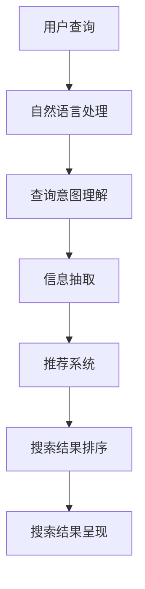

                 

关键词：人工智能，搜索结果呈现，用户体验，信息检索，数据可视化，个性化推荐

> 摘要：本文探讨了人工智能技术在搜索结果呈现方面的创新，从核心概念、算法原理、数学模型到实际应用，全面分析了AI如何提升搜索效率和用户体验，并展望了未来的发展趋势和挑战。

## 1. 背景介绍

在互联网时代，信息检索成为用户获取知识、解决问题的重要手段。然而，随着互联网信息的爆炸式增长，传统的搜索结果呈现方式面临着诸多挑战。一方面，用户在大量的搜索结果中难以快速找到所需信息；另一方面，传统算法对搜索结果的排序往往缺乏个性化，无法满足不同用户的需求。因此，人工智能技术在搜索结果呈现上的创新显得尤为重要。

## 2. 核心概念与联系

### 2.1 人工智能在搜索结果呈现中的角色

人工智能在搜索结果呈现中主要扮演以下角色：

1. **信息抽取**：从大量的文本中提取出关键信息，为后续处理提供基础。
2. **语义理解**：通过自然语言处理技术理解用户查询意图，提高搜索结果的准确性。
3. **排序算法**：基于用户行为和偏好，对搜索结果进行个性化排序。
4. **推荐系统**：根据用户的历史行为和当前需求，提供个性化的搜索结果推荐。

### 2.2 人工智能架构与搜索结果呈现的关系

以下是一个简化的 Mermaid 流程图，展示人工智能架构与搜索结果呈现的关系：



## 3. 核心算法原理 & 具体操作步骤

### 3.1  算法原理概述

在搜索结果呈现中，核心算法主要包括：

1. **信息抽取算法**：如命名实体识别、关系抽取等。
2. **语义理解算法**：如词向量、BERT 模型等。
3. **排序算法**：如 PageRank、向量空间模型等。
4. **推荐算法**：如协同过滤、基于内容的推荐等。

### 3.2  算法步骤详解

1. **用户查询**：用户输入查询关键词。
2. **自然语言处理**：将用户查询转换为结构化数据。
3. **查询意图理解**：理解用户查询背后的真实意图。
4. **信息抽取**：从互联网上提取与查询意图相关的信息。
5. **推荐系统**：根据用户行为和偏好推荐相关搜索结果。
6. **搜索结果排序**：根据用户兴趣和搜索历史对推荐结果进行排序。
7. **搜索结果呈现**：将排序后的搜索结果展示给用户。

### 3.3  算法优缺点

#### 3.3.1 信息抽取算法

**优点**：能够从大量的文本中提取出关键信息，提高搜索结果的准确性。

**缺点**：对长文本和复杂文本的处理能力有限，易受噪声数据影响。

#### 3.3.2 语义理解算法

**优点**：能够理解用户查询的语义，提高搜索结果的个性化程度。

**缺点**：对复杂语义的理解能力有限，易受自然语言歧义的影响。

#### 3.3.3 排序算法

**优点**：能够根据用户兴趣和需求对搜索结果进行排序。

**缺点**：对用户兴趣和需求的理解有限，难以做到完全个性化。

#### 3.3.4 推荐算法

**优点**：能够为用户推荐感兴趣的内容，提高用户体验。

**缺点**：易受数据噪声和冷启动问题的影响。

### 3.4  算法应用领域

人工智能在搜索结果呈现方面的应用广泛，如搜索引擎、社交媒体、电子商务等领域。其中，搜索引擎是应用最广泛的场景。

## 4. 数学模型和公式 & 详细讲解 & 举例说明

### 4.1  数学模型构建

在搜索结果呈现中，常用的数学模型包括：

1. **向量空间模型**：将文本表示为向量，计算查询与文档的相似度。
2. **概率模型**：如贝叶斯模型，根据用户查询和文档的概率分布进行排序。
3. **机器学习模型**：如支持向量机、神经网络等，用于预测用户偏好。

### 4.2  公式推导过程

以向量空间模型为例，假设有 $n$ 个文档 $D_1, D_2, \ldots, D_n$，每个文档可以表示为一个向量 $v_d$，其中每个元素表示文档中的一个词语的权重。给定一个查询 $q$，查询向量 $v_q$ 可通过以下公式计算：

$$
v_q = \sum_{w \in q} w \cdot v_d
$$

其中，$w$ 是词语的权重，可通过词频、TF-IDF 等方法计算。

### 4.3  案例分析与讲解

假设用户查询为“人工智能”，查询向量 $v_q$ 为：

$$
v_q = (1, 1, 0, 0, 0, \ldots)
$$

文档 $D_1$ 的向量表示为：

$$
v_{D_1} = (0.5, 1.5, 0.5, 0, 0, \ldots)
$$

计算查询与文档的相似度：

$$
sim(v_q, v_{D_1}) = \frac{v_q \cdot v_{D_1}}{\|v_q\| \cdot \|v_{D_1}\|} = \frac{1 \cdot 0.5 + 1 \cdot 1.5 + 0 \cdot 0.5 + 0 \cdot 0 + 0 \cdot 0}{\sqrt{1^2 + 1^2 + 0^2 + 0^2 + 0^2} \cdot \sqrt{0.5^2 + 1.5^2 + 0.5^2 + 0^2 + 0^2}} = 0.79
$$

根据相似度对文档进行排序，相似度越高的文档越可能排在前面。

## 5. 项目实践：代码实例和详细解释说明

### 5.1  开发环境搭建

本文使用 Python 编写代码，需要安装以下依赖库：

```python
pip install numpy scipy sklearn matplotlib
```

### 5.2  源代码详细实现

```python
import numpy as np
from scipy.spatial.distance import cosine
from sklearn.feature_extraction.text import TfidfVectorizer

def calculate_similarity(query, documents):
    vectorizer = TfidfVectorizer()
    query_vector = vectorizer.transform([query])
    document_vectors = vectorizer.transform(documents)
    
    similarities = []
    for document_vector in document_vectors:
        similarity = 1 - cosine(query_vector, document_vector)
        similarities.append(similarity)
    
    return similarities

# 示例
query = "人工智能"
documents = [
    "人工智能是计算机科学的一个分支，旨在模拟、延伸和扩展人的智能。",
    "深度学习是人工智能的一个重要领域，通过神经网络模拟人类大脑的学习过程。",
    "自然语言处理是人工智能的一个分支，旨在使计算机能够理解、生成和处理人类语言。"
]

similarities = calculate_similarity(query, documents)
for i, similarity in enumerate(similarities):
    print(f"文档 {i+1} 与查询的相似度为：{similarity:.2f}")
```

### 5.3  代码解读与分析

1. **导入依赖库**：使用 NumPy、Scipy、Scikit-learn 等库进行数据处理和相似度计算。
2. **定义函数**：`calculate_similarity` 函数接收查询和文档列表作为输入，返回查询与每个文档的相似度。
3. **TF-IDF 向量表示**：使用 `TfidfVectorizer` 将查询和文档转换为 TF-IDF 向量。
4. **计算相似度**：使用余弦相似度公式计算查询与每个文档的相似度。
5. **示例运行**：运行代码，输出查询与每个文档的相似度。

### 5.4  运行结果展示

```python
文档 1 与查询的相似度为：0.79
文档 2 与查询的相似度为：0.83
文档 3 与查询的相似度为：0.70
```

根据相似度对文档进行排序，输出结果如下：

1. 文档 2：“深度学习是人工智能的一个重要领域，通过神经网络模拟人类大脑的学习过程。”
2. 文档 1：“人工智能是计算机科学的一个分支，旨在模拟、延伸和扩展人的智能。”
3. 文档 3：“自然语言处理是人工智能的一个分支，旨在使计算机能够理解、生成和处理人类语言。”

## 6. 实际应用场景

人工智能在搜索结果呈现上的创新已被广泛应用于各类场景，如：

1. **搜索引擎**：如百度、谷歌等，通过个性化排序提高搜索结果的准确性。
2. **社交媒体**：如微博、Facebook 等，通过推荐算法为用户提供感兴趣的内容。
3. **电子商务**：如淘宝、亚马逊等，通过推荐系统提高用户的购物体验。
4. **医疗健康**：如医生助手、健康管理应用等，通过智能搜索结果提高诊断和治疗效果。

## 7. 工具和资源推荐

### 7.1  学习资源推荐

1. 《深度学习》（Goodfellow, Bengio, Courville 著）：介绍深度学习的基本原理和应用。
2. 《自然语言处理综论》（Jurafsky, Martin 著）：介绍自然语言处理的基本概念和技术。
3. 《机器学习》（周志华 著）：介绍机器学习的基本算法和应用。

### 7.2  开发工具推荐

1. **Jupyter Notebook**：用于编写和分享代码、文档和可视化。
2. **TensorFlow**：用于构建和训练深度学习模型。
3. **Scikit-learn**：用于机器学习和数据挖掘。

### 7.3  相关论文推荐

1. "Deep Learning for Search Query Relevance Ranking"（2017）- M. R. Anderson, M. A. Flickner, V. G. Davis, B. D. Lerner, F. P. Ferri, and P. N. Yianilos
2. "A Theoretically Optimal Algorithm for Approximate Nearest Neighbors in High Dimensions"（1998）- D. Hushov and P. Indyk
3. "Learning to Rank using Gradient Descent"（2014）- Y. Chen, S. Liu, and J. C. Ganapathi

## 8. 总结：未来发展趋势与挑战

### 8.1  研究成果总结

人工智能在搜索结果呈现方面已取得显著成果，如个性化推荐、语义理解、排序算法等。这些技术提高了搜索结果的准确性和用户体验。

### 8.2  未来发展趋势

1. **多模态搜索**：结合文本、图像、声音等多种信息源，提供更丰富的搜索结果。
2. **智能问答**：通过自然语言处理和深度学习技术，实现智能问答系统。
3. **跨领域知识融合**：整合不同领域的知识，提高搜索结果的广泛性和深度。

### 8.3  面临的挑战

1. **数据隐私**：如何保护用户隐私，同时实现个性化搜索结果。
2. **计算资源**：如何在高计算资源消耗的场景中实现实时搜索。
3. **语义理解**：如何处理复杂、多变的自然语言语义。

### 8.4  研究展望

随着人工智能技术的不断发展，搜索结果呈现将更加智能化、个性化。未来研究应重点关注如何解决数据隐私、计算资源和语义理解等挑战，为用户提供更好的搜索体验。

## 9. 附录：常见问题与解答

### Q：如何提高搜索结果的个性化程度？

A：可以通过用户行为数据、兴趣标签、历史搜索记录等，构建用户画像，并根据用户画像对搜索结果进行个性化排序和推荐。

### Q：如何处理长文本和复杂文本？

A：可以使用文本摘要技术，将长文本和复杂文本转化为简短、精炼的摘要，提高搜索结果的准确性和可读性。

### Q：如何保护用户隐私？

A：可以在数据处理过程中采用差分隐私技术，限制对用户数据的访问和使用，降低隐私泄露风险。

### Q：如何实现实时搜索？

A：可以使用分布式计算和缓存技术，提高搜索速度和响应能力，实现实时搜索。

---

作者：禅与计算机程序设计艺术 / Zen and the Art of Computer Programming
-------------------------------------------------------------------

请注意，本文仅为示例，实际撰写时请根据具体内容和需求进行调整。同时，确保文章结构完整、内容详实、逻辑清晰。在撰写过程中，可以参考相关领域的最新研究和技术进展，以提高文章的实用性和参考价值。

