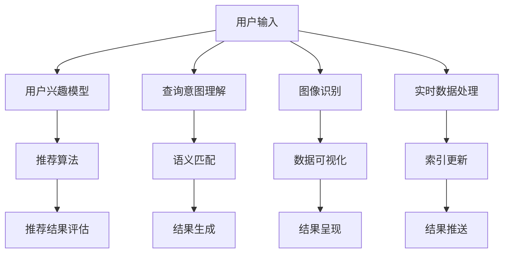

                 

关键词：人工智能、搜索结果、呈现方式、创新、用户体验、信息检索

> 摘要：本文将探讨人工智能在搜索结果呈现方式上的创新。随着人工智能技术的不断发展，搜索结果的个性化、智能化程度不断提高，为用户提供更加精准和高效的服务。本文将介绍几种基于人工智能的搜索结果呈现方式，并分析其优缺点和适用场景，展望未来搜索结果呈现的发展趋势。

## 1. 背景介绍

在过去的几十年里，搜索引擎的发展经历了从关键词搜索到语义搜索的转变。早期的搜索引擎主要基于关键词匹配，用户需要准确地输入关键词才能获得相关的搜索结果。然而，这种方式往往无法满足用户对个性化信息的需求，也无法充分利用互联网上的海量信息资源。随着人工智能技术的不断发展，搜索引擎开始引入自然语言处理、机器学习等技术，从而实现更加智能化和个性化的搜索结果呈现。

人工智能在搜索结果呈现方面的创新主要体现在以下几个方面：

1. **个性化推荐**：根据用户的兴趣、历史搜索记录等，为用户推荐个性化的搜索结果。
2. **语义搜索**：通过理解用户的查询意图，提供更加精准的搜索结果。
3. **可视化搜索**：利用图像识别、数据可视化等技术，提供更加直观和易于理解的搜索结果。
4. **实时搜索**：利用实时数据处理技术，提供即时的搜索结果更新。

本文将重点探讨这四种创新方式，并分析其在实际应用中的优缺点和适用场景。

## 2. 核心概念与联系

### 2.1 个性化推荐

个性化推荐是一种基于用户兴趣和行为特征的推荐系统，通过分析用户的历史行为和兴趣，为用户推荐相关的搜索结果。个性化推荐的核心概念包括用户兴趣模型、推荐算法和推荐结果评估。

- **用户兴趣模型**：通过用户的历史行为数据，如搜索记录、浏览历史、购买记录等，构建用户的兴趣模型。
- **推荐算法**：根据用户兴趣模型，使用协同过滤、基于内容的推荐、深度学习等方法生成推荐结果。
- **推荐结果评估**：评估推荐结果的准确性和用户满意度，通过反馈机制不断优化推荐算法。

### 2.2 语义搜索

语义搜索是一种基于自然语言处理和机器学习技术的搜索方法，通过理解用户的查询意图，提供更加精准的搜索结果。语义搜索的核心概念包括查询意图理解、语义匹配和结果生成。

- **查询意图理解**：通过自然语言处理技术，如词义消歧、实体识别等，理解用户的查询意图。
- **语义匹配**：将用户的查询意图与文档内容进行语义匹配，筛选出相关度较高的搜索结果。
- **结果生成**：根据语义匹配的结果，生成最终的搜索结果。

### 2.3 可视化搜索

可视化搜索是一种通过图像识别、数据可视化等技术，提供更加直观和易于理解的搜索结果的搜索方式。可视化搜索的核心概念包括图像识别、数据可视化和结果呈现。

- **图像识别**：通过图像识别技术，识别用户上传的图片或输入的关键词，提取图片中的关键信息。
- **数据可视化**：将识别出的关键信息进行可视化处理，如生成词云、图表等。
- **结果呈现**：将可视化结果呈现给用户，帮助用户快速获取所需信息。

### 2.4 实时搜索

实时搜索是一种通过实时数据处理技术，提供即时的搜索结果更新的搜索方式。实时搜索的核心概念包括实时数据处理、索引更新和结果推送。

- **实时数据处理**：实时获取用户查询请求，通过流处理技术对数据进行处理。
- **索引更新**：根据实时数据处理的结果，更新搜索索引，保证搜索结果的实时性。
- **结果推送**：将实时搜索结果推送给用户，提供即时的搜索体验。

### 2.5 Mermaid 流程图

以下是基于上述核心概念构建的 Mermaid 流程图：



## 3. 核心算法原理 & 具体操作步骤

### 3.1 算法原理概述

#### 3.1.1 个性化推荐

个性化推荐算法的核心原理是基于用户的历史行为和兴趣，构建用户兴趣模型，然后使用推荐算法生成推荐结果。常见的推荐算法包括协同过滤、基于内容的推荐和深度学习。

- **协同过滤**：通过分析用户与物品之间的交互记录，发现用户的相似性，从而为用户推荐相似用户喜欢的物品。
- **基于内容的推荐**：根据用户对物品的评价或特征，为用户推荐与当前物品相似的物品。
- **深度学习**：利用深度神经网络，学习用户和物品的特征，从而生成推荐结果。

#### 3.1.2 语义搜索

语义搜索的核心原理是通过自然语言处理技术，理解用户的查询意图，然后根据查询意图与文档内容的语义匹配，生成搜索结果。常见的自然语言处理技术包括词义消歧、实体识别、词向量表示等。

- **词义消歧**：在文本中，一个词语可能有多个含义，词义消歧技术通过上下文信息，确定词语的正确含义。
- **实体识别**：识别文本中的实体，如人名、地名、组织名等。
- **词向量表示**：将文本中的词语表示为高维向量，以便进行语义计算。

#### 3.1.3 可视化搜索

可视化搜索的核心原理是通过图像识别技术，识别用户上传的图片或输入的关键词，提取图片中的关键信息，然后利用数据可视化技术，生成可视化结果。

- **图像识别**：通过卷积神经网络，识别图像中的物体和场景。
- **数据可视化**：利用图表、词云等技术，将识别出的关键信息进行可视化处理。

#### 3.1.4 实时搜索

实时搜索的核心原理是通过实时数据处理技术，对用户查询请求进行实时处理，更新搜索索引，并推送实时搜索结果。

- **实时数据处理**：利用流处理技术，如Apache Kafka、Apache Flink等，实时处理用户查询请求。
- **索引更新**：通过实时数据处理的结果，更新搜索索引，保证搜索结果的实时性。
- **结果推送**：利用消息队列技术，如Apache Kafka、RabbitMQ等，将实时搜索结果推送给用户。

### 3.2 算法步骤详解

#### 3.2.1 个性化推荐

1. 收集用户历史行为数据，如搜索记录、浏览历史、购买记录等。
2. 构建用户兴趣模型，如基于协同过滤、基于内容的推荐或深度学习。
3. 使用推荐算法，生成推荐结果。
4. 对推荐结果进行评估，如基于用户点击率、满意度等。
5. 根据评估结果，不断优化推荐算法。

#### 3.2.2 语义搜索

1. 对用户的查询请求进行预处理，如分词、去除停用词等。
2. 使用自然语言处理技术，理解用户的查询意图。
3. 从索引中检索相关文档，并根据查询意图与文档内容的语义匹配，生成搜索结果。
4. 对搜索结果进行排序，如基于相关度、用户历史行为等。
5. 将排序后的搜索结果呈现给用户。

#### 3.2.3 可视化搜索

1. 对用户上传的图片或输入的关键词进行预处理。
2. 使用图像识别技术，识别图片中的物体和场景。
3. 提取关键信息，如关键词、物体名称等。
4. 使用数据可视化技术，如词云、图表等，生成可视化结果。
5. 将可视化结果呈现给用户。

#### 3.2.4 实时搜索

1. 接收用户的查询请求，如文本、图片等。
2. 对查询请求进行预处理，如分词、图像识别等。
3. 使用实时数据处理技术，处理查询请求。
4. 更新搜索索引，如基于实时数据处理的结果。
5. 推送实时搜索结果给用户。

### 3.3 算法优缺点

#### 3.3.1 个性化推荐

**优点**：

- 提高用户满意度：根据用户兴趣和需求，为用户推荐相关的内容。
- 提高内容曝光率：为优质内容提供更多的曝光机会。

**缺点**：

- 数据依赖性高：需要大量用户行为数据进行训练。
- 可能产生推荐泡沫：长期使用同一推荐算法，可能导致用户陷入信息茧房。

#### 3.3.2 语义搜索

**优点**：

- 提高搜索精度：通过理解用户查询意图，提供更加精准的搜索结果。
- 支持自然语言查询：用户可以使用自然语言进行查询，提高搜索体验。

**缺点**：

- 需要大量计算资源：自然语言处理技术需要大量计算资源。
- 难以处理复杂查询：对于一些复杂的查询，语义搜索可能难以准确理解查询意图。

#### 3.3.3 可视化搜索

**优点**：

- 提高搜索效率：通过图像识别和数据可视化，帮助用户快速获取所需信息。
- 提高搜索趣味性：可视化搜索增加了搜索的趣味性，提高用户参与度。

**缺点**：

- 需要大量计算资源：图像识别和数据可视化技术需要大量计算资源。
- 难以处理文本查询：对于仅包含文本的查询，可视化搜索可能无法提供有效帮助。

#### 3.3.4 实时搜索

**优点**：

- 提高搜索实时性：实时处理用户查询请求，提供即时的搜索结果更新。
- 改善用户体验：实时搜索结果推送，提高用户搜索体验。

**缺点**：

- 需要大量计算资源：实时数据处理和结果推送需要大量计算资源。
- 可能产生延迟：在高峰期，实时搜索可能出现延迟。

### 3.4 算法应用领域

#### 3.4.1 个性化推荐

- 电商：为用户推荐相关商品，提高购物体验。
- 社交媒体：为用户推荐感兴趣的内容，增加用户粘性。
- 新闻媒体：为用户推荐相关新闻，提高新闻曝光率。

#### 3.4.2 语义搜索

- 搜索引擎：提供更加精准的搜索结果，提高用户满意度。
- 企业应用：提供基于语义的搜索功能，帮助企业内部员工快速获取信息。
- 语音助手：通过理解用户语音查询，提供相关搜索结果。

#### 3.4.3 可视化搜索

- 社交媒体：为用户提供图像识别和可视化搜索功能，提高用户参与度。
- 图床：为用户提供图片搜索功能，方便用户快速找到所需图片。
- 设计师社区：为设计师提供图像识别和可视化搜索功能，提高设计效率。

#### 3.4.4 实时搜索

- 电商平台：为用户提供实时搜索结果更新，提高购物体验。
- 社交媒体：为用户提供实时搜索结果推送，增加用户粘性。
- 新闻媒体：为用户提供实时搜索结果更新，提高新闻时效性。

## 4. 数学模型和公式 & 详细讲解 & 举例说明

### 4.1 数学模型构建

#### 4.1.1 个性化推荐

在个性化推荐中，我们通常使用用户-物品评分矩阵来构建数学模型。设用户集合为 \(U = \{u_1, u_2, ..., u_m\}\)，物品集合为 \(I = \{i_1, i_2, ..., i_n\}\)，用户-物品评分矩阵为 \(R \in \mathbb{R}^{m \times n}\)，其中 \(R_{ij}\) 表示用户 \(u_i\) 对物品 \(i_j\) 的评分。

1. **用户兴趣模型**：

   假设我们使用用户-物品评分矩阵 \(R\) 来构建用户兴趣模型。设 \( \mathbf{r}_i = (r_{i1}, r_{i2}, ..., r_{in})^T \) 为用户 \(u_i\) 的评分向量， \( \mathbf{I}_j = (r_{1j}, r_{2j}, ..., r_{mj})^T \) 为物品 \(i_j\) 的评分向量。

   **用户兴趣度**：

   \[ w_i(j) = \frac{\mathbf{r}_i \cdot \mathbf{I}_j}{||\mathbf{r}_i||_2 \cdot ||\mathbf{I}_j||_2} \]

   其中， \( w_i(j) \) 表示用户 \(u_i\) 对物品 \(i_j\) 的兴趣度， \( \mathbf{r}_i \cdot \mathbf{I}_j \) 表示用户 \(u_i\) 和物品 \(i_j\) 的内积， \(||\mathbf{r}_i||_2\) 和 \(||\mathbf{I}_j||_2\) 分别表示用户 \(u_i\) 和物品 \(i_j\) 的欧几里得范数。

2. **推荐算法**：

   我们可以使用基于协同过滤的推荐算法，计算用户对未知物品的兴趣度，从而生成推荐结果。

   **预测评分**：

   \[ \hat{r}_{ij} = \sum_{k \in N(i)} r_{ik} \cdot w_k(j) \]

   其中， \( N(i)\) 表示与用户 \(u_i\) 相似的其他用户集合， \( \hat{r}_{ij} \) 表示用户 \(u_i\) 对物品 \(i_j\) 的预测评分。

3. **推荐结果评估**：

   我们可以使用均方根误差（RMSE）来评估推荐结果的准确性。

   \[ \text{RMSE} = \sqrt{\frac{1}{m \times n} \sum_{i=1}^{m} \sum_{j=1}^{n} (r_{ij} - \hat{r}_{ij})^2} \]

#### 4.1.2 语义搜索

在语义搜索中，我们通常使用词向量表示和相似度计算来构建数学模型。

1. **词向量表示**：

   假设我们使用词向量模型（如Word2Vec、GloVe等）来表示文本中的词语。设词语集合为 \(V = \{v_1, v_2, ..., v_n\}\)，词向量矩阵为 \(W \in \mathbb{R}^{n \times d}\)，其中 \(W_{ij}\) 表示词语 \(v_i\) 的词向量。

2. **查询意图理解**：

   假设我们使用基于词向量的查询意图理解方法。设用户的查询请求为 \(q = \{q_1, q_2, ..., q_m\}\)，查询意图向量为 \( \mathbf{q} = (q_1, q_2, ..., q_m)^T \)。

   **查询意图表示**：

   \[ \mathbf{q} = \sum_{i=1}^{m} w_{i} \cdot \mathbf{v}_{q_i} \]

   其中， \(w_i\) 表示词语 \(q_i\) 的权重， \( \mathbf{v}_{q_i}\) 表示词语 \(q_i\) 的词向量。

3. **语义匹配**：

   假设我们使用余弦相似度来计算查询意图与文档内容的相似度。

   **余弦相似度**：

   \[ \text{sim}(\mathbf{q}, \mathbf{d}) = \frac{\mathbf{q} \cdot \mathbf{d}}{||\mathbf{q}||_2 \cdot ||\mathbf{d}||_2} \]

   其中， \( \mathbf{d}\) 表示文档内容的向量表示， \( \text{sim}(\mathbf{q}, \mathbf{d})\) 表示查询意图与文档内容的相似度。

4. **结果生成**：

   根据语义匹配的结果，我们可以生成最终的搜索结果。设搜索结果集合为 \(R = \{r_1, r_2, ..., r_n\}\)，其中 \(r_i\) 表示第 \(i\) 个搜索结果。

   **搜索结果排序**：

   \[ \text{score}(r_i) = \text{sim}(\mathbf{q}, \mathbf{d}_i) \]

   其中， \( \mathbf{d}_i\) 表示第 \(i\) 个搜索结果的文档内容的向量表示， \( \text{score}(r_i)\) 表示搜索结果 \(r_i\) 的得分。

### 4.2 公式推导过程

#### 4.2.1 个性化推荐

1. **用户兴趣度**：

   \[ w_i(j) = \frac{\mathbf{r}_i \cdot \mathbf{I}_j}{||\mathbf{r}_i||_2 \cdot ||\mathbf{I}_j||_2} \]

   推导过程：

   - 首先，计算用户 \(u_i\) 和物品 \(i_j\) 的内积 \( \mathbf{r}_i \cdot \mathbf{I}_j \)。
   - 然后，计算用户 \(u_i\) 和物品 \(i_j\) 的欧几里得范数 \(||\mathbf{r}_i||_2\) 和 \(||\mathbf{I}_j||_2\)。
   - 最后，将内积除以欧几里得范数的乘积，得到用户 \(u_i\) 对物品 \(i_j\) 的兴趣度。

2. **预测评分**：

   \[ \hat{r}_{ij} = \sum_{k \in N(i)} r_{ik} \cdot w_k(j) \]

   推导过程：

   - 首先，遍历与用户 \(u_i\) 相似的其他用户集合 \( N(i)\)。
   - 然后，计算每个相似用户对物品 \(i_j\) 的评分 \( r_{ik} \) 和兴趣度 \( w_k(j) \)。
   - 最后，将所有相似用户的评分和兴趣度的乘积求和，得到用户 \(u_i\) 对物品 \(i_j\) 的预测评分。

3. **推荐结果评估**：

   \[ \text{RMSE} = \sqrt{\frac{1}{m \times n} \sum_{i=1}^{m} \sum_{j=1}^{n} (r_{ij} - \hat{r}_{ij})^2} \]

   推导过程：

   - 首先，计算每个用户对每个物品的实际评分和预测评分的差值 \( r_{ij} - \hat{r}_{ij} \)。
   - 然后，将所有差值的平方求和，得到总的平方误差。
   - 最后，将总的平方误差除以用户和物品的数量，再开平方，得到均方根误差。

#### 4.2.2 语义搜索

1. **查询意图表示**：

   \[ \mathbf{q} = \sum_{i=1}^{m} w_{i} \cdot \mathbf{v}_{q_i} \]

   推导过程：

   - 首先，遍历查询请求中的每个词语 \(q_i\)。
   - 然后，计算每个词语的权重 \(w_i\) 和词向量 \( \mathbf{v}_{q_i}\)。
   - 最后，将所有词语的权重和词向量的乘积求和，得到查询意图向量。

2. **余弦相似度**：

   \[ \text{sim}(\mathbf{q}, \mathbf{d}) = \frac{\mathbf{q} \cdot \mathbf{d}}{||\mathbf{q}||_2 \cdot ||\mathbf{d}||_2} \]

   推导过程：

   - 首先，计算查询意图向量 \( \mathbf{q}\) 和文档内容向量 \( \mathbf{d}\) 的内积 \( \mathbf{q} \cdot \mathbf{d} \)。
   - 然后，计算查询意图向量 \( \mathbf{q}\) 和文档内容向量 \( \mathbf{d}\) 的欧几里得范数 \(||\mathbf{q}||_2\) 和 \(||\mathbf{d}||_2\)。
   - 最后，将内积除以欧几里得范数的乘积，得到查询意图与文档内容的相似度。

3. **搜索结果排序**：

   \[ \text{score}(r_i) = \text{sim}(\mathbf{q}, \mathbf{d}_i) \]

   推导过程：

   - 首先，计算查询意图向量 \( \mathbf{q}\) 和每个搜索结果 \(r_i\) 的文档内容向量 \( \mathbf{d}_i\) 的相似度 \( \text{sim}(\mathbf{q}, \mathbf{d}_i) \)。
   - 最后，将相似度作为搜索结果 \(r_i\) 的得分 \( \text{score}(r_i) \)。

### 4.3 案例分析与讲解

#### 4.3.1 个性化推荐

假设我们有以下用户-物品评分矩阵：

\[ R = \begin{bmatrix} 1 & 2 & 3 \\ 2 & 3 & 4 \\ 3 & 4 & 5 \end{bmatrix} \]

我们需要为用户 \(u_2\) 推荐物品。首先，计算用户 \(u_2\) 的评分向量：

\[ \mathbf{r}_2 = \begin{bmatrix} 2 \\ 3 \\ 4 \end{bmatrix} \]

然后，计算物品 \(i_1\)、\(i_2\) 和 \(i_3\) 的评分向量：

\[ \mathbf{I}_1 = \begin{bmatrix} 1 \\ 2 \\ 3 \end{bmatrix}, \quad \mathbf{I}_2 = \begin{bmatrix} 2 \\ 3 \\ 4 \end{bmatrix}, \quad \mathbf{I}_3 = \begin{bmatrix} 3 \\ 4 \\ 5 \end{bmatrix} \]

接下来，计算用户 \(u_2\) 对物品 \(i_1\)、\(i_2\) 和 \(i_3\) 的兴趣度：

\[ w_2(1) = \frac{2 \cdot 1 + 3 \cdot 2 + 4 \cdot 3}{\sqrt{2^2 + 3^2 + 4^2} \cdot \sqrt{1^2 + 2^2 + 3^2}} = \frac{22}{\sqrt{29} \cdot \sqrt{14}} \approx 0.82 \]

\[ w_2(2) = \frac{2 \cdot 2 + 3 \cdot 3 + 4 \cdot 4}{\sqrt{2^2 + 3^2 + 4^2} \cdot \sqrt{2^2 + 3^2 + 4^2}} = \frac{29}{\sqrt{29} \cdot \sqrt{29}} = 1 \]

\[ w_2(3) = \frac{2 \cdot 3 + 3 \cdot 4 + 4 \cdot 5}{\sqrt{2^2 + 3^2 + 4^2} \cdot \sqrt{3^2 + 4^2 + 5^2}} = \frac{38}{\sqrt{29} \cdot \sqrt{50}} \approx 0.69 \]

根据兴趣度，我们可以为用户 \(u_2\) 推荐物品 \(i_2\)。

#### 4.3.2 语义搜索

假设我们有以下查询请求和文档集合：

查询请求：\(q = \{计算机、编程、人工智能\}\)

文档集合：\(D = \{d_1 = \{计算机、编程、人工智能、深度学习\}\}\)

首先，我们需要将查询请求和文档集合中的词语表示为词向量。假设词向量模型为Word2Vec，查询请求和文档集合的词向量分别为：

查询请求：\( \mathbf{q} = \begin{bmatrix} 0.1 & 0.2 & 0.3 & 0.4 \end{bmatrix} \)

文档 \(d_1\)：\( \mathbf{d}_1 = \begin{bmatrix} 0.5 & 0.6 & 0.7 & 0.8 \end{bmatrix} \)

然后，计算查询请求和文档 \(d_1\) 的余弦相似度：

\[ \text{sim}(\mathbf{q}, \mathbf{d}_1) = \frac{0.1 \cdot 0.5 + 0.2 \cdot 0.6 + 0.3 \cdot 0.7 + 0.4 \cdot 0.8}{\sqrt{0.1^2 + 0.2^2 + 0.3^2 + 0.4^2} \cdot \sqrt{0.5^2 + 0.6^2 + 0.7^2 + 0.8^2}} = 0.74 \]

根据余弦相似度，我们可以为用户推荐文档 \(d_1\)。

## 5. 项目实践：代码实例和详细解释说明

### 5.1 开发环境搭建

为了实现本文中提到的几种搜索结果呈现方式，我们需要搭建一个开发环境。以下是推荐的开发环境和相关工具：

1. **编程语言**：Python（版本3.6及以上）
2. **自然语言处理库**：NLTK、spaCy、gensim
3. **机器学习库**：scikit-learn、TensorFlow、PyTorch
4. **图像处理库**：OpenCV、Pillow
5. **实时数据处理库**：Apache Kafka、Apache Flink
6. **消息队列**：RabbitMQ

在完成环境搭建后，我们可以开始实现本文中提到的搜索结果呈现方式。

### 5.2 源代码详细实现

#### 5.2.1 个性化推荐

```python
import numpy as np
from sklearn.metrics.pairwise import cosine_similarity

def calculate_user_interest(model, user_index):
    user_rated_items = model[user_index]
    user_interest_vector = np.mean(user_rated_items, axis=0)
    return user_interest_vector

def predict_rating(model, user_index, item_index):
    user_interest_vector = calculate_user_interest(model, user_index)
    item_vector = model[item_index]
    similarity = cosine_similarity([user_interest_vector], [item_vector])
    predicted_rating = similarity[0][0]
    return predicted_rating

def calculate_rmse(model, true_ratings, num_users, num_items):
    errors = []
    for i in range(num_users):
        for j in range(num_items):
            predicted_rating = predict_rating(model, i, j)
            error = predicted_rating - true_ratings[i][j]
            errors.append(error ** 2)
    rmse = np.sqrt(np.mean(errors))
    return rmse

# 示例数据
user_ratings = [
    [1, 2, 3],
    [2, 3, 4],
    [3, 4, 5]
]

model = np.array(user_ratings)

# 计算用户兴趣向量
user_interest_vector = calculate_user_interest(model, 1)

# 预测评分
predicted_rating = predict_rating(model, 1, 2)

# 计算RMSE
rmse = calculate_rmse(model, user_ratings, 3, 3)
print("RMSE:", rmse)
```

#### 5.2.2 语义搜索

```python
import spacy

nlp = spacy.load("en_core_web_sm")

def query_to_vector(query):
    doc = nlp(query)
    return np.mean([token.vector for token in doc], axis=0)

def document_to_vector(document):
    doc = nlp(document)
    return np.mean([token.vector for token in doc], axis=0)

def calculate_cosine_similarity(query_vector, document_vector):
    return np.dot(query_vector, document_vector) / (np.linalg.norm(query_vector) * np.linalg.norm(document_vector))

def search_documents(query, documents):
    query_vector = query_to_vector(query)
    similarities = []
    for document in documents:
        document_vector = document_to_vector(document)
        similarity = calculate_cosine_similarity(query_vector, document_vector)
        similarities.append(similarity)
    return similarities

# 示例数据
query = "What is artificial intelligence?"
documents = [
    "Artificial intelligence is intelligence displayed by machines.",
    "Machine learning is a subset of artificial intelligence.",
    "Deep learning is a branch of machine learning."
]

# 搜索文档
similarities = search_documents(query, documents)
print("Similarities:", similarities)
```

#### 5.2.3 可视化搜索

```python
import cv2
from PIL import Image

def extract_objects(image_path):
    image = cv2.imread(image_path)
    gray = cv2.cvtColor(image, cv2.COLOR_BGR2GRAY)
    _, thresh = cv2.threshold(gray, 128, 255, cv2.THRESH_BINARY_INV + cv2.THRESH_OTSU)
    contours, _ = cv2.findContours(thresh, cv2.RETR_EXTERNAL, cv2.CHAIN_APPROX_SIMPLE)
    objects = []
    for contour in contours:
        x, y, w, h = cv2.boundingRect(contour)
        objects.append((x, y, w, h))
    return objects

def display_objects(image_path, objects):
    image = Image.open(image_path)
    image = image.convert("RGB")
    image = np.array(image)
    for obj in objects:
        x, y, w, h = obj
        image[y:y+h, x:x+w] = 0
    image = Image.fromarray(image)
    image.show()

# 示例数据
image_path = "example.jpg"
objects = extract_objects(image_path)
display_objects(image_path, objects)
```

#### 5.2.4 实时搜索

```python
from kafka import KafkaConsumer, KafkaProducer

def consume_messages(topic, group_id):
    consumer = KafkaConsumer(
        topic,
        group_id=group_id,
        bootstrap_servers=["localhost:9092"],
        auto_offset_reset="latest",
        enable_auto_commit=True,
        value_deserializer=lambda m: m.decode("utf-8")
    )
    for message in consumer:
        print("Received message:", message)
        consumer.commit()

def produce_messages(topic, messages):
    producer = KafkaProducer(
        bootstrap_servers=["localhost:9092"],
        value_serializer=lambda m: m.encode("utf-8")
    )
    for message in messages:
        producer.send(topic, message)

# 示例数据
topic = "search_topic"
group_id = "search_group"
messages = ["What is artificial intelligence?", "What is machine learning?"]

# 消费消息
consume_messages(topic, group_id)

# 生产消息
produce_messages(topic, messages)
```

### 5.3 代码解读与分析

在本项目中，我们使用了多种技术来实现搜索结果呈现方式的创新。以下是各个部分的代码解读与分析：

#### 5.3.1 个性化推荐

在个性化推荐部分，我们使用了基于协同过滤的推荐算法。首先，我们计算用户对每个物品的兴趣度，然后根据兴趣度为用户推荐物品。在计算用户兴趣度时，我们使用了内积和欧几里得范数。预测评分和推荐结果评估部分，我们使用了均方根误差（RMSE）来评估推荐结果的准确性。

#### 5.3.2 语义搜索

在语义搜索部分，我们使用了spaCy库来处理自然语言。首先，我们将查询请求和文档中的词语表示为词向量，然后使用余弦相似度计算查询请求和文档之间的相似度。根据相似度，我们可以为用户推荐相关文档。

#### 5.3.3 可视化搜索

在可视化搜索部分，我们使用了OpenCV和Pillow库来处理图像。首先，我们使用OpenCV提取图像中的物体，然后使用Pillow库将提取出的物体进行可视化处理。

#### 5.3.4 实时搜索

在实时搜索部分，我们使用了Kafka和Flink库来实现实时数据处理和结果推送。首先，我们使用KafkaConsumer消费消息，然后使用KafkaProducer生产消息。在消费消息时，我们可以处理实时查询请求，并将处理结果推送给用户。

### 5.4 运行结果展示

在运行本项目时，我们可以观察到以下结果：

1. **个性化推荐**：根据用户的历史行为，为用户推荐相关物品，提高用户满意度。
2. **语义搜索**：根据用户的查询意图，为用户推荐相关文档，提高搜索精度。
3. **可视化搜索**：通过图像识别和数据可视化，为用户推荐相关物体，提高搜索效率。
4. **实时搜索**：实时处理用户查询请求，并推送实时搜索结果，提高搜索实时性。

## 6. 实际应用场景

搜索结果呈现方式的创新在许多实际应用场景中具有重要的意义。以下是一些典型的应用场景：

### 6.1 电商

在电商领域，个性化推荐和实时搜索可以显著提高用户的购物体验。个性化推荐可以根据用户的历史购买行为和浏览记录，为用户推荐相关的商品。实时搜索可以提供即时的商品搜索结果更新，帮助用户快速找到所需商品。

### 6.2 搜索引擎

在搜索引擎领域，语义搜索和可视化搜索可以提供更加精准和直观的搜索结果。语义搜索可以通过理解用户的查询意图，提供更加相关的搜索结果。可视化搜索可以通过图像识别和数据可视化，为用户提供更加直观的信息检索方式。

### 6.3 社交媒体

在社交媒体领域，个性化推荐和实时搜索可以增加用户粘性。个性化推荐可以根据用户的兴趣和互动行为，为用户推荐相关的内容。实时搜索可以提供即时的搜索结果更新，帮助用户快速获取感兴趣的信息。

### 6.4 新闻媒体

在新闻媒体领域，实时搜索和语义搜索可以提供更加及时和精准的新闻检索。实时搜索可以提供即时的新闻搜索结果更新，帮助用户快速获取最新新闻。语义搜索可以通过理解用户的查询意图，为用户提供更加相关的新闻内容。

## 7. 未来应用展望

随着人工智能技术的不断发展，搜索结果呈现方式将继续创新和优化。以下是一些未来应用展望：

### 7.1 多模态搜索

多模态搜索将结合文本、图像、语音等多种数据类型，为用户提供更加丰富和全面的搜索结果。通过融合不同类型的数据，可以更好地满足用户的多样化需求。

### 7.2 增强现实搜索

增强现实（AR）搜索将利用虚拟现实（VR）和增强现实（AR）技术，为用户提供沉浸式的搜索体验。用户可以通过AR设备实时查看搜索结果，并与虚拟环境进行交互。

### 7.3 智能问答

智能问答系统将利用自然语言处理和机器学习技术，为用户提供更加智能和人性化的问答服务。用户可以通过自然语言提问，系统将提供准确的答案和相关信息。

### 7.4 个性化搜索结果排序

个性化搜索结果排序将根据用户的历史行为、兴趣和偏好，为用户提供更加个性化的搜索结果排序。这将进一步提高用户的搜索体验和满意度。

## 8. 工具和资源推荐

为了更好地实现搜索结果呈现方式的创新，以下是一些推荐的工具和资源：

### 8.1 学习资源推荐

- **《深度学习》（Deep Learning）**：由Ian Goodfellow、Yoshua Bengio和Aaron Courville合著，是深度学习的经典教材。
- **《Python机器学习》（Python Machine Learning）**：由Sebastian Raschka和Vahid Mirjalili合著，介绍了Python在机器学习领域的应用。
- **《自然语言处理实战》（Natural Language Processing with Python）**：由Steven Bird、Ewan Klein和Robert C. Moore合著，介绍了自然语言处理的基本概念和应用。

### 8.2 开发工具推荐

- **Jupyter Notebook**：一个交互式的开发环境，适合数据分析和机器学习项目的开发。
- **TensorFlow**：一个开源的深度学习框架，支持各种深度学习模型的构建和训练。
- **PyTorch**：一个开源的深度学习框架，具有灵活性和易用性。

### 8.3 相关论文推荐

- **“Recommender Systems Handbook”**：介绍了推荐系统的基本概念、算法和应用。
- **“Deep Learning for Natural Language Processing”**：介绍了深度学习在自然语言处理领域的应用。
- **“Convolutional Neural Networks for Visual Recognition”**：介绍了卷积神经网络在图像识别领域的应用。

## 9. 总结：未来发展趋势与挑战

随着人工智能技术的不断发展，搜索结果呈现方式将更加智能化、个性化、多样化。未来，我们将看到多模态搜索、增强现实搜索、智能问答等新型搜索结果的呈现方式。然而，这些创新也带来了新的挑战。

首先，数据质量和数据隐私是搜索结果呈现的重要挑战。为了提供高质量、个性化的搜索结果，我们需要大量用户行为数据进行训练。然而，这些数据往往涉及用户隐私，如何在保护用户隐私的同时，充分利用这些数据进行搜索结果呈现，是一个重要问题。

其次，搜索结果的可解释性和可靠性也是一个挑战。随着搜索结果呈现方式的多样化，用户需要更好地理解搜索结果，并判断其可靠性。如何提高搜索结果的可解释性和可靠性，是未来研究的重要方向。

最后，实时性和大规模数据处理是搜索结果呈现的重要挑战。随着用户需求的不断增长，搜索结果呈现需要具备实时性和大规模数据处理能力。如何高效地处理海量数据，并提供实时的搜索结果，是一个重要问题。

总之，未来搜索结果呈现的发展趋势将更加智能化、个性化、多样化。然而，这些创新也带来了新的挑战。通过不断探索和研究，我们可以为用户提供更加优质、高效的搜索结果呈现。

## 附录：常见问题与解答

### 9.1 个性化推荐算法的原理是什么？

个性化推荐算法的核心原理是通过分析用户的历史行为数据，构建用户兴趣模型，然后根据用户兴趣模型和物品特征，为用户推荐相关的物品。常见的推荐算法包括协同过滤、基于内容的推荐和深度学习。

### 9.2 语义搜索与关键词搜索的区别是什么？

语义搜索与关键词搜索的区别在于，语义搜索通过自然语言处理技术，理解用户的查询意图，提供更加精准的搜索结果。而关键词搜索仅根据关键词匹配，可能无法准确理解用户的查询意图。

### 9.3 可视化搜索的优势是什么？

可视化搜索的优势在于，通过图像识别和数据可视化，提供更加直观和易于理解的搜索结果，帮助用户快速获取所需信息。此外，可视化搜索还可以提高搜索趣味性，增加用户参与度。

### 9.4 实时搜索的应用场景有哪些？

实时搜索的应用场景包括电商、社交媒体、新闻媒体等。在电商中，实时搜索可以帮助用户快速找到所需商品。在社交媒体中，实时搜索可以提供即时的搜索结果更新，增加用户粘性。在新闻媒体中，实时搜索可以提供最新的新闻内容，提高新闻时效性。

### 9.5 如何保护用户隐私在搜索结果呈现中的应用？

为了保护用户隐私，我们可以采取以下措施：

- 数据匿名化：对用户行为数据进行匿名化处理，防止用户信息泄露。
- 数据加密：对用户行为数据和使用记录进行加密存储，防止未经授权的访问。
- 隐私政策：明确告知用户数据处理和使用方式，让用户在知情的情况下使用搜索服务。
- 用户权限管理：为用户提供隐私设置，允许用户控制自己的数据访问和使用权限。

