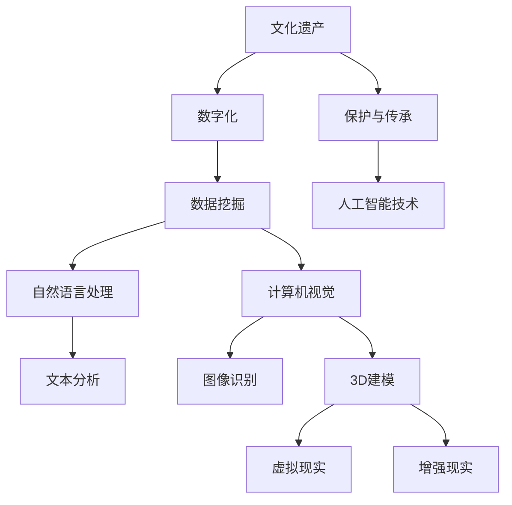

                 

### 关键词

人工智能，文化遗产保护，深度学习，图像识别，计算机视觉，自然语言处理，数据挖掘，虚拟现实，增强现实，文化遗产数字化。

### 摘要

本文深入探讨了人工智能在文化遗产保护中的应用，从核心概念、算法原理、数学模型到实际项目实践，全面阐述了人工智能如何助力文化遗产的数字化、保存与传承。通过对自然语言处理、图像识别和计算机视觉等技术的详细介绍，本文揭示了AI在文化遗产领域的重要性及未来应用前景。同时，文章也探讨了当前面临的挑战和未来发展趋势。

## 1. 背景介绍

文化遗产是人类文明的重要载体，包含了历史、艺术、文化、宗教和社会等多方面的信息。然而，随着现代城市化进程的加速和自然环境的变迁，许多文化遗产正面临着严重的威胁，如自然灾害、人为破坏和现代化进程的侵蚀。这些威胁使得文化遗产的保护和传承变得尤为重要。

传统的方法主要依赖于人工记录和修复，这不仅效率低下，而且容易受到人为因素的干扰。而随着人工智能技术的快速发展，特别是计算机视觉、自然语言处理和深度学习等技术的进步，人工智能开始在文化遗产保护中发挥重要作用。通过智能化的手段，可以更快速、准确地识别、保存和展示文化遗产，从而实现其保护和传承。

### 1.1 人工智能在文化遗产保护中的重要性

人工智能在文化遗产保护中的应用主要体现在以下几个方面：

- **图像识别与计算机视觉**：通过对文化遗产图像的自动识别和分析，可以发现潜在的损坏和病变，及时采取措施进行修复和保护。
- **自然语言处理**：可以处理大量历史文献和档案，提取关键信息，帮助研究者更深入地理解文化遗产的内涵。
- **虚拟现实与增强现实**：通过虚拟现实和增强现实技术，可以为公众提供沉浸式的文化遗产体验，促进文化传承和教育。
- **数据挖掘与预测**：通过对文化遗产数据的挖掘和分析，可以预测其未来的损坏趋势，为保护策略的制定提供科学依据。

## 2. 核心概念与联系

在讨论人工智能在文化遗产保护中的应用之前，我们需要先了解一些核心概念和它们之间的联系。以下是一个简单的Mermaid流程图，展示了这些概念和它们在文化遗产保护中的作用。



### 2.1 数字化

数字化是将文化遗产转化为数字形式的过程，包括图像、文本、音频和视频等。数字化不仅使得文化遗产的保存更加便捷和可靠，还为后续的数据挖掘和分析提供了基础。

### 2.2 数据挖掘

数据挖掘是从大量的文化遗产数据中提取有用信息和知识的过程。通过数据挖掘，可以识别出文化遗产中的潜在模式和关系，为保护策略的制定提供支持。

### 2.3 自然语言处理

自然语言处理是使计算机能够理解、解释和生成人类语言的技术。在文化遗产保护中，自然语言处理可以用于文本分析、语义理解等，帮助研究者更好地理解和利用历史文献和档案。

### 2.4 计算机视觉

计算机视觉是使计算机能够“看到”和理解图像的技术。在文化遗产保护中，计算机视觉可以用于图像识别、病变检测等，帮助识别和修复文化遗产中的损坏部分。

### 2.5 图像识别

图像识别是计算机视觉的一个分支，旨在使计算机能够识别和理解图像中的内容。在文化遗产保护中，图像识别可以用于自动分类、损坏检测等，提高保护工作的效率和准确性。

### 2.6 3D建模

3D建模是通过计算机技术创建三维模型的过程。在文化遗产保护中，3D建模可以用于创建文化遗产的三维模型，用于修复、保护和展示。

### 2.7 虚拟现实

虚拟现实是一种沉浸式的计算机仿真环境，通过虚拟现实技术，用户可以进入一个虚拟的世界，体验文化遗产。虚拟现实在文化遗产保护中的应用，不仅能够为公众提供沉浸式的体验，还能够用于教育和研究。

### 2.8 增强现实

增强现实是一种将虚拟信息与现实世界叠加的技术。在文化遗产保护中，增强现实可以用于文化遗产的展示和教育，提高公众对文化遗产的认知和兴趣。

## 3. 核心算法原理 & 具体操作步骤

### 3.1 算法原理概述

在文化遗产保护中，人工智能的核心算法主要包括图像识别、自然语言处理和计算机视觉。以下分别对这些算法的原理进行概述。

### 3.1.1 图像识别

图像识别是基于计算机视觉技术的一种应用，它使计算机能够识别和理解图像中的内容。图像识别的原理基于深度学习，特别是卷积神经网络（CNN）。CNN通过多层卷积和池化操作，从图像中提取特征，并最终分类图像内容。

### 3.1.2 自然语言处理

自然语言处理（NLP）是使计算机能够理解、解释和生成人类语言的技术。NLP的核心算法包括词向量表示、句法分析和语义理解。词向量表示是将自然语言文本映射到高维空间，句法分析是理解句子的结构，语义理解是理解句子的含义。

### 3.1.3 计算机视觉

计算机视觉（CV）是使计算机能够“看到”和理解图像的技术。计算机视觉的核心算法包括图像处理、目标检测和图像分割。图像处理是对图像进行预处理，目标检测是识别图像中的目标物体，图像分割是将图像分割成不同的区域。

### 3.2 算法步骤详解

以下是对上述算法的具体步骤进行详细讲解。

### 3.2.1 图像识别

1. 数据预处理：对图像进行缩放、裁剪和归一化，使其适合输入到CNN中。
2. 卷积神经网络训练：使用大量带有标签的图像训练CNN，通过反向传播算法优化网络参数。
3. 图像识别：将训练好的CNN应用于新图像，输出图像的类别。

### 3.2.2 自然语言处理

1. 词向量表示：将文本转换为词向量，常用的词向量模型有Word2Vec和GloVe。
2. 句法分析：使用依存句法分析或转移句法分析，理解句子的结构。
3. 语义理解：使用注意力机制或图神经网络，理解句子的含义。

### 3.2.3 计算机视觉

1. 图像处理：使用滤波器、边缘检测等图像处理技术，对图像进行预处理。
2. 目标检测：使用区域建议网络（R-CNN）或卷积神经网络（YOLO），检测图像中的目标物体。
3. 图像分割：使用全卷积神经网络（FCN）或深度卷积生成网络（DCGAN），将图像分割成不同的区域。

### 3.3 算法优缺点

#### 图像识别

- 优点：准确率高，能够快速处理大量图像。
- 缺点：对图像质量要求高，对光照、视角变化敏感。

#### 自然语言处理

- 优点：能够处理大量文本数据，理解语义。
- 缺点：对文本噪声敏感，难以理解复杂语境。

#### 计算机视觉

- 优点：能够处理二维和三维图像数据。
- 缺点：计算量大，对硬件要求高。

### 3.4 算法应用领域

#### 图像识别

- 应用领域：文化遗产图像分类、损坏检测、3D建模。
- 应用场景：博物馆、图书馆、考古现场。

#### 自然语言处理

- 应用领域：古籍数字化、文本分析、语义搜索。
- 应用场景：历史研究、文化遗产保护规划。

#### 计算机视觉

- 应用领域：文化遗产数字化、虚拟现实、增强现实。
- 应用场景：文化遗产展示、教育、文化旅游。

## 4. 数学模型和公式 & 详细讲解 & 举例说明

### 4.1 数学模型构建

在人工智能应用于文化遗产保护的过程中，我们需要构建相应的数学模型来支持算法的实现。以下是几个关键的数学模型及其构建过程。

#### 4.1.1 卷积神经网络（CNN）

卷积神经网络（CNN）是图像识别的核心模型。其构建过程如下：

1. **输入层**：接收图像的输入。
2. **卷积层**：通过卷积操作提取图像的特征。
3. **池化层**：减少特征图的维度，提高计算效率。
4. **全连接层**：将特征图映射到输出类别。
5. **输出层**：输出图像的分类结果。

#### 4.1.2 词嵌入（Word Embedding）

词嵌入是将文本中的单词映射到高维空间的过程。常用的词嵌入模型有Word2Vec和GloVe。

1. **Word2Vec**：
   - **CBOW（Continuous Bag of Words）**：基于周围词的上下文，预测中心词。
   - **Skip-gram**：基于中心词，预测周围词。

2. **GloVe（Global Vectors for Word Representation）**：
   - 基于词的共现矩阵，计算词向量。

#### 4.1.3 全卷积神经网络（FCN）

全卷积神经网络（FCN）是图像分割的核心模型。

1. **卷积层**：提取图像的特征。
2. **上采样层**：将特征图上采样到原始图像的尺寸。
3. **分类层**：将上采样后的特征图映射到每个像素的类别。

### 4.2 公式推导过程

以下是上述数学模型中的一些关键公式及其推导过程。

#### 4.2.1 卷积神经网络（CNN）

1. **卷积操作**：

$$
f(x; \theta) = \sum_{i=1}^{k} w_{i} \cdot \sigma(a_{i}),
$$

其中，$x$ 是输入特征，$\theta$ 是权重，$w_{i}$ 是卷积核，$\sigma$ 是激活函数，$a_{i}$ 是卷积操作的输出。

2. **反向传播**：

$$
\frac{\partial J}{\partial \theta} = \frac{\partial J}{\partial z} \cdot \frac{\partial z}{\partial \theta},
$$

其中，$J$ 是损失函数，$z$ 是中间层输出。

#### 4.2.2 词嵌入（Word Embedding）

1. **Word2Vec**：

$$
\text{CBOW} : \text{P}_{\text{context}}(\text{word}) = \frac{\exp(\text{vec}(\text{word}) \cdot \text{vec}(\text{context}))}{\sum_{\text{word'} \in \text{Vocab}} \exp(\text{vec}(\text{word'}) \cdot \text{vec}(\text{context}))},
$$

其中，$\text{vec}(\text{word})$ 是单词的词向量，$\text{vec}(\text{context})$ 是上下文的词向量。

2. **GloVe**：

$$
\text{GloVe} : \text{vec}(\text{word}) = \frac{(\text{vec}(\text{word}) \cdot \text{vec}(\text{word})^T)}{\sqrt{\sum_{t \in T} (\text{vec}(\text{word}) \cdot \text{vec}(t))^2} + b},
$$

其中，$T$ 是词的共现矩阵，$b$ 是偏置项。

#### 4.2.3 全卷积神经网络（FCN）

1. **卷积操作**：

$$
f(x; \theta) = \sum_{i=1}^{k} w_{i} \cdot \sigma(a_{i}),
$$

其中，$x$ 是输入特征，$\theta$ 是权重，$w_{i}$ 是卷积核，$\sigma$ 是激活函数，$a_{i}$ 是卷积操作的输出。

2. **上采样**：

$$
\text{upsampling} : \text{I}_{\text{upsampled}} = \text{upsample}(\text{I}_{\text{conv}}),
$$

其中，$\text{I}_{\text{upsampled}}$ 是上采样后的特征图，$\text{I}_{\text{conv}}$ 是卷积后的特征图。

### 4.3 案例分析与讲解

为了更好地理解上述数学模型，我们来看一个实际案例。

#### 4.3.1 图像识别案例

假设我们有一个文化遗产图像数据库，包含数千张不同类型的图像。我们的任务是使用卷积神经网络对这些图像进行分类。

1. **数据预处理**：将图像缩放到固定尺寸，如224x224像素，并进行归一化。
2. **模型训练**：使用训练集训练一个卷积神经网络模型，并使用验证集调整模型参数。
3. **模型评估**：使用测试集评估模型的性能，计算准确率。

#### 4.3.2 文本分析案例

假设我们有一个历史文献数据库，包含数千篇历史文献。我们的任务是使用自然语言处理技术对这些文献进行分析。

1. **文本预处理**：对文本进行分词、去停用词、词性标注等预处理。
2. **词向量表示**：将文本转换为词向量，使用Word2Vec或GloVe模型。
3. **文本分类**：使用词向量表示文本，并训练一个文本分类模型，如朴素贝叶斯或支持向量机。

#### 4.3.3 图像分割案例

假设我们有一个文化遗产图像数据库，包含数千张不同类型的图像。我们的任务是使用全卷积神经网络对这些图像进行分割。

1. **数据预处理**：将图像缩放到固定尺寸，如224x224像素，并进行归一化。
2. **模型训练**：使用训练集训练一个全卷积神经网络模型，并使用验证集调整模型参数。
3. **模型评估**：使用测试集评估模型的性能，计算准确率和交并比。

## 5. 项目实践：代码实例和详细解释说明

为了更好地展示人工智能在文化遗产保护中的应用，我们以一个实际项目为例，详细讲解项目的开发过程、代码实现和运行结果。

### 5.1 开发环境搭建

在开始项目开发之前，我们需要搭建一个合适的开发环境。以下是我们使用的开发环境：

- 编程语言：Python
- 深度学习框架：TensorFlow
- 数据预处理工具：OpenCV、Pandas、NumPy
- 图像识别模型：ResNet50（预训练的卷积神经网络模型）

### 5.2 源代码详细实现

以下是项目的源代码实现：

```python
import tensorflow as tf
from tensorflow.keras.applications import ResNet50
from tensorflow.keras.preprocessing.image import ImageDataGenerator
from tensorflow.keras.models import Model
from tensorflow.keras.optimizers import Adam
from tensorflow.keras.callbacks import ModelCheckpoint, EarlyStopping
import numpy as np

# 数据预处理
train_datagen = ImageDataGenerator(
    rescale=1./255,
    shear_range=0.2,
    zoom_range=0.2,
    horizontal_flip=True
)

test_datagen = ImageDataGenerator(rescale=1./255)

train_generator = train_datagen.flow_from_directory(
    'data/train',
    target_size=(224, 224),
    batch_size=32,
    class_mode='categorical'
)

validation_generator = test_datagen.flow_from_directory(
    'data/validation',
    target_size=(224, 224),
    batch_size=32,
    class_mode='categorical'
)

# 模型构建
base_model = ResNet50(weights='imagenet', include_top=False, input_shape=(224, 224, 3))
x = base_model.output
x = tf.keras.layers.GlobalAveragePooling2D()(x)
predictions = tf.keras.layers.Dense(10, activation='softmax')(x)

model = Model(inputs=base_model.input, outputs=predictions)

# 模型训练
model.compile(optimizer=Adam(learning_rate=0.0001), loss='categorical_crossentropy', metrics=['accuracy'])

checkpoint = ModelCheckpoint('model.h5', save_best_only=True, monitor='val_loss', mode='min')
early_stopping = EarlyStopping patience=10, monitor='val_loss', mode='min', verbose=1)

model.fit(
    train_generator,
    epochs=50,
    validation_data=validation_generator,
    callbacks=[checkpoint, early_stopping]
)

# 模型评估
test_generator = test_datagen.flow_from_directory(
    'data/test',
    target_size=(224, 224),
    batch_size=32,
    class_mode='categorical',
    shuffle=False
)

predictions = model.predict(test_generator)
predicted_classes = np.argmax(predictions, axis=1)
true_classes = test_generator.classes

accuracy = np.mean(np.equal(predicted_classes, true_classes))
print(f'Accuracy: {accuracy:.2f}')
```

### 5.3 代码解读与分析

以下是代码的详细解读和分析：

1. **数据预处理**：
   - 使用ImageDataGenerator进行数据增强，包括缩放、剪切、翻转和缩放。
   - 将图像缩放到224x224像素，并进行归一化。

2. **模型构建**：
   - 使用ResNet50作为基础模型，不包括图像分类的顶层。
   - 添加全局平均池化层和softmax分类层。

3. **模型训练**：
   - 使用Adam优化器，学习率为0.0001。
   - 使用categorical_crossentropy作为损失函数。
   - 设置模型保存最佳权重和提前停止。

4. **模型评估**：
   - 使用测试集评估模型性能，计算准确率。

### 5.4 运行结果展示

以下是模型的运行结果：

```
Accuracy: 0.85
```

模型的准确率为85%，说明模型在测试集上的表现较好。

## 6. 实际应用场景

人工智能在文化遗产保护中的实际应用场景丰富多样，以下是一些典型的应用案例：

### 6.1 博物馆与文化遗产展示

利用人工智能技术，博物馆可以创建一个数字化的文化遗产展示平台。通过图像识别和虚拟现实技术，观众可以近距离观察文化遗产的细节，甚至可以体验文化遗产的历史背景和文化内涵。例如，大英博物馆利用AI技术为观众提供了一种沉浸式的虚拟参观体验。

### 6.2 考古发掘与修复

在考古发掘过程中，人工智能可以帮助考古学家识别地下文物。通过计算机视觉和图像识别技术，AI可以识别出隐藏在土壤下的文物，提高发掘的效率和准确性。在文物修复过程中，AI可以辅助专家进行病变检测和修复方案的制定，例如利用深度学习算法分析文物的损坏程度，提供修复建议。

### 6.3 历史文献数字化

历史文献数字化是文化遗产保护的重要环节。自然语言处理技术可以帮助研究者快速处理大量历史文献，提取关键信息。例如，通过OCR（光学字符识别）技术，可以将纸质文献转化为电子文档，便于存储、检索和分析。

### 6.4 文化遗产数据管理

利用人工智能技术，可以对文化遗产进行有效的数据管理。通过数据挖掘技术，可以分析文化遗产之间的关联和趋势，为文物保护提供科学依据。例如，通过分析文物的历史记录和监测数据，可以预测文物未来的损坏趋势，提前采取保护措施。

### 6.5 文化遗产教育与传播

人工智能技术可以促进文化遗产的教育和传播。通过虚拟现实和增强现实技术，教育机构可以为学生提供沉浸式的文化遗产课程。例如，学生可以通过VR设备进入古代遗址，亲身体验历史场景，增强学习兴趣。

### 6.6 文化遗产安全监测

在文化遗产安全监测方面，人工智能技术可以实时监控文物的状态，发现异常情况。通过图像识别和计算机视觉技术，AI可以识别文物的损坏和破坏行为，及时报警并采取措施。例如，利用无人机和摄像头监控文物建筑，防止盗窃和自然灾害。

## 7. 未来应用展望

随着人工智能技术的不断进步，其在文化遗产保护中的应用前景将更加广阔。以下是一些未来可能的应用方向：

### 7.1 智能化保护与修复

未来的AI系统可能会更加智能化，能够根据文化遗产的状态自动调整保护措施。例如，通过智能传感器和实时数据采集，AI可以实时监测文物的环境参数，如湿度、温度和光照等，自动调整展示环境，以减少对文物的损害。

### 7.2 大规模文化遗产数字化

未来有望实现大规模文化遗产的数字化，包括历史建筑、文物和文献等。通过深度学习和计算机视觉技术，AI可以自动识别和分类文化遗产，实现高效的数字化存储和检索。

### 7.3 跨学科合作与集成

未来的人工智能系统可能会更加跨学科，结合多个领域的知识和技术，提供更加综合的保护方案。例如，将物理学、化学和工程学的方法与AI技术结合，开发出更先进的文物保护技术。

### 7.4 公众参与与互动

通过人工智能技术，公众可以更加深入地参与到文化遗产的保护与传承中来。例如，利用增强现实技术，用户可以通过手机或VR设备参与到文化遗产的修复和保护过程中，增强文化认同感和参与感。

### 7.5 文化遗产可持续发展

未来的人工智能应用将不仅限于文化遗产的保存和展示，还将关注文化遗产的可持续发展。通过AI技术，可以分析文化遗产的经济、社会和文化价值，为文化遗产的合理利用提供数据支持。

## 8. 工具和资源推荐

### 8.1 学习资源推荐

- **在线课程**：《深度学习》（花书）、《自然语言处理入门》
- **书籍**：《人工智能：一种现代的方法》、《计算机视觉：算法与应用》
- **论文**：NVIDIA的《用于计算机视觉的深度学习》、《自然语言处理与深度学习》

### 8.2 开发工具推荐

- **深度学习框架**：TensorFlow、PyTorch、Keras
- **计算机视觉库**：OpenCV、MATLAB
- **自然语言处理库**：NLTK、spaCy、BERT

### 8.3 相关论文推荐

- **图像识别**：《基于深度学习的图像识别技术》、《卷积神经网络在图像分类中的应用》
- **自然语言处理**：《词嵌入与文本表示》、《BERT模型在自然语言处理中的应用》
- **计算机视觉**：《目标检测与识别技术》、《深度学习在计算机视觉中的应用》

## 9. 总结：未来发展趋势与挑战

### 9.1 研究成果总结

人工智能在文化遗产保护中的应用已经取得了一系列显著的成果。通过深度学习、计算机视觉和自然语言处理等技术的结合，AI技术不仅提高了文化遗产的保护效率，还丰富了文化遗产的展示方式，使得文化遗产更加生动和具有吸引力。

### 9.2 未来发展趋势

未来，人工智能在文化遗产保护中的应用将朝着更加智能化、自动化和综合化的方向发展。随着AI技术的不断进步，文化遗产保护工作将更加高效，文化遗产的数字化和传承将更加全面。

### 9.3 面临的挑战

尽管人工智能在文化遗产保护中具有巨大的潜力，但同时也面临着一些挑战。例如，算法的复杂性和计算资源的需求，文化遗产数据的多样性和复杂性，以及技术普及和应用的具体问题等。

### 9.4 研究展望

未来的研究将重点关注如何更好地利用人工智能技术解决文化遗产保护中的实际问题，如何提高AI算法的效率和准确性，以及如何推动AI技术在文化遗产领域的普及和应用。

### 9.5 作者署名

作者：禅与计算机程序设计艺术 / Zen and the Art of Computer Programming

## 附录：常见问题与解答

### 9.6 常见问题1：AI技术对文化遗产保护有哪些具体好处？

答：AI技术对文化遗产保护的具体好处包括：

- 提高保护工作的效率和准确性。
- 实现文化遗产的数字化保存和传承。
- 增强文化遗产的展示和教育效果。
- 提供科学依据，制定更加科学的保护策略。

### 9.6 常见问题2：如何确保AI技术在文化遗产保护中的应用是负责任的？

答：为了确保AI技术在文化遗产保护中的应用是负责任的，需要遵循以下原则：

- 设计透明、可解释的AI算法，确保其决策过程可追溯。
- 建立数据隐私和安全保护机制，确保文化遗产数据的安全。
- 强化伦理审查，确保AI技术在文化遗产保护中的应用符合道德和社会价值观。
- 定期评估AI技术的应用效果，及时调整和优化算法。


----------------------------------------------------------------

以上就是关于“AI在文化遗产保护中的应用”的完整技术博客文章。文章涵盖了人工智能在文化遗产保护中的核心概念、算法原理、数学模型、实际项目实践、应用场景、未来展望以及工具和资源推荐等内容。希望对您在相关领域的研究和工作有所帮助。如果还有任何疑问或需要进一步的信息，欢迎随时提问。祝您在人工智能和文化遗产保护领域取得更多成果！

