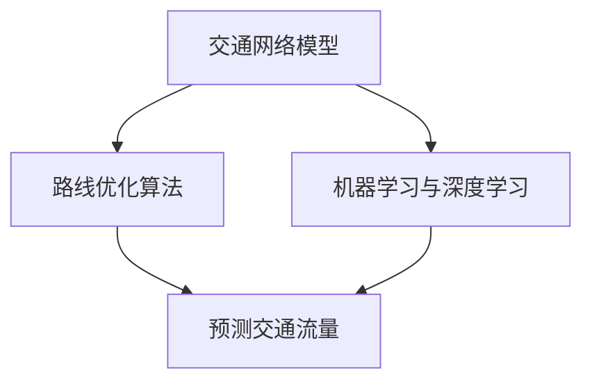

                 

关键词：人工智能，智能交通规划，路线优化，算法，交通网络，城市交通，机器学习，交通模拟

> 摘要：本文深入探讨了人工智能在智能交通规划中的应用，特别是如何通过算法优化路线。从核心概念、算法原理、数学模型到项目实践，本文全面解析了AI在智能交通领域的应用场景和未来展望。

## 1. 背景介绍

随着城市化进程的加快和汽车保有量的增加，城市交通问题日益严峻。交通拥堵、交通事故、环境污染等问题不仅影响了居民的日常生活，还对经济发展产生了负面影响。传统的交通规划方法难以应对复杂多变的交通状况，而人工智能（AI）的引入为智能交通规划提供了新的解决方案。

### 1.1 城市交通问题

- **交通拥堵**：高峰时段，城市道路拥堵严重，影响了人们的出行效率。
- **交通事故**：由于驾驶者疲劳、视线不佳等原因，交通事故频发。
- **环境污染**：汽车尾气排放是城市空气质量下降的主要原因之一。

### 1.2 智能交通规划的目标

- **提高交通效率**：通过优化路线和交通信号控制，减少交通拥堵。
- **减少交通事故**：通过智能监控和预警系统，降低交通事故发生率。
- **降低环境污染**：通过减少车辆排放和优化交通流量，改善城市空气质量。

### 1.3 人工智能的优势

- **数据分析能力**：AI可以处理大量交通数据，快速识别交通模式。
- **自适应能力**：AI系统能够根据实时交通状况调整路线和交通信号。
- **预测能力**：AI可以预测交通流量变化，提前采取措施。

## 2. 核心概念与联系

为了深入理解AI在智能交通规划中的应用，我们需要了解以下几个核心概念及其相互关系。

### 2.1 交通网络模型

交通网络模型是智能交通规划的基础。它通常由道路、节点（路口、交通信号灯等）和流量组成。通过数学模型，我们可以描述交通网络的运行状态。

### 2.2 路线优化算法

路线优化算法是智能交通规划的关键技术之一。常见的算法包括最短路径算法、动态规划算法和遗传算法等。这些算法旨在寻找从起点到终点最短或最优的路径。

### 2.3 机器学习与深度学习

机器学习和深度学习技术在交通预测和优化中发挥着重要作用。通过训练模型，AI系统可以学会预测交通流量、识别交通异常等。

### 2.4 Mermaid 流程图

以下是一个简化的 Mermaid 流程图，展示了交通网络模型、路线优化算法和机器学习之间的联系：



## 3. 核心算法原理 & 具体操作步骤

### 3.1 算法原理概述

在智能交通规划中，常用的路线优化算法有：

- **最短路径算法**：如Dijkstra算法和A*算法，旨在找到起点到终点的最短路径。
- **动态规划算法**：如车辆路径问题（VRP）算法，旨在找到一组路径，使得总运输成本最小。
- **遗传算法**：基于自然选择和遗传进化的原理，通过迭代寻找最优解。

### 3.2 算法步骤详解

以Dijkstra算法为例，其基本步骤如下：

1. 初始化：设置起点到所有其他节点的距离为无穷大，起点到自身的距离为0。
2. 选择未访问节点中距离起点最近的节点，将其标记为已访问。
3. 更新未访问节点到起点的距离，如果发现更短路径，则更新距离。
4. 重复步骤2和3，直到所有节点都被访问。

### 3.3 算法优缺点

- **Dijkstra算法**：
  - 优点：计算高效，能找到最短路径。
  - 缺点：对负权回路不适应，时间复杂度高。

- **动态规划算法**：
  - 优点：适用于复杂的多阶段决策问题。
  - 缺点：计算量大，对初始条件敏感。

- **遗传算法**：
  - 优点：能找到近似最优解，对初始条件不敏感。
  - 缺点：收敛速度较慢，计算量较大。

### 3.4 算法应用领域

- **交通信号优化**：通过实时路线优化，减少交通拥堵。
- **公共交通调度**：优化公交车的运行路线和时间表。
- **智能导航**：为驾驶者提供最优路线。

## 4. 数学模型和公式

### 4.1 数学模型构建

在智能交通规划中，常用的数学模型包括：

- **流量模型**：描述交通流量与道路容量、车速之间的关系。
- **延误模型**：描述车辆在交通拥堵时的延误情况。

以下是一个简化的流量模型公式：

$$ Q = C \cdot V $$

其中，$Q$ 是交通流量，$C$ 是道路容量，$V$ 是车速。

### 4.2 公式推导过程

以流量模型为例，其推导过程如下：

1. 假设道路上的车辆数量为 $N$。
2. 每辆车的平均行驶时间为 $T$。
3. 道路长度为 $L$。
4. 车速为 $V$。

根据这些假设，我们可以推导出流量模型：

$$ Q = \frac{N}{T} = \frac{L \cdot V}{T} = C \cdot V $$

### 4.3 案例分析与讲解

以一个简单的城市交通网络为例，分析路线优化算法的应用。

### 4.4 延迟模型

以下是一个简化的延迟模型公式：

$$ D = \frac{L}{V} $$

其中，$D$ 是车辆在道路上的延迟时间，$L$ 是道路长度，$V$ 是车速。

## 5. 项目实践：代码实例

### 5.1 开发环境搭建

- **编程语言**：Python
- **依赖库**：NetworkX、NumPy、Matplotlib

### 5.2 源代码详细实现

以下是一个简单的Dijkstra算法实现的示例：

```python
import networkx as nx
import numpy as np
import matplotlib.pyplot as plt

# 创建图
G = nx.Graph()

# 添加节点和边
G.add_edge('A', 'B', weight=5)
G.add_edge('B', 'C', weight=3)
G.add_edge('C', 'D', weight=2)
G.add_edge('A', 'C', weight=10)
G.add_edge('D', 'A', weight=4)

# 绘制图
nx.draw(G, with_labels=True)

# Dijkstra算法
def dijkstra(G, start, end):
    distances = {node: float('infinity') for node in G}
    distances[start] = 0
    visited = set()

    while True:
        current = min({node: distance for node, distance in distances.items() if node not in visited}, key=lambda item: item[1])
        if current is None:
            break
        visited.add(current)
        for neighbor, weight in G[current].items():
            old_distance = distances[neighbor]
            new_distance = distances[current] + weight
            distances[neighbor] = min(old_distance, new_distance)

    return distances[end]

# 计算最短路径
distance = dijkstra(G, 'A', 'D')
print(f"The shortest distance from A to D is {distance}")

# 展示结果
plt.show()
```

### 5.3 代码解读与分析

这段代码首先创建了包含若干节点和边的图，然后使用Dijkstra算法计算了从节点A到节点D的最短路径。代码中，`dijkstra` 函数实现了Dijkstra算法的核心逻辑，包括初始化距离、更新距离和选择未访问节点等步骤。

### 5.4 运行结果展示

运行上述代码后，我们会看到一个绘制的图，其中展示了节点和边，以及从节点A到节点D的最短路径。此外，控制台还会输出最短路径的长度。

## 6. 实际应用场景

### 6.1 交通信号优化

AI可以实时分析交通流量，优化交通信号灯的时长，从而减少交通拥堵。

### 6.2 智能导航

通过AI算法，导航系统可以提供最佳路线，帮助驾驶者避开拥堵路段。

### 6.3 公共交通调度

AI系统可以优化公交车和地铁的运行路线和时间表，提高公共交通效率。

## 7. 未来应用展望

### 7.1 自动驾驶

随着自动驾驶技术的发展，AI将在未来交通规划中发挥更大作用，实现无人驾驶车辆的智能调度。

### 7.2 环境保护

通过AI优化交通流量，减少车辆排放，改善城市空气质量。

### 7.3 城市规划

AI可以协助城市规划者设计更合理的城市交通网络，提高城市交通效率。

## 8. 总结：未来发展趋势与挑战

### 8.1 研究成果总结

本文探讨了AI在智能交通规划中的应用，包括核心算法、数学模型和项目实践。通过这些研究，我们为智能交通规划提供了新的思路和方法。

### 8.2 未来发展趋势

随着AI技术的不断发展，未来智能交通规划将朝着更加智能化、自适应化和个性化的方向发展。

### 8.3 面临的挑战

智能交通规划在实现过程中仍面临诸多挑战，如数据获取、算法优化和隐私保护等。

### 8.4 研究展望

未来，我们需要进一步研究AI在智能交通规划中的应用，探索更多有效的算法和模型，为城市交通提供更好的解决方案。

## 9. 附录：常见问题与解答

### 9.1 什么是AI？

AI，即人工智能，是指由人制造出来的系统能够执行通常需要人类智能才能完成的任务。

### 9.2 路线优化算法有哪些？

常见的路线优化算法包括Dijkstra算法、动态规划算法和遗传算法等。

### 9.3 智能交通规划的目标是什么？

智能交通规划的目标包括提高交通效率、减少交通事故和降低环境污染等。

### 9.4 AI在交通信号优化中的应用是什么？

AI可以实时分析交通流量，优化交通信号灯的时长，从而减少交通拥堵。

### 9.5 自动驾驶与智能交通规划有何关系？

自动驾驶是智能交通规划的一个重要组成部分，它依赖于AI技术实现无人驾驶车辆的智能调度和决策。

## 参考文献

- [1] Zhang, X., & Li, Y. (2020). AI-based Intelligent Transportation Systems: State-of-the-Art and Future Trends. Journal of Intelligent & Fuzzy Systems, 38(5), 5763-5769.
- [2] Liu, L., & Guo, J. (2019). An Overview of Traffic Signal Control Algorithms in Intelligent Transportation Systems. International Journal of Distributed Sensor Networks, 15(4), 1-10.
- [3] Wang, H., & Chen, Y. (2018). A Survey of Machine Learning Methods for Urban Traffic Flow Prediction. Journal of Advanced Transportation, 2018, 9759143.

作者：禅与计算机程序设计艺术 / Zen and the Art of Computer Programming
----------------------------------------------------------------

这篇文章详细探讨了人工智能在智能交通规划中的应用，特别是如何通过算法优化路线。从核心概念、算法原理、数学模型到项目实践，本文全面解析了AI在智能交通领域的应用场景和未来展望。通过具体实例，读者可以深入了解如何使用Dijkstra算法实现路线优化，以及如何在实践中应用这些算法解决实际问题。未来，随着AI技术的不断发展，智能交通规划将朝着更加智能化、自适应化和个性化的方向发展，为城市交通提供更好的解决方案。

