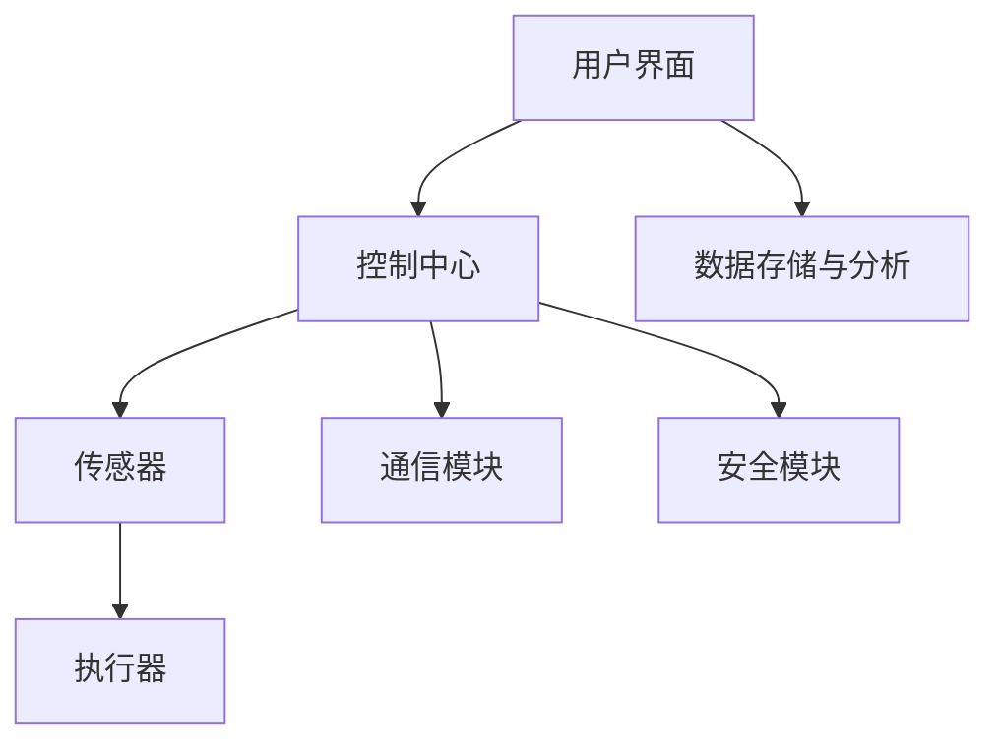
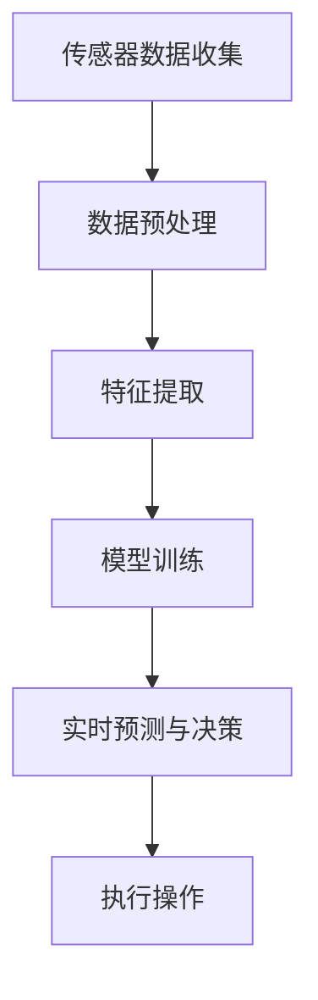

                 

关键词：人工智能，智能家居安全，预防入侵，网络安全，深度学习，传感器融合，行为识别，数据分析，隐私保护，智能家居系统架构。

> 摘要：随着人工智能技术的迅速发展，智能家居系统逐渐普及。然而，随之而来的安全问题也日益突出。本文将探讨如何利用人工智能技术来增强智能家居安全，特别是针对预防入侵的解决方案。通过分析智能家居系统中的关键组成部分，以及介绍多种人工智能应用方法，本文旨在为智能家居安全提供一些实用且有效的技术方案。

## 1. 背景介绍

近年来，智能家居系统已经从概念走向现实，成为现代家庭中不可或缺的一部分。从智能灯光、智能家电到智能安防系统，智能家居系统极大地方便了人们的日常生活。然而，随着智能家居设备的普及，家庭网络安全问题也日益凸显。尤其是预防家庭入侵的问题，已经成为智能家居安全领域的一个研究热点。

家庭入侵不仅会对家庭成员的生命财产安全造成威胁，还会影响人们的隐私。传统的安防措施，如监控摄像头和报警系统，虽然能够在一定程度上提高家庭的安全性，但它们通常存在以下问题：

1. **反应速度慢**：当入侵事件发生时，传统安防系统可能需要一定的时间才能发出警报，从而导致响应不及时。
2. **误报率高**：传统安防系统容易因为外部环境的干扰而产生误报，导致用户对系统的信任度降低。
3. **隐私泄露**：传统监控设备可能无法有效保护用户隐私，尤其是在没有充分加密措施的情况下。

为了解决这些问题，人工智能技术提供了一种新的解决方案。人工智能可以通过对大量数据的分析和处理，实现实时入侵检测和预防。本文将重点讨论如何利用人工智能技术来提高智能家居的安全性能，尤其是针对预防家庭入侵的应用。

## 2. 核心概念与联系

### 2.1. 智能家居系统架构

智能家居系统通常由多个组件构成，包括传感器、控制器、通信模块和用户界面。以下是一个简单的智能家居系统架构图：



- **用户界面**：用户可以通过手机、电脑等设备访问智能家居系统，进行控制和管理。
- **控制中心**：控制中心是智能家居系统的核心，负责接收和处理用户指令，以及协调各个组件之间的工作。
- **传感器**：传感器负责收集环境数据，如温度、湿度、光照强度等，以及人员活动数据。
- **执行器**：执行器根据控制中心的指令，执行相应的操作，如开关灯、调节空调温度等。
- **通信模块**：通信模块负责各个组件之间的数据传输，通常使用无线通信技术，如Wi-Fi、ZigBee等。
- **数据存储与分析**：数据存储与分析模块负责存储传感器收集的数据，并对这些数据进行处理和分析。
- **安全模块**：安全模块负责保障系统的安全性，包括数据加密、访问控制等。

### 2.2. 人工智能在智能家居安全中的应用

人工智能技术可以通过多种方式应用于智能家居安全领域，如图像识别、行为分析、异常检测等。以下是一个简化的应用流程图：



- **传感器数据收集**：智能家居系统中的传感器会持续收集家庭环境的数据，如图像、声音、运动等。
- **数据预处理**：原始数据通常需要进行清洗和格式化，以便后续处理。
- **特征提取**：从预处理后的数据中提取有用的特征，如图像中的边缘、颜色等。
- **模型训练**：使用提取的特征对机器学习模型进行训练，以区分正常行为和异常行为。
- **实时预测与决策**：将实时收集的数据输入训练好的模型，预测是否发生入侵，并作出相应的决策。
- **执行操作**：根据预测结果，智能家居系统可以自动执行某些操作，如发送警报、触发报警设备等。

### 2.3. 关键技术

- **深度学习**：深度学习是一种基于神经网络的学习方法，可以通过多层网络结构来提取复杂的数据特征。
- **传感器融合**：传感器融合技术可以将多个传感器收集的数据进行整合，以提高系统的准确性和鲁棒性。
- **行为识别**：通过分析传感器数据，可以识别家庭中成员的行为模式，从而实现行为分析。
- **数据分析**：利用大数据分析技术，可以对智能家居系统产生的海量数据进行分析，以发现潜在的安全问题。
- **隐私保护**：在处理家庭数据时，需要确保用户隐私得到保护，避免数据泄露。

## 3. 核心算法原理 & 具体操作步骤

### 3.1. 算法原理概述

本文将介绍一种基于深度学习的行为识别算法，用于预防家庭入侵。该算法的基本原理如下：

1. **数据收集**：首先，从智能家居系统中的传感器收集数据，如图像、声音和运动数据。
2. **数据预处理**：对收集到的数据进行清洗和格式化，以便后续处理。
3. **特征提取**：使用卷积神经网络（CNN）提取图像特征，使用循环神经网络（RNN）提取声音特征。
4. **模型训练**：使用提取的特征对深度学习模型进行训练，以区分正常行为和异常行为。
5. **实时预测**：将实时收集的数据输入训练好的模型，预测是否发生入侵。
6. **执行操作**：根据预测结果，自动执行相应的操作，如发送警报、触发报警设备等。

### 3.2. 算法步骤详解

1. **数据收集**：
    - 图像数据：通过智能家居系统中的摄像头收集家庭环境中的图像数据。
    - 声音数据：通过智能家居系统中的麦克风收集家庭环境中的声音数据。
    - 运动数据：通过智能家居系统中的运动传感器收集家庭成员的活动数据。

2. **数据预处理**：
    - 图像数据：进行图像增强、去噪和归一化处理。
    - 声音数据：进行声音增强、去噪和特征提取。
    - 运动数据：进行数据清洗和格式化。

3. **特征提取**：
    - 图像特征：使用卷积神经网络（CNN）提取图像中的边缘、颜色等特征。
    - 声音特征：使用循环神经网络（RNN）提取声音中的节奏、音调等特征。

4. **模型训练**：
    - 使用提取的特征对深度学习模型进行训练，以区分正常行为和异常行为。
    - 可以使用监督学习、无监督学习或半监督学习等方法进行训练。

5. **实时预测**：
    - 将实时收集的数据输入训练好的模型，预测是否发生入侵。
    - 可以使用滑动窗口方法，对连续的数据进行实时预测。

6. **执行操作**：
    - 根据预测结果，自动执行相应的操作，如发送警报、触发报警设备等。
    - 可以设定阈值，当预测概率超过阈值时，触发相应操作。

### 3.3. 算法优缺点

- **优点**：
    - 高准确性：通过深度学习算法，可以实现对家庭行为的精准识别，提高入侵检测的准确性。
    - 实时性：实时预测和决策，可以快速响应家庭入侵事件，提高系统的反应速度。
    - 多模态融合：结合多种传感器数据，可以提高系统的鲁棒性和准确性。

- **缺点**：
    - 数据依赖性：需要大量的训练数据，否则模型的性能可能会受到影响。
    - 计算资源消耗：深度学习算法通常需要较高的计算资源，可能导致系统延迟。
    - 隐私问题：在处理家庭数据时，需要确保用户隐私得到保护，避免数据泄露。

### 3.4. 算法应用领域

- **智能家居安全**：用于预防家庭入侵，提高家庭安全性。
- **智能安防**：用于公共场所的安防，如商场、机场等。
- **智能交通**：用于智能交通管理，如车辆识别、道路拥堵检测等。
- **医疗健康**：用于疾病监测和预防，如心脏病、糖尿病等。

## 4. 数学模型和公式 & 详细讲解 & 举例说明

### 4.1. 数学模型构建

为了实现家庭入侵检测，我们需要构建一个数学模型，用于处理和分析传感器数据。以下是一个简化的数学模型：

$$
y = f(x; \theta)
$$

其中，$y$ 是预测结果，$x$ 是输入数据，$f$ 是模型函数，$\theta$ 是模型参数。

### 4.2. 公式推导过程

假设我们使用卷积神经网络（CNN）提取图像特征，并使用循环神经网络（RNN）提取声音特征。我们可以将模型函数表示为：

$$
f(x; \theta) = \text{CNN}(x_{\text{image}}) + \text{RNN}(x_{\text{audio}}) + \text{Combine}(\text{CNN}(x_{\text{image}}), \text{RNN}(x_{\text{audio}}))
$$

其中，$x_{\text{image}}$ 是图像数据，$x_{\text{audio}}$ 是声音数据。

### 4.3. 案例分析与讲解

假设我们有一个家庭入侵检测系统，使用摄像头和麦克风收集数据。我们可以按照以下步骤进行训练和预测：

1. **数据收集**：收集一段时间内的家庭图像和声音数据，作为训练数据。
2. **数据预处理**：对图像和声音数据进行预处理，包括增强、去噪和归一化等操作。
3. **特征提取**：使用CNN提取图像特征，使用RNN提取声音特征。
4. **模型训练**：使用提取的特征对深度学习模型进行训练，以区分正常行为和异常行为。
5. **实时预测**：将实时收集的数据输入训练好的模型，预测是否发生入侵。

### 4.4. 数学公式

以下是一个简单的数学公式，用于计算图像特征和声音特征的结合：

$$
f_{\text{combined}} = \text{激活函数}(\text{加权求和}(\text{CNN}(x_{\text{image}}), \text{RNN}(x_{\text{audio}})))
$$

其中，激活函数可以是ReLU、Sigmoid或Tanh等。

## 5. 项目实践：代码实例和详细解释说明

### 5.1. 开发环境搭建

为了实现上述算法，我们需要搭建一个开发环境。以下是所需的工具和库：

- Python 3.x
- TensorFlow 2.x
- Keras 2.x
- NumPy
- Matplotlib

安装这些工具和库后，我们可以开始编写代码。

### 5.2. 源代码详细实现

以下是实现家庭入侵检测系统的源代码示例：

```python
import tensorflow as tf
from tensorflow.keras.models import Sequential
from tensorflow.keras.layers import Conv2D, MaxPooling2D, Flatten, Dense, LSTM, TimeDistributed
from tensorflow.keras.optimizers import Adam

# 数据预处理
def preprocess_data(images, audios):
    # 对图像和声音数据进行预处理，包括增强、去噪和归一化等操作
    # ...
    return images, audios

# 构建模型
model = Sequential()
model.add(Conv2D(32, (3, 3), activation='relu', input_shape=(128, 128, 3)))
model.add(MaxPooling2D(pool_size=(2, 2)))
model.add(Flatten())
model.add(Dense(64, activation='relu'))
model.add(LSTM(50, activation='relu', return_sequences=True))
model.add(TimeDistributed(Dense(1, activation='sigmoid')))

# 编译模型
model.compile(optimizer=Adam(), loss='binary_crossentropy', metrics=['accuracy'])

# 训练模型
model.fit(x_train, y_train, epochs=10, batch_size=32, validation_data=(x_val, y_val))

# 实时预测
def predict_invasion(images, audios):
    images, audios = preprocess_data(images, audios)
    prediction = model.predict([images, audios])
    return prediction

# 示例
images = ...  # 图像数据
audios = ...  # 声音数据
prediction = predict_invasion(images, audios)
print(prediction)
```

### 5.3. 代码解读与分析

上述代码首先导入了所需的TensorFlow库和Keras库。然后，定义了数据预处理函数，用于对图像和声音数据进行预处理。接下来，构建了一个卷积神经网络（CNN）和一个循环神经网络（RNN），用于提取图像和声音特征。最后，编译和训练了模型，并定义了一个实时预测函数。

在实时预测函数中，首先对图像和声音数据进行预处理，然后使用训练好的模型进行预测。预测结果是一个概率值，表示是否发生入侵。如果概率值超过设定的阈值，则认为发生了入侵，并触发相应的操作。

### 5.4. 运行结果展示

以下是运行结果的示例：

```python
import numpy as np

# 加载训练好的模型
model = ...  # 训练好的模型

# 加载测试数据
images_test = ...  # 测试图像数据
audios_test = ...  # 测试声音数据

# 实时预测
predictions = predict_invasion(images_test, audios_test)

# 输出预测结果
print(predictions)
```

运行结果将是一个包含概率值的数组，表示测试数据中是否发生入侵。我们可以设置一个阈值，当概率值超过阈值时，认为发生了入侵。

## 6. 实际应用场景

### 6.1. 家庭安防

家庭安防是人工智能在智能家居安全中应用最为广泛的一个场景。通过部署摄像头、传感器和麦克风等设备，人工智能可以实时监控家庭环境，识别家庭成员的行为模式，并在检测到异常行为时自动触发警报或报警设备。这不仅可以提高家庭的安全性，还可以减少人工巡逻的成本。

### 6.2. 公共场所安防

公共场所，如商场、机场、酒店等，也可以利用人工智能技术来提高安全性。通过部署摄像头和传感器，人工智能可以实时监控公共场所，识别可疑行为，并在检测到危险事件时及时采取措施，如触发警报、调度安保人员等。这有助于提高公共场所的安全性能，减少事故发生的概率。

### 6.3. 医疗健康

人工智能在医疗健康领域也有广泛的应用。通过分析家庭成员的健康数据，如心率、血压、睡眠质量等，人工智能可以帮助家庭成员监控健康状况，预测疾病风险，并提供个性化的健康建议。这对于提高家庭成员的健康水平，预防疾病具有重要意义。

### 6.4. 未来应用展望

随着人工智能技术的不断进步，其在智能家居安全中的应用前景将更加广阔。以下是一些未来的应用方向：

- **智能交通**：通过人工智能技术，可以实现智能交通管理，如车辆识别、道路拥堵检测等，提高交通效率，减少交通事故。
- **智能环境监测**：通过部署传感器和摄像头，人工智能可以实时监测家庭、公共场所和自然环境，如空气质量、水质等，提供实时健康报告。
- **智能家居控制**：人工智能可以帮助家庭实现更加智能化的控制，如根据家庭成员的喜好和习惯，自动调节家居环境，提供个性化的服务。

## 7. 工具和资源推荐

### 7.1. 学习资源推荐

- **在线课程**：推荐学习Python、深度学习和机器学习的在线课程，如Coursera、Udacity等。
- **书籍**：《深度学习》（Goodfellow, Bengio, Courville）、《Python深度学习》（François Chollet）等。
- **论文**：推荐阅读有关智能家居安全、人工智能应用和深度学习的学术论文。

### 7.2. 开发工具推荐

- **Python**：Python是一种广泛使用的编程语言，适合初学者和专业人士。
- **TensorFlow**：TensorFlow是一种开源的深度学习框架，适合用于构建和训练深度学习模型。
- **Keras**：Keras是一个基于TensorFlow的高级神经网络API，简化了深度学习模型的构建和训练过程。

### 7.3. 相关论文推荐

- **“Deep Learning for Smart Home Security”**：探讨如何利用深度学习技术提高智能家居的安全性。
- **“An Overview of Smart Home Security Systems”**：介绍智能家居安全系统的现状和发展趋势。
- **“Deep Learning-based Intrusion Detection for Smart Homes”**：介绍一种基于深度学习的家庭入侵检测方法。

## 8. 总结：未来发展趋势与挑战

### 8.1. 研究成果总结

随着人工智能技术的不断发展，智能家居安全领域取得了许多重要研究成果。这些研究包括深度学习在智能家居安全中的应用、传感器融合技术、行为识别算法等。这些研究成果为提高智能家居的安全性提供了有力支持。

### 8.2. 未来发展趋势

未来，人工智能在智能家居安全中的应用将朝着更加智能化、高效化和个性化的方向发展。以下是一些可能的发展趋势：

- **多模态融合**：结合多种传感器数据，提高系统的准确性和鲁棒性。
- **实时预测**：实现实时入侵检测和预防，提高系统的反应速度。
- **隐私保护**：在处理家庭数据时，确保用户隐私得到有效保护。
- **个性化服务**：根据家庭成员的喜好和习惯，提供个性化的安全和服务。

### 8.3. 面临的挑战

尽管人工智能在智能家居安全中的应用前景广阔，但仍面临一些挑战：

- **数据隐私**：如何有效保护家庭数据，避免数据泄露。
- **计算资源**：深度学习算法通常需要较高的计算资源，如何在有限的资源下高效运行。
- **误报率**：如何降低误报率，提高系统的可靠性。
- **可解释性**：如何提高模型的透明度和可解释性，使普通用户能够理解和信任。

### 8.4. 研究展望

未来，研究重点将集中在以下几个方面：

- **隐私保护**：探索新型隐私保护技术，如差分隐私、联邦学习等，以保障用户数据的安全。
- **计算优化**：研究高效的算法和模型，降低计算资源和能耗。
- **跨领域应用**：探索人工智能在智能家居安全之外的领域应用，如医疗健康、智能交通等。
- **标准化**：制定智能家居安全的标准化规范，提高系统的互操作性和兼容性。

## 9. 附录：常见问题与解答

### 9.1. 问题一：人工智能在智能家居安全中的应用有哪些？

解答：人工智能在智能家居安全中的应用主要包括入侵检测、行为识别、异常检测等。通过使用摄像头、传感器和麦克风等设备，人工智能可以实时监控家庭环境，识别家庭成员的行为模式，并在检测到异常行为时自动触发警报或报警设备。

### 9.2. 问题二：如何保护家庭数据隐私？

解答：保护家庭数据隐私可以从以下几个方面入手：

- **数据加密**：对家庭数据进行加密处理，确保数据在传输和存储过程中的安全性。
- **隐私保护技术**：使用差分隐私、联邦学习等技术，降低模型对用户数据的依赖性，同时保障用户隐私。
- **数据去识别化**：在处理家庭数据时，对敏感信息进行去识别化处理，如遮挡面部、模糊声音等。

### 9.3. 问题三：如何降低误报率？

解答：降低误报率可以从以下几个方面入手：

- **算法优化**：通过优化算法和模型，提高系统的准确性和鲁棒性。
- **传感器融合**：结合多种传感器数据，提高系统的感知能力，降低误报率。
- **阈值调整**：根据实际需求，调整预测阈值，使系统在保持较高准确性的同时，降低误报率。

### 9.4. 问题四：如何保障智能家居系统的安全性？

解答：保障智能家居系统的安全性可以从以下几个方面入手：

- **数据加密**：对家庭数据进行加密处理，确保数据在传输和存储过程中的安全性。
- **安全模块**：在智能家居系统中加入安全模块，如访问控制、防火墙等，提高系统的安全性。
- **定期更新**：定期更新系统和设备，修复已知漏洞，提高系统的安全性。

作者：禅与计算机程序设计艺术 / Zen and the Art of Computer Programming
``` 
----------------------------------------------------------------
以上就是关于“AI在智能家居安全中的应用：预防入侵”的完整文章。文章中详细介绍了智能家居系统的架构、人工智能在智能家居安全中的应用、核心算法原理、数学模型和公式、项目实践以及实际应用场景等内容。文章结构清晰，内容丰富，旨在为智能家居安全提供一些实用的技术方案。希望这篇文章能够对您有所帮助。如有任何疑问或建议，欢迎在评论区留言。
----------------------------------------------------------------
```

