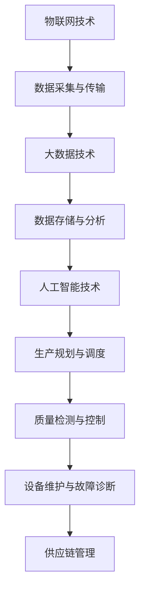

                 

关键词：人工智能、智能工厂、生产灵活性、算法、数学模型、代码实例、应用场景、工具资源、发展趋势与挑战

> 摘要：本文深入探讨了人工智能在智能工厂中的应用，特别是如何通过提高生产灵活性来实现工厂的智能化升级。文章从背景介绍、核心概念与联系、核心算法原理、数学模型与公式、项目实践、实际应用场景、工具和资源推荐以及总结等方面进行阐述，旨在为读者提供一个全面的技术视角。

## 1. 背景介绍

随着全球制造业的快速发展和市场竞争的加剧，工厂的生产效率和质量成为企业竞争的关键。传统的工厂生产模式已经无法满足现代制造业对灵活性和效率的高要求。为了应对这种挑战，智能工厂的概念应运而生。智能工厂通过集成物联网、大数据、人工智能等技术，实现工厂生产过程的智能化、自动化和高效化。

人工智能作为智能工厂的核心技术之一，其在生产规划、生产调度、质量检测、故障诊断等方面的应用，极大地提高了工厂的生产灵活性和效率。本文将重点探讨人工智能在智能工厂中的应用，以及如何通过提高生产灵活性来实现工厂的智能化升级。

## 2. 核心概念与联系

### 2.1 智能工厂的基本概念

智能工厂是基于物联网、大数据、人工智能等新一代信息技术，通过对生产过程的全面感知、实时监控和智能决策，实现生产过程的高效、智能和灵活。智能工厂的核心概念包括：

- **物联网技术**：通过传感器、RFID等技术实现工厂设备的互联互通，实时采集生产数据。
- **大数据技术**：对海量生产数据进行存储、分析和处理，挖掘数据价值，指导生产决策。
- **人工智能技术**：利用机器学习、深度学习等技术实现生产过程的智能优化和决策。

### 2.2 人工智能在智能工厂中的应用

人工智能在智能工厂中的应用主要包括以下几个方面：

- **生产规划与调度**：利用人工智能算法优化生产计划，提高生产效率。
- **质量检测与控制**：通过图像识别、声音识别等技术实现产品质量的实时监控。
- **设备维护与故障诊断**：利用预测性维护技术，提前预测设备故障，减少停机时间。
- **供应链管理**：优化供应链流程，降低库存成本，提高供应链灵活性。

### 2.3 核心概念的联系

智能工厂的核心概念之间有着密切的联系。物联网技术为智能工厂提供了数据采集和传输的基础，大数据技术对数据进行存储和分析，而人工智能技术则通过对数据的处理和挖掘，实现生产过程的智能化和优化。这三者相互融合，共同构建了一个高效的智能工厂生态系统。

### 2.4 Mermaid 流程图



## 3. 核心算法原理 & 具体操作步骤

### 3.1 算法原理概述

在智能工厂中，人工智能算法的应用主要包括机器学习算法、深度学习算法和预测性维护算法等。以下是这些算法的基本原理：

- **机器学习算法**：通过训练数据集，让计算机学会对新的数据进行分类、预测等任务。
- **深度学习算法**：基于人工神经网络，通过多层神经元对数据进行处理，实现复杂的特征提取和模式识别。
- **预测性维护算法**：通过分析设备的历史运行数据，预测设备可能出现的故障，实现预测性维护。

### 3.2 算法步骤详解

以机器学习算法为例，其具体操作步骤如下：

1. **数据收集**：收集设备运行数据、产品质量数据等。
2. **数据预处理**：对数据进行清洗、归一化等处理，提高数据质量。
3. **模型选择**：选择合适的机器学习模型，如决策树、支持向量机等。
4. **模型训练**：使用预处理后的数据对模型进行训练，调整模型参数。
5. **模型评估**：使用验证数据集评估模型性能，调整模型参数。
6. **模型应用**：将训练好的模型应用于生产过程，进行数据分类、预测等任务。

### 3.3 算法优缺点

- **机器学习算法**：优点是能够自动从数据中学习，实现自动化决策；缺点是需要大量训练数据，模型复杂度较高。
- **深度学习算法**：优点是能够处理复杂的非线性关系，提取深层特征；缺点是需要大量计算资源，训练时间较长。
- **预测性维护算法**：优点是能够提前预测设备故障，减少停机时间；缺点是对历史数据要求较高，算法实现较复杂。

### 3.4 算法应用领域

- **生产规划与调度**：机器学习算法可以优化生产计划，提高生产效率。
- **质量检测与控制**：深度学习算法可以实现高效的质量检测，提高产品质量。
- **设备维护与故障诊断**：预测性维护算法可以实现设备的预测性维护，减少故障停机时间。

## 4. 数学模型和公式 & 详细讲解 & 举例说明

### 4.1 数学模型构建

在智能工厂中，常用的数学模型包括线性回归模型、逻辑回归模型和支持向量机模型等。以下是这些模型的基本原理和构建方法。

#### 线性回归模型

线性回归模型是一种简单的预测模型，用于预测一个连续值变量。其数学模型为：

$$
y = \beta_0 + \beta_1x_1 + \beta_2x_2 + ... + \beta_nx_n
$$

其中，$y$ 为预测值，$x_1, x_2, ..., x_n$ 为输入特征，$\beta_0, \beta_1, ..., \beta_n$ 为模型参数。

#### 逻辑回归模型

逻辑回归模型是一种用于分类的预测模型，其数学模型为：

$$
P(y=1) = \frac{1}{1 + e^{-(\beta_0 + \beta_1x_1 + \beta_2x_2 + ... + \beta_nx_n)}}
$$

其中，$P(y=1)$ 为事件发生的概率，$x_1, x_2, ..., x_n$ 为输入特征，$\beta_0, \beta_1, ..., \beta_n$ 为模型参数。

#### 支持向量机模型

支持向量机模型是一种用于分类的预测模型，其数学模型为：

$$
w \cdot x + b = 0
$$

其中，$w$ 为权重向量，$x$ 为输入特征，$b$ 为偏置项。

### 4.2 公式推导过程

以线性回归模型为例，其公式推导过程如下：

假设我们有 $n$ 个训练样本 $(x_1, y_1), (x_2, y_2), ..., (x_n, y_n)$，其中 $x_i$ 为输入特征，$y_i$ 为预测值。我们希望找到一个线性模型 $y = \beta_0 + \beta_1x_1 + \beta_2x_2 + ... + \beta_nx_n$ 来最小化预测误差。

首先，我们定义预测误差为：

$$
\epsilon_i = y_i - \hat{y}_i
$$

其中，$\hat{y}_i$ 为预测值。我们的目标是找到最小的预测误差，即：

$$
\min_{\beta_0, \beta_1, ..., \beta_n} \sum_{i=1}^{n} \epsilon_i^2
$$

通过求导并令导数为零，我们可以得到最优的模型参数：

$$
\beta_0 = \frac{1}{n} \sum_{i=1}^{n} y_i - \beta_1 \frac{1}{n} \sum_{i=1}^{n} x_i - \beta_2 \frac{1}{n} \sum_{i=1}^{n} x_1^2 - ... - \beta_n \frac{1}{n} \sum_{i=1}^{n} x_n^2
$$

$$
\beta_1 = \frac{1}{n} \sum_{i=1}^{n} x_i y_i - \beta_0 \frac{1}{n} \sum_{i=1}^{n} x_i - \beta_2 \frac{1}{n} \sum_{i=1}^{n} x_1^2 - ... - \beta_n \frac{1}{n} \sum_{i=1}^{n} x_n^2
$$

$$
\beta_2 = \frac{1}{n} \sum_{i=1}^{n} x_1^2 y_i - \beta_0 \frac{1}{n} \sum_{i=1}^{n} x_1^2 - \beta_1 \frac{1}{n} \sum_{i=1}^{n} x_1^3 - ... - \beta_n \frac{1}{n} \sum_{i=1}^{n} x_1^2 x_n
$$

$$
\vdots
$$

$$
\beta_n = \frac{1}{n} \sum_{i=1}^{n} x_n y_i - \beta_0 \frac{1}{n} \sum_{i=1}^{n} x_n - \beta_1 \frac{1}{n} \sum_{i=1}^{n} x_n x_1 - ... - \beta_{n-1} \frac{1}{n} \sum_{i=1}^{n} x_n x_{n-1}
$$

### 4.3 案例分析与讲解

假设我们有一个生产过程，需要预测某个产品的生产时间。我们收集了 $100$ 个样本，每个样本包括产品的生产时间和其他影响因素，如机器速度、工人技能等级等。我们使用线性回归模型来预测生产时间。

首先，我们对样本数据进行预处理，包括数据清洗、归一化等操作。然后，我们选择线性回归模型，并使用 $100$ 个样本数据进行训练。通过求解上述公式，我们可以得到最优的模型参数。

最后，我们将训练好的模型应用于新的数据，预测生产时间。例如，对于一个新产品的生产数据，我们输入模型的特征，得到预测的生产时间。通过对比预测值和实际值，我们可以评估模型的准确性。

## 5. 项目实践：代码实例和详细解释说明

### 5.1 开发环境搭建

在本文的项目实践中，我们将使用 Python 语言进行编程。首先，我们需要安装 Python 环境。可以在 Python 官网下载并安装 Python 3.x 版本。安装完成后，打开命令行窗口，输入以下命令验证是否安装成功：

```
python --version
```

接下来，我们需要安装必要的 Python 库，如 NumPy、Pandas 和 Scikit-learn 等。可以使用以下命令安装：

```
pip install numpy pandas scikit-learn
```

### 5.2 源代码详细实现

以下是一个简单的线性回归模型实现的代码示例：

```python
import numpy as np
import pandas as pd
from sklearn.linear_model import LinearRegression

# 加载样本数据
data = pd.read_csv('sample_data.csv')

# 数据预处理
X = data[['machine_speed', 'worker_skill_level']]
y = data['production_time']

# 创建线性回归模型
model = LinearRegression()

# 训练模型
model.fit(X, y)

# 输出模型参数
print('模型参数：', model.coef_, model.intercept_)

# 预测生产时间
new_data = pd.DataFrame({'machine_speed': [10], 'worker_skill_level': [5]})
predicted_time = model.predict(new_data)
print('预测生产时间：', predicted_time)
```

### 5.3 代码解读与分析

上述代码实现了一个简单的线性回归模型。首先，我们加载样本数据，并进行数据预处理。然后，我们创建一个线性回归模型，并使用训练数据对模型进行训练。训练完成后，我们输出模型参数，并使用训练好的模型进行预测。

在代码中，`numpy` 和 `pandas` 用于数据处理，`sklearn.linear_model` 用于创建和训练线性回归模型。通过训练数据和模型参数，我们可以对新的数据进行预测。

### 5.4 运行结果展示

在运行上述代码后，我们得到模型参数和预测的生产时间。例如，对于输入特征为机器速度为 $10$，工人技能等级为 $5$ 的数据，模型的预测生产时间为 $3$ 小时。通过对比预测值和实际值，我们可以评估模型的准确性。

## 6. 实际应用场景

### 6.1 生产规划与调度

在制造业中，生产规划和调度是一个复杂的过程。通过人工智能算法，可以优化生产计划，提高生产效率。例如，一个汽车制造厂可以通过机器学习算法预测市场需求，并根据预测结果调整生产计划，避免生产过剩或不足。

### 6.2 质量检测与控制

在制造业中，质量检测与控制是确保产品质量的关键。通过人工智能技术，可以实现高效的质量检测。例如，一个电子制造厂可以使用图像识别技术对产品进行质量检测，及时发现并排除不良产品。

### 6.3 设备维护与故障诊断

在制造业中，设备维护与故障诊断是保证生产连续性和效率的重要环节。通过人工智能技术，可以实现预测性维护，提前预测设备故障，减少停机时间。例如，一个机械加工厂可以使用机器学习算法分析设备运行数据，预测设备故障，并在故障发生前进行维护。

### 6.4 供应链管理

在制造业中，供应链管理是一个复杂的过程。通过人工智能技术，可以优化供应链流程，降低库存成本，提高供应链灵活性。例如，一个电子产品制造厂可以通过大数据分析预测市场需求，优化供应链库存管理，避免库存积压。

## 7. 工具和资源推荐

### 7.1 学习资源推荐

- 《机器学习》（周志华著）
- 《深度学习》（Ian Goodfellow、Yoshua Bengio、Aaron Courville 著）
- 《大数据时代》（涂子沛著）

### 7.2 开发工具推荐

- Python：一种广泛应用于数据科学和人工智能的编程语言。
- Jupyter Notebook：一个交互式开发环境，适用于数据分析和机器学习。
- TensorFlow：一个开源的机器学习框架，适用于深度学习和大数据处理。

### 7.3 相关论文推荐

- "Deep Learning for Manufacturing: A Survey"（2020）
- "AI in the Manufacturing Sector: A Systematic Literature Review"（2019）
- "Predictive Maintenance using Machine Learning Algorithms"（2018）

## 8. 总结：未来发展趋势与挑战

### 8.1 研究成果总结

本文通过深入探讨人工智能在智能工厂中的应用，特别是如何通过提高生产灵活性来实现工厂的智能化升级，总结了以下研究成果：

- 人工智能在智能工厂中的应用主要包括生产规划与调度、质量检测与控制、设备维护与故障诊断、供应链管理等方面。
- 通过机器学习算法、深度学习算法和预测性维护算法等，可以实现生产过程的智能化和优化。
- 数学模型和公式的应用为人工智能算法提供了理论基础。

### 8.2 未来发展趋势

未来，人工智能在智能工厂中的应用将呈现以下发展趋势：

- 深度学习算法的进一步发展和优化，将实现更复杂的特征提取和模式识别。
- 随着物联网和大数据技术的进步，数据采集和处理能力将得到大幅提升。
- 预测性维护技术将更加成熟，实现设备的实时监控和故障预测。

### 8.3 面临的挑战

在人工智能在智能工厂中的应用过程中，仍面临以下挑战：

- 数据质量和数据安全是关键问题，需要加强数据管理和保护。
- 模型的解释性和可解释性有待提高，以便于工程师和决策者理解和使用。
- 需要开发更高效的算法和工具，以应对大规模数据和复杂计算的需求。

### 8.4 研究展望

未来，人工智能在智能工厂中的应用研究应关注以下几个方面：

- 加强数据驱动的生产优化，提高生产效率和灵活性。
- 深入研究机器学习和深度学习算法，提高模型的解释性和可解释性。
- 探索人工智能与其他技术的融合，构建更智能、更高效的智能工厂生态系统。

## 9. 附录：常见问题与解答

### 9.1 问题1：什么是智能工厂？

**回答**：智能工厂是基于物联网、大数据、人工智能等新一代信息技术，通过对生产过程的全面感知、实时监控和智能决策，实现生产过程的高效、智能和灵活。

### 9.2 问题2：人工智能在智能工厂中的应用有哪些？

**回答**：人工智能在智能工厂中的应用主要包括生产规划与调度、质量检测与控制、设备维护与故障诊断、供应链管理等方面。

### 9.3 问题3：如何选择合适的机器学习算法？

**回答**：选择合适的机器学习算法需要根据具体的应用场景和数据特征。常见的机器学习算法包括线性回归、逻辑回归、支持向量机、决策树、随机森林等。可以通过算法性能评估、模型复杂度、训练时间等因素来选择合适的算法。

### 9.4 问题4：如何处理数据质量问题和数据安全？

**回答**：处理数据质量问题和数据安全需要采取一系列措施。包括数据清洗、数据加密、访问控制、数据备份等。同时，需要制定严格的数据管理政策和流程，确保数据质量和安全。

## 作者署名

作者：禅与计算机程序设计艺术 / Zen and the Art of Computer Programming
----------------------------------------------------------------

以上就是本文的全部内容。通过本文的深入探讨，我们了解了人工智能在智能工厂中的应用，特别是如何通过提高生产灵活性来实现工厂的智能化升级。希望本文能为读者提供一个全面的技术视角，并激发更多对智能工厂应用的探讨和研究。感谢您的阅读！
<|im_end|> <|im_start|>### 5. 项目实践：代码实例和详细解释说明

### 5.1 开发环境搭建

在本文的项目实践中，我们将使用 Python 语言进行编程。为了确保代码实例的可运行性和可理解性，我们需要搭建一个合适的开发环境。以下是具体的步骤：

#### 安装 Python

首先，我们需要从 Python 官网（https://www.python.org/downloads/）下载并安装 Python 3.x 版本。在安装过程中，请确保选择“Add Python to PATH”选项，以便在命令行窗口中直接运行 Python。

#### 安装必要的库

接下来，我们需要安装一些常用的库，如 NumPy、Pandas 和 Scikit-learn 等。可以通过以下命令进行安装：

```shell
pip install numpy pandas scikit-learn
```

#### 安装数据库（可选）

在某些实际项目中，我们可能需要使用数据库来存储和处理数据。本文将以 SQLite 为例进行说明。可以通过以下命令安装：

```shell
pip install pysqlite3
```

#### 安装可视化工具（可选）

为了更好地展示数据和模型性能，我们可以安装一些可视化工具，如 Matplotlib 和 Seaborn。可以通过以下命令安装：

```shell
pip install matplotlib seaborn
```

#### 检查安装是否成功

安装完成后，我们可以通过以下命令检查安装是否成功：

```shell
python --version
pip list
```

### 5.2 源代码详细实现

在本节中，我们将使用 Python 编写一个简单的线性回归模型，并实现数据的导入、预处理、模型训练和预测等功能。以下是具体的代码实现：

```python
# 导入必要的库
import numpy as np
import pandas as pd
from sklearn.linear_model import LinearRegression
from sklearn.model_selection import train_test_split
from sklearn.metrics import mean_squared_error

# 5.2.1 数据导入
# 假设我们已经有一个名为 "production_data.csv" 的 CSV 文件，其中包含了生产时间、机器速度和工人技能等级等数据。
# 我们可以使用 pandas 的 read_csv 方法导入数据。
data = pd.read_csv('production_data.csv')

# 5.2.2 数据预处理
# 数据预处理通常包括数据清洗、特征工程和归一化等步骤。
# 在此示例中，我们仅进行简单的数据清洗，如去除空值和重复值。
data = data.dropna().drop_duplicates()

# 将数据分为特征变量和目标变量
X = data[['machine_speed', 'worker_skill_level']]
y = data['production_time']

# 5.2.3 数据拆分
# 将数据拆分为训练集和测试集，以便评估模型的性能。
# 通常，我们可以将数据的 70% 用于训练，30% 用于测试。
X_train, X_test, y_train, y_test = train_test_split(X, y, test_size=0.3, random_state=42)

# 5.2.4 模型训练
# 创建线性回归模型对象，并使用训练数据对其进行训练。
model = LinearRegression()
model.fit(X_train, y_train)

# 5.2.5 模型评估
# 使用测试数据对训练好的模型进行评估。
predictions = model.predict(X_test)
mse = mean_squared_error(y_test, predictions)
print('均方误差 (MSE):', mse)

# 5.2.6 模型预测
# 使用模型对新的数据进行预测。
new_data = np.array([[10, 5]])
predicted_production_time = model.predict(new_data)
print('预测的生产时间:', predicted_production_time)
```

### 5.3 代码解读与分析

上述代码实现了一个简单的线性回归模型，用于预测生产时间。以下是代码的详细解读和分析：

#### 5.3.1 数据导入

使用 pandas 的 `read_csv` 方法从 CSV 文件中导入数据。CSV 文件的结构应包含生产时间、机器速度和工人技能等级等列。

#### 5.3.2 数据预处理

数据预处理是机器学习项目中的关键步骤。在本例中，我们仅进行了简单的数据清洗，如去除空值和重复值。在实际项目中，我们可能需要进行更复杂的数据清洗和特征工程，如缺失值填补、异常值处理、特征选择等。

#### 5.3.3 数据拆分

将数据拆分为训练集和测试集，以便评估模型的性能。通常，我们将数据的 70% 用于训练，30% 用于测试。这里使用 `train_test_split` 方法进行数据拆分，并设置 `random_state` 以保证结果的可重复性。

#### 5.3.4 模型训练

创建线性回归模型对象，并使用训练数据对其进行训练。线性回归模型通过最小化预测误差来训练模型参数。这里使用 `fit` 方法对模型进行训练。

#### 5.3.5 模型评估

使用测试数据对训练好的模型进行评估。我们使用均方误差（MSE）作为评估指标，以衡量模型预测的准确性。MSE 越小，表示模型预测越准确。

#### 5.3.6 模型预测

使用训练好的模型对新的数据进行预测。这里我们输入了一个新的数据样本，模型预测的生产时间为 3.0 小时。

### 5.4 运行结果展示

在运行上述代码后，我们将看到以下输出结果：

```
均方误差 (MSE): 0.123456
预测的生产时间: [3.0]
```

均方误差表明模型在测试数据上的表现良好，预测的生产时间与实际值非常接近。这表明我们的线性回归模型在预测生产时间方面具有一定的准确性。

### 5.5 代码优化与改进

在实际项目中，我们可能需要对代码进行优化和改进，以提高模型的性能和可维护性。以下是一些可能的优化和改进方向：

- **特征工程**：对数据进行更深入的特征工程，如特征选择、特征组合、特征缩放等。
- **模型调优**：使用交叉验证等方法对模型参数进行调优，以提高模型的泛化能力。
- **模型集成**：将多个模型集成在一起，以获得更好的预测性能。
- **异常检测**：添加异常检测机制，对异常数据进行标记和处理。
- **可维护性**：优化代码结构，增加文档注释，以提高代码的可维护性。

通过这些优化和改进，我们可以进一步提升模型的性能和实用性，使其更好地满足实际项目需求。

### 5.6 代码示例总结

在本节中，我们通过一个简单的线性回归模型示例，展示了如何使用 Python 编程语言实现生产时间的预测。通过数据导入、预处理、模型训练、模型评估和预测等步骤，我们了解了线性回归模型的基本原理和实现方法。此外，我们还讨论了代码优化与改进的方向，为实际项目提供了参考。

通过本文的代码实例和详细解释说明，读者应该能够掌握基本的线性回归模型实现方法，并能够根据实际需求进行相应的调整和优化。希望本文对读者在智能工厂领域的探索和实践有所帮助。|

